---
tags:
  - formation
  - terraform
  - iac
  - hcl
  - infrastructure-as-code
---

# Module 1 : Introduction à Terraform

## Objectifs du Module

À la fin de ce module, vous serez capable de :

- :fontawesome-solid-lightbulb: Comprendre le concept d'Infrastructure as Code
- :fontawesome-solid-code: Écrire du code HCL (HashiCorp Configuration Language)
- :fontawesome-solid-plug: Expliquer le rôle des providers
- :fontawesome-solid-database: Gérer le state Terraform
- :fontawesome-solid-play: Exécuter le workflow plan/apply/destroy

---

## 1. Infrastructure as Code (IaC)

### 1.1 Le Problème de la Gestion Manuelle

```mermaid
graph TB
    subgraph "Gestion Manuelle"
        ADMIN["👤 Admin"]
        GUI["🖥️ GUI (APIC, vCenter, Console Cloud)"]
        INFRA["🏗️ Infrastructure"]

        ADMIN -->|"Clic clic clic..."| GUI
        GUI -->|"Changements"| INFRA
    end

    subgraph "Problèmes"
        P1["❌ Non reproductible"]
        P2["❌ Pas de versioning"]
        P3["❌ Drift entre environnements"]
        P4["❌ Pas d'audit trail"]
        P5["❌ Lent et error-prone"]
    end

    INFRA --> P1
    INFRA --> P2
    INFRA --> P3
    INFRA --> P4
    INFRA --> P5

    style P1 fill:#f44336,color:#fff
    style P2 fill:#f44336,color:#fff
    style P3 fill:#f44336,color:#fff
```



### 1.2 La Solution : Infrastructure as Code

```mermaid
graph TB
    subgraph "Infrastructure as Code"
        CODE["📝 Code (HCL, YAML)"]
        VCS["📁 Git Repository"]
        CICD["🚀 CI/CD Pipeline"]
        TF["🔧 Terraform"]
        INFRA["🏗️ Infrastructure"]

        CODE --> VCS
        VCS --> CICD
        CICD --> TF
        TF -->|"API"| INFRA
    end

    subgraph "Bénéfices"
        B1["✅ Reproductible"]
        B2["✅ Versionné"]
        B3["✅ Code Review"]
        B4["✅ Audit trail"]
        B5["✅ Rapide"]
    end

    INFRA --> B1
    INFRA --> B2
    INFRA --> B3
    INFRA --> B4
    INFRA --> B5

    style CODE fill:#7b42bc,color:#fff
    style B1 fill:#4caf50,color:#fff
    style B2 fill:#4caf50,color:#fff
```



### 1.3 Terraform vs Autres Outils IaC

| Outil | Type | Approche | Multi-Cloud | State |
|-------|------|----------|-------------|-------|
| **Terraform** | Déclaratif | Plan → Apply | ✅ Oui | Oui |
| **Ansible** | Impératif/Déclaratif | Tasks séquentielles | ✅ Oui | Non |
| **Pulumi** | Impératif | Code réel (Python, Go) | ✅ Oui | Oui |
| **CloudFormation** | Déclaratif | Stacks | ❌ AWS only | Oui (implicite) |
| **ARM/Bicep** | Déclaratif | Templates | ❌ Azure only | Oui (implicite) |

!!! info "Pourquoi Terraform pour ACI ?"
    - **Provider officiel** Cisco pour ACI
    - **Déclaratif** : on décrit l'état souhaité
    - **Plan** : prévisualisation avant application
    - **Multi-plateforme** : ACI + Cloud + autres

---

## 2. Concepts Fondamentaux Terraform

### 2.1 Architecture Terraform

```mermaid
graph TB
    subgraph "Terraform Core"
        TF["🔧 Terraform CLI"]
        PARSER["📄 HCL Parser"]
        GRAPH["📊 Dependency Graph"]
        PLAN["📋 Plan Engine"]
    end

    subgraph "Providers"
        P_ACI["🌐 ACI Provider"]
        P_AWS["☁️ AWS Provider"]
        P_AZURE["☁️ Azure Provider"]
    end

    subgraph "State"
        STATE["💾 terraform.tfstate"]
    end

    subgraph "Infrastructure"
        ACI["🌐 ACI Fabric"]
        AWS["☁️ AWS"]
        AZURE["☁️ Azure"]
    end

    TF --> PARSER --> GRAPH --> PLAN
    PLAN --> P_ACI --> ACI
    PLAN --> P_AWS --> AWS
    PLAN --> P_AZURE --> AZURE
    PLAN <--> STATE

    style TF fill:#7b42bc,color:#fff
    style P_ACI fill:#049fd9,color:#fff
```



### 2.2 Concepts Clés

| Concept | Description | Exemple |
|---------|-------------|---------|
| **Provider** | Plugin pour communiquer avec une API | `aci`, `aws`, `azurerm` |
| **Resource** | Objet d'infrastructure à créer | `aci_tenant`, `aws_instance` |
| **Data Source** | Lecture d'info existante (read-only) | `data.aci_tenant.existing` |
| **Variable** | Paramètre d'entrée | `var.tenant_name` |
| **Output** | Valeur de sortie | `output.tenant_dn` |
| **Module** | Groupe de ressources réutilisable | `module.tenant` |
| **State** | État actuel de l'infrastructure | `terraform.tfstate` |

### 2.3 Workflow Terraform

```mermaid
sequenceDiagram
    participant User as 👤 Utilisateur
    participant TF as 🔧 Terraform
    participant State as 💾 State
    participant API as 🌐 API (ACI)

    User->>TF: terraform init
    TF->>TF: Télécharge providers

    User->>TF: terraform plan
    TF->>State: Lit l'état actuel
    TF->>API: Interroge l'API
    TF->>User: Affiche les changements prévus

    User->>TF: terraform apply
    TF->>API: Applique les changements
    API->>TF: Confirme
    TF->>State: Met à jour le state

    User->>TF: terraform destroy
    TF->>API: Supprime les ressources
    TF->>State: Met à jour le state
```



---

## 3. Le Langage HCL

### 3.1 Syntaxe de Base

```hcl
# Commentaire sur une ligne

/*
  Commentaire
  multi-lignes
*/

# Bloc de configuration
resource "type_ressource" "nom_local" {
  argument1 = "valeur"
  argument2 = 42
  argument3 = true

  bloc_nested {
    nested_arg = "valeur"
  }
}
```

### 3.2 Types de Données

```hcl
# String
name = "mon-tenant"

# Number
vlan_id = 100

# Boolean
enabled = true

# List
vlans = [100, 101, 102]

# Map
tags = {
  environment = "production"
  owner       = "network-team"
}

# Object
config = {
  name    = "web-server"
  port    = 443
  enabled = true
}
```

### 3.3 Références et Interpolation

```hcl
# Référence à une variable
tenant_name = var.tenant_name

# Référence à une ressource
vrf_dn = aci_vrf.production.id

# Référence à un data source
existing_tenant = data.aci_tenant.existing.id

# Interpolation dans une string
description = "Tenant for ${var.environment} environment"

# Fonctions
upper_name = upper(var.tenant_name)
```

### 3.4 Exemple Complet

```hcl
# variables.tf
variable "tenant_name" {
  description = "Nom du tenant ACI"
  type        = string
  default     = "Demo-Tenant"
}

variable "environment" {
  description = "Environnement (dev, staging, prod)"
  type        = string
  validation {
    condition     = contains(["dev", "staging", "prod"], var.environment)
    error_message = "Environment must be dev, staging, or prod."
  }
}

# main.tf
terraform {
  required_providers {
    aci = {
      source  = "CiscoDevNet/aci"
      version = "~> 2.0"
    }
  }
}

provider "aci" {
  username = var.apic_username
  password = var.apic_password
  url      = var.apic_url
  insecure = true
}

resource "aci_tenant" "main" {
  name        = var.tenant_name
  description = "Tenant for ${var.environment}"

  annotation = "orchestrator:terraform"
}

# outputs.tf
output "tenant_dn" {
  description = "DN du tenant créé"
  value       = aci_tenant.main.id
}
```

---

## 4. Le State Terraform

### 4.1 Qu'est-ce que le State ?

```mermaid
graph TB
    subgraph "State = Source of Truth"
        STATE["💾 terraform.tfstate"]

        subgraph "Contenu"
            MAPPING["🔗 Mapping code ↔ ressources réelles"]
            META["📋 Métadonnées (ID, attributs)"]
            DEPS["🔀 Dépendances"]
        end
    end

    CODE["📝 Code HCL"]
    INFRA["🏗️ Infrastructure Réelle"]

    CODE --> STATE
    STATE --> INFRA

    STATE --> MAPPING
    STATE --> META
    STATE --> DEPS

    style STATE fill:#ff9800,color:#fff
```



### 4.2 State Local vs Remote

```mermaid
graph TB
    subgraph "State Local (défaut)"
        LOCAL["💻 terraform.tfstate<br/>sur votre machine"]
        PROBLEM1["❌ Pas de collaboration"]
        PROBLEM2["❌ Risque de perte"]
        PROBLEM3["❌ Pas de locking"]
    end

    subgraph "State Remote (recommandé)"
        REMOTE["☁️ Backend distant<br/>(S3, Azure Blob, GCS, Consul)"]
        BENEFIT1["✅ Collaboration équipe"]
        BENEFIT2["✅ Sauvegardé"]
        BENEFIT3["✅ Locking"]
    end

    LOCAL --> PROBLEM1
    LOCAL --> PROBLEM2
    LOCAL --> PROBLEM3

    REMOTE --> BENEFIT1
    REMOTE --> BENEFIT2
    REMOTE --> BENEFIT3

    style LOCAL fill:#f44336,color:#fff
    style REMOTE fill:#4caf50,color:#fff
```



### 4.3 Configuration Backend Remote

```hcl
# backend.tf
terraform {
  backend "s3" {
    bucket         = "worldline-terraform-state"
    key            = "aci/production/terraform.tfstate"
    region         = "eu-west-3"
    encrypt        = true
    dynamodb_table = "terraform-locks"
  }
}

# Alternative : Azure Blob
terraform {
  backend "azurerm" {
    resource_group_name  = "terraform-state-rg"
    storage_account_name = "wltfstate"
    container_name       = "tfstate"
    key                  = "aci/production/terraform.tfstate"
  }
}

# Alternative : Terraform Cloud
terraform {
  cloud {
    organization = "worldline"
    workspaces {
      name = "aci-production"
    }
  }
}
```

### 4.4 Commandes State

```bash
# Lister les ressources dans le state
terraform state list

# Afficher une ressource spécifique
terraform state show aci_tenant.main

# Déplacer une ressource (renommage)
terraform state mv aci_tenant.old aci_tenant.new

# Supprimer du state (sans supprimer la ressource)
terraform state rm aci_tenant.imported

# Importer une ressource existante dans le state
terraform import aci_tenant.existing uni/tn-MyTenant
```

---

## 5. Commandes Essentielles

### 5.1 Workflow Principal

```bash
# 1. Initialisation (télécharge providers, configure backend)
terraform init

# 2. Validation syntaxique
terraform validate

# 3. Formatage du code
terraform fmt

# 4. Plan (prévisualisation des changements)
terraform plan

# 5. Application des changements
terraform apply

# 6. Application automatique (CI/CD)
terraform apply -auto-approve

# 7. Destruction de l'infrastructure
terraform destroy
```

### 5.2 Lecture du Plan

```
Terraform will perform the following actions:

  # aci_tenant.main will be created
  + resource "aci_tenant" "main" {
      + id          = (known after apply)
      + name        = "Demo-Tenant"
      + description = "Tenant for production"
      + annotation  = "orchestrator:terraform"
    }

  # aci_vrf.production will be created
  + resource "aci_vrf" "production" {
      + id        = (known after apply)
      + name      = "VRF-Prod"
      + tenant_dn = (known after apply)
    }

Plan: 2 to add, 0 to change, 0 to destroy.
```

| Symbole | Signification |
|---------|---------------|
| `+` | Ressource à créer |
| `-` | Ressource à supprimer |
| `~` | Ressource à modifier |
| `-/+` | Ressource à recréer (destroy + create) |

### 5.3 Options Utiles

```bash
# Plan avec sortie dans un fichier
terraform plan -out=tfplan

# Apply depuis un fichier plan
terraform apply tfplan

# Plan ciblé sur une ressource
terraform plan -target=aci_tenant.main

# Variables en ligne de commande
terraform apply -var="tenant_name=MyTenant"

# Fichier de variables
terraform apply -var-file="production.tfvars"

# Refresh du state (sync avec l'API)
terraform refresh
```

---

## 6. Exercice Pratique

### 6.1 Premier Projet Terraform

!!! example "Exercice : Hello Terraform"

    Créez votre premier projet Terraform qui affiche un message.

    **Structure :**
    ```
    hello-terraform/
    ├── main.tf
    ├── variables.tf
    └── outputs.tf
    ```

??? quote "Solution"

    **variables.tf**
    ```hcl
    variable "name" {
      description = "Votre nom"
      type        = string
      default     = "World"
    }
    ```

    **main.tf**
    ```hcl
    terraform {
      required_version = ">= 1.0"
    }

    locals {
      greeting = "Hello, ${var.name}!"
      timestamp = timestamp()
    }
    ```

    **outputs.tf**
    ```hcl
    output "greeting" {
      description = "Message de bienvenue"
      value       = local.greeting
    }

    output "timestamp" {
      description = "Heure d'exécution"
      value       = local.timestamp
    }
    ```

    **Exécution :**
    ```bash
    terraform init
    terraform plan
    terraform apply -var="name=Worldline"
    ```

    **Résultat attendu :**
    ```
    Apply complete! Resources: 0 added, 0 changed, 0 destroyed.

    Outputs:

    greeting = "Hello, Worldline!"
    timestamp = "2024-01-15T10:30:00Z"
    ```

---

## 7. Bonnes Pratiques

### 7.1 Structure de Projet

```
projet-terraform/
├── main.tf           # Ressources principales
├── variables.tf      # Déclaration des variables
├── outputs.tf        # Valeurs de sortie
├── providers.tf      # Configuration des providers
├── backend.tf        # Configuration du state remote
├── versions.tf       # Contraintes de versions
├── terraform.tfvars  # Valeurs des variables (non versionné)
└── modules/          # Modules réutilisables
    └── tenant/
        ├── main.tf
        ├── variables.tf
        └── outputs.tf
```

### 7.2 Conventions de Nommage

| Élément | Convention | Exemple |
|---------|------------|---------|
| **Fichiers** | snake_case.tf | `main.tf`, `aci_tenant.tf` |
| **Resources** | snake_case | `aci_tenant.production` |
| **Variables** | snake_case | `var.tenant_name` |
| **Outputs** | snake_case | `output.tenant_dn` |
| **Modules** | kebab-case (dossier) | `modules/aci-tenant` |

### 7.3 Règles d'Or

!!! success "À faire"
    - ✅ Versionner le code (Git)
    - ✅ Utiliser un backend remote
    - ✅ Séparer les environnements (workspaces ou dossiers)
    - ✅ Utiliser des modules pour la réutilisation
    - ✅ Documenter les variables
    - ✅ Valider avec `terraform validate` et `terraform fmt`

!!! danger "À éviter"
    - ❌ Commit le state (`terraform.tfstate`)
    - ❌ Commit les secrets (`terraform.tfvars` avec credentials)
    - ❌ `terraform apply` sans `terraform plan`
    - ❌ Modifier manuellement le state
    - ❌ Hardcoder les valeurs sensibles

---

## 8. Quiz de Validation

!!! question "Question 1"
    Quelle commande permet de prévisualiser les changements sans les appliquer ?

    ??? success "Réponse"
        `terraform plan`

        Cette commande compare l'état désiré (code) avec l'état actuel (state + API) et affiche les changements prévus.

!!! question "Question 2"
    Qu'est-ce que le state Terraform et pourquoi est-il important ?

    ??? success "Réponse"
        Le **state** est un fichier JSON qui maintient la correspondance entre :
        - Le code HCL (état désiré)
        - Les ressources réelles (état actuel)

        Il permet à Terraform de :
        - Savoir ce qui existe déjà
        - Calculer les changements nécessaires
        - Gérer les dépendances entre ressources

!!! question "Question 3"
    Pourquoi utiliser un backend remote pour le state ?

    ??? success "Réponse"
        - **Collaboration** : Plusieurs personnes peuvent travailler sur la même infra
        - **Locking** : Évite les modifications concurrentes
        - **Sécurité** : State sauvegardé, chiffré
        - **Pas de perte** : Ne dépend pas d'une machine locale

!!! question "Question 4"
    Que signifie le symbole `~` dans un plan Terraform ?

    ??? success "Réponse"
        **Modification in-place** : la ressource va être modifiée sans être supprimée et recréée.

        Exemples :
        - `+` = création
        - `-` = suppression
        - `~` = modification
        - `-/+` = remplacement (destroy + create)

---

## 9. Résumé

| Concept | Description |
|---------|-------------|
| **IaC** | Gérer l'infrastructure comme du code versionné |
| **HCL** | Langage déclaratif de Terraform |
| **Provider** | Plugin pour communiquer avec une API |
| **Resource** | Objet d'infrastructure à gérer |
| **State** | Mapping entre code et ressources réelles |
| **Plan** | Prévisualisation des changements |
| **Apply** | Application des changements |

---

## Navigation

| Précédent | Suivant |
|-----------|---------|
| [← Introduction](index.md) | [Module 2 : Architecture Cisco ACI →](02-module.md) |
