---
tags:
  - formation
  - aci
  - cisco
  - sdn
  - datacenter
  - fabric
---

# Module 2 : Architecture Cisco ACI

## Objectifs du Module

À la fin de ce module, vous serez capable de :

- :fontawesome-solid-network-wired: Expliquer l'architecture physique d'une fabric ACI
- :fontawesome-solid-server: Différencier les rôles Spine, Leaf et APIC
- :fontawesome-solid-sitemap: Comprendre le modèle SDN (Software-Defined Networking)
- :fontawesome-solid-layer-group: Décrire la topologie Clos (Spine-Leaf)
- :fontawesome-solid-gears: Appréhender le fonctionnement de l'APIC

**Durée estimée : 4 heures**

---

## Qu'est-ce que Cisco ACI ?

### Le Problème : Réseaux Traditionnels

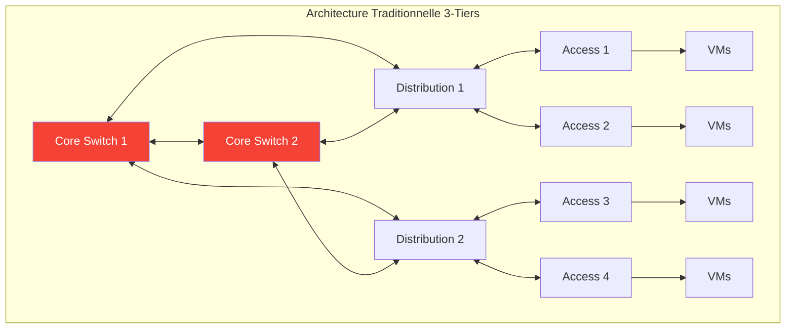

**Problèmes des architectures traditionnelles :**

| Problème | Impact |
|----------|--------|
| **Spanning Tree Protocol (STP)** | Bloque 50% des liens (redondance passive) |
| **Configuration manuelle** | Erreurs humaines, drift, lenteur |
| **VLAN everywhere** | Limite à 4094 VLANs, pas de mobilité |
| **Pas de micro-segmentation** | Tout communique dans un VLAN |
| **Silos** | Network, Security, Server = équipes séparées |

### La Solution : Cisco ACI

**ACI = Application Centric Infrastructure**

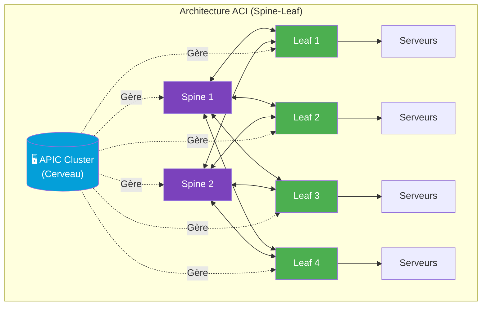

!!! success "Avantages ACI"
    - **Tous les liens actifs** : ECMP (Equal-Cost Multi-Path), pas de STP
    - **Automatisation native** : API REST, Terraform, Ansible
    - **Overlay VXLAN** : 16 millions de segments (vs 4094 VLANs)
    - **Micro-segmentation** : Contrôle par application (EPG)
    - **Single Pane of Glass** : APIC gère tout centralement

---

## Architecture Physique : Spine-Leaf

### Topologie Clos

L'architecture Spine-Leaf est une topologie **Clos** (inventée par Charles Clos en 1953) adaptée aux datacenters modernes.

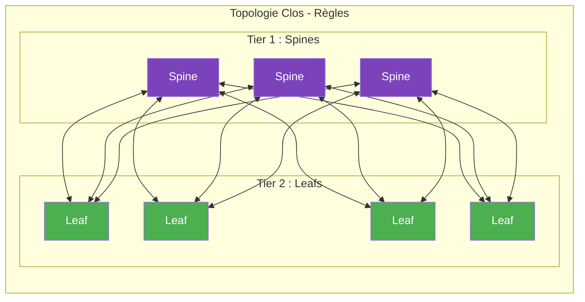

**Règles fondamentales :**

| Règle | Description |
|-------|-------------|
| **Chaque Leaf connecté à tous les Spines** | Full-mesh entre tiers |
| **Pas de connexion Spine-Spine** | Les Spines ne se parlent jamais directement |
| **Pas de connexion Leaf-Leaf** | Les Leafs ne se parlent jamais directement* |
| **Trafic toujours : Leaf → Spine → Leaf** | Maximum 2 hops |

!!! note "* Exception : vPC (Virtual Port Channel)"
    Deux Leafs peuvent former une paire vPC pour connecter un serveur avec 2 liens actifs (LACP). C'est une connexion **logique** pour le serveur, pas un lien direct entre Leafs.

### Rôle des Spines

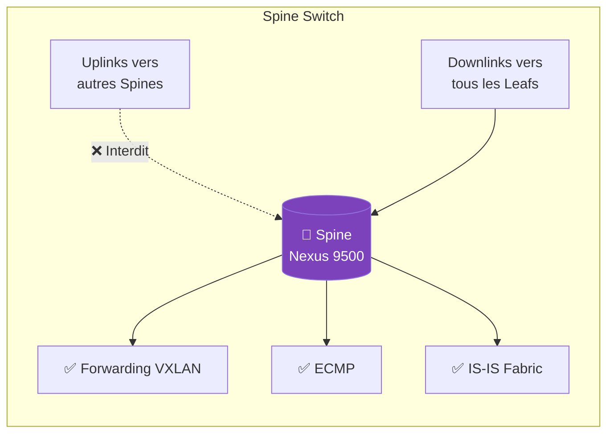

**Caractéristiques des Spines :**

- **Rôle** : Transit et forwarding uniquement
- **Pas d'endpoints** : Jamais de serveurs connectés directement
- **High bandwidth** : Ports 40G/100G/400G
- **Matériel** : Nexus 9500 Series (N9K-C9504, N9K-C9508, N9K-C9516)
- **Nombre recommandé** : 2 minimum, 4 pour les grandes fabrics

### Rôle des Leafs

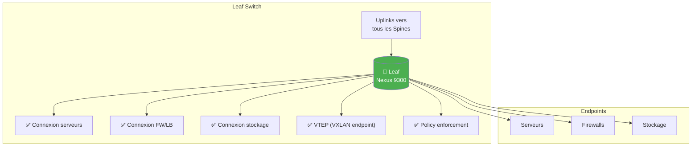

**Types de Leafs :**

| Type | Rôle | Exemple |
|------|------|---------|
| **Compute Leaf** | Connexion des serveurs | Hyperviseurs, bare-metal |
| **Service Leaf** | Connexion des appliances | Firewalls, Load Balancers |
| **Border Leaf** | Connexion externe (L3Out) | Routeurs WAN, Internet |

### Matériel Cisco ACI

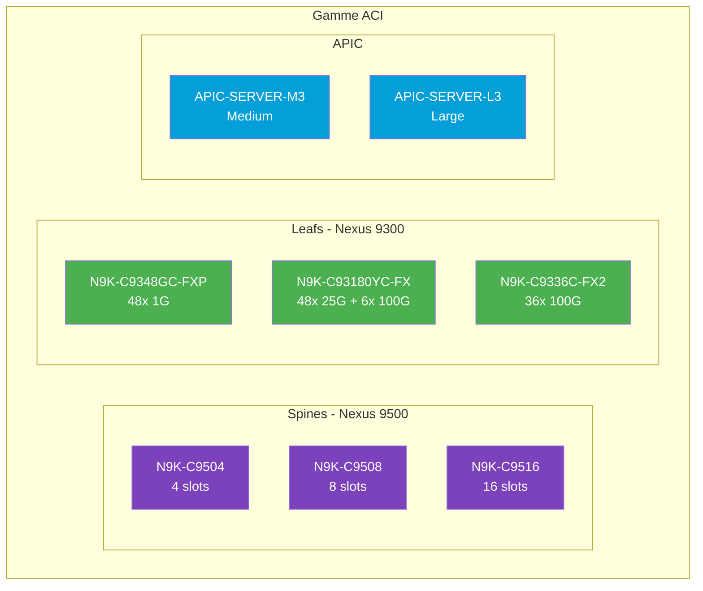

---

## L'APIC : Le Cerveau de la Fabric

### Qu'est-ce que l'APIC ?

**APIC = Application Policy Infrastructure Controller**

L'APIC est le **contrôleur SDN** centralisé qui gère toute la fabric ACI.

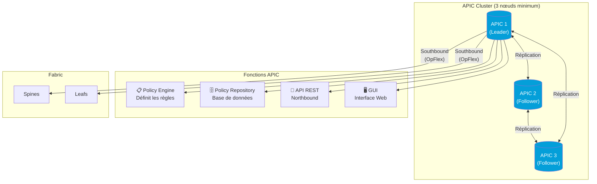

### Haute Disponibilité APIC

| Configuration | Description | Recommandation |
|---------------|-------------|----------------|
| **3 APICs** | Quorum, tolère 1 panne | Production standard |
| **5 APICs** | Tolère 2 pannes | Grande fabric critique |
| **7 APICs** | Tolère 3 pannes | Multi-datacenter |

!!! warning "Important : L'APIC n'est PAS dans le data path"
    Si tous les APICs tombent, la fabric **continue de fonctionner** avec la dernière configuration. Vous perdez seulement la capacité de faire des changements.

### Interfaces de l'APIC

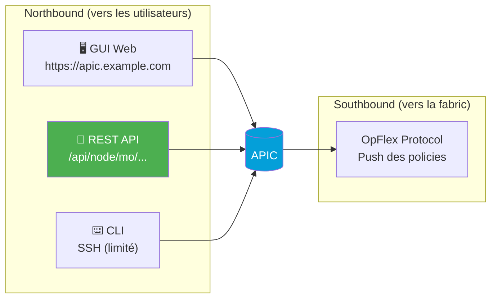

**Northbound API (REST) :**

```bash
# Exemple : Lister tous les Tenants
curl -k -X GET "https://apic.example.com/api/node/class/fvTenant.json" \
  -H "Cookie: APIC-Cookie=${TOKEN}"

# Réponse JSON
{
  "totalCount": "3",
  "imdata": [
    {"fvTenant": {"attributes": {"name": "infra"}}},
    {"fvTenant": {"attributes": {"name": "common"}}},
    {"fvTenant": {"attributes": {"name": "mgmt"}}}
  ]
}
```

---

## Modèle SDN : Overlay et Underlay

### Architecture en Couches

ACI utilise une architecture **overlay/underlay** basée sur VXLAN.

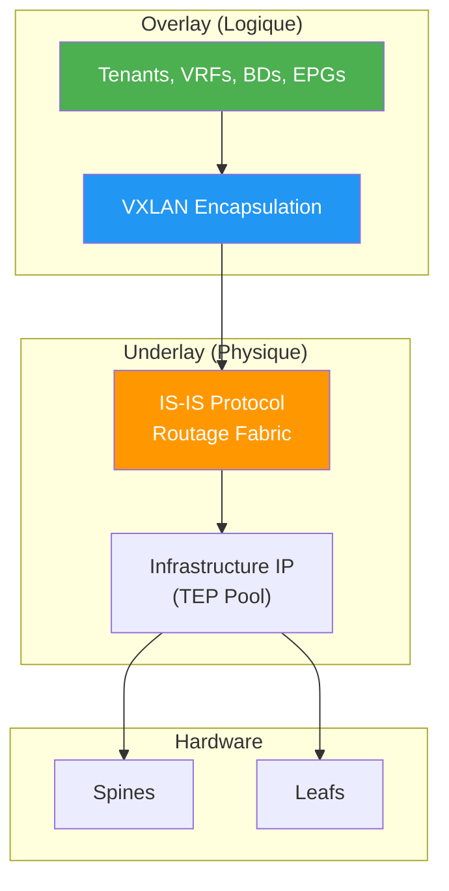

### Underlay : IS-IS et TEP

**IS-IS (Intermediate System to Intermediate System)**

- Protocole de routage **interne** à la fabric
- Transporte les routes des TEP (Tunnel Endpoints)
- **Vous ne le configurez jamais** : automatique

**TEP (Tunnel Endpoint)**

- Chaque Leaf a une adresse TEP (IP du tunnel VXLAN)
- Pool configuré lors de l'initialisation (ex: 10.0.0.0/16)
- Les Spines ont aussi des TEP (pour le multicast)

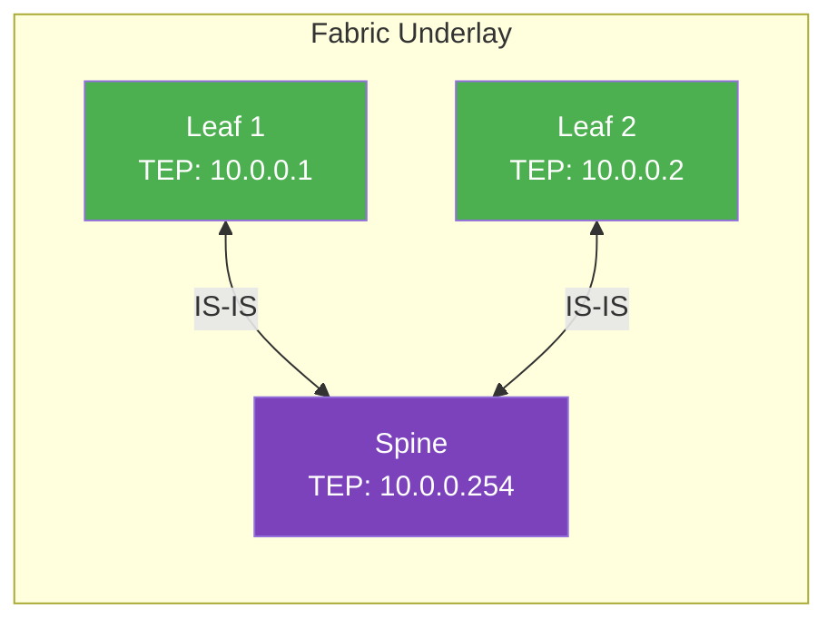

### Overlay : VXLAN

**VXLAN (Virtual Extensible LAN)**

- Encapsule le trafic Layer 2 dans UDP (port 4789)
- VNI (VXLAN Network Identifier) : 24 bits = 16 millions de segments
- Permet la mobilité des VMs entre Leafs

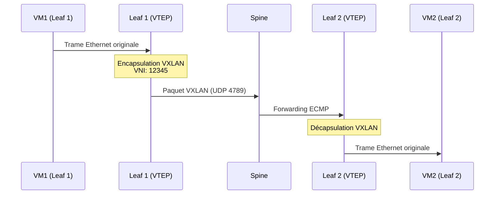

**Structure d'un paquet VXLAN :**

```
+--------------------+
| Outer Ethernet     | <- MAC du Spine/Leaf
+--------------------+
| Outer IP           | <- TEP Source → TEP Dest
+--------------------+
| Outer UDP          | <- Port 4789
+--------------------+
| VXLAN Header       | <- VNI (24 bits)
+--------------------+
| Inner Ethernet     | <- Trame originale
+--------------------+
| Inner IP           | <- IP de la VM
+--------------------+
| Payload            |
+--------------------+
```

---

## Découverte et Initialisation de la Fabric

### Processus de Discovery

Quand vous connectez un nouveau switch à la fabric :

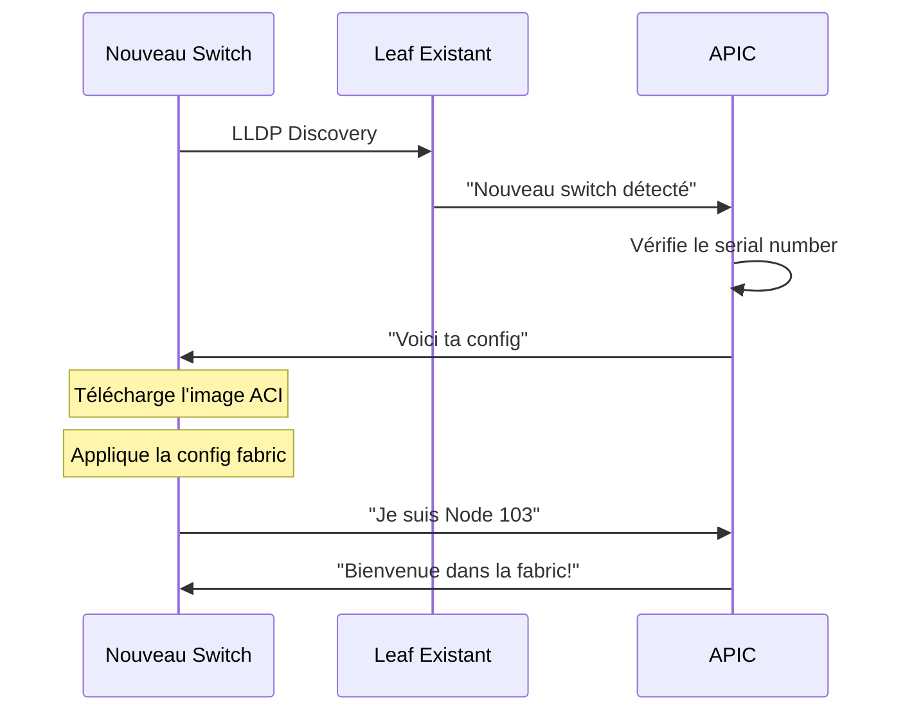

### Étapes d'Initialisation

1. **Connexion physique** : Câbles vers les Spines existants
2. **LLDP Discovery** : Le switch annonce son serial number
3. **APIC Registration** : L'admin valide le nouveau node
4. **Image Download** : Le switch télécharge l'ACI firmware
5. **Configuration Push** : APIC envoie la config via OpFlex
6. **Fabric Membership** : Le switch rejoint la fabric

### Configuration Initiale APIC

Lors du premier démarrage de l'APIC :

```bash
# Assistant de configuration initiale
Cluster configuration:
  Fabric name: PROD-FABRIC-PARIS
  Fabric ID: 1
  Number of controllers: 3
  Controller ID: 1
  Controller name: APIC1

Network configuration:
  Out-of-band IP: 192.168.1.10/24
  Out-of-band gateway: 192.168.1.1

TEP address pool: 10.0.0.0/16
Infra VLAN: 4093
```

!!! tip "Bonnes Pratiques - Initialisation"
    - **Fabric name** : Utilisez un nom parlant (site, environnement)
    - **TEP Pool** : Prévoyez large (/16 permet 65k endpoints)
    - **Infra VLAN** : Choisissez un VLAN non utilisé ailleurs
    - **Cluster impair** : Toujours 3, 5 ou 7 APICs (quorum)

---

## Comparaison : Traditionnel vs ACI

### Tableau Comparatif

| Aspect | Réseau Traditionnel | Cisco ACI |
|--------|---------------------|-----------|
| **Topologie** | 3-tiers (Core/Dist/Access) | 2-tiers (Spine/Leaf) |
| **Protocole L2** | STP (bloque 50% liens) | VXLAN + ECMP (100% actif) |
| **Segmentation** | VLANs (4094 max) | EPGs + VNI (16M segments) |
| **Sécurité** | ACLs sur chaque switch | Contracts centralisés |
| **Configuration** | CLI switch par switch | API centralisée (APIC) |
| **Visibilité** | Par équipement | Vue application |
| **Automatisation** | Scripts custom | API native, Terraform |
| **Multi-tenancy** | VRF manuels | Tenants isolés natifs |

### Exemple Concret : Ajouter un VLAN

**Méthode Traditionnelle :**

```bash
# Sur CHAQUE switch (10 switches = 10 connexions SSH)
Switch1# configure terminal
Switch1(config)# vlan 100
Switch1(config-vlan)# name PROD-WEB
Switch1(config)# interface range Gi1/0/1-24
Switch1(config-if)# switchport access vlan 100
Switch1(config)# exit
Switch1# write memory

# Répéter sur Switch2, Switch3, ... Switch10
# Risque d'erreur : typo sur un switch, VLAN 1000 au lieu de 100
```

**Méthode ACI (Terraform) :**

```hcl
# Une seule déclaration, déployée partout automatiquement
resource "aci_application_epg" "web" {
  application_profile_dn = aci_application_profile.app.id
  name                   = "PROD-WEB"
  relation_fv_rs_bd      = aci_bridge_domain.web.id
}

resource "aci_epg_to_domain" "web_vmm" {
  application_epg_dn = aci_application_epg.web.id
  tdn                = data.aci_vmm_domain.vmware.id
}

# terraform apply → Déployé sur toute la fabric en 30 secondes
```

---

## Architecture Multi-Pod et Multi-Site

### Multi-Pod : Même Fabric, Plusieurs Salles

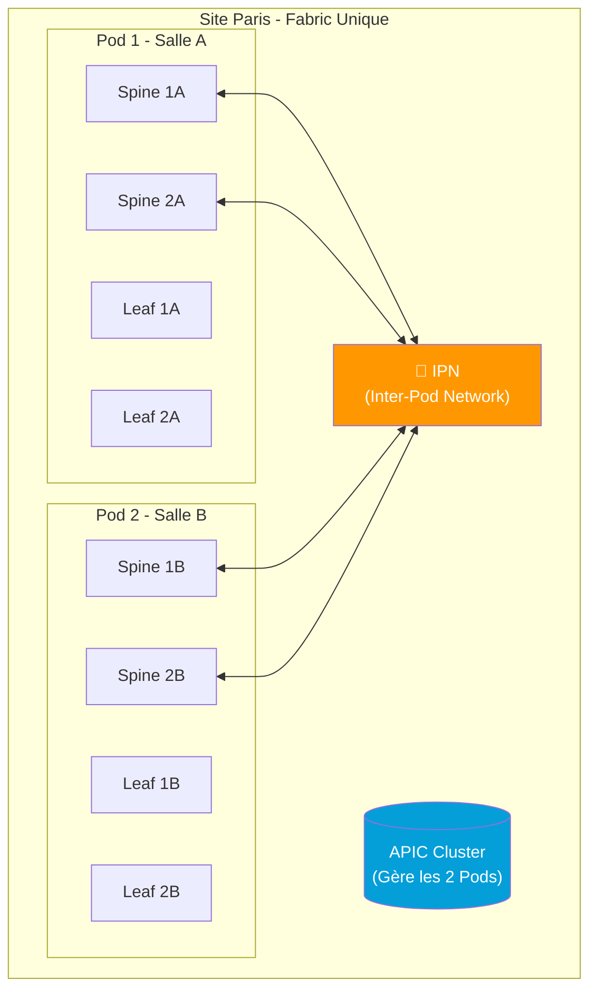

**Multi-Pod : Cas d'usage**

- Même datacenter, salles différentes
- Latence < 50ms entre Pods
- Un seul cluster APIC gère tout

### Multi-Site : Plusieurs Fabrics Indépendantes

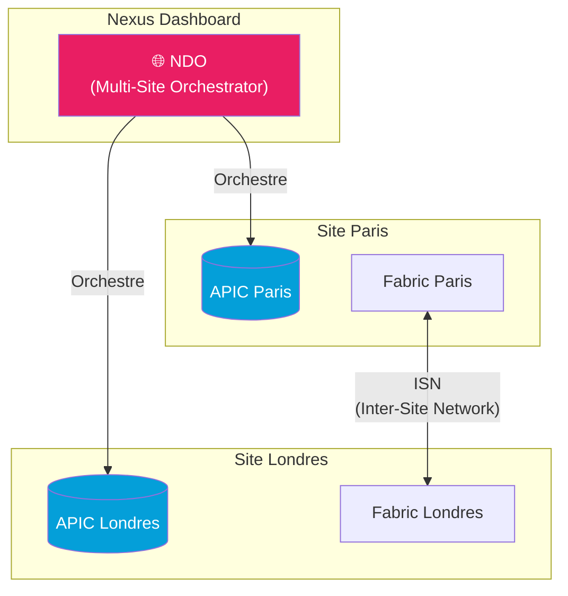

**Multi-Site : Cas d'usage**

- Datacenters géographiquement distants
- Chaque site a son propre cluster APIC
- NDO (Nexus Dashboard Orchestrator) synchronise les policies
- **Stretched Tenant** : Même Tenant sur plusieurs sites

!!! info "Module 9 : Multi-Site"
    Nous approfondirons Multi-Site (MSO/NDO) dans le Module 9 avec des exemples Terraform pour déployer des objets stretched.

---

## Exercice Pratique

!!! example "Lab 2.1 : Explorer l'APIC"

    **Objectif** : Se familiariser avec l'interface APIC et comprendre la structure de la fabric.

    **Prérequis** : Accès à un APIC (Sandbox DevNet ou simulateur)

    **Étapes :**

    1. Connectez-vous à l'APIC GUI (https://apic-ip)

    2. Explorez la topologie :
        - Menu : Fabric > Inventory > Topology
        - Identifiez les Spines et Leafs
        - Notez les connexions entre eux

    3. Vérifiez la santé de la fabric :
        - Menu : Fabric > Inventory > Fabric Membership
        - Tous les nodes doivent être "active"

    4. Examinez un Leaf :
        - Cliquez sur un Leaf dans la topologie
        - Notez : Model, Serial, TEP Address, Role

    5. Testez l'API REST :
        ```bash
        # Depuis votre terminal
        curl -k -X POST "https://APIC_IP/api/aaaLogin.json" \
          -d '{"aaaUser":{"attributes":{"name":"admin","pwd":"PASSWORD"}}}'

        # Récupérez le token et listez les nodes
        curl -k "https://APIC_IP/api/node/class/fabricNode.json" \
          -H "Cookie: APIC-Cookie=TOKEN"
        ```

    **Questions :**

    - Combien de Spines et Leafs dans votre fabric ?
    - Quel est le TEP Pool configuré ?
    - Quel est le Fabric ID ?

??? quote "Solution Lab 2.1"

    **Navigation GUI :**

    1. **Topologie** : Fabric > Inventory > Topology
        - Vue graphique de tous les équipements
        - Liens verts = healthy, rouge = problème

    2. **Fabric Membership** : Fabric > Inventory > Fabric Membership
        - Liste de tous les nodes avec statut
        - Colonnes importantes : Node ID, Name, Role, Admin State

    3. **Détails d'un Leaf** :
        - Model : N9K-C93180YC-FX (exemple)
        - Serial : FDO21XXXXXX
        - TEP : 10.0.0.32/32
        - Role : leaf

    **Réponse API :**

    ```json
    {
      "totalCount": "5",
      "imdata": [
        {
          "fabricNode": {
            "attributes": {
              "id": "101",
              "name": "leaf-101",
              "role": "leaf",
              "fabricSt": "active"
            }
          }
        },
        {
          "fabricNode": {
            "attributes": {
              "id": "201",
              "name": "spine-201",
              "role": "spine",
              "fabricSt": "active"
            }
          }
        }
        // ...
      ]
    }
    ```

    **Informations typiques Sandbox DevNet :**

    - Spines : 2
    - Leafs : 2-4
    - TEP Pool : 10.0.0.0/16
    - Fabric ID : 1

---

!!! example "Lab 2.2 : Analyser le Trafic VXLAN"

    **Objectif** : Comprendre l'encapsulation VXLAN dans ACI.

    **Scénario** : Deux VMs sur des Leafs différents communiquent.

    ```mermaid
    graph LR
        VM1["VM1<br/>192.168.1.10<br/>Leaf 101"]
        VM2["VM2<br/>192.168.1.20<br/>Leaf 102"]

        VM1 <-->|"Ping"| VM2
    ```

    **Questions à résoudre :**

    1. Quelle est l'IP source/destination du paquet VXLAN externe ?
    2. Quel est le VNI utilisé ?
    3. Combien de "hops" le paquet traverse-t-il ?

    **Indices :**

    - Le VNI est dérivé du Bridge Domain
    - Les TEP sont les IPs des Leafs dans le réseau underlay
    - Topologie Clos = max 2 hops (Leaf → Spine → Leaf)

??? quote "Solution Lab 2.2"

    **Analyse du flux :**

    1. **VM1 envoie un ping à VM2** :
        - Paquet original : `192.168.1.10 → 192.168.1.20`
        - Trame Ethernet : `MAC_VM1 → MAC_VM2`

    2. **Leaf 101 encapsule en VXLAN** :
        - IP externe : `TEP_Leaf101 (10.0.0.101) → TEP_Leaf102 (10.0.0.102)`
        - UDP port : 4789
        - VNI : (dépend du BD, ex: 15007001)

    3. **Spine forward** :
        - Le Spine ne décapsule pas
        - Simple routage IP basé sur TEP destination
        - ECMP si plusieurs Spines

    4. **Leaf 102 décapsule** :
        - Retire les headers VXLAN
        - Livre la trame originale à VM2

    **Nombre de hops : 2**

    ```
    VM1 → Leaf101 → Spine → Leaf102 → VM2
              (hop 1)   (hop 2)
    ```

    **Pour voir le VNI dans l'APIC :**

    - Tenants > [Tenant] > Networking > Bridge Domains > [BD]
    - Onglet "Operational" → Segment ID (VNI)

---

## Points Clés à Retenir

!!! abstract "Résumé du Module 2"

    ### Architecture Physique
    - **Spine-Leaf** : Topologie Clos à 2 tiers
    - **Spines** : Transit uniquement (pas d'endpoints)
    - **Leafs** : Connexion des serveurs et services
    - **APIC** : Contrôleur centralisé (cluster de 3+)

    ### Modèle SDN
    - **Underlay** : IS-IS + TEP Pool (automatique)
    - **Overlay** : VXLAN encapsulation (16M segments)
    - **OpFlex** : Protocole APIC → Switches

    ### Avantages vs Traditionnel
    - 100% des liens actifs (ECMP, pas de STP)
    - Configuration centralisée (API REST)
    - Micro-segmentation native (EPG)
    - Multi-tenancy intégré

    ### Multi-Site
    - **Multi-Pod** : Même APIC, plusieurs salles
    - **Multi-Site** : Plusieurs APICs + NDO orchestrateur

---

## Exercice : À Vous de Jouer

!!! example "Mise en Pratique"
    **Objectif** : Créer un fichier Terraform pour documenter l'architecture de votre fabric ACI

    **Contexte** : Vous devez cartographier une infrastructure ACI existante sous forme de code Terraform. Cette documentation servira de référence pour l'équipe et permettra de valider la topologie avant toute automatisation. Vous utiliserez des data sources et des locals pour représenter l'architecture.

    **Tâches à réaliser** :

    1. Créer un fichier `fabric-topology.tf` avec des locals décrivant : 2 Spines, 4 Leafs, 1 cluster APIC (3 nodes)
    2. Définir le TEP Pool et les VLANs de l'underlay
    3. Utiliser des data sources pour interroger l'APIC et récupérer la liste des nodes
    4. Créer des outputs affichant un résumé de la topologie
    5. Documenter les rôles de chaque composant en commentaires

    **Critères de validation** :

    - [ ] La structure de données représente clairement la topologie (Spines, Leafs, APICs)
    - [ ] Les data sources ACI sont correctement configurés
    - [ ] Les outputs affichent : nombre de Spines, Leafs, TEP Pool, état de santé
    - [ ] Les commentaires expliquent le rôle de chaque élément
    - [ ] Le code passe `terraform validate` et `terraform fmt`

??? quote "Solution"

    **fabric-topology.tf**

    ```hcl
    # Configuration du provider ACI
    terraform {
      required_providers {
        aci = {
          source  = "CiscoDevNet/aci"
          version = "~> 2.13"
        }
      }
    }

    provider "aci" {
      username = var.apic_username
      password = var.apic_password
      url      = var.apic_url
      insecure = true
    }

    # Data source : Récupération des nodes de la fabric
    data "aci_system" "apic" {
      # Informations système de l'APIC
    }

    data "aci_fabric_node" "spines" {
      for_each = toset(["201", "202"])
      dn       = "topology/pod-1/node-${each.key}"
    }

    data "aci_fabric_node" "leafs" {
      for_each = toset(["101", "102", "103", "104"])
      dn       = "topology/pod-1/node-${each.key}"
    }

    # Définition de la topologie en locals
    locals {
      # Pod 1 - Datacenter Paris
      fabric_pod = {
        id   = "1"
        name = "Pod-Paris"
        site = "Paris-DC1"
      }

      # Spines : Agrégation et routage underlay
      spines = {
        spine-201 = {
          id     = "201"
          name   = "spine-201"
          model  = "N9K-C9364C"
          role   = "spine"
          serial = "FDO24XXXXXX"
        }
        spine-202 = {
          id     = "202"
          name   = "spine-202"
          model  = "N9K-C9364C"
          role   = "spine"
          serial = "FDO24YYYYYY"
        }
      }

      # Leafs : Connexion des endpoints
      leafs = {
        leaf-101 = {
          id     = "101"
          name   = "leaf-101"
          model  = "N9K-C93180YC-FX"
          role   = "leaf"
          serial = "FDO21AAAAAA"
        }
        leaf-102 = {
          id     = "102"
          name   = "leaf-102"
          model  = "N9K-C93180YC-FX"
          role   = "leaf"
          serial = "FDO21BBBBBB"
        }
        leaf-103 = {
          id     = "103"
          name   = "leaf-103"
          model  = "N9K-C93180YC-FX"
          role   = "leaf"
          serial = "FDO21CCCCCC"
        }
        leaf-104 = {
          id     = "104"
          name   = "leaf-104"
          model  = "N9K-C93180YC-FX"
          role   = "leaf"
          serial = "FDO21DDDDDD"
        }
      }

      # Cluster APIC : 3 contrôleurs pour la haute disponibilité
      apic_cluster = {
        apic-1 = {
          id         = "1"
          name       = "apic-1"
          ip         = "10.0.0.1"
          role       = "controller"
          state      = "active"
        }
        apic-2 = {
          id         = "2"
          name       = "apic-2"
          ip         = "10.0.0.2"
          role       = "controller"
          state      = "active"
        }
        apic-3 = {
          id         = "3"
          name       = "apic-3"
          ip         = "10.0.0.3"
          role       = "controller"
          state      = "active"
        }
      }

      # Configuration Underlay
      underlay_config = {
        tep_pool       = "10.0.0.0/16"     # Tunnel Endpoint Pool
        multicast_pool = "225.0.0.0/15"    # Pour BUM traffic
        infra_vlan     = "3967"            # VLAN infrastructure ACI
        protocol       = "IS-IS"           # Protocole de routage underlay
      }

      # Résumé de la topologie
      topology_summary = {
        total_spines      = length(local.spines)
        total_leafs       = length(local.leafs)
        total_controllers = length(local.apic_cluster)
        fabric_capacity = {
          max_endpoints = "64000"          # Par leaf
          max_tenants   = "3000"
          max_vrfs      = "3000"
        }
      }
    }
    ```

    **outputs.tf**

    ```hcl
    output "fabric_topology" {
      description = "Topologie complète de la fabric ACI"
      value = {
        pod             = local.fabric_pod
        spines          = local.spines
        leafs           = local.leafs
        apic_cluster    = local.apic_cluster
        underlay_config = local.underlay_config
      }
    }

    output "topology_summary" {
      description = "Résumé de la topologie"
      value = {
        spines      = "${local.topology_summary.total_spines} Spines"
        leafs       = "${local.topology_summary.total_leafs} Leafs"
        controllers = "${local.topology_summary.total_controllers} APIC Controllers"
        tep_pool    = local.underlay_config.tep_pool
        protocol    = local.underlay_config.protocol
      }
    }

    output "fabric_health" {
      description = "État de santé de la fabric"
      value = {
        all_nodes_count    = local.topology_summary.total_spines + local.topology_summary.total_leafs
        apic_cluster_state = "Active (${local.topology_summary.total_controllers}/3)"
        underlay_protocol  = local.underlay_config.protocol
      }
    }
    ```

    **variables.tf**

    ```hcl
    variable "apic_url" {
      description = "URL de l'APIC"
      type        = string
      default     = "https://sandboxapicdc.cisco.com"
    }

    variable "apic_username" {
      description = "Username APIC"
      type        = string
      sensitive   = true
    }

    variable "apic_password" {
      description = "Password APIC"
      type        = string
      sensitive   = true
    }
    ```

    **Exécution :**

    ```bash
    terraform init
    terraform validate
    terraform fmt
    terraform plan
    ```

    **Résultat attendu :**

    Le code documente clairement la topologie de la fabric ACI avec tous les composants (Spines, Leafs, APIC), la configuration underlay (TEP Pool, IS-IS), et fournit des outputs lisibles pour l'équipe.

---

## Navigation

| Précédent | Suivant |
|-----------|---------|
| [← Module 1 : Introduction à Terraform](01-module.md) | [Module 3 : Modèle Objet ACI →](03-module.md) |
