---
tags:
  - formation
  - terraform
  - aci
  - tenant
  - vrf
  - epg
  - bridge-domain
---

# Module 3 : Modèle Objet ACI

## Objectifs du Module

À la fin de ce module, vous serez capable de :

- :fontawesome-solid-sitemap: Expliquer la hiérarchie des objets ACI
- :fontawesome-solid-building: Créer et gérer des Tenants
- :fontawesome-solid-network-wired: Comprendre les VRFs et leur isolation
- :fontawesome-solid-bridge: Configurer des Bridge Domains et Subnets
- :fontawesome-solid-layer-group: Maîtriser les EPGs (Endpoint Groups)
- :fontawesome-solid-link: Associer les EPGs aux domaines physiques/virtuels

**Durée estimée : 4 heures**

---

## Hiérarchie des Objets ACI

### Vue d'Ensemble

Le modèle objet ACI est **hiérarchique**. Chaque objet a un parent et peut avoir des enfants.

```mermaid
graph TB
    subgraph "Modèle Objet ACI"
        ROOT["🌐 Root (uni)"]

        ROOT --> TENANT["🏢 Tenant"]
        ROOT --> FABRIC["🔧 Fabric"]
        ROOT --> INFRA["⚙️ Infra"]

        TENANT --> VRF["🔒 VRF<br/>(Context)"]
        TENANT --> AP["📱 Application Profile"]
        TENANT --> CONTRACT["📋 Contract"]

        VRF --> BD["🌉 Bridge Domain"]

        BD --> SUBNET["📍 Subnet"]

        AP --> EPG["📦 EPG<br/>(Endpoint Group)"]

        EPG --> EP["💻 Endpoint<br/>(VM, Serveur)"]
    end

    style TENANT fill:#4caf50,color:#fff
    style VRF fill:#2196f3,color:#fff
    style BD fill:#ff9800,color:#fff
    style EPG fill:#e91e63,color:#fff
```



### Relations Entre Objets


**Règles fondamentales :**

| Relation | Description |
|----------|-------------|
| EPG → BD | Un EPG appartient à **un seul** Bridge Domain |
| BD → VRF | Un BD appartient à **un seul** VRF |
| EPG ↔ Contract | Un EPG peut consommer/fournir **plusieurs** Contracts |
| VRF → BD | Un VRF peut contenir **plusieurs** Bridge Domains |

---

## Le Tenant : Conteneur Logique

### Qu'est-ce qu'un Tenant ?

Un **Tenant** est le conteneur de plus haut niveau pour isoler les ressources. C'est l'équivalent d'un "projet" ou d'une "organisation".

```mermaid
graph TB
    subgraph "Fabric ACI"
        subgraph "Tenant: Worldline-Prod"
            VRF_WL["VRF Production"]
            APP_WL["App: Payment"]
        end

        subgraph "Tenant: ClientA"
            VRF_A["VRF ClientA"]
            APP_A["App: E-commerce"]
        end

        subgraph "Tenant: common"
            SHARED["Objets partagés<br/>(DNS, NTP, etc.)"]
        end
    end

    style VRF_WL fill:#4caf50,color:#fff
    style VRF_A fill:#2196f3,color:#fff
    style SHARED fill:#ff9800,color:#fff
```



### Tenants Système

ACI crée automatiquement 3 Tenants système :

| Tenant | Rôle | Modifiable ? |
|--------|------|--------------|
| **infra** | Infrastructure fabric (TEP, VXLAN) | Non |
| **common** | Objets partagés entre Tenants | Oui (limité) |
| **mgmt** | Management (OOB, In-band) | Oui (limité) |

!!! tip "Bonne Pratique : Tenant `common`"
    Utilisez le Tenant `common` pour les ressources partagées :

    - Contracts pour accès DNS, NTP, AD
    - L3Outs partagés (Internet, WAN)
    - Filtres réutilisables

### Terraform : Créer un Tenant

```hcl
# providers.tf
terraform {
  required_providers {
    aci = {
      source  = "CiscoDevNet/aci"
      version = "~> 2.0"
    }
  }
}

provider "aci" {
  username = var.apic_username
  password = var.apic_password
  url      = var.apic_url
  insecure = true  # Désactive vérification SSL (lab only)
}

# tenant.tf
resource "aci_tenant" "worldline_prod" {
  name        = "Worldline-Prod"
  description = "Tenant production Worldline - PCI-DSS"

  # Annotation pour traçabilité
  annotation = "orchestrator:terraform"
}

# Output pour référence
output "tenant_dn" {
  value       = aci_tenant.worldline_prod.id
  description = "Distinguished Name du Tenant"
}
```

**Résultat :**

```
Apply complete! Resources: 1 added, 0 changed, 0 destroyed.

Outputs:
tenant_dn = "uni/tn-Worldline-Prod"
```

---

## Le VRF : Isolation de Routage

### Qu'est-ce qu'un VRF ?

**VRF = Virtual Routing and Forwarding**

Un VRF est une **instance de routage isolée**. Les endpoints dans des VRFs différents ne peuvent pas communiquer (sauf configuration explicite).

```mermaid
graph TB
    subgraph "Tenant: Worldline-Prod"
        subgraph "VRF: Production"
            BD_PROD1["BD: Web"]
            BD_PROD2["BD: App"]
            BD_PROD3["BD: DB"]
        end

        subgraph "VRF: Management"
            BD_MGMT["BD: Monitoring"]
        end

        subgraph "VRF: PCI-CDE"
            BD_PCI1["BD: Payment"]
            BD_PCI2["BD: Cardholder"]
        end
    end

    BD_PROD1 -.->|"❌ Isolé"| BD_PCI1
    BD_PROD1 -.->|"❌ Isolé"| BD_MGMT

    style BD_PCI1 fill:#f44336,color:#fff
    style BD_PCI2 fill:#f44336,color:#fff
```



### Policy Control Enforcement

Le VRF a un paramètre crucial : **Policy Control Enforcement Preference**

| Valeur | Comportement |
|--------|--------------|
| **enforced** | Les Contracts sont appliqués (whitelist) |
| **unenforced** | Tout le trafic intra-VRF est autorisé |

!!! warning "Production : Toujours `enforced`"
    En production, utilisez **toujours** `enforced` pour bénéficier de la micro-segmentation. Le mode `unenforced` désactive la sécurité !

### Terraform : Créer un VRF

```hcl
# vrf.tf
resource "aci_vrf" "production" {
  tenant_dn   = aci_tenant.worldline_prod.id
  name        = "Production"
  description = "VRF Production - Applications métier"

  # Sécurité : Contracts enforced
  pc_enf_pref = "enforced"

  # Direction d'enforcement (ingress = plus performant)
  pc_enf_dir = "ingress"

  annotation = "orchestrator:terraform"
}

resource "aci_vrf" "pci_cde" {
  tenant_dn   = aci_tenant.worldline_prod.id
  name        = "PCI-CDE"
  description = "VRF PCI-DSS Cardholder Data Environment"

  pc_enf_pref = "enforced"
  pc_enf_dir  = "ingress"

  # Désactiver ICMP redirect pour sécurité PCI
  bd_enforced_enable = "yes"

  annotation = "orchestrator:terraform"
}
```

### Leaking Entre VRFs

Pour permettre la communication entre VRFs (ex: Management → Production) :


```hcl
# Route leaking entre VRFs (configuration avancée)
resource "aci_vrf_leak_epg_bd_subnet" "mgmt_to_prod" {
  vrf_dn     = aci_vrf.management.id
  leak_to_vrf_dn = aci_vrf.production.id
  subnet     = "10.1.0.0/24"
}
```

---

## Le Bridge Domain : Domaine de Broadcast

### Qu'est-ce qu'un Bridge Domain ?

Un **Bridge Domain (BD)** est l'équivalent ACI d'un VLAN, mais avec plus de fonctionnalités.

```mermaid
graph TB
    subgraph "Bridge Domain"
        BD["🌉 Bridge Domain: Web-Servers"]

        BD --> FEAT1["🔀 Unicast Routing"]
        BD --> FEAT2["📍 Subnets (Gateway)"]
        BD --> FEAT3["📡 ARP Flooding/Proxy"]
        BD --> FEAT4["🔗 Lié à 1 VRF"]
    end

    subgraph "EPGs dans ce BD"
        EPG1["EPG: Apache"]
        EPG2["EPG: Nginx"]
    end

    BD --> EPG1
    BD --> EPG2

    style BD fill:#ff9800,color:#fff
    style EPG1 fill:#e91e63,color:#fff
    style EPG2 fill:#e91e63,color:#fff
```



### Paramètres Importants du BD

| Paramètre | Description | Recommandation |
|-----------|-------------|----------------|
| **arp_flood** | Flood ARP dans le BD | `no` (utiliser ARP Proxy) |
| **unicast_route** | Activer routage L3 | `yes` |
| **unk_mac_ucast_act** | Action si MAC inconnue | `proxy` |
| **unk_mcast_act** | Action si multicast inconnu | `flood` |
| **limit_ip_learn_to_subnets** | Limiter apprentissage IP | `yes` (sécurité) |

### BD Hardware vs Software Proxy


**COOP (Council of Oracles Protocol)** : Base de données distribuée sur les Spines qui connaît tous les endpoints.

### Terraform : Créer un Bridge Domain

```hcl
# bridge_domain.tf
resource "aci_bridge_domain" "web" {
  tenant_dn = aci_tenant.worldline_prod.id
  name      = "BD-Web"

  # Lien obligatoire vers le VRF
  relation_fv_rs_ctx = aci_vrf.production.id

  # Paramètres réseau
  arp_flood          = "no"        # Utiliser proxy ARP
  unicast_route      = "yes"       # Activer routage L3
  unk_mac_ucast_act  = "proxy"     # Proxy pour MAC inconnue
  unk_mcast_act      = "flood"     # Flood multicast

  # Sécurité
  limit_ip_learn_to_subnets = "yes"
  ep_move_detect_mode       = "garp"  # Détection mobilité

  annotation = "orchestrator:terraform"
}

# Subnet associé au BD
resource "aci_subnet" "web_subnet" {
  parent_dn   = aci_bridge_domain.web.id
  ip          = "10.1.1.1/24"       # Gateway
  scope       = ["public"]          # Annoncé en externe
  description = "Subnet serveurs Web"

  # Options avancées
  preferred = "yes"                 # Subnet préféré pour ce BD
  virtual   = "no"                  # IP réelle (pas anycast)
}
```

### Multi-Subnet BD

Un BD peut avoir plusieurs subnets :

```hcl
# BD avec plusieurs subnets
resource "aci_bridge_domain" "app" {
  tenant_dn          = aci_tenant.worldline_prod.id
  name               = "BD-App"
  relation_fv_rs_ctx = aci_vrf.production.id
}

resource "aci_subnet" "app_primary" {
  parent_dn = aci_bridge_domain.app.id
  ip        = "10.1.2.1/24"
  scope     = ["public"]
  preferred = "yes"
}

resource "aci_subnet" "app_secondary" {
  parent_dn = aci_bridge_domain.app.id
  ip        = "10.1.3.1/24"
  scope     = ["private"]  # Non annoncé en externe
  preferred = "no"
}
```

---

## L'Application Profile : Conteneur d'EPGs

### Qu'est-ce qu'un Application Profile ?

Un **Application Profile (AP)** est un conteneur logique qui regroupe les EPGs d'une même application.


### Terraform : Créer un Application Profile

```hcl
# application_profile.tf
resource "aci_application_profile" "ecommerce" {
  tenant_dn   = aci_tenant.worldline_prod.id
  name        = "E-Commerce"
  description = "Application e-commerce B2C"
  annotation  = "orchestrator:terraform"
}

resource "aci_application_profile" "payment" {
  tenant_dn   = aci_tenant.worldline_prod.id
  name        = "Payment-Gateway"
  description = "Gateway de paiement PCI-DSS"
  annotation  = "orchestrator:terraform"
}
```

---

## L'EPG : Endpoint Group

### Qu'est-ce qu'un EPG ?

L'**EPG (Endpoint Group)** est le concept central d'ACI. C'est un groupe d'endpoints (VMs, serveurs) qui partagent les **mêmes politiques de sécurité**.

```mermaid
graph TB
    subgraph "EPG: Web-Servers"
        VM1["VM: web-01"]
        VM2["VM: web-02"]
        VM3["VM: web-03"]
        BM["Bare-metal: web-04"]
    end

    subgraph "Caractéristiques"
        SAME_BD["✅ Même Bridge Domain"]
        SAME_POL["✅ Mêmes Contracts"]
        DIFF_VLAN["⚠️ Peut avoir différents VLANs"]
    end

    style VM1 fill:#e91e63,color:#fff
    style VM2 fill:#e91e63,color:#fff
    style VM3 fill:#e91e63,color:#fff
    style BM fill:#e91e63,color:#fff
```



### EPG vs VLAN

| Aspect | VLAN Traditionnel | ACI EPG |
|--------|-------------------|---------|
| **Base** | Port physique | Politique applicative |
| **Mobilité** | Reconfigurer le port | Automatique |
| **Sécurité** | ACL sur routeur | Contract natif |
| **Visibilité** | Par switch | Par application |
| **Limite** | 4094 VLANs | Illimité (logique) |

### Terraform : Créer un EPG

```hcl
# epg.tf
resource "aci_application_epg" "frontend" {
  application_profile_dn = aci_application_profile.ecommerce.id
  name                   = "Frontend"
  description            = "Serveurs web frontend (Apache/Nginx)"

  # Lien vers le Bridge Domain
  relation_fv_rs_bd = aci_bridge_domain.web.id

  # Préférence de flooding (optimize)
  flood_on_encap = "disabled"
  pref_gr_memb   = "exclude"

  annotation = "orchestrator:terraform"
}

resource "aci_application_epg" "api" {
  application_profile_dn = aci_application_profile.ecommerce.id
  name                   = "API"
  description            = "API backend (Java/Node)"
  relation_fv_rs_bd      = aci_bridge_domain.app.id
  annotation             = "orchestrator:terraform"
}

resource "aci_application_epg" "database" {
  application_profile_dn = aci_application_profile.ecommerce.id
  name                   = "Database"
  description            = "Base de données PostgreSQL"
  relation_fv_rs_bd      = aci_bridge_domain.db.id
  annotation             = "orchestrator:terraform"
}
```

---

## Association aux Domaines

### Types de Domaines

Pour que des endpoints rejoignent un EPG, il faut associer l'EPG à un **domaine** :

```mermaid
graph TB
    subgraph "Types de Domaines"
        PHY["🔌 Physical Domain<br/>Serveurs bare-metal"]
        VMM["🖥️ VMM Domain<br/>VMware, HyperV, ACI-managed"]
        L2["🔗 L2 External Domain<br/>Switch externe L2"]
        L3["🌐 L3 External Domain<br/>Routeur externe"]
    end

    EPG["EPG: Frontend"]

    EPG --> PHY
    EPG --> VMM

    style EPG fill:#e91e63,color:#fff
    style PHY fill:#4caf50,color:#fff
    style VMM fill:#2196f3,color:#fff
```



### Association EPG → VMM Domain

Pour les environnements VMware :

```hcl
# Association à un VMM Domain (VMware vCenter)
data "aci_vmm_domain" "vmware_prod" {
  provider_profile_dn = "uni/vmmp-VMware"
  name                = "vCenter-Prod"
}

resource "aci_epg_to_domain" "frontend_vmware" {
  application_epg_dn = aci_application_epg.frontend.id
  tdn                = data.aci_vmm_domain.vmware_prod.id

  # VLAN dynamique ou statique
  vmm_allow_promiscuous = "reject"
  vmm_forged_transmits  = "reject"
  vmm_mac_changes       = "reject"

  # Mode d'encapsulation
  instr_imedcy = "immediate"  # Déploie immédiatement le port-group
  res_imedcy   = "immediate"  # Résout immédiatement les VLANs
}
```

### Association EPG → Physical Domain

Pour les serveurs physiques :

```hcl
# Association à un Physical Domain
data "aci_physical_domain" "baremetal" {
  name = "PhysDom-Baremetal"
}

resource "aci_epg_to_domain" "frontend_physical" {
  application_epg_dn = aci_application_epg.frontend.id
  tdn                = data.aci_physical_domain.baremetal.id
}

# Static binding pour un port physique
resource "aci_epg_to_static_path" "frontend_server" {
  application_epg_dn = aci_application_epg.frontend.id
  tdn                = "topology/pod-1/paths-101/pathep-[eth1/10]"
  encap              = "vlan-100"
  mode               = "regular"  # trunk, native, regular
}
```

---

## Schéma Complet : Du Tenant à l'Endpoint


---

## Code Terraform Complet

Voici un exemple complet qui crée toute la structure :

```hcl
# main.tf - Structure complète d'un Tenant

# Variables
variable "apic_url" {
  description = "URL de l'APIC"
  type        = string
}

variable "apic_username" {
  description = "Utilisateur APIC"
  type        = string
}

variable "apic_password" {
  description = "Mot de passe APIC"
  type        = string
  sensitive   = true
}

# Provider
terraform {
  required_providers {
    aci = {
      source  = "CiscoDevNet/aci"
      version = "~> 2.0"
    }
  }
}

provider "aci" {
  username = var.apic_username
  password = var.apic_password
  url      = var.apic_url
  insecure = true
}

# Tenant
resource "aci_tenant" "prod" {
  name        = "Worldline-Prod"
  description = "Production environment"
  annotation  = "orchestrator:terraform"
}

# VRF
resource "aci_vrf" "prod" {
  tenant_dn   = aci_tenant.prod.id
  name        = "Production"
  pc_enf_pref = "enforced"
  pc_enf_dir  = "ingress"
  annotation  = "orchestrator:terraform"
}

# Bridge Domains
resource "aci_bridge_domain" "web" {
  tenant_dn          = aci_tenant.prod.id
  name               = "BD-Web"
  relation_fv_rs_ctx = aci_vrf.prod.id
  arp_flood          = "no"
  unicast_route      = "yes"
  annotation         = "orchestrator:terraform"
}

resource "aci_bridge_domain" "app" {
  tenant_dn          = aci_tenant.prod.id
  name               = "BD-App"
  relation_fv_rs_ctx = aci_vrf.prod.id
  arp_flood          = "no"
  unicast_route      = "yes"
  annotation         = "orchestrator:terraform"
}

resource "aci_bridge_domain" "db" {
  tenant_dn          = aci_tenant.prod.id
  name               = "BD-Database"
  relation_fv_rs_ctx = aci_vrf.prod.id
  arp_flood          = "no"
  unicast_route      = "yes"
  annotation         = "orchestrator:terraform"
}

# Subnets
resource "aci_subnet" "web" {
  parent_dn = aci_bridge_domain.web.id
  ip        = "10.1.1.1/24"
  scope     = ["public"]
}

resource "aci_subnet" "app" {
  parent_dn = aci_bridge_domain.app.id
  ip        = "10.1.2.1/24"
  scope     = ["public"]
}

resource "aci_subnet" "db" {
  parent_dn = aci_bridge_domain.db.id
  ip        = "10.1.3.1/24"
  scope     = ["private"]  # DB non exposé en externe
}

# Application Profile
resource "aci_application_profile" "ecommerce" {
  tenant_dn   = aci_tenant.prod.id
  name        = "E-Commerce"
  description = "Application e-commerce"
  annotation  = "orchestrator:terraform"
}

# EPGs
resource "aci_application_epg" "frontend" {
  application_profile_dn = aci_application_profile.ecommerce.id
  name                   = "Frontend"
  relation_fv_rs_bd      = aci_bridge_domain.web.id
  annotation             = "orchestrator:terraform"
}

resource "aci_application_epg" "api" {
  application_profile_dn = aci_application_profile.ecommerce.id
  name                   = "API"
  relation_fv_rs_bd      = aci_bridge_domain.app.id
  annotation             = "orchestrator:terraform"
}

resource "aci_application_epg" "database" {
  application_profile_dn = aci_application_profile.ecommerce.id
  name                   = "Database"
  relation_fv_rs_bd      = aci_bridge_domain.db.id
  annotation             = "orchestrator:terraform"
}

# Outputs
output "tenant_dn" {
  value = aci_tenant.prod.id
}

output "epg_dns" {
  value = {
    frontend = aci_application_epg.frontend.id
    api      = aci_application_epg.api.id
    database = aci_application_epg.database.id
  }
}
```

---

## Exercice Pratique

!!! example "Lab 3.1 : Créer une Structure Tenant Complète"

    **Objectif** : Déployer avec Terraform un Tenant avec VRF, BDs et EPGs.

    **Scénario** : Créer l'infrastructure pour une application 3-tier :

    ```
    Tenant: Lab-Formation
    └── VRF: Lab-VRF
        ├── BD: BD-Frontend (10.10.1.0/24)
        ├── BD: BD-Backend (10.10.2.0/24)
        └── BD: BD-Data (10.10.3.0/24)

    App Profile: WebApp
    ├── EPG: Web (→ BD-Frontend)
    ├── EPG: App (→ BD-Backend)
    └── EPG: DB (→ BD-Data)
    ```

    **Étapes :**

    1. Créez un répertoire `lab3/` et un fichier `main.tf`
    2. Configurez le provider ACI
    3. Créez le Tenant, VRF, Bridge Domains
    4. Créez l'Application Profile et les EPGs
    5. Exécutez `terraform init`, `plan`, `apply`
    6. Vérifiez dans l'APIC GUI

    **Contraintes :**

    - Tous les objets doivent avoir l'annotation `orchestrator:terraform`
    - Le VRF doit être en mode `enforced`
    - Le subnet DB doit être `private` (non annoncé)

??? quote "Solution Lab 3.1"

    ```hcl
    # lab3/main.tf

    terraform {
      required_providers {
        aci = {
          source  = "CiscoDevNet/aci"
          version = "~> 2.0"
        }
      }
    }

    provider "aci" {
      username = "admin"
      password = "C1sco123!"
      url      = "https://sandboxapicdc.cisco.com"
      insecure = true
    }

    # Tenant
    resource "aci_tenant" "lab" {
      name        = "Lab-Formation"
      description = "Tenant de formation Terraform ACI"
      annotation  = "orchestrator:terraform"
    }

    # VRF
    resource "aci_vrf" "lab" {
      tenant_dn   = aci_tenant.lab.id
      name        = "Lab-VRF"
      pc_enf_pref = "enforced"
      annotation  = "orchestrator:terraform"
    }

    # Bridge Domains
    resource "aci_bridge_domain" "frontend" {
      tenant_dn          = aci_tenant.lab.id
      name               = "BD-Frontend"
      relation_fv_rs_ctx = aci_vrf.lab.id
      arp_flood          = "no"
      unicast_route      = "yes"
      annotation         = "orchestrator:terraform"
    }

    resource "aci_bridge_domain" "backend" {
      tenant_dn          = aci_tenant.lab.id
      name               = "BD-Backend"
      relation_fv_rs_ctx = aci_vrf.lab.id
      arp_flood          = "no"
      unicast_route      = "yes"
      annotation         = "orchestrator:terraform"
    }

    resource "aci_bridge_domain" "data" {
      tenant_dn          = aci_tenant.lab.id
      name               = "BD-Data"
      relation_fv_rs_ctx = aci_vrf.lab.id
      arp_flood          = "no"
      unicast_route      = "yes"
      annotation         = "orchestrator:terraform"
    }

    # Subnets
    resource "aci_subnet" "frontend" {
      parent_dn = aci_bridge_domain.frontend.id
      ip        = "10.10.1.1/24"
      scope     = ["public"]
    }

    resource "aci_subnet" "backend" {
      parent_dn = aci_bridge_domain.backend.id
      ip        = "10.10.2.1/24"
      scope     = ["public"]
    }

    resource "aci_subnet" "data" {
      parent_dn = aci_bridge_domain.data.id
      ip        = "10.10.3.1/24"
      scope     = ["private"]  # Non annoncé en externe
    }

    # Application Profile
    resource "aci_application_profile" "webapp" {
      tenant_dn   = aci_tenant.lab.id
      name        = "WebApp"
      description = "Application web 3-tier"
      annotation  = "orchestrator:terraform"
    }

    # EPGs
    resource "aci_application_epg" "web" {
      application_profile_dn = aci_application_profile.webapp.id
      name                   = "Web"
      relation_fv_rs_bd      = aci_bridge_domain.frontend.id
      annotation             = "orchestrator:terraform"
    }

    resource "aci_application_epg" "app" {
      application_profile_dn = aci_application_profile.webapp.id
      name                   = "App"
      relation_fv_rs_bd      = aci_bridge_domain.backend.id
      annotation             = "orchestrator:terraform"
    }

    resource "aci_application_epg" "db" {
      application_profile_dn = aci_application_profile.webapp.id
      name                   = "DB"
      relation_fv_rs_bd      = aci_bridge_domain.data.id
      annotation             = "orchestrator:terraform"
    }

    # Outputs
    output "structure" {
      value = {
        tenant = aci_tenant.lab.name
        vrf    = aci_vrf.lab.name
        epgs   = {
          web = aci_application_epg.web.name
          app = aci_application_epg.app.name
          db  = aci_application_epg.db.name
        }
      }
    }
    ```

    **Exécution :**

    ```bash
    cd lab3
    terraform init
    terraform plan
    terraform apply -auto-approve
    ```

    **Vérification APIC :**

    - Tenants > Lab-Formation > Networking > VRFs
    - Tenants > Lab-Formation > Networking > Bridge Domains
    - Tenants > Lab-Formation > Application Profiles > WebApp > EPGs

---

## Points Clés à Retenir

!!! abstract "Résumé du Module 3"

    ### Hiérarchie des Objets

    ```
    Tenant (isolation administrative)
    └── VRF (isolation routage)
        └── Bridge Domain (domaine L2/L3)
            └── Subnet (gateway IP)
    └── Application Profile (conteneur logique)
        └── EPG (groupe de sécurité)
    ```

    ### Relations Clés

    - **EPG → BD** : Un EPG appartient à un seul BD
    - **BD → VRF** : Un BD appartient à un seul VRF
    - **EPG ↔ Domain** : Association physique/virtuel
    - **EPG ↔ Contract** : Règles de communication

    ### Bonnes Pratiques

    - VRF en mode `enforced` en production
    - Annotation `orchestrator:terraform` sur tous les objets
    - Subnets DB en `private` (non annoncés)
    - Un EPG = un rôle applicatif (pas un VLAN)

    ### Prochaine Étape

    Les EPGs ne peuvent pas communiquer sans **Contracts**. Module 4 !

---

## Exercice : À Vous de Jouer

!!! example "Mise en Pratique"
    **Objectif** : Créer une infrastructure réseau complète avec Tenant, VRF, Bridge Domains et EPGs en Terraform

    **Contexte** : Vous devez déployer un tenant ACI pour une application web 3-tiers. L'application nécessite une séparation réseau entre les couches Web, Application et Base de données, tout en restant dans le même VRF pour faciliter le routage. Chaque couche aura son propre Bridge Domain et EPG.

    **Tâches à réaliser** :

    1. Créer un Tenant nommé "WebApp-Prod"
    2. Créer un VRF "Production" avec policy enforcement activé
    3. Créer 3 Bridge Domains : BD-Web (10.1.1.0/24), BD-App (10.1.2.0/24), BD-DB (10.1.3.0/24)
    4. Créer un Application Profile "3Tier-App"
    5. Créer 3 EPGs : Web-Frontend, App-Backend, Database
    6. Associer chaque EPG à son Bridge Domain correspondant

    **Critères de validation** :

    - [ ] Le Tenant est créé avec une annotation "managed-by:terraform"
    - [ ] Le VRF est en mode "enforced" (whitelist par défaut)
    - [ ] Chaque BD a un subnet avec scope "public" pour permettre le routage
    - [ ] Les EPGs sont dans le même Application Profile
    - [ ] La hiérarchie Tenant → VRF → BD → EPG est correcte
    - [ ] Le code utilise des variables pour les noms et les subnets

??? quote "Solution"

    **variables.tf**

    ```hcl
    variable "apic_url" {
      description = "URL de l'APIC"
      type        = string
    }

    variable "apic_username" {
      description = "Username pour l'APIC"
      type        = string
      sensitive   = true
    }

    variable "apic_password" {
      description = "Password pour l'APIC"
      type        = string
      sensitive   = true
    }

    variable "tenant_name" {
      description = "Nom du tenant"
      type        = string
      default     = "WebApp-Prod"
    }

    variable "subnets" {
      description = "Subnets pour chaque tier"
      type = object({
        web = string
        app = string
        db  = string
      })
      default = {
        web = "10.1.1.1/24"
        app = "10.1.2.1/24"
        db  = "10.1.3.1/24"
      }
    }
    ```

    **main.tf**

    ```hcl
    terraform {
      required_version = ">= 1.0"

      required_providers {
        aci = {
          source  = "CiscoDevNet/aci"
          version = "~> 2.13"
        }
      }
    }

    provider "aci" {
      username = var.apic_username
      password = var.apic_password
      url      = var.apic_url
      insecure = true
    }

    # ===================
    # TENANT
    # ===================

    resource "aci_tenant" "webapp_prod" {
      name        = var.tenant_name
      description = "Tenant pour application Web 3-tiers en production"
      annotation  = "managed-by:terraform"
    }

    # ===================
    # VRF
    # ===================

    resource "aci_vrf" "production" {
      tenant_dn   = aci_tenant.webapp_prod.id
      name        = "Production"
      description = "VRF Production avec policy enforcement"

      # Policy Enforcement : enforced = whitelist (tout bloqué par défaut)
      pc_enf_pref = "enforced"
      pc_enf_dir  = "ingress"

      annotation  = "managed-by:terraform"
    }

    # ===================
    # BRIDGE DOMAINS
    # ===================

    # Bridge Domain - Web
    resource "aci_bridge_domain" "web" {
      tenant_dn                   = aci_tenant.webapp_prod.id
      name                        = "BD-Web"
      description                 = "Bridge Domain pour la couche Web"
      relation_fv_rs_ctx          = aci_vrf.production.id

      # Optimisations ACI
      arp_flood                   = "no"
      unicast_route               = "yes"
      unk_mac_ucast_act           = "proxy"
      limit_ip_learn_to_subnets   = "yes"

      annotation                  = "managed-by:terraform"
    }

    resource "aci_subnet" "web" {
      parent_dn   = aci_bridge_domain.web.id
      ip          = var.subnets.web
      scope       = ["public"]
      description = "Gateway pour couche Web"
    }

    # Bridge Domain - App
    resource "aci_bridge_domain" "app" {
      tenant_dn                   = aci_tenant.webapp_prod.id
      name                        = "BD-App"
      description                 = "Bridge Domain pour la couche Application"
      relation_fv_rs_ctx          = aci_vrf.production.id

      arp_flood                   = "no"
      unicast_route               = "yes"
      unk_mac_ucast_act           = "proxy"
      limit_ip_learn_to_subnets   = "yes"

      annotation                  = "managed-by:terraform"
    }

    resource "aci_subnet" "app" {
      parent_dn   = aci_bridge_domain.app.id
      ip          = var.subnets.app
      scope       = ["public"]
      description = "Gateway pour couche Application"
    }

    # Bridge Domain - Database
    resource "aci_bridge_domain" "db" {
      tenant_dn                   = aci_tenant.webapp_prod.id
      name                        = "BD-DB"
      description                 = "Bridge Domain pour la couche Database"
      relation_fv_rs_ctx          = aci_vrf.production.id

      arp_flood                   = "no"
      unicast_route               = "yes"
      unk_mac_ucast_act           = "proxy"
      limit_ip_learn_to_subnets   = "yes"

      annotation                  = "managed-by:terraform"
    }

    resource "aci_subnet" "db" {
      parent_dn   = aci_bridge_domain.db.id
      ip          = var.subnets.db
      scope       = ["private"]  # BD Database en private (pas de routage externe)
      description = "Gateway pour couche Database"
    }

    # ===================
    # APPLICATION PROFILE
    # ===================

    resource "aci_application_profile" "three_tier" {
      tenant_dn   = aci_tenant.webapp_prod.id
      name        = "3Tier-App"
      description = "Application Profile pour architecture 3-tiers"
      annotation  = "managed-by:terraform"
    }

    # ===================
    # EPGs
    # ===================

    # EPG - Web Frontend
    resource "aci_application_epg" "web" {
      application_profile_dn = aci_application_profile.three_tier.id
      name                   = "Web-Frontend"
      description            = "EPG pour les serveurs Web (nginx, apache)"
      relation_fv_rs_bd      = aci_bridge_domain.web.id

      # Preferred Group : désactivé pour forcer les contracts
      pref_gr_memb           = "exclude"

      annotation             = "managed-by:terraform,tier:web"
    }

    # EPG - App Backend
    resource "aci_application_epg" "app" {
      application_profile_dn = aci_application_profile.three_tier.id
      name                   = "App-Backend"
      description            = "EPG pour les serveurs applicatifs (Java, Python)"
      relation_fv_rs_bd      = aci_bridge_domain.app.id

      pref_gr_memb           = "exclude"

      annotation             = "managed-by:terraform,tier:application"
    }

    # EPG - Database
    resource "aci_application_epg" "database" {
      application_profile_dn = aci_application_profile.three_tier.id
      name                   = "Database"
      description            = "EPG pour les bases de données (PostgreSQL, MySQL)"
      relation_fv_rs_bd      = aci_bridge_domain.db.id

      pref_gr_memb           = "exclude"

      annotation             = "managed-by:terraform,tier:data"
    }
    ```

    **outputs.tf**

    ```hcl
    output "tenant_dn" {
      description = "DN du tenant créé"
      value       = aci_tenant.webapp_prod.id
    }

    output "vrf_dn" {
      description = "DN du VRF Production"
      value       = aci_vrf.production.id
    }

    output "bridge_domains" {
      description = "Liste des Bridge Domains créés"
      value = {
        web = {
          dn     = aci_bridge_domain.web.id
          name   = aci_bridge_domain.web.name
          subnet = var.subnets.web
        }
        app = {
          dn     = aci_bridge_domain.app.id
          name   = aci_bridge_domain.app.name
          subnet = var.subnets.app
        }
        db = {
          dn     = aci_bridge_domain.db.id
          name   = aci_bridge_domain.db.name
          subnet = var.subnets.db
        }
      }
    }

    output "epgs" {
      description = "Liste des EPGs créés"
      value = {
        web = {
          dn   = aci_application_epg.web.id
          name = aci_application_epg.web.name
        }
        app = {
          dn   = aci_application_epg.app.id
          name = aci_application_epg.app.name
        }
        database = {
          dn   = aci_application_epg.database.id
          name = aci_application_epg.database.name
        }
      }
    }

    output "architecture_summary" {
      description = "Résumé de l'architecture déployée"
      value = {
        tenant             = var.tenant_name
        vrf                = "Production (enforced)"
        application        = "3Tier-App"
        bridge_domains     = 3
        epgs               = 3
        policy_enforcement = "Whitelist (contracts requis pour communication)"
      }
    }
    ```

    **Déploiement :**

    ```bash
    # Initialisation
    terraform init

    # Validation
    terraform validate

    # Plan
    terraform plan

    # Application
    terraform apply

    # Vérification
    terraform output architecture_summary
    ```

    **Résultat attendu :**

    Une infrastructure réseau complète pour une application 3-tiers est créée dans ACI :
    - 1 Tenant avec 1 VRF en mode enforced
    - 3 Bridge Domains avec leurs subnets
    - 1 Application Profile contenant 3 EPGs
    - Prêt pour l'ajout de Contracts au module 4

---

## Navigation

| Précédent | Suivant |
|-----------|---------|
| [← Module 2 : Architecture ACI](02-module.md) | [Module 4 : Contracts & Filters →](04-module.md) |

---

## Navigation

| | |
|:---|---:|
| [← Module 2 : Architecture Cisco ACI](02-module.md) | [Module 4 : Contracts & Filters →](04-module.md) |

[Retour au Programme](index.md){ .md-button }
