---
tags:
  - formation
  - terraform
  - aci
  - contracts
  - filters
  - security
  - whitelist
---

# Module 4 : Contracts & Filters

## Objectifs du Module

À la fin de ce module, vous serez capable de :

- :fontawesome-solid-shield-halved: Comprendre le modèle de sécurité whitelist d'ACI
- :fontawesome-solid-file-contract: Créer et configurer des Contracts
- :fontawesome-solid-filter: Définir des Filters et Filter Entries
- :fontawesome-solid-link: Associer Contracts entre EPGs (Consumer/Provider)
- :fontawesome-solid-ban: Utiliser les Taboo Contracts pour le deny explicite
- :fontawesome-solid-globe: Configurer vzAny pour les règles globales

**Durée estimée : 3 heures**

---

## Le Modèle Whitelist ACI

### Philosophie : Deny All by Default

Dans ACI, la règle de base est **tout est interdit sauf ce qui est explicitement autorisé**.

```mermaid
graph TB
    subgraph "Sans Contract"
        EPG1["EPG: Frontend"]
        EPG2["EPG: Backend"]

        EPG1 -->|"❌ DENY"| EPG2
        EPG1 -->|"❌ DENY"| EPG1
    end

    style EPG1 fill:#e91e63,color:#fff
    style EPG2 fill:#e91e63,color:#fff
```



!!! warning "Comportement par Défaut"
    - **Inter-EPG** : Tout trafic bloqué (même tenant, même VRF)
    - **Intra-EPG** : Bloqué par défaut (configurable)
    - **Exceptions** : Protocoles ACI internes (ARP dans certains cas)

### Comparaison avec le Monde Traditionnel

| Aspect | Réseau Traditionnel | Cisco ACI |
|--------|---------------------|-----------|
| **Par défaut** | Tout permis (même VLAN) | Tout bloqué |
| **Sécurité** | ACLs ajoutées après coup | Contracts dès le design |
| **Granularité** | IP source/dest | EPG source/dest |
| **Gestion** | Par switch/routeur | Centralisée (APIC) |
| **Visibilité** | Logs dispersés | Health Score + Faults |

---

## Anatomie d'un Contract

### Composants d'un Contract

```mermaid
graph TB
    subgraph "Structure d'un Contract"
        CONTRACT["📋 Contract<br/>web-to-app"]

        CONTRACT --> SUBJECT1["📑 Subject 1<br/>http-traffic"]
        CONTRACT --> SUBJECT2["📑 Subject 2<br/>health-checks"]

        SUBJECT1 --> FILTER1["🔍 Filter: http"]
        SUBJECT2 --> FILTER2["🔍 Filter: icmp"]

        FILTER1 --> ENTRY1["Entry: TCP/80"]
        FILTER1 --> ENTRY2["Entry: TCP/443"]
        FILTER2 --> ENTRY3["Entry: ICMP"]
    end

    style CONTRACT fill:#9c27b0,color:#fff
    style SUBJECT1 fill:#2196f3,color:#fff
    style SUBJECT2 fill:#2196f3,color:#fff
    style FILTER1 fill:#4caf50,color:#fff
    style FILTER2 fill:#4caf50,color:#fff
```



### Hiérarchie des Objets

| Objet | Rôle | Exemple |
|-------|------|---------|
| **Contract** | Conteneur de règles | `web-to-app` |
| **Subject** | Groupe de filtres dans un Contract | `http-traffic` |
| **Filter** | Définition de protocole/port | `filter-http` |
| **Filter Entry** | Règle spécifique | `TCP/80`, `TCP/443` |

### Consumer et Provider


**Consumer** : L'EPG qui **initie** la connexion (client)
**Provider** : L'EPG qui **reçoit** la connexion (serveur)

!!! tip "Comment déterminer Consumer/Provider ?"
    Posez-vous la question : **Qui ouvre la connexion TCP ?**

    - Frontend → Backend (API call) : Frontend = Consumer
    - Backend → Database (query) : Backend = Consumer
    - Monitoring → Tous (health check) : Monitoring = Consumer

---

## Les Filters

### Créer un Filter

Un Filter contient une ou plusieurs **Filter Entries** qui définissent le trafic autorisé.

```hcl
# filters.tf

# Filter pour HTTP/HTTPS
resource "aci_filter" "http" {
  tenant_dn   = aci_tenant.prod.id
  name        = "filter-http"
  description = "HTTP et HTTPS traffic"
  annotation  = "orchestrator:terraform"
}

# Entry pour HTTP (port 80)
resource "aci_filter_entry" "http" {
  filter_dn   = aci_filter.http.id
  name        = "http"
  description = "HTTP TCP/80"

  ether_t     = "ipv4"        # ipv4, ipv6, arp, unspecified
  prot        = "tcp"         # tcp, udp, icmp, unspecified
  d_from_port = "http"        # Port destination (80)
  d_to_port   = "http"        # Range: de 80 à 80
  stateful    = "yes"         # Suivi de connexion

  annotation = "orchestrator:terraform"
}

# Entry pour HTTPS (port 443)
resource "aci_filter_entry" "https" {
  filter_dn   = aci_filter.http.id
  name        = "https"
  description = "HTTPS TCP/443"

  ether_t     = "ipv4"
  prot        = "tcp"
  d_from_port = "https"
  d_to_port   = "https"
  stateful    = "yes"

  annotation = "orchestrator:terraform"
}
```

### Filter Entries Avancées

```hcl
# Filter pour bases de données
resource "aci_filter" "database" {
  tenant_dn = aci_tenant.prod.id
  name      = "filter-database"
}

# PostgreSQL
resource "aci_filter_entry" "postgres" {
  filter_dn   = aci_filter.database.id
  name        = "postgresql"
  ether_t     = "ipv4"
  prot        = "tcp"
  d_from_port = "5432"
  d_to_port   = "5432"
  stateful    = "yes"
}

# MySQL
resource "aci_filter_entry" "mysql" {
  filter_dn   = aci_filter.database.id
  name        = "mysql"
  ether_t     = "ipv4"
  prot        = "tcp"
  d_from_port = "3306"
  d_to_port   = "3306"
  stateful    = "yes"
}

# Range de ports (ex: ports éphémères)
resource "aci_filter_entry" "ephemeral" {
  filter_dn   = aci_filter.database.id
  name        = "ephemeral-ports"
  ether_t     = "ipv4"
  prot        = "tcp"
  d_from_port = "32768"
  d_to_port   = "65535"
  stateful    = "yes"
}
```

### Filters Communs

```hcl
# Filter ICMP (ping, traceroute)
resource "aci_filter" "icmp" {
  tenant_dn = aci_tenant.prod.id
  name      = "filter-icmp"
}

resource "aci_filter_entry" "icmp" {
  filter_dn = aci_filter.icmp.id
  name      = "icmp-all"
  ether_t   = "ipv4"
  prot      = "icmp"
  # Pas de port pour ICMP
}

# Filter SSH
resource "aci_filter" "ssh" {
  tenant_dn = aci_tenant.prod.id
  name      = "filter-ssh"
}

resource "aci_filter_entry" "ssh" {
  filter_dn   = aci_filter.ssh.id
  name        = "ssh"
  ether_t     = "ipv4"
  prot        = "tcp"
  d_from_port = "22"
  d_to_port   = "22"
  stateful    = "yes"
}

# Filter DNS
resource "aci_filter" "dns" {
  tenant_dn = aci_tenant.prod.id
  name      = "filter-dns"
}

resource "aci_filter_entry" "dns_udp" {
  filter_dn   = aci_filter.dns.id
  name        = "dns-udp"
  ether_t     = "ipv4"
  prot        = "udp"
  d_from_port = "53"
  d_to_port   = "53"
}

resource "aci_filter_entry" "dns_tcp" {
  filter_dn   = aci_filter.dns.id
  name        = "dns-tcp"
  ether_t     = "ipv4"
  prot        = "tcp"
  d_from_port = "53"
  d_to_port   = "53"
  stateful    = "yes"
}
```

---

## Les Contracts

### Créer un Contract Simple

```hcl
# contracts.tf

# Contract: Web vers App (HTTP/HTTPS)
resource "aci_contract" "web_to_app" {
  tenant_dn   = aci_tenant.prod.id
  name        = "web-to-app"
  description = "Autorise Frontend vers Backend"
  scope       = "context"  # context = VRF, tenant, global

  annotation = "orchestrator:terraform"
}

# Subject dans le Contract
resource "aci_contract_subject" "web_to_app_http" {
  contract_dn = aci_contract.web_to_app.id
  name        = "http-traffic"
  description = "HTTP et HTTPS"

  # Direction du filtre
  rev_flt_ports = "yes"  # Bidirectionnel
}

# Association Subject → Filter
resource "aci_contract_subject_filter" "web_to_app_http" {
  contract_subject_dn = aci_contract_subject.web_to_app_http.id
  filter_dn           = aci_filter.http.id
  action              = "permit"  # permit ou deny
}
```

### Scope du Contract

| Scope | Description | Usage |
|-------|-------------|-------|
| **context** | VRF uniquement | Standard (99% des cas) |
| **tenant** | Tout le Tenant | Inter-VRF dans même Tenant |
| **global** | Tous les Tenants | Shared services (common) |
| **application-profile** | Même AP seulement | Très restrictif |

### Associer Contract aux EPGs

```hcl
# Association Consumer (Frontend consomme le Contract)
resource "aci_epg_to_contract" "frontend_consumer" {
  application_epg_dn = aci_application_epg.frontend.id
  contract_dn        = aci_contract.web_to_app.id
  contract_type      = "consumer"
}

# Association Provider (Backend fournit le Contract)
resource "aci_epg_to_contract" "backend_provider" {
  application_epg_dn = aci_application_epg.api.id
  contract_dn        = aci_contract.web_to_app.id
  contract_type      = "provider"
}
```

---

## Exemple Complet : Application 3-Tier


```hcl
# Exemple complet : 3-tier avec tous les Contracts

# ===== FILTERS =====

resource "aci_filter" "https" {
  tenant_dn = aci_tenant.prod.id
  name      = "filter-https"
}

resource "aci_filter_entry" "https" {
  filter_dn   = aci_filter.https.id
  name        = "https"
  ether_t     = "ipv4"
  prot        = "tcp"
  d_from_port = "443"
  d_to_port   = "443"
  stateful    = "yes"
}

resource "aci_filter" "api" {
  tenant_dn = aci_tenant.prod.id
  name      = "filter-api"
}

resource "aci_filter_entry" "api_8080" {
  filter_dn   = aci_filter.api.id
  name        = "api-8080"
  ether_t     = "ipv4"
  prot        = "tcp"
  d_from_port = "8080"
  d_to_port   = "8080"
  stateful    = "yes"
}

resource "aci_filter" "postgres" {
  tenant_dn = aci_tenant.prod.id
  name      = "filter-postgres"
}

resource "aci_filter_entry" "postgres" {
  filter_dn   = aci_filter.postgres.id
  name        = "postgresql"
  ether_t     = "ipv4"
  prot        = "tcp"
  d_from_port = "5432"
  d_to_port   = "5432"
  stateful    = "yes"
}

# ===== CONTRACTS =====

# Contract: Internet vers Frontend
resource "aci_contract" "inet_to_web" {
  tenant_dn = aci_tenant.prod.id
  name      = "inet-to-web"
  scope     = "context"
}

resource "aci_contract_subject" "inet_to_web" {
  contract_dn   = aci_contract.inet_to_web.id
  name          = "https"
  rev_flt_ports = "yes"
}

resource "aci_contract_subject_filter" "inet_to_web" {
  contract_subject_dn = aci_contract_subject.inet_to_web.id
  filter_dn           = aci_filter.https.id
}

# Contract: Frontend vers API
resource "aci_contract" "web_to_app" {
  tenant_dn = aci_tenant.prod.id
  name      = "web-to-app"
  scope     = "context"
}

resource "aci_contract_subject" "web_to_app" {
  contract_dn   = aci_contract.web_to_app.id
  name          = "api-calls"
  rev_flt_ports = "yes"
}

resource "aci_contract_subject_filter" "web_to_app" {
  contract_subject_dn = aci_contract_subject.web_to_app.id
  filter_dn           = aci_filter.api.id
}

# Contract: API vers Database
resource "aci_contract" "app_to_db" {
  tenant_dn = aci_tenant.prod.id
  name      = "app-to-db"
  scope     = "context"
}

resource "aci_contract_subject" "app_to_db" {
  contract_dn   = aci_contract.app_to_db.id
  name          = "database"
  rev_flt_ports = "yes"
}

resource "aci_contract_subject_filter" "app_to_db" {
  contract_subject_dn = aci_contract_subject.app_to_db.id
  filter_dn           = aci_filter.postgres.id
}

# ===== ASSOCIATIONS EPG ↔ CONTRACT =====

# Frontend : Consumer de inet-to-web, Consumer de web-to-app (initie)
resource "aci_epg_to_contract" "frontend_inet_provider" {
  application_epg_dn = aci_application_epg.frontend.id
  contract_dn        = aci_contract.inet_to_web.id
  contract_type      = "provider"  # Reçoit le trafic Internet
}

resource "aci_epg_to_contract" "frontend_app_consumer" {
  application_epg_dn = aci_application_epg.frontend.id
  contract_dn        = aci_contract.web_to_app.id
  contract_type      = "consumer"  # Initie vers API
}

# API : Provider de web-to-app, Consumer de app-to-db
resource "aci_epg_to_contract" "api_web_provider" {
  application_epg_dn = aci_application_epg.api.id
  contract_dn        = aci_contract.web_to_app.id
  contract_type      = "provider"
}

resource "aci_epg_to_contract" "api_db_consumer" {
  application_epg_dn = aci_application_epg.api.id
  contract_dn        = aci_contract.app_to_db.id
  contract_type      = "consumer"
}

# Database : Provider de app-to-db
resource "aci_epg_to_contract" "db_provider" {
  application_epg_dn = aci_application_epg.database.id
  contract_dn        = aci_contract.app_to_db.id
  contract_type      = "provider"
}
```

---

## Taboo Contracts : Deny Explicite

### Qu'est-ce qu'un Taboo Contract ?

Un **Taboo Contract** est l'inverse d'un Contract standard : il **bloque** explicitement du trafic.

```mermaid
graph LR
    subgraph "Taboo Contract"
        EPG1["EPG: Frontend"]
        EPG2["EPG: Database"]

        EPG1 -->|"🚫 Taboo: no-direct-db<br/>DENY TCP/5432"| EPG2
    end

    style EPG1 fill:#4caf50,color:#fff
    style EPG2 fill:#f44336,color:#fff
```



**Cas d'usage :**

- Bloquer l'accès direct Frontend → Database (même si un Contract existe)
- Isoler des EPGs sensibles (PCI-DSS)
- Override temporaire pour incident

### Terraform : Taboo Contract

```hcl
# Taboo Contract : Interdire Frontend → Database directement
resource "aci_taboo_contract" "no_frontend_to_db" {
  tenant_dn   = aci_tenant.prod.id
  name        = "taboo-no-frontend-db"
  description = "Interdit accès direct Frontend → Database"
  annotation  = "orchestrator:terraform"
}

# Subject Taboo
resource "aci_taboo_contract_subject" "block_db" {
  taboo_contract_dn = aci_taboo_contract.no_frontend_to_db.id
  name              = "block-database-ports"
}

# Association Filter au Taboo Subject
resource "aci_taboo_contract_subject_filter" "block_db" {
  taboo_contract_subject_dn = aci_taboo_contract_subject.block_db.id
  filter_dn                 = aci_filter.postgres.id
}

# Association Taboo à l'EPG Database
resource "aci_epg_to_contract" "db_taboo" {
  application_epg_dn = aci_application_epg.database.id
  contract_dn        = aci_taboo_contract.no_frontend_to_db.id
  contract_type      = "taboo"
}
```

!!! note "Ordre de Priorité"
    **Taboo > Contract** : Un Taboo Contract bloque même si un Contract standard autoriserait le trafic.

---

## vzAny : Contract pour Tout le VRF

### Qu'est-ce que vzAny ?

**vzAny** représente "tous les EPGs d'un VRF". Utile pour :

- Permettre le trafic commun (DNS, NTP, ICMP) à tous les EPGs
- Éviter de créer N×N associations


### Terraform : vzAny Contract

```hcl
# Contract pour services communs
resource "aci_contract" "common_services" {
  tenant_dn = aci_tenant.prod.id
  name      = "common-services"
  scope     = "context"
}

resource "aci_contract_subject" "dns" {
  contract_dn   = aci_contract.common_services.id
  name          = "dns"
  rev_flt_ports = "yes"
}

resource "aci_contract_subject_filter" "dns" {
  contract_subject_dn = aci_contract_subject.dns.id
  filter_dn           = aci_filter.dns.id
}

resource "aci_contract_subject" "icmp" {
  contract_dn   = aci_contract.common_services.id
  name          = "icmp"
  rev_flt_ports = "yes"
}

resource "aci_contract_subject_filter" "icmp" {
  contract_subject_dn = aci_contract_subject.icmp.id
  filter_dn           = aci_filter.icmp.id
}

# vzAny comme Consumer
resource "aci_any" "prod_vzany" {
  vrf_dn = aci_vrf.production.id
}

resource "aci_any_to_contract" "vzany_common" {
  any_dn        = aci_any.prod_vzany.id
  contract_dn   = aci_contract.common_services.id
  contract_type = "consumer"
}

# EPG Services (DNS, NTP) comme Provider
resource "aci_epg_to_contract" "services_provider" {
  application_epg_dn = aci_application_epg.infra_services.id
  contract_dn        = aci_contract.common_services.id
  contract_type      = "provider"
}
```

### Intra-EPG avec vzAny

Par défaut, les endpoints dans le **même EPG** ne peuvent pas communiquer. Pour autoriser :

```hcl
# Autoriser le trafic intra-EPG pour tout le VRF
resource "aci_any" "prod_vzany" {
  vrf_dn = aci_vrf.production.id

  # Autoriser trafic intra-EPG
  pref_gr_memb = "enabled"
}
```

---

## Preferred Group : Simplifier les Contracts

### Qu'est-ce que Preferred Group ?

**Preferred Group** permet aux EPGs membres de communiquer **sans Contract explicite**.

```mermaid
graph TB
    subgraph "VRF avec Preferred Group"
        subgraph "Preferred Group (libre)"
            EPG1["EPG: Frontend"]
            EPG2["EPG: API"]
        end

        subgraph "Hors Preferred Group (strict)"
            EPG3["EPG: Database"]
        end

        EPG1 <-->|"✅ Libre"| EPG2
        EPG1 -->|"❌ Contract requis"| EPG3
        EPG2 -->|"✅ Contract"| EPG3
    end

    style EPG1 fill:#4caf50,color:#fff
    style EPG2 fill:#4caf50,color:#fff
    style EPG3 fill:#f44336,color:#fff
```



### Terraform : Preferred Group

```hcl
# Activer Preferred Group sur le VRF
resource "aci_vrf" "production" {
  tenant_dn   = aci_tenant.prod.id
  name        = "Production"
  pc_enf_pref = "enforced"

  # Activer Preferred Group
  pref_gr_memb = "enabled"
}

# EPG membre du Preferred Group
resource "aci_application_epg" "frontend" {
  application_profile_dn = aci_application_profile.ecommerce.id
  name                   = "Frontend"
  relation_fv_rs_bd      = aci_bridge_domain.web.id

  # Inclure dans Preferred Group
  pref_gr_memb = "include"
}

resource "aci_application_epg" "api" {
  application_profile_dn = aci_application_profile.ecommerce.id
  name                   = "API"
  relation_fv_rs_bd      = aci_bridge_domain.app.id

  # Inclure dans Preferred Group
  pref_gr_memb = "include"
}

# EPG sensible HORS du Preferred Group
resource "aci_application_epg" "database" {
  application_profile_dn = aci_application_profile.ecommerce.id
  name                   = "Database"
  relation_fv_rs_bd      = aci_bridge_domain.db.id

  # Exclure du Preferred Group (strict contracts)
  pref_gr_memb = "exclude"
}
```

!!! warning "Attention : Preferred Group et PCI-DSS"
    En environnement PCI-DSS, **n'utilisez pas Preferred Group** pour les zones CDE. Chaque flux doit être explicitement autorisé par Contract.

---

## Visualisation des Flux

### Dans l'APIC GUI

```
Tenants > [Tenant] > Application Profiles > [AP] > Application EPGs > [EPG]
    └── Contracts
        ├── Consumed Contracts
        └── Provided Contracts
```

### Troubleshooting avec le Contract Viewer

```
Operations > EP Tracker
Operations > Visibility and Troubleshooting > Contract Viewer
```

### Exemple de Matrice de Flux

| Source EPG | Dest EPG | Contract | Ports | Status |
|------------|----------|----------|-------|--------|
| Frontend | API | web-to-app | TCP/8080 | ✅ |
| API | Database | app-to-db | TCP/5432 | ✅ |
| Frontend | Database | - | - | ❌ Bloqué |
| Monitoring | Tous | vzAny-mon | TCP/9100 | ✅ |

---

## Exercice Pratique

!!! example "Lab 4.1 : Implémenter les Contracts 3-Tier"

    **Objectif** : Sécuriser une application 3-tier avec des Contracts.

    **Architecture :**

    ```
    Internet → Frontend (HTTPS/443)
    Frontend → API (TCP/8080)
    API → Database (TCP/5432)
    Tous → Services (DNS/53, ICMP)
    ```

    **Étapes :**

    1. Reprenez le Lab 3.1 ou créez la structure Tenant/VRF/EPGs
    2. Créez les Filters nécessaires (https, api, postgres, dns, icmp)
    3. Créez les Contracts pour chaque flux
    4. Associez les Contracts aux EPGs (Consumer/Provider)
    5. Créez un vzAny Contract pour DNS et ICMP
    6. Vérifiez dans l'APIC

    **Bonus :** Créez un Taboo Contract pour empêcher Frontend → Database

??? quote "Solution Lab 4.1"

    ```hcl
    # lab4/main.tf

    terraform {
      required_providers {
        aci = {
          source  = "CiscoDevNet/aci"
          version = "~> 2.0"
        }
      }
    }

    provider "aci" {
      username = "admin"
      password = "C1sco123!"
      url      = "https://sandboxapicdc.cisco.com"
      insecure = true
    }

    # ========== TENANT STRUCTURE ==========

    resource "aci_tenant" "lab" {
      name       = "Lab-Contracts"
      annotation = "orchestrator:terraform"
    }

    resource "aci_vrf" "prod" {
      tenant_dn   = aci_tenant.lab.id
      name        = "Production"
      pc_enf_pref = "enforced"
    }

    resource "aci_bridge_domain" "web" {
      tenant_dn          = aci_tenant.lab.id
      name               = "BD-Web"
      relation_fv_rs_ctx = aci_vrf.prod.id
    }

    resource "aci_bridge_domain" "app" {
      tenant_dn          = aci_tenant.lab.id
      name               = "BD-App"
      relation_fv_rs_ctx = aci_vrf.prod.id
    }

    resource "aci_bridge_domain" "db" {
      tenant_dn          = aci_tenant.lab.id
      name               = "BD-DB"
      relation_fv_rs_ctx = aci_vrf.prod.id
    }

    resource "aci_application_profile" "app" {
      tenant_dn = aci_tenant.lab.id
      name      = "3TierApp"
    }

    resource "aci_application_epg" "frontend" {
      application_profile_dn = aci_application_profile.app.id
      name                   = "Frontend"
      relation_fv_rs_bd      = aci_bridge_domain.web.id
    }

    resource "aci_application_epg" "api" {
      application_profile_dn = aci_application_profile.app.id
      name                   = "API"
      relation_fv_rs_bd      = aci_bridge_domain.app.id
    }

    resource "aci_application_epg" "database" {
      application_profile_dn = aci_application_profile.app.id
      name                   = "Database"
      relation_fv_rs_bd      = aci_bridge_domain.db.id
    }

    # ========== FILTERS ==========

    resource "aci_filter" "https" {
      tenant_dn = aci_tenant.lab.id
      name      = "filter-https"
    }

    resource "aci_filter_entry" "https" {
      filter_dn   = aci_filter.https.id
      name        = "https"
      ether_t     = "ipv4"
      prot        = "tcp"
      d_from_port = "443"
      d_to_port   = "443"
      stateful    = "yes"
    }

    resource "aci_filter" "api" {
      tenant_dn = aci_tenant.lab.id
      name      = "filter-api"
    }

    resource "aci_filter_entry" "api" {
      filter_dn   = aci_filter.api.id
      name        = "api-8080"
      ether_t     = "ipv4"
      prot        = "tcp"
      d_from_port = "8080"
      d_to_port   = "8080"
      stateful    = "yes"
    }

    resource "aci_filter" "postgres" {
      tenant_dn = aci_tenant.lab.id
      name      = "filter-postgres"
    }

    resource "aci_filter_entry" "postgres" {
      filter_dn   = aci_filter.postgres.id
      name        = "postgres"
      ether_t     = "ipv4"
      prot        = "tcp"
      d_from_port = "5432"
      d_to_port   = "5432"
      stateful    = "yes"
    }

    resource "aci_filter" "dns" {
      tenant_dn = aci_tenant.lab.id
      name      = "filter-dns"
    }

    resource "aci_filter_entry" "dns" {
      filter_dn   = aci_filter.dns.id
      name        = "dns-udp"
      ether_t     = "ipv4"
      prot        = "udp"
      d_from_port = "53"
      d_to_port   = "53"
    }

    resource "aci_filter" "icmp" {
      tenant_dn = aci_tenant.lab.id
      name      = "filter-icmp"
    }

    resource "aci_filter_entry" "icmp" {
      filter_dn = aci_filter.icmp.id
      name      = "icmp"
      ether_t   = "ipv4"
      prot      = "icmp"
    }

    # ========== CONTRACTS ==========

    # Contract: inet → frontend
    resource "aci_contract" "inet_to_web" {
      tenant_dn = aci_tenant.lab.id
      name      = "inet-to-web"
      scope     = "context"
    }

    resource "aci_contract_subject" "inet_to_web" {
      contract_dn   = aci_contract.inet_to_web.id
      name          = "https"
      rev_flt_ports = "yes"
    }

    resource "aci_contract_subject_filter" "inet_to_web" {
      contract_subject_dn = aci_contract_subject.inet_to_web.id
      filter_dn           = aci_filter.https.id
    }

    # Contract: frontend → api
    resource "aci_contract" "web_to_app" {
      tenant_dn = aci_tenant.lab.id
      name      = "web-to-app"
      scope     = "context"
    }

    resource "aci_contract_subject" "web_to_app" {
      contract_dn   = aci_contract.web_to_app.id
      name          = "api"
      rev_flt_ports = "yes"
    }

    resource "aci_contract_subject_filter" "web_to_app" {
      contract_subject_dn = aci_contract_subject.web_to_app.id
      filter_dn           = aci_filter.api.id
    }

    # Contract: api → database
    resource "aci_contract" "app_to_db" {
      tenant_dn = aci_tenant.lab.id
      name      = "app-to-db"
      scope     = "context"
    }

    resource "aci_contract_subject" "app_to_db" {
      contract_dn   = aci_contract.app_to_db.id
      name          = "postgres"
      rev_flt_ports = "yes"
    }

    resource "aci_contract_subject_filter" "app_to_db" {
      contract_subject_dn = aci_contract_subject.app_to_db.id
      filter_dn           = aci_filter.postgres.id
    }

    # ========== EPG ↔ CONTRACT ==========

    resource "aci_epg_to_contract" "frontend_inet" {
      application_epg_dn = aci_application_epg.frontend.id
      contract_dn        = aci_contract.inet_to_web.id
      contract_type      = "provider"
    }

    resource "aci_epg_to_contract" "frontend_app_consumer" {
      application_epg_dn = aci_application_epg.frontend.id
      contract_dn        = aci_contract.web_to_app.id
      contract_type      = "consumer"
    }

    resource "aci_epg_to_contract" "api_web_provider" {
      application_epg_dn = aci_application_epg.api.id
      contract_dn        = aci_contract.web_to_app.id
      contract_type      = "provider"
    }

    resource "aci_epg_to_contract" "api_db_consumer" {
      application_epg_dn = aci_application_epg.api.id
      contract_dn        = aci_contract.app_to_db.id
      contract_type      = "consumer"
    }

    resource "aci_epg_to_contract" "db_provider" {
      application_epg_dn = aci_application_epg.database.id
      contract_dn        = aci_contract.app_to_db.id
      contract_type      = "provider"
    }

    # ========== VZANY (DNS, ICMP) ==========

    resource "aci_contract" "common_services" {
      tenant_dn = aci_tenant.lab.id
      name      = "common-services"
      scope     = "context"
    }

    resource "aci_contract_subject" "dns" {
      contract_dn   = aci_contract.common_services.id
      name          = "dns"
      rev_flt_ports = "yes"
    }

    resource "aci_contract_subject_filter" "dns" {
      contract_subject_dn = aci_contract_subject.dns.id
      filter_dn           = aci_filter.dns.id
    }

    resource "aci_contract_subject" "icmp" {
      contract_dn   = aci_contract.common_services.id
      name          = "icmp"
      rev_flt_ports = "yes"
    }

    resource "aci_contract_subject_filter" "icmp" {
      contract_subject_dn = aci_contract_subject.icmp.id
      filter_dn           = aci_filter.icmp.id
    }

    resource "aci_any" "vzany" {
      vrf_dn = aci_vrf.prod.id
    }

    resource "aci_any_to_contract" "vzany_common" {
      any_dn        = aci_any.vzany.id
      contract_dn   = aci_contract.common_services.id
      contract_type = "consumer"
    }

    # ========== TABOO (Bonus) ==========

    resource "aci_taboo_contract" "no_frontend_db" {
      tenant_dn = aci_tenant.lab.id
      name      = "taboo-no-frontend-db"
    }

    resource "aci_taboo_contract_subject" "block_db" {
      taboo_contract_dn = aci_taboo_contract.no_frontend_db.id
      name              = "block-postgres"
    }

    # Note: Pour compléter, il faudrait associer le Taboo au Database EPG
    ```

---

## Points Clés à Retenir

!!! abstract "Résumé du Module 4"

    ### Modèle Whitelist

    - **Deny all** par défaut
    - Tout trafic doit être **explicitement autorisé**
    - Contracts = règles de firewall

    ### Structure Contract

    ```
    Contract
    └── Subject (groupe logique)
        └── Filter (protocole/ports)
            └── Filter Entry (règle spécifique)
    ```

    ### Consumer vs Provider

    - **Consumer** : Initie la connexion (client)
    - **Provider** : Reçoit la connexion (serveur)

    ### Objets Spéciaux

    - **Taboo Contract** : Deny explicite (prioritaire)
    - **vzAny** : Représente tous les EPGs du VRF
    - **Preferred Group** : Communication libre entre membres

    ### Bonnes Pratiques PCI-DSS

    - Pas de Preferred Group en zone CDE
    - Chaque flux explicitement documenté
    - Filters les plus restrictifs possibles

---

## Exercice : À Vous de Jouer

!!! example "Mise en Pratique"
    **Objectif** : Implémenter la sécurité réseau pour une architecture 3-tiers avec Contracts et Filters

    **Contexte** : Vous avez créé l'infrastructure réseau au Module 3 (Tenant, VRF, BDs, EPGs). Maintenant, vous devez autoriser les flux applicatifs tout en respectant le principe du moindre privilège. L'application web nécessite : HTTP/HTTPS depuis Internet vers Web, API (port 8080) de Web vers App, et PostgreSQL (port 5432) d'App vers Database. Vous devez également bloquer l'accès direct de Web vers Database avec un Taboo Contract.

    **Tâches à réaliser** :

    1. Créer les Filters nécessaires : http (80), https (443), api (8080), postgresql (5432)
    2. Créer 3 Contracts : web-to-app, app-to-db, internet-to-web
    3. Associer les EPGs en tant que Consumer/Provider selon le flux
    4. Créer un Taboo Contract pour bloquer Web → Database
    5. Documenter la matrice de flux en outputs

    **Critères de validation** :

    - [ ] Tous les Filters sont stateful avec les bons ports
    - [ ] Chaque Contract a un Subject avec les Filters appropriés
    - [ ] Les EPGs ont les bons rôles (consumer/provider)
    - [ ] Le Taboo Contract bloque effectivement Web → Database
    - [ ] Les outputs affichent clairement la matrice de sécurité

??? quote "Solution"

    **security.tf**

    ```hcl
    # =============================
    # FILTERS
    # =============================

    # Filter HTTP
    resource "aci_filter" "http" {
      tenant_dn = aci_tenant.webapp_prod.id
      name      = "filter-http"
    }

    resource "aci_filter_entry" "http" {
      filter_dn   = aci_filter.http.id
      name        = "http"
      ether_t     = "ipv4"
      prot        = "tcp"
      d_from_port = "80"
      d_to_port   = "80"
      stateful    = "yes"
    }

    # Filter HTTPS
    resource "aci_filter" "https" {
      tenant_dn = aci_tenant.webapp_prod.id
      name      = "filter-https"
    }

    resource "aci_filter_entry" "https" {
      filter_dn   = aci_filter.https.id
      name        = "https"
      ether_t     = "ipv4"
      prot        = "tcp"
      d_from_port = "443"
      d_to_port   = "443"
      stateful    = "yes"
    }

    # Filter API (8080)
    resource "aci_filter" "api" {
      tenant_dn = aci_tenant.webapp_prod.id
      name      = "filter-api"
    }

    resource "aci_filter_entry" "api" {
      filter_dn   = aci_filter.api.id
      name        = "api-8080"
      ether_t     = "ipv4"
      prot        = "tcp"
      d_from_port = "8080"
      d_to_port   = "8080"
      stateful    = "yes"
    }

    # Filter PostgreSQL
    resource "aci_filter" "postgresql" {
      tenant_dn = aci_tenant.webapp_prod.id
      name      = "filter-postgresql"
    }

    resource "aci_filter_entry" "postgresql" {
      filter_dn   = aci_filter.postgresql.id
      name        = "postgresql"
      ether_t     = "ipv4"
      prot        = "tcp"
      d_from_port = "5432"
      d_to_port   = "5432"
      stateful    = "yes"
    }

    # =============================
    # CONTRACTS
    # =============================

    # Contract : Internet → Web (HTTP/HTTPS)
    resource "aci_contract" "internet_to_web" {
      tenant_dn = aci_tenant.webapp_prod.id
      name      = "internet-to-web"
      scope     = "context"  # VRF scope
    }

    resource "aci_contract_subject" "internet_to_web" {
      contract_dn   = aci_contract.internet_to_web.id
      name          = "http-https"
      rev_flt_ports = "yes"
    }

    resource "aci_contract_subject_filter" "internet_to_web_http" {
      contract_subject_dn = aci_contract_subject.internet_to_web.id
      filter_dn           = aci_filter.http.id
    }

    resource "aci_contract_subject_filter" "internet_to_web_https" {
      contract_subject_dn = aci_contract_subject.internet_to_web.id
      filter_dn           = aci_filter.https.id
    }

    # Contract : Web → App (API)
    resource "aci_contract" "web_to_app" {
      tenant_dn = aci_tenant.webapp_prod.id
      name      = "web-to-app"
      scope     = "context"
    }

    resource "aci_contract_subject" "web_to_app" {
      contract_dn   = aci_contract.web_to_app.id
      name          = "api-calls"
      rev_flt_ports = "yes"
    }

    resource "aci_contract_subject_filter" "web_to_app_api" {
      contract_subject_dn = aci_contract_subject.web_to_app.id
      filter_dn           = aci_filter.api.id
    }

    # Contract : App → Database (PostgreSQL)
    resource "aci_contract" "app_to_db" {
      tenant_dn = aci_tenant.webapp_prod.id
      name      = "app-to-db"
      scope     = "context"
    }

    resource "aci_contract_subject" "app_to_db" {
      contract_dn   = aci_contract.app_to_db.id
      name          = "database-access"
      rev_flt_ports = "yes"
    }

    resource "aci_contract_subject_filter" "app_to_db_postgres" {
      contract_subject_dn = aci_contract_subject.app_to_db.id
      filter_dn           = aci_filter.postgresql.id
    }

    # =============================
    # CONTRACT ASSOCIATIONS
    # =============================

    # Web EPG : Provider pour Internet, Consumer pour App
    resource "aci_epg_to_contract" "web_provider_internet" {
      application_epg_dn = aci_application_epg.web.id
      contract_dn        = aci_contract.internet_to_web.id
      contract_type      = "provider"
    }

    resource "aci_epg_to_contract" "web_consumer_app" {
      application_epg_dn = aci_application_epg.web.id
      contract_dn        = aci_contract.web_to_app.id
      contract_type      = "consumer"
    }

    # App EPG : Provider pour Web, Consumer pour Database
    resource "aci_epg_to_contract" "app_provider_web" {
      application_epg_dn = aci_application_epg.app.id
      contract_dn        = aci_contract.web_to_app.id
      contract_type      = "provider"
    }

    resource "aci_epg_to_contract" "app_consumer_db" {
      application_epg_dn = aci_application_epg.app.id
      contract_dn        = aci_contract.app_to_db.id
      contract_type      = "consumer"
    }

    # Database EPG : Provider pour App
    resource "aci_epg_to_contract" "db_provider_app" {
      application_epg_dn = aci_application_epg.database.id
      contract_dn        = aci_contract.app_to_db.id
      contract_type      = "provider"
    }

    # =============================
    # TABOO CONTRACT (Blocage)
    # =============================

    # Taboo : Bloquer l'accès direct Web → Database
    resource "aci_taboo_contract" "block_web_to_db" {
      tenant_dn   = aci_tenant.webapp_prod.id
      name        = "taboo-block-web-to-db"
      description = "Empêche l'accès direct de Web vers Database (defense in depth)"
    }

    resource "aci_taboo_contract_subject" "block_web_to_db" {
      taboo_contract_dn = aci_taboo_contract.block_web_to_db.id
      name              = "block-postgres"
    }

    resource "aci_taboo_contract_subject_filter" "block_web_to_db_postgres" {
      taboo_contract_subject_dn = aci_taboo_contract_subject.block_web_to_db.id
      filter_dn                 = aci_filter.postgresql.id
    }

    # Appliquer le Taboo à l'EPG Database
    resource "aci_epg_to_contract" "db_taboo_web" {
      application_epg_dn = aci_application_epg.database.id
      contract_dn        = aci_taboo_contract.block_web_to_db.id
      contract_type      = "taboo"
    }
    ```

    **security-outputs.tf**

    ```hcl
    output "contracts" {
      description = "Liste des contracts créés"
      value = {
        internet_to_web = {
          name     = aci_contract.internet_to_web.name
          scope    = aci_contract.internet_to_web.scope
          filters  = ["http (80)", "https (443)"]
        }
        web_to_app = {
          name     = aci_contract.web_to_app.name
          scope    = aci_contract.web_to_app.scope
          filters  = ["api (8080)"]
        }
        app_to_db = {
          name     = aci_contract.app_to_db.name
          scope    = aci_contract.app_to_db.scope
          filters  = ["postgresql (5432)"]
        }
      }
    }

    output "flow_matrix" {
      description = "Matrice des flux autorisés"
      value = {
        "Internet → Web" = {
          contract = "internet-to-web"
          ports    = "80, 443"
          status   = "ALLOWED"
        }
        "Web → App" = {
          contract = "web-to-app"
          ports    = "8080"
          status   = "ALLOWED"
        }
        "App → Database" = {
          contract = "app-to-db"
          ports    = "5432"
          status   = "ALLOWED"
        }
        "Web → Database" = {
          contract = "taboo-block-web-to-db"
          ports    = "5432"
          status   = "BLOCKED"
        }
      }
    }

    output "security_summary" {
      description = "Résumé de la configuration de sécurité"
      value = {
        enforcement_mode = "Whitelist (deny all by default)"
        total_contracts  = 3
        total_filters    = 4
        taboo_contracts  = 1
        security_model   = "Least privilege with defense in depth"
      }
    }
    ```

    **Déploiement :**

    ```bash
    # Plan de déploiement
    terraform plan

    # Application
    terraform apply

    # Vérification de la matrice de flux
    terraform output flow_matrix
    ```

    **Résultat attendu :**

    La sécurité réseau est configurée avec :
    - Flux applicatifs autorisés via Contracts (Internet→Web→App→DB)
    - Principe du moindre privilège : seuls les ports nécessaires
    - Defense in depth : Taboo bloque Web→Database même si un Contract existait
    - Modèle whitelist : tout est bloqué par défaut

---

## Navigation

| Précédent | Suivant |
|-----------|---------|
| [← Module 3 : Modèle Objet ACI](03-module.md) | [Module 5 : Provider Terraform ACI →](05-module.md) |

---

## Navigation

| | |
|:---|---:|
| [← Module 3 : Modèle Objet ACI](03-module.md) | [Module 5 : Provider Terraform ACI →](05-module.md) |

[Retour au Programme](index.md){ .md-button }
