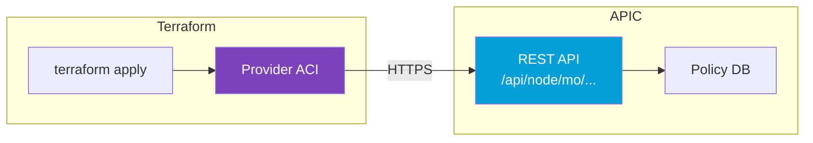

---
tags:
  - formation
  - terraform
  - aci
  - provider
  - api
  - authentification
---

# Module 5 : Provider Terraform ACI

## Objectifs du Module

À la fin de ce module, vous serez capable de :

- :fontawesome-solid-plug: Configurer le provider Terraform ACI
- :fontawesome-solid-key: Gérer l'authentification (password, certificate, signature)
- :fontawesome-solid-cubes: Utiliser les ressources et data sources principales
- :fontawesome-solid-code: Comprendre la structure des objets ACI en Terraform
- :fontawesome-solid-rotate: Gérer les imports et le lifecycle
- :fontawesome-solid-bug: Déboguer les erreurs courantes

**Durée estimée : 4 heures**

---

## Introduction au Provider ACI

### Qu'est-ce que le Provider ACI ?

Le **Provider Terraform ACI** est maintenu par **CiscoDevNet** et permet de gérer tous les objets ACI via l'API REST de l'APIC.



### Installation du Provider

```hcl
# versions.tf
terraform {
  required_version = ">= 1.0"

  required_providers {
    aci = {
      source  = "CiscoDevNet/aci"
      version = "~> 2.13"  # Ou la dernière version stable
    }
  }
}
```

**Commande d'initialisation :**

```bash
terraform init

# Output
Initializing provider plugins...
- Finding ciscodevnet/aci versions matching "~> 2.13"...
- Installing ciscodevnet/aci v2.13.0...
- Installed ciscodevnet/aci v2.13.0 (signed by a HashiCorp partner)
```

---

## Authentification

### Méthode 1 : Username/Password (Simple)

```hcl
# provider.tf
provider "aci" {
  username = var.apic_username
  password = var.apic_password
  url      = var.apic_url
  insecure = true  # Ignore SSL certificate (lab only!)
}

# variables.tf
variable "apic_url" {
  description = "URL de l'APIC (ex: https://apic.example.com)"
  type        = string
}

variable "apic_username" {
  description = "Utilisateur APIC"
  type        = string
  default     = "admin"
}

variable "apic_password" {
  description = "Mot de passe APIC"
  type        = string
  sensitive   = true
}
```

**Usage avec variables d'environnement :**

```bash
# Définir les variables d'environnement
export TF_VAR_apic_url="https://sandboxapicdc.cisco.com"
export TF_VAR_apic_username="admin"
export TF_VAR_apic_password="!v3G@!4@Y"

# Exécuter Terraform
terraform plan
```

!!! warning "Sécurité : Ne jamais hardcoder les credentials"
    - Utilisez des variables d'environnement
    - Ou un fichier `.tfvars` **non versionné**
    - Ou un secret manager (Vault, AWS Secrets Manager)

### Méthode 2 : Certificat X.509 (Production)

Pour la production, utilisez l'authentification par certificat.

**Étape 1 : Générer un certificat**

```bash
# Générer une clé privée
openssl genrsa -out terraform.key 2048

# Générer un certificat auto-signé
openssl req -new -x509 -days 365 \
  -key terraform.key \
  -out terraform.crt \
  -subj "/CN=terraform-automation/O=Worldline"
```

**Étape 2 : Configurer l'utilisateur dans APIC**

```
Admin > AAA > Users > Create Local User
- Username: terraform
- Certificate: (coller le contenu de terraform.crt)
```

**Étape 3 : Configurer le provider**

```hcl
provider "aci" {
  username    = "terraform"
  private_key = file("${path.module}/certs/terraform.key")
  cert_name   = "terraform"  # Nom du certificat dans APIC
  url         = var.apic_url
  insecure    = false
}
```

### Méthode 3 : Signature-Based Authentication

Pour les environnements très sécurisés :

```hcl
provider "aci" {
  username    = "terraform"
  private_key = var.apic_private_key
  cert_name   = "terraform-cert"
  url         = var.apic_url

  # Optionnel : timeout et retries
  retries = 3
  proxy_url = "http://proxy.example.com:8080"  # Si proxy requis
}
```

### Configuration Multi-APIC

Pour gérer plusieurs APICs (Multi-Site) :

```hcl
# Provider pour Site Paris
provider "aci" {
  alias    = "paris"
  username = var.apic_paris_user
  password = var.apic_paris_password
  url      = "https://apic-paris.example.com"
}

# Provider pour Site Londres
provider "aci" {
  alias    = "london"
  username = var.apic_london_user
  password = var.apic_london_password
  url      = "https://apic-london.example.com"
}

# Utilisation avec alias
resource "aci_tenant" "paris_tenant" {
  provider = aci.paris
  name     = "Paris-Production"
}

resource "aci_tenant" "london_tenant" {
  provider = aci.london
  name     = "London-Production"
}
```

---

## Structure des Ressources ACI

### Nomenclature des Ressources

Les ressources Terraform ACI suivent la convention :

```
aci_<object_type>
```

| Ressource Terraform | Objet ACI | Classe MO |
|---------------------|-----------|-----------|
| `aci_tenant` | Tenant | `fvTenant` |
| `aci_vrf` | VRF/Context | `fvCtx` |
| `aci_bridge_domain` | Bridge Domain | `fvBD` |
| `aci_subnet` | Subnet | `fvSubnet` |
| `aci_application_profile` | Application Profile | `fvAp` |
| `aci_application_epg` | EPG | `fvAEPg` |
| `aci_contract` | Contract | `vzBrCP` |
| `aci_filter` | Filter | `vzFilter` |

### Attributs Communs

Chaque ressource ACI a des attributs communs :

```hcl
resource "aci_tenant" "example" {
  # Attribut obligatoire : name
  name = "My-Tenant"

  # Attributs optionnels communs
  description = "Description de l'objet"
  annotation  = "orchestrator:terraform"  # Traçabilité
  name_alias  = "alias-court"             # Alias optionnel

  # Relation vers le parent (si applicable)
  # tenant_dn = aci_tenant.parent.id
}
```

### Identifiants et Distinguished Names

ACI utilise des **Distinguished Names (DN)** comme identifiants :

```hcl
# L'attribut "id" retourne le DN complet
output "tenant_dn" {
  value = aci_tenant.prod.id
  # Résultat : "uni/tn-Production"
}

output "epg_dn" {
  value = aci_application_epg.web.id
  # Résultat : "uni/tn-Production/ap-WebApp/epg-Frontend"
}
```

**Structure des DNs :**

```
uni                           # Universe (root)
└── tn-<tenant_name>          # Tenant
    ├── ctx-<vrf_name>        # VRF
    ├── BD-<bd_name>          # Bridge Domain
    │   └── subnet-[<ip>]     # Subnet
    └── ap-<app_name>         # Application Profile
        └── epg-<epg_name>    # EPG
```

---

## Data Sources

### Lire des Objets Existants

Les **data sources** permettent de lire des objets existants sans les gérer.

```hcl
# Lire un Tenant existant
data "aci_tenant" "common" {
  name = "common"
}

# Utiliser le DN dans une autre ressource
resource "aci_vrf" "shared" {
  tenant_dn = data.aci_tenant.common.id
  name      = "Shared-VRF"
}
```

### Data Sources Courants

```hcl
# VMM Domain (VMware vCenter)
data "aci_vmm_domain" "vcenter" {
  provider_profile_dn = "uni/vmmp-VMware"
  name                = "vCenter-Production"
}

# Physical Domain
data "aci_physical_domain" "baremetal" {
  name = "PhysDom-Baremetal"
}

# L3 Domain (pour L3Out)
data "aci_l3_domain_profile" "external" {
  name = "L3Dom-External"
}

# VLAN Pool
data "aci_vlan_pool" "prod" {
  name       = "VLAN-Pool-Prod"
  alloc_mode = "static"
}

# AEP (Attachable Access Entity Profile)
data "aci_attachable_access_entity_profile" "aep" {
  name = "AEP-Production"
}
```

### Requêtes Conditionnelles

```hcl
# Récupérer tous les EPGs d'un Application Profile
data "aci_application_epg" "all_epgs" {
  for_each = toset(["Frontend", "Backend", "Database"])

  application_profile_dn = aci_application_profile.app.id
  name                   = each.value
}

# Utilisation
output "epg_ids" {
  value = { for k, v in data.aci_application_epg.all_epgs : k => v.id }
}
```

---

## Ressources Principales

### Tenant et Structure

```hcl
# Tenant
resource "aci_tenant" "prod" {
  name        = "Production"
  description = "Environnement de production"
  annotation  = "orchestrator:terraform"
}

# VRF
resource "aci_vrf" "main" {
  tenant_dn              = aci_tenant.prod.id
  name                   = "Main-VRF"
  pc_enf_pref            = "enforced"
  pc_enf_dir             = "ingress"
  bd_enforced_enable     = "no"
  ip_data_plane_learning = "enabled"
  knw_mcast_act          = "permit"
  annotation             = "orchestrator:terraform"
}

# Bridge Domain
resource "aci_bridge_domain" "web" {
  tenant_dn                = aci_tenant.prod.id
  name                     = "BD-Web"
  relation_fv_rs_ctx       = aci_vrf.main.id
  arp_flood                = "no"
  ep_clear                 = "no"
  ep_move_detect_mode      = "garp"
  host_based_routing       = "no"
  intersite_bum_traffic_allow = "no"
  intersite_l2_stretch     = "no"
  ip_learning              = "yes"
  limit_ip_learn_to_subnets = "yes"
  ll_addr                  = "::"
  mac                      = "00:22:BD:F8:19:FF"
  mcast_allow              = "no"
  multi_dst_pkt_act        = "bd-flood"
  optimize_wan_bandwidth   = "no"
  unicast_route            = "yes"
  unk_mac_ucast_act        = "proxy"
  unk_mcast_act            = "flood"
  vmac                     = "not-applicable"
  annotation               = "orchestrator:terraform"
}

# Subnet
resource "aci_subnet" "web" {
  parent_dn   = aci_bridge_domain.web.id
  ip          = "10.1.1.1/24"
  scope       = ["public"]
  description = "Subnet serveurs web"
  preferred   = "yes"
  virtual     = "no"
  ctrl        = ["nd"]  # Neighbor Discovery
}
```

### EPG et Associations

```hcl
# Application Profile
resource "aci_application_profile" "app" {
  tenant_dn   = aci_tenant.prod.id
  name        = "E-Commerce"
  description = "Application e-commerce"
  annotation  = "orchestrator:terraform"
}

# EPG
resource "aci_application_epg" "frontend" {
  application_profile_dn = aci_application_profile.app.id
  name                   = "Frontend"
  description            = "Web servers"
  relation_fv_rs_bd      = aci_bridge_domain.web.id
  pc_enf_pref            = "unenforced"  # Intra-EPG policy
  pref_gr_memb           = "exclude"     # Preferred group
  flood_on_encap         = "disabled"
  fwd_ctrl               = "none"
  has_mcast_source       = "no"
  is_attr_based_epg      = "no"
  match_t                = "AtleastOne"
  prio                   = "unspecified"
  shutdown               = "no"
  annotation             = "orchestrator:terraform"
}

# Association EPG → VMM Domain
resource "aci_epg_to_domain" "frontend_vmm" {
  application_epg_dn    = aci_application_epg.frontend.id
  tdn                   = data.aci_vmm_domain.vcenter.id
  vmm_allow_promiscuous = "reject"
  vmm_forged_transmits  = "reject"
  vmm_mac_changes       = "reject"
  instr_imedcy          = "immediate"
  res_imedcy            = "immediate"
}

# Static Path Binding (serveur physique)
resource "aci_epg_to_static_path" "frontend_server" {
  application_epg_dn = aci_application_epg.frontend.id
  tdn                = "topology/pod-1/paths-101/pathep-[eth1/10]"
  encap              = "vlan-100"
  mode               = "regular"  # regular, native, untagged
  instr_imedcy       = "immediate"
}
```

### Contracts Complets

```hcl
# Filter
resource "aci_filter" "https" {
  tenant_dn   = aci_tenant.prod.id
  name        = "HTTPS"
  description = "HTTPS Filter"
  annotation  = "orchestrator:terraform"
}

# Filter Entry
resource "aci_filter_entry" "https" {
  filter_dn     = aci_filter.https.id
  name          = "https"
  description   = "HTTPS TCP/443"
  ether_t       = "ipv4"
  prot          = "tcp"
  d_from_port   = "https"
  d_to_port     = "https"
  s_from_port   = "unspecified"
  s_to_port     = "unspecified"
  stateful      = "yes"
  tcp_rules     = "unspecified"
  apply_to_frag = "no"
  arp_opc       = "unspecified"
  icmpv4_t      = "unspecified"
  icmpv6_t      = "unspecified"
  match_dscp    = "unspecified"
  annotation    = "orchestrator:terraform"
}

# Contract
resource "aci_contract" "web" {
  tenant_dn   = aci_tenant.prod.id
  name        = "Web-Contract"
  description = "Contract pour trafic web"
  scope       = "context"
  prio        = "unspecified"
  target_dscp = "unspecified"
  annotation  = "orchestrator:terraform"
}

# Contract Subject
resource "aci_contract_subject" "web" {
  contract_dn                  = aci_contract.web.id
  name                         = "HTTPS"
  description                  = "HTTPS Subject"
  rev_flt_ports                = "yes"
  prio                         = "unspecified"
  target_dscp                  = "unspecified"
  cons_match_t                 = "AtleastOne"
  prov_match_t                 = "AtleastOne"
  annotation                   = "orchestrator:terraform"
}

# Subject → Filter association
resource "aci_contract_subject_filter" "web" {
  contract_subject_dn = aci_contract_subject.web.id
  filter_dn           = aci_filter.https.id
  action              = "permit"
  directives          = ["none"]
  priority_override   = "default"
}

# EPG → Contract (Consumer)
resource "aci_epg_to_contract" "frontend_consumer" {
  application_epg_dn = aci_application_epg.frontend.id
  contract_dn        = aci_contract.web.id
  contract_type      = "consumer"
  prio               = "unspecified"
  match_t            = "AtleastOne"
}

# EPG → Contract (Provider)
resource "aci_epg_to_contract" "backend_provider" {
  application_epg_dn = aci_application_epg.backend.id
  contract_dn        = aci_contract.web.id
  contract_type      = "provider"
  prio               = "unspecified"
  match_t            = "AtleastOne"
}
```

---

## Import d'Objets Existants

### Importer un Tenant

Pour importer un objet existant dans le state Terraform :

```bash
# Syntaxe : terraform import <resource_address> <object_dn>
terraform import aci_tenant.existing "uni/tn-Existing-Tenant"
```

**Exemple complet :**

```hcl
# Déclarer la ressource vide
resource "aci_tenant" "existing" {
  name = "Existing-Tenant"
}
```

```bash
# Importer
terraform import aci_tenant.existing "uni/tn-Existing-Tenant"

# Vérifier l'état
terraform state show aci_tenant.existing

# Générer la configuration
# (Copiez les attributs affichés dans votre fichier .tf)
```

### Import en Masse

Pour importer plusieurs objets, utilisez un script :

```bash
#!/bin/bash
# import_tenants.sh

TENANTS=("Tenant-A" "Tenant-B" "Tenant-C")

for tenant in "${TENANTS[@]}"; do
  terraform import "aci_tenant.imported[\"$tenant\"]" "uni/tn-$tenant"
done
```

```hcl
# Configuration avec for_each
variable "existing_tenants" {
  default = ["Tenant-A", "Tenant-B", "Tenant-C"]
}

resource "aci_tenant" "imported" {
  for_each = toset(var.existing_tenants)
  name     = each.value
}
```

---

## Lifecycle et Meta-Arguments

### Prevent Destroy

Empêcher la suppression accidentelle :

```hcl
resource "aci_tenant" "critical" {
  name = "Production-Critical"

  lifecycle {
    prevent_destroy = true
  }
}
```

### Ignore Changes

Ignorer les changements sur certains attributs (modifiés manuellement) :

```hcl
resource "aci_bridge_domain" "managed" {
  tenant_dn          = aci_tenant.prod.id
  name               = "BD-Managed"
  relation_fv_rs_ctx = aci_vrf.main.id

  lifecycle {
    ignore_changes = [
      description,  # Peut être modifié manuellement
      annotation,
    ]
  }
}
```

### Create Before Destroy

Pour les objets avec dépendances :

```hcl
resource "aci_vrf" "rotating" {
  tenant_dn = aci_tenant.prod.id
  name      = "VRF-${var.version}"

  lifecycle {
    create_before_destroy = true
  }
}
```

### Replace Triggered By

Forcer le remplacement si un autre objet change :

```hcl
resource "aci_application_epg" "dependent" {
  application_profile_dn = aci_application_profile.app.id
  name                   = "Dependent-EPG"
  relation_fv_rs_bd      = aci_bridge_domain.main.id

  lifecycle {
    replace_triggered_by = [
      aci_bridge_domain.main.id
    ]
  }
}
```

---

## Débogage et Troubleshooting

### Activer les Logs Détaillés

```bash
# Niveau de log : TRACE, DEBUG, INFO, WARN, ERROR
export TF_LOG=DEBUG

# Log dans un fichier
export TF_LOG_PATH="terraform.log"

# Exécuter Terraform
terraform apply
```

### Erreurs Courantes

**Erreur 1 : Authentification échouée**

```
Error: Failed to authenticate with APIC
```

**Solutions :**
- Vérifier URL, username, password
- Vérifier que l'utilisateur a les droits admin
- Vérifier le certificat SSL (`insecure = true` pour lab)

**Erreur 2 : Objet déjà existant**

```
Error: Object already exists: uni/tn-MyTenant
```

**Solutions :**
- Importer l'objet : `terraform import aci_tenant.my "uni/tn-MyTenant"`
- Supprimer l'objet existant dans APIC

**Erreur 3 : Référence invalide**

```
Error: Reference to undeclared resource
```

**Solutions :**
- Vérifier l'ordre des dépendances
- Utiliser `depends_on` si nécessaire

**Erreur 4 : Version du provider**

```
Error: Provider version constraint not satisfied
```

**Solutions :**
- Mettre à jour le provider : `terraform init -upgrade`
- Vérifier la contrainte de version dans `required_providers`

### Vérifier l'API APIC

Utilisez `curl` pour tester l'API directement :

```bash
# Login et récupérer le token
TOKEN=$(curl -sk -X POST "https://apic.example.com/api/aaaLogin.json" \
  -d '{"aaaUser":{"attributes":{"name":"admin","pwd":"password"}}}' \
  | jq -r '.imdata[0].aaaLogin.attributes.token')

# Lister les Tenants
curl -sk "https://apic.example.com/api/node/class/fvTenant.json" \
  -H "Cookie: APIC-Cookie=$TOKEN" | jq

# Récupérer un objet spécifique
curl -sk "https://apic.example.com/api/node/mo/uni/tn-Production.json" \
  -H "Cookie: APIC-Cookie=$TOKEN" | jq
```

---

## Exercice Pratique

!!! example "Lab 5.1 : Configuration Avancée du Provider"

    **Objectif** : Configurer le provider avec certificat et gérer le lifecycle.

    **Étapes :**

    1. **Générer un certificat** (si possible sur votre APIC)

        ```bash
        openssl genrsa -out terraform.key 2048
        openssl req -new -x509 -days 365 \
          -key terraform.key -out terraform.crt \
          -subj "/CN=terraform/O=Lab"
        ```

    2. **Configurer le provider avec fallback**

        ```hcl
        provider "aci" {
          # Essayer certificat d'abord, puis password
          username    = var.apic_username
          private_key = fileexists("terraform.key") ? file("terraform.key") : null
          cert_name   = fileexists("terraform.key") ? "terraform" : null
          password    = fileexists("terraform.key") ? null : var.apic_password
          url         = var.apic_url
          insecure    = true
        }
        ```

    3. **Créer une ressource avec lifecycle**

        ```hcl
        resource "aci_tenant" "lab" {
          name = "Lab-Provider"

          lifecycle {
            prevent_destroy = true
            ignore_changes  = [description]
          }
        }
        ```

    4. **Tester le debugging**

        ```bash
        export TF_LOG=DEBUG
        terraform plan
        ```

    5. **Importer un objet existant** (si applicable)

        ```bash
        terraform import aci_tenant.common "uni/tn-common"
        ```

??? quote "Solution Lab 5.1"

    ```hcl
    # lab5/versions.tf
    terraform {
      required_version = ">= 1.0"

      required_providers {
        aci = {
          source  = "CiscoDevNet/aci"
          version = "~> 2.13"
        }
      }
    }

    # lab5/variables.tf
    variable "apic_url" {
      description = "URL APIC"
      type        = string
      default     = "https://sandboxapicdc.cisco.com"
    }

    variable "apic_username" {
      description = "Username APIC"
      type        = string
      default     = "admin"
    }

    variable "apic_password" {
      description = "Password APIC"
      type        = string
      sensitive   = true
    }

    # lab5/provider.tf
    provider "aci" {
      username = var.apic_username
      password = var.apic_password
      url      = var.apic_url
      insecure = true
    }

    # lab5/main.tf
    resource "aci_tenant" "lab" {
      name        = "Lab-Provider-Test"
      description = "Tenant créé via provider config avancée"
      annotation  = "orchestrator:terraform"

      lifecycle {
        prevent_destroy = false  # true en production
        ignore_changes  = [description]
      }
    }

    # Data source pour lire common
    data "aci_tenant" "common" {
      name = "common"
    }

    output "common_dn" {
      value = data.aci_tenant.common.id
    }

    output "lab_dn" {
      value = aci_tenant.lab.id
    }
    ```

    **Commandes de test :**

    ```bash
    cd lab5

    # Init
    terraform init

    # Plan avec debug
    export TF_LOG=DEBUG
    export TF_LOG_PATH="debug.log"
    terraform plan

    # Apply
    terraform apply -auto-approve

    # Vérifier le state
    terraform state list
    terraform state show aci_tenant.lab

    # Consulter les logs
    cat debug.log | grep -i "apic"
    ```

---

## Points Clés à Retenir

!!! abstract "Résumé du Module 5"

    ### Configuration Provider

    ```hcl
    provider "aci" {
      username = var.apic_username
      password = var.apic_password  # ou private_key + cert_name
      url      = var.apic_url
      insecure = true  # false en production avec SSL valide
    }
    ```

    ### Authentification

    | Méthode | Usage | Sécurité |
    |---------|-------|----------|
    | Password | Lab, Dev | ⭐ |
    | Certificat | Production | ⭐⭐⭐ |
    | Signature | Haute sécurité | ⭐⭐⭐⭐ |

    ### Structure des Ressources

    - Ressource : `aci_<object_type>`
    - ID = Distinguished Name (DN)
    - Relations via `_dn` ou `relation_*`

    ### Data Sources

    - Lire sans gérer
    - Utile pour objets existants
    - VMM Domains, Physical Domains, etc.

    ### Lifecycle

    - `prevent_destroy` : Protéger les ressources critiques
    - `ignore_changes` : Ignorer les modifications manuelles
    - `create_before_destroy` : Migration sans interruption

    ### Debugging

    ```bash
    export TF_LOG=DEBUG
    terraform plan 2>&1 | tee debug.log
    ```

---

## Navigation

| Précédent | Suivant |
|-----------|---------|
| [← Module 4 : Contracts & Filters](04-module.md) | [Module 6 : Patterns & Modules →](06-module.md) |
