---
tags:
  - formation
  - terraform
  - aci
  - l3out
  - bgp
  - ospf
  - routage
---

# Module 7 : Flux Nord-Sud (L3Out)

## Objectifs du Module

À la fin de ce module, vous serez capable de :

- :fontawesome-solid-arrow-up-right-from-square: Comprendre le concept de trafic Nord-Sud
- :fontawesome-solid-route: Configurer un L3Out pour la connectivité externe
- :fontawesome-solid-network-wired: Déployer BGP et OSPF avec Terraform
- :fontawesome-solid-globe: Créer des External EPGs pour le trafic Internet
- :fontawesome-solid-shield-halved: Sécuriser les flux Nord-Sud avec des Contracts
- :fontawesome-solid-shuffle: Configurer le NAT (Network Address Translation)

**Durée estimée : 4 heures**

---

## Comprendre le Trafic Nord-Sud

### Définition

Le trafic **Nord-Sud** désigne les flux qui **entrent ou sortent** du datacenter ACI.

```mermaid
graph TB
    subgraph "Monde Extérieur (Nord)"
        INET["🌐 Internet"]
        WAN["🏢 WAN Corporate"]
        PARTNER["🤝 Partenaires"]
    end

    subgraph "Fabric ACI (Sud)"
        L3OUT["🔀 L3Out<br/>(Border Leaf)"]

        subgraph "Applications"
            WEB["EPG: Web"]
            APP["EPG: App"]
            DB["EPG: DB"]
        end
    end

    INET -->|"Nord → Sud"| L3OUT
    WAN -->|"Nord → Sud"| L3OUT
    PARTNER -->|"Nord → Sud"| L3OUT

    L3OUT --> WEB
    WEB --> APP
    APP --> DB

    WEB -->|"Sud → Nord"| L3OUT
    L3OUT -->|"Sud → Nord"| INET

    style L3OUT fill:#2196f3,color:#fff
    style INET fill:#4caf50,color:#fff
```



### Comparaison avec Est-Ouest

| Aspect | Nord-Sud | Est-Ouest |
|--------|----------|-----------|
| **Direction** | Entrée/Sortie datacenter | Interne datacenter |
| **Acteurs** | Internet, WAN, partenaires | EPG vers EPG |
| **Composant ACI** | L3Out | Contracts |
| **Protocoles** | BGP, OSPF, Static | Contracts + Filters |
| **Sécurité** | Firewall périmétre | Micro-segmentation |

---

## Architecture L3Out

### Composants d'un L3Out

```mermaid
graph TB
    subgraph "L3Out Architecture"
        L3OUT["L3 Outside<br/>(L3Out)"]

        L3OUT --> LNP["Logical Node Profile<br/>(Quel(s) Leaf)"]
        L3OUT --> EXTEPG["External EPG<br/>(Subnets externes)"]

        LNP --> LIP["Logical Interface Profile<br/>(Quel(s) interface)"]

        LIP --> PROTO["Protocol<br/>(BGP/OSPF/Static)"]

        subgraph "Association"
            EXTEPG --> CONTRACT["Contract<br/>(Sécurité)"]
        end
    end

    style L3OUT fill:#2196f3,color:#fff
    style EXTEPG fill:#e91e63,color:#fff
    style CONTRACT fill:#9c27b0,color:#fff
```



### Hiérarchie des Objets

```
L3Out (fvL3Out)
├── Logical Node Profile (l3extLNodeP)
│   └── Logical Interface Profile (l3extLIfP)
│       └── Interface (l3extRsPathL3OutAtt)
│           └── Protocol Config (BGP/OSPF)
└── External EPG (l3extInstP)
    └── Subnet (l3extSubnet)
```

---

## Configuration L3Out avec Route Statique

### Scénario Simple


### Terraform : L3Out Statique

```hcl
# l3out-static.tf

# L3 Domain (doit exister ou être créé)
resource "aci_l3_domain_profile" "external" {
  name = "L3Dom-External"
}

# Association VLAN Pool au L3 Domain
resource "aci_vlan_pool" "external" {
  name       = "VLANPool-External"
  alloc_mode = "static"
}

resource "aci_ranges" "external" {
  vlan_pool_dn = aci_vlan_pool.external.id
  from         = "vlan-100"
  to           = "vlan-199"
  alloc_mode   = "static"
}

resource "aci_l3_domain_profile" "external" {
  name                      = "L3Dom-External"
  relation_infra_rs_vlan_ns = aci_vlan_pool.external.id
}

# L3Out
resource "aci_l3_outside" "internet" {
  tenant_dn = aci_tenant.prod.id
  name      = "L3Out-Internet"

  # Association au VRF
  relation_l3ext_rs_ectx = aci_vrf.production.id

  # Association au L3 Domain
  relation_l3ext_rs_l3_dom_att = aci_l3_domain_profile.external.id

  annotation = "orchestrator:terraform"
}

# Logical Node Profile (sélection du Leaf)
resource "aci_logical_node_profile" "border" {
  l3_outside_dn = aci_l3_outside.internet.id
  name          = "Border-Leafs"
}

# Configuration du Node (Leaf 101)
resource "aci_logical_node_to_fabric_node" "leaf101" {
  logical_node_profile_dn = aci_logical_node_profile.border.id
  tdn                     = "topology/pod-1/node-101"
  rtr_id                  = "10.0.0.101"  # Router ID
  rtr_id_loop_back        = "yes"
}

# Logical Interface Profile
resource "aci_logical_interface_profile" "external_if" {
  logical_node_profile_dn = aci_logical_node_profile.border.id
  name                    = "External-Interface"
}

# Interface L3 (Routed Port)
resource "aci_l3out_path_attachment" "eth1_49" {
  logical_interface_profile_dn = aci_logical_interface_profile.external_if.id
  target_dn                    = "topology/pod-1/paths-101/pathep-[eth1/49]"
  if_inst_t                    = "l3-port"  # Routed port
  addr                         = "10.0.0.2/30"
  encap                        = "unknown"  # No encap for routed port
  mode                         = "regular"
}

# Route Statique vers le réseau externe
resource "aci_l3out_static_route" "default" {
  fabric_node_dn = aci_logical_node_to_fabric_node.leaf101.id
  ip             = "0.0.0.0/0"  # Default route
  pref           = 1            # Administrative distance
  aggregate      = "no"

  relation_ip_rs_route_track = ""  # No tracking
}

resource "aci_l3out_static_route_next_hop" "router" {
  static_route_dn          = aci_l3out_static_route.default.id
  nh_addr                  = "10.0.0.1"  # Next-hop (routeur externe)
  pref                     = 1
  nexthop_profile_type     = "prefix"
}

# External EPG (réseaux accessibles)
resource "aci_external_network_instance_profile" "internet" {
  l3_outside_dn = aci_l3_outside.internet.id
  name          = "Internet"
  pref_gr_memb  = "exclude"

  annotation = "orchestrator:terraform"
}

# Subnet externe (0.0.0.0/0 = tout Internet)
resource "aci_l3_ext_subnet" "internet_all" {
  external_network_instance_profile_dn = aci_external_network_instance_profile.internet.id
  ip                                   = "0.0.0.0/0"
  scope                                = ["import-security", "export-rtctrl"]
}
```

---

## Configuration L3Out avec BGP

### Scénario BGP


### Terraform : L3Out BGP

```hcl
# l3out-bgp.tf

# L3Out avec BGP
resource "aci_l3_outside" "wan" {
  tenant_dn                   = aci_tenant.prod.id
  name                        = "L3Out-WAN-BGP"
  relation_l3ext_rs_ectx      = aci_vrf.production.id
  relation_l3ext_rs_l3_dom_att = aci_l3_domain_profile.external.id

  annotation = "orchestrator:terraform"
}

# Logical Node Profile
resource "aci_logical_node_profile" "bgp_border" {
  l3_outside_dn = aci_l3_outside.wan.id
  name          = "BGP-Border-Leafs"
}

# Node avec Router ID
resource "aci_logical_node_to_fabric_node" "bgp_leaf101" {
  logical_node_profile_dn = aci_logical_node_profile.bgp_border.id
  tdn                     = "topology/pod-1/node-101"
  rtr_id                  = "10.255.255.101"
  rtr_id_loop_back        = "yes"
}

# Interface Profile
resource "aci_logical_interface_profile" "bgp_if" {
  logical_node_profile_dn = aci_logical_node_profile.bgp_border.id
  name                    = "BGP-Interface"
}

# Interface L3 (SVI sur VLAN)
resource "aci_l3out_path_attachment" "bgp_svi" {
  logical_interface_profile_dn = aci_logical_interface_profile.bgp_if.id
  target_dn                    = "topology/pod-1/paths-101/pathep-[eth1/49]"
  if_inst_t                    = "sub-interface"  # Sub-interface avec VLAN
  addr                         = "10.0.0.2/30"
  encap                        = "vlan-100"
  mode                         = "regular"
}

# BGP Peer Profile (niveau Interface)
resource "aci_bgp_peer_connectivity_profile" "isp" {
  logical_node_profile_dn = aci_logical_node_profile.bgp_border.id
  addr                    = "10.0.0.1"  # IP du peer BGP
  addr_t_ctrl             = "af-mcast,af-ucast"
  as_number               = "65000"      # AS du peer (ISP)
  ctrl                    = "send-com,send-ext-com"
  peer_ctrl               = "bfd"        # BFD pour fast failover
  ttl                     = 1            # eBGP (TTL=1)
  weight                  = 0
  private_a_sctrl         = "remove-exclusive,remove-all"

  # Password MD5 (optionnel)
  # password = var.bgp_password

  annotation = "orchestrator:terraform"
}

# Route Control Profile (filtrage BGP)
resource "aci_route_control_profile" "bgp_import" {
  parent_dn = aci_l3_outside.wan.id
  name      = "BGP-Import-Policy"

  annotation = "orchestrator:terraform"
}

# Route Control Context (match/set)
resource "aci_route_control_context" "import_default" {
  route_control_profile_dn = aci_route_control_profile.bgp_import.id
  name                     = "Import-Default"
  action                   = "permit"
  order                    = 0
}

# Match Rule : accepter la default route
resource "aci_match_rule" "default_route" {
  tenant_dn = aci_tenant.prod.id
  name      = "Match-Default-Route"
}

resource "aci_match_route_destination_rule" "default" {
  match_rule_dn = aci_match_rule.default_route.id
  ip            = "0.0.0.0/0"
  aggregate     = "no"
}

# External EPG
resource "aci_external_network_instance_profile" "wan" {
  l3_outside_dn = aci_l3_outside.wan.id
  name          = "WAN-Networks"

  # Route Control pour BGP
  relation_l3ext_rs_inst_p_to_profile {
    tn_rtctrl_profile_dn = aci_route_control_profile.bgp_import.id
    direction            = "import"
  }
}

resource "aci_l3_ext_subnet" "wan_subnets" {
  external_network_instance_profile_dn = aci_external_network_instance_profile.wan.id
  ip                                   = "0.0.0.0/0"
  scope                                = ["import-security"]
}
```

---

## Configuration L3Out avec OSPF

### Scénario OSPF


### Terraform : L3Out OSPF

```hcl
# l3out-ospf.tf

# L3Out avec OSPF
resource "aci_l3_outside" "core" {
  tenant_dn                   = aci_tenant.prod.id
  name                        = "L3Out-Core-OSPF"
  relation_l3ext_rs_ectx      = aci_vrf.production.id
  relation_l3ext_rs_l3_dom_att = aci_l3_domain_profile.external.id
}

# OSPF External Policy (lié au L3Out)
resource "aci_l3out_ospf_external_policy" "core" {
  l3_outside_dn = aci_l3_outside.core.id
  area_cost     = 1
  area_ctrl     = "redistribute,summary"
  area_id       = "0.0.0.0"  # Area 0 (backbone)
  area_type     = "regular"
}

# Logical Node Profile
resource "aci_logical_node_profile" "ospf_border" {
  l3_outside_dn = aci_l3_outside.core.id
  name          = "OSPF-Border"
}

resource "aci_logical_node_to_fabric_node" "ospf_leaf101" {
  logical_node_profile_dn = aci_logical_node_profile.ospf_border.id
  tdn                     = "topology/pod-1/node-101"
  rtr_id                  = "10.255.255.101"
  rtr_id_loop_back        = "yes"
}

# Interface Profile avec OSPF
resource "aci_logical_interface_profile" "ospf_if" {
  logical_node_profile_dn = aci_logical_node_profile.ospf_border.id
  name                    = "OSPF-Interface"
}

resource "aci_l3out_path_attachment" "ospf_port" {
  logical_interface_profile_dn = aci_logical_interface_profile.ospf_if.id
  target_dn                    = "topology/pod-1/paths-101/pathep-[eth1/48]"
  if_inst_t                    = "l3-port"
  addr                         = "10.1.0.1/30"
}

# OSPF Interface Profile (paramètres OSPF sur l'interface)
resource "aci_l3out_ospf_interface_profile" "core" {
  logical_interface_profile_dn = aci_logical_interface_profile.ospf_if.id

  # Référence à une OSPF Interface Policy
  relation_ospf_rs_if_pol = aci_ospf_interface_policy.p2p.id
}

# OSPF Interface Policy
resource "aci_ospf_interface_policy" "p2p" {
  tenant_dn = aci_tenant.prod.id
  name      = "OSPF-P2P"
  nw_t      = "p2p"           # Point-to-point
  cost      = "1"
  ctrl      = "advert-subnet,mtu-ignore"
  dead_intvl = "40"
  hello_intvl = "10"
  prio      = "1"
  rexmit_intvl = "5"
  xmit_delay = "1"
}

# External EPG
resource "aci_external_network_instance_profile" "core_networks" {
  l3_outside_dn = aci_l3_outside.core.id
  name          = "Core-Networks"
}

resource "aci_l3_ext_subnet" "internal_routes" {
  external_network_instance_profile_dn = aci_external_network_instance_profile.core_networks.id
  ip                                   = "10.0.0.0/8"
  scope                                = ["import-security"]
}
```

---

## External EPG et Contracts

### Sécuriser les Flux Nord-Sud


### Terraform : Contracts L3Out

```hcl
# contracts-l3out.tf

# Contract : Internet vers Web
resource "aci_contract" "inet_to_web" {
  tenant_dn = aci_tenant.prod.id
  name      = "inet-to-web"
  scope     = "context"
}

resource "aci_contract_subject" "https_only" {
  contract_dn   = aci_contract.inet_to_web.id
  name          = "https-only"
  rev_flt_ports = "yes"
}

resource "aci_contract_subject_filter" "https" {
  contract_subject_dn = aci_contract_subject.https_only.id
  filter_dn           = aci_filter.https.id
}

# External EPG comme Consumer
resource "aci_external_network_instance_profile" "internet" {
  l3_outside_dn = aci_l3_outside.internet.id
  name          = "Internet"
}

# Association Contract (External EPG = Consumer)
resource "aci_contract_to_external_epg" "inet_consumer" {
  external_epg_dn = aci_external_network_instance_profile.internet.id
  contract_dn     = aci_contract.inet_to_web.id
  contract_type   = "consumer"
}

# EPG Web = Provider du Contract
resource "aci_epg_to_contract" "web_inet_provider" {
  application_epg_dn = aci_application_epg.frontend.id
  contract_dn        = aci_contract.inet_to_web.id
  contract_type      = "provider"
}
```

### External EPG avec Classification

```hcl
# Classification par subnet source
resource "aci_external_network_instance_profile" "trusted_partners" {
  l3_outside_dn = aci_l3_outside.wan.id
  name          = "Trusted-Partners"

  # Activier la classification externe
  flood_on_encap = "disabled"
  pref_gr_memb   = "exclude"
}

# Subnet spécifique pour partenaire A
resource "aci_l3_ext_subnet" "partner_a" {
  external_network_instance_profile_dn = aci_external_network_instance_profile.trusted_partners.id
  ip                                   = "192.168.100.0/24"
  scope                                = ["import-security", "export-rtctrl"]

  # Classification : trafic de ce subnet = External EPG "Trusted-Partners"
}

# Subnet spécifique pour partenaire B
resource "aci_l3_ext_subnet" "partner_b" {
  external_network_instance_profile_dn = aci_external_network_instance_profile.trusted_partners.id
  ip                                   = "192.168.200.0/24"
  scope                                = ["import-security", "export-rtctrl"]
}

# Contract spécial pour partenaires
resource "aci_contract" "partner_api_access" {
  tenant_dn = aci_tenant.prod.id
  name      = "partner-api-access"
  scope     = "context"
}

resource "aci_contract_to_external_epg" "partner_consumer" {
  external_epg_dn = aci_external_network_instance_profile.trusted_partners.id
  contract_dn     = aci_contract.partner_api_access.id
  contract_type   = "consumer"
}
```

---

## NAT avec Service Graph

### Concept NAT dans ACI

```mermaid
graph LR
    subgraph "External"
        INET["Internet<br/>Public IPs"]
    end

    subgraph "ACI + Firewall"
        L3OUT["L3Out"]
        FW["🔥 Firewall<br/>(NAT)"]
        EPG["EPG: Servers<br/>Private IPs"]
    end

    INET -->|"203.0.113.10"| L3OUT
    L3OUT --> FW
    FW -->|"NAT: 10.1.1.10"| EPG

    style FW fill:#f44336,color:#fff
```



### Terraform : Configuration Service Graph

```hcl
# service-graph.tf

# Device Package (le firewall)
data "aci_l4_l7_device" "firewall" {
  tenant_dn = aci_tenant.prod.id
  name      = "Firewall-ASAv"
}

# Service Graph Template
resource "aci_l4_l7_service_graph_template" "nat" {
  tenant_dn = aci_tenant.prod.id
  name      = "SG-NAT"

  # Définir les nodes du graph
  # Node 1 = Firewall
}

# Fonction du Service Graph (Firewall = Node)
resource "aci_function_node" "firewall" {
  l4_l7_service_graph_template_dn = aci_l4_l7_service_graph_template.nat.id
  name                            = "FW-Node"
  func_template_type              = "FW_ROUTED"
  func_type                       = "GoTo"
  managed                         = "no"

  # Relation vers le device
  relation_vns_rs_node_to_l_dev = data.aci_l4_l7_device.firewall.id
}

# Appliquer le Service Graph au Contract
resource "aci_contract_subject" "nat_subject" {
  contract_dn   = aci_contract.inet_to_web.id
  name          = "with-NAT"
  rev_flt_ports = "yes"

  # Associer le Service Graph
  relation_vz_rs_subj_graph_att = aci_l4_l7_service_graph_template.nat.id
}
```

!!! note "NAT sur Firewall Externe"
    ACI ne fait pas de NAT natif. Le NAT est généralement configuré sur un firewall/load balancer inséré via un Service Graph.

---

## Exercice Pratique

!!! example "Lab 7.1 : Déployer un L3Out BGP"

    **Objectif** : Créer un L3Out avec peering BGP et sécuriser avec un Contract.

    **Scénario :**

    ```
    ACI Fabric (AS 65001)
    ├── Border Leaf 101
    │   └── Interface eth1/49: 10.255.0.2/30
    │
    └── Peer BGP (AS 65000): 10.255.0.1

    External EPG: Internet (0.0.0.0/0)
    Contract: inet-to-web (HTTPS seulement)
    ```

    **Étapes :**

    1. Créer le L3 Domain et VLAN Pool
    2. Créer le L3Out avec BGP
    3. Configurer le Logical Node Profile
    4. Ajouter le BGP Peer
    5. Créer l'External EPG avec subnet 0.0.0.0/0
    6. Créer et associer le Contract

    **Bonus :** Ajouter un deuxième Leaf pour la redondance

??? quote "Solution Lab 7.1"

    ```hcl
    # lab7/main.tf

    terraform {
      required_providers {
        aci = {
          source  = "CiscoDevNet/aci"
          version = "~> 2.13"
        }
      }
    }

    provider "aci" {
      username = var.apic_username
      password = var.apic_password
      url      = var.apic_url
      insecure = true
    }

    # Variables
    variable "apic_url" { type = string }
    variable "apic_username" { type = string }
    variable "apic_password" { type = string; sensitive = true }

    # Tenant et VRF
    resource "aci_tenant" "lab" {
      name       = "Lab-L3Out"
      annotation = "orchestrator:terraform"
    }

    resource "aci_vrf" "prod" {
      tenant_dn   = aci_tenant.lab.id
      name        = "Production"
      pc_enf_pref = "enforced"
    }

    # L3 Domain
    resource "aci_vlan_pool" "external" {
      name       = "VLANPool-External"
      alloc_mode = "static"
    }

    resource "aci_ranges" "external" {
      vlan_pool_dn = aci_vlan_pool.external.id
      from         = "vlan-100"
      to           = "vlan-199"
      alloc_mode   = "static"
    }

    resource "aci_l3_domain_profile" "external" {
      name                      = "L3Dom-External"
      relation_infra_rs_vlan_ns = aci_vlan_pool.external.id
    }

    # L3Out
    resource "aci_l3_outside" "internet" {
      tenant_dn                    = aci_tenant.lab.id
      name                         = "L3Out-Internet-BGP"
      relation_l3ext_rs_ectx       = aci_vrf.prod.id
      relation_l3ext_rs_l3_dom_att = aci_l3_domain_profile.external.id
      annotation                   = "orchestrator:terraform"
    }

    # Logical Node Profile
    resource "aci_logical_node_profile" "border" {
      l3_outside_dn = aci_l3_outside.internet.id
      name          = "Border-Leafs-BGP"
    }

    # Node 101
    resource "aci_logical_node_to_fabric_node" "leaf101" {
      logical_node_profile_dn = aci_logical_node_profile.border.id
      tdn                     = "topology/pod-1/node-101"
      rtr_id                  = "10.255.255.101"
      rtr_id_loop_back        = "yes"
    }

    # Logical Interface Profile
    resource "aci_logical_interface_profile" "bgp_if" {
      logical_node_profile_dn = aci_logical_node_profile.border.id
      name                    = "BGP-Interfaces"
    }

    # Interface L3
    resource "aci_l3out_path_attachment" "eth1_49" {
      logical_interface_profile_dn = aci_logical_interface_profile.bgp_if.id
      target_dn                    = "topology/pod-1/paths-101/pathep-[eth1/49]"
      if_inst_t                    = "sub-interface"
      addr                         = "10.255.0.2/30"
      encap                        = "vlan-100"
      mode                         = "regular"
    }

    # BGP Peer
    resource "aci_bgp_peer_connectivity_profile" "isp" {
      logical_node_profile_dn = aci_logical_node_profile.border.id
      addr                    = "10.255.0.1"
      addr_t_ctrl             = "af-ucast"
      as_number               = "65000"
      ctrl                    = "send-com,send-ext-com"
      ttl                     = 1
      weight                  = 0
      annotation              = "orchestrator:terraform"
    }

    # External EPG
    resource "aci_external_network_instance_profile" "internet" {
      l3_outside_dn = aci_l3_outside.internet.id
      name          = "Internet"
      annotation    = "orchestrator:terraform"
    }

    resource "aci_l3_ext_subnet" "all" {
      external_network_instance_profile_dn = aci_external_network_instance_profile.internet.id
      ip                                   = "0.0.0.0/0"
      scope                                = ["import-security"]
    }

    # Filter et Contract
    resource "aci_filter" "https" {
      tenant_dn = aci_tenant.lab.id
      name      = "filter-https"
    }

    resource "aci_filter_entry" "https" {
      filter_dn   = aci_filter.https.id
      name        = "https"
      ether_t     = "ipv4"
      prot        = "tcp"
      d_from_port = "443"
      d_to_port   = "443"
      stateful    = "yes"
    }

    resource "aci_contract" "inet_to_web" {
      tenant_dn = aci_tenant.lab.id
      name      = "inet-to-web"
      scope     = "context"
    }

    resource "aci_contract_subject" "https" {
      contract_dn   = aci_contract.inet_to_web.id
      name          = "https-only"
      rev_flt_ports = "yes"
    }

    resource "aci_contract_subject_filter" "https" {
      contract_subject_dn = aci_contract_subject.https.id
      filter_dn           = aci_filter.https.id
    }

    # External EPG consume le Contract
    resource "aci_external_epg_to_contract" "inet_consumer" {
      external_network_instance_profile_dn = aci_external_network_instance_profile.internet.id
      contract_dn                          = aci_contract.inet_to_web.id
      contract_type                        = "consumer"
    }

    # Output
    output "l3out_dn" {
      value = aci_l3_outside.internet.id
    }

    output "external_epg_dn" {
      value = aci_external_network_instance_profile.internet.id
    }
    ```

---

## Points Clés à Retenir

!!! abstract "Résumé du Module 7"

    ### Flux Nord-Sud

    - Trafic entrant/sortant du datacenter
    - Géré par les **L3Outs**
    - Border Leafs = point d'entrée/sortie

    ### Composants L3Out

    ```
    L3Out
    ├── Logical Node Profile (quels Leafs)
    │   └── Logical Interface Profile (quelles interfaces)
    │       └── BGP/OSPF/Static config
    └── External EPG (quels réseaux externes)
        └── Subnets (classification)
    ```

    ### Protocoles de Routage

    | Protocole | Usage | Complexité |
    |-----------|-------|------------|
    | Static | Simple, peu de routes | ⭐ |
    | OSPF | Interne, campus | ⭐⭐ |
    | BGP | Internet, multi-homing | ⭐⭐⭐ |

    ### Sécurité Nord-Sud

    - **External EPG** = Consumer ou Provider
    - **Contracts** = mêmes règles qu'internes
    - Classification par subnet source

    ### Bonnes Pratiques

    - Redondance : 2+ Border Leafs
    - BFD pour fast failover
    - Route filtering (import/export)
    - External EPGs granulaires (pas juste 0.0.0.0/0)

---

## Navigation

| Précédent | Suivant |
|-----------|---------|
| [← Module 6 : Patterns & Modules](06-module.md) | [Module 8 : Flux Est-Ouest →](08-module.md) |
