---
tags:
  - formation
  - terraform
  - aci
  - microsegmentation
  - est-ouest
  - security
---

# Module 8 : Flux Est-Ouest

## Objectifs du Module

À la fin de ce module, vous serez capable de :

- :fontawesome-solid-arrows-left-right: Comprendre le trafic Est-Ouest dans ACI
- :fontawesome-solid-shield-halved: Implémenter la micro-segmentation
- :fontawesome-solid-layer-group: Configurer les communications inter-EPG
- :fontawesome-solid-user-lock: Gérer le trafic intra-EPG
- :fontawesome-solid-tags: Utiliser les EPG basés sur attributs (uSeg)
- :fontawesome-solid-ban: Appliquer les Taboo Contracts stratégiquement

**Durée estimée : 3 heures**

---

## Comprendre le Trafic Est-Ouest

### Définition

Le trafic **Est-Ouest** désigne les flux **internes** au datacenter, entre applications et services.


### Types de Trafic Est-Ouest

| Type | Description | Exemple |
|------|-------------|---------|
| **Inter-EPG** | Entre EPGs différents | Frontend → Backend |
| **Intra-EPG** | Dans le même EPG | Web-01 ↔ Web-02 (cluster) |
| **Inter-VRF** | Entre VRFs (route leaking) | Prod → Management |
| **Inter-Tenant** | Entre Tenants | Shared Services |

---

## Micro-segmentation

### Concept

La **micro-segmentation** consiste à isoler chaque charge de travail et contrôler précisément les flux autorisés.


### Matrice de Flux

Documentez vos flux dans une matrice :

| Source | Destination | Protocole | Port | Contract |
|--------|-------------|-----------|------|----------|
| Frontend | Backend | TCP | 8080 | web-to-app |
| Backend | Database | TCP | 5432 | app-to-db |
| Backend | Cache | TCP | 6379 | app-to-cache |
| Monitoring | * | TCP | 9100 | monitoring |
| * | DNS | UDP | 53 | common-dns |

---

## Communications Inter-EPG

### Pattern Standard 3-Tier

```hcl
# inter-epg.tf

# Définition des EPGs
locals {
  app_tiers = {
    frontend = {
      name    = "Frontend"
      bd_name = "BD-Web"
      ports   = [443]
    }
    backend = {
      name    = "Backend"
      bd_name = "BD-App"
      ports   = [8080, 8443]
    }
    database = {
      name    = "Database"
      bd_name = "BD-Data"
      ports   = [5432]
    }
  }

  # Définition des flux autorisés
  allowed_flows = [
    {
      name     = "web-to-app"
      consumer = "frontend"
      provider = "backend"
      ports    = [8080, 8443]
    },
    {
      name     = "app-to-db"
      consumer = "backend"
      provider = "database"
      ports    = [5432]
    }
  ]
}

# Créer les EPGs
resource "aci_application_epg" "tiers" {
  for_each = local.app_tiers

  application_profile_dn = aci_application_profile.main.id
  name                   = each.value.name
  relation_fv_rs_bd      = aci_bridge_domain.bds[each.value.bd_name].id
  annotation             = "orchestrator:terraform"
}

# Créer les Filters
resource "aci_filter" "tier_filters" {
  for_each = local.app_tiers

  tenant_dn = aci_tenant.prod.id
  name      = "filter-${each.key}"
}

resource "aci_filter_entry" "tier_ports" {
  for_each = {
    for item in flatten([
      for tier_key, tier in local.app_tiers : [
        for port in tier.ports : {
          key  = "${tier_key}-${port}"
          tier = tier_key
          port = port
        }
      ]
    ]) : item.key => item
  }

  filter_dn   = aci_filter.tier_filters[each.value.tier].id
  name        = "port-${each.value.port}"
  ether_t     = "ipv4"
  prot        = "tcp"
  d_from_port = tostring(each.value.port)
  d_to_port   = tostring(each.value.port)
  stateful    = "yes"
}

# Créer les Contracts
resource "aci_contract" "flows" {
  for_each = { for flow in local.allowed_flows : flow.name => flow }

  tenant_dn = aci_tenant.prod.id
  name      = each.key
  scope     = "context"
}

resource "aci_contract_subject" "flows" {
  for_each = { for flow in local.allowed_flows : flow.name => flow }

  contract_dn   = aci_contract.flows[each.key].id
  name          = "traffic"
  rev_flt_ports = "yes"
}

resource "aci_contract_subject_filter" "flows" {
  for_each = { for flow in local.allowed_flows : flow.name => flow }

  contract_subject_dn = aci_contract_subject.flows[each.key].id
  filter_dn           = aci_filter.tier_filters[each.value.provider].id
}

# Associations Consumer
resource "aci_epg_to_contract" "consumers" {
  for_each = { for flow in local.allowed_flows : flow.name => flow }

  application_epg_dn = aci_application_epg.tiers[each.value.consumer].id
  contract_dn        = aci_contract.flows[each.key].id
  contract_type      = "consumer"
}

# Associations Provider
resource "aci_epg_to_contract" "providers" {
  for_each = { for flow in local.allowed_flows : flow.name => flow }

  application_epg_dn = aci_application_epg.tiers[each.value.provider].id
  contract_dn        = aci_contract.flows[each.key].id
  contract_type      = "provider"
}
```

---

## Trafic Intra-EPG

### Comportement par Défaut

Par défaut, le trafic **intra-EPG** (entre endpoints du même EPG) peut être :

- **Permis** : VMs dans le même EPG communiquent librement
- **Bloqué** : Nécessite un Contract même pour le même EPG

```hcl
# Configurer le comportement intra-EPG au niveau VRF
resource "aci_vrf" "production" {
  tenant_dn   = aci_tenant.prod.id
  name        = "Production"
  pc_enf_pref = "enforced"

  # Intra-EPG isolation
  # "enforced" = bloque intra-EPG par défaut
  # "unenforced" = permet intra-EPG par défaut
}
```

### Autoriser le Trafic Intra-EPG

Pour autoriser explicitement :

```hcl
# Option 1 : Au niveau EPG (intra EPG class = unenforced)
resource "aci_application_epg" "clustered_app" {
  application_profile_dn = aci_application_profile.main.id
  name                   = "Clustered-App"
  relation_fv_rs_bd      = aci_bridge_domain.app.id

  # Permettre communication intra-EPG
  pc_enf_pref = "unenforced"
}

# Option 2 : Contract intra-EPG (Consumer = Provider = même EPG)
resource "aci_contract" "intra_cluster" {
  tenant_dn = aci_tenant.prod.id
  name      = "intra-cluster-comm"
  scope     = "context"
}

resource "aci_contract_subject" "cluster" {
  contract_dn   = aci_contract.intra_cluster.id
  name          = "cluster-traffic"
  rev_flt_ports = "yes"
}

resource "aci_contract_subject_filter" "cluster" {
  contract_subject_dn = aci_contract_subject.cluster.id
  filter_dn           = aci_filter.permit_all.id
}

# EPG comme Consumer ET Provider du même Contract
resource "aci_epg_to_contract" "cluster_consumer" {
  application_epg_dn = aci_application_epg.clustered_app.id
  contract_dn        = aci_contract.intra_cluster.id
  contract_type      = "consumer"
}

resource "aci_epg_to_contract" "cluster_provider" {
  application_epg_dn = aci_application_epg.clustered_app.id
  contract_dn        = aci_contract.intra_cluster.id
  contract_type      = "provider"
}
```

---

## vzAny pour Flux Communs

### Services Partagés

Utilisez **vzAny** pour les flux communs à tous les EPGs :


```hcl
# vzany.tf

# vzAny représente tous les EPGs du VRF
resource "aci_any" "production" {
  vrf_dn       = aci_vrf.production.id
  pref_gr_memb = "disabled"
}

# Contract pour services communs (DNS, NTP)
resource "aci_contract" "common_services" {
  tenant_dn = aci_tenant.prod.id
  name      = "common-services"
  scope     = "context"
}

# Filters pour DNS et NTP
resource "aci_filter" "dns" {
  tenant_dn = aci_tenant.prod.id
  name      = "filter-dns"
}

resource "aci_filter_entry" "dns_udp" {
  filter_dn   = aci_filter.dns.id
  name        = "dns-udp"
  ether_t     = "ipv4"
  prot        = "udp"
  d_from_port = "53"
  d_to_port   = "53"
}

resource "aci_filter" "ntp" {
  tenant_dn = aci_tenant.prod.id
  name      = "filter-ntp"
}

resource "aci_filter_entry" "ntp" {
  filter_dn   = aci_filter.ntp.id
  name        = "ntp"
  ether_t     = "ipv4"
  prot        = "udp"
  d_from_port = "123"
  d_to_port   = "123"
}

# Subjects
resource "aci_contract_subject" "dns" {
  contract_dn   = aci_contract.common_services.id
  name          = "dns"
  rev_flt_ports = "yes"
}

resource "aci_contract_subject_filter" "dns" {
  contract_subject_dn = aci_contract_subject.dns.id
  filter_dn           = aci_filter.dns.id
}

resource "aci_contract_subject" "ntp" {
  contract_dn   = aci_contract.common_services.id
  name          = "ntp"
  rev_flt_ports = "yes"
}

resource "aci_contract_subject_filter" "ntp" {
  contract_subject_dn = aci_contract_subject.ntp.id
  filter_dn           = aci_filter.ntp.id
}

# vzAny comme Consumer
resource "aci_any_to_contract" "vzany_common" {
  any_dn        = aci_any.production.id
  contract_dn   = aci_contract.common_services.id
  contract_type = "consumer"
}

# EPG Infrastructure comme Provider
resource "aci_epg_to_contract" "infra_provider" {
  application_epg_dn = aci_application_epg.infrastructure.id
  contract_dn        = aci_contract.common_services.id
  contract_type      = "provider"
}
```

---

## Isolation avec Taboo Contracts

### Bloquer des Flux Spécifiques

```mermaid
graph LR
    subgraph "Sans Taboo"
        FE1["Frontend"] -->|"Possible<br/>(si Contract)"| DB1["Database"]
    end

    subgraph "Avec Taboo"
        FE2["Frontend"] -.->|"🚫 TABOO<br/>Bloqué!"| DB2["Database"]
    end

    style DB1 fill:#f44336,color:#fff
    style DB2 fill:#f44336,color:#fff
```



```hcl
# taboo.tf

# Taboo Contract : Interdire Frontend → Database directement
resource "aci_taboo_contract" "no_frontend_to_db" {
  tenant_dn   = aci_tenant.prod.id
  name        = "taboo-no-direct-db-access"
  description = "Interdit l'accès direct Frontend → Database"
}

resource "aci_taboo_contract_subject" "block_db" {
  taboo_contract_dn = aci_taboo_contract.no_frontend_to_db.id
  name              = "block-database-ports"
}

# Bloquer tous les ports database
resource "aci_filter" "all_db_ports" {
  tenant_dn = aci_tenant.prod.id
  name      = "filter-all-db-ports"
}

resource "aci_filter_entry" "postgres" {
  filter_dn   = aci_filter.all_db_ports.id
  name        = "postgres"
  ether_t     = "ipv4"
  prot        = "tcp"
  d_from_port = "5432"
  d_to_port   = "5432"
}

resource "aci_filter_entry" "mysql" {
  filter_dn   = aci_filter.all_db_ports.id
  name        = "mysql"
  ether_t     = "ipv4"
  prot        = "tcp"
  d_from_port = "3306"
  d_to_port   = "3306"
}

resource "aci_filter_entry" "mssql" {
  filter_dn   = aci_filter.all_db_ports.id
  name        = "mssql"
  ether_t     = "ipv4"
  prot        = "tcp"
  d_from_port = "1433"
  d_to_port   = "1433"
}

# Association Filter au Taboo Subject
resource "aci_taboo_contract_subject_filter" "block_db" {
  taboo_contract_subject_dn = aci_taboo_contract_subject.block_db.id
  filter_dn                 = aci_filter.all_db_ports.id
}

# Appliquer le Taboo au Database EPG
resource "aci_epg_to_contract" "db_taboo" {
  application_epg_dn = aci_application_epg.database.id
  contract_dn        = aci_taboo_contract.no_frontend_to_db.id
  contract_type      = "taboo"
}
```

---

## EPG Basés sur Attributs (uSeg)

### Micro-segmentation Avancée

Les **uSeg EPGs** permettent de classifier les endpoints sur des attributs (IP, MAC, VM Name, etc.) plutôt que sur le port physique.


### Terraform : uSeg EPG

```hcl
# useg-epg.tf

# EPG de base (standard)
resource "aci_application_epg" "base_epg" {
  application_profile_dn = aci_application_profile.main.id
  name                   = "Base-EPG"
  relation_fv_rs_bd      = aci_bridge_domain.main.id

  # Activer uSeg
  is_attr_based_epg = "yes"
}

# uSeg EPG : Classification par IP
resource "aci_application_epg" "useg_by_ip" {
  application_profile_dn = aci_application_profile.main.id
  name                   = "PCI-Servers"
  relation_fv_rs_bd      = aci_bridge_domain.pci.id

  is_attr_based_epg = "yes"
  match_t           = "AtleastOne"  # Match any criterion

  annotation = "orchestrator:terraform"
}

# Critère de matching : Subnet IP
resource "aci_epg_useg_block_statement" "pci_ips" {
  application_epg_dn = aci_application_epg.useg_by_ip.id
  name               = "PCI-Subnet"
  match              = "any"
}

resource "aci_epg_useg_sub_block_statement" "subnet" {
  block_statement_dn = aci_epg_useg_block_statement.pci_ips.id
  name               = "IP-Range"
  match              = "any"
}

resource "aci_epg_useg_ip_attribute" "pci_subnet" {
  sub_block_statement_dn = aci_epg_useg_sub_block_statement.subnet.id
  name                   = "PCI-Subnet-Filter"
  ip                     = "10.100.0.0/24"
  use_epg_subnet         = "no"
}

# uSeg EPG : Classification par VM Name (VMware)
resource "aci_application_epg" "useg_by_vmname" {
  application_profile_dn = aci_application_profile.main.id
  name                   = "Web-Servers"
  relation_fv_rs_bd      = aci_bridge_domain.web.id

  is_attr_based_epg = "yes"
  match_t           = "AtleastOne"
}

resource "aci_epg_useg_block_statement" "web_vms" {
  application_epg_dn = aci_application_epg.useg_by_vmname.id
  name               = "Web-VMs"
  match              = "any"
}

resource "aci_epg_useg_sub_block_statement" "vm_name" {
  block_statement_dn = aci_epg_useg_block_statement.web_vms.id
  name               = "VM-Name-Match"
  match              = "any"
}

resource "aci_epg_useg_vm_attribute" "web_prefix" {
  sub_block_statement_dn = aci_epg_useg_sub_block_statement.vm_name.id
  name                   = "Web-VM-Prefix"
  type                   = "vm-name"
  operator               = "starts-with"
  value                  = "web-"  # VMs dont le nom commence par "web-"
}
```

---

## Scénario PCI-DSS : Segmentation Stricte

### Architecture PCI-DSS


### Terraform : Implémentation PCI-DSS

```hcl
# pci-dss-segmentation.tf

# ===== VRFs =====

# VRF PCI isolé
resource "aci_vrf" "pci_cde" {
  tenant_dn   = aci_tenant.prod.id
  name        = "PCI-CDE"
  pc_enf_pref = "enforced"
  pc_enf_dir  = "ingress"

  annotation = "pci-dss:cde,orchestrator:terraform"
}

# VRF Applications (non-PCI)
resource "aci_vrf" "applications" {
  tenant_dn   = aci_tenant.prod.id
  name        = "Applications"
  pc_enf_pref = "enforced"
}

# ===== Bridge Domains =====

resource "aci_bridge_domain" "payment_api" {
  tenant_dn          = aci_tenant.prod.id
  name               = "BD-Payment-API"
  relation_fv_rs_ctx = aci_vrf.pci_cde.id
  arp_flood          = "no"
  unicast_route      = "yes"
  limit_ip_learn_to_subnets = "yes"

  annotation = "pci-dss:cde"
}

resource "aci_bridge_domain" "card_database" {
  tenant_dn          = aci_tenant.prod.id
  name               = "BD-Card-Database"
  relation_fv_rs_ctx = aci_vrf.pci_cde.id
  arp_flood          = "no"
  unicast_route      = "yes"
  limit_ip_learn_to_subnets = "yes"

  annotation = "pci-dss:cde"
}

# ===== EPGs PCI =====

resource "aci_application_profile" "pci" {
  tenant_dn = aci_tenant.prod.id
  name      = "PCI-Payment"

  annotation = "pci-dss:cde"
}

resource "aci_application_epg" "payment_api" {
  application_profile_dn = aci_application_profile.pci.id
  name                   = "Payment-API"
  relation_fv_rs_bd      = aci_bridge_domain.payment_api.id
  pref_gr_memb           = "exclude"  # Pas de Preferred Group!

  annotation = "pci-dss:cde"
}

resource "aci_application_epg" "card_database" {
  application_profile_dn = aci_application_profile.pci.id
  name                   = "Card-Database"
  relation_fv_rs_bd      = aci_bridge_domain.card_database.id
  pref_gr_memb           = "exclude"

  annotation = "pci-dss:cde"
}

resource "aci_application_epg" "hsm" {
  application_profile_dn = aci_application_profile.pci.id
  name                   = "HSM"
  relation_fv_rs_bd      = aci_bridge_domain.payment_api.id
  pref_gr_memb           = "exclude"

  annotation = "pci-dss:cde"
}

# ===== Contracts PCI =====

# Contract : App → Payment API
resource "aci_contract" "app_to_payment" {
  tenant_dn = aci_tenant.prod.id
  name      = "app-to-payment-api"
  scope     = "tenant"  # Cross-VRF
}

resource "aci_contract_subject" "payment_api" {
  contract_dn   = aci_contract.app_to_payment.id
  name          = "payment-api"
  rev_flt_ports = "yes"
}

resource "aci_filter" "payment_api" {
  tenant_dn = aci_tenant.prod.id
  name      = "filter-payment-api"
}

resource "aci_filter_entry" "payment_https" {
  filter_dn   = aci_filter.payment_api.id
  name        = "https"
  ether_t     = "ipv4"
  prot        = "tcp"
  d_from_port = "443"
  d_to_port   = "443"
  stateful    = "yes"
}

resource "aci_contract_subject_filter" "payment_api" {
  contract_subject_dn = aci_contract_subject.payment_api.id
  filter_dn           = aci_filter.payment_api.id
}

# Contract : Payment API → Database
resource "aci_contract" "payment_to_db" {
  tenant_dn = aci_tenant.prod.id
  name      = "payment-to-carddb"
  scope     = "context"
}

resource "aci_contract_subject" "card_db" {
  contract_dn   = aci_contract.payment_to_db.id
  name          = "database"
  rev_flt_ports = "yes"
}

resource "aci_filter" "card_db" {
  tenant_dn = aci_tenant.prod.id
  name      = "filter-card-db"
}

resource "aci_filter_entry" "postgres_pci" {
  filter_dn   = aci_filter.card_db.id
  name        = "postgres-tls"
  ether_t     = "ipv4"
  prot        = "tcp"
  d_from_port = "5432"
  d_to_port   = "5432"
  stateful    = "yes"
}

resource "aci_contract_subject_filter" "card_db" {
  contract_subject_dn = aci_contract_subject.card_db.id
  filter_dn           = aci_filter.card_db.id
}

# Contract : Payment API → HSM
resource "aci_contract" "payment_to_hsm" {
  tenant_dn = aci_tenant.prod.id
  name      = "payment-to-hsm"
  scope     = "context"
}

# ===== Associations =====

resource "aci_epg_to_contract" "payment_provider" {
  application_epg_dn = aci_application_epg.payment_api.id
  contract_dn        = aci_contract.app_to_payment.id
  contract_type      = "provider"
}

resource "aci_epg_to_contract" "payment_db_consumer" {
  application_epg_dn = aci_application_epg.payment_api.id
  contract_dn        = aci_contract.payment_to_db.id
  contract_type      = "consumer"
}

resource "aci_epg_to_contract" "db_provider" {
  application_epg_dn = aci_application_epg.card_database.id
  contract_dn        = aci_contract.payment_to_db.id
  contract_type      = "provider"
}

# ===== Taboo : Accès direct interdit =====

resource "aci_taboo_contract" "no_direct_card_db" {
  tenant_dn   = aci_tenant.prod.id
  name        = "taboo-no-direct-carddb"
  description = "PCI-DSS: Only Payment-API can access Card-Database"
}

resource "aci_taboo_contract_subject" "block_card_db" {
  taboo_contract_dn = aci_taboo_contract.no_direct_card_db.id
  name              = "block-all-db-access"
}

resource "aci_taboo_contract_subject_filter" "block_card_db" {
  taboo_contract_subject_dn = aci_taboo_contract_subject.block_card_db.id
  filter_dn                 = aci_filter.card_db.id
}

resource "aci_epg_to_contract" "card_db_taboo" {
  application_epg_dn = aci_application_epg.card_database.id
  contract_dn        = aci_taboo_contract.no_direct_card_db.id
  contract_type      = "taboo"
}
```

---

## Exercice Pratique

!!! example "Lab 8.1 : Micro-segmentation Multi-Tier"

    **Objectif** : Implémenter une segmentation complète pour une application 4-tier.

    **Architecture :**

    ```
    External → WAF → Web → API → Database

    Règles :
    - WAF peut accéder Web (80, 443)
    - Web peut accéder API (8080)
    - API peut accéder Database (5432)
    - Management peut accéder tous (SSH 22)
    - Aucun accès direct WAF → Database
    ```

    **Étapes :**

    1. Créer les 4 EPGs (WAF, Web, API, DB)
    2. Créer les Filters appropriés
    3. Créer et associer les Contracts
    4. Créer un vzAny Contract pour Management
    5. Créer un Taboo pour bloquer WAF → DB
    6. Documenter la matrice de flux

??? quote "Solution Lab 8.1"

    ```hcl
    # lab8/main.tf

    terraform {
      required_providers {
        aci = {
          source  = "CiscoDevNet/aci"
          version = "~> 2.13"
        }
      }
    }

    provider "aci" {
      username = var.apic_username
      password = var.apic_password
      url      = var.apic_url
      insecure = true
    }

    # Structure de base
    resource "aci_tenant" "lab" {
      name       = "Lab-Microseg"
      annotation = "orchestrator:terraform"
    }

    resource "aci_vrf" "prod" {
      tenant_dn   = aci_tenant.lab.id
      name        = "Production"
      pc_enf_pref = "enforced"
    }

    # Bridge Domains
    locals {
      tiers = ["waf", "web", "api", "database"]
    }

    resource "aci_bridge_domain" "tiers" {
      for_each = toset(local.tiers)

      tenant_dn          = aci_tenant.lab.id
      name               = "BD-${title(each.value)}"
      relation_fv_rs_ctx = aci_vrf.prod.id
    }

    resource "aci_application_profile" "app" {
      tenant_dn = aci_tenant.lab.id
      name      = "4TierApp"
    }

    # EPGs
    resource "aci_application_epg" "tiers" {
      for_each = toset(local.tiers)

      application_profile_dn = aci_application_profile.app.id
      name                   = title(each.value)
      relation_fv_rs_bd      = aci_bridge_domain.tiers[each.value].id
      pref_gr_memb           = "exclude"
    }

    # Management EPG
    resource "aci_bridge_domain" "mgmt" {
      tenant_dn          = aci_tenant.lab.id
      name               = "BD-Management"
      relation_fv_rs_ctx = aci_vrf.prod.id
    }

    resource "aci_application_epg" "mgmt" {
      application_profile_dn = aci_application_profile.app.id
      name                   = "Management"
      relation_fv_rs_bd      = aci_bridge_domain.mgmt.id
    }

    # Filters
    resource "aci_filter" "http" {
      tenant_dn = aci_tenant.lab.id
      name      = "filter-http"
    }

    resource "aci_filter_entry" "http" {
      filter_dn   = aci_filter.http.id
      name        = "http"
      ether_t     = "ipv4"
      prot        = "tcp"
      d_from_port = "80"
      d_to_port   = "80"
      stateful    = "yes"
    }

    resource "aci_filter_entry" "https" {
      filter_dn   = aci_filter.http.id
      name        = "https"
      ether_t     = "ipv4"
      prot        = "tcp"
      d_from_port = "443"
      d_to_port   = "443"
      stateful    = "yes"
    }

    resource "aci_filter" "api" {
      tenant_dn = aci_tenant.lab.id
      name      = "filter-api"
    }

    resource "aci_filter_entry" "api" {
      filter_dn   = aci_filter.api.id
      name        = "api-8080"
      ether_t     = "ipv4"
      prot        = "tcp"
      d_from_port = "8080"
      d_to_port   = "8080"
      stateful    = "yes"
    }

    resource "aci_filter" "postgres" {
      tenant_dn = aci_tenant.lab.id
      name      = "filter-postgres"
    }

    resource "aci_filter_entry" "postgres" {
      filter_dn   = aci_filter.postgres.id
      name        = "postgres"
      ether_t     = "ipv4"
      prot        = "tcp"
      d_from_port = "5432"
      d_to_port   = "5432"
      stateful    = "yes"
    }

    resource "aci_filter" "ssh" {
      tenant_dn = aci_tenant.lab.id
      name      = "filter-ssh"
    }

    resource "aci_filter_entry" "ssh" {
      filter_dn   = aci_filter.ssh.id
      name        = "ssh"
      ether_t     = "ipv4"
      prot        = "tcp"
      d_from_port = "22"
      d_to_port   = "22"
      stateful    = "yes"
    }

    # Contracts
    resource "aci_contract" "waf_to_web" {
      tenant_dn = aci_tenant.lab.id
      name      = "waf-to-web"
      scope     = "context"
    }

    resource "aci_contract_subject" "waf_to_web" {
      contract_dn   = aci_contract.waf_to_web.id
      name          = "http"
      rev_flt_ports = "yes"
    }

    resource "aci_contract_subject_filter" "waf_to_web" {
      contract_subject_dn = aci_contract_subject.waf_to_web.id
      filter_dn           = aci_filter.http.id
    }

    resource "aci_contract" "web_to_api" {
      tenant_dn = aci_tenant.lab.id
      name      = "web-to-api"
      scope     = "context"
    }

    resource "aci_contract_subject" "web_to_api" {
      contract_dn   = aci_contract.web_to_api.id
      name          = "api"
      rev_flt_ports = "yes"
    }

    resource "aci_contract_subject_filter" "web_to_api" {
      contract_subject_dn = aci_contract_subject.web_to_api.id
      filter_dn           = aci_filter.api.id
    }

    resource "aci_contract" "api_to_db" {
      tenant_dn = aci_tenant.lab.id
      name      = "api-to-db"
      scope     = "context"
    }

    resource "aci_contract_subject" "api_to_db" {
      contract_dn   = aci_contract.api_to_db.id
      name          = "postgres"
      rev_flt_ports = "yes"
    }

    resource "aci_contract_subject_filter" "api_to_db" {
      contract_subject_dn = aci_contract_subject.api_to_db.id
      filter_dn           = aci_filter.postgres.id
    }

    # Management Contract (vzAny)
    resource "aci_contract" "mgmt_ssh" {
      tenant_dn = aci_tenant.lab.id
      name      = "mgmt-ssh"
      scope     = "context"
    }

    resource "aci_contract_subject" "ssh" {
      contract_dn   = aci_contract.mgmt_ssh.id
      name          = "ssh"
      rev_flt_ports = "yes"
    }

    resource "aci_contract_subject_filter" "ssh" {
      contract_subject_dn = aci_contract_subject.ssh.id
      filter_dn           = aci_filter.ssh.id
    }

    # Associations
    resource "aci_epg_to_contract" "waf_consumer" {
      application_epg_dn = aci_application_epg.tiers["waf"].id
      contract_dn        = aci_contract.waf_to_web.id
      contract_type      = "consumer"
    }

    resource "aci_epg_to_contract" "web_waf_provider" {
      application_epg_dn = aci_application_epg.tiers["web"].id
      contract_dn        = aci_contract.waf_to_web.id
      contract_type      = "provider"
    }

    resource "aci_epg_to_contract" "web_consumer" {
      application_epg_dn = aci_application_epg.tiers["web"].id
      contract_dn        = aci_contract.web_to_api.id
      contract_type      = "consumer"
    }

    resource "aci_epg_to_contract" "api_provider" {
      application_epg_dn = aci_application_epg.tiers["api"].id
      contract_dn        = aci_contract.web_to_api.id
      contract_type      = "provider"
    }

    resource "aci_epg_to_contract" "api_consumer" {
      application_epg_dn = aci_application_epg.tiers["api"].id
      contract_dn        = aci_contract.api_to_db.id
      contract_type      = "consumer"
    }

    resource "aci_epg_to_contract" "db_provider" {
      application_epg_dn = aci_application_epg.tiers["database"].id
      contract_dn        = aci_contract.api_to_db.id
      contract_type      = "provider"
    }

    # vzAny pour Management
    resource "aci_any" "vzany" {
      vrf_dn = aci_vrf.prod.id
    }

    resource "aci_any_to_contract" "vzany_ssh" {
      any_dn        = aci_any.vzany.id
      contract_dn   = aci_contract.mgmt_ssh.id
      contract_type = "provider"
    }

    resource "aci_epg_to_contract" "mgmt_consumer" {
      application_epg_dn = aci_application_epg.mgmt.id
      contract_dn        = aci_contract.mgmt_ssh.id
      contract_type      = "consumer"
    }

    # Taboo : WAF ne peut pas accéder DB
    resource "aci_taboo_contract" "no_waf_db" {
      tenant_dn = aci_tenant.lab.id
      name      = "taboo-no-waf-to-db"
    }

    resource "aci_taboo_contract_subject" "block_db" {
      taboo_contract_dn = aci_taboo_contract.no_waf_db.id
      name              = "block-postgres"
    }

    resource "aci_taboo_contract_subject_filter" "block_db" {
      taboo_contract_subject_dn = aci_taboo_contract_subject.block_db.id
      filter_dn                 = aci_filter.postgres.id
    }

    resource "aci_epg_to_contract" "db_taboo" {
      application_epg_dn = aci_application_epg.tiers["database"].id
      contract_dn        = aci_taboo_contract.no_waf_db.id
      contract_type      = "taboo"
    }

    # Output : Matrice de flux
    output "flow_matrix" {
      value = {
        "WAF → Web"     = "TCP/80,443 - ALLOWED"
        "Web → API"     = "TCP/8080 - ALLOWED"
        "API → DB"      = "TCP/5432 - ALLOWED"
        "Mgmt → All"    = "TCP/22 - ALLOWED (vzAny)"
        "WAF → DB"      = "TCP/5432 - BLOCKED (Taboo)"
        "Web → DB"      = "BLOCKED (No Contract)"
      }
    }
    ```

---

## Points Clés à Retenir

!!! abstract "Résumé du Module 8"

    ### Trafic Est-Ouest

    - Communications **internes** au datacenter
    - Géré par **Contracts** entre EPGs
    - Base de la **micro-segmentation**

    ### Types de Flux

    | Type | Contrôle |
    |------|----------|
    | Inter-EPG | Contract |
    | Intra-EPG | EPG pc_enf_pref ou Contract |
    | Inter-VRF | Route Leaking + Contract |

    ### Outils de Segmentation

    - **Contracts** : Autoriser des flux spécifiques
    - **Taboo** : Bloquer explicitement
    - **vzAny** : Flux communs (DNS, NTP, SSH)
    - **uSeg EPG** : Classification par attributs

    ### Best Practices PCI-DSS

    - VRF dédié pour CDE
    - Pas de Preferred Group
    - Taboo pour isolation stricte
    - Documentation matrice de flux

---

## Exercice : À Vous de Jouer

!!! example "Mise en Pratique"
    **Objectif** : Implémenter la micro-segmentation pour isoler une zone sensible (PCI-DSS)

    **Contexte** : Votre infrastructure héberge maintenant une application de traitement de paiements. Vous devez créer une zone PCI-DSS complètement isolée avec : 1 EPG Payment-Gateway (traitement), 1 EPG Card-Database (stockage). Ces EPGs doivent pouvoir communiquer entre eux, mais être totalement isolés du reste de l'infrastructure. Même l'EPG App-Backend ne doit pas accéder directement à Card-Database (utiliser un Taboo Contract).

    **Tâches à réaliser** :

    1. Créer un nouveau VRF "PCI-Zone" avec enforcement strict
    2. Créer 2 EPGs dans ce VRF : Payment-Gateway et Card-Database
    3. Créer un Contract permettant HTTPS (443) de Payment vers CardDB
    4. Créer un Taboo Contract bloquant tous les autres EPGs (y compris App-Backend) vers CardDB
    5. Documenter la politique de micro-segmentation dans les outputs

    **Critères de validation** :

    - [ ] Le VRF PCI-Zone est séparé du VRF Production (isolation totale)
    - [ ] Payment-Gateway peut communiquer avec Card-Database via Contract
    - [ ] App-Backend ne peut PAS accéder à Card-Database (Taboo)
    - [ ] Le trafic intra-EPG est contrôlé (pas de communication libre)
    - [ ] Les outputs documentent clairement la matrice de micro-segmentation

??? quote "Solution"

    **pci-zone.tf**

    ```hcl
    # =============================
    # VRF PCI-DSS (ISOLÉ)
    # =============================

    resource "aci_vrf" "pci_zone" {
      tenant_dn   = aci_tenant.webapp_prod.id
      name        = "PCI-Zone"
      description = "VRF isolé pour environnement PCI-DSS"

      # Enforcement strict : whitelist obligatoire
      pc_enf_pref = "enforced"
      pc_enf_dir  = "ingress"

      annotation  = "managed-by:terraform,compliance:pci-dss"
    }

    # =============================
    # BRIDGE DOMAINS PCI
    # =============================

    # BD Payment Gateway
    resource "aci_bridge_domain" "payment_gateway" {
      tenant_dn                   = aci_tenant.webapp_prod.id
      name                        = "BD-Payment-Gateway"
      description                 = "Bridge Domain pour Payment Gateway (PCI-DSS)"
      relation_fv_rs_ctx          = aci_vrf.pci_zone.id

      arp_flood                   = "no"
      unicast_route               = "yes"
      unk_mac_ucast_act           = "proxy"
      limit_ip_learn_to_subnets   = "yes"

      annotation                  = "managed-by:terraform,pci-dss:cde"
    }

    resource "aci_subnet" "payment_gateway" {
      parent_dn   = aci_bridge_domain.payment_gateway.id
      ip          = "10.99.1.1/24"
      scope       = ["private"]  # Pas de routage externe
      description = "Subnet Payment Gateway - PCI CDE"
    }

    # BD Card Database
    resource "aci_bridge_domain" "card_database" {
      tenant_dn                   = aci_tenant.webapp_prod.id
      name                        = "BD-Card-Database"
      description                 = "Bridge Domain pour Card Database (PCI-DSS CDE)"
      relation_fv_rs_ctx          = aci_vrf.pci_zone.id

      arp_flood                   = "no"
      unicast_route               = "yes"
      unk_mac_ucast_act           = "proxy"
      limit_ip_learn_to_subnets   = "yes"

      annotation                  = "managed-by:terraform,pci-dss:cde,sensitive:cardholder-data"
    }

    resource "aci_subnet" "card_database" {
      parent_dn   = aci_bridge_domain.card_database.id
      ip          = "10.99.2.1/24"
      scope       = ["private"]
      description = "Subnet Card Database - Données sensibles PCI"
    }

    # =============================
    # APPLICATION PROFILE PCI
    # =============================

    resource "aci_application_profile" "pci_cde" {
      tenant_dn   = aci_tenant.webapp_prod.id
      name        = "PCI-CDE"
      description = "Cardholder Data Environment - PCI-DSS Compliance"
      annotation  = "managed-by:terraform,pci-dss:cde"
    }

    # =============================
    # EPGs PCI
    # =============================

    # EPG Payment Gateway
    resource "aci_application_epg" "payment_gateway" {
      application_profile_dn = aci_application_profile.pci_cde.id
      name                   = "Payment-Gateway"
      description            = "EPG pour traitement des paiements (PCI-DSS)"
      relation_fv_rs_bd      = aci_bridge_domain.payment_gateway.id

      # Pas de Preferred Group en zone PCI
      pref_gr_memb           = "exclude"

      # Contrôle du trafic intra-EPG (isolation stricte)
      pc_enf_pref            = "enforced"

      annotation             = "managed-by:terraform,pci-dss:cde,function:payment-processing"
    }

    # EPG Card Database
    resource "aci_application_epg" "card_database" {
      application_profile_dn = aci_application_profile.pci_cde.id
      name                   = "Card-Database"
      description            = "EPG pour stockage des données cartes (PCI-DSS CDE)"
      relation_fv_rs_bd      = aci_bridge_domain.card_database.id

      pref_gr_memb           = "exclude"
      pc_enf_pref            = "enforced"

      annotation             = "managed-by:terraform,pci-dss:cde,sensitive:cardholder-data"
    }

    # =============================
    # FILTERS PCI
    # =============================

    # Filter HTTPS sécurisé (TLS 1.2+)
    resource "aci_filter" "https_pci" {
      tenant_dn = aci_tenant.webapp_prod.id
      name      = "filter-https-pci"
    }

    resource "aci_filter_entry" "https_pci" {
      filter_dn   = aci_filter.https_pci.id
      name        = "https-tls12"
      ether_t     = "ipv4"
      prot        = "tcp"
      d_from_port = "443"
      d_to_port   = "443"
      stateful    = "yes"
    }

    # =============================
    # CONTRACT : Payment → CardDB
    # =============================

    resource "aci_contract" "payment_to_carddb" {
      tenant_dn   = aci_tenant.webapp_prod.id
      name        = "payment-to-carddb"
      scope       = "context"
      description = "Autoriser Payment Gateway à accéder à Card Database"
    }

    resource "aci_contract_subject" "payment_to_carddb" {
      contract_dn   = aci_contract.payment_to_carddb.id
      name          = "https-secure"
      rev_flt_ports = "yes"
    }

    resource "aci_contract_subject_filter" "payment_to_carddb_https" {
      contract_subject_dn = aci_contract_subject.payment_to_carddb.id
      filter_dn           = aci_filter.https_pci.id
    }

    # Association : Payment = Consumer, CardDB = Provider
    resource "aci_epg_to_contract" "payment_consumer_carddb" {
      application_epg_dn = aci_application_epg.payment_gateway.id
      contract_dn        = aci_contract.payment_to_carddb.id
      contract_type      = "consumer"
    }

    resource "aci_epg_to_contract" "carddb_provider_payment" {
      application_epg_dn = aci_application_epg.card_database.id
      contract_dn        = aci_contract.payment_to_carddb.id
      contract_type      = "provider"
    }

    # =============================
    # TABOO CONTRACT : Protéger CardDB
    # =============================

    # Taboo : Bloquer TOUS les accès à CardDB sauf Payment
    resource "aci_taboo_contract" "protect_carddb" {
      tenant_dn   = aci_tenant.webapp_prod.id
      name        = "taboo-protect-carddb"
      description = "PCI-DSS : Seul Payment-Gateway peut accéder à Card-Database"
    }

    resource "aci_taboo_contract_subject" "protect_carddb" {
      taboo_contract_dn = aci_taboo_contract.protect_carddb.id
      name              = "block-all-to-carddb"
    }

    # Bloquer tous les protocoles
    resource "aci_filter" "any_traffic" {
      tenant_dn = aci_tenant.webapp_prod.id
      name      = "filter-any"
    }

    resource "aci_filter_entry" "any_traffic" {
      filter_dn   = aci_filter.any_traffic.id
      name        = "any"
      ether_t     = "unspecified"  # Tous les protocoles
    }

    resource "aci_taboo_contract_subject_filter" "protect_carddb_any" {
      taboo_contract_subject_dn = aci_taboo_contract_subject.protect_carddb.id
      filter_dn                 = aci_filter.any_traffic.id
    }

    # Appliquer le Taboo à l'EPG CardDB
    resource "aci_epg_to_contract" "carddb_taboo" {
      application_epg_dn = aci_application_epg.card_database.id
      contract_dn        = aci_taboo_contract.protect_carddb.id
      contract_type      = "taboo"
    }
    ```

    **pci-outputs.tf**

    ```hcl
    output "pci_zone_summary" {
      description = "Résumé de la zone PCI-DSS"
      value = {
        vrf           = aci_vrf.pci_zone.name
        enforcement   = "strict (enforced)"
        isolation     = "VRF séparé du VRF Production"
        epgs_count    = 2
        compliance    = "PCI-DSS v4.0"
      }
    }

    output "microsegmentation_matrix" {
      description = "Matrice de micro-segmentation PCI"
      value = {
        "Payment-Gateway → Card-Database" = {
          contract = aci_contract.payment_to_carddb.name
          protocol = "HTTPS (TLS 1.2+)"
          status   = "ALLOWED"
        }
        "App-Backend → Card-Database" = {
          contract = "none"
          taboo    = aci_taboo_contract.protect_carddb.name
          protocol = "all"
          status   = "BLOCKED (Taboo Contract)"
        }
        "Web-Frontend → Card-Database" = {
          contract = "none"
          taboo    = aci_taboo_contract.protect_carddb.name
          protocol = "all"
          status   = "BLOCKED (Taboo Contract)"
        }
        "Internet → Card-Database" = {
          contract = "none"
          vrf      = "Isolated VRF"
          status   = "BLOCKED (VRF isolation)"
        }
      }
    }

    output "pci_compliance_controls" {
      description = "Contrôles PCI-DSS implémentés"
      value = {
        network_segmentation = "VRF séparé + Contracts"
        access_control       = "Whitelist (deny all by default)"
        cardholder_data_isolation = "Taboo Contract sur Card-Database"
        encryption           = "TLS 1.2+ obligatoire (filtre HTTPS)"
        intra_epg_isolation  = "Enforced (pas de communication libre)"
      }
    }
    ```

    **Déploiement :**

    ```bash
    terraform plan
    terraform apply

    # Vérifier la matrice de micro-segmentation
    terraform output microsegmentation_matrix
    ```

    **Résultat attendu :**

    - Zone PCI-DSS complètement isolée (VRF séparé)
    - Micro-segmentation stricte avec Contracts
    - Card-Database accessible uniquement par Payment-Gateway
    - Taboo Contract bloque tous les autres accès (App, Web, Internet)
    - Conformité PCI-DSS assurée par design

---

## Navigation

| Précédent | Suivant |
|-----------|---------|
| [← Module 7 : Flux Nord-Sud](07-module.md) | [Module 9 : Multi-Site ACI →](09-module.md) |

---

## Navigation

| | |
|:---|---:|
| [← Module 7 : Flux Nord-Sud (L3Out)](07-module.md) | [Module 9 : Multi-Site ACI (MSO/NDO) →](09-module.md) |

[Retour au Programme](index.md){ .md-button }
