---
tags:
  - formation
  - terraform
  - aci
  - multi-site
  - mso
  - ndo
  - stretched
---

# Module 9 : Multi-Site ACI (MSO/NDO)

## Objectifs du Module

À la fin de ce module, vous serez capable de :

- :fontawesome-solid-globe: Comprendre l'architecture Multi-Site ACI
- :fontawesome-solid-diagram-project: Différencier Multi-Pod et Multi-Site
- :fontawesome-solid-network-wired: Configurer le Nexus Dashboard Orchestrator (NDO)
- :fontawesome-solid-link: Créer des objets "stretched" entre sites
- :fontawesome-solid-code: Automatiser Multi-Site avec Terraform
- :fontawesome-solid-shield-halved: Gérer les policies inter-sites

**Durée estimée : 3 heures**

---

## Architecture Multi-Site

### Multi-Pod vs Multi-Site

```mermaid
graph TB
    subgraph "Multi-Pod (Même Fabric)"
        APIC1[("APIC Cluster<br/>(Unique)")]

        subgraph "Pod 1 - Salle A"
            SP1A[Spine 1A]
            LF1A[Leaf 1A]
        end

        subgraph "Pod 2 - Salle B"
            SP1B[Spine 1B]
            LF1B[Leaf 1B]
        end

        IPN["IPN<br/>(Inter-Pod)"]

        SP1A <--> IPN
        SP1B <--> IPN

        APIC1 -.-> SP1A
        APIC1 -.-> SP1B
    end

    style APIC1 fill:#049fd9,color:#fff
    style IPN fill:#ff9800,color:#fff
```

```mermaid
graph TB
    subgraph "Multi-Site (Fabrics Séparées)"
        NDO[("🌐 NDO<br/>(Orchestrateur)")]

        subgraph "Site Paris"
            APIC_P[("APIC Paris")]
            FABRIC_P[Fabric Paris]
        end

        subgraph "Site Londres"
            APIC_L[("APIC Londres")]
            FABRIC_L[Fabric Londres]
        end

        ISN["ISN<br/>(Inter-Site)"]

        NDO --> APIC_P
        NDO --> APIC_L

        FABRIC_P <--> ISN
        FABRIC_L <--> ISN
    end

    style NDO fill:#e91e63,color:#fff
    style APIC_P fill:#049fd9,color:#fff
    style APIC_L fill:#049fd9,color:#fff
```





### Comparaison

| Aspect | Multi-Pod | Multi-Site |
|--------|-----------|------------|
| **APIC Cluster** | Unique (partagé) | Distinct par site |
| **Latence max** | 50ms RTT | >50ms supporté |
| **Interconnexion** | IPN (L3) | ISN (L3 over Internet/WAN) |
| **Use case** | Même datacenter, salles différentes | Datacenters géographiques |
| **Orchestrateur** | APIC directement | NDO (Nexus Dashboard) |
| **Fault domain** | Unique | Isolé par site |

---

## Nexus Dashboard Orchestrator (NDO)

### Qu'est-ce que NDO ?

**NDO** (anciennement MSO - Multi-Site Orchestrator) est le contrôleur centralisé pour gérer plusieurs fabrics ACI.


### Objets Stretched (Étirés)

Un objet **stretched** existe sur plusieurs sites avec la même configuration.


### Types d'Objets

| Objet | Stretched ? | Description |
|-------|-------------|-------------|
| **Tenant** | Oui | Container logique multi-site |
| **Schema** | - | Template NDO (groupe d'objets) |
| **Template** | - | Instance du schema pour un site |
| **VRF** | Oui | Routage unifié inter-sites |
| **Bridge Domain** | Oui | L2 stretch (BUM optimization) |
| **EPG** | Oui | Même politique sur tous les sites |
| **Contract** | Oui | Règles identiques partout |
| **L3Out** | Non* | Spécifique au site |

!!! note "L3Out et Multi-Site"
    Les L3Outs sont généralement **site-specific** car ils dépendent de l'infrastructure locale (routeurs, ISP). Cependant, vous pouvez avoir des External EPGs stretched pour représenter les mêmes réseaux externes.

---

## Provider Terraform MSO/NDO

### Configuration du Provider

```hcl
# versions.tf

terraform {
  required_providers {
    mso = {
      source  = "CiscoDevNet/mso"
      version = "~> 1.0"
    }
    aci = {
      source  = "CiscoDevNet/aci"
      version = "~> 2.13"
    }
  }
}

# Provider NDO
provider "mso" {
  username = var.ndo_username
  password = var.ndo_password
  url      = var.ndo_url
  insecure = true

  # Optionnel : Platform (nd pour Nexus Dashboard)
  platform = "nd"
}

# Providers ACI par site (pour objets site-specific)
provider "aci" {
  alias    = "paris"
  username = var.apic_paris_user
  password = var.apic_paris_pass
  url      = var.apic_paris_url
  insecure = true
}

provider "aci" {
  alias    = "london"
  username = var.apic_london_user
  password = var.apic_london_pass
  url      = var.apic_london_url
  insecure = true
}
```

### Variables

```hcl
# variables.tf

variable "ndo_url" {
  description = "URL du Nexus Dashboard"
  type        = string
}

variable "ndo_username" {
  description = "Username NDO"
  type        = string
}

variable "ndo_password" {
  description = "Password NDO"
  type        = string
  sensitive   = true
}

variable "sites" {
  description = "Configuration des sites"
  type = map(object({
    name = string
    apic_url = string
    apic_user = string
    apic_pass = string
  }))
  default = {
    paris = {
      name      = "Paris-DC"
      apic_url  = "https://apic-paris.example.com"
      apic_user = "admin"
      apic_pass = "password"
    }
    london = {
      name      = "London-DC"
      apic_url  = "https://apic-london.example.com"
      apic_user = "admin"
      apic_pass = "password"
    }
  }
}
```

---

## Créer un Tenant Multi-Site

### Schema et Templates

```hcl
# mso-tenant.tf

# Récupérer les informations des sites
data "mso_site" "paris" {
  name = "Paris-DC"
}

data "mso_site" "london" {
  name = "London-DC"
}

# Créer un Tenant dans NDO
resource "mso_tenant" "prod" {
  name         = "Worldline-Prod"
  display_name = "Worldline Production"
  description  = "Tenant de production multi-site"

  # Associer aux sites
  site_associations {
    site_id = data.mso_site.paris.id
  }
  site_associations {
    site_id = data.mso_site.london.id
  }
}

# Créer un Schema (conteneur de templates)
resource "mso_schema" "prod" {
  name = "Schema-Worldline-Prod"

  template {
    name         = "Template-Common"
    display_name = "Common Template"
    tenant_id    = mso_tenant.prod.id
  }
}

# Associer le Schema aux sites
resource "mso_schema_site" "paris" {
  schema_id     = mso_schema.prod.id
  template_name = "Template-Common"
  site_id       = data.mso_site.paris.id
}

resource "mso_schema_site" "london" {
  schema_id     = mso_schema.prod.id
  template_name = "Template-Common"
  site_id       = data.mso_site.london.id
}
```

### VRF et Bridge Domain Stretched

```hcl
# mso-networking.tf

# VRF Stretched
resource "mso_schema_template_vrf" "production" {
  schema_id     = mso_schema.prod.id
  template_name = "Template-Common"
  name          = "Production"
  display_name  = "Production VRF"

  # Policy enforcement
  ip_data_plane_learning = "enabled"
  preferred_group        = false
}

# Bridge Domain Stretched
resource "mso_schema_template_bd" "web" {
  schema_id     = mso_schema.prod.id
  template_name = "Template-Common"
  name          = "BD-Web"
  display_name  = "Web Bridge Domain"

  vrf_name      = mso_schema_template_vrf.production.name
  vrf_schema_id = mso_schema.prod.id

  # Configuration L2
  layer2_unknown_unicast = "proxy"
  arp_flooding           = false
  unicast_routing        = true

  # Stretching options
  intersite_bum_traffic = true
  optimize_wan_bandwidth = true
  layer2_stretch         = true
}

# Subnet dans le BD
resource "mso_schema_template_bd_subnet" "web" {
  schema_id     = mso_schema.prod.id
  template_name = "Template-Common"
  bd_name       = mso_schema_template_bd.web.name

  ip            = "10.1.1.1/24"
  scope         = "public"
  shared        = true
  primary       = true
}
```

### Application Profile et EPG Stretched

```hcl
# mso-application.tf

# Application Profile
resource "mso_schema_template_anp" "ecommerce" {
  schema_id     = mso_schema.prod.id
  template_name = "Template-Common"
  name          = "E-Commerce"
  display_name  = "E-Commerce Application"
}

# EPG Stretched
resource "mso_schema_template_anp_epg" "frontend" {
  schema_id              = mso_schema.prod.id
  template_name          = "Template-Common"
  anp_name               = mso_schema_template_anp.ecommerce.name
  name                   = "Frontend"
  display_name           = "Web Frontend"

  bd_name                = mso_schema_template_bd.web.name
  bd_schema_id           = mso_schema.prod.id

  vrf_name               = mso_schema_template_vrf.production.name
  vrf_schema_id          = mso_schema.prod.id

  preferred_group        = false
  intra_epg              = "unenforced"
}

resource "mso_schema_template_anp_epg" "backend" {
  schema_id              = mso_schema.prod.id
  template_name          = "Template-Common"
  anp_name               = mso_schema_template_anp.ecommerce.name
  name                   = "Backend"
  display_name           = "API Backend"

  bd_name                = mso_schema_template_bd.app.name
  bd_schema_id           = mso_schema.prod.id

  vrf_name               = mso_schema_template_vrf.production.name
  vrf_schema_id          = mso_schema.prod.id
}
```

---

## Contracts Multi-Site

### Contract Stretched

```hcl
# mso-contracts.tf

# Filter
resource "mso_schema_template_filter_entry" "https" {
  schema_id     = mso_schema.prod.id
  template_name = "Template-Common"
  name          = "https"
  display_name  = "HTTPS"

  entry_name        = "https-443"
  entry_display_name = "HTTPS Port 443"
  ether_type        = "ip"
  ip_protocol       = "tcp"
  destination_from  = "443"
  destination_to    = "443"
  stateful          = true
}

# Contract Stretched
resource "mso_schema_template_contract" "web_to_app" {
  schema_id     = mso_schema.prod.id
  template_name = "Template-Common"
  contract_name = "web-to-app"
  display_name  = "Web to App Contract"
  scope         = "context"
  filter_type   = "bothWay"

  filter_relationship {
    filter_schema_id = mso_schema.prod.id
    filter_name      = mso_schema_template_filter_entry.https.name
  }
}

# Association EPG → Contract
resource "mso_schema_template_anp_epg_contract" "frontend_consumer" {
  schema_id       = mso_schema.prod.id
  template_name   = "Template-Common"
  anp_name        = mso_schema_template_anp.ecommerce.name
  epg_name        = mso_schema_template_anp_epg.frontend.name
  contract_name   = mso_schema_template_contract.web_to_app.contract_name

  relationship_type = "consumer"
}

resource "mso_schema_template_anp_epg_contract" "backend_provider" {
  schema_id       = mso_schema.prod.id
  template_name   = "Template-Common"
  anp_name        = mso_schema_template_anp.ecommerce.name
  epg_name        = mso_schema_template_anp_epg.backend.name
  contract_name   = mso_schema_template_contract.web_to_app.contract_name

  relationship_type = "provider"
}
```

### Contract Inter-Site

Pour les communications entre EPGs sur différents sites :

```hcl
# Contract inter-site (même principe, automatiquement propagé)
resource "mso_schema_template_contract" "paris_to_london" {
  schema_id     = mso_schema.prod.id
  template_name = "Template-Common"
  contract_name = "inter-site-sync"
  display_name  = "Inter-Site Sync Contract"
  scope         = "global"  # Global pour inter-site

  filter_relationship {
    filter_schema_id = mso_schema.prod.id
    filter_name      = "sync-ports"
  }
}
```

---

## Configuration Site-Specific

### L3Out par Site

```hcl
# site-specific-l3out.tf

# L3Out spécifique Paris (via provider ACI)
resource "aci_l3_outside" "paris_internet" {
  provider = aci.paris

  tenant_dn                   = "uni/tn-Worldline-Prod"
  name                        = "L3Out-Internet-Paris"
  relation_l3ext_rs_ectx      = "uni/tn-Worldline-Prod/ctx-Production"
  relation_l3ext_rs_l3_dom_att = "uni/l3dom-L3Dom-External"
}

# L3Out spécifique Londres
resource "aci_l3_outside" "london_internet" {
  provider = aci.london

  tenant_dn                   = "uni/tn-Worldline-Prod"
  name                        = "L3Out-Internet-London"
  relation_l3ext_rs_ectx      = "uni/tn-Worldline-Prod/ctx-Production"
  relation_l3ext_rs_l3_dom_att = "uni/l3dom-L3Dom-External"
}

# External EPG stretched (référence aux L3Outs locaux)
resource "mso_schema_template_external_epg" "internet" {
  schema_id     = mso_schema.prod.id
  template_name = "Template-Common"
  external_epg_name = "Internet"
  display_name  = "Internet External EPG"

  vrf_name      = mso_schema_template_vrf.production.name
  vrf_schema_id = mso_schema.prod.id

  # Association aux L3Outs site-specific se fait dans NDO UI ou via site_id
}

# Site association pour l'External EPG
resource "mso_schema_site_external_epg" "paris_internet" {
  schema_id         = mso_schema.prod.id
  template_name     = "Template-Common"
  site_id           = data.mso_site.paris.id
  external_epg_name = mso_schema_template_external_epg.internet.external_epg_name

  l3out_name = "L3Out-Internet-Paris"
}

resource "mso_schema_site_external_epg" "london_internet" {
  schema_id         = mso_schema.prod.id
  template_name     = "Template-Common"
  site_id           = data.mso_site.london.id
  external_epg_name = mso_schema_template_external_epg.internet.external_epg_name

  l3out_name = "L3Out-Internet-London"
}
```

### VMM Domain par Site

```hcl
# site-specific-vmm.tf

# Association EPG → VMM Domain (site-specific)
resource "mso_schema_site_anp_epg_domain" "frontend_vmm_paris" {
  schema_id                = mso_schema.prod.id
  template_name            = "Template-Common"
  site_id                  = data.mso_site.paris.id
  anp_name                 = mso_schema_template_anp.ecommerce.name
  epg_name                 = mso_schema_template_anp_epg.frontend.name

  domain_type              = "vmmDomain"
  domain_name              = "vCenter-Paris"
  vmm_domain_type          = "VMware"
  deployment_immediacy     = "immediate"
  resolution_immediacy     = "immediate"
}

resource "mso_schema_site_anp_epg_domain" "frontend_vmm_london" {
  schema_id                = mso_schema.prod.id
  template_name            = "Template-Common"
  site_id                  = data.mso_site.london.id
  anp_name                 = mso_schema_template_anp.ecommerce.name
  epg_name                 = mso_schema_template_anp_epg.frontend.name

  domain_type              = "vmmDomain"
  domain_name              = "vCenter-London"
  vmm_domain_type          = "VMware"
  deployment_immediacy     = "immediate"
  resolution_immediacy     = "immediate"
}
```

---

## Déploiement Multi-Site

### Workflow de Déploiement


### Déployer le Template

```hcl
# deploy.tf

# Déployer le template sur tous les sites
resource "mso_schema_template_deploy" "common" {
  schema_id     = mso_schema.prod.id
  template_name = "Template-Common"

  # Optionnel : redéployer si changement
  # undeploy = false

  depends_on = [
    mso_schema_site.paris,
    mso_schema_site.london,
    mso_schema_template_anp_epg_contract.frontend_consumer,
    mso_schema_template_anp_epg_contract.backend_provider,
  ]
}
```

---

## Exercice Pratique

!!! example "Lab 9.1 : Architecture Multi-Site"

    **Objectif** : Créer une infrastructure multi-site avec NDO.

    **Architecture :**

    ```
    NDO Orchestrator
    ├── Site Paris
    │   ├── APIC Paris
    │   └── L3Out-Internet-Paris
    └── Site London
        ├── APIC London
        └── L3Out-Internet-London

    Stretched Objects:
    ├── Tenant: Lab-MultiSite
    ├── VRF: Production
    ├── BD: BD-App (10.1.0.0/24)
    └── EPG: WebApp
        ├── Contract: internet-access (stretched)
        └── External EPG: Internet (site-specific L3Outs)
    ```

    **Étapes :**

    1. Configurer les providers (MSO + ACI par site)
    2. Créer le Tenant stretched
    3. Créer le Schema et associer aux sites
    4. Créer VRF, BD, EPG stretched
    5. Créer le Contract stretched
    6. Configurer les L3Outs site-specific
    7. Déployer le template

??? quote "Solution Lab 9.1"

    ```hcl
    # lab9/versions.tf

    terraform {
      required_providers {
        mso = {
          source  = "CiscoDevNet/mso"
          version = "~> 1.0"
        }
        aci = {
          source  = "CiscoDevNet/aci"
          version = "~> 2.13"
        }
      }
    }

    # lab9/providers.tf

    provider "mso" {
      username = var.ndo_username
      password = var.ndo_password
      url      = var.ndo_url
      insecure = true
      platform = "nd"
    }

    provider "aci" {
      alias    = "paris"
      username = var.apic_paris_user
      password = var.apic_paris_pass
      url      = var.apic_paris_url
      insecure = true
    }

    provider "aci" {
      alias    = "london"
      username = var.apic_london_user
      password = var.apic_london_pass
      url      = var.apic_london_url
      insecure = true
    }

    # lab9/variables.tf

    variable "ndo_url" { type = string }
    variable "ndo_username" { type = string }
    variable "ndo_password" { type = string; sensitive = true }

    variable "apic_paris_url" { type = string }
    variable "apic_paris_user" { type = string }
    variable "apic_paris_pass" { type = string; sensitive = true }

    variable "apic_london_url" { type = string }
    variable "apic_london_user" { type = string }
    variable "apic_london_pass" { type = string; sensitive = true }

    # lab9/main.tf

    # Data sources pour les sites
    data "mso_site" "paris" {
      name = "Paris-DC"
    }

    data "mso_site" "london" {
      name = "London-DC"
    }

    # Tenant stretched
    resource "mso_tenant" "lab" {
      name         = "Lab-MultiSite"
      display_name = "Lab Multi-Site"
      description  = "Formation Terraform ACI Multi-Site"

      site_associations {
        site_id = data.mso_site.paris.id
      }
      site_associations {
        site_id = data.mso_site.london.id
      }
    }

    # Schema
    resource "mso_schema" "lab" {
      name = "Schema-Lab-MultiSite"

      template {
        name         = "Template-Lab"
        display_name = "Lab Template"
        tenant_id    = mso_tenant.lab.id
      }
    }

    # Associations site
    resource "mso_schema_site" "paris" {
      schema_id     = mso_schema.lab.id
      template_name = "Template-Lab"
      site_id       = data.mso_site.paris.id
    }

    resource "mso_schema_site" "london" {
      schema_id     = mso_schema.lab.id
      template_name = "Template-Lab"
      site_id       = data.mso_site.london.id
    }

    # VRF stretched
    resource "mso_schema_template_vrf" "prod" {
      schema_id     = mso_schema.lab.id
      template_name = "Template-Lab"
      name          = "Production"
      display_name  = "Production VRF"
    }

    # BD stretched
    resource "mso_schema_template_bd" "app" {
      schema_id     = mso_schema.lab.id
      template_name = "Template-Lab"
      name          = "BD-App"
      display_name  = "Application BD"

      vrf_name      = mso_schema_template_vrf.prod.name
      vrf_schema_id = mso_schema.lab.id

      layer2_unknown_unicast = "proxy"
      unicast_routing        = true
      intersite_bum_traffic  = true
      layer2_stretch         = true
    }

    resource "mso_schema_template_bd_subnet" "app" {
      schema_id     = mso_schema.lab.id
      template_name = "Template-Lab"
      bd_name       = mso_schema_template_bd.app.name
      ip            = "10.1.0.1/24"
      scope         = "public"
      shared        = true
    }

    # Application Profile et EPG
    resource "mso_schema_template_anp" "webapp" {
      schema_id     = mso_schema.lab.id
      template_name = "Template-Lab"
      name          = "WebApp"
      display_name  = "Web Application"
    }

    resource "mso_schema_template_anp_epg" "webapp" {
      schema_id     = mso_schema.lab.id
      template_name = "Template-Lab"
      anp_name      = mso_schema_template_anp.webapp.name
      name          = "WebApp-EPG"
      display_name  = "Web Application EPG"
      bd_name       = mso_schema_template_bd.app.name
      bd_schema_id  = mso_schema.lab.id
      vrf_name      = mso_schema_template_vrf.prod.name
      vrf_schema_id = mso_schema.lab.id
    }

    # Filter et Contract
    resource "mso_schema_template_filter_entry" "https" {
      schema_id          = mso_schema.lab.id
      template_name      = "Template-Lab"
      name               = "https-filter"
      display_name       = "HTTPS Filter"
      entry_name         = "https"
      entry_display_name = "HTTPS"
      ether_type         = "ip"
      ip_protocol        = "tcp"
      destination_from   = "443"
      destination_to     = "443"
      stateful           = true
    }

    resource "mso_schema_template_contract" "internet" {
      schema_id     = mso_schema.lab.id
      template_name = "Template-Lab"
      contract_name = "internet-access"
      display_name  = "Internet Access"
      scope         = "context"
      filter_type   = "bothWay"

      filter_relationship {
        filter_schema_id = mso_schema.lab.id
        filter_name      = mso_schema_template_filter_entry.https.name
      }
    }

    # External EPG (template level)
    resource "mso_schema_template_external_epg" "internet" {
      schema_id         = mso_schema.lab.id
      template_name     = "Template-Lab"
      external_epg_name = "Internet"
      display_name      = "Internet"
      vrf_name          = mso_schema_template_vrf.prod.name
      vrf_schema_id     = mso_schema.lab.id
    }

    # Contracts
    resource "mso_schema_template_anp_epg_contract" "webapp_consumer" {
      schema_id         = mso_schema.lab.id
      template_name     = "Template-Lab"
      anp_name          = mso_schema_template_anp.webapp.name
      epg_name          = mso_schema_template_anp_epg.webapp.name
      contract_name     = mso_schema_template_contract.internet.contract_name
      relationship_type = "consumer"
    }

    resource "mso_schema_template_external_epg_contract" "internet_provider" {
      schema_id         = mso_schema.lab.id
      template_name     = "Template-Lab"
      external_epg_name = mso_schema_template_external_epg.internet.external_epg_name
      contract_name     = mso_schema_template_contract.internet.contract_name
      relationship_type = "provider"
    }

    # Deploy
    resource "mso_schema_template_deploy" "lab" {
      schema_id     = mso_schema.lab.id
      template_name = "Template-Lab"

      depends_on = [
        mso_schema_site.paris,
        mso_schema_site.london,
        mso_schema_template_anp_epg_contract.webapp_consumer,
        mso_schema_template_external_epg_contract.internet_provider,
      ]
    }

    # Outputs
    output "tenant_name" {
      value = mso_tenant.lab.name
    }

    output "schema_id" {
      value = mso_schema.lab.id
    }

    output "sites" {
      value = {
        paris  = data.mso_site.paris.id
        london = data.mso_site.london.id
      }
    }
    ```

---

## Points Clés à Retenir

!!! abstract "Résumé du Module 9"

    ### Multi-Site vs Multi-Pod

    | Aspect | Multi-Pod | Multi-Site |
    |--------|-----------|------------|
    | APIC | Partagé | Séparé |
    | Orchestrateur | APIC | NDO |
    | Latence | <50ms | >50ms OK |

    ### Provider MSO

    ```hcl
    provider "mso" {
      username = var.ndo_user
      password = var.ndo_pass
      url      = var.ndo_url
      platform = "nd"
    }
    ```

    ### Objets Stretched

    - Tenant, VRF, BD, EPG, Contracts
    - Définis dans Schema/Template
    - Déployés via `mso_schema_template_deploy`

    ### Site-Specific

    - L3Outs (infrastructure locale)
    - VMM Domains (vCenter par site)
    - Physical Domains

    ### Workflow

    1. Créer Tenant (sites associations)
    2. Créer Schema + Template
    3. Créer objets stretched
    4. Associer site-specific
    5. Déployer template

---

## Exercice : À Vous de Jouer

!!! example "Mise en Pratique"
    **Objectif** : Configurer un déploiement Multi-Site avec objets "stretched" entre deux datacenters

    **Contexte** : Votre entreprise dispose de deux datacenters ACI (Paris et Londres) connectés via Nexus Dashboard Orchestrator (NDO). Vous devez déployer une application critique qui doit être disponible sur les deux sites simultanément. Le tenant, les VRFs et certains EPGs doivent être "stretched" (étendus) entre les sites, tandis que d'autres ressources restent site-specific (locales à chaque site).

    **Tâches à réaliser** :

    1. Configurer le provider MSO/NDO pour gérer les deux sites
    2. Créer un Schema avec Template pour le tenant "Multi-Site-App"
    3. Déployer un VRF "Global-VRF" étendu aux deux sites
    4. Créer un EPG "Web-Shared" étendu (stretched) entre Paris et Londres
    5. Créer un EPG "DB-Local-Paris" spécifique au site Paris uniquement
    6. Documenter la configuration Multi-Site dans les outputs

    **Critères de validation** :

    - [ ] Le provider MSO/NDO se connecte aux deux sites ACI
    - [ ] Un Schema et Template sont créés pour l'application Multi-Site
    - [ ] Le VRF est déployé sur les deux sites
    - [ ] L'EPG Web est "stretched" (accessible depuis les deux sites)
    - [ ] L'EPG DB est site-specific (Paris uniquement)
    - [ ] Les outputs documentent clairement la topologie Multi-Site

??? quote "Solution"

    **provider-mso.tf**

    ```hcl
    terraform {
      required_version = ">= 1.0"

      required_providers {
        mso = {
          source  = "CiscoDevNet/mso"
          version = "~> 0.7"
        }
      }
    }

    # Provider MSO/NDO (Nexus Dashboard Orchestrator)
    provider "mso" {
      username = var.ndo_username
      password = var.ndo_password
      url      = var.ndo_url
      insecure = true
      platform = "nd"  # Nexus Dashboard
    }
    ```

    **variables-mso.tf**

    ```hcl
    variable "ndo_url" {
      description = "URL du Nexus Dashboard Orchestrator"
      type        = string
      default     = "https://ndo.example.com"
    }

    variable "ndo_username" {
      description = "Username pour NDO"
      type        = string
      sensitive   = true
    }

    variable "ndo_password" {
      description = "Password pour NDO"
      type        = string
      sensitive   = true
    }
    ```

    **multi-site.tf**

    ```hcl
    # =============================
    # DATA SOURCES : Sites ACI
    # =============================

    # Site Paris
    data "mso_site" "paris" {
      name = "ACI-Paris"
    }

    # Site Londres
    data "mso_site" "london" {
      name = "ACI-London"
    }

    # =============================
    # TENANT MULTI-SITE
    # =============================

    resource "mso_tenant" "multisite_app" {
      name         = "Multi-Site-App"
      display_name = "Application Multi-Site"
      description  = "Tenant pour application répartie sur Paris et Londres"

      # Associer le tenant aux deux sites
      site_associations {
        site_id = data.mso_site.paris.id
      }
      site_associations {
        site_id = data.mso_site.london.id
      }
    }

    # =============================
    # SCHEMA ET TEMPLATE
    # =============================

    # Schema MSO : Conteneur pour les templates
    resource "mso_schema" "multisite_app" {
      name = "Schema-MultiSite-App"

      # Template pour la configuration multi-site
      template_name = "Template-Global"
      tenant_id     = mso_tenant.multisite_app.id
    }

    # Associer le template aux deux sites
    resource "mso_schema_site" "paris" {
      schema_id     = mso_schema.multisite_app.id
      template_name = "Template-Global"
      site_id       = data.mso_site.paris.id
    }

    resource "mso_schema_site" "london" {
      schema_id     = mso_schema.multisite_app.id
      template_name = "Template-Global"
      site_id       = data.mso_site.london.id
    }

    # =============================
    # VRF STRETCHED
    # =============================

    # VRF étendu aux deux sites
    resource "mso_schema_template_vrf" "global_vrf" {
      schema_id     = mso_schema.multisite_app.id
      template      = "Template-Global"
      name          = "Global-VRF"
      display_name  = "VRF Global Multi-Site"

      # Policy enforcement
      ip_data_plane_learning = "enabled"
      preferred_group        = false
    }

    # =============================
    # BRIDGE DOMAINS
    # =============================

    # BD pour EPG Web (stretched)
    resource "mso_schema_template_bd" "web_bd" {
      schema_id              = mso_schema.multisite_app.id
      template_name          = "Template-Global"
      name                   = "BD-Web-Global"
      display_name           = "Bridge Domain Web (Stretched)"
      vrf_name               = mso_schema_template_vrf.global_vrf.name

      # Subnet partagé entre les sites
      subnet {
        ip          = "10.100.1.1/24"
        description = "Subnet Web partagé Paris-Londres"
        scope       = "public"
        shared      = true
      }
    }

    # BD pour EPG DB (site-specific Paris)
    resource "mso_schema_template_bd" "db_bd_paris" {
      schema_id              = mso_schema.multisite_app.id
      template_name          = "Template-Global"
      name                   = "BD-DB-Paris"
      display_name           = "Bridge Domain DB (Paris uniquement)"
      vrf_name               = mso_schema_template_vrf.global_vrf.name

      # Subnet local à Paris
      subnet {
        ip          = "10.100.10.1/24"
        description = "Subnet DB local Paris"
        scope       = "private"
        shared      = false
      }
    }

    # =============================
    # APPLICATION PROFILE
    # =============================

    resource "mso_schema_template_anp" "multisite_app" {
      schema_id    = mso_schema.multisite_app.id
      template     = "Template-Global"
      name         = "ANP-MultiSite"
      display_name = "Application Multi-Site"
    }

    # =============================
    # EPG WEB STRETCHED
    # =============================

    # EPG Web étendu aux deux sites
    resource "mso_schema_template_anp_epg" "web_shared" {
      schema_id     = mso_schema.multisite_app.id
      template_name = "Template-Global"
      anp_name      = mso_schema_template_anp.multisite_app.name
      name          = "EPG-Web-Shared"
      display_name  = "EPG Web (Stretched Paris-Londres)"
      bd_name       = mso_schema_template_bd.web_bd.name
      vrf_name      = mso_schema_template_vrf.global_vrf.name

      # Preferred group désactivé
      preferred_group = false
    }

    # Déployer l'EPG Web sur Paris
    resource "mso_schema_site_anp_epg" "web_paris" {
      schema_id     = mso_schema.multisite_app.id
      template_name = "Template-Global"
      site_id       = data.mso_site.paris.id
      anp_name      = mso_schema_template_anp.multisite_app.name
      epg_name      = mso_schema_template_anp_epg.web_shared.name
    }

    # Déployer l'EPG Web sur Londres
    resource "mso_schema_site_anp_epg" "web_london" {
      schema_id     = mso_schema.multisite_app.id
      template_name = "Template-Global"
      site_id       = data.mso_site.london.id
      anp_name      = mso_schema_template_anp.multisite_app.name
      epg_name      = mso_schema_template_anp_epg.web_shared.name
    }

    # =============================
    # EPG DB SITE-SPECIFIC (Paris)
    # =============================

    # EPG Database spécifique à Paris
    resource "mso_schema_template_anp_epg" "db_local_paris" {
      schema_id     = mso_schema.multisite_app.id
      template_name = "Template-Global"
      anp_name      = mso_schema_template_anp.multisite_app.name
      name          = "EPG-DB-Paris"
      display_name  = "EPG Database (Paris uniquement)"
      bd_name       = mso_schema_template_bd.db_bd_paris.name
      vrf_name      = mso_schema_template_vrf.global_vrf.name

      preferred_group = false
    }

    # Déployer l'EPG DB UNIQUEMENT sur Paris
    resource "mso_schema_site_anp_epg" "db_paris" {
      schema_id     = mso_schema.multisite_app.id
      template_name = "Template-Global"
      site_id       = data.mso_site.paris.id
      anp_name      = mso_schema_template_anp.multisite_app.name
      epg_name      = mso_schema_template_anp_epg.db_local_paris.name
    }

    # =============================
    # DEPLOY TEMPLATE
    # =============================

    # Déployer le schema/template sur les sites
    resource "mso_schema_template_deploy" "deploy_multisite" {
      schema_id     = mso_schema.multisite_app.id
      template_name = "Template-Global"

      # Dépend de toutes les ressources
      depends_on = [
        mso_schema_site.paris,
        mso_schema_site.london,
        mso_schema_site_anp_epg.web_paris,
        mso_schema_site_anp_epg.web_london,
        mso_schema_site_anp_epg.db_paris
      ]
    }
    ```

    **multi-site-outputs.tf**

    ```hcl
    output "multisite_topology" {
      description = "Topologie Multi-Site déployée"
      value = {
        schema  = mso_schema.multisite_app.name
        tenant  = mso_tenant.multisite_app.name
        sites   = {
          paris  = data.mso_site.paris.name
          london = data.mso_site.london.name
        }
        template = "Template-Global"
      }
    }

    output "stretched_objects" {
      description = "Objets étendus entre les sites"
      value = {
        vrf = {
          name   = mso_schema_template_vrf.global_vrf.name
          sites  = ["Paris", "London"]
          status = "STRETCHED"
        }
        epg_web = {
          name   = mso_schema_template_anp_epg.web_shared.name
          sites  = ["Paris", "London"]
          subnet = "10.100.1.0/24"
          status = "STRETCHED"
        }
      }
    }

    output "site_specific_objects" {
      description = "Objets spécifiques à chaque site"
      value = {
        epg_db_paris = {
          name   = mso_schema_template_anp_epg.db_local_paris.name
          site   = "Paris"
          subnet = "10.100.10.0/24"
          status = "SITE-SPECIFIC"
        }
      }
    }

    output "deployment_summary" {
      description = "Résumé du déploiement Multi-Site"
      value = {
        architecture    = "Active-Active Multi-Site"
        sites_count     = 2
        stretched_epgs  = 1
        local_epgs      = 1
        failover        = "Automatic (L2 Stretch)"
        use_case        = "High Availability + Disaster Recovery"
      }
    }
    ```

    **Déploiement :**

    ```bash
    # Initialisation
    terraform init

    # Validation
    terraform validate

    # Plan
    terraform plan

    # Application
    terraform apply

    # Vérifier la topologie Multi-Site
    terraform output multisite_topology
    terraform output stretched_objects
    ```

    **Vérification sur NDO :**

    ```
    1. Se connecter au Nexus Dashboard Orchestrator
    2. Application Management > Schemas
    3. Ouvrir "Schema-MultiSite-App"
    4. Vérifier les sites associés : Paris ✓ Londres ✓
    5. Vérifier EPG-Web-Shared : déployé sur les 2 sites
    6. Vérifier EPG-DB-Paris : déployé sur Paris uniquement
    ```

    **Résultat attendu :**

    - Configuration Multi-Site opérationnelle
    - VRF et EPG Web "stretched" entre Paris et Londres
    - EPG Database local à Paris uniquement
    - Haute disponibilité assurée par la répartition géographique
    - Failover automatique entre les sites

---

## Navigation

| Précédent | Suivant |
|-----------|---------|
| [← Module 8 : Flux Est-Ouest](08-module.md) | [Module 10 : TP Final →](10-tp-final.md) |
