---
tags:
  - formation
  - terraform
  - aci
  - tp
  - pci-dss
  - projet
---

# Module 10 : TP Final - Infrastructure PCI-DSS

## Objectifs du TP

Ce TP final vous permet de mettre en pratique **tous les concepts** vus durant la formation :

- :fontawesome-solid-building: Créer une infrastructure Tenant complète
- :fontawesome-solid-shield-halved: Implémenter la segmentation PCI-DSS
- :fontawesome-solid-route: Configurer les flux Nord-Sud (L3Out)
- :fontawesome-solid-arrows-left-right: Maîtriser les flux Est-Ouest (Contracts)
- :fontawesome-solid-cubes: Utiliser des modules Terraform réutilisables
- :fontawesome-solid-file-code: Produire du code industrialisable

**Durée estimée : 4 heures**

---

## Contexte du Projet

### Scénario

Vous êtes **ingénieur réseau** chez Worldline et devez déployer l'infrastructure ACI pour une nouvelle **plateforme de paiement PCI-DSS**.

### Exigences PCI-DSS

- **Segmentation stricte** entre les zones
- **Flux whitelist** uniquement (deny all by default)
- **Isolation du CDE** (Cardholder Data Environment)
- **Accès management contrôlé**
- **Documentation des flux**

### Architecture Cible

```mermaid
graph TB
    subgraph "Internet"
        INET["🌐 Internet"]
    end

    subgraph "ACI Fabric - Worldline Payment"
        subgraph "Tenant: WL-Payment"
            subgraph "VRF: Production"
                subgraph "Zone DMZ"
                    EPG_WAF["🛡️ WAF/LB<br/>10.1.1.0/24"]
                end

                subgraph "Zone Web"
                    EPG_WEB["🌐 Web-Frontend<br/>10.1.2.0/24"]
                end

                subgraph "Zone Application"
                    EPG_APP["⚙️ App-Backend<br/>10.1.3.0/24"]
                end

                subgraph "Zone PCI-DSS (CDE)"
                    EPG_PAY["💳 Payment-API<br/>10.1.10.0/24"]
                    EPG_HSM["🔐 HSM<br/>10.1.11.0/24"]
                    EPG_CARDDB["🗄️ Card-Database<br/>10.1.12.0/24"]
                end

                subgraph "Zone Data"
                    EPG_DB["📊 App-Database<br/>10.1.4.0/24"]
                    EPG_CACHE["⚡ Redis Cache<br/>10.1.5.0/24"]
                end
            end

            subgraph "VRF: Management"
                EPG_MGMT["🔧 Management<br/>10.254.0.0/24"]
                EPG_MON["📈 Monitoring<br/>10.254.1.0/24"]
            end
        end

        L3OUT["🔀 L3Out-Internet"]
    end

    INET --> L3OUT
    L3OUT -->|"HTTPS"| EPG_WAF
    EPG_WAF -->|"HTTP"| EPG_WEB
    EPG_WEB -->|"API"| EPG_APP
    EPG_APP -->|"REST"| EPG_PAY
    EPG_PAY -->|"PKCS11"| EPG_HSM
    EPG_PAY -->|"TLS/SQL"| EPG_CARDDB
    EPG_APP -->|"SQL"| EPG_DB
    EPG_APP -->|"Redis"| EPG_CACHE

    EPG_MGMT -.->|"SSH"| EPG_WAF
    EPG_MGMT -.->|"SSH"| EPG_WEB
    EPG_MGMT -.->|"SSH"| EPG_APP
    EPG_MON -.->|"Metrics"| EPG_WAF
    EPG_MON -.->|"Metrics"| EPG_WEB

    style EPG_PAY fill:#f44336,color:#fff
    style EPG_HSM fill:#f44336,color:#fff
    style EPG_CARDDB fill:#f44336,color:#fff
    style L3OUT fill:#2196f3,color:#fff
```



---

## Spécifications Techniques

### Tenant et VRFs

| Objet | Nom | Description |
|-------|-----|-------------|
| Tenant | `WL-Payment` | Tenant principal Worldline Payment |
| VRF Production | `Production` | VRF applicatif (enforced) |
| VRF Management | `Management` | VRF management (enforced) |

### Bridge Domains et Subnets

| Bridge Domain | Subnet | VRF | Scope |
|---------------|--------|-----|-------|
| BD-WAF | 10.1.1.1/24 | Production | public |
| BD-Web | 10.1.2.1/24 | Production | public |
| BD-App | 10.1.3.1/24 | Production | public |
| BD-AppDB | 10.1.4.1/24 | Production | private |
| BD-Cache | 10.1.5.1/24 | Production | private |
| BD-PaymentAPI | 10.1.10.1/24 | Production | private |
| BD-HSM | 10.1.11.1/24 | Production | private |
| BD-CardDB | 10.1.12.1/24 | Production | private |
| BD-Mgmt | 10.254.0.1/24 | Management | private |
| BD-Monitoring | 10.254.1.1/24 | Management | private |

### EPGs et Application Profiles

| Application Profile | EPG | Bridge Domain |
|--------------------|-----|---------------|
| DMZ | WAF-LB | BD-WAF |
| Web-Tier | Web-Frontend | BD-Web |
| App-Tier | App-Backend | BD-App |
| Data-Tier | App-Database | BD-AppDB |
| Data-Tier | Redis-Cache | BD-Cache |
| PCI-CDE | Payment-API | BD-PaymentAPI |
| PCI-CDE | HSM | BD-HSM |
| PCI-CDE | Card-Database | BD-CardDB |
| Management | Mgmt-Servers | BD-Mgmt |
| Management | Monitoring | BD-Monitoring |

### Matrice de Flux

| Source | Destination | Protocole | Ports | Contract |
|--------|-------------|-----------|-------|----------|
| Internet | WAF-LB | TCP | 443 | inet-to-waf |
| WAF-LB | Web-Frontend | TCP | 80, 443 | waf-to-web |
| Web-Frontend | App-Backend | TCP | 8080, 8443 | web-to-app |
| App-Backend | App-Database | TCP | 5432 | app-to-db |
| App-Backend | Redis-Cache | TCP | 6379 | app-to-cache |
| App-Backend | Payment-API | TCP | 443 | app-to-payment |
| Payment-API | HSM | TCP | 1500 | payment-to-hsm |
| Payment-API | Card-Database | TCP | 5432 | payment-to-carddb |
| Mgmt-Servers | All (SSH) | TCP | 22 | mgmt-ssh |
| Monitoring | All (Metrics) | TCP | 9100 | monitoring |

### Règles de Blocage (Taboo)

| Source | Destination | Raison |
|--------|-------------|--------|
| * (sauf Payment-API) | Card-Database | PCI-DSS : seule Payment-API accède aux données cartes |
| * (sauf Payment-API) | HSM | PCI-DSS : seule Payment-API utilise le HSM |
| WAF-LB | App-Backend | Defense in depth : WAF ne bypass pas Web |
| Web-Frontend | Card-Database | PCI-DSS : isolation CDE |

---

## Structure du Projet

### Organisation des Fichiers

```
tp-final/
├── modules/
│   ├── tenant/
│   │   ├── main.tf
│   │   ├── variables.tf
│   │   └── outputs.tf
│   ├── vrf/
│   │   ├── main.tf
│   │   ├── variables.tf
│   │   └── outputs.tf
│   ├── bridge-domain/
│   │   ├── main.tf
│   │   ├── variables.tf
│   │   └── outputs.tf
│   ├── epg/
│   │   ├── main.tf
│   │   ├── variables.tf
│   │   └── outputs.tf
│   └── contract/
│       ├── main.tf
│       ├── variables.tf
│       └── outputs.tf
├── environments/
│   └── prod/
│       ├── main.tf
│       ├── variables.tf
│       ├── terraform.tfvars
│       ├── networking.tf
│       ├── security.tf
│       └── outputs.tf
├── shared/
│   └── filters.tf
└── README.md
```

---

## Instructions

### Étape 1 : Modules de Base (45 min)

Créez les modules réutilisables :

**Module Tenant :**

```hcl
# modules/tenant/main.tf
resource "aci_tenant" "this" {
  name        = var.name
  description = var.description
  annotation  = var.annotation
}
```

**Module VRF :**

```hcl
# modules/vrf/main.tf
resource "aci_vrf" "this" {
  tenant_dn   = var.tenant_dn
  name        = var.name
  description = var.description
  pc_enf_pref = var.enforced ? "enforced" : "unenforced"
  pc_enf_dir  = "ingress"
  annotation  = var.annotation
}
```

**Module Bridge Domain :**

```hcl
# modules/bridge-domain/main.tf
resource "aci_bridge_domain" "this" {
  tenant_dn                   = var.tenant_dn
  name                        = var.name
  relation_fv_rs_ctx          = var.vrf_dn
  arp_flood                   = "no"
  unicast_route               = "yes"
  unk_mac_ucast_act           = "proxy"
  limit_ip_learn_to_subnets   = "yes"
  annotation                  = var.annotation
}

resource "aci_subnet" "this" {
  parent_dn   = aci_bridge_domain.this.id
  ip          = var.gateway
  scope       = var.scope
  description = var.description
}
```

### Étape 2 : Infrastructure Réseau (45 min)

Créez les VRFs et Bridge Domains :

```hcl
# environments/prod/networking.tf

# VRFs
module "vrf_production" {
  source = "../../modules/vrf"

  tenant_dn   = module.tenant.tenant_dn
  name        = "Production"
  description = "VRF Production - Applications"
  enforced    = true
}

module "vrf_management" {
  source = "../../modules/vrf"

  tenant_dn   = module.tenant.tenant_dn
  name        = "Management"
  description = "VRF Management - Ops"
  enforced    = true
}

# Bridge Domains
locals {
  bridge_domains = {
    waf = {
      name    = "BD-WAF"
      gateway = "10.1.1.1/24"
      vrf     = "production"
      scope   = ["public"]
    }
    web = {
      name    = "BD-Web"
      gateway = "10.1.2.1/24"
      vrf     = "production"
      scope   = ["public"]
    }
    # ... autres BDs
  }
}

module "bridge_domains" {
  source   = "../../modules/bridge-domain"
  for_each = local.bridge_domains

  tenant_dn   = module.tenant.tenant_dn
  name        = each.value.name
  gateway     = each.value.gateway
  vrf_dn      = each.value.vrf == "production" ? module.vrf_production.vrf_dn : module.vrf_management.vrf_dn
  scope       = each.value.scope
  description = "Bridge Domain for ${each.key}"
}
```

### Étape 3 : Application Profiles et EPGs (45 min)

```hcl
# environments/prod/applications.tf

# Application Profiles
resource "aci_application_profile" "dmz" {
  tenant_dn = module.tenant.tenant_dn
  name      = "DMZ"
}

resource "aci_application_profile" "pci_cde" {
  tenant_dn   = module.tenant.tenant_dn
  name        = "PCI-CDE"
  description = "Cardholder Data Environment"
  annotation  = "pci-dss:cde,orchestrator:terraform"
}

# EPGs avec module
locals {
  epgs = {
    waf = {
      name   = "WAF-LB"
      ap     = "dmz"
      bd     = "waf"
    }
    web = {
      name   = "Web-Frontend"
      ap     = "web-tier"
      bd     = "web"
    }
    payment_api = {
      name   = "Payment-API"
      ap     = "pci-cde"
      bd     = "payment-api"
    }
    # ... autres EPGs
  }
}

module "epgs" {
  source   = "../../modules/epg"
  for_each = local.epgs

  application_profile_dn = # selon each.value.ap
  name                   = each.value.name
  bridge_domain_dn       = module.bridge_domains[each.value.bd].bd_dn
  preferred_group        = false  # Pas de PG pour PCI
}
```

### Étape 4 : Contracts et Sécurité (60 min)

```hcl
# environments/prod/security.tf

# Filters partagés
resource "aci_filter" "https" {
  tenant_dn = module.tenant.tenant_dn
  name      = "filter-https"
}

resource "aci_filter_entry" "https" {
  filter_dn   = aci_filter.https.id
  name        = "https"
  ether_t     = "ipv4"
  prot        = "tcp"
  d_from_port = "443"
  d_to_port   = "443"
  stateful    = "yes"
}

# Contracts
locals {
  contracts = {
    inet_to_waf = {
      consumer = "external"
      provider = "waf"
      filter   = "https"
    }
    waf_to_web = {
      consumer = "waf"
      provider = "web"
      filter   = "http"
    }
    app_to_payment = {
      consumer = "app"
      provider = "payment_api"
      filter   = "https"
    }
    payment_to_carddb = {
      consumer = "payment_api"
      provider = "card_db"
      filter   = "postgres"
    }
  }
}

# Taboo Contracts
resource "aci_taboo_contract" "no_direct_carddb" {
  tenant_dn   = module.tenant.tenant_dn
  name        = "taboo-protect-carddb"
  description = "PCI-DSS: Only Payment-API can access Card-Database"
}

# vzAny pour services communs
resource "aci_any" "production" {
  vrf_dn = module.vrf_production.vrf_dn
}

resource "aci_any_to_contract" "dns_ntp" {
  any_dn        = aci_any.production.id
  contract_dn   = aci_contract.common_services.id
  contract_type = "consumer"
}
```

### Étape 5 : L3Out et Connectivité Externe (30 min)

```hcl
# environments/prod/l3out.tf

resource "aci_l3_outside" "internet" {
  tenant_dn                    = module.tenant.tenant_dn
  name                         = "L3Out-Internet"
  relation_l3ext_rs_ectx       = module.vrf_production.vrf_dn
  relation_l3ext_rs_l3_dom_att = data.aci_l3_domain_profile.external.id
}

# External EPG Internet
resource "aci_external_network_instance_profile" "internet" {
  l3_outside_dn = aci_l3_outside.internet.id
  name          = "Internet"
}

resource "aci_l3_ext_subnet" "all" {
  external_network_instance_profile_dn = aci_external_network_instance_profile.internet.id
  ip                                   = "0.0.0.0/0"
  scope                                = ["import-security"]
}

# Contract External → WAF
resource "aci_external_epg_to_contract" "inet_to_waf" {
  external_network_instance_profile_dn = aci_external_network_instance_profile.internet.id
  contract_dn                          = aci_contract.inet_to_waf.id
  contract_type                        = "consumer"
}
```

### Étape 6 : Validation et Documentation (15 min)

```hcl
# environments/prod/outputs.tf

output "infrastructure_summary" {
  value = {
    tenant = module.tenant.tenant_name
    vrfs = {
      production = module.vrf_production.vrf_dn
      management = module.vrf_management.vrf_dn
    }
    epg_count = length(local.epgs)
    contract_count = length(local.contracts)
  }
}

output "pci_dss_compliance" {
  value = {
    cde_isolated     = true
    taboo_applied    = aci_taboo_contract.no_direct_carddb.name
    whitelist_only   = true
    management_segmented = true
  }
}

output "flow_matrix" {
  value = {
    for k, v in local.contracts : k => {
      consumer = v.consumer
      provider = v.provider
      filter   = v.filter
      status   = "ALLOWED"
    }
  }
}
```

---

## Critères d'Évaluation

### Checklist Technique

| Critère | Points | Vérifié |
|---------|--------|---------|
| Tenant créé avec annotation | 5 | ☐ |
| 2 VRFs (Production + Management) | 10 | ☐ |
| Tous les Bridge Domains avec subnets | 15 | ☐ |
| Application Profiles logiques | 10 | ☐ |
| Tous les EPGs créés | 15 | ☐ |
| Contracts pour chaque flux | 20 | ☐ |
| Taboo pour isolation CDE | 10 | ☐ |
| L3Out configuré | 10 | ☐ |
| vzAny pour services communs | 5 | ☐ |
| **Total** | **100** | |

### Checklist PCI-DSS

| Exigence | Implémentation | Vérifié |
|----------|----------------|---------|
| Segmentation réseau | VRFs + Contracts | ☐ |
| Isolation CDE | Taboo Contracts | ☐ |
| Whitelist firewall | pc_enf_pref = enforced | ☐ |
| Accès management contrôlé | VRF séparé + Contract | ☐ |
| Documentation des flux | Outputs Terraform | ☐ |

---

## Solution Complète

??? quote "Solution Complète (cliquez pour afficher)"

    ```hcl
    # environments/prod/main.tf

    terraform {
      required_version = ">= 1.0"

      required_providers {
        aci = {
          source  = "CiscoDevNet/aci"
          version = "~> 2.13"
        }
      }
    }

    provider "aci" {
      username = var.apic_username
      password = var.apic_password
      url      = var.apic_url
      insecure = true
    }

    # ========================================
    # TENANT
    # ========================================

    resource "aci_tenant" "wl_payment" {
      name        = "WL-Payment"
      description = "Worldline Payment Platform - PCI-DSS"
      annotation  = "orchestrator:terraform,compliance:pci-dss"
    }

    # ========================================
    # VRFs
    # ========================================

    resource "aci_vrf" "production" {
      tenant_dn   = aci_tenant.wl_payment.id
      name        = "Production"
      description = "VRF Production Applications"
      pc_enf_pref = "enforced"
      pc_enf_dir  = "ingress"
      annotation  = "orchestrator:terraform"
    }

    resource "aci_vrf" "management" {
      tenant_dn   = aci_tenant.wl_payment.id
      name        = "Management"
      description = "VRF Management & Monitoring"
      pc_enf_pref = "enforced"
      pc_enf_dir  = "ingress"
      annotation  = "orchestrator:terraform"
    }

    # ========================================
    # BRIDGE DOMAINS
    # ========================================

    locals {
      bridge_domains = {
        waf = {
          name    = "BD-WAF"
          gateway = "10.1.1.1/24"
          vrf     = aci_vrf.production.id
          scope   = ["public"]
        }
        web = {
          name    = "BD-Web"
          gateway = "10.1.2.1/24"
          vrf     = aci_vrf.production.id
          scope   = ["public"]
        }
        app = {
          name    = "BD-App"
          gateway = "10.1.3.1/24"
          vrf     = aci_vrf.production.id
          scope   = ["public"]
        }
        appdb = {
          name    = "BD-AppDB"
          gateway = "10.1.4.1/24"
          vrf     = aci_vrf.production.id
          scope   = ["private"]
        }
        cache = {
          name    = "BD-Cache"
          gateway = "10.1.5.1/24"
          vrf     = aci_vrf.production.id
          scope   = ["private"]
        }
        payment_api = {
          name    = "BD-PaymentAPI"
          gateway = "10.1.10.1/24"
          vrf     = aci_vrf.production.id
          scope   = ["private"]
        }
        hsm = {
          name    = "BD-HSM"
          gateway = "10.1.11.1/24"
          vrf     = aci_vrf.production.id
          scope   = ["private"]
        }
        carddb = {
          name    = "BD-CardDB"
          gateway = "10.1.12.1/24"
          vrf     = aci_vrf.production.id
          scope   = ["private"]
        }
        mgmt = {
          name    = "BD-Mgmt"
          gateway = "10.254.0.1/24"
          vrf     = aci_vrf.management.id
          scope   = ["private"]
        }
        monitoring = {
          name    = "BD-Monitoring"
          gateway = "10.254.1.1/24"
          vrf     = aci_vrf.management.id
          scope   = ["private"]
        }
      }
    }

    resource "aci_bridge_domain" "bds" {
      for_each = local.bridge_domains

      tenant_dn                 = aci_tenant.wl_payment.id
      name                      = each.value.name
      relation_fv_rs_ctx        = each.value.vrf
      arp_flood                 = "no"
      unicast_route             = "yes"
      unk_mac_ucast_act         = "proxy"
      limit_ip_learn_to_subnets = "yes"
      annotation                = "orchestrator:terraform"
    }

    resource "aci_subnet" "subnets" {
      for_each = local.bridge_domains

      parent_dn   = aci_bridge_domain.bds[each.key].id
      ip          = each.value.gateway
      scope       = each.value.scope
      description = "Subnet for ${each.value.name}"
    }

    # ========================================
    # APPLICATION PROFILES
    # ========================================

    resource "aci_application_profile" "dmz" {
      tenant_dn   = aci_tenant.wl_payment.id
      name        = "DMZ"
      description = "DMZ Application Profile"
      annotation  = "orchestrator:terraform"
    }

    resource "aci_application_profile" "web_tier" {
      tenant_dn   = aci_tenant.wl_payment.id
      name        = "Web-Tier"
      description = "Web Frontend Tier"
      annotation  = "orchestrator:terraform"
    }

    resource "aci_application_profile" "app_tier" {
      tenant_dn   = aci_tenant.wl_payment.id
      name        = "App-Tier"
      description = "Application Backend Tier"
      annotation  = "orchestrator:terraform"
    }

    resource "aci_application_profile" "data_tier" {
      tenant_dn   = aci_tenant.wl_payment.id
      name        = "Data-Tier"
      description = "Data Tier (App DB + Cache)"
      annotation  = "orchestrator:terraform"
    }

    resource "aci_application_profile" "pci_cde" {
      tenant_dn   = aci_tenant.wl_payment.id
      name        = "PCI-CDE"
      description = "Cardholder Data Environment - PCI-DSS"
      annotation  = "orchestrator:terraform,pci-dss:cde"
    }

    resource "aci_application_profile" "management" {
      tenant_dn   = aci_tenant.wl_payment.id
      name        = "Management"
      description = "Management & Monitoring"
      annotation  = "orchestrator:terraform"
    }

    # ========================================
    # EPGs
    # ========================================

    resource "aci_application_epg" "waf" {
      application_profile_dn = aci_application_profile.dmz.id
      name                   = "WAF-LB"
      relation_fv_rs_bd      = aci_bridge_domain.bds["waf"].id
      pref_gr_memb           = "exclude"
      annotation             = "orchestrator:terraform"
    }

    resource "aci_application_epg" "web" {
      application_profile_dn = aci_application_profile.web_tier.id
      name                   = "Web-Frontend"
      relation_fv_rs_bd      = aci_bridge_domain.bds["web"].id
      pref_gr_memb           = "exclude"
      annotation             = "orchestrator:terraform"
    }

    resource "aci_application_epg" "app" {
      application_profile_dn = aci_application_profile.app_tier.id
      name                   = "App-Backend"
      relation_fv_rs_bd      = aci_bridge_domain.bds["app"].id
      pref_gr_memb           = "exclude"
      annotation             = "orchestrator:terraform"
    }

    resource "aci_application_epg" "appdb" {
      application_profile_dn = aci_application_profile.data_tier.id
      name                   = "App-Database"
      relation_fv_rs_bd      = aci_bridge_domain.bds["appdb"].id
      pref_gr_memb           = "exclude"
      annotation             = "orchestrator:terraform"
    }

    resource "aci_application_epg" "cache" {
      application_profile_dn = aci_application_profile.data_tier.id
      name                   = "Redis-Cache"
      relation_fv_rs_bd      = aci_bridge_domain.bds["cache"].id
      pref_gr_memb           = "exclude"
      annotation             = "orchestrator:terraform"
    }

    resource "aci_application_epg" "payment_api" {
      application_profile_dn = aci_application_profile.pci_cde.id
      name                   = "Payment-API"
      relation_fv_rs_bd      = aci_bridge_domain.bds["payment_api"].id
      pref_gr_memb           = "exclude"
      annotation             = "orchestrator:terraform,pci-dss:cde"
    }

    resource "aci_application_epg" "hsm" {
      application_profile_dn = aci_application_profile.pci_cde.id
      name                   = "HSM"
      relation_fv_rs_bd      = aci_bridge_domain.bds["hsm"].id
      pref_gr_memb           = "exclude"
      annotation             = "orchestrator:terraform,pci-dss:cde"
    }

    resource "aci_application_epg" "carddb" {
      application_profile_dn = aci_application_profile.pci_cde.id
      name                   = "Card-Database"
      relation_fv_rs_bd      = aci_bridge_domain.bds["carddb"].id
      pref_gr_memb           = "exclude"
      annotation             = "orchestrator:terraform,pci-dss:cde"
    }

    resource "aci_application_epg" "mgmt" {
      application_profile_dn = aci_application_profile.management.id
      name                   = "Mgmt-Servers"
      relation_fv_rs_bd      = aci_bridge_domain.bds["mgmt"].id
      pref_gr_memb           = "exclude"
      annotation             = "orchestrator:terraform"
    }

    resource "aci_application_epg" "monitoring" {
      application_profile_dn = aci_application_profile.management.id
      name                   = "Monitoring"
      relation_fv_rs_bd      = aci_bridge_domain.bds["monitoring"].id
      pref_gr_memb           = "exclude"
      annotation             = "orchestrator:terraform"
    }

    # ========================================
    # FILTERS
    # ========================================

    resource "aci_filter" "https" {
      tenant_dn = aci_tenant.wl_payment.id
      name      = "filter-https"
    }

    resource "aci_filter_entry" "https" {
      filter_dn   = aci_filter.https.id
      name        = "https"
      ether_t     = "ipv4"
      prot        = "tcp"
      d_from_port = "443"
      d_to_port   = "443"
      stateful    = "yes"
    }

    resource "aci_filter" "http" {
      tenant_dn = aci_tenant.wl_payment.id
      name      = "filter-http"
    }

    resource "aci_filter_entry" "http" {
      filter_dn   = aci_filter.http.id
      name        = "http"
      ether_t     = "ipv4"
      prot        = "tcp"
      d_from_port = "80"
      d_to_port   = "80"
      stateful    = "yes"
    }

    resource "aci_filter_entry" "http_https" {
      filter_dn   = aci_filter.http.id
      name        = "https"
      ether_t     = "ipv4"
      prot        = "tcp"
      d_from_port = "443"
      d_to_port   = "443"
      stateful    = "yes"
    }

    resource "aci_filter" "api" {
      tenant_dn = aci_tenant.wl_payment.id
      name      = "filter-api"
    }

    resource "aci_filter_entry" "api_8080" {
      filter_dn   = aci_filter.api.id
      name        = "api-8080"
      ether_t     = "ipv4"
      prot        = "tcp"
      d_from_port = "8080"
      d_to_port   = "8080"
      stateful    = "yes"
    }

    resource "aci_filter_entry" "api_8443" {
      filter_dn   = aci_filter.api.id
      name        = "api-8443"
      ether_t     = "ipv4"
      prot        = "tcp"
      d_from_port = "8443"
      d_to_port   = "8443"
      stateful    = "yes"
    }

    resource "aci_filter" "postgres" {
      tenant_dn = aci_tenant.wl_payment.id
      name      = "filter-postgres"
    }

    resource "aci_filter_entry" "postgres" {
      filter_dn   = aci_filter.postgres.id
      name        = "postgres"
      ether_t     = "ipv4"
      prot        = "tcp"
      d_from_port = "5432"
      d_to_port   = "5432"
      stateful    = "yes"
    }

    resource "aci_filter" "redis" {
      tenant_dn = aci_tenant.wl_payment.id
      name      = "filter-redis"
    }

    resource "aci_filter_entry" "redis" {
      filter_dn   = aci_filter.redis.id
      name        = "redis"
      ether_t     = "ipv4"
      prot        = "tcp"
      d_from_port = "6379"
      d_to_port   = "6379"
      stateful    = "yes"
    }

    resource "aci_filter" "hsm" {
      tenant_dn = aci_tenant.wl_payment.id
      name      = "filter-hsm"
    }

    resource "aci_filter_entry" "hsm" {
      filter_dn   = aci_filter.hsm.id
      name        = "pkcs11"
      ether_t     = "ipv4"
      prot        = "tcp"
      d_from_port = "1500"
      d_to_port   = "1500"
      stateful    = "yes"
    }

    resource "aci_filter" "ssh" {
      tenant_dn = aci_tenant.wl_payment.id
      name      = "filter-ssh"
    }

    resource "aci_filter_entry" "ssh" {
      filter_dn   = aci_filter.ssh.id
      name        = "ssh"
      ether_t     = "ipv4"
      prot        = "tcp"
      d_from_port = "22"
      d_to_port   = "22"
      stateful    = "yes"
    }

    resource "aci_filter" "metrics" {
      tenant_dn = aci_tenant.wl_payment.id
      name      = "filter-metrics"
    }

    resource "aci_filter_entry" "prometheus" {
      filter_dn   = aci_filter.metrics.id
      name        = "prometheus"
      ether_t     = "ipv4"
      prot        = "tcp"
      d_from_port = "9100"
      d_to_port   = "9100"
      stateful    = "yes"
    }

    # ========================================
    # CONTRACTS
    # ========================================

    # Contract: Internet → WAF
    resource "aci_contract" "inet_to_waf" {
      tenant_dn = aci_tenant.wl_payment.id
      name      = "inet-to-waf"
      scope     = "context"
    }

    resource "aci_contract_subject" "inet_to_waf" {
      contract_dn   = aci_contract.inet_to_waf.id
      name          = "https"
      rev_flt_ports = "yes"
    }

    resource "aci_contract_subject_filter" "inet_to_waf" {
      contract_subject_dn = aci_contract_subject.inet_to_waf.id
      filter_dn           = aci_filter.https.id
    }

    # Contract: WAF → Web
    resource "aci_contract" "waf_to_web" {
      tenant_dn = aci_tenant.wl_payment.id
      name      = "waf-to-web"
      scope     = "context"
    }

    resource "aci_contract_subject" "waf_to_web" {
      contract_dn   = aci_contract.waf_to_web.id
      name          = "http"
      rev_flt_ports = "yes"
    }

    resource "aci_contract_subject_filter" "waf_to_web" {
      contract_subject_dn = aci_contract_subject.waf_to_web.id
      filter_dn           = aci_filter.http.id
    }

    # Contract: Web → App
    resource "aci_contract" "web_to_app" {
      tenant_dn = aci_tenant.wl_payment.id
      name      = "web-to-app"
      scope     = "context"
    }

    resource "aci_contract_subject" "web_to_app" {
      contract_dn   = aci_contract.web_to_app.id
      name          = "api"
      rev_flt_ports = "yes"
    }

    resource "aci_contract_subject_filter" "web_to_app" {
      contract_subject_dn = aci_contract_subject.web_to_app.id
      filter_dn           = aci_filter.api.id
    }

    # Contract: App → AppDB
    resource "aci_contract" "app_to_db" {
      tenant_dn = aci_tenant.wl_payment.id
      name      = "app-to-db"
      scope     = "context"
    }

    resource "aci_contract_subject" "app_to_db" {
      contract_dn   = aci_contract.app_to_db.id
      name          = "postgres"
      rev_flt_ports = "yes"
    }

    resource "aci_contract_subject_filter" "app_to_db" {
      contract_subject_dn = aci_contract_subject.app_to_db.id
      filter_dn           = aci_filter.postgres.id
    }

    # Contract: App → Cache
    resource "aci_contract" "app_to_cache" {
      tenant_dn = aci_tenant.wl_payment.id
      name      = "app-to-cache"
      scope     = "context"
    }

    resource "aci_contract_subject" "app_to_cache" {
      contract_dn   = aci_contract.app_to_cache.id
      name          = "redis"
      rev_flt_ports = "yes"
    }

    resource "aci_contract_subject_filter" "app_to_cache" {
      contract_subject_dn = aci_contract_subject.app_to_cache.id
      filter_dn           = aci_filter.redis.id
    }

    # Contract: App → Payment-API
    resource "aci_contract" "app_to_payment" {
      tenant_dn = aci_tenant.wl_payment.id
      name      = "app-to-payment"
      scope     = "context"
    }

    resource "aci_contract_subject" "app_to_payment" {
      contract_dn   = aci_contract.app_to_payment.id
      name          = "payment-api"
      rev_flt_ports = "yes"
    }

    resource "aci_contract_subject_filter" "app_to_payment" {
      contract_subject_dn = aci_contract_subject.app_to_payment.id
      filter_dn           = aci_filter.https.id
    }

    # Contract: Payment-API → HSM
    resource "aci_contract" "payment_to_hsm" {
      tenant_dn = aci_tenant.wl_payment.id
      name      = "payment-to-hsm"
      scope     = "context"
    }

    resource "aci_contract_subject" "payment_to_hsm" {
      contract_dn   = aci_contract.payment_to_hsm.id
      name          = "hsm"
      rev_flt_ports = "yes"
    }

    resource "aci_contract_subject_filter" "payment_to_hsm" {
      contract_subject_dn = aci_contract_subject.payment_to_hsm.id
      filter_dn           = aci_filter.hsm.id
    }

    # Contract: Payment-API → Card-Database
    resource "aci_contract" "payment_to_carddb" {
      tenant_dn = aci_tenant.wl_payment.id
      name      = "payment-to-carddb"
      scope     = "context"
    }

    resource "aci_contract_subject" "payment_to_carddb" {
      contract_dn   = aci_contract.payment_to_carddb.id
      name          = "postgres-tls"
      rev_flt_ports = "yes"
    }

    resource "aci_contract_subject_filter" "payment_to_carddb" {
      contract_subject_dn = aci_contract_subject.payment_to_carddb.id
      filter_dn           = aci_filter.postgres.id
    }

    # Contract: Management SSH
    resource "aci_contract" "mgmt_ssh" {
      tenant_dn = aci_tenant.wl_payment.id
      name      = "mgmt-ssh"
      scope     = "tenant"
    }

    resource "aci_contract_subject" "mgmt_ssh" {
      contract_dn   = aci_contract.mgmt_ssh.id
      name          = "ssh"
      rev_flt_ports = "yes"
    }

    resource "aci_contract_subject_filter" "mgmt_ssh" {
      contract_subject_dn = aci_contract_subject.mgmt_ssh.id
      filter_dn           = aci_filter.ssh.id
    }

    # Contract: Monitoring
    resource "aci_contract" "monitoring" {
      tenant_dn = aci_tenant.wl_payment.id
      name      = "monitoring"
      scope     = "tenant"
    }

    resource "aci_contract_subject" "monitoring" {
      contract_dn   = aci_contract.monitoring.id
      name          = "metrics"
      rev_flt_ports = "yes"
    }

    resource "aci_contract_subject_filter" "monitoring" {
      contract_subject_dn = aci_contract_subject.monitoring.id
      filter_dn           = aci_filter.metrics.id
    }

    # ========================================
    # CONTRACT ASSOCIATIONS
    # ========================================

    # WAF
    resource "aci_epg_to_contract" "waf_inet_provider" {
      application_epg_dn = aci_application_epg.waf.id
      contract_dn        = aci_contract.inet_to_waf.id
      contract_type      = "provider"
    }

    resource "aci_epg_to_contract" "waf_web_consumer" {
      application_epg_dn = aci_application_epg.waf.id
      contract_dn        = aci_contract.waf_to_web.id
      contract_type      = "consumer"
    }

    # Web
    resource "aci_epg_to_contract" "web_waf_provider" {
      application_epg_dn = aci_application_epg.web.id
      contract_dn        = aci_contract.waf_to_web.id
      contract_type      = "provider"
    }

    resource "aci_epg_to_contract" "web_app_consumer" {
      application_epg_dn = aci_application_epg.web.id
      contract_dn        = aci_contract.web_to_app.id
      contract_type      = "consumer"
    }

    # App
    resource "aci_epg_to_contract" "app_web_provider" {
      application_epg_dn = aci_application_epg.app.id
      contract_dn        = aci_contract.web_to_app.id
      contract_type      = "provider"
    }

    resource "aci_epg_to_contract" "app_db_consumer" {
      application_epg_dn = aci_application_epg.app.id
      contract_dn        = aci_contract.app_to_db.id
      contract_type      = "consumer"
    }

    resource "aci_epg_to_contract" "app_cache_consumer" {
      application_epg_dn = aci_application_epg.app.id
      contract_dn        = aci_contract.app_to_cache.id
      contract_type      = "consumer"
    }

    resource "aci_epg_to_contract" "app_payment_consumer" {
      application_epg_dn = aci_application_epg.app.id
      contract_dn        = aci_contract.app_to_payment.id
      contract_type      = "consumer"
    }

    # AppDB
    resource "aci_epg_to_contract" "appdb_provider" {
      application_epg_dn = aci_application_epg.appdb.id
      contract_dn        = aci_contract.app_to_db.id
      contract_type      = "provider"
    }

    # Cache
    resource "aci_epg_to_contract" "cache_provider" {
      application_epg_dn = aci_application_epg.cache.id
      contract_dn        = aci_contract.app_to_cache.id
      contract_type      = "provider"
    }

    # Payment-API
    resource "aci_epg_to_contract" "payment_provider" {
      application_epg_dn = aci_application_epg.payment_api.id
      contract_dn        = aci_contract.app_to_payment.id
      contract_type      = "provider"
    }

    resource "aci_epg_to_contract" "payment_hsm_consumer" {
      application_epg_dn = aci_application_epg.payment_api.id
      contract_dn        = aci_contract.payment_to_hsm.id
      contract_type      = "consumer"
    }

    resource "aci_epg_to_contract" "payment_carddb_consumer" {
      application_epg_dn = aci_application_epg.payment_api.id
      contract_dn        = aci_contract.payment_to_carddb.id
      contract_type      = "consumer"
    }

    # HSM
    resource "aci_epg_to_contract" "hsm_provider" {
      application_epg_dn = aci_application_epg.hsm.id
      contract_dn        = aci_contract.payment_to_hsm.id
      contract_type      = "provider"
    }

    # Card-Database
    resource "aci_epg_to_contract" "carddb_provider" {
      application_epg_dn = aci_application_epg.carddb.id
      contract_dn        = aci_contract.payment_to_carddb.id
      contract_type      = "provider"
    }

    # Management
    resource "aci_epg_to_contract" "mgmt_ssh_consumer" {
      application_epg_dn = aci_application_epg.mgmt.id
      contract_dn        = aci_contract.mgmt_ssh.id
      contract_type      = "consumer"
    }

    resource "aci_epg_to_contract" "monitoring_consumer" {
      application_epg_dn = aci_application_epg.monitoring.id
      contract_dn        = aci_contract.monitoring.id
      contract_type      = "consumer"
    }

    # vzAny pour SSH et Monitoring
    resource "aci_any" "production" {
      vrf_dn = aci_vrf.production.id
    }

    resource "aci_any_to_contract" "ssh" {
      any_dn        = aci_any.production.id
      contract_dn   = aci_contract.mgmt_ssh.id
      contract_type = "provider"
    }

    resource "aci_any_to_contract" "metrics" {
      any_dn        = aci_any.production.id
      contract_dn   = aci_contract.monitoring.id
      contract_type = "provider"
    }

    # ========================================
    # TABOO CONTRACTS (PCI-DSS)
    # ========================================

    resource "aci_taboo_contract" "protect_carddb" {
      tenant_dn   = aci_tenant.wl_payment.id
      name        = "taboo-protect-carddb"
      description = "PCI-DSS: Only Payment-API can access Card-Database"
    }

    resource "aci_taboo_contract_subject" "block_carddb" {
      taboo_contract_dn = aci_taboo_contract.protect_carddb.id
      name              = "block-postgres"
    }

    resource "aci_taboo_contract_subject_filter" "block_carddb" {
      taboo_contract_subject_dn = aci_taboo_contract_subject.block_carddb.id
      filter_dn                 = aci_filter.postgres.id
    }

    resource "aci_epg_to_contract" "carddb_taboo" {
      application_epg_dn = aci_application_epg.carddb.id
      contract_dn        = aci_taboo_contract.protect_carddb.id
      contract_type      = "taboo"
    }

    resource "aci_taboo_contract" "protect_hsm" {
      tenant_dn   = aci_tenant.wl_payment.id
      name        = "taboo-protect-hsm"
      description = "PCI-DSS: Only Payment-API can access HSM"
    }

    resource "aci_taboo_contract_subject" "block_hsm" {
      taboo_contract_dn = aci_taboo_contract.protect_hsm.id
      name              = "block-pkcs11"
    }

    resource "aci_taboo_contract_subject_filter" "block_hsm" {
      taboo_contract_subject_dn = aci_taboo_contract_subject.block_hsm.id
      filter_dn                 = aci_filter.hsm.id
    }

    resource "aci_epg_to_contract" "hsm_taboo" {
      application_epg_dn = aci_application_epg.hsm.id
      contract_dn        = aci_taboo_contract.protect_hsm.id
      contract_type      = "taboo"
    }

    # ========================================
    # OUTPUTS
    # ========================================

    output "tenant" {
      value = aci_tenant.wl_payment.name
    }

    output "vrfs" {
      value = {
        production = aci_vrf.production.name
        management = aci_vrf.management.name
      }
    }

    output "epgs" {
      value = {
        dmz        = aci_application_epg.waf.name
        web        = aci_application_epg.web.name
        app        = aci_application_epg.app.name
        data       = [aci_application_epg.appdb.name, aci_application_epg.cache.name]
        pci_cde    = [aci_application_epg.payment_api.name, aci_application_epg.hsm.name, aci_application_epg.carddb.name]
        management = [aci_application_epg.mgmt.name, aci_application_epg.monitoring.name]
      }
    }

    output "pci_dss_compliance" {
      value = {
        cde_isolated       = true
        taboo_carddb       = aci_taboo_contract.protect_carddb.name
        taboo_hsm          = aci_taboo_contract.protect_hsm.name
        whitelist_enforced = true
        mgmt_segmented     = true
      }
    }
    ```

---

## Félicitations !

Vous avez terminé la formation **Terraform ACI : Automatiser votre Fabric Cisco** !

### Compétences Acquises

- :fontawesome-solid-check: Maîtriser le HCL et les concepts Terraform
- :fontawesome-solid-check: Comprendre l'architecture Cisco ACI
- :fontawesome-solid-check: Créer des infrastructures réseau déclaratives
- :fontawesome-solid-check: Implémenter la micro-segmentation
- :fontawesome-solid-check: Gérer les flux Nord-Sud et Est-Ouest
- :fontawesome-solid-check: Déployer en environnement Multi-Site

### Prochaines Étapes

1. **Pratiquer** sur le Sandbox Cisco DevNet
2. **Passer les certifications** : Terraform Associate, DevNet Associate
3. **Industrialiser** avec CI/CD (GitLab, GitHub Actions)
4. **Explorer** ACI Cloud (AWS, Azure integration)

---

## Navigation

| Précédent | Retour |
|-----------|--------|
| [← Module 9 : Multi-Site ACI](09-module.md) | [↑ Introduction](index.md) |

---

## Navigation

| | |
|:---|---:|
| [← Module 9 : Multi-Site ACI (MSO/NDO)](09-module.md) | [Programme →](index.md) |

[Retour au Programme](index.md){ .md-button }
