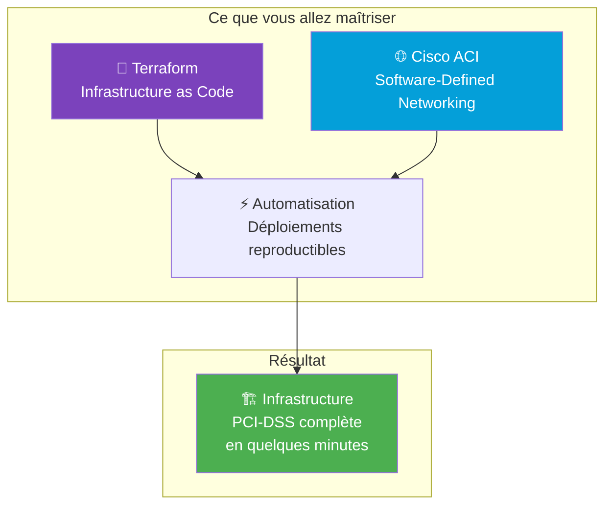
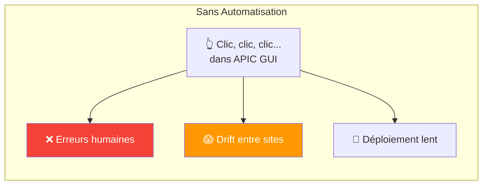
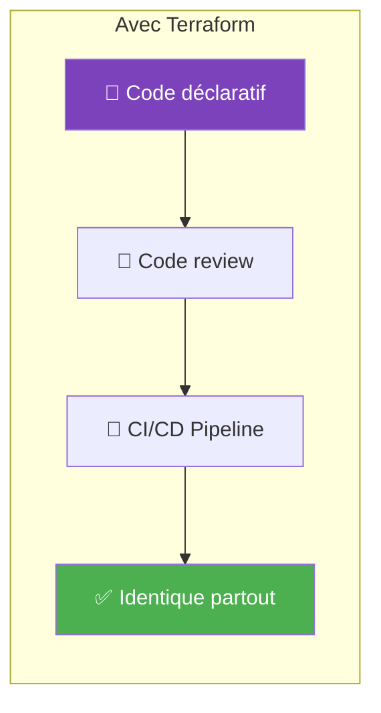
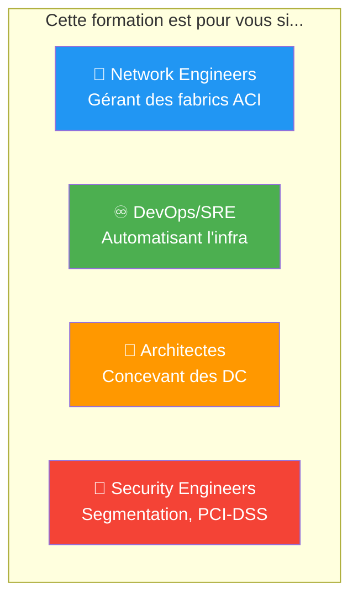
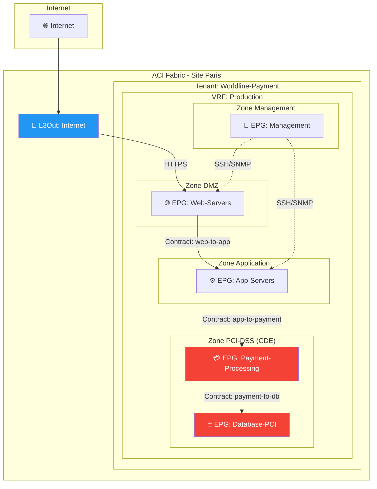

---
tags:
  - formation
  - terraform
  - aci
  - cisco
  - sdn
  - datacenter
  - infrastructure-as-code
---

# Terraform ACI : Automatiser votre Fabric Cisco

## Présentation

Cette formation vous guide dans l'**automatisation complète** d'une infrastructure Cisco ACI avec Terraform. Des concepts fondamentaux de la fabric jusqu'au déploiement Multi-Site, vous apprendrez à gérer vos Tenants, EPGs, Contracts et flux réseau de manière déclarative et reproductible.

**Durée : 5 jours (35h) - 10 modules**

---

## Pourquoi Cette Formation ?

### Le Problème : Gestion Manuelle ACI

### La Solution : Terraform + ACI

!!! success "Bénéfices"
    - **Reproductible** : Même config sur tous les sites
    - **Versionné** : Historique Git de tous les changements
    - **Rapide** : Déployer un tenant complet en minutes
    - **Auditable** : Qui a changé quoi, quand, pourquoi

---

## Public Cible

| Profil | Modules recommandés | Focus |
|--------|---------------------|-------|
| **Network Engineers** | Tous | Maîtrise complète ACI + Terraform |
| **DevOps/SRE** | 1, 5, 6, 9, 10 | Focus automatisation et CI/CD |
| **Architectes** | 2, 3, 4, 7, 8, 9 | Conception et patterns |
| **Security Engineers** | 3, 4, 7, 8, 10 | Segmentation et contracts |

---

## Prérequis

!!! warning "Connaissances Requises"

    **Obligatoires :**

    - Bases réseau (VLAN, routage, subnets)
    - Connaissances Linux/CLI basiques
    - Notions de virtualisation (VMs, hyperviseurs)

    **Recommandées :**

    - Expérience avec un langage de scripting (Python, Bash)
    - Notions Git (clone, commit, push)
    - Avoir déjà vu une interface APIC (même brièvement)

---

## Objectifs de la Formation

À l'issue de cette formation, vous serez capable de :

### Comprendre

- :fontawesome-solid-network-wired: Expliquer l'architecture ACI (Spines, Leafs, APIC)
- :fontawesome-solid-sitemap: Décrire le modèle objet ACI (Tenant → VRF → BD → EPG)
- :fontawesome-solid-file-contract: Comprendre les Contracts et leur rôle de firewall
- :fontawesome-solid-arrows-left-right: Différencier flux Nord-Sud et Est-Ouest

### Automatiser

- :fontawesome-solid-code: Écrire du code Terraform pour ACI
- :fontawesome-solid-cubes: Créer des modules Terraform réutilisables
- :fontawesome-solid-rotate: Gérer le state Terraform en équipe
- :fontawesome-solid-rocket: Intégrer Terraform dans un pipeline CI/CD

### Déployer

- :fontawesome-solid-building: Provisionner un Tenant complet avec tous ses objets
- :fontawesome-solid-shield-halved: Implémenter une segmentation PCI-DSS
- :fontawesome-solid-globe: Configurer des L3Outs pour le routage externe
- :fontawesome-solid-link: Gérer une infrastructure Multi-Site (MSO/NDO)

---

## Programme Détaillé

### Jour 1 : Fondations (7h)

| Module | Titre | Durée | Contenu |
|--------|-------|-------|---------|
| **1** | [Introduction à Terraform](01-module.md) | 3h | HCL, providers, resources, state, plan/apply |
| **2** | [Architecture Cisco ACI](02-module.md) | 4h | Fabric, Spines/Leafs, APIC, concepts SDN |

### Jour 2 : Modèle Objet ACI (7h)

| Module | Titre | Durée | Contenu |
|--------|-------|-------|---------|
| **3** | [Modèle Objet ACI](03-module.md) | 4h | Tenant, VRF, Bridge Domain, EPG, domaines |
| **4** | [Contracts & Filters](04-module.md) | 3h | Subjects, Filters, whitelist model, taboo |

### Jour 3 : Terraform + ACI (7h)

| Module | Titre | Durée | Contenu |
|--------|-------|-------|---------|
| **5** | [Provider Terraform ACI](05-module.md) | 4h | Configuration, authentification, ressources |
| **6** | [Patterns & Modules](06-module.md) | 3h | Modules réutilisables, variables, tfvars, workspaces |

### Jour 4 : Flux Réseau (7h)

| Module | Titre | Durée | Contenu |
|--------|-------|-------|---------|
| **7** | [Flux Nord-Sud (L3Out)](07-module.md) | 4h | L3Out, External EPG, BGP/OSPF, NAT |
| **8** | [Flux Est-Ouest](08-module.md) | 3h | Inter-EPG, intra-EPG, microsegmentation, vzAny |

### Jour 5 : Multi-Site & TP Final (7h)

| Module | Titre | Durée | Contenu |
|--------|-------|-------|---------|
| **9** | [Multi-Site ACI (MSO/NDO)](09-module.md) | 3h | Nexus Dashboard, stretched objects, inter-site |
| **10** | [TP Final : Infra PCI-DSS](10-tp-final.md) | 4h | Projet complet avec segmentation, contracts, L3Out |

---

## Architecture Cible du TP Final

---

## Méthode Pédagogique

### Approche Pratique

| Méthode | Description |
|---------|-------------|
| **Concepts illustrés** | Diagrammes Mermaid pour chaque concept ACI |
| **Code commenté** | Exemples Terraform complets et expliqués |
| **Labs progressifs** | Exercices à chaque module |
| **TP Final** | Projet complet déployant une infra PCI-DSS |

### Environnement

!!! info "Environnement de Lab"

    **Option 1 : ACI Simulator**

    - Cisco ACI Simulator (disponible avec Cisco DevNet)
    - Gratuit pour l'apprentissage

    **Option 2 : Cisco DevNet Sandbox**

    - Réservation gratuite sur [devnetsandbox.cisco.com](https://devnetsandbox.cisco.com)
    - ACI Always-On ou réservable

    **Option 3 : Lab Worldline**

    - Environnement de formation interne
    - Contacter l'équipe Network pour accès

---

## Certifications Préparées

Cette formation aide à préparer :

| Certification | Éditeur | Niveau |
|---------------|---------|--------|
| **HashiCorp Terraform Associate** | HashiCorp | Associate |
| **Cisco DevNet Associate** | Cisco | Associate |
| **Cisco DCACI** | Cisco | Specialist |

---

## Ressources Complémentaires

### Documentation Officielle

| Ressource | Description |
|-----------|-------------|
| [Terraform ACI Provider](https://registry.terraform.io/providers/CiscoDevNet/aci/latest/docs) | Documentation officielle du provider |
| [Cisco ACI Documentation](https://www.cisco.com/c/en/us/support/cloud-systems-management/application-policy-infrastructure-controller-apic/series.html) | Documentation APIC |
| [Cisco DevNet ACI](https://developer.cisco.com/site/aci/) | Ressources développeur ACI |

### Formations Liées ShellBook

- [Terraform Fundamentals](../devops/terraform/fundamentals.md) - Bases Terraform générales
- [Ansible ACI](../devops/ansible/cloud-integrations.md) - Alternative Ansible pour ACI

---

## Navigation

| Module | Suivant |
|--------|---------|
| Introduction | [Module 1 : Introduction à Terraform →](01-module.md) |
