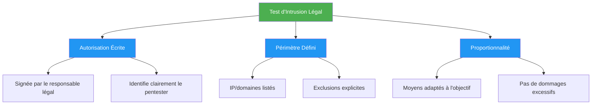
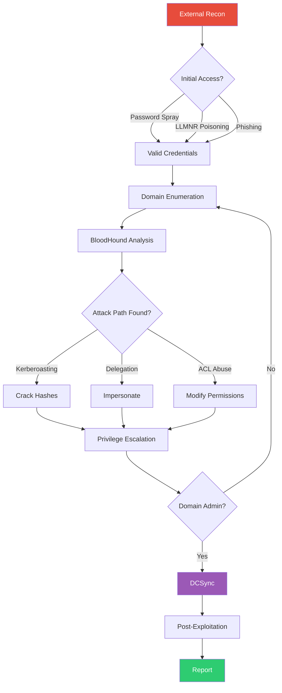

---
tags:
  - formation
  - security
  - windows
  - hacking
  - lab
  - legal
---

# Module 1 : Setup & Environnement Lab

La première étape de toute mission de pentest est la préparation. Ce module couvre le cadre légal indispensable et la mise en place d'un laboratoire Active Directory vulnérable pour pratiquer en toute sécurité.

## Objectifs du Module

À la fin de ce module, vous serez capable de :

- Comprendre le cadre légal français du pentest et les risques encourus
- Rédiger et interpréter une lettre d'autorisation (ROE)
- Déployer un lab Active Directory multi-domaines avec Vagrant
- Configurer des vulnérabilités intentionnelles réalistes
- Installer et configurer les outils d'attaque essentiels
- Appliquer la méthodologie MITRE ATT&CK

**Durée estimée :** 5.5 heures
**Niveau :** Intermédiaire

---

## 1. Cadre Légal et Éthique

### 1.1 Le Code Pénal Français

!!! danger "Articles du Code Pénal applicables"
    Le non-respect du cadre légal expose à des sanctions pénales sévères :

    - **Article 323-1** : Accès frauduleux à un STAD - 3 ans + 100 000€
    - **Article 323-2** : Entrave au fonctionnement - 5 ans + 150 000€
    - **Article 323-3** : Introduction/modification de données - 5 ans + 150 000€
    - **Article 323-3-1** : Détention d'outils de piratage - 5 ans + 150 000€

### 1.2 Conditions de Légalité

Pour qu'un test d'intrusion soit légal, **trois conditions cumulatives** doivent être réunies :



### 1.3 Rules of Engagement (ROE)

La lettre d'autorisation doit contenir :

| Élément | Description | Obligatoire |
|---------|-------------|:-----------:|
| Identité du commanditaire | Nom, fonction, société | :white_check_mark: |
| Identité du pentester | Nom, société, contact | :white_check_mark: |
| Périmètre technique | IPs, URLs, domaines inclus | :white_check_mark: |
| Exclusions | Systèmes interdits | :white_check_mark: |
| Période d'intervention | Dates et heures autorisées | :white_check_mark: |
| Types de tests | Black/Grey/White box | :white_check_mark: |
| Techniques autorisées | Phishing, DoS, social engineering | :white_check_mark: |
| Contacts d'urgence | Numéros en cas d'incident | :white_check_mark: |
| Clause de confidentialité | NDA intégré ou séparé | Recommandé |

!!! example "Template ROE simplifié"
    ```text
    AUTORISATION DE TEST D'INTRUSION

    Je soussigné(e) [NOM], [FONCTION] de la société [SOCIÉTÉ],
    autorise [PENTESTER/SOCIÉTÉ] à réaliser un test d'intrusion sur :

    PÉRIMÈTRE INCLUS :
    - Réseau : 192.168.1.0/24
    - Domaine : *.entreprise.local
    - Applications : https://app.entreprise.fr

    EXCLUSIONS :
    - Serveur de production SQL (192.168.1.50)
    - Attaques par déni de service

    PÉRIODE : Du [DATE] au [DATE], de 19h à 7h

    Contact urgence : [TÉLÉPHONE]

    Fait à [VILLE], le [DATE]
    Signature : _______________
    ```

---

## 2. Architecture du Lab

### 2.1 Configuration Matérielle Requise

| Composant | Minimum | Recommandé |
|-----------|---------|------------|
| RAM | 16 Go | 32 Go |
| CPU | 4 cores | 8+ cores |
| Stockage | 150 Go SSD | 300 Go NVMe |
| Réseau | NAT | Host-only + NAT |

### 2.2 Topologie Réseau

```
┌─────────────────────────────────────────────────────────────────┐
│                        Host Machine                              │
├─────────────────────────────────────────────────────────────────┤
│                                                                  │
│  ┌──────────────┐     ┌──────────────────────────────────────┐  │
│  │   Kali       │     │        YOURCOMPANY.LOCAL             │  │
│  │  Attacker    │     │  ┌──────┐  ┌──────┐  ┌──────┐       │  │
│  │              │────▶│  │ DC01 │  │ SRV01│  │ WS01 │       │  │
│  │ 192.168.56.  │     │  │  .10 │  │  .20 │  │  .50 │       │  │
│  │     100      │     │  └──────┘  └──────┘  └──────┘       │  │
│  └──────────────┘     │       │                              │  │
│                       │       │ Trust                        │  │
│                       │       ▼                              │  │
│                       │  ┌──────────────────────────────┐   │  │
│                       │  │    YOURCOMPANY-DEV.LOCAL     │   │  │
│                       │  │  ┌──────┐  ┌──────┐          │   │  │
│                       │  │  │ DC02 │  │ DEV01│          │   │  │
│                       │  │  │  .10 │  │  .20 │          │   │  │
│                       │  │  └──────┘  └──────┘          │   │  │
│                       │  └──────────────────────────────┘   │  │
│                       └──────────────────────────────────────┘  │
└─────────────────────────────────────────────────────────────────┘
```

### 2.3 Machines Virtuelles

| VM | OS | Rôle | IP | RAM |
|----|-----|------|-----|-----|
| DC01 | Windows Server 2019 | Domain Controller principal | 192.168.56.10 | 4 Go |
| DC02 | Windows Server 2019 | DC enfant (DEV) | 192.168.56.11 | 4 Go |
| SRV01 | Windows Server 2019 | File Server + ADCS | 192.168.56.20 | 2 Go |
| SRV02 | Windows Server 2019 | Web Server (IIS) | 192.168.56.21 | 2 Go |
| WS01 | Windows 10 | Workstation utilisateur | 192.168.56.50 | 2 Go |
| WS02 | Windows 10 | Workstation admin | 192.168.56.51 | 2 Go |
| KALI | Kali Linux | Machine d'attaque | 192.168.56.100 | 4 Go |

---

## 3. Déploiement Automatisé

### 3.1 Avec Vagrant et VirtualBox

!!! tip "Projet recommandé : DVAD"
    [Damn Vulnerable AD](https://github.com/WazeHell/vulnerable-AD) déploie automatiquement un lab AD avec des vulnérabilités préconfigurées.

**Installation des prérequis :**

```bash
# Installation VirtualBox (Debian/Ubuntu)
sudo apt update
sudo apt install -y virtualbox virtualbox-ext-pack

# Installation Vagrant
wget https://releases.hashicorp.com/vagrant/2.4.0/vagrant_2.4.0-1_amd64.deb
sudo dpkg -i vagrant_2.4.0-1_amd64.deb

# Plugin Windows
vagrant plugin install vagrant-reload
```

**Clonage et déploiement DVAD :**

```bash
# Cloner le projet
git clone https://github.com/WazeHell/vulnerable-AD.git
cd vulnerable-AD

# Démarrer le déploiement (30-60 min)
vagrant up

# Vérifier le statut
vagrant status
```

### 3.2 Script de Configuration Manuelle

Si vous préférez un contrôle total, voici un script PowerShell pour configurer un DC vulnérable :

```powershell
# ============================================
# Configuration DC01 - Vulnérabilités AD
# À exécuter en tant qu'Administrateur
# ============================================

# Variables
$DomainName = "yourcompany.local"
$NetBIOSName = "YOURCOMPANY"
$SafeModePassword = ConvertTo-SecureString "P@ssw0rd123!" -AsPlainText -Force

# 1. Installation du rôle AD DS
Install-WindowsFeature -Name AD-Domain-Services -IncludeManagementTools

# 2. Promotion en Domain Controller
Install-ADDSForest `
    -DomainName $DomainName `
    -DomainNetBIOSName $NetBIOSName `
    -SafeModeAdministratorPassword $SafeModePassword `
    -InstallDns:$true `
    -Force:$true

# Redémarrage automatique après promotion
```

**Après redémarrage - Création des vulnérabilités :**

```powershell
# ============================================
# Configuration des vulnérabilités
# ============================================

Import-Module ActiveDirectory

# --- Utilisateurs avec mots de passe faibles ---
$Users = @(
    @{Name="svc_backup"; Password="Backup123!"; SPN="MSSQLSvc/srv01.yourcompany.local"},
    @{Name="svc_web"; Password="Summer2024"; SPN="HTTP/srv02.yourcompany.local"},
    @{Name="admin.local"; Password="Admin123"; Description="Local admin account"},
    @{Name="j.smith"; Password="Welcome1"; Description="IT Support"}
)

foreach ($User in $Users) {
    $SecurePass = ConvertTo-SecureString $User.Password -AsPlainText -Force
    New-ADUser -Name $User.Name `
               -SamAccountName $User.Name `
               -UserPrincipalName "$($User.Name)@yourcompany.local" `
               -AccountPassword $SecurePass `
               -Enabled $true `
               -PasswordNeverExpires $true

    if ($User.SPN) {
        Set-ADUser -Identity $User.Name -ServicePrincipalNames @{Add=$User.SPN}
    }
    Write-Host "[+] Created user: $($User.Name)" -ForegroundColor Green
}

# --- Utilisateur AS-REP Roastable ---
Set-ADAccountControl -Identity "j.smith" -DoesNotRequirePreAuth $true
Write-Host "[+] AS-REP Roasting enabled for j.smith" -ForegroundColor Yellow

# --- Machine avec Unconstrained Delegation ---
$Computer = Get-ADComputer -Identity "SRV01"
Set-ADComputer -Identity $Computer -TrustedForDelegation $true
Write-Host "[+] Unconstrained Delegation enabled on SRV01" -ForegroundColor Yellow

# --- Groupe avec droits DCSync ---
New-ADGroup -Name "IT_Admins" -GroupScope Global
Add-ADGroupMember -Identity "IT_Admins" -Members "admin.local"

# Ajouter les droits DCSync (Replicating Directory Changes)
$RootDSE = Get-ADRootDSE
$ACL = Get-Acl "AD:\$($RootDSE.defaultNamingContext)"
$SID = (Get-ADGroup "IT_Admins").SID

$ACE1 = New-Object System.DirectoryServices.ActiveDirectoryAccessRule(
    $SID, "ExtendedRight", "Allow",
    [GUID]"1131f6aa-9c07-11d1-f79f-00c04fc2dcd2"  # DS-Replication-Get-Changes
)
$ACE2 = New-Object System.DirectoryServices.ActiveDirectoryAccessRule(
    $SID, "ExtendedRight", "Allow",
    [GUID]"1131f6ad-9c07-11d1-f79f-00c04fc2dcd2"  # DS-Replication-Get-Changes-All
)

$ACL.AddAccessRule($ACE1)
$ACL.AddAccessRule($ACE2)
Set-Acl "AD:\$($RootDSE.defaultNamingContext)" $ACL
Write-Host "[+] DCSync rights granted to IT_Admins" -ForegroundColor Yellow

Write-Host "`n[*] Vulnerable AD configuration complete!" -ForegroundColor Cyan
```

---

## 4. Installation des Outils

### 4.1 Machine d'Attaque (Kali Linux)

```bash
# Mise à jour système
sudo apt update && sudo apt upgrade -y

# Outils essentiels (déjà inclus dans Kali)
# - nmap, masscan, responder, crackmapexec, impacket, bloodhound

# Outils additionnels
sudo apt install -y \
    bloodhound \
    neo4j \
    pipx \
    gobuster \
    feroxbuster \
    evil-winrm

# Impacket (dernière version)
pipx install impacket
pipx ensurepath

# Kerbrute
wget https://github.com/ropnop/kerbrute/releases/latest/download/kerbrute_linux_amd64
chmod +x kerbrute_linux_amd64
sudo mv kerbrute_linux_amd64 /usr/local/bin/kerbrute

# Rubeus (compilation ou téléchargement)
# Version précompilée disponible sur GitHub

# BloodHound - Démarrage
sudo neo4j start
# Accès : http://localhost:7474 (neo4j/neo4j -> changer le password)
bloodhound --no-sandbox &
```

### 4.2 Outils Windows (Commando VM ou manuel)

!!! info "Commando VM"
    [Commando VM](https://github.com/mandiant/commando-vm) est une distribution Windows orientée offensive, similaire à Kali mais pour Windows.

**Installation manuelle des outils essentiels :**

```powershell
# Créer un dossier pour les outils
New-Item -ItemType Directory -Path "C:\Tools" -Force
cd C:\Tools

# Mimikatz
Invoke-WebRequest -Uri "https://github.com/gentilkiwi/mimikatz/releases/latest/download/mimikatz_trunk.zip" -OutFile "mimikatz.zip"
Expand-Archive -Path "mimikatz.zip" -DestinationPath ".\Mimikatz"

# Rubeus
Invoke-WebRequest -Uri "https://github.com/r3motecontrol/Ghostpack-CompiledBinaries/raw/master/Rubeus.exe" -OutFile "Rubeus.exe"

# SharpHound
Invoke-WebRequest -Uri "https://github.com/BloodHoundAD/SharpHound/releases/latest/download/SharpHound-v2.0.0.zip" -OutFile "SharpHound.zip"
Expand-Archive -Path "SharpHound.zip" -DestinationPath ".\SharpHound"

# PowerView
Invoke-WebRequest -Uri "https://raw.githubusercontent.com/PowerShellMafia/PowerSploit/master/Recon/PowerView.ps1" -OutFile "PowerView.ps1"

# WinPEAS
Invoke-WebRequest -Uri "https://github.com/carlospolop/PEASS-ng/releases/latest/download/winPEASx64.exe" -OutFile "winPEAS.exe"
```

### 4.3 Liste des Outils par Catégorie

| Catégorie | Outils | Plateforme |
|-----------|--------|------------|
| **Reconnaissance** | Nmap, Masscan, enum4linux-ng | Linux |
| **AD Enumeration** | BloodHound, PowerView, ADRecon | Multi |
| **Credential Attacks** | Responder, CrackMapExec, Kerbrute | Linux |
| **Kerberos** | Rubeus, Impacket (GetUserSPNs, GetNPUsers) | Multi |
| **Post-Exploitation** | Mimikatz, SharpHound, Seatbelt | Windows |
| **Privilege Escalation** | WinPEAS, PowerUp, BeRoot | Multi |
| **Lateral Movement** | PsExec, Evil-WinRM, Impacket | Multi |
| **Password Cracking** | Hashcat, John the Ripper | Multi |

---

## 5. Méthodologie d'Attaque

### 5.1 Cyber Kill Chain


### 5.2 MITRE ATT&CK - Techniques Couvertes

| Tactic | Technique ID | Technique | Module |
|--------|--------------|-----------|--------|
| Reconnaissance | T1595 | Active Scanning | 2 |
| Initial Access | T1557.001 | LLMNR/NBT-NS Poisoning | 3 |
| Credential Access | T1558.003 | Kerberoasting | 3 |
| Privilege Escalation | T1068 | Exploitation for Privilege Escalation | 4 |
| Lateral Movement | T1021.002 | SMB/Windows Admin Shares | 5 |
| Persistence | T1053 | Scheduled Task | 5 |
| Defense Evasion | T1562.001 | Disable Security Tools | 5 |

### 5.3 Workflow Type d'un Pentest AD



---

## Exercice Pratique

!!! example "Exercice : Déploiement du Lab AD"

    **Objectif** : Déployer un environnement Active Directory vulnérable fonctionnel

    **Prérequis** :

    - VirtualBox ou VMware installé
    - 20 Go d'espace disque disponible
    - Connexion Internet pour télécharger les ISO

    **Étapes** :

    1. **Installer Kali Linux** (VM attaquante)
       - Télécharger l'image depuis kali.org
       - Configurer avec 4 Go RAM, réseau Host-only

    2. **Déployer le DC Windows Server**
       - Utiliser DVAD (vagrant up) OU
       - Installation manuelle avec les scripts fournis

    3. **Configurer les vulnérabilités**
       - Exécuter le script PowerShell de configuration
       - Créer les utilisateurs avec SPN
       - Activer AS-REP Roasting sur un compte

    4. **Valider la connectivité**
       ```bash
       # Depuis Kali
       ping 192.168.56.10
       nmap -p 88,389,445 192.168.56.10
       ```

    5. **Installer BloodHound**
       ```bash
       sudo neo4j start
       bloodhound --no-sandbox
       ```

    **Critères de réussite** :

    - [ ] Le DC répond sur les ports 88, 389, 445
    - [ ] Au moins 4 utilisateurs créés dans l'AD
    - [ ] Un compte est Kerberoastable (SPN configuré)
    - [ ] Un compte est AS-REP Roastable
    - [ ] BloodHound démarre et se connecte à Neo4j

??? quote "Solution - Validation"

    **Vérification depuis Kali :**

    ```bash
    # Test de connectivité
    nmap -sV -p 88,135,389,445,636 192.168.56.10

    # Résultat attendu :
    # PORT    STATE SERVICE
    # 88/tcp  open  kerberos-sec
    # 135/tcp open  msrpc
    # 389/tcp open  ldap
    # 445/tcp open  microsoft-ds
    # 636/tcp open  ldapssl
    ```

    **Vérification des utilisateurs (avec credentials si disponibles) :**

    ```bash
    # Enumération LDAP anonyme (si autorisé)
    ldapsearch -x -H ldap://192.168.56.10 -b "DC=yourcompany,DC=local" "(objectClass=user)" sAMAccountName

    # Test Kerberoasting
    GetUserSPNs.py yourcompany.local/j.smith:Welcome1 -dc-ip 192.168.56.10

    # Test AS-REP Roasting
    GetNPUsers.py yourcompany.local/ -usersfile users.txt -dc-ip 192.168.56.10 -format hashcat
    ```

    **Validation BloodHound :**

    1. Ouvrir http://localhost:7474 (Neo4j)
    2. Se connecter avec neo4j / [votre_password]
    3. Lancer BloodHound et se connecter
    4. Importer un fichier JSON de test pour valider

---

## Points Clés à Retenir

- **Légalité** : Toujours obtenir une autorisation écrite **avant** tout test
- **Périmètre** : Ne jamais dépasser le scope défini dans les ROE
- **Documentation** : Logger toutes les actions pour le rapport final
- **Lab isolé** : Le lab doit être sur un réseau isolé (Host-only)
- **Snapshots** : Créer des snapshots avant chaque session pour rollback rapide
- **Méthodologie** : Suivre MITRE ATT&CK pour structurer l'approche

---

## Ressources

- [DVAD - Damn Vulnerable AD](https://github.com/WazeHell/vulnerable-AD)
- [Commando VM](https://github.com/mandiant/commando-vm)
- [MITRE ATT&CK](https://attack.mitre.org/)
- [ANSSI - Recommandations de sécurité AD](https://www.ssi.gouv.fr/guide/recommandations-de-securite-relatives-a-active-directory/)

---

| | |
|:---|---:|
| [← Programme](index.md) | [Module 2 : Reconnaissance →](02-module.md) |

[Retour au Programme](index.md){ .md-button }
