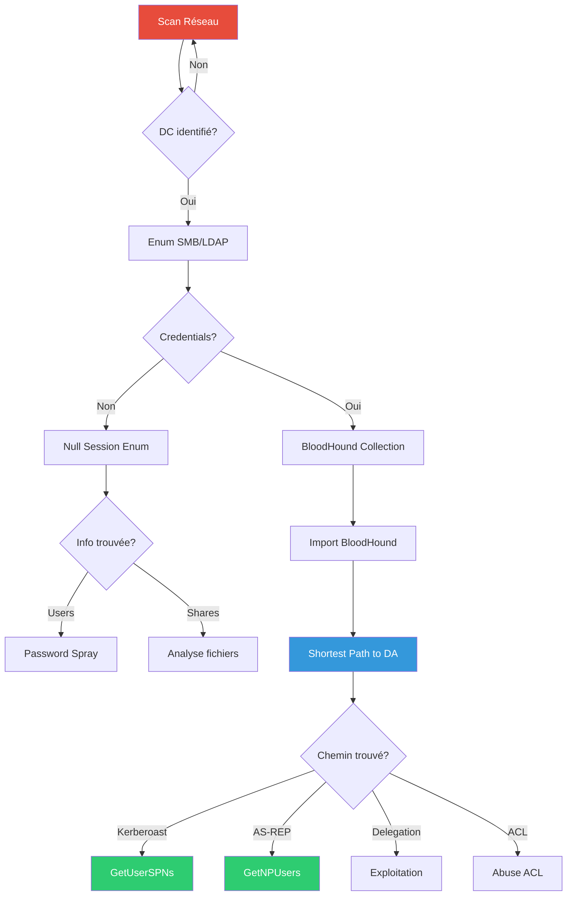

---
tags:
  - formation
  - security
  - windows
  - hacking
  - reconnaissance
  - enumeration
  - bloodhound
---

# Module 2 : Reconnaissance & Énumération

La reconnaissance est la phase la plus critique d'un pentest. Une énumération approfondie révèle les chemins d'attaque, les comptes vulnérables et les misconfiguration exploitables. Ce module couvre toutes les techniques d'énumération, de l'externe sans credentials jusqu'à l'analyse complète avec BloodHound.

## Objectifs du Module

À la fin de ce module, vous serez capable de :

- Réaliser une reconnaissance externe (OSINT, DNS, certificats)
- Scanner et identifier les services Windows/AD sur un réseau
- Énumérer les partages SMB et les informations NetBIOS
- Extraire des informations via LDAP (anonyme et authentifié)
- Collecter et analyser les données AD avec BloodHound
- Identifier les chemins d'attaque vers Domain Admin

**Durée estimée :** 6.5 heures
**Niveau :** Intermédiaire

---

## 1. Reconnaissance Externe

### 1.1 OSINT - Collecte d'Information

Avant de toucher au réseau cible, collectez un maximum d'informations publiques.

**Google Dorks pour Active Directory :**

```text
# Trouver des fichiers de configuration
site:target.com filetype:xml "ldap"
site:target.com filetype:config "connectionString"

# Chercher des credentials exposés
site:pastebin.com "target.com" password
site:github.com "target.com" password

# Trouver des sous-domaines
site:*.target.com -www

# Documents avec métadonnées
site:target.com filetype:pdf
site:target.com filetype:docx
```

**TheHarvester - Collecte automatisée :**

```bash
# Recherche multi-sources
theHarvester -d target.com -b all -l 500

# Sources spécifiques
theHarvester -d target.com -b linkedin,google,bing

# Résultat : emails, sous-domaines, IPs
```

### 1.2 DNS Enumeration

```bash
# Résolution basique
host target.com
nslookup target.com

# Transfert de zone (rarement autorisé)
dig axfr @ns1.target.com target.com

# Enumération de sous-domaines avec DNSRecon
dnsrecon -d target.com -t std,brt,srv

# Records spécifiques AD
dig +short _ldap._tcp.dc._msdcs.target.com SRV
dig +short _kerberos._tcp.target.com SRV
dig +short _gc._tcp.target.com SRV
```

!!! tip "Records DNS révélateurs"
    Les records SRV révèlent les Domain Controllers :

    - `_ldap._tcp.dc._msdcs.domain.com` → DCs du domaine
    - `_kerberos._tcp.domain.com` → KDC (généralement le DC)
    - `_gc._tcp.forest.com` → Global Catalog servers

### 1.3 Certificate Transparency

Les certificats SSL/TLS révèlent souvent des sous-domaines internes.

```bash
# Via crt.sh
curl -s "https://crt.sh/?q=%.target.com&output=json" | jq -r '.[].name_value' | sort -u

# Via Amass
amass enum -passive -d target.com -o subdomains.txt

# Via Subfinder
subfinder -d target.com -silent -o subs.txt
```

---

## 2. Découverte Réseau

### 2.1 Host Discovery

```bash
# Ping sweep (ICMP)
nmap -sn 192.168.56.0/24

# ARP scan (plus fiable sur le même segment)
sudo arp-scan -l -I eth0

# Netdiscover (passif)
sudo netdiscover -i eth0 -p

# TCP SYN sur ports courants Windows
nmap -sn -PS445,139,135,88 192.168.56.0/24
```

### 2.2 Port Scanning - Ports Windows/AD

| Port | Service | Importance |
|------|---------|------------|
| 53 | DNS | Résolution de noms |
| 88 | Kerberos | Authentification AD |
| 135 | RPC | Remote Procedure Call |
| 139 | NetBIOS | Legacy, souvent vulnérable |
| 389 | LDAP | Annuaire AD |
| 445 | SMB | Partages, attaques relay |
| 464 | Kpasswd | Changement mot de passe |
| 593 | RPC over HTTP | Exchange, Web services |
| 636 | LDAPS | LDAP sécurisé |
| 3268 | Global Catalog | Recherche multi-domaines |
| 3269 | GC SSL | Global Catalog sécurisé |
| 5985 | WinRM HTTP | PowerShell Remoting |
| 5986 | WinRM HTTPS | PowerShell Remoting SSL |

**Scan optimisé pour AD :**

```bash
# Scan rapide des ports AD essentiels
nmap -sS -p 53,88,135,139,389,445,464,636,3268,3389,5985 192.168.56.0/24 -oA ad_scan

# Scan complet avec détection de version
nmap -sV -sC -p- --min-rate 1000 192.168.56.10 -oA full_dc_scan

# Scripts NSE spécifiques AD
nmap --script "ldap* and not brute" -p 389 192.168.56.10
nmap --script smb-enum-* -p 445 192.168.56.10
```

### 2.3 Identification des Domain Controllers

```bash
# Via DNS (si résolution fonctionne)
nslookup -type=SRV _ldap._tcp.dc._msdcs.yourcompany.local

# Via Nmap (port 88 = Kerberos = DC)
nmap -p 88 --open 192.168.56.0/24

# Via CrackMapExec
crackmapexec smb 192.168.56.0/24

# Via NBTScan
nbtscan -r 192.168.56.0/24
```

---

## 3. Énumération SMB/NetBIOS

### 3.1 Enum4linux-ng

L'outil de référence pour l'énumération Windows/Samba.

```bash
# Énumération complète (null session)
enum4linux-ng -A 192.168.56.10

# Options spécifiques
enum4linux-ng -U 192.168.56.10      # Users
enum4linux-ng -G 192.168.56.10      # Groups
enum4linux-ng -S 192.168.56.10      # Shares
enum4linux-ng -P 192.168.56.10      # Password policy

# Avec credentials
enum4linux-ng -u 'j.smith' -p 'Welcome1' -A 192.168.56.10
```

### 3.2 SMBClient

```bash
# Lister les partages (null session)
smbclient -L //192.168.56.10 -N

# Connexion à un partage
smbclient //192.168.56.10/SYSVOL -N
smbclient //192.168.56.10/NETLOGON -U 'j.smith%Welcome1'

# Commandes dans SMB
smb: \> ls
smb: \> cd scripts
smb: \> get interesting_script.bat
smb: \> recurse ON
smb: \> mget *
```

### 3.3 CrackMapExec (CME)

!!! tip "L'outil multi-usage par excellence"
    CrackMapExec (ou son successeur NetExec) est indispensable pour l'énumération et les attaques AD.

```bash
# Discovery basique
crackmapexec smb 192.168.56.0/24

# Énumération des partages
crackmapexec smb 192.168.56.10 -u '' -p '' --shares
crackmapexec smb 192.168.56.10 -u 'j.smith' -p 'Welcome1' --shares

# Énumération des utilisateurs
crackmapexec smb 192.168.56.10 -u 'j.smith' -p 'Welcome1' --users

# Énumération des groupes
crackmapexec smb 192.168.56.10 -u 'j.smith' -p 'Welcome1' --groups

# Sessions actives
crackmapexec smb 192.168.56.10 -u 'j.smith' -p 'Welcome1' --sessions

# Disques partagés
crackmapexec smb 192.168.56.10 -u 'j.smith' -p 'Welcome1' --disks

# Password policy
crackmapexec smb 192.168.56.10 -u 'j.smith' -p 'Welcome1' --pass-pol
```

### 3.4 SMBMap

```bash
# Scan des permissions sur les partages
smbmap -H 192.168.56.10

# Avec credentials
smbmap -H 192.168.56.10 -u 'j.smith' -p 'Welcome1'

# Lister récursivement
smbmap -H 192.168.56.10 -u 'j.smith' -p 'Welcome1' -R SYSVOL

# Télécharger un fichier
smbmap -H 192.168.56.10 -u 'j.smith' -p 'Welcome1' --download 'SYSVOL/script.bat'

# Recherche de fichiers sensibles
smbmap -H 192.168.56.10 -u 'j.smith' -p 'Welcome1' -R -A '\.xml|\.config|\.txt|\.bat'
```

---

## 4. Énumération LDAP

### 4.1 LDAP Anonyme

Certains AD autorisent les requêtes LDAP anonymes (rare mais possible).

```bash
# Test de connexion anonyme
ldapsearch -x -H ldap://192.168.56.10 -b "" -s base namingContexts

# Énumération des utilisateurs (anonyme)
ldapsearch -x -H ldap://192.168.56.10 -b "DC=yourcompany,DC=local" "(objectClass=user)" sAMAccountName

# Énumération des ordinateurs
ldapsearch -x -H ldap://192.168.56.10 -b "DC=yourcompany,DC=local" "(objectClass=computer)" cn
```

### 4.2 LDAP Authentifié

```bash
# Connexion authentifiée
ldapsearch -x -H ldap://192.168.56.10 \
    -D "j.smith@yourcompany.local" \
    -w "Welcome1" \
    -b "DC=yourcompany,DC=local" \
    "(objectClass=user)" sAMAccountName userPrincipalName memberOf

# Rechercher les utilisateurs avec SPN (Kerberoastable)
ldapsearch -x -H ldap://192.168.56.10 \
    -D "j.smith@yourcompany.local" \
    -w "Welcome1" \
    -b "DC=yourcompany,DC=local" \
    "(&(objectClass=user)(servicePrincipalName=*))" sAMAccountName servicePrincipalName

# Utilisateurs avec "Do not require Kerberos preauthentication" (AS-REP Roastable)
ldapsearch -x -H ldap://192.168.56.10 \
    -D "j.smith@yourcompany.local" \
    -w "Welcome1" \
    -b "DC=yourcompany,DC=local" \
    "(userAccountControl:1.2.840.113556.1.4.803:=4194304)" sAMAccountName
```

### 4.3 Windapsearch

Outil Python optimisé pour l'énumération LDAP AD.

```bash
# Installation
pip install windapsearch

# Énumération des utilisateurs
windapsearch -d yourcompany.local --dc-ip 192.168.56.10 -u "j.smith@yourcompany.local" -p "Welcome1" --users

# Domain Admins
windapsearch -d yourcompany.local --dc-ip 192.168.56.10 -u "j.smith@yourcompany.local" -p "Welcome1" --da

# Utilisateurs privilegiés
windapsearch -d yourcompany.local --dc-ip 192.168.56.10 -u "j.smith@yourcompany.local" -p "Welcome1" --privileged-users

# Computers avec unconstrained delegation
windapsearch -d yourcompany.local --dc-ip 192.168.56.10 -u "j.smith@yourcompany.local" -p "Welcome1" --unconstrained-computers
```

---

## 5. Énumération Authentifiée - BloodHound

### 5.1 Collecte avec SharpHound

BloodHound est l'outil indispensable pour visualiser les chemins d'attaque AD.

**Depuis Windows (SharpHound.exe) :**

```powershell
# Collecte complète
.\SharpHound.exe -c All

# Collecte avec session logging
.\SharpHound.exe -c All,LoggedOn

# Spécifier le domaine
.\SharpHound.exe -c All -d yourcompany.local

# Stealth mode (plus lent mais moins détectable)
.\SharpHound.exe -c All --stealth
```

**Depuis Linux (bloodhound-python) :**

```bash
# Installation
pip install bloodhound

# Collecte complète
bloodhound-python -d yourcompany.local -u j.smith -p 'Welcome1' -dc dc01.yourcompany.local -c All

# Options de collecte
# -c All          : Tous les types de données
# -c Group        : Appartenances aux groupes
# -c Session      : Sessions utilisateurs
# -c ACL          : Permissions AD
# -c Trusts       : Relations d'approbation
```

### 5.2 Import et Analyse BloodHound

```bash
# Démarrer Neo4j et BloodHound
sudo neo4j start
bloodhound --no-sandbox

# Se connecter : bolt://localhost:7687
# Credentials : neo4j / [votre_password]

# Importer les fichiers JSON générés par SharpHound
# Drag & drop ou bouton "Upload Data"
```

### 5.3 Requêtes BloodHound Essentielles

**Requêtes pré-intégrées (onglet Analysis) :**

| Requête | Description |
|---------|-------------|
| Find all Domain Admins | Liste les Domain Admins |
| Shortest Paths to Domain Admins | Chemins les plus courts vers DA |
| Find Kerberoastable Users | Utilisateurs avec SPN |
| Find AS-REP Roastable Users | Utilisateurs sans preauth |
| Shortest Path from Owned Principals | Chemins depuis comptes compromis |

**Requêtes Cypher personnalisées :**

```cypher
// Trouver les utilisateurs Kerberoastable avec chemin vers DA
MATCH (u:User {hasspn:true})
MATCH p=shortestPath((u)-[*1..]->(g:Group {name:"DOMAIN ADMINS@YOURCOMPANY.LOCAL"}))
RETURN p

// Machines avec Unconstrained Delegation
MATCH (c:Computer {unconstraineddelegation:true})
RETURN c.name

// Utilisateurs avec DCSync rights
MATCH (n)-[r:GetChanges|GetChangesAll]->(d:Domain)
RETURN n.name, type(r), d.name

// Sessions admin sur des machines
MATCH (u:User)-[:AdminTo]->(c:Computer)
RETURN u.name, c.name

// Chemins via Group Policy
MATCH p=(u:User)-[:MemberOf*1..]->(g:Group)-[:GenericAll|WriteDacl|WriteOwner|GenericWrite]->(gpo:GPO)
RETURN p
```

### 5.4 PowerView - Énumération Manuelle

```powershell
# Charger PowerView
Import-Module .\PowerView.ps1
# ou
. .\PowerView.ps1

# Informations sur le domaine
Get-Domain
Get-DomainController

# Énumération des utilisateurs
Get-DomainUser
Get-DomainUser -Identity j.smith
Get-DomainUser -SPN                          # Kerberoastable
Get-DomainUser -PreauthNotRequired           # AS-REP Roastable

# Énumération des groupes
Get-DomainGroup
Get-DomainGroupMember -Identity "Domain Admins"
Get-DomainGroupMember -Identity "Enterprise Admins"

# Énumération des ordinateurs
Get-DomainComputer
Get-DomainComputer -Unconstrained            # Unconstrained Delegation
Get-DomainComputer -TrustedToAuth            # Constrained Delegation

# ACLs intéressantes
Find-InterestingDomainAcl
Find-InterestingDomainShareFile

# Sessions et logons
Get-NetSession -ComputerName dc01
Get-NetLoggedon -ComputerName ws01

# Trusts
Get-DomainTrust
Get-ForestTrust
```

---

## 6. Identification des Chemins d'Attaque

### 6.1 Matrice des Vecteurs d'Attaque

| Découverte | Attaque Potentielle | Priorité |
|------------|---------------------|:--------:|
| Utilisateur avec SPN | Kerberoasting | Haute |
| Utilisateur sans preauth | AS-REP Roasting | Haute |
| Machine Unconstrained Delegation | Printer Bug / Coercion | Haute |
| DCSync rights sur groupe | DCSync | Critique |
| GenericAll sur utilisateur | Password reset / SPN set | Haute |
| WriteDACL sur groupe | Self-add to group | Moyenne |
| Partage SYSVOL accessible | GPP Passwords | Haute |

### 6.2 Workflow d'Analyse



---

## Exercice Pratique

!!! example "Exercice : Énumération Complète d'un Domaine AD"

    **Objectif** : Cartographier entièrement un domaine AD et identifier les vecteurs d'attaque

    **Contexte** : Vous avez obtenu un accès réseau interne. L'objectif est d'énumérer le domaine et de trouver des chemins vers Domain Admin.

    **Informations initiales** :

    - Réseau : 192.168.56.0/24
    - Credentials obtenus : `j.smith:Welcome1` (utilisateur standard)

    **Phase 1 : Reconnaissance réseau (30 min)**

    1. Scanner le réseau pour identifier les hôtes actifs
    2. Identifier le(s) Domain Controller(s)
    3. Lister les services exposés

    **Phase 2 : Énumération SMB/LDAP (45 min)**

    1. Énumérer les partages SMB accessibles
    2. Chercher des fichiers sensibles dans SYSVOL/NETLOGON
    3. Extraire la password policy
    4. Lister les utilisateurs et groupes

    **Phase 3 : BloodHound (45 min)**

    1. Collecter les données avec bloodhound-python
    2. Importer dans BloodHound
    3. Exécuter les requêtes d'analyse
    4. Identifier 3 chemins potentiels vers Domain Admin

    **Livrables** :

    - [ ] Liste des DCs avec leurs IPs
    - [ ] Liste des partages et permissions
    - [ ] Password policy extraite
    - [ ] Export BloodHound avec chemins d'attaque identifiés
    - [ ] Rapport d'énumération (utilisateurs à risque, ACLs dangereuses)

??? quote "Solution"

    **Phase 1 : Reconnaissance réseau**

    ```bash
    # 1. Host discovery
    nmap -sn 192.168.56.0/24 -oG hosts.txt
    grep "Up" hosts.txt

    # Résultat attendu :
    # 192.168.56.10 - DC01 (Domain Controller)
    # 192.168.56.20 - SRV01
    # 192.168.56.50 - WS01

    # 2. Identification du DC (port 88 ouvert)
    nmap -p 88 --open 192.168.56.0/24

    # 3. Scan complet du DC
    nmap -sV -sC -p- 192.168.56.10 -oA dc01_full

    # Ports attendus : 53, 88, 135, 139, 389, 445, 464, 636, 3268, 3389, 5985
    ```

    **Phase 2 : Énumération SMB/LDAP**

    ```bash
    # 1. Énumération SMB avec credentials
    crackmapexec smb 192.168.56.10 -u 'j.smith' -p 'Welcome1' --shares

    # Résultat attendu :
    # ADMIN$    - NO ACCESS
    # C$        - NO ACCESS
    # IPC$      - READ
    # NETLOGON  - READ
    # SYSVOL    - READ

    # 2. Explorer SYSVOL pour scripts/GPP
    smbmap -H 192.168.56.10 -u 'j.smith' -p 'Welcome1' -R SYSVOL

    # 3. Password policy
    crackmapexec smb 192.168.56.10 -u 'j.smith' -p 'Welcome1' --pass-pol

    # Résultat attendu :
    # Minimum password length: 7
    # Password history: 24
    # Lockout threshold: 0 (pas de lockout!)
    # Lockout duration: 30 min

    # 4. Énumération utilisateurs
    crackmapexec smb 192.168.56.10 -u 'j.smith' -p 'Welcome1' --users > users.txt
    ```

    **Phase 3 : BloodHound**

    ```bash
    # 1. Collecte
    bloodhound-python -d yourcompany.local -u j.smith -p 'Welcome1' \
        -dc dc01.yourcompany.local -c All -ns 192.168.56.10

    # 2. Démarrer BloodHound
    sudo neo4j start
    bloodhound --no-sandbox

    # 3. Importer les JSON générés

    # 4. Requêtes d'analyse :
    # - "Find Shortest Paths to Domain Admins"
    # - "Find Kerberoastable Users"
    # - "Find AS-REP Roastable Users"
    ```

    **Chemins d'attaque identifiés :**

    1. **Kerberoasting** : `svc_backup` a un SPN → crack du hash → member of Backup Operators → DCSync possible

    2. **AS-REP Roasting** : `j.smith` n'a pas de preauth → crack du hash → credentials valides

    3. **ACL Abuse** : `IT_Admins` a GenericAll sur `svc_web` → reset password → SPN = Kerberoastable

    **Rapport d'énumération :**

    | Utilisateur | Risque | Raison |
    |-------------|--------|--------|
    | svc_backup | Critique | SPN + Backup Operators |
    | svc_web | Haut | SPN |
    | j.smith | Moyen | AS-REP Roastable |
    | IT_Admins | Critique | DCSync rights |

---

## Points Clés à Retenir

- **Énumération passive d'abord** : DNS, OSINT avant de scanner
- **Null session** : Tester toujours avant d'utiliser des credentials
- **BloodHound est indispensable** : Visualise ce que les commandes ne montrent pas
- **SPN = Kerberoastable** : Priorité haute dans l'analyse
- **Password policy** : Lockout threshold = 0 permet le password spray
- **SYSVOL/NETLOGON** : Souvent contiennent des scripts avec credentials

---

## Ressources

- [BloodHound Documentation](https://bloodhound.readthedocs.io/)
- [PayloadsAllTheThings - AD Enumeration](https://github.com/swisskyrepo/PayloadsAllTheThings/blob/master/Methodology%20and%20Resources/Active%20Directory%20Attack.md#active-directory-enumeration)
- [HackTricks - AD Enumeration](https://book.hacktricks.xyz/windows-hardening/active-directory-methodology)
- [PowerView Cheatsheet](https://gist.github.com/HarmJ0y/184f9822b195c52dd50c379ed3117993)

---

| | |
|:---|---:|
| [← Module 1 : Setup & Lab](01-module.md) | [Module 3 : AD Compromise →](03-module.md) |

[Retour au Programme](index.md){ .md-button }
