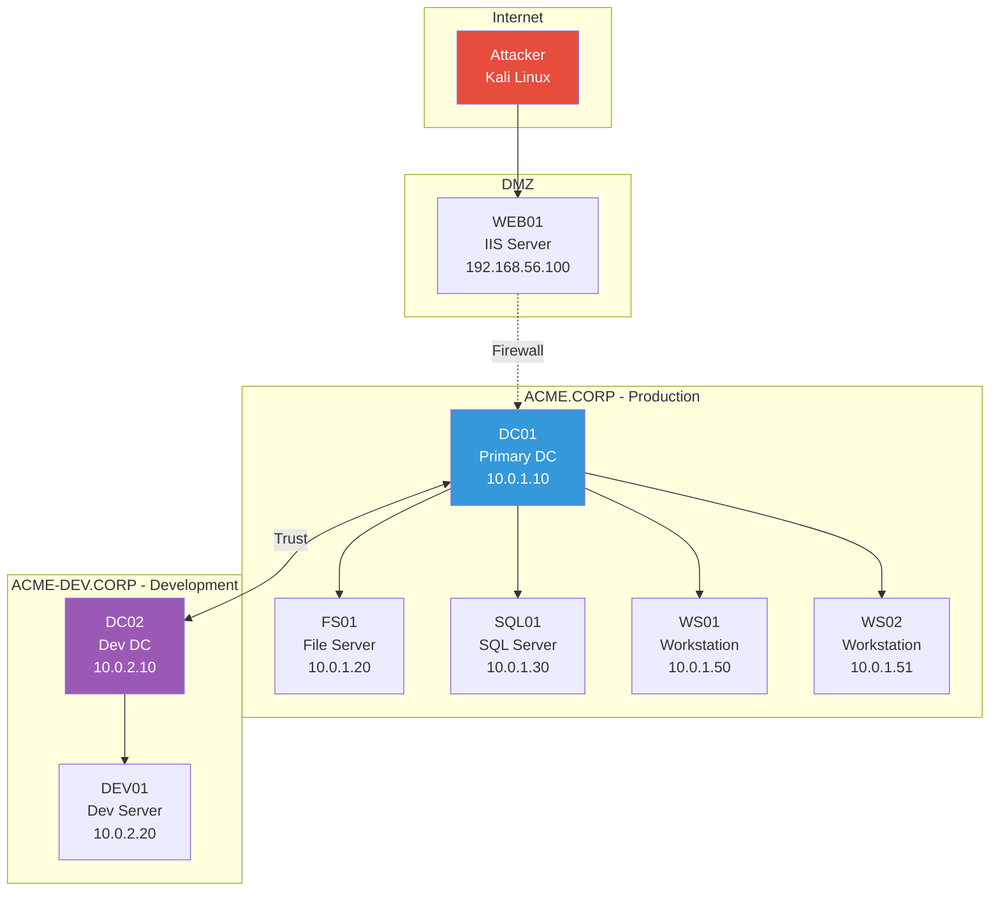
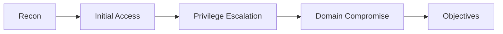

---
tags:
  - formation
  - security
  - windows
  - hacking
  - red-team
  - pentest
  - projet
---

# Module 6 : Projet Final - Red Team Assessment

Ce projet final met en pratique toutes les compétences acquises lors de la formation. Vous allez réaliser un audit Red Team complet d'une infrastructure multi-domaines, de la reconnaissance externe jusqu'à la compromission totale et la rédaction d'un rapport professionnel.

## Objectifs du Module

À la fin de ce module, vous serez capable de :

- Planifier et exécuter un audit Red Team de bout en bout
- Documenter méthodiquement chaque étape de l'attaque
- Rédiger un rapport d'audit professionnel
- Proposer des recommandations de remédiation pertinentes

**Durée estimée :** 6 heures
**Niveau :** Avancé

---

## Scénario

### Contexte de la Mission

Vous avez été mandaté par **ACME Corporation** pour réaliser un test d'intrusion Red Team de leur infrastructure Active Directory. L'objectif est de simuler une attaque réaliste pour évaluer la posture de sécurité de l'entreprise.

### Périmètre



### Informations de la Mission

| Élément | Détail |
|---------|--------|
| **Client** | ACME Corporation |
| **Type d'audit** | Red Team - Black Box |
| **Durée** | 5 jours |
| **Scope** | *.acme.corp, 10.0.0.0/16 |
| **Exclusions** | Serveur de backup (10.0.1.99), DoS |
| **Objectifs** | Compromission Domain Admin, accès aux données RH |
| **Contact urgence** | +33 1 23 45 67 89 |

### Rules of Engagement

!!! warning "Contraintes"
    - Pas d'attaques par déni de service
    - Pas de modification des données de production
    - Heures d'intervention : 19h - 7h (hors heures ouvrées)
    - Logging obligatoire de toutes les actions
    - Signalement immédiat si données personnelles découvertes

---

## Phase 1 : Reconnaissance (2h)

### 1.1 Reconnaissance Externe

**Objectif :** Collecter un maximum d'informations sans toucher l'infrastructure.

**Tâches :**

- [ ] OSINT sur ACME Corporation (LinkedIn, site web, documents publics)
- [ ] Enumération DNS (sous-domaines, records MX, TXT)
- [ ] Certificate Transparency (certificats SSL)
- [ ] Recherche de credentials leakés (Have I Been Pwned, dehashed)
- [ ] Google Dorks

**Livrable attendu :**

```markdown
## Reconnaissance Externe

### Informations collectées
- Domaine principal : acme.corp
- Sous-domaines découverts : [liste]
- Employés identifiés : [liste avec fonctions]
- Technologies détectées : [stack technique]
- Credentials potentiellement compromis : [si trouvés]

### Surface d'attaque externe
- Serveur web : https://www.acme.corp (IIS 10.0)
- Mail : mail.acme.corp (Exchange Online)
- VPN : vpn.acme.corp (Cisco AnyConnect)
```

### 1.2 Reconnaissance Réseau

**Objectif :** Cartographier l'infrastructure interne après avoir obtenu un accès initial.

**Tâches :**

- [ ] Host discovery sur les ranges internes
- [ ] Port scanning des hôtes identifiés
- [ ] Identification des Domain Controllers
- [ ] Enumération des services

**Livrable attendu :**

```markdown
## Cartographie Réseau

### Hosts découverts
| IP | Hostname | OS | Services | Rôle |
|----|----------|-----|----------|------|
| 10.0.1.10 | DC01 | Server 2019 | 88,389,445,636 | Domain Controller |
| ... | ... | ... | ... | ... |

### Domain Controllers
- DC01.acme.corp (10.0.1.10) - Primary
- DC02.acme-dev.corp (10.0.2.10) - Dev domain

### Trusts identifiés
- ACME.CORP <-> ACME-DEV.CORP (Bidirectional)
```

---

## Phase 2 : Initial Access (1h)

### 2.1 Obtenir un Premier Accès

**Techniques à tester :**

1. **Exploitation du serveur web** (si vulnérabilité trouvée)
2. **Password spraying** sur les services exposés
3. **LLMNR/NBT-NS Poisoning** (si accès réseau interne)
4. **Phishing** (si autorisé dans le scope)

**Indicateurs de succès :**

- [ ] Shell obtenu sur une machine du domaine
- [ ] Credentials d'un utilisateur du domaine

**Documentation requise :**

```markdown
## Initial Access

### Technique utilisée
[Décrire la technique d'accès initial]

### Preuves
```
[screenshot ou output de commande]
```

### Utilisateur/Machine compromis
- User : ACME\j.dupont
- Machine : WS01 (10.0.1.50)
- Niveau de privilège : User standard
```

---

## Phase 3 : Privilege Escalation & Domain Compromise (1.5h)

### 3.1 Énumération du Domaine

**Tâches :**

- [ ] Collecte BloodHound
- [ ] Identification des chemins vers Domain Admin
- [ ] Recherche de comptes Kerberoastable / AS-REP Roastable
- [ ] Identification des délégations

### 3.2 Escalade de Privilèges

**Techniques à exploiter :**

- [ ] Kerberoasting des comptes de service
- [ ] Exploitation des mauvaises configurations
- [ ] Abus des ACLs
- [ ] Attaques de délégation

**Documentation requise :**

```markdown
## Escalade de Privilèges

### BloodHound - Chemins identifiés
[Screenshot du graphe BloodHound]

### Technique d'escalade #1 : Kerberoasting
**Compte ciblé :** svc_backup
**Hash obtenu :** $krb5tgs$23$...
**Mot de passe cracké :** [password]

### Technique d'escalade #2 : [autre technique]
[Description]

### Compromission Domain Admin
**Méthode :** [technique finale utilisée]
**Preuves :**
```
C:\> whoami
acme\administrator
C:\> whoami /groups | findstr "Domain Admins"
ACME\Domain Admins
```
```

---

## Phase 4 : Post-Exploitation & Objectifs (1h)

### 4.1 Accès aux Objectifs

**Objectifs de la mission :**

1. **Compromission Domain Admin** - Démontrer le contrôle total du domaine
2. **Accès aux données RH** - Localiser et accéder aux fichiers sensibles

**Tâches :**

- [ ] DCSync pour extraction des credentials
- [ ] Localisation des partages contenant des données RH
- [ ] Accès au serveur SQL (données sensibles)
- [ ] Pivot vers le domaine de développement

### 4.2 Démonstration d'Impact

**Preuves à collecter :**

```markdown
## Objectifs Atteints

### Objectif 1 : Domain Admin
**Statut :** Atteint
**Preuve :**
- DCSync réussi
- Hash krbtgt extrait
- Hash Administrator extrait

### Objectif 2 : Données RH
**Statut :** Atteint
**Localisation :** \\FS01\RH\Salaires_2024.xlsx
**Preuve :** [Screenshot du contenu - données censurées]

### Impact potentiel
- Accès complet à tous les comptes du domaine
- Possibilité de persistence via Golden Ticket
- Données personnelles de tous les employés accessibles
```

### 4.3 Établissement de Persistence

!!! tip "Note"
    En contexte réel, on établit la persistence uniquement si explicitement demandé. Ici, c'est pour démontrer la capacité.

**Techniques à documenter :**

- [ ] Golden Ticket créé (ne pas l'utiliser, juste démontrer la capacité)
- [ ] Chemin de persistence identifié (AdminSDHolder, scheduled task, etc.)

---

## Phase 5 : Rapport (0.5h)

### 5.1 Structure du Rapport

Le rapport final doit suivre cette structure :

```markdown
# Rapport de Test d'Intrusion Red Team
## ACME Corporation

### Informations Générales
- Client : ACME Corporation
- Date : [DATE]
- Auditeur : [NOM]
- Classification : Confidentiel

---

## Résumé Exécutif

### Contexte
[2-3 phrases sur la mission]

### Résultats Clés
- Niveau de risque global : **CRITIQUE**
- Temps pour compromission DA : [X heures]
- Vulnérabilités critiques : [nombre]
- Données sensibles accessibles : OUI

### Recommandations Prioritaires
1. [Recommandation #1]
2. [Recommandation #2]
3. [Recommandation #3]

---

## Synthèse Technique

### Kill Chain


### Chronologie de l'Attaque
| Heure | Action | Résultat |
|-------|--------|----------|
| 19:00 | Reconnaissance externe | 15 sous-domaines |
| 19:30 | Scan réseau interne | 12 hosts |
| 20:00 | LLMNR Poisoning | Hash j.dupont |
| ... | ... | ... |

---

## Vulnérabilités Identifiées

### VULN-001 : LLMNR/NBT-NS Activé
**Sévérité :** Haute
**CVSS :** 7.5
**Description :** Les protocoles LLMNR et NBT-NS sont activés sur le réseau, permettant le poisoning et la capture de credentials.
**Impact :** Capture de credentials utilisateurs
**Preuve :** [Screenshot Responder]
**Recommandation :** Désactiver LLMNR et NBT-NS via GPO
**Référence :** CIS Benchmark Windows Server 2019 - 18.5.4.1

### VULN-002 : Compte de Service Kerberoastable
**Sévérité :** Haute
**CVSS :** 7.2
**Description :** Le compte svc_backup possède un SPN et un mot de passe faible.
**Impact :** Compromission du compte de backup
**Preuve :** [Hash cracké en 2 minutes]
**Recommandation :** Utiliser des mots de passe de 25+ caractères pour les comptes de service, ou gMSA
**Référence :** MITRE ATT&CK T1558.003

[Continuer pour chaque vulnérabilité...]

---

## Recommandations Détaillées

### Priorité Critique (< 30 jours)

#### REC-001 : Désactiver LLMNR et NBT-NS
**Vulnérabilité associée :** VULN-001
**Effort :** Faible
**Implémentation :**
```powershell
# Via GPO
# Computer Configuration > Administrative Templates > Network > DNS Client
# Turn off multicast name resolution = Enabled
```

### Priorité Haute (< 90 jours)

#### REC-002 : Rotation des mots de passe des comptes de service
[...]

### Priorité Moyenne (< 180 jours)

[...]

---

## Annexes

### A. Méthodologie
[Description de la méthodologie utilisée]

### B. Outils Utilisés
| Outil | Version | Usage |
|-------|---------|-------|
| Nmap | 7.94 | Scan réseau |
| BloodHound | 4.3 | Enumération AD |
| Responder | 3.1 | LLMNR Poisoning |
| ... | ... | ... |

### C. Références
- MITRE ATT&CK Framework
- CIS Benchmarks
- ANSSI - Recommandations AD

### D. Logs d'Audit
[Logs détaillés de toutes les commandes exécutées]
```

---

## Critères d'Évaluation

### Grille de Notation

| Critère | Points | Description |
|---------|:------:|-------------|
| Reconnaissance complète | 10 | OSINT + scan réseau documentés |
| Initial Access | 15 | Accès obtenu et documenté |
| Privilege Escalation | 20 | DA obtenu via technique valide |
| Objectifs atteints | 15 | Données RH + DCSync |
| OpSec | 10 | Actions discrètes, pas de détection |
| Rapport exécutif | 10 | Clair, concis, actionnable |
| Rapport technique | 15 | Détaillé, reproductible, preuves |
| Recommandations | 5 | Pertinentes et priorisées |
| **Total** | **100** | |

### Niveaux de Réussite

| Score | Niveau | Description |
|-------|--------|-------------|
| 90-100 | Expert | Prêt pour des missions Red Team réelles |
| 75-89 | Avancé | Bonnes compétences, quelques améliorations |
| 60-74 | Intermédiaire | Base solide, pratique supplémentaire requise |
| < 60 | À améliorer | Revoir les modules précédents |

---

## Conseils pour la Réussite

!!! tip "Bonnes Pratiques"

    1. **Documentez en temps réel** - Ne comptez pas sur votre mémoire
    2. **Prenez des screenshots** - Preuves indispensables
    3. **Respectez le scope** - Ne jamais dépasser le périmètre
    4. **Testez vos credentials** - Avant de passer à la suite
    5. **Gardez un terminal de notes** - tmux ou screen avec un terminal dédié
    6. **Faites des snapshots** - Avant chaque étape critique

!!! warning "Erreurs Courantes"

    - Oublier de documenter une étape
    - Ne pas vérifier le scope avant une action
    - Rapport technique sans preuves
    - Recommandations génériques (copier/coller)
    - Pas de priorisation des vulnérabilités

---

## Template de Notes de Mission

```markdown
# Notes - Red Team ACME Corporation
Date : [DATE]
Auditeur : [NOM]

## Timeline
- [HH:MM] - [Action] - [Résultat]

## Credentials Collectés
| Username | Password/Hash | Source | Validé |
|----------|---------------|--------|--------|
| | | | |

## Machines Compromises
| IP | Hostname | User | Méthode |
|----|----------|------|---------|
| | | | |

## Vulnérabilités Trouvées
1. [VULN] - [Sévérité] - [Notes]

## À Explorer
- [ ] [Piste 1]
- [ ] [Piste 2]

## Questions pour le Client
- [Question 1]
```

---

## Ressources pour le Projet

- [Template de Rapport Pentest](https://github.com/juliocesarfort/public-pentesting-reports)
- [PTES - Penetration Testing Execution Standard](http://www.pentest-standard.org/)
- [OWASP Testing Guide](https://owasp.org/www-project-web-security-testing-guide/)
- [MITRE ATT&CK Navigator](https://mitre-attack.github.io/attack-navigator/)

---

## Conclusion

Félicitations d'avoir terminé cette formation **Windows Hacking Mastery** !

Vous avez maintenant les compétences pour :

- Énumérer et compromettre des environnements Active Directory
- Réaliser des escalades de privilèges complexes
- Établir des mécanismes de persistence
- Contourner les défenses modernes
- Rédiger des rapports professionnels

### Prochaines Étapes

1. **Pratiquer sur des labs** - HackTheBox, TryHackMe, PentesterLab
2. **Obtenir une certification** - OSCP, CRTO, PNPT
3. **Contribuer à la communauté** - Write-ups, outils, recherche
4. **Rester à jour** - Les techniques évoluent constamment

---

| | |
|:---|---:|
| [← Module 5 : Post-Exploitation](05-module.md) | |

[Retour au Programme](index.md){ .md-button }

---

*Formation Windows Hacking Mastery - Tous droits réservés*
