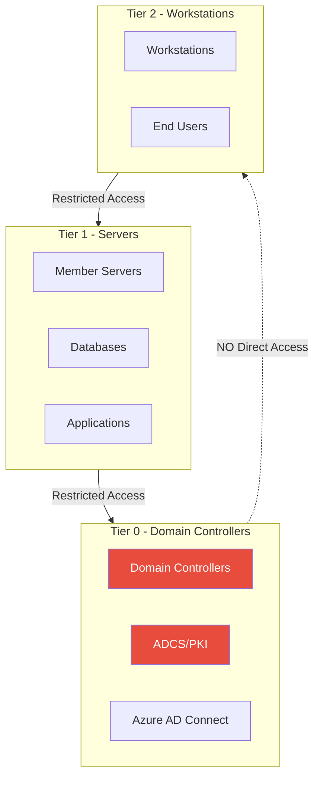

---
tags:
  - formation
  - security
  - windows
  - active-directory
  - hardening
  - blue-team
  - defense
---

# Active Directory Hardening Guide

Ce guide couvre les mesures défensives pour sécuriser Active Directory contre les attaques couvertes dans cette formation.

!!! tip "Perspective Purple Team"
    Comprendre les défenses aide le Red Team à :

    - Identifier les environnements bien/mal sécurisés
    - Adapter les techniques aux contrôles en place
    - Proposer des remédiations pertinentes

---

## Vue d'Ensemble - Defense in Depth



---

## 1. Administrative Tiering Model

### 1.1 Concept des Tiers

| Tier | Assets | Comptes Admin | Accès Autorisé |
|------|--------|---------------|----------------|
| **Tier 0** | DC, ADCS, AAD Connect | Domain Admins | Tier 0 uniquement |
| **Tier 1** | Serveurs membres | Server Admins | Tier 1 et inférieur |
| **Tier 2** | Workstations | Workstation Admins | Tier 2 uniquement |

### 1.2 Implémentation

```powershell
# Créer les OUs pour le tiering
New-ADOrganizationalUnit -Name "Tier 0" -Path "DC=corp,DC=local"
New-ADOrganizationalUnit -Name "Tier 1" -Path "DC=corp,DC=local"
New-ADOrganizationalUnit -Name "Tier 2" -Path "DC=corp,DC=local"

# Créer les groupes d'administration par tier
New-ADGroup -Name "Tier0-Admins" -GroupScope Global -Path "OU=Tier 0,DC=corp,DC=local"
New-ADGroup -Name "Tier1-Admins" -GroupScope Global -Path "OU=Tier 1,DC=corp,DC=local"
New-ADGroup -Name "Tier2-Admins" -GroupScope Global -Path "OU=Tier 2,DC=corp,DC=local"

# GPO: Restreindre les logons inter-tier
# Computer Configuration > Policies > Windows Settings > Security Settings > Local Policies > User Rights Assignment
# "Deny log on locally" = Tier0-Admins sur Tier 2
# "Deny log on through Remote Desktop Services" = Tier0-Admins sur Tier 1/2
```

### 1.3 Privileged Access Workstations (PAW)

```powershell
# PAWs dédiées pour l'administration Tier 0
# - Pas d'accès Internet
# - Pas d'email/Office
# - Uniquement outils d'administration

# GPO pour PAWs
# Bloquer l'accès Internet
New-NetFirewallRule -DisplayName "Block Internet" -Direction Outbound -Action Block `
    -RemoteAddress "0.0.0.0-9.255.255.255","11.0.0.0-172.15.255.255","172.32.0.0-192.167.255.255","192.169.0.0-255.255.255.255"

# Autoriser uniquement DC
New-NetFirewallRule -DisplayName "Allow DC" -Direction Outbound -Action Allow `
    -RemoteAddress "10.0.0.10","10.0.0.11" -Protocol TCP -RemotePort 389,636,3268,3269,88,445
```

---

## 2. Credential Protection

### 2.1 Protected Users Group

```powershell
# Ajouter les comptes privilégiés au groupe Protected Users
Add-ADGroupMember -Identity "Protected Users" -Members "admin1","admin2"

# Effets du groupe Protected Users:
# - Pas de cache de credentials (DCC)
# - Pas de NTLM (Kerberos uniquement)
# - Pas de délégation
# - TGT lifetime réduit à 4h
# - Pas de RC4 (AES uniquement)
```

### 2.2 Credential Guard

```powershell
# Activer Credential Guard (Windows 10/11 Enterprise, Server 2016+)
# Prérequis: UEFI Secure Boot, TPM 2.0

# Via GPO
# Computer Configuration > Administrative Templates > System > Device Guard
# "Turn On Virtualization Based Security" = Enabled
# "Credential Guard Configuration" = Enabled with UEFI lock

# Vérifier le statut
Get-CimInstance -ClassName Win32_DeviceGuard -Namespace root\Microsoft\Windows\DeviceGuard
```

### 2.3 LAPS (Local Administrator Password Solution)

```powershell
# Installer LAPS
# Télécharger depuis Microsoft

# Étendre le schéma AD
Update-AdmPwdADSchema

# Configurer les permissions
Set-AdmPwdComputerSelfPermission -OrgUnit "OU=Workstations,DC=corp,DC=local"
Set-AdmPwdReadPasswordPermission -OrgUnit "OU=Workstations,DC=corp,DC=local" -AllowedPrincipals "HelpDesk"

# GPO LAPS
# Computer Configuration > Administrative Templates > LAPS
# "Enable local admin password management" = Enabled
# "Password Settings" = Complexity, Length, Age
```

### 2.4 Désactiver NTLM

```powershell
# GPO: Restreindre NTLM progressivement
# Computer Configuration > Policies > Windows Settings > Security Settings > Local Policies > Security Options

# 1. Auditer d'abord
"Network security: Restrict NTLM: Audit NTLM authentication in this domain" = "Enable all"
"Network security: Restrict NTLM: Audit Incoming NTLM Traffic" = "Enable auditing for all accounts"

# 2. Après analyse des logs, bloquer
"Network security: Restrict NTLM: NTLM authentication in this domain" = "Deny all"

# Exceptions si nécessaire
"Network security: Restrict NTLM: Add server exceptions" = "legacy-server.corp.local"
```

---

## 3. Kerberos Hardening

### 3.1 Contre Kerberoasting

```powershell
# Identifier les comptes avec SPN (Kerberoastables)
Get-ADUser -Filter {ServicePrincipalName -ne "$null"} -Properties ServicePrincipalName,PasswordLastSet

# Solution 1: Mots de passe longs (+25 caractères)
# Solution 2: Utiliser gMSA (Group Managed Service Accounts)

# Créer un gMSA
New-ADServiceAccount -Name "svc_sql_gmsa" `
    -DNSHostName "svc_sql_gmsa.corp.local" `
    -PrincipalsAllowedToRetrieveManagedPassword "SQL-Servers" `
    -KerberosEncryptionType AES128,AES256

# Installer sur le serveur
Install-ADServiceAccount -Identity "svc_sql_gmsa"
Test-ADServiceAccount -Identity "svc_sql_gmsa"

# Configurer le service
# Service > Log On > This account: CORP\svc_sql_gmsa$
```

### 3.2 Contre AS-REP Roasting

```powershell
# Identifier les comptes vulnérables (pré-auth désactivée)
Get-ADUser -Filter {DoesNotRequirePreAuth -eq $true} -Properties DoesNotRequirePreAuth

# Corriger
Set-ADUser -Identity "vulnerable_user" -DoesNotRequirePreAuth $false

# Audit continu
$vuln = Get-ADUser -Filter {DoesNotRequirePreAuth -eq $true}
if ($vuln) {
    Send-MailMessage -To "security@corp.local" -Subject "AS-REP Roastable accounts found" -Body ($vuln | Out-String)
}
```

### 3.3 Forcer AES pour Kerberos

```powershell
# Désactiver RC4 au niveau du domaine (après tests!)
# GPO: Computer Configuration > Policies > Windows Settings > Security Settings > Local Policies > Security Options
"Network security: Configure encryption types allowed for Kerberos" = "AES128_HMAC_SHA1, AES256_HMAC_SHA1, Future encryption types"

# Vérifier les comptes encore en RC4
Get-ADUser -Filter * -Properties msDS-SupportedEncryptionTypes |
    Where-Object {$_.'msDS-SupportedEncryptionTypes' -band 4} |
    Select-Object Name, msDS-SupportedEncryptionTypes
```

### 3.4 Rotation du mot de passe krbtgt

```powershell
# Rotation régulière (tous les 90-180 jours)
# Script officiel Microsoft: Reset-KrbtgtKeyInteractive.ps1

# IMPORTANT: Faire 2 rotations espacées de 10+ heures
# Pour invalider tous les tickets existants

# Télécharger depuis: https://github.com/microsoft/New-KrbtgtKeys.ps1
.\New-KrbtgtKeys.ps1 -Mode ReadOnly  # Vérifier d'abord
.\New-KrbtgtKeys.ps1 -Mode Simulate  # Simuler
.\New-KrbtgtKeys.ps1 -Mode Execute   # Exécuter
```

---

## 4. Delegation Hardening

### 4.1 Identifier les Délégations Dangereuses

```powershell
# Unconstrained Delegation (très dangereux)
Get-ADComputer -Filter {TrustedForDelegation -eq $true} -Properties TrustedForDelegation
Get-ADUser -Filter {TrustedForDelegation -eq $true} -Properties TrustedForDelegation

# Constrained Delegation
Get-ADObject -Filter {msDS-AllowedToDelegateTo -ne "$null"} -Properties msDS-AllowedToDelegateTo

# Resource-Based Constrained Delegation
Get-ADComputer -Filter {msDS-AllowedToActOnBehalfOfOtherIdentity -ne "$null"} -Properties msDS-AllowedToActOnBehalfOfOtherIdentity
```

### 4.2 Remédiation

```powershell
# Désactiver Unconstrained Delegation (sauf sur DC)
Set-ADComputer -Identity "SERVER01" -TrustedForDelegation $false

# Pour les DC: Activer "Account is sensitive and cannot be delegated" sur les comptes admin
Set-ADUser -Identity "admin" -AccountNotDelegated $true

# Protected Users Group protège aussi contre la délégation
Add-ADGroupMember -Identity "Protected Users" -Members "admin"
```

---

## 5. ADCS Security

### 5.1 Audit des Templates Vulnérables

```powershell
# Utiliser Certify ou PSPKIAudit
# https://github.com/GhostPack/Certify

# Identifier ESC1 (Client Auth + ENROLLEE_SUPPLIES_SUBJECT)
Certify.exe find /vulnerable

# Vérifier manuellement
Get-ADObject -Filter {objectClass -eq "pKICertificateTemplate"} -Properties * |
    Where-Object {$_.msPKI-Certificate-Name-Flag -band 1}
```

### 5.2 Sécuriser les Templates

```powershell
# Corriger ESC1: Désactiver ENROLLEE_SUPPLIES_SUBJECT
# Via certtmpl.msc > Template > Properties > Subject Name
# "Supply in the request" = Décoché
# "Build from this Active Directory information" = Coché

# Corriger ESC4: Permissions sur les templates
# Retirer "Authenticated Users" des droits d'enrollment
# Limiter à des groupes spécifiques

# Corriger ESC6: EDITF_ATTRIBUTESUBJECTALTNAME2
certutil -setreg policy\EditFlags -EDITF_ATTRIBUTESUBJECTALTNAME2
net stop certsvc && net start certsvc
```

### 5.3 Monitoring ADCS

```powershell
# Activer l'audit
auditpol /set /subcategory:"Certification Services" /success:enable /failure:enable

# Event IDs à surveiller:
# 4886 - Certificate request received
# 4887 - Certificate request approved
# 4888 - Certificate request denied
# 4890 - Certificate Manager settings changed

# Alerter sur les templates sensibles
Get-WinEvent -FilterHashtable @{LogName='Security'; ID=4887} |
    Where-Object {$_.Properties[4].Value -match "Administrator|User"}
```

---

## 6. Network Segmentation

### 6.1 Isoler les Domain Controllers

```powershell
# Firewall Windows sur les DC - Autoriser uniquement le nécessaire
# Ports requis:
# 53 (DNS), 88 (Kerberos), 135 (RPC), 389/636 (LDAP/S), 445 (SMB), 464 (Kpasswd)
# 3268/3269 (Global Catalog), 49152-65535 (RPC dynamic)

# Bloquer les connexions depuis les workstations Tier 2
New-NetFirewallRule -DisplayName "Block Tier2 to DC" -Direction Inbound -Action Block `
    -RemoteAddress "10.0.2.0/24" -Protocol TCP -LocalPort 445,3389,5985
```

### 6.2 Désactiver les Protocoles Legacy

```powershell
# Désactiver SMBv1
Disable-WindowsOptionalFeature -Online -FeatureName SMB1Protocol -NoRestart
Set-SmbServerConfiguration -EnableSMB1Protocol $false

# Désactiver LLMNR (GPO)
# Computer Configuration > Administrative Templates > Network > DNS Client
# "Turn off multicast name resolution" = Enabled

# Désactiver NBT-NS
# Network Adapter > IPv4 > Advanced > WINS > Disable NetBIOS over TCP/IP

# Désactiver WPAD
New-ItemProperty -Path "HKLM:\SOFTWARE\Microsoft\Windows\CurrentVersion\Internet Settings\Wpad" `
    -Name "WpadOverride" -Value 1 -PropertyType DWORD
```

---

## 7. Monitoring & Detection

### 7.1 Event IDs Critiques

| Event ID | Source | Description | Sévérité |
|----------|--------|-------------|----------|
| 4768 | Security | TGT Request | Info |
| 4769 | Security | TGS Request (watch RC4) | Medium |
| 4771 | Security | Kerberos pre-auth failed | Medium |
| 4776 | Security | NTLM authentication | Medium |
| 4624/4625 | Security | Logon success/failure | Info/Medium |
| 4648 | Security | Explicit credential logon | High |
| 4662 | Security | Directory service access | High |
| 4670 | Security | Permissions changed | High |
| 4738 | Security | User account changed | Medium |
| 4742 | Security | Computer account changed | Medium |
| 5136 | Security | Directory object modified | Medium |
| 7045 | System | Service installed | High |

### 7.2 Advanced Threat Analytics Queries

```powershell
# Détecter DCSync (Event 4662 avec DS-Replication-Get-Changes)
Get-WinEvent -FilterHashtable @{LogName='Security'; ID=4662} |
    Where-Object {
        $_.Properties[8].Value -match '1131f6aa-9c07-11d1-f79f-00c04fc2dcd2|1131f6ad-9c07-11d1-f79f-00c04fc2dcd2'
    } | Select-Object TimeCreated, @{N='User';E={$_.Properties[1].Value}}

# Détecter Kerberoasting (TGS RC4)
Get-WinEvent -FilterHashtable @{LogName='Security'; ID=4769} |
    Where-Object {$_.Properties[5].Value -eq '0x17'} |
    Group-Object {$_.Properties[0].Value} |
    Where-Object {$_.Count -gt 10}

# Détecter Password Spraying
Get-WinEvent -FilterHashtable @{LogName='Security'; ID=4771; StartTime=(Get-Date).AddHours(-1)} |
    Group-Object {$_.Properties[0].Value} |
    Where-Object {$_.Count -gt 5}
```

### 7.3 Sysmon pour AD

```xml
<!-- Sysmon config pour DC -->
<Sysmon schemaversion="4.90">
    <EventFiltering>
        <!-- Process Creation -->
        <RuleGroup name="ProcessCreate" groupRelation="or">
            <ProcessCreate onmatch="include">
                <Image condition="end with">mimikatz.exe</Image>
                <Image condition="end with">procdump.exe</Image>
                <CommandLine condition="contains">sekurlsa</CommandLine>
                <CommandLine condition="contains">lsadump</CommandLine>
                <CommandLine condition="contains">dcsync</CommandLine>
                <ParentImage condition="end with">lsass.exe</ParentImage>
            </ProcessCreate>
        </RuleGroup>

        <!-- LSASS Access -->
        <RuleGroup name="ProcessAccess" groupRelation="or">
            <ProcessAccess onmatch="include">
                <TargetImage condition="end with">lsass.exe</TargetImage>
            </ProcessAccess>
        </RuleGroup>
    </EventFiltering>
</Sysmon>
```

---

## 8. Quick Wins Checklist

### Immédiat (Cette Semaine)

- [ ] Activer l'audit avancé sur les DC
- [ ] Vérifier les comptes dans "Protected Users"
- [ ] Scanner les comptes AS-REP Roastables
- [ ] Identifier les comptes avec Unconstrained Delegation
- [ ] Vérifier les permissions AdminSDHolder

### Court Terme (Ce Mois)

- [ ] Déployer LAPS
- [ ] Implémenter le tiering administratif (au moins Tier 0)
- [ ] Configurer les GPO de restriction NTLM (audit d'abord)
- [ ] Auditer les templates ADCS
- [ ] Mettre en place le monitoring des Event IDs critiques

### Moyen Terme (Ce Trimestre)

- [ ] Déployer Credential Guard
- [ ] Migrer les comptes de service vers gMSA
- [ ] Implémenter PAWs pour Tier 0
- [ ] Rotation krbtgt
- [ ] Désactiver les protocoles legacy (SMBv1, LLMNR, NBT-NS)

---

## 9. Ressources

### Outils d'Audit

| Outil | Usage |
|-------|-------|
| **PingCastle** | Audit de sécurité AD complet |
| **Purple Knight** | Évaluation des vulnérabilités AD |
| **BloodHound** | Visualisation des chemins d'attaque |
| **Certify** | Audit ADCS |
| **ADRecon** | Collecte d'informations AD |

### Documentation Microsoft

- [Securing Privileged Access](https://docs.microsoft.com/en-us/security/compass/privileged-access-strategy)
- [Active Directory Security Best Practices](https://docs.microsoft.com/en-us/windows-server/identity/ad-ds/plan/security-best-practices/best-practices-for-securing-active-directory)
- [Credential Guard](https://docs.microsoft.com/en-us/windows/security/identity-protection/credential-guard/credential-guard)

---

[Retour au Programme](index.md){ .md-button }
[Detection Engineering →](detection-engineering.md){ .md-button .md-button--primary }
