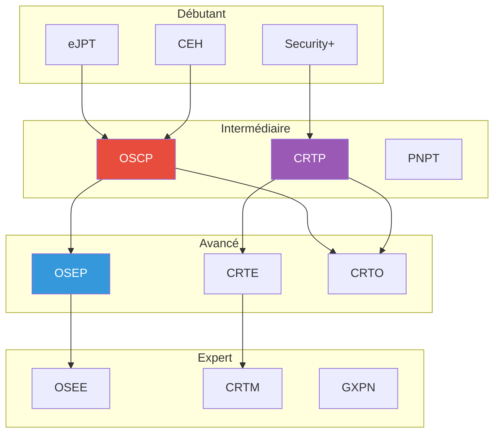
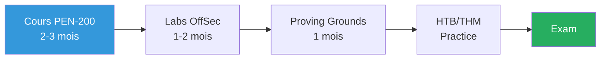

---
tags:
  - formation
  - security
  - certifications
  - oscp
  - crtp
  - crte
  - career
---

# Certification Roadmap - Security Offensive

Guide des certifications offensives pour planifier votre parcours professionnel et préparer efficacement les examens.

---

## Vue d'Ensemble - Progression



---

## 1. Certifications par Niveau

### 1.1 Niveau Débutant

| Certification | Organisme | Focus | Durée Exam | Prix |
|--------------|-----------|-------|------------|------|
| **eJPT** | eLearnSecurity/INE | Pentest généraliste | 48h lab | ~$250 |
| **CEH** | EC-Council | Théorie hacking | 4h QCM | ~$1,200 |
| **Security+** | CompTIA | Fondamentaux sécurité | 90min QCM | ~$400 |

### 1.2 Niveau Intermédiaire

| Certification | Organisme | Focus | Durée Exam | Prix |
|--------------|-----------|-------|------------|------|
| **OSCP** | OffSec | Pentest réseau/web | 24h lab | ~$1,600 |
| **CRTP** | Altered Security | Active Directory | 24h lab | ~$300 |
| **PNPT** | TCM Security | Pentest pratique | 5 jours | ~$400 |
| **eCPPT** | INE | Pentest avancé | 14 jours | ~$400 |

### 1.3 Niveau Avancé

| Certification | Organisme | Focus | Durée Exam | Prix |
|--------------|-----------|-------|------------|------|
| **OSEP** | OffSec | Evasion, C2, Red Team | 48h lab | ~$1,600 |
| **CRTE** | Altered Security | AD avancé, Forest | 48h lab | ~$300 |
| **CRTO** | Zero-Point Security | Red Team Ops, Cobalt Strike | 48h lab | ~$500 |
| **GPEN** | SANS/GIAC | Pentest enterprise | 3h QCM | ~$8,000 |

### 1.4 Niveau Expert

| Certification | Organisme | Focus | Durée Exam | Prix |
|--------------|-----------|-------|------------|------|
| **OSEE** | OffSec | Exploit development | 72h lab | ~$1,600 |
| **CRTM** | Altered Security | Multi-forest, Azure AD | 72h lab | ~$400 |
| **GXPN** | SANS/GIAC | Exploitation avancée | 3h QCM | ~$8,000 |

---

## 2. OSCP - Offensive Security Certified Professional

### 2.1 Prérequis Recommandés

- Linux fondamentaux (bash, permissions, services)
- Networking (TCP/IP, protocols, Wireshark)
- Scripting de base (Python ou Bash)
- Familiarité avec les outils (Nmap, Burp, Metasploit)

### 2.2 Contenu du Cours (PEN-200)

```
Module 1: Pentest Fundamentals
Module 2: Information Gathering
Module 3: Vulnerability Scanning
Module 4: Web Application Attacks
Module 5: Client-Side Attacks
Module 6: Locating Public Exploits
Module 7: Fixing Exploits
Module 8: Antivirus Evasion
Module 9: Password Attacks
Module 10: Windows Privilege Escalation
Module 11: Linux Privilege Escalation
Module 12: Port Redirection and Tunneling
Module 13: Active Directory Attacks
Module 14: Metasploit Framework
Module 15: PowerShell Empire (deprecated)
Module 16: Assembling the Pieces
```

### 2.3 Format d'Examen

```
Durée: 23h45 + 24h rapport
Points: 100 (70 pour réussir)

Structure:
├── 3 machines standalone (20 pts chacune = 60 pts)
├── 1 set AD (40 pts)
│   ├── Machine 1 (10 pts)
│   ├── Machine 2 (10 pts)
│   └── Domain Controller (20 pts)
└── Bonus: 10 pts (exercices cours + labs)

Règles:
- Metasploit autorisé sur 1 machine seulement
- SQLmap autorisé
- Auto-exploitation interdite (Nessus, OpenVAS exploit)
- Preuves requises: local.txt, proof.txt, screenshots
```

### 2.4 Stratégie de Préparation



**Ressources complémentaires :**

- HackTheBox: machines "OSCP-like" (TJNull list)
- Proving Grounds Practice (même plateforme qu'exam)
- TryHackMe: parcours Offensive Pentesting
- IppSec YouTube: walkthroughs détaillés

### 2.5 Tips Exam

```markdown
# Avant l'exam
- [ ] Dormir la veille, pas de cramming
- [ ] Préparer snacks, café, eau
- [ ] Tester VPN et VM avant
- [ ] Templates de rapport prêts
- [ ] Cheatsheets imprimées/accessibles

# Pendant l'exam
- [ ] Commencer par l'AD set (40 pts garantis si réussi)
- [ ] 2-3h par machine standalone max
- [ ] Prendre des screenshots EN TEMPS RÉEL
- [ ] Si bloqué > 2h, passer à une autre machine
- [ ] Garder 3h pour le rapport

# Rapport
- [ ] Executive summary
- [ ] Étapes détaillées avec screenshots
- [ ] Preuves (local.txt, proof.txt, ifconfig/ipconfig)
- [ ] Remédiations
```

---

## 3. CRTP - Certified Red Team Professional

### 3.1 Focus

Spécialisé Active Directory, le CRTP couvre :

- Enumération AD (BloodHound, PowerView)
- Kerberos attacks (Kerberoasting, AS-REP, Delegation)
- Lateral movement (PsExec, WinRM, DCOM)
- Domain privilege escalation
- Persistence mechanisms
- Defense evasion (AMSI, Constrained Language)

### 3.2 Format d'Examen

```
Durée: 24h lab + 48h rapport
Objectif: Compromettre 5 machines dans un environnement AD

Structure:
├── Foothold initial
├── 3-4 machines membres
└── Domain Controller(s)

Pas de points, c'est Pass/Fail basé sur:
- Nombre de machines compromises
- Qualité du rapport
- Méthodologie démontrée
```

### 3.3 Préparation

```powershell
# Maîtriser ces outils
PowerView          # Énumération AD
BloodHound         # Visualisation
Rubeus             # Kerberos attacks
Mimikatz           # Credential dumping
PowerUpSQL         # SQL Server
Invoke-Obfuscation # Evasion

# Labs recommandés
- Lab Altered Security (inclus)
- HackTheBox Pro Labs (Offshore, RastaLabs)
- TryHackMe AD rooms
- DVAD (Damn Vulnerable AD)
```

### 3.4 Tips Exam

```markdown
# Méthodologie
1. Énumération complète avant exploitation
2. BloodHound FIRST pour visualiser les chemins
3. Documenter CHAQUE commande exécutée
4. Prendre screenshots régulièrement
5. Ne pas oublier la persistence (demandée parfois)

# Erreurs courantes
- Se précipiter sans énumérer complètement
- Oublier les shares (scripts, GPO, etc.)
- Ne pas vérifier les ACLs sur les objets
- Ignorer les comptes de service
```

---

## 4. OSEP - Offensive Security Experienced Pentester

### 4.1 Focus

Red Team avancé, évasion, et techniques sophistiquées :

- Antivirus/EDR evasion
- Process injection advanced
- Custom payload development
- Application whitelisting bypass
- Kiosk breakout
- Linux lateral movement

### 4.2 Prérequis

- OSCP recommandé (pas obligatoire)
- C# ou C++ basics
- Familiarité avec la PE structure
- Compréhension des mécanismes de sécurité Windows

### 4.3 Format d'Examen

```
Durée: 47h45 + 24h rapport
Objectif: Compromettre un environnement avec défenses

Points: 100 (70 pour réussir)
├── Machines avec AV/EDR actifs
├── Application whitelisting
└── Secret flags à collecter

Pas de Metasploit (sauf msfvenom pour shellcode)
```

### 4.4 Préparation

```csharp
// Concepts à maîtriser

// 1. Process Injection
CreateRemoteThread
QueueUserAPC
Early Bird injection
Process Hollowing

// 2. AV Evasion
Shellcode encryption
Syscalls directs
Unhooking techniques
Sleep obfuscation

// 3. Payload Development
// Loaders custom en C#/.NET
// Stagers et stages
// Reflective loading
```

---

## 5. CRTE - Certified Red Team Expert

### 5.1 Focus

Suite du CRTP, environnements multi-forêts :

- Cross-forest attacks
- Trust exploitation
- Azure AD integration
- ADCS exploitation
- SQL Server attacks avancés
- SCCM/MECM exploitation

### 5.2 Format d'Examen

```
Durée: 48h lab + 48h rapport
Objectif: Compromettre plusieurs forêts AD

Structure:
├── Forest 1 (parent)
├── Forest 2 (trusted)
├── Azure AD tenant
└── Multiple domains

Pass/Fail basé sur flags + rapport
```

### 5.3 Préparation

```powershell
# Outils supplémentaires à maîtriser
Certify/Certipy      # ADCS exploitation
SharpSCCM            # SCCM attacks
AADInternals         # Azure AD
ROADtools            # Azure AD
Impacket             # Cross-platform

# Concepts clés
- Trust relationships (direction, transitivity)
- SID History injection
- ADCS ESC1-ESC8
- Azure AD Connect exploitation
- Kerberos across trusts
```

---

## 6. CRTO - Certified Red Team Operator

### 6.1 Focus

Red Team Ops avec Cobalt Strike :

- C2 operations
- Infrastructure setup
- Payload development
- OPSEC considerations
- Team operations
- Reporting

### 6.2 Unique

Seule certification officielle Cobalt Strike training.

```
Durée: 48h lab
Objectif: Simuler une opération Red Team complète

Évaluation:
├── Compromission environnement
├── Persistence établie
├── Objectifs atteints
└── Rapport opérationnel
```

### 6.3 Préparation

```yaml
# Concepts à maîtriser
C2 Profiles:
  - Malleable C2
  - Traffic blending
  - HTTPS/DNS

Operations:
  - Initial access
  - Payload staging
  - Beacon operations
  - Pivoting
  - Credential harvesting

OPSEC:
  - Process injection selection
  - Sleep obfuscation
  - Artifact management
```

---

## 7. Planification de Carrière

### 7.1 Parcours Recommandés

**Pentest généraliste :**
```
Security+ → eJPT → OSCP → OSEP
```

**Spécialiste AD :**
```
Security+ → CRTP → CRTE → CRTM
```

**Red Team :**
```
OSCP → CRTP → CRTO → OSEP
```

**Full Stack Offensive :**
```
eJPT → OSCP → CRTP → OSEP/CRTO → CRTE
```

### 7.2 Timeline Réaliste

| Certification | Préparation | Temps Total |
|--------------|-------------|-------------|
| eJPT | 1-2 mois | 2-3 mois |
| OSCP | 3-6 mois | 4-8 mois |
| CRTP | 1-2 mois | 2-3 mois |
| OSEP | 3-4 mois | 4-6 mois |
| CRTE | 2-3 mois | 3-4 mois |
| CRTO | 2-3 mois | 3-4 mois |

### 7.3 Budget Estimé

```
Parcours "Budget" (self-study):
├── eJPT: $250
├── CRTP: $300
├── CRTE: $300
└── Total: ~$850

Parcours "Standard":
├── OSCP: $1,600
├── CRTP: $300
├── OSEP: $1,600
└── Total: ~$3,500

Parcours "Premium":
├── OSCP: $1,600
├── CRTP: $300
├── CRTO: $500
├── OSEP: $1,600
├── CRTE: $300
└── Total: ~$4,300
```

---

## 8. Ressources Gratuites

### 8.1 Labs Gratuits

| Plateforme | Contenu |
|------------|---------|
| **HackTheBox Free** | Machines actives (limitées) |
| **TryHackMe Free** | Rooms fondamentales |
| **PentesterLab** | Web security basics |
| **PortSwigger Academy** | Web security complet |
| **CyberDefenders** | Blue team challenges |

### 8.2 Cours Gratuits

- [TCM Security - Practical Ethical Hacking](https://academy.tcm-sec.com/)
- [HackTheBox Academy](https://academy.hackthebox.com/) (paths gratuits)
- [TryHackMe Learning Paths](https://tryhackme.com/paths)
- [Cybrary](https://www.cybrary.it/)

### 8.3 YouTube

| Chaîne | Contenu |
|--------|---------|
| **IppSec** | HTB walkthroughs détaillés |
| **John Hammond** | CTF, malware analysis |
| **The Cyber Mentor** | Pentest, OSCP prep |
| **HackerSploit** | Pentest fundamentals |
| **13Cubed** | DFIR, forensics |

---

## 9. Checklist par Certification

### OSCP

- [ ] Cours PEN-200 complété
- [ ] 50+ machines labs OffSec
- [ ] 30+ machines Proving Grounds
- [ ] 20+ machines HTB OSCP-like
- [ ] Priv esc: Windows + Linux maîtrisés
- [ ] AD basics: BloodHound, Kerberoasting
- [ ] Pivoting: SSH, Chisel, Ligolo-ng
- [ ] Template rapport prêt

### CRTP

- [ ] Cours Altered Security complété
- [ ] Lab CRTP fait 2-3 fois
- [ ] BloodHound maîtrisé
- [ ] Kerberos attacks: tous les types
- [ ] Delegation: unconstrained, constrained, RBCD
- [ ] Persistence: 3+ techniques
- [ ] AMSI bypass: 2+ techniques

### OSEP

- [ ] C# basics (classes, methods, P/Invoke)
- [ ] Process injection: 3+ techniques
- [ ] AV evasion: encryption, syscalls
- [ ] Payload dev: loader custom
- [ ] Applocker bypass: 2+ techniques

---

[Retour au Programme](index.md){ .md-button }
[Labs Interactifs →](labs-interactifs.md){ .md-button .md-button--primary }
