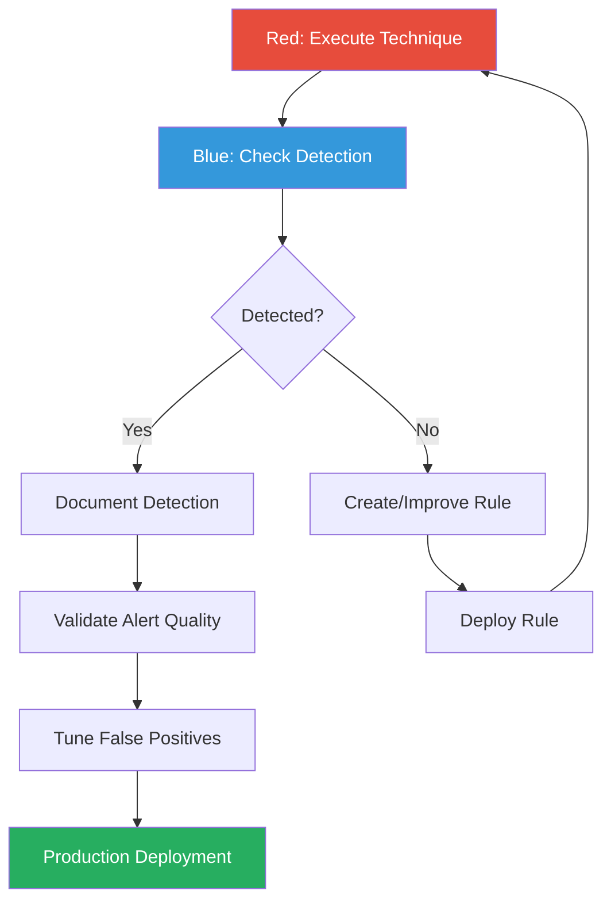

---
tags:
  - formation
  - security
  - windows
  - detection
  - sigma
  - blue-team
  - siem
  - purple-team
---

# Detection Engineering - Sigma & SIEM

Cette annexe couvre la création de règles de détection pour les techniques offensives de la formation. Perspective Purple Team essentielle.

!!! tip "Objectif Purple Team"
    Pour chaque technique offensive, savoir :

    - **Quels artefacts** elle génère
    - **Comment la détecter** (Event IDs, patterns)
    - **Comment écrire** une règle Sigma portable

---

## Vue d'Ensemble - Detection Pipeline

```mermaid
flowchart LR
    subgraph sources["Sources"]
        S1[Event Logs]
        S2[Sysmon]
        S3[EDR Telemetry]
        S4[Network Logs]
    end

    subgraph processing["Processing"]
        P1[Log Forwarding]
        P2[Normalization]
        P3[Enrichment]
    end

    subgraph detection["Detection"]
        D1[Sigma Rules]
        D2[SIEM Correlation]
        D3[ML/Behavioral]
    end

    subgraph response["Response"]
        R1[Alert]
        R2[Investigate]
        R3[Contain]
    end

    sources --> processing --> detection --> response

    style D1 fill:#9b59b6,color:#fff
    style R1 fill:#e74c3c,color:#fff
```



---

## 1. Introduction à Sigma

### 1.1 Qu'est-ce que Sigma ?

Sigma est un format générique de règles de détection, convertible vers différents SIEM :

```yaml
# Structure d'une règle Sigma
title: Titre descriptif
id: UUID unique
status: experimental|test|stable
description: Description de la détection
references:
    - https://reference.com
author: Auteur
date: YYYY/MM/DD
modified: YYYY/MM/DD
tags:
    - attack.execution
    - attack.t1059.001
logsource:
    category: process_creation
    product: windows
detection:
    selection:
        field: value
    condition: selection
falsepositives:
    - Cas légitime potentiel
level: low|medium|high|critical
```

### 1.2 Installation et Conversion

```bash
# Installation
pip install sigma-cli pySigma pySigma-backend-splunk pySigma-backend-elasticsearch

# Conversion vers Splunk
sigma convert -t splunk -p sysmon rules/windows/

# Conversion vers Elasticsearch
sigma convert -t elasticsearch rules/windows/

# Conversion vers Microsoft Sentinel (KQL)
sigma convert -t microsoft365defender rules/windows/

# Lister les backends disponibles
sigma list backends
```

---

## 2. Détection par Technique

### 2.1 Credential Access

#### Kerberoasting (T1558.003)

```yaml
title: Kerberoasting - TGS Request for Service with RC4 Encryption
id: 8d8a7c3e-9f1b-4c2d-a5e6-7f8b9c0d1e2f
status: stable
description: Detects TGS requests using RC4 encryption, indicative of Kerberoasting
references:
    - https://attack.mitre.org/techniques/T1558/003/
author: Security Team
date: 2024/01/15
tags:
    - attack.credential_access
    - attack.t1558.003
logsource:
    product: windows
    service: security
detection:
    selection:
        EventID: 4769
        TicketEncryptionType: '0x17'  # RC4
    filter_machine_accounts:
        ServiceName|endswith: '$'
    filter_krbtgt:
        ServiceName: 'krbtgt'
    condition: selection and not filter_machine_accounts and not filter_krbtgt
falsepositives:
    - Legacy applications requiring RC4
level: medium
```

**Splunk Query :**

```spl
index=windows sourcetype=WinEventLog:Security EventCode=4769
Ticket_Encryption_Type=0x17
| where NOT match(Service_Name, "\$$")
| where Service_Name!="krbtgt"
| stats count by src_user, Service_Name, Client_Address
| where count > 3
```

#### AS-REP Roasting (T1558.004)

```yaml
title: AS-REP Roasting - Kerberos Pre-Authentication Disabled
id: 9e9b8c7d-0a1b-2c3d-4e5f-6a7b8c9d0e1f
status: stable
description: Detects AS-REQ without pre-authentication for accounts
references:
    - https://attack.mitre.org/techniques/T1558/004/
author: Security Team
date: 2024/01/15
tags:
    - attack.credential_access
    - attack.t1558.004
logsource:
    product: windows
    service: security
detection:
    selection:
        EventID: 4768
        PreAuthType: '0'
    filter_machine:
        TargetUserName|endswith: '$'
    condition: selection and not filter_machine
falsepositives:
    - Accounts legitimately configured without pre-auth (rare)
level: high
```

#### DCSync (T1003.006)

```yaml
title: DCSync Attack - Directory Replication
id: 1a2b3c4d-5e6f-7a8b-9c0d-1e2f3a4b5c6d
status: stable
description: Detects DCSync attacks via Directory Replication Service
references:
    - https://attack.mitre.org/techniques/T1003/006/
author: Security Team
date: 2024/01/15
tags:
    - attack.credential_access
    - attack.t1003.006
logsource:
    product: windows
    service: security
detection:
    selection:
        EventID: 4662
        Properties|contains:
            - '1131f6aa-9c07-11d1-f79f-00c04fc2dcd2'  # DS-Replication-Get-Changes
            - '1131f6ad-9c07-11d1-f79f-00c04fc2dcd2'  # DS-Replication-Get-Changes-All
            - '89e95b76-444d-4c62-991a-0facbeda640c'  # DS-Replication-Get-Changes-In-Filtered-Set
    filter_dc:
        SubjectUserName|endswith: '$'
        SubjectUserName|contains: 'DC'
    condition: selection and not filter_dc
falsepositives:
    - Azure AD Connect servers
    - Legitimate replication tools
level: critical
```

**KQL (Microsoft Sentinel) :**

```kql
SecurityEvent
| where EventID == 4662
| where Properties contains "1131f6aa-9c07-11d1-f79f-00c04fc2dcd2"
    or Properties contains "1131f6ad-9c07-11d1-f79f-00c04fc2dcd2"
| where SubjectUserName !endswith "$"
| project TimeGenerated, SubjectUserName, SubjectDomainName, Computer
```

### 2.2 Lateral Movement

#### PsExec (T1021.002)

```yaml
title: PsExec Service Installation
id: 2b3c4d5e-6f7a-8b9c-0d1e-2f3a4b5c6d7e
status: stable
description: Detects PsExec service installation on remote systems
references:
    - https://attack.mitre.org/techniques/T1021/002/
author: Security Team
date: 2024/01/15
tags:
    - attack.lateral_movement
    - attack.t1021.002
logsource:
    product: windows
    service: system
detection:
    selection:
        EventID: 7045
        ServiceName|contains:
            - 'PSEXESVC'
            - 'PSEXEC'
            - 'csexec'
            - 'PAExec'
    condition: selection
falsepositives:
    - Legitimate admin tools
level: high
```

#### Pass-the-Hash (T1550.002)

```yaml
title: Pass-the-Hash via Mimikatz sekurlsa
id: 3c4d5e6f-7a8b-9c0d-1e2f-3a4b5c6d7e8f
status: stable
description: Detects Pass-the-Hash activity via network logon
references:
    - https://attack.mitre.org/techniques/T1550/002/
author: Security Team
date: 2024/01/15
tags:
    - attack.lateral_movement
    - attack.t1550.002
logsource:
    product: windows
    service: security
detection:
    selection:
        EventID: 4624
        LogonType: 9  # NewCredentials
        LogonProcessName: 'seclogo'
        AuthenticationPackageName: 'Negotiate'
    condition: selection
falsepositives:
    - RunAs with alternate credentials
level: high
```

#### WMI Remote Execution (T1047)

```yaml
title: WMI Remote Process Creation
id: 4d5e6f7a-8b9c-0d1e-2f3a-4b5c6d7e8f9a
status: stable
description: Detects remote process creation via WMI
references:
    - https://attack.mitre.org/techniques/T1047/
author: Security Team
date: 2024/01/15
tags:
    - attack.execution
    - attack.lateral_movement
    - attack.t1047
logsource:
    category: process_creation
    product: windows
detection:
    selection:
        ParentImage|endswith: '\WmiPrvSE.exe'
    filter_legitimate:
        Image|endswith:
            - '\WerFault.exe'
            - '\MpCmdRun.exe'
    condition: selection and not filter_legitimate
falsepositives:
    - Legitimate WMI-based management tools
    - SCCM operations
level: medium
```

### 2.3 Privilege Escalation

#### Token Impersonation - Potato (T1134.001)

```yaml
title: Potato Privilege Escalation Attempt
id: 5e6f7a8b-9c0d-1e2f-3a4b-5c6d7e8f9a0b
status: stable
description: Detects execution of Potato family privilege escalation tools
references:
    - https://attack.mitre.org/techniques/T1134/001/
author: Security Team
date: 2024/01/15
tags:
    - attack.privilege_escalation
    - attack.t1134.001
logsource:
    category: process_creation
    product: windows
detection:
    selection_name:
        Image|endswith:
            - '\JuicyPotato.exe'
            - '\SweetPotato.exe'
            - '\PrintSpoofer.exe'
            - '\GodPotato.exe'
            - '\RoguePotato.exe'
    selection_args:
        CommandLine|contains:
            - 'JuicyPotato'
            - 'SweetPotato'
            - 'PrintSpoofer'
            - 'GodPotato'
            - '-l 1337'
            - 'CreateProcessWithTokenW'
    condition: selection_name or selection_args
falsepositives:
    - Unlikely in production
level: critical
```

#### UAC Bypass - Fodhelper (T1548.002)

```yaml
title: UAC Bypass via Fodhelper
id: 6f7a8b9c-0d1e-2f3a-4b5c-6d7e8f9a0b1c
status: stable
description: Detects UAC bypass using fodhelper.exe
references:
    - https://attack.mitre.org/techniques/T1548/002/
author: Security Team
date: 2024/01/15
tags:
    - attack.privilege_escalation
    - attack.defense_evasion
    - attack.t1548.002
logsource:
    category: process_creation
    product: windows
detection:
    selection:
        ParentImage|endswith: '\fodhelper.exe'
        IntegrityLevel: 'High'
    condition: selection
falsepositives:
    - Unlikely
level: critical
```

### 2.4 Defense Evasion

#### AMSI Bypass (T1562.001)

```yaml
title: AMSI Bypass Attempt in PowerShell
id: 7a8b9c0d-1e2f-3a4b-5c6d-7e8f9a0b1c2d
status: stable
description: Detects common AMSI bypass techniques in PowerShell
references:
    - https://attack.mitre.org/techniques/T1562/001/
author: Security Team
date: 2024/01/15
tags:
    - attack.defense_evasion
    - attack.t1562.001
logsource:
    product: windows
    service: powershell-scriptblock
detection:
    selection:
        ScriptBlockText|contains:
            - 'AmsiUtils'
            - 'amsiInitFailed'
            - 'AmsiScanBuffer'
            - 'amsiContext'
            - 'AmsiOpenSession'
            - 'Disable-Amsi'
            - 'Bypass-AMSI'
    condition: selection
falsepositives:
    - Security research and testing
level: high
```

**Splunk Query :**

```spl
index=windows sourcetype=WinEventLog:Microsoft-Windows-PowerShell/Operational EventCode=4104
| search ScriptBlockText="*AmsiUtils*" OR ScriptBlockText="*amsiInitFailed*"
    OR ScriptBlockText="*AmsiScanBuffer*"
| table _time, ComputerName, ScriptBlockText
```

#### Event Log Clearing (T1070.001)

```yaml
title: Security Event Log Cleared
id: 8b9c0d1e-2f3a-4b5c-6d7e-8f9a0b1c2d3e
status: stable
description: Detects clearing of the Windows Security Event Log
references:
    - https://attack.mitre.org/techniques/T1070/001/
author: Security Team
date: 2024/01/15
tags:
    - attack.defense_evasion
    - attack.t1070.001
logsource:
    product: windows
    service: security
detection:
    selection:
        EventID: 1102
    condition: selection
falsepositives:
    - Scheduled maintenance (rare and should be documented)
level: high
```

### 2.5 Persistence

#### Scheduled Task Creation (T1053.005)

```yaml
title: Suspicious Scheduled Task Created
id: 9c0d1e2f-3a4b-5c6d-7e8f-9a0b1c2d3e4f
status: stable
description: Detects creation of suspicious scheduled tasks
references:
    - https://attack.mitre.org/techniques/T1053/005/
author: Security Team
date: 2024/01/15
tags:
    - attack.persistence
    - attack.execution
    - attack.t1053.005
logsource:
    product: windows
    service: security
detection:
    selection:
        EventID: 4698
    suspicious_paths:
        TaskContent|contains:
            - '\AppData\Local\Temp\'
            - '\Users\Public\'
            - 'powershell'
            - 'cmd.exe /c'
            - 'mshta'
            - 'wscript'
            - 'cscript'
            - 'certutil'
            - 'bitsadmin'
    condition: selection and suspicious_paths
falsepositives:
    - Legitimate automation scripts
level: medium
```

#### Registry Run Key (T1547.001)

```yaml
title: Registry Run Key Modification
id: 0d1e2f3a-4b5c-6d7e-8f9a-0b1c2d3e4f5a
status: stable
description: Detects modifications to Registry Run keys
references:
    - https://attack.mitre.org/techniques/T1547/001/
author: Security Team
date: 2024/01/15
tags:
    - attack.persistence
    - attack.t1547.001
logsource:
    category: registry_set
    product: windows
detection:
    selection:
        TargetObject|contains:
            - '\SOFTWARE\Microsoft\Windows\CurrentVersion\Run'
            - '\SOFTWARE\Microsoft\Windows\CurrentVersion\RunOnce'
            - '\SOFTWARE\WOW6432Node\Microsoft\Windows\CurrentVersion\Run'
    filter_legitimate:
        Details|contains:
            - 'Microsoft'
            - 'Google'
            - 'Adobe'
    condition: selection and not filter_legitimate
falsepositives:
    - Software installations
level: medium
```

### 2.6 Execution

#### Suspicious PowerShell Execution (T1059.001)

```yaml
title: Suspicious PowerShell Download Cradle
id: 1e2f3a4b-5c6d-7e8f-9a0b-1c2d3e4f5a6b
status: stable
description: Detects PowerShell download and execute patterns
references:
    - https://attack.mitre.org/techniques/T1059/001/
author: Security Team
date: 2024/01/15
tags:
    - attack.execution
    - attack.t1059.001
logsource:
    category: process_creation
    product: windows
detection:
    selection_powershell:
        Image|endswith:
            - '\powershell.exe'
            - '\pwsh.exe'
    selection_patterns:
        CommandLine|contains:
            - 'IEX'
            - 'Invoke-Expression'
            - 'DownloadString'
            - 'DownloadFile'
            - 'Net.WebClient'
            - 'Start-BitsTransfer'
            - 'Invoke-WebRequest'
            - 'curl '
            - 'wget '
    selection_encoded:
        CommandLine|contains:
            - '-enc'
            - '-EncodedCommand'
            - '-e '
            - 'FromBase64String'
    selection_bypass:
        CommandLine|contains:
            - '-ep bypass'
            - '-ExecutionPolicy Bypass'
            - '-exec bypass'
    condition: selection_powershell and (selection_patterns or selection_encoded or selection_bypass)
falsepositives:
    - Legitimate admin scripts
    - Software deployment tools
level: medium
```

---

## 3. Règles Sysmon Avancées

### 3.1 Configuration Sysmon Recommandée

```xml
<!-- Extrait de configuration Sysmon pour détection avancée -->
<Sysmon schemaversion="4.90">
    <EventFiltering>
        <!-- Process Creation (Event ID 1) -->
        <RuleGroup name="ProcessCreate" groupRelation="or">
            <ProcessCreate onmatch="include">
                <!-- Suspicious parent-child relationships -->
                <ParentImage condition="end with">outlook.exe</ParentImage>
                <ParentImage condition="end with">winword.exe</ParentImage>
                <ParentImage condition="end with">excel.exe</ParentImage>
                <!-- Suspicious processes -->
                <Image condition="end with">powershell.exe</Image>
                <Image condition="end with">cmd.exe</Image>
                <Image condition="end with">wscript.exe</Image>
                <Image condition="end with">cscript.exe</Image>
                <Image condition="end with">mshta.exe</Image>
            </ProcessCreate>
        </RuleGroup>

        <!-- Network Connections (Event ID 3) -->
        <RuleGroup name="NetworkConnect" groupRelation="or">
            <NetworkConnect onmatch="include">
                <Image condition="end with">powershell.exe</Image>
                <Image condition="end with">cmd.exe</Image>
                <DestinationPort condition="is">4444</DestinationPort>
                <DestinationPort condition="is">8080</DestinationPort>
            </NetworkConnect>
        </RuleGroup>

        <!-- CreateRemoteThread (Event ID 8) - Injection -->
        <RuleGroup name="CreateRemoteThread" groupRelation="or">
            <CreateRemoteThread onmatch="exclude">
                <SourceImage condition="end with">csrss.exe</SourceImage>
            </CreateRemoteThread>
        </RuleGroup>
    </EventFiltering>
</Sysmon>
```

### 3.2 Détection LSASS Access

```yaml
title: LSASS Memory Access - Credential Dumping
id: 2f3a4b5c-6d7e-8f9a-0b1c-2d3e4f5a6b7c
status: stable
description: Detects suspicious access to LSASS process memory
references:
    - https://attack.mitre.org/techniques/T1003/001/
author: Security Team
date: 2024/01/15
tags:
    - attack.credential_access
    - attack.t1003.001
logsource:
    category: process_access
    product: windows
detection:
    selection:
        TargetImage|endswith: '\lsass.exe'
        GrantedAccess|contains:
            - '0x1010'  # PROCESS_QUERY_LIMITED_INFORMATION + PROCESS_VM_READ
            - '0x1410'
            - '0x1438'
            - '0x143a'
            - '0x1fffff'  # PROCESS_ALL_ACCESS
    filter_legitimate:
        SourceImage|endswith:
            - '\wmiprvse.exe'
            - '\taskmgr.exe'
            - '\procexp64.exe'
            - '\MsMpEng.exe'
    condition: selection and not filter_legitimate
falsepositives:
    - Security products
    - System administration tools
level: high
```

### 3.3 Détection Named Pipe (C2)

```yaml
title: Suspicious Named Pipe Created
id: 3a4b5c6d-7e8f-9a0b-1c2d-3e4f5a6b7c8d
status: stable
description: Detects creation of named pipes associated with attack tools
references:
    - https://attack.mitre.org/techniques/T1570/
author: Security Team
date: 2024/01/15
tags:
    - attack.lateral_movement
    - attack.command_and_control
logsource:
    category: pipe_created
    product: windows
detection:
    selection:
        PipeName|contains:
            - '\postex_'
            - '\status_'
            - '\msagent_'
            - '\MSSE-'
            - '\cobaltstrike'
            - '\mojo.'
    condition: selection
falsepositives:
    - Very unlikely
level: critical
```

---

## 4. SIEM Correlation Rules

### 4.1 Splunk - Attack Chain Detection

```spl
| tstats count from datamodel=Endpoint.Processes
  where Processes.process_name IN ("powershell.exe","cmd.exe")
  by _time span=5m, Processes.dest, Processes.user, Processes.process
| rename Processes.* as *
| join type=left dest [
    | tstats count from datamodel=Authentication
      where Authentication.action=success Authentication.logon_type=3
      by Authentication.dest, Authentication.user
    | rename Authentication.* as *
]
| where isnotnull(user)
| stats values(process) as processes, dc(dest) as unique_hosts by user
| where unique_hosts > 3
| table user, unique_hosts, processes
```

### 4.2 Elastic - Kerberos Anomaly Detection

```json
{
  "query": {
    "bool": {
      "must": [
        { "match": { "event.code": "4769" } },
        { "match": { "winlog.event_data.TicketEncryptionType": "0x17" } }
      ],
      "must_not": [
        { "wildcard": { "winlog.event_data.ServiceName": "*$" } }
      ]
    }
  },
  "aggs": {
    "by_user": {
      "terms": { "field": "winlog.event_data.TargetUserName" },
      "aggs": {
        "service_count": {
          "cardinality": { "field": "winlog.event_data.ServiceName" }
        }
      }
    }
  }
}
```

### 4.3 Microsoft Sentinel - Lateral Movement Detection

```kql
// Detect lateral movement patterns
let timeframe = 1h;
let threshold = 3;
SecurityEvent
| where TimeGenerated > ago(timeframe)
| where EventID == 4624
| where LogonType in (3, 10)
| summarize
    DistinctHosts = dcount(Computer),
    HostList = make_set(Computer),
    LogonCount = count()
  by TargetUserName, IpAddress, bin(TimeGenerated, 10m)
| where DistinctHosts >= threshold
| project TimeGenerated, TargetUserName, IpAddress, DistinctHosts, HostList
```

---

## 5. Workflow Purple Team

### 5.1 Processus de Validation



### 5.2 Template de Test

```yaml
# Purple Team Test Case Template
test_name: "Kerberoasting Detection Validation"
technique_id: T1558.003
date: 2024-01-15
tester: Red Team

red_team:
  tool: Rubeus
  command: "Rubeus.exe kerberoast /nowrap"
  host: WS01.corp.local
  user: standard_user

expected_detection:
  event_id: 4769
  field: TicketEncryptionType
  value: "0x17"
  sigma_rule: kerberoasting_tgs_rc4.yml

blue_team_validation:
  siem: Splunk
  query_tested: true
  alert_triggered: true
  time_to_detect: "< 5 min"
  false_positives: 0

result: PASS
notes: |
  Rule triggered correctly within 2 minutes.
  No false positives observed during 24h monitoring.
```

---

## 6. Ressources

### 6.1 Repositories de Règles

| Repository | Description |
|------------|-------------|
| [SigmaHQ](https://github.com/SigmaHQ/sigma) | Repository officiel Sigma |
| [Elastic Detection Rules](https://github.com/elastic/detection-rules) | Règles pour Elastic SIEM |
| [Splunk Security Content](https://github.com/splunk/security_content) | Détections Splunk |
| [Azure Sentinel](https://github.com/Azure/Azure-Sentinel) | Règles KQL pour Sentinel |

### 6.2 Outils

| Outil | Usage |
|-------|-------|
| **sigma-cli** | Conversion de règles Sigma |
| **Chainsaw** | Recherche dans Event Logs avec Sigma |
| **Hayabusa** | Fast forensics avec Sigma |
| **HELK** | Hunting ELK stack |
| **Atomic Red Team** | Tests de détection automatisés |

### 6.3 Références MITRE

- [MITRE ATT&CK](https://attack.mitre.org/)
- [MITRE D3FEND](https://d3fend.mitre.org/) - Défense mapping
- [MITRE CAR](https://car.mitre.org/) - Cyber Analytics Repository

---

[Retour au Programme](index.md){ .md-button }
[Forensics & DFIR →](forensics-dfir.md){ .md-button .md-button--primary }
