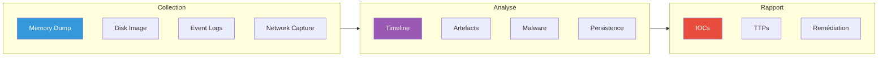
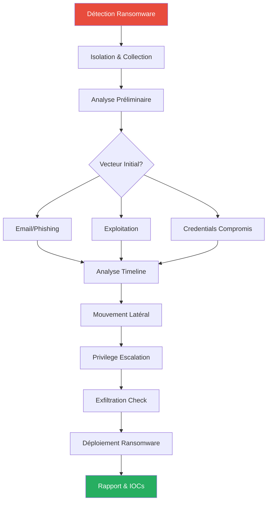

---
tags:
  - formation
  - security
  - windows
  - forensics
  - dfir
  - blue-team
  - incident-response
---

# Forensics Windows & DFIR

Cette annexe couvre les techniques d'investigation forensique Windows, essentielles pour comprendre ce que les défenseurs recherchent et comment les attaques sont détectées.

!!! info "Perspective Purple Team"
    Comprendre le forensics aide à :

    - **Red Team** : Savoir ce qui laisse des traces et adapter son OpSec
    - **Blue Team** : Détecter et investiguer les compromissions
    - **Purple Team** : Valider que les détections fonctionnent

---

## Vue d'Ensemble - Investigation Timeline



---

## 1. Acquisition de Preuves

### 1.1 Dump Mémoire

La mémoire contient les credentials, processus, connexions réseau et malware en cours d'exécution.

**Avec WinPMEM (recommandé) :**

```powershell
# Acquisition mémoire physique
winpmem_mini_x64.exe memory.raw

# Avec compression
winpmem_mini_x64.exe --format raw -o memory.raw
```

**Avec DumpIt :**

```powershell
# Simple et rapide
DumpIt.exe /O memory.raw /N /Q
```

**Avec Magnet RAM Capture :**

```powershell
# Interface graphique, idéal pour non-techniciens
MagnetRAMCapture.exe
```

### 1.2 Image Disque

```powershell
# Avec FTK Imager CLI
ftkimager.exe \\.\PhysicalDrive0 E:\case001\disk --e01 --compress 6

# Avec dd (via Cygwin ou WSL)
dd if=/dev/sda of=/mnt/evidence/disk.raw bs=64K conv=noerror,sync

# Hash de vérification
Get-FileHash -Algorithm SHA256 disk.raw
```

### 1.3 Triage Rapide (Live Response)

**KAPE (Kroll Artifact Parser and Extractor) :**

```powershell
# Collecter les artefacts essentiels
kape.exe --tsource C: --tdest E:\case001\triage --target !SANS_Triage

# Modules de parsing inclus
kape.exe --msource E:\case001\triage --mdest E:\case001\parsed --module !EZParser
```

**Velociraptor (Agent-based) :**

```powershell
# Déployer l'agent
velociraptor.exe --config client.config.yaml client

# Collecter via GUI ou CLI
velociraptor.exe query "SELECT * FROM Artifact.Windows.System.Pslist()"
```

---

## 2. Analyse Mémoire

### 2.1 Volatility 3

```bash
# Identifier le profil (automatique en Vol3)
python3 vol.py -f memory.raw windows.info

# Liste des processus
python3 vol.py -f memory.raw windows.pslist
python3 vol.py -f memory.raw windows.pstree  # Vue arborescente

# Processus cachés (malware)
python3 vol.py -f memory.raw windows.psscan

# Connexions réseau
python3 vol.py -f memory.raw windows.netstat
python3 vol.py -f memory.raw windows.netscan

# DLLs chargées
python3 vol.py -f memory.raw windows.dlllist --pid 1234

# Handles (fichiers, registry, etc.)
python3 vol.py -f memory.raw windows.handles --pid 1234

# Dump d'un processus
python3 vol.py -f memory.raw windows.memmap --pid 1234 --dump
```

### 2.2 Extraction de Credentials

```bash
# Hashes depuis le dump mémoire
python3 vol.py -f memory.raw windows.hashdump

# Secrets LSA
python3 vol.py -f memory.raw windows.lsadump

# Tickets Kerberos en mémoire
python3 vol.py -f memory.raw windows.cachedump
```

### 2.3 Détection de Code Injection

```bash
# Majestic (détection injection)
python3 vol.py -f memory.raw windows.malfind

# Analyse des VADs (Virtual Address Descriptors)
python3 vol.py -f memory.raw windows.vadinfo --pid 1234

# Détecter les hooks
python3 vol.py -f memory.raw windows.ssdt
```

### 2.4 Indicateurs de Compromission

| Indicateur | Signification |
|------------|---------------|
| Processus avec PID bas suspect | Possible rootkit ou process hollowing |
| PPID incohérent | Ex: Word parent de PowerShell = suspect |
| Processus sans chemin | Exécution en mémoire uniquement |
| Connexions sortantes inhabituelles | C2 potentiel |
| DLLs non signées dans LSASS | Credential stealing probable |

---

## 3. Analyse Event Logs

### 3.1 Logs Critiques pour la Sécurité

| Event Log | Chemin | Contenu |
|-----------|--------|---------|
| **Security** | Security.evtx | Authentification, accès objets |
| **System** | System.evtx | Services, drivers |
| **PowerShell** | PowerShellOperational.evtx | Exécution de scripts |
| **Sysmon** | Microsoft-Windows-Sysmon | Processus, réseau, fichiers |
| **WMI** | WMI-Activity | Persistence WMI |
| **TaskScheduler** | TaskScheduler | Tâches planifiées |

### 3.2 Event IDs Essentiels

**Authentification :**

| Event ID | Description | Intérêt |
|----------|-------------|---------|
| 4624 | Logon réussi | Type de logon, compte, source |
| 4625 | Logon échoué | Brute force, password spray |
| 4648 | Logon avec credentials explicites | RunAs, lateral movement |
| 4672 | Privilèges spéciaux | Connexion admin |
| 4768 | TGT demandé | AS-REP Roasting si pré-auth disabled |
| 4769 | TGS demandé | Kerberoasting (RC4 encryption) |
| 4771 | Pré-auth Kerberos échouée | Password spray Kerberos |

**Exécution :**

| Event ID | Source | Description |
|----------|--------|-------------|
| 4688 | Security | Création de processus (avec command line si activé) |
| 1 | Sysmon | Process create avec hash, PPID, user |
| 7 | Sysmon | Image loaded (DLL) |
| 4104 | PowerShell | Script block logging |
| 4103 | PowerShell | Module logging |

**Persistence & Lateral Movement :**

| Event ID | Source | Description |
|----------|--------|-------------|
| 7045 | System | Service installé |
| 13 | Sysmon | Registry value set |
| 3 | Sysmon | Network connection |
| 5140 | Security | Share accessed |
| 5145 | Security | Share object accessed |

### 3.3 Analyse avec PowerShell

```powershell
# Rechercher les logons suspects (Type 10 = RDP, Type 3 = Network)
Get-WinEvent -FilterHashtable @{
    LogName = 'Security'
    ID = 4624
} | Where-Object {
    $_.Properties[8].Value -in @(3, 10)
} | Select-Object TimeCreated,
    @{N='Account';E={$_.Properties[5].Value}},
    @{N='Source';E={$_.Properties[18].Value}},
    @{N='LogonType';E={$_.Properties[8].Value}}

# Détecter Kerberoasting (TGS avec RC4)
Get-WinEvent -FilterHashtable @{
    LogName = 'Security'
    ID = 4769
} | Where-Object {
    $_.Properties[5].Value -eq '0x17'  # RC4
} | Select-Object TimeCreated,
    @{N='ServiceName';E={$_.Properties[0].Value}},
    @{N='Account';E={$_.Properties[6].Value}}

# PowerShell suspect (EncodedCommand, -ep bypass, etc.)
Get-WinEvent -FilterHashtable @{
    LogName = 'Microsoft-Windows-PowerShell/Operational'
    ID = 4104
} | Where-Object {
    $_.Message -match 'encodedcommand|bypass|downloadstring|iex|invoke-expression'
}
```

### 3.4 Analyse avec Chainsaw

```bash
# Recherche rapide de TTPs connues
chainsaw hunt ./logs/ -s sigma_rules/ --mapping mapping.yml

# Recherche spécifique
chainsaw search ./logs/ -e "mimikatz"
chainsaw search ./logs/ -e "powershell" -t 'Event.System.EventID: 4104'

# Timeline des événements
chainsaw dump ./logs/ --format csv > timeline.csv
```

---

## 4. Artefacts Filesystem

### 4.1 Prefetch

Historique des exécutions (30 jours par défaut).

```powershell
# Emplacement
C:\Windows\Prefetch\*.pf

# Parser avec PECmd
PECmd.exe -d C:\Windows\Prefetch --csv E:\case001\prefetch

# Informations extraites:
# - Nom de l'exécutable
# - Nombre d'exécutions
# - Dernière exécution
# - Fichiers/DLLs chargés
```

### 4.2 Shimcache (AppCompatCache)

Historique des exécutables (pas d'horodatage d'exécution fiable).

```powershell
# Parser avec AppCompatCacheParser
AppCompatCacheParser.exe -f SYSTEM --csv E:\case001\shimcache

# Registre source
HKLM\SYSTEM\CurrentControlSet\Control\Session Manager\AppCompatCache
```

### 4.3 Amcache

Historique des installations et exécutions avec hashes SHA1.

```powershell
# Emplacement
C:\Windows\appcompat\Programs\Amcache.hve

# Parser
AmcacheParser.exe -f Amcache.hve --csv E:\case001\amcache

# Informations:
# - Chemin complet
# - Hash SHA1
# - Date de modification
# - Éditeur (si signé)
```

### 4.4 SRUM (System Resource Usage Monitor)

Historique d'utilisation réseau et ressources par application.

```powershell
# Emplacement
C:\Windows\System32\sru\SRUDB.dat

# Parser avec SrumECmd
SrumECmd.exe -f SRUDB.dat -r SOFTWARE --csv E:\case001\srum

# Données disponibles:
# - Bytes envoyés/reçus par application
# - Temps d'exécution
# - Utilisateur associé
```

### 4.5 Browser Artifacts

```powershell
# Historique, cookies, cache
# Chrome
%LOCALAPPDATA%\Google\Chrome\User Data\Default\History
%LOCALAPPDATA%\Google\Chrome\User Data\Default\Cookies

# Edge
%LOCALAPPDATA%\Microsoft\Edge\User Data\Default\History

# Firefox
%APPDATA%\Mozilla\Firefox\Profiles\*.default\places.sqlite

# Parser avec BrowsingHistoryView ou Hindsight
hindsight.exe -i "%LOCALAPPDATA%\Google\Chrome\User Data" -o E:\case001\browser
```

### 4.6 $MFT et $UsnJrnl

```powershell
# Extraire la MFT
# Avec KAPE ou RawCopy
RawCopy.exe /FileNamePath:C:0 /OutputPath:E:\case001\

# Parser la MFT
MFTECmd.exe -f '$MFT' --csv E:\case001\mft

# USN Journal (historique des modifications)
MFTECmd.exe -f '$J' --csv E:\case001\usn
```

---

## 5. Analyse Registry

### 5.1 Hives Principales

| Hive | Emplacement | Contenu |
|------|-------------|---------|
| SAM | C:\Windows\System32\config\SAM | Comptes locaux |
| SECURITY | C:\Windows\System32\config\SECURITY | Politiques, secrets LSA |
| SOFTWARE | C:\Windows\System32\config\SOFTWARE | Applications installées |
| SYSTEM | C:\Windows\System32\config\SYSTEM | Services, drivers |
| NTUSER.DAT | C:\Users\*\NTUSER.DAT | Profil utilisateur |
| UsrClass.dat | C:\Users\*\AppData\Local\...\UsrClass.dat | ShellBags, MRU |

### 5.2 Clés de Persistence

```powershell
# Parser avec RECmd
RECmd.exe -d C:\Windows\System32\config --bn BatchExamples\Kroll_Batch.reb --csv E:\case001\registry

# Clés de persistence critiques:
# HKLM\SOFTWARE\Microsoft\Windows\CurrentVersion\Run
# HKCU\SOFTWARE\Microsoft\Windows\CurrentVersion\Run
# HKLM\SOFTWARE\Microsoft\Windows\CurrentVersion\RunOnce
# HKLM\SYSTEM\CurrentControlSet\Services
# HKLM\SOFTWARE\Microsoft\Windows NT\CurrentVersion\Winlogon\Shell
# HKLM\SOFTWARE\Microsoft\Windows NT\CurrentVersion\Image File Execution Options
```

### 5.3 Artefacts Utilisateur

**RecentDocs (fichiers récents) :**

```
HKCU\SOFTWARE\Microsoft\Windows\CurrentVersion\Explorer\RecentDocs
```

**TypedPaths (chemins tapés dans Explorer) :**

```
HKCU\SOFTWARE\Microsoft\Windows\CurrentVersion\Explorer\TypedPaths
```

**UserAssist (programmes exécutés via GUI) :**

```
HKCU\SOFTWARE\Microsoft\Windows\CurrentVersion\Explorer\UserAssist
# Encodé en ROT13
```

**ShellBags (dossiers accédés) :**

```
HKCU\SOFTWARE\Microsoft\Windows\Shell\BagMRU
HKCU\SOFTWARE\Microsoft\Windows\Shell\Bags
```

---

## 6. Timeline Analysis

### 6.1 Création avec Plaso

```bash
# Créer le timeline depuis une image
log2timeline.py timeline.plaso disk.E01

# Filtrer et exporter
psort.py -o l2tcsv timeline.plaso "date > '2024-01-01'" > timeline.csv
```

### 6.2 Création avec MFTECmd + Timeline Explorer

```powershell
# Combiner les sources
MFTECmd.exe -f '$MFT' --csv E:\case001\timeline --csvf mft.csv
PECmd.exe -d Prefetch --csv E:\case001\timeline --csvf prefetch.csv
# etc.

# Ouvrir avec Timeline Explorer (EZ Tools)
# Permet le tri, filtrage, colorisation
```

### 6.3 Points Clés d'une Timeline

```
[TEMPS - 2h]     Phishing email reçu
[TEMPS - 1h55m]  Document ouvert (Prefetch, Office MRU)
[TEMPS - 1h50m]  PowerShell exécuté (Prefetch, EventLog 4688)
[TEMPS - 1h45m]  Beacon C2 établi (Sysmon EventID 3)
[TEMPS - 1h30m]  Mouvement latéral (EventLog 4624 Type 3)
[TEMPS - 1h]     Privilege escalation (EventLog 4672)
[TEMPS - 30m]    DCSync (EventLog 4662, DRSUAPI)
[TEMPS]          Exfiltration détectée (NetFlow, Proxy logs)
```

---

## 7. Outils Forensics

### 7.1 Suite EZ Tools (Eric Zimmerman)

| Outil | Usage |
|-------|-------|
| **MFTECmd** | Parser MFT et USN Journal |
| **PECmd** | Parser Prefetch |
| **RECmd** | Parser Registry |
| **LECmd** | Parser LNK files |
| **JLECmd** | Parser Jump Lists |
| **SBECmd** | Parser ShellBags |
| **AmcacheParser** | Parser Amcache |
| **AppCompatCacheParser** | Parser Shimcache |
| **SrumECmd** | Parser SRUM |
| **Timeline Explorer** | Visualisation timeline |

### 7.2 Arsenal Image Mounter

```powershell
# Monter une image forensique en lecture seule
aim_cli.exe --mount --readonly E:\evidence\disk.E01

# Le disque apparaît comme un volume Windows
# Accès direct aux fichiers sans altération
```

### 7.3 Autopsy

```
# Interface graphique complète
# Modules d'analyse:
# - Timeline Analysis
# - Keyword Search
# - Hash Lookup
# - File Carving
# - Web Artifacts
```

---

## 8. Anti-Forensics Awareness

### 8.1 Techniques Courantes (pour les reconnaître)

| Technique | Artefacts Affectés | Détection |
|-----------|-------------------|-----------|
| **Timestomping** | Timestamps $MFT | Comparer $MFT vs $STDINFO |
| **Log Clearing** | Event Logs | Event ID 1102/104, gaps dans timeline |
| **Secure Delete** | Fichiers | Entries MFT avec taille 0, USN Journal |
| **Memory Only** | Disk artifacts | Analyse mémoire, absence de Prefetch |
| **Prefetch Disable** | Prefetch | Registry check, comportement anormal |

### 8.2 Indicateurs de Nettoyage

```powershell
# Event ID 1102 - Security log cleared
Get-WinEvent -FilterHashtable @{LogName='Security'; ID=1102}

# Event ID 104 - System log cleared
Get-WinEvent -FilterHashtable @{LogName='System'; ID=104}

# Vérifier si Prefetch est désactivé
Get-ItemProperty "HKLM:\SYSTEM\CurrentControlSet\Control\Session Manager\Memory Management\PrefetchParameters"
# EnablePrefetcher = 0 = suspect

# Vérifier USN Journal
fsutil usn queryjournal C:
# Si "Usn Journal ID" différent du boot = possible recreation
```

---

## 9. Cas Pratique - Investigation Ransomware

### 9.1 Scénario

Ransomware détecté. Objectifs :
1. Identifier le vecteur d'entrée initial
2. Tracer le mouvement latéral
3. Identifier l'exfiltration (si applicable)
4. Établir la timeline complète

### 9.2 Méthodologie



### 9.3 Commandes Clés

```powershell
# 1. Identifier le patient zero (premier système infecté)
# Chercher le fichier ransomware le plus ancien
Get-ChildItem -Recurse -Filter "*.encrypted" | Sort-Object CreationTime | Select-Object -First 1

# 2. Examiner les événements autour de cette date
$timestamp = "2024-01-15T14:30:00"
Get-WinEvent -FilterHashtable @{
    LogName = 'Security','System','Application'
    StartTime = [DateTime]$timestamp.AddHours(-2)
    EndTime = [DateTime]$timestamp.AddHours(2)
} | Export-Csv timeline_incident.csv

# 3. Rechercher les IOCs connus
# Hash du ransomware
Get-FileHash -Algorithm SHA256 suspicious.exe

# 4. Vérifier les connexions C2
Get-WinEvent -FilterHashtable @{
    LogName = 'Microsoft-Windows-Sysmon/Operational'
    ID = 3
} | Where-Object {
    $_.Properties[14].Value -notmatch 'internal_range'
}
```

---

## 10. Ressources & Formation

### 10.1 Certifications

| Certification | Focus |
|--------------|-------|
| **GCFE** (GIAC) | Windows Forensics |
| **GCFA** (GIAC) | Advanced Forensics & IR |
| **EnCE** | EnCase Certified Examiner |
| **CHFI** (EC-Council) | Computer Hacking Forensic Investigator |

### 10.2 Labs Pratiques

- [CyberDefenders](https://cyberdefenders.org/) - Blue Team challenges
- [DFIR.Training](https://dfir.training/) - Ressources et samples
- [Malware Traffic Analysis](https://malware-traffic-analysis.net/) - PCAP samples
- [MemLabs](https://github.com/stuxnet999/MemLabs) - Memory forensics challenges

### 10.3 Références

- [SANS DFIR Cheatsheets](https://digital-forensics.sans.org/community/cheat-sheets)
- [13Cubed YouTube](https://www.youtube.com/c/13Cubed) - DFIR tutorials
- [AboutDFIR](https://aboutdfir.com/) - Communauté DFIR

---

[Retour au Programme](index.md){ .md-button }
[Module 05 - Post-Exploitation →](05-module.md){ .md-button .md-button--primary }
