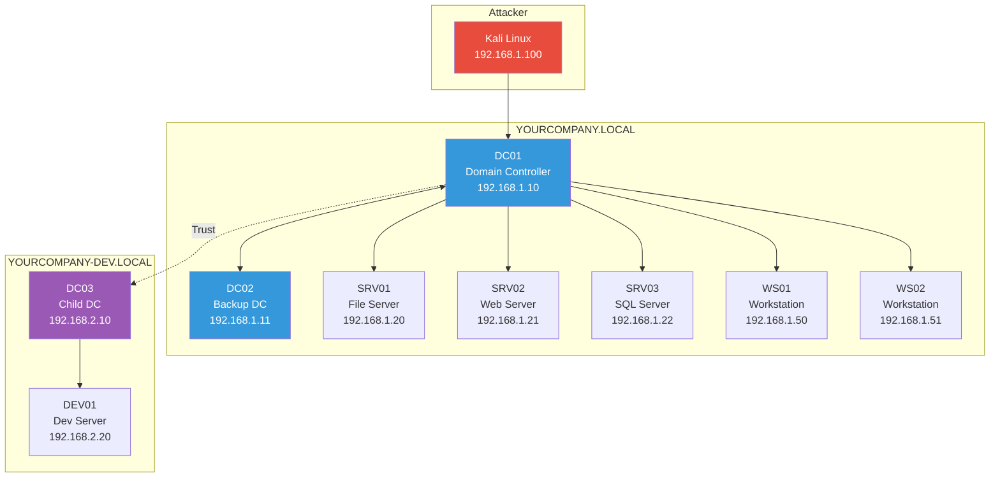
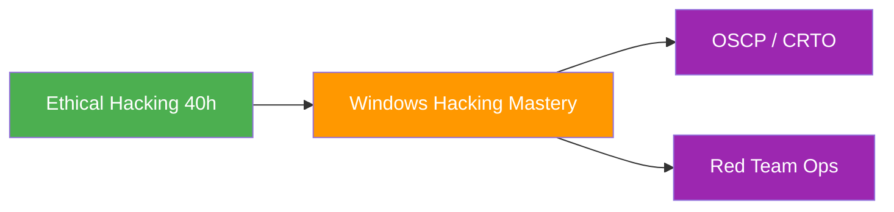

---
tags:
  - formation
  - security
  - windows
  - hacking
  - active-directory
  - privilege-escalation
  - red-team
  - pentest
---

# Formation Windows Hacking Mastery (35-40h)

> *"To beat a hacker, you have to think like one."* - EC-Council

Cette formation intensive vous plonge au coeur de l'offensive security Windows et Active Directory. De la reconnaissance initiale à la compromission complète d'un domaine, vous maîtriserez les techniques utilisées par les pentesters professionnels et les red teamers.

## Objectifs Pédagogiques

À l'issue de cette formation, vous serez capable de :

- Configurer un environnement de lab Active Directory vulnérable pour la pratique
- Énumérer et cartographier un environnement Windows/AD avec et sans credentials
- Exploiter les faiblesses de configuration Kerberos (Kerberoasting, AS-REP Roasting, Delegation)
- Réaliser des attaques de credential harvesting (LLMNR Poisoning, SMB Relay)
- Effectuer une escalade de privilèges locale sur Windows
- Compromettre un domaine Active Directory jusqu'à Domain Admin
- Établir des mécanismes de persistence et pivoter dans le réseau
- Contourner les défenses (AMSI, Defender, ETW)
- Rédiger un rapport d'audit professionnel

## Public & Prérequis

| Critère | Description |
|---------|-------------|
| **Public cible** | Pentesters, Red Teamers, Analystes SOC, Administrateurs Sécurité |
| **Niveau** | Intermédiaire à Avancé |
| **Prérequis techniques** | Bases Linux/Windows, notions réseau TCP/IP, familiarité avec la ligne de commande |
| **Prérequis formations** | [Ethical Hacking (40h)](../hacking-mastery/index.md) recommandé |
| **Matériel requis** | PC avec 32 Go RAM, 200 Go SSD, virtualisation activée |

## Architecture du Lab

---

## Programme Détaillé

### [Module 1 : Setup & Environnement Lab](01-module.md) (5.5h)

Mise en place de l'infrastructure d'attaque et du lab vulnérable.

* **Cadre légal** : Articles du Code Pénal, Rules of Engagement, périmètre d'audit
* **Architecture lab** : Design réseau, machines virtuelles, snapshots
* **Déploiement automatisé** : Scripts Vagrant/Terraform pour AD lab
* **Vulnérabilités intentionnelles** : Configuration DVAD, misconfigurations courantes
* **Outillage** : Kali Linux, Commando VM, outils Windows natifs
* **Méthodologie** : Kill Chain, MITRE ATT&CK for Enterprise

---

### [Module 2 : Reconnaissance & Énumération](02-module.md) (6.5h)

Cartographie complète de l'environnement cible.

* **Reconnaissance externe** : OSINT, DNS enumeration, Certificate Transparency
* **Découverte réseau** : Nmap, masscan, ARP scanning
* **Énumération SMB/NetBIOS** : enum4linux-ng, smbclient, CrackMapExec
* **Énumération LDAP** : ldapsearch, windapsearch, requêtes anonymes
* **Énumération authentifiée** : BloodHound, PowerView, ADRecon
* **Analyse des chemins d'attaque** : BloodHound queries, shortest paths to DA

---

### [Module 3 : Compromission Active Directory](03-module.md) (7.5h)

Techniques d'initial access et de compromission du domaine.

* **Initial Access** :
    - LLMNR/NBT-NS Poisoning avec Responder
    - SMB Relay attacks avec ntlmrelayx
    - Password Spraying avec CrackMapExec

* **Credential Harvesting** :
    - Kerberoasting (GetUserSPNs, Rubeus)
    - AS-REP Roasting (GetNPUsers)
    - Cracking offline (Hashcat, John)

* **Kerberos Attacks** :
    - Pass-the-Hash / Pass-the-Ticket
    - Overpass-the-Hash (Pass-the-Key)
    - Silver Ticket forgery

* **Delegation Attacks** :
    - Unconstrained Delegation exploitation
    - Constrained Delegation abuse
    - Resource-Based Constrained Delegation (RBCD)

* **Domain Trust Exploitation** :
    - Trust enumeration et mapping
    - SID History injection
    - Cross-forest attacks

---

### [Module 4 : Escalade de Privilèges](04-module.md) (6.5h)

Élévation de privilèges locale et dans le domaine.

* **Énumération locale** : WinPEAS, PowerUp, Seatbelt, services vulnérables
* **Exploitation services** : Unquoted paths, weak permissions, DLL Hijacking
* **Token Manipulation** : Incognito, Potato attacks (Juicy, Print, God)
* **Credential Access** : SAM dump, LSASS, cached credentials
* **UAC Bypass** : fodhelper, eventvwr, UACME framework
* **Domain PrivEsc** : DCSync, ADCS (ESC1-ESC8), GPO abuse

---

### [Module 5 : Post-Exploitation & Persistence](05-module.md) (6.5h)

Maintien d'accès et mouvement latéral.

* **Credential Dumping** : Mimikatz avancé, DPAPI, NTDS.dit extraction
* **Ticket Forgery** : Golden Ticket, Silver Ticket, Diamond Ticket
* **Persistence** : Registry, Scheduled Tasks, WMI Subscriptions
* **Domain Persistence** : AdminSDHolder, DSRM, Skeleton Key, Custom SSP
* **Lateral Movement** : PsExec, WMI, WinRM, DCOM, RDP Hijacking
* **Defense Evasion** : AMSI bypass, ETW patching, LOLBins

---

### [Module 6 : Projet Final - Red Team Assessment](06-tp-final.md) (6h)

Audit complet en conditions réalistes avec livrable professionnel.

* **Scénario** : Audit Red Team d'une entreprise multi-domaines
* **Objectifs** : Compromission complète, exfiltration de données sensibles
* **Contraintes** : Évasion des défenses, OpSec strict
* **Livrables** : Rapport exécutif + technique, preuves, recommandations

---

## Ressources de la Formation

### Guides & Méthodologies

| Ressource | Description |
|-----------|-------------|
| [Kill Chain Infographie](kill-chain.md) | Visualisation de la chaîne d'attaque |
| [Méthodologie OSCP](methodologie-oscp.md) | Guide de préparation OSCP |
| [Templates Rapports](templates-rapports.md) | Modèles de rapports professionnels |
| [Certifications](certifications.md) | Préparation OSCP, CRTP, OSEP, CRTE |
| [Interview Prep](interview-prep.md) | Questions d'entretien Pentest |

### Labs & Outils

| Ressource | Description |
|-----------|-------------|
| [Labs Interactifs](labs-interactifs.md) | Exercices guidés pas à pas |
| [Vagrant Lab Automatisé](vagrant-lab.md) | Scripts de déploiement du lab |
| [Quick Reference Cards](quick-reference.md) | Fiches de référence imprimables |
| [Troubleshooting](troubleshooting.md) | Solutions aux erreurs courantes |

### Techniques Avancées

| Ressource | Description |
|-----------|-------------|
| [Wi-Fi & Accès Physique](physical-wifi.md) | Attaques réseau sans fil et physiques |
| [Pivoting & Tunneling](pivoting-tunneling.md) | SSH, Chisel, Ligolo-ng |
| [Password Cracking](password-cracking.md) | Hashcat, John, stratégies |
| [Windows Internals](windows-internals.md) | Architecture sécurité Windows |
| [OPSEC & Tradecraft](opsec-tradecraft.md) | Sécurité opérationnelle Red Team |

### Défense & Analyse

| Ressource | Description |
|-----------|-------------|
| [AD Hardening](ad-hardening.md) | Guide Blue Team durcissement AD |
| [Detection Engineering](detection-engineering.md) | Règles Sigma, requêtes SIEM |
| [Forensics & DFIR](forensics-dfir.md) | Analyse mémoire et disque |
| [Case Studies](case-studies.md) | SolarWinds, NotPetya, Ryuk, ProxyLogon |

### Références

| Ressource | Description |
|-----------|-------------|
| [Community & Resources](community-resources.md) | Discord, YouTube, livres, blogs |
| [Glossaire](glossaire.md) | Définitions des termes techniques |
| [Cheatsheet Outils](cheatsheet-tools.md) | Commandes essentielles par outil |

---

## Parcours Recommandé

---

## Certifications Préparées

Cette formation prépare aux certifications suivantes :

| Certification | Organisme | Niveau |
|---------------|-----------|--------|
| OSCP | Offensive Security | Intermédiaire |
| CRTO | Zero-Point Security | Avancé |
| PNPT | TCM Security | Intermédiaire |
| eCPPT | eLearnSecurity | Intermédiaire |

---

## Ressources Complémentaires

- [HackTricks - Windows Hardening](https://book.hacktricks.xyz/windows-hardening/)
- [PayloadsAllTheThings - AD Attacks](https://github.com/swisskyrepo/PayloadsAllTheThings/blob/master/Methodology%20and%20Resources/Active%20Directory%20Attack.md)
- [The Hacker Recipes](https://www.thehacker.recipes/)
- [ired.team](https://www.ired.team/)
- [DVAD - Damn Vulnerable AD](https://github.com/WazeHell/vulnerable-AD)

---

[Commencer le Module 1 :octicons-arrow-right-24:](01-module.md){ .md-button .md-button--primary }
