---
tags:
  - formation
  - security
  - windows
  - hacking
  - kill-chain
  - infographie
---

# Kill Chain Windows AD - Infographie

Cette page présente visuellement les différentes phases d'une attaque Active Directory, de la reconnaissance initiale à la compromission totale du domaine.

---

## Vue d'Ensemble

---

## Kill Chain Détaillée

### Phase 1 : Reconnaissance

```mermaid
flowchart LR
    subgraph external["External Recon"]
        E1[🌐 OSINT<br/>LinkedIn, Site web]
        E2[📜 DNS Enum<br/>Sous-domaines, MX]
        E3[🔐 Cert Transparency<br/>crt.sh]
    end

    subgraph network["Network Recon"]
        N1[🔍 Host Discovery<br/>Nmap, ARP]
        N2[🚪 Port Scanning<br/>88, 389, 445]
        N3[🖥️ DC Identification<br/>Kerberos, LDAP]
    end

    subgraph enum["AD Enumeration"]
        A1[📂 SMB Shares<br/>enum4linux, CME]
        A2[👥 LDAP Users<br/>ldapsearch]
        A3[🗺️ BloodHound<br/>Attack Paths]
    end

    external --> network --> enum

    style external fill:#3498db,color:#fff
    style network fill:#2980b9,color:#fff
    style enum fill:#1a5276,color:#fff
```

**Outils :** Nmap, CrackMapExec, BloodHound, ldapsearch, enum4linux-ng

**Objectif :** Cartographier l'environnement, identifier les chemins d'attaque

---

### Phase 2 : Initial Access

**Outils :** Responder, ntlmrelayx, Kerbrute, CrackMapExec, Hashcat

**Objectif :** Obtenir un premier accès authentifié au domaine

---

### Phase 3 : Privilege Escalation

```mermaid
flowchart TB
    subgraph kerberos["Kerberos Attacks"]
        K1[🎟️ Kerberoasting<br/>GetUserSPNs]
        K2[🎫 AS-REP Roasting<br/>GetNPUsers]
        K3[🔄 Delegation Abuse<br/>Unconstrained, RBCD]
    end

    subgraph local["Local PrivEsc"]
        L1[🔧 Service Exploit<br/>Unquoted paths]
        L2[🥔 Potato Attacks<br/>PrintSpoofer]
        L3[🛡️ UAC Bypass<br/>fodhelper]
    end

    subgraph domain["Domain PrivEsc"]
        D1[📜 ADCS Abuse<br/>ESC1-ESC8]
        D2[📋 GPO Abuse<br/>SharpGPOAbuse]
        D3[🔗 ACL Abuse<br/>GenericAll, WriteDacl]
    end

    kerberos --> PRIV[👑 Privileged Access]
    local --> PRIV
    domain --> PRIV

    style kerberos fill:#f39c12,color:#fff
    style local fill:#e67e22,color:#fff
    style domain fill:#d35400,color:#fff
```

**Outils :** Rubeus, Impacket, Certipy, WinPEAS, PowerUp, BloodHound

**Objectif :** Élever les privilèges vers Domain Admin

---

### Phase 4 : Domain Compromise

```mermaid
flowchart TB
    subgraph extraction["Credential Extraction"]
        EX1[🔐 DCSync<br/>secretsdump]
        EX2[💾 NTDS.dit<br/>Volume Shadow Copy]
        EX3[🧠 LSASS Dump<br/>Mimikatz]
    end

    subgraph tickets["Ticket Forgery"]
        T1[🥇 Golden Ticket<br/>krbtgt hash]
        T2[🥈 Silver Ticket<br/>Service hash]
        T3[💎 Diamond Ticket<br/>Legitimate + Modified]
    end

    subgraph control["Domain Control"]
        C1[👑 Domain Admin]
        C2[🏢 Enterprise Admin]
        C3[🌐 Forest Compromise]
    end

    extraction --> tickets
    tickets --> control

    style extraction fill:#9b59b6,color:#fff
    style tickets fill:#8e44ad,color:#fff
    style control fill:#6c3483,color:#fff
```

**Outils :** Mimikatz, secretsdump, ticketer

**Objectif :** Contrôle total du domaine, extraction de tous les secrets

---

### Phase 5 : Post-Exploitation

```mermaid
flowchart TB
    subgraph persistence["🔒 Persistence"]
        P1[📋 Scheduled Tasks]
        P2[📝 Registry Keys]
        P3[⚡ WMI Subscriptions]
        P4[🛡️ AdminSDHolder]
        P5[💀 Skeleton Key]
    end

    subgraph lateral["↔️ Lateral Movement"]
        L1[🖥️ PsExec / WMIExec]
        L2[🌐 WinRM / Evil-WinRM]
        L3[🔌 DCOM Abuse]
        L4[🖱️ RDP Hijacking]
    end

    subgraph evasion["🥷 Defense Evasion"]
        E1[🛡️ AMSI Bypass]
        E2[📊 ETW Patching]
        E3[🔧 LOLBins]
        E4[🚫 Defender Exclusions]
    end

    persistence --> CONTROL[🎯 Persistent Access]
    lateral --> CONTROL
    evasion --> CONTROL

    style persistence fill:#1abc9c,color:#fff
    style lateral fill:#16a085,color:#fff
    style evasion fill:#0e6655,color:#fff
```

**Outils :** Mimikatz, schtasks, Evil-WinRM, PsExec

**Objectif :** Maintenir l'accès, pivoter, éviter la détection

---

## Chemins d'Attaque Courants

### Chemin 1 : LLMNR → Kerberoast → DCSync

```mermaid
flowchart LR
    A[🔊 LLMNR Poison] -->|Hash NTLMv2| B[⚡ Crack Hash]
    B -->|User creds| C[🎟️ Kerberoast]
    C -->|SVC Hash| D[⚡ Crack SVC]
    D -->|SVC is DA| E[🔐 DCSync]
    E --> F[👑 Domain Admin]

    style A fill:#e74c3c,color:#fff
    style F fill:#9b59b6,color:#fff
```

### Chemin 2 : Password Spray → ADCS → Domain Admin

### Chemin 3 : Delegation → Golden Ticket

```mermaid
flowchart LR
    A[🖥️ Unconstrained<br/>Delegation] -->|Printer Bug| B[🎫 DC TGT Captured]
    B -->|Inject ticket| C[🔐 DCSync]
    C -->|krbtgt hash| D[🥇 Golden Ticket]
    D --> E[♾️ Persistent DA]

    style A fill:#e74c3c,color:#fff
    style E fill:#9b59b6,color:#fff
```

---

## Matrice MITRE ATT&CK

| Phase | Tactic | Techniques |
|-------|--------|------------|
| Reconnaissance | TA0043 | T1595, T1592, T1589 |
| Initial Access | TA0001 | T1557.001, T1110.003 |
| Execution | TA0002 | T1059.001, T1047 |
| Persistence | TA0003 | T1053, T1547, T1098 |
| Privilege Escalation | TA0004 | T1558, T1068, T1134 |
| Defense Evasion | TA0005 | T1562, T1070, T1036 |
| Credential Access | TA0006 | T1003, T1558, T1552 |
| Lateral Movement | TA0008 | T1021, T1550, T1563 |
| Collection | TA0009 | T1005, T1039 |
| Exfiltration | TA0010 | T1041, T1048 |

---

## Temps Moyen par Phase

```mermaid
gantt
    title Timeline d'une Attaque AD Typique
    dateFormat HH:mm
    axisFormat %H:%M

    section Recon
    OSINT & DNS           :a1, 00:00, 1h
    Network Scan          :a2, after a1, 30m
    BloodHound            :a3, after a2, 30m

    section Initial Access
    LLMNR/Spray           :b1, after a3, 1h
    Crack Hashes          :b2, after b1, 30m

    section PrivEsc
    Kerberoast            :c1, after b2, 30m
    Crack SVC Hash        :c2, after c1, 1h

    section Domain
    DCSync                :d1, after c2, 15m
    Golden Ticket         :d2, after d1, 15m

    section Post-Exp
    Persistence           :e1, after d2, 30m
    Lateral Movement      :e2, after e1, 1h
```

**Temps total estimé :** 6-8 heures pour un domaine mal sécurisé

---

## Quick Reference - Commandes Clés

| Phase | Commande |
|-------|----------|
| **Recon** | `bloodhound-python -d domain -u user -p pass -c All` |
| **LLMNR** | `sudo responder -I eth0 -dwv` |
| **Spray** | `kerbrute passwordspray -d domain users.txt 'Pass123'` |
| **Kerberoast** | `GetUserSPNs.py domain/user:pass -request` |
| **AS-REP** | `GetNPUsers.py domain/ -usersfile users.txt` |
| **DCSync** | `secretsdump.py domain/admin:pass@dc` |
| **Golden** | `ticketer.py -nthash HASH -domain-sid SID domain admin` |
| **PtH** | `psexec.py domain/admin@target -hashes :HASH` |

---

[Retour au Programme](index.md){ .md-button }
