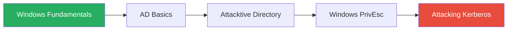
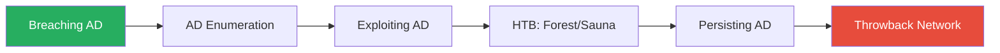

---
tags:
  - formation
  - security
  - windows
  - hacking
  - labs
  - practice
  - tryhackme
  - hackthebox
---

# Labs Interactifs - Pratique Windows AD

Cette page référence les meilleurs labs en ligne pour pratiquer les techniques couvertes dans la formation. Classés par module et difficulté.

---

## Plateformes Recommandées

| Plateforme | Type | Prix | Idéal pour |
|------------|------|------|------------|
| [TryHackMe](https://tryhackme.com) | Guidé | Gratuit/Premium ($14/mois) | Débutants, apprentissage structuré |
| [HackTheBox](https://hackthebox.com) | CTF-style | Gratuit/VIP ($14/mois) | Intermédiaires, challenges réalistes |
| [Proving Grounds](https://portal.offsec.com) | OSCP-like | $19/mois | Préparation certifications |
| [PentesterLab](https://pentesterlab.com) | Web focus | $20/mois | Web + AD combinés |

---

## Module 1 : Setup & Environnement

### Labs de découverte AD

| Lab | Plateforme | Difficulté | Description |
|-----|------------|------------|-------------|
| [Active Directory Basics](https://tryhackme.com/room/activedirectorybasics) | THM | Facile | Concepts fondamentaux AD |
| [Attacktive Directory](https://tryhackme.com/room/attacktivedirectory) | THM | Moyen | Premier lab AD complet |
| [Windows Fundamentals 1-3](https://tryhackme.com/room/windowsfundamentals1xbx) | THM | Facile | Bases Windows |

---

## Module 2 : Reconnaissance & Enumération

### Énumération AD

| Lab | Plateforme | Difficulté | Techniques couvertes |
|-----|------------|------------|----------------------|
| [Enumerating Active Directory](https://tryhackme.com/room/adenumeration) | THM | Moyen | LDAP, BloodHound, PowerView |
| [Post-Exploitation Basics](https://tryhackme.com/room/postexploit) | THM | Moyen | Énumération post-compromise |
| [Forest](https://app.hackthebox.com/machines/Forest) | HTB | Facile | AS-REP, BloodHound, DCSync |
| [Sauna](https://app.hackthebox.com/machines/Sauna) | HTB | Facile | Énumération LDAP, Kerberos |

### BloodHound Practice

| Lab | Plateforme | Difficulté | Focus |
|-----|------------|------------|-------|
| [Holo](https://tryhackme.com/room/hololive) | THM | Difficile | BloodHound paths complets |
| [Throwback](https://tryhackme.com/network/throwback) | THM | Difficile | Network AD multi-machines |

---

## Module 3 : Compromission Active Directory

### LLMNR/SMB Relay

| Lab | Plateforme | Difficulté | Techniques |
|-----|------------|------------|------------|
| [Breaching Active Directory](https://tryhackme.com/room/breachingad) | THM | Moyen | LLMNR, Password Spray, NTLM Relay |
| [Responder](https://tryhackme.com/room/dvwa10) | THM | Moyen | Responder poisoning |

### Kerberos Attacks

| Lab | Plateforme | Difficulté | Techniques |
|-----|------------|------------|------------|
| [Attacking Kerberos](https://tryhackme.com/room/attackingkerberos) | THM | Moyen | Kerberoast, AS-REP, Pass-the-Ticket |
| [Active](https://app.hackthebox.com/machines/Active) | HTB | Facile | Kerberoasting, GPP |
| [Resolute](https://app.hackthebox.com/machines/Resolute) | HTB | Moyen | Password spray, DnsAdmins |
| [Monteverde](https://app.hackthebox.com/machines/Monteverde) | HTB | Moyen | Azure AD Connect |

### Delegation Attacks

| Lab | Plateforme | Difficulté | Techniques |
|-----|------------|------------|------------|
| [Enterprise](https://app.hackthebox.com/machines/Enterprise) | HTB | Moyen | Unconstrained Delegation |
| [Intelligence](https://app.hackthebox.com/machines/Intelligence) | HTB | Moyen | Constrained Delegation, RBCD |
| [Exploiting AD](https://tryhackme.com/room/exploitingad) | THM | Difficile | Delegation, ADCS, Trusts |

### Azure AD / Hybrid

| Lab | Plateforme | Difficulté | Techniques |
|-----|------------|------------|------------|
| [Azure AD](https://tryhackme.com/room/dvwa10) | THM | Moyen | Azure énumération |
| [Hybrid AD](https://tryhackme.com/room/dvwa10) | THM | Difficile | AAD Connect, PTA |

---

## Module 4 : Privilege Escalation

### Local PrivEsc Windows

| Lab | Plateforme | Difficulté | Techniques |
|-----|------------|------------|------------|
| [Windows PrivEsc](https://tryhackme.com/room/windows10privesc) | THM | Moyen | Services, Registry, Tokens |
| [Windows PrivEsc Arena](https://tryhackme.com/room/windowsprivescarena) | THM | Moyen | Multiple vectors |
| [Bastard](https://app.hackthebox.com/machines/Bastard) | HTB | Moyen | Potato, JuicyPotato |
| [Jeeves](https://app.hackthebox.com/machines/Jeeves) | HTB | Moyen | Token Impersonation |
| [Optimum](https://app.hackthebox.com/machines/Optimum) | HTB | Facile | Basic Windows PrivEsc |

### ADCS Exploitation

| Lab | Plateforme | Difficulté | Techniques |
|-----|------------|------------|------------|
| [Certified](https://app.hackthebox.com/machines/Certified) | HTB | Moyen | ESC1, ESC4 |
| [Manager](https://app.hackthebox.com/machines/Manager) | HTB | Moyen | ADCS ESC7 |
| [Escape](https://app.hackthebox.com/machines/Escape) | HTB | Moyen | ADCS exploitation |

### SCCM

| Lab | Plateforme | Difficulté | Techniques |
|-----|------------|------------|------------|
| [YOURCOMPANY](https://portal.offsec.com) | PG | Difficile | SCCM takeover |
| Aucun lab public gratuit actuellement | - | - | Monter son propre lab |

---

## Module 5 : Post-Exploitation & Persistence

### Credential Dumping

| Lab | Plateforme | Difficulté | Techniques |
|-----|------------|------------|------------|
| [Post-Exploitation Basics](https://tryhackme.com/room/dvwa10) | THM | Moyen | Mimikatz, LSASS |
| [Credential Access](https://tryhackme.com/room/dvwa10) | THM | Moyen | SAM, LSA, DPAPI |
| [Blackfield](https://app.hackthebox.com/machines/Blackfield) | HTB | Difficile | LSASS dump, DCSync |

### Golden/Silver Tickets

| Lab | Plateforme | Difficulté | Techniques |
|-----|------------|------------|------------|
| [Persisting AD](https://tryhackme.com/room/dvwa10) | THM | Difficile | Golden Ticket, AdminSDHolder |
| [Forest](https://app.hackthebox.com/machines/Forest) | HTB | Facile | DCSync → Golden Ticket |

### Lateral Movement

| Lab | Plateforme | Difficulté | Techniques |
|-----|------------|------------|------------|
| [Lateral Movement](https://tryhackme.com/room/dvwa10) | THM | Moyen | WMI, PSExec, WinRM |
| [Reel](https://app.hackthebox.com/machines/Reel) | HTB | Difficile | Phishing, Lateral Mov |

### C2 Frameworks

| Lab | Plateforme | Difficulté | Techniques |
|-----|------------|------------|------------|
| [Wreath](https://tryhackme.com/room/wreath) | THM | Difficile | Multi-network, pivoting, C2 |
| [RA](https://tryhackme.com/room/dvwa10) | THM | Difficile | Full Red Team op |

---

## Module 6 : Projet Final - Labs Complets

### Networks/Pro Labs

| Lab | Plateforme | Difficulté | Description |
|-----|------------|------------|-------------|
| [Throwback](https://tryhackme.com/network/throwback) | THM | Difficile | AD Network complet (7 machines) |
| [Holo](https://tryhackme.com/room/hololive) | THM | Difficile | Corporate network simulation |
| [Dante](https://app.hackthebox.com/prolabs/dante) | HTB Pro Lab | Très Difficile | Multi-domain environment |
| [RastaLabs](https://app.hackthebox.com/prolabs/rastalabs) | HTB Pro Lab | Très Difficile | Red Team simulation |
| [Offshore](https://app.hackthebox.com/prolabs/offshore) | HTB Pro Lab | Expert | Full AD forest |
| [Cybernetics](https://app.hackthebox.com/prolabs/cybernetics) | HTB Pro Lab | Expert | Enterprise network |

### Proving Grounds (OSCP Prep)

| Lab | Difficulté | Techniques principales |
|-----|------------|------------------------|
| Hutch | Facile | Basic AD exploitation |
| Heist | Moyen | Kerberoast, PrivEsc |
| Resourced | Moyen | RBCD, GenericAll |
| Access | Difficile | Multi-path AD |

---

## Parcours Recommandés

### Débutant (2-3 semaines)

1. Windows Fundamentals 1-3 (THM)
2. Active Directory Basics (THM)
3. Attacktive Directory (THM)
4. Windows PrivEsc (THM)
5. Attacking Kerberos (THM)

### Intermédiaire (4-6 semaines)

1. Breaching Active Directory (THM)
2. Enumerating Active Directory (THM)
3. Exploiting Active Directory (THM)
4. HackTheBox: Forest, Sauna, Active
5. Persisting Active Directory (THM)
6. Throwback Network (THM)

### Avancé / OSCP Prep (2-3 mois)

1. Tous les labs THM AD
2. 20+ machines HTB Windows/AD
3. Pro Lab: Dante ou RastaLabs
4. 10+ machines Proving Grounds
5. Projet personnel: monter son propre lab vulnérable

---

## Ressources Complémentaires

### Writeups & Walkthroughs

| Ressource | Description |
|-----------|-------------|
| [0xdf Blog](https://0xdf.gitlab.io/) | Writeups HTB détaillés |
| [IppSec YouTube](https://www.youtube.com/c/ippsec) | Vidéos walkthrough HTB |
| [HackTricks](https://book.hacktricks.xyz/) | Bible du pentester |
| [The Hacker Recipes](https://www.thehacker.recipes/) | Focus AD |

### Practice Platforms Alternatives

| Plateforme | Focus |
|------------|-------|
| [VulnHub](https://www.vulnhub.com/) | VMs téléchargeables gratuites |
| [CyberDefenders](https://cyberdefenders.org/) | Blue Team / DFIR |
| [LetsDefend](https://letsdefend.io/) | SOC Analyst training |
| [PicoCTF](https://picoctf.org/) | CTF éducatif |

### Lab Personnel

Pour monter votre propre lab, référez-vous à :

- [Vagrant Lab Automatisé](vagrant-lab.md) - Notre script Vagrant
- [DVAD](https://github.com/WazeHell/vulnerable-AD) - Damn Vulnerable AD
- [GOAD](https://github.com/Orange-Cyberdefense/GOAD) - Game of Active Directory
- [DetectionLab](https://github.com/clong/DetectionLab) - Lab avec SIEM

---

## Checklist de Progression

### Niveau 1 : Fondations
- [ ] Comprendre la structure AD (OUs, Groups, GPOs)
- [ ] Maîtriser l'énumération LDAP/SMB
- [ ] Utiliser BloodHound pour mapper un domaine
- [ ] Réussir 5 machines THM AD

### Niveau 2 : Exploitation
- [ ] Réaliser une attaque LLMNR → crack → shell
- [ ] Exécuter un Kerberoasting complet
- [ ] Exploiter une delegation (Unconstrained/RBCD)
- [ ] Obtenir Domain Admin sur 10 machines HTB

### Niveau 3 : Post-Exploitation
- [ ] Créer un Golden Ticket fonctionnel
- [ ] Établir une persistence AdminSDHolder
- [ ] Maîtriser Mimikatz/secretsdump
- [ ] Compléter un Pro Lab HTB

### Niveau 4 : Red Team Ready
- [ ] Compromettre un environnement multi-domaines
- [ ] Utiliser un C2 framework (Sliver/Havoc)
- [ ] Évader les détections (AMSI, ETW)
- [ ] Rédiger un rapport professionnel complet

---

[Retour au Programme](index.md){ .md-button }
[Vagrant Lab →](vagrant-lab.md){ .md-button .md-button--primary }
