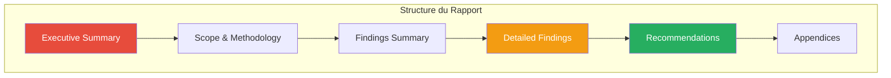

---
tags:
  - formation
  - security
  - windows
  - hacking
  - reporting
  - pentest
  - templates
---

# Templates de Rapports Pentest

La rédaction d'un rapport professionnel est aussi importante que les compétences techniques. Cette annexe fournit des templates et bonnes pratiques pour documenter vos tests d'intrusion.

---

## Structure d'un Rapport Professionnel



| Section | Audience | Longueur |
|---------|----------|----------|
| Executive Summary | Direction, RSSI | 1-2 pages |
| Scope & Methodology | Technique & Management | 2-3 pages |
| Findings Summary | Management | 1-2 pages |
| Detailed Findings | Équipe technique | Variable |
| Recommendations | Technique & Management | 2-5 pages |
| Appendices | Technique | Variable |

---

## 1. Executive Summary

!!! tip "Objectif"
    Résumer en 1-2 pages les résultats clés pour un public non-technique (direction, RSSI).

### Template

```markdown
# Executive Summary

## Contexte
[ENTREPRISE] a mandaté [PENTESTER/SOCIÉTÉ] pour réaliser un test d'intrusion
de type [Black Box/Grey Box/White Box] sur son infrastructure Active Directory
du [DATE_DÉBUT] au [DATE_FIN].

## Objectifs
- Évaluer la sécurité du domaine Active Directory
- Identifier les chemins d'attaque vers les comptes privilégiés
- Tester la résistance aux attaques courantes (Kerberoasting, relay, etc.)

## Résultats Clés

| Métrique | Valeur |
|----------|--------|
| Vulnérabilités Critiques | X |
| Vulnérabilités Hautes | X |
| Vulnérabilités Moyennes | X |
| Vulnérabilités Basses | X |
| Temps pour Domain Admin | X heures |

## Conclusion
[ÉVALUATION GLOBALE : Critique/Élevé/Moyen/Faible]

L'environnement Active Directory présente [RÉSUMÉ]. Les principales faiblesses
identifiées concernent [POINTS CLÉS]. Une compromission complète du domaine
a été possible en [DURÉE] via [CHEMIN D'ATTAQUE PRINCIPAL].

## Recommandations Prioritaires
1. [RECOMMANDATION CRITIQUE 1]
2. [RECOMMANDATION CRITIQUE 2]
3. [RECOMMANDATION HAUTE 1]
```

### Exemple Rédigé

```markdown
# Executive Summary

## Contexte
ACME Corporation a mandaté SecurTest pour réaliser un test d'intrusion
de type Grey Box sur son infrastructure Active Directory du 15 au 19 janvier 2024.

## Objectifs
- Évaluer la sécurité du domaine ACME.LOCAL
- Identifier les chemins d'attaque vers Domain Admin
- Tester la résistance aux attaques Kerberos et NTLM

## Résultats Clés

| Métrique | Valeur |
|----------|--------|
| Vulnérabilités Critiques | 3 |
| Vulnérabilités Hautes | 7 |
| Vulnérabilités Moyennes | 12 |
| Vulnérabilités Basses | 5 |
| Temps pour Domain Admin | 4 heures |

## Conclusion
**Niveau de risque global : CRITIQUE**

L'environnement Active Directory présente des faiblesses significatives permettant
une compromission rapide. Les principales faiblesses concernent la politique de
mots de passe, les comptes de service Kerberoastables, et l'absence de segmentation
réseau. Une compromission complète du domaine a été réalisée en 4 heures via
Kerberoasting d'un compte de service Domain Admin.

## Recommandations Prioritaires
1. Migrer immédiatement les comptes de service vers gMSA
2. Implémenter une politique de mots de passe renforcée (15+ caractères)
3. Désactiver LLMNR et NBT-NS sur l'ensemble du parc
```

---

## 2. Scope & Methodology

### Template

```markdown
# Périmètre et Méthodologie

## Périmètre

### Inclus
| Type | Détails |
|------|---------|
| Domaine | [DOMAIN.LOCAL] |
| Plage IP | [X.X.X.0/24] |
| Serveurs | DC01, DC02, SRV01, ... |
| Postes | WS01-WS50 |

### Exclus
- [SYSTÈME/SERVICE EXCLU]
- Attaques par déni de service
- Ingénierie sociale (sauf si autorisé)

## Type de Test
- [ ] Black Box (aucune information)
- [x] Grey Box (credentials utilisateur standard)
- [ ] White Box (accès complet documentation/code)

## Credentials Fournis
| Compte | Type | Objectif |
|--------|------|----------|
| jsmith@domain.local | Utilisateur standard | Simulation insider |

## Méthodologie


### Phase 1 : Reconnaissance (Jour 1)
- Scan de ports (Nmap)
- Identification des services AD
- Énumération DNS

### Phase 2 : Énumération (Jour 1-2)
- Énumération LDAP/SMB
- Collecte BloodHound
- Identification des chemins d'attaque

### Phase 3 : Exploitation (Jour 2-3)
- Attaques credentials (Kerberoast, spray)
- Exploitation des vulnérabilités identifiées
- Escalade de privilèges

### Phase 4 : Post-Exploitation (Jour 3-4)
- Mouvement latéral
- Persistence (démonstration uniquement)
- Extraction de preuves

### Phase 5 : Reporting (Jour 4-5)
- Documentation des findings
- Rédaction du rapport
- Préparation des recommandations

## Outils Utilisés
| Catégorie | Outils |
|-----------|--------|
| Reconnaissance | Nmap, Masscan |
| Énumération | BloodHound, CrackMapExec, ldapsearch |
| Exploitation | Impacket, Rubeus, Mimikatz |
| Post-Exploitation | Evil-WinRM, PSExec |

## Limitations
- Test réalisé pendant les heures ouvrées uniquement
- Aucun accès physique aux locaux
- Pas de test des sauvegardes
```

---

## 3. Findings - Format Standard

### Criticité

| Niveau | Score CVSS | Description |
|--------|------------|-------------|
| **Critique** | 9.0 - 10.0 | Compromission immédiate, impact majeur |
| **Haute** | 7.0 - 8.9 | Exploitation facile, impact significatif |
| **Moyenne** | 4.0 - 6.9 | Exploitation possible, impact modéré |
| **Basse** | 0.1 - 3.9 | Difficile à exploiter, impact limité |
| **Info** | N/A | Observation, bonne pratique |

### Template Finding

```markdown
## [VULN-001] Titre de la Vulnérabilité

| Attribut | Valeur |
|----------|--------|
| **Criticité** | Critique / Haute / Moyenne / Basse |
| **CVSS** | X.X |
| **Systèmes Affectés** | [LISTE] |
| **Catégorie** | Configuration / Credential / Architecture |

### Description
[Description claire et concise de la vulnérabilité]

### Impact
[Conséquences potentielles de l'exploitation]

### Preuve de Concept
```bash
# Commande utilisée
[COMMANDE]

# Résultat
[OUTPUT]
```

### Recommandation
[Actions correctives détaillées]

### Références
- [LIEN MITRE ATT&CK]
- [LIEN DOCUMENTATION]
```

### Exemple : Kerberoasting

```markdown
## [VULN-001] Comptes de Service Kerberoastables

| Attribut | Valeur |
|----------|--------|
| **Criticité** | Critique |
| **CVSS** | 9.1 |
| **Systèmes Affectés** | svc_backup, svc_sql, svc_admin |
| **Catégorie** | Credential Management |

### Description
Trois comptes de service possèdent des Service Principal Names (SPN) et utilisent
des mots de passe faibles, permettant une attaque Kerberoasting. Cette attaque
permet à tout utilisateur authentifié de demander un ticket de service (TGS)
chiffré avec le hash du compte, puis de le cracker offline.

### Impact
- Compromission des comptes de service
- `svc_admin` est membre du groupe Domain Admins
- Compromission totale du domaine possible

### Preuve de Concept
```bash
# Extraction des tickets Kerberoastables
$ GetUserSPNs.py acme.local/jsmith:'Password1' -dc-ip 10.10.10.10 -request

ServicePrincipalName    Name        MemberOf
----------------------  ----------  --------
MSSQLSvc/sql01:1433     svc_sql
HTTP/web01              svc_backup
CIFS/fs01               svc_admin   Domain Admins

# Cracking avec Hashcat
$ hashcat -m 13100 hashes.txt rockyou.txt
svc_admin:Summer2023!
```

**Temps de crack : 3 minutes**

### Recommandation
1. **Immédiat** : Changer les mots de passe des comptes affectés (25+ caractères)
2. **Court terme** : Migrer vers des Group Managed Service Accounts (gMSA)
3. **Long terme** : Implémenter une politique interdisant les SPN sur les comptes utilisateurs

### Références
- MITRE ATT&CK: T1558.003 - Kerberoasting
- Microsoft: [Managed Service Accounts](https://docs.microsoft.com/en-us/windows-server/security/group-managed-service-accounts/group-managed-service-accounts-overview)
```

---

## 4. Tableau Récapitulatif des Findings

```markdown
# Synthèse des Vulnérabilités

| ID | Titre | Criticité | CVSS | Statut |
|----|-------|-----------|------|--------|
| VULN-001 | Comptes Kerberoastables | Critique | 9.1 | Exploité |
| VULN-002 | LLMNR/NBT-NS Activé | Haute | 7.5 | Exploité |
| VULN-003 | SMB Signing Désactivé | Haute | 7.5 | Confirmé |
| VULN-004 | Politique MDP Faible | Haute | 7.0 | Confirmé |
| VULN-005 | AS-REP Roastable Users | Moyenne | 6.5 | Exploité |
| VULN-006 | Partages Ouverts | Moyenne | 5.5 | Confirmé |
| VULN-007 | Credentials en Clair | Moyenne | 5.0 | Trouvé |
| VULN-008 | Comptes Inactifs | Basse | 3.5 | Confirmé |

## Répartition par Criticité

```
Critique  ███░░░░░░░  1 (12%)
Haute     ███████░░░  3 (38%)
Moyenne   ███████░░░  3 (38%)
Basse     █░░░░░░░░░  1 (12%)
```

## Matrice de Risque

|            | Impact Faible | Impact Moyen | Impact Élevé |
|------------|---------------|--------------|--------------|
| **Facile** | VULN-008      | VULN-005,006 | VULN-001,002 |
| **Moyen**  |               | VULN-007     | VULN-003     |
| **Difficile** |            |              | VULN-004     |
```

---

## 5. Chronologie d'Attaque (Kill Chain)

```markdown
# Chronologie de l'Attaque

```mermaid
gantt
    title Kill Chain - Test ACME.LOCAL
    dateFormat HH:mm
    axisFormat %H:%M

    section Jour 1
    Reconnaissance     :a1, 09:00, 2h
    Énumération SMB    :a2, after a1, 1h
    BloodHound         :a3, after a2, 1h

    section Jour 2
    Kerberoasting      :b1, 09:00, 30m
    Crack svc_admin    :b2, after b1, 15m
    Domain Admin       :b3, after b2, 15m
    DCSync             :b4, after b3, 30m
```



## Timeline Détaillée

| Heure | Action | Résultat |
|-------|--------|----------|
| 09:00 | Scan Nmap initial | 15 hôtes identifiés |
| 09:30 | Énumération SMB | Partages accessibles trouvés |
| 10:15 | Collecte BloodHound | 3 chemins vers DA identifiés |
| 11:00 | Analyse BloodHound | svc_admin = Kerberoastable + DA |
| 14:00 | Kerberoasting | Hash svc_admin extrait |
| 14:15 | Hashcat crack | Mot de passe obtenu: Summer2023! |
| 14:30 | Test credentials | Accès DA confirmé |
| 15:00 | DCSync | Tous les hashes extraits |
| 15:30 | Golden Ticket (PoC) | Persistence démontrée |

## Chemin d'Attaque Principal

```
jsmith (user standard)
    │
    ▼ [Kerberoasting]
svc_admin (service account)
    │
    ▼ [Member of Domain Admins]
Domain Admin
    │
    ▼ [DCSync]
Tous les hashes du domaine
    │
    ▼ [Golden Ticket]
Persistence totale
```
```

---

## 6. Recommandations

### Template

```markdown
# Plan de Remédiation

## Priorité Critique (0-7 jours)

### REC-001 : Migration vers gMSA
| Attribut | Détail |
|----------|--------|
| Vulnérabilité | VULN-001 |
| Effort | Moyen |
| Impact Business | Faible |

**Actions :**
1. Identifier tous les comptes de service avec SPN
2. Créer les gMSA correspondants
3. Migrer les services un par un
4. Supprimer les anciens comptes

**Vérification :**
```powershell
# Aucun compte utilisateur avec SPN (hors krbtgt)
Get-ADUser -Filter {ServicePrincipalName -ne "$null"} -Properties ServicePrincipalName
```

---

## Priorité Haute (7-30 jours)

### REC-002 : Désactiver LLMNR/NBT-NS
| Attribut | Détail |
|----------|--------|
| Vulnérabilité | VULN-002 |
| Effort | Faible |
| Impact Business | Nul |

**Actions :**
1. Créer une GPO "Disable LLMNR"
2. Computer Configuration > Administrative Templates > Network > DNS Client
3. "Turn off multicast name resolution" = Enabled
4. Désactiver NetBIOS via DHCP ou interface

**Vérification :**
```powershell
# LLMNR désactivé
Get-ItemProperty "HKLM:\SOFTWARE\Policies\Microsoft\Windows NT\DNSClient" -Name EnableMulticast
# Doit retourner 0
```

---

## Priorité Moyenne (30-90 jours)

### REC-003 : Renforcer la Politique de Mots de Passe
...

---

## Priorité Basse (90+ jours)

### REC-004 : Audit des Comptes Inactifs
...
```

---

## 7. Appendices

### A. Preuves (Screenshots)

```markdown
# Appendice A : Captures d'Écran

## A.1 BloodHound - Chemin vers Domain Admin

*Figure A.1 : Chemin identifié via BloodHound depuis jsmith vers Domain Admins*

## A.2 Kerberoasting - Extraction du Hash

*Figure A.2 : Extraction du hash TGS pour svc_admin*

## A.3 Accès Domain Admin

*Figure A.3 : Preuve d'accès Domain Admin (whoami /groups)*
```

### B. Commandes Exécutées

```markdown
# Appendice B : Log des Commandes

## Reconnaissance
```bash
nmap -sC -sV -oA nmap/initial 10.10.10.0/24
```

## Énumération
```bash
crackmapexec smb 10.10.10.10 -u 'jsmith' -p 'Password1' --shares
bloodhound-python -d acme.local -u jsmith -p 'Password1' -dc dc01.acme.local -c All
```

## Exploitation
```bash
GetUserSPNs.py acme.local/jsmith:'Password1' -dc-ip 10.10.10.10 -request -outputfile kerberoast.txt
hashcat -m 13100 kerberoast.txt /usr/share/wordlists/rockyou.txt
```

## Post-Exploitation
```bash
secretsdump.py acme.local/svc_admin:'Summer2023!'@10.10.10.10 -just-dc
```
```

### C. Hashes/Credentials (Chiffré)

```markdown
# Appendice C : Données Sensibles

⚠️ **CONFIDENTIEL** - Ce document contient des credentials actifs

Les données suivantes sont fournies dans un fichier séparé chiffré.
Mot de passe de déchiffrement transmis par canal sécurisé.

Fichier : `credentials_acme_2024.zip.gpg`

## Contenu
- Hashes NTLM extraits via DCSync
- Credentials crackés
- Tickets Kerberos exportés (pour démonstration)
```

---

## 8. Checklist Qualité Rapport

### Avant Soumission

- [ ] **Orthographe/Grammaire** vérifiée
- [ ] **Screenshots** anonymisés si nécessaire
- [ ] **IPs/Noms** cohérents dans tout le document
- [ ] **CVSS** scores calculés correctement
- [ ] **Recommandations** actionnables et spécifiques
- [ ] **Executive Summary** compréhensible par non-technique
- [ ] **Preuves** suffisantes pour chaque finding
- [ ] **Classification** du document indiquée
- [ ] **Dates** correctes (période de test)
- [ ] **Version** du document indiquée

### Format

- [ ] Table des matières générée
- [ ] Numérotation des pages
- [ ] En-tête avec logo client/prestataire
- [ ] Pied de page avec classification
- [ ] PDF protégé par mot de passe (si requis)

---

## Outils de Reporting

| Outil | Description |
|-------|-------------|
| **Ghostwriter** | Plateforme de reporting collaborative |
| **Pwndoc** | Générateur de rapports pentest |
| **Dradis** | Framework de documentation |
| **Serpico** | Reporting open-source |
| **PlexTrac** | Plateforme commerciale |

---

[Retour au Programme](index.md){ .md-button }
[Méthodologie OSCP →](methodologie-oscp.md){ .md-button .md-button--primary }
