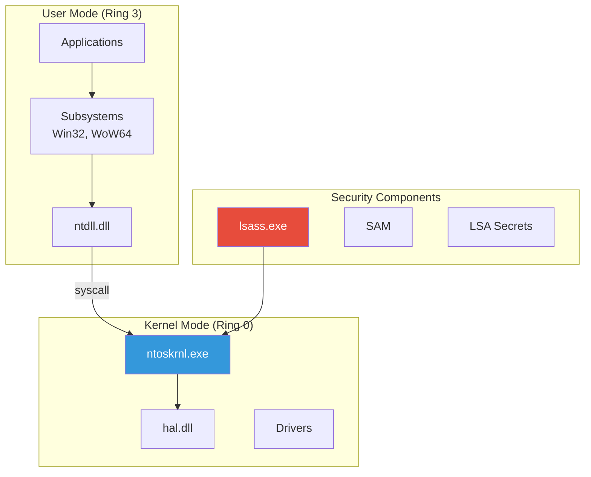
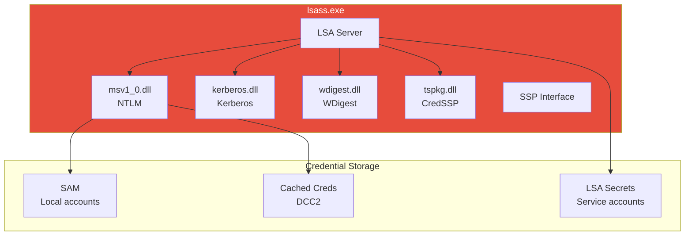

---
tags:
  - formation
  - security
  - windows
  - internals
  - tokens
  - processes
  - architecture
---

# Windows Internals - Security Reference

Cette référence couvre les concepts fondamentaux de l'architecture de sécurité Windows, essentiels pour comprendre les techniques offensives et défensives.

---

## Vue d'Ensemble - Architecture Sécurité



---

## 1. Processus & Threads

### 1.1 Structure d'un Processus

```
┌─────────────────────────────────────────────────────────────┐
│                        PROCESS                               │
├─────────────────────────────────────────────────────────────┤
│  PID (Process ID)                                           │
│  PPID (Parent Process ID)                                   │
│  Token (Security Context)                                    │
│  Virtual Address Space                                       │
│  Handle Table                                                │
│  PEB (Process Environment Block)                            │
├─────────────────────────────────────────────────────────────┤
│  Threads:                                                    │
│  ├── Thread 1 (TID, TEB, Stack, Context)                   │
│  ├── Thread 2                                               │
│  └── Thread N                                               │
└─────────────────────────────────────────────────────────────┘
```

### 1.2 Structures Kernel

```c
// EPROCESS - Structure kernel d'un processus
typedef struct _EPROCESS {
    KPROCESS Pcb;                    // Process Control Block
    EX_PUSH_LOCK ProcessLock;
    LARGE_INTEGER CreateTime;
    LARGE_INTEGER ExitTime;
    EX_RUNDOWN_REF RundownProtect;
    HANDLE UniqueProcessId;          // PID
    LIST_ENTRY ActiveProcessLinks;   // Liste des processus
    // ...
    PVOID Token;                     // Access Token
    // ...
} EPROCESS, *PEPROCESS;

// ETHREAD - Structure kernel d'un thread
typedef struct _ETHREAD {
    KTHREAD Tcb;                     // Thread Control Block
    LARGE_INTEGER CreateTime;
    LARGE_INTEGER ExitTime;
    LIST_ENTRY ThreadListEntry;
    CLIENT_ID Cid;                   // Process ID + Thread ID
    // ...
} ETHREAD, *PETHREAD;
```

### 1.3 PEB (Process Environment Block)

```c
// Structure accessible depuis user mode
typedef struct _PEB {
    BOOLEAN InheritedAddressSpace;
    BOOLEAN ReadImageFileExecOptions;
    BOOLEAN BeingDebugged;           // Utilisé pour anti-debug
    // ...
    PPEB_LDR_DATA Ldr;               // Liste des DLLs chargées
    PRTL_USER_PROCESS_PARAMETERS ProcessParameters;
    // ...
} PEB, *PPEB;

// Accès au PEB
// x64: gs:[0x60]
// x86: fs:[0x30]
```

```powershell
# Lister les processus avec leur PEB
Get-Process | ForEach-Object {
    $proc = $_
    $modules = $proc.Modules | Select-Object -First 3 -ExpandProperty ModuleName
    [PSCustomObject]@{
        PID = $proc.Id
        Name = $proc.Name
        Path = $proc.Path
        Modules = $modules -join ", "
    }
}
```

### 1.4 Intégrité des Processus

| Niveau | Valeur | Description |
|--------|--------|-------------|
| **Untrusted** | 0x0000 | Processus sandboxé (Chrome) |
| **Low** | 0x1000 | Navigateur, IE Protected Mode |
| **Medium** | 0x2000 | Utilisateur standard |
| **High** | 0x3000 | Administrateur élevé |
| **System** | 0x4000 | Services SYSTEM |
| **Protected** | 0x5000 | Processus protégés (AV) |

```powershell
# Vérifier le niveau d'intégrité
whoami /groups | findstr "Label"

# Via PowerShell
Get-Process -Id $PID | Select-Object Name, Id, @{N='Integrity';E={
    $token = (Get-Process -Id $_.Id).Handle
    # Requiert P/Invoke pour GetTokenInformation
}}
```

---

## 2. Tokens & Privileges

### 2.1 Access Token Structure

```
┌─────────────────────────────────────────────────────────────┐
│                     ACCESS TOKEN                             │
├─────────────────────────────────────────────────────────────┤
│  User SID          : S-1-5-21-...-1001                      │
│  Group SIDs        : [Administrators, Users, ...]          │
│  Privileges        : [SeDebugPrivilege, SeBackupPrivilege] │
│  Owner SID         : S-1-5-21-...-1001                      │
│  Primary Group     : S-1-5-21-...-513                       │
│  Default DACL      : (permissions par défaut)               │
│  Token Type        : Primary / Impersonation                │
│  Impersonation Lvl : Anonymous/Identify/Impersonate/Delegate│
│  Integrity Level   : Medium                                  │
└─────────────────────────────────────────────────────────────┘
```

### 2.2 Privileges Intéressants

| Privilege | Usage Offensif |
|-----------|----------------|
| **SeDebugPrivilege** | Accès à tous les processus (LSASS dump) |
| **SeImpersonatePrivilege** | Potato attacks → SYSTEM |
| **SeAssignPrimaryTokenPrivilege** | Créer processus avec autre token |
| **SeBackupPrivilege** | Lire n'importe quel fichier (SAM, NTDS) |
| **SeRestorePrivilege** | Écrire n'importe quel fichier |
| **SeTakeOwnershipPrivilege** | Prendre possession de fichiers |
| **SeLoadDriverPrivilege** | Charger des drivers (rootkit) |
| **SeTcbPrivilege** | Agir comme partie du système (rare) |

```powershell
# Lister ses privileges
whoami /priv

# Activer un privilege (si disponible mais désactivé)
# Requiert code C# ou outil comme PowerSploit
[System.Reflection.Assembly]::LoadWithPartialName('System.Runtime.InteropServices')
# AdjustTokenPrivileges via P/Invoke
```

### 2.3 Token Types

```
PRIMARY TOKEN
├── Associé à un processus
├── Créé au logon
└── Définit le contexte de sécurité du processus

IMPERSONATION TOKEN
├── Associé à un thread
├── Permet d'agir comme un autre utilisateur
├── Niveaux:
│   ├── Anonymous      : Aucune info
│   ├── Identification : Peut identifier, pas agir
│   ├── Impersonation  : Peut agir localement
│   └── Delegation     : Peut agir sur le réseau
└── Créé via ImpersonateLoggedOnUser, etc.
```

### 2.4 Token Manipulation

```c
// Techniques d'abus de token

// 1. Token Stealing
OpenProcess(PROCESS_QUERY_INFORMATION, FALSE, targetPID);
OpenProcessToken(hProcess, TOKEN_DUPLICATE, &hToken);
DuplicateTokenEx(hToken, MAXIMUM_ALLOWED, NULL, SecurityImpersonation, TokenPrimary, &hNewToken);
CreateProcessWithTokenW(hNewToken, LOGON_WITH_PROFILE, ...);

// 2. Token Impersonation (SeImpersonatePrivilege requis)
ImpersonateLoggedOnUser(hToken);
// Thread agit maintenant comme l'utilisateur du token

// 3. Make Token (credentials requis)
LogonUser("user", "DOMAIN", "password", LOGON32_LOGON_NEW_CREDENTIALS, ...);
```

---

## 3. Security Descriptors & ACLs

### 3.1 Structure du Security Descriptor

```
┌─────────────────────────────────────────────────────────────┐
│                  SECURITY_DESCRIPTOR                         │
├─────────────────────────────────────────────────────────────┤
│  Owner SID      : S-1-5-21-...-500 (Administrateur)         │
│  Group SID      : S-1-5-21-...-513 (Domain Users)           │
│  DACL           : Discretionary Access Control List          │
│  SACL           : System Access Control List (Audit)         │
│  Control Flags  : SE_DACL_PRESENT, SE_SACL_PRESENT, ...     │
└─────────────────────────────────────────────────────────────┘
```

### 3.2 DACL (Discretionary ACL)

```
DACL = Liste d'ACE (Access Control Entries)

┌─────────────────────────────────────────────────────────────┐
│  ACE 1: ALLOW | Administrators | Full Control               │
│  ACE 2: ALLOW | SYSTEM         | Full Control               │
│  ACE 3: ALLOW | Users          | Read, Execute              │
│  ACE 4: DENY  | Guest          | All Access                 │
└─────────────────────────────────────────────────────────────┘

Ordre d'évaluation:
1. Explicit Deny
2. Explicit Allow
3. Inherited Deny
4. Inherited Allow
5. Pas de match = Deny implicite
```

### 3.3 Permissions Communes

| Permission | Valeur | Description |
|------------|--------|-------------|
| READ_CONTROL | 0x20000 | Lire le SD |
| WRITE_DAC | 0x40000 | Modifier la DACL |
| WRITE_OWNER | 0x80000 | Changer le propriétaire |
| DELETE | 0x10000 | Supprimer l'objet |
| GENERIC_READ | 0x80000000 | Lecture générique |
| GENERIC_WRITE | 0x40000000 | Écriture générique |
| GENERIC_EXECUTE | 0x20000000 | Exécution générique |
| GENERIC_ALL | 0x10000000 | Tous les droits |

### 3.4 Vérifier les Permissions

```powershell
# Permissions sur un fichier
Get-Acl C:\Windows\System32\config\SAM | Format-List

# Permissions sur un objet AD
Import-Module ActiveDirectory
(Get-Acl "AD:CN=AdminSDHolder,CN=System,DC=corp,DC=local").Access

# Permissions sur un service
sc sdshow [service_name]
# Décoder le SDDL
ConvertFrom-SddlString "D:(A;;CCLCSWRPWPDTLOCRRC;;;SY)..."

# Trouver les permissions faibles
accesschk.exe -uwcqv "Users" *
```

---

## 4. Logon Types & Sessions

### 4.1 Types de Logon

| Type | Valeur | Description | Credentials en mémoire |
|------|--------|-------------|----------------------|
| **Interactive** | 2 | Console locale | Oui (NTLM, Kerberos) |
| **Network** | 3 | SMB, WinRM | Non (pas en cache) |
| **Batch** | 4 | Tâches planifiées | Oui |
| **Service** | 5 | Services Windows | Oui |
| **Unlock** | 7 | Déverrouillage | Oui |
| **NetworkCleartext** | 8 | IIS Basic Auth | Oui |
| **NewCredentials** | 9 | RunAs /netonly | Non (localement) |
| **RemoteInteractive** | 10 | RDP | Oui |
| **CachedInteractive** | 11 | Logon avec cache | Variable |

### 4.2 Sessions & Stations

```
SYSTEM
├── Session 0 (Non-interactive)
│   ├── Services
│   └── Background processes
│
├── Session 1 (Console user)
│   ├── Window Station: WinSta0
│   │   ├── Desktop: Default
│   │   └── Desktop: Winlogon
│   └── Processes utilisateur
│
└── Session 2 (RDP user)
    └── Window Station: WinSta0
        └── Desktop: Default
```

```powershell
# Lister les sessions
query session
# ou
Get-CimInstance Win32_LogonSession | Select-Object LogonId, LogonType, StartTime

# Lister les processus par session
Get-Process | Group-Object SessionId | ForEach-Object {
    [PSCustomObject]@{
        Session = $_.Name
        ProcessCount = $_.Count
        Processes = ($_.Group | Select-Object -First 5 -ExpandProperty Name) -join ", "
    }
}
```

---

## 5. LSASS & Credential Storage

### 5.1 Architecture LSASS



### 5.2 Ce que contient LSASS

| Donnée | Condition | Extractible |
|--------|-----------|-------------|
| **NTLM Hash** | Logon interactif | Oui (sekurlsa::logonpasswords) |
| **Mot de passe clair** | WDigest activé | Oui (si UseLogonCredential=1) |
| **Kerberos TGT** | Logon Kerberos | Oui (sekurlsa::tickets) |
| **Kerberos Keys** | Logon Kerberos | Oui |
| **DPAPI Keys** | Utilisateur connecté | Oui |

### 5.3 Protections LSASS

```powershell
# Vérifier si LSA Protection est activée
Get-ItemProperty -Path "HKLM:\SYSTEM\CurrentControlSet\Control\Lsa" -Name "RunAsPPL"

# Vérifier Credential Guard
Get-CimInstance -ClassName Win32_DeviceGuard -Namespace root\Microsoft\Windows\DeviceGuard |
    Select-Object SecurityServicesRunning, VirtualizationBasedSecurityStatus

# Désactiver WDigest (empêche le stockage des mots de passe en clair)
Set-ItemProperty -Path "HKLM:\SYSTEM\CurrentControlSet\Control\SecurityProviders\WDigest" -Name "UseLogonCredential" -Value 0
```

---

## 6. Services & Drivers

### 6.1 Structure des Services

```
SERVICE_STATUS
├── Type (WIN32_OWN_PROCESS, WIN32_SHARE_PROCESS, KERNEL_DRIVER)
├── State (STOPPED, START_PENDING, RUNNING, ...)
├── Controls Accepted (STOP, PAUSE, SHUTDOWN, ...)
├── Win32ExitCode
└── ServiceSpecificExitCode
```

### 6.2 Permissions sur les Services

```powershell
# Lister les services avec permissions faibles
accesschk.exe -uwcqv "Users" * /accepteula
accesschk.exe -uwcqv "Authenticated Users" * /accepteula

# Permissions intéressantes:
# SERVICE_CHANGE_CONFIG - Modifier le binaire
# SERVICE_START - Démarrer le service
# SERVICE_STOP - Arrêter le service
# WRITE_DAC - Modifier les permissions

# Modifier un service vulnérable
sc config [service] binpath= "C:\evil.exe"
sc stop [service]
sc start [service]
```

### 6.3 Drivers (Kernel Mode)

```powershell
# Lister les drivers chargés
Get-WmiObject Win32_SystemDriver | Select-Object Name, State, PathName

# Drivers signés (Secure Boot)
bcdedit /enum | findstr "testsigning"

# Vulnérabilités de drivers (LOLDrivers)
# https://www.loldrivers.io/
# Drivers vulnérables utilisés pour bypass AV/EDR
```

---

## 7. Registry Security

### 7.1 Hives Principales

| Hive | Fichier | Contenu |
|------|---------|---------|
| HKLM\SAM | C:\Windows\System32\config\SAM | Comptes locaux |
| HKLM\SECURITY | C:\Windows\System32\config\SECURITY | Politiques, LSA secrets |
| HKLM\SOFTWARE | C:\Windows\System32\config\SOFTWARE | Config logiciels |
| HKLM\SYSTEM | C:\Windows\System32\config\SYSTEM | Config système |
| HKU\.DEFAULT | C:\Windows\System32\config\DEFAULT | Profil par défaut |
| HKCU | C:\Users\[user]\NTUSER.DAT | Profil utilisateur |

### 7.2 Clés Sensibles

```powershell
# LSA Secrets (service accounts passwords)
HKLM\SECURITY\Policy\Secrets

# Cached Domain Credentials
HKLM\SECURITY\Cache

# SAM (hashes locaux)
HKLM\SAM\SAM\Domains\Account\Users

# Boot Key (pour déchiffrer SAM)
HKLM\SYSTEM\CurrentControlSet\Control\Lsa

# Autorun (persistence)
HKLM\SOFTWARE\Microsoft\Windows\CurrentVersion\Run
HKCU\SOFTWARE\Microsoft\Windows\CurrentVersion\Run

# Services
HKLM\SYSTEM\CurrentControlSet\Services
```

### 7.3 Permissions Registry

```powershell
# Vérifier les permissions sur une clé
Get-Acl "HKLM:\SOFTWARE\Microsoft\Windows\CurrentVersion\Run" | Format-List

# Trouver les clés modifiables
accesschk.exe -kwsu "Users" HKLM\SOFTWARE

# Modifier les permissions (admin requis)
$acl = Get-Acl "HKLM:\SOFTWARE\TestKey"
$rule = New-Object System.Security.AccessControl.RegistryAccessRule("Users","FullControl","Allow")
$acl.SetAccessRule($rule)
Set-Acl "HKLM:\SOFTWARE\TestKey" $acl
```

---

## 8. Named Pipes & Objects

### 8.1 Named Pipes

```powershell
# Lister les named pipes
Get-ChildItem \\.\pipe\

# Pipes intéressants pour Red Team
\\.\pipe\epmapper     # RPC
\\.\pipe\lsarpc       # LSA RPC
\\.\pipe\samr         # SAM RPC
\\.\pipe\netlogon     # Netlogon
\\.\pipe\spoolss      # Print Spooler (PrintNightmare)

# Pipes C2 courants
\\.\pipe\msagent_*    # Cobalt Strike
\\.\pipe\postex_*     # Cobalt Strike
```

### 8.2 Windows Objects

```
Namespace d'objets Windows:
\
├── BaseNamedObjects     # Objets nommés globaux
├── Sessions\[n]\BaseNamedObjects  # Par session
├── Device              # Devices
├── Driver              # Drivers
├── FileSystem          # Systèmes de fichiers
├── GLOBAL??            # Symlinks globaux
└── RPC Control         # Endpoints RPC
```

```powershell
# Explorer avec WinObj (Sysinternals)
# Voir les objets kernel, leurs types, leurs permissions

# Lister les handles d'un processus
handle.exe -p [PID]

# Trouver les fichiers ouverts
handle.exe -a "file"
```

---

## 9. Cheatsheet Rapide

### Tokens

```powershell
# Infos token actuel
whoami /all

# Privileges
whoami /priv

# Groupes
whoami /groups
```

### Processus

```powershell
# Liste avec détails
Get-Process | Select-Object Id, Name, Path, Company

# Process tree
Get-CimInstance Win32_Process | Select-Object ProcessId, ParentProcessId, Name

# Integrity level (requiert DVTA)
tasklist /v
```

### Services

```powershell
# Liste des services
Get-Service | Where-Object {$_.Status -eq 'Running'}

# Permissions
sc sdshow [service]

# Config
sc qc [service]
```

### Registry

```powershell
# Autorun
Get-ItemProperty "HKLM:\SOFTWARE\Microsoft\Windows\CurrentVersion\Run"
Get-ItemProperty "HKCU:\SOFTWARE\Microsoft\Windows\CurrentVersion\Run"

# Services
Get-ItemProperty "HKLM:\SYSTEM\CurrentControlSet\Services\[name]"
```

---

## 10. Ressources

### Livres

- **Windows Internals, Part 1 & 2** - Russinovich, Solomon, Ionescu
- **The Art of Memory Forensics** - Ligh, Case, Levy, Walters

### Outils

| Outil | Usage |
|-------|-------|
| **Process Hacker** | Analyse processus avancée |
| **WinObj** | Explorer les objets kernel |
| **AccessChk** | Audit des permissions |
| **ProcMon** | Monitoring système |
| **WinDbg** | Debugging kernel |

### Références

- [MSDN Windows Security](https://docs.microsoft.com/en-us/windows/security/)
- [ReactOS Source](https://reactos.org/) - Implémentation open source
- [Vergilius Project](https://www.vergiliusproject.com/) - Structures Windows

---

[Retour au Programme](index.md){ .md-button }
[OPSEC & Tradecraft →](opsec-tradecraft.md){ .md-button .md-button--primary }
