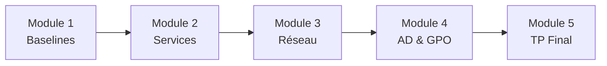

---
tags:
  - formation
  - windows
  - securite
  - hardening
---

# Formation Hardening Windows

Sécurisez vos serveurs et postes Windows selon les standards CIS, ANSSI et Microsoft Security Baselines.

---

## Objectifs de la Formation

À l'issue de cette formation, vous serez capable de :

- Appliquer les Security Baselines Microsoft
- Configurer les GPO de sécurité
- Durcir les services et protocoles Windows
- Implémenter le Tiering Model et LAPS
- Auditer et surveiller la conformité

---

## Public Cible

- Administrateurs Windows
- Ingénieurs Sécurité
- Architectes Infrastructure

**Prérequis :** Connaissances Windows Server, Active Directory, PowerShell

---

## Programme (10h)

| Module | Titre | Durée | Contenu |
|--------|-------|-------|---------|
| 01 | [Security Baselines](01-module.md) | 2h | CIS, ANSSI, Microsoft Baselines, LGPO |
| 02 | [Services & Protocoles](02-module.md) | 2h | SMB, RDP, WinRM, services inutiles |
| 03 | [Réseau & Firewall](03-module.md) | 2h | Windows Firewall, IPsec, segmentation |
| 04 | [Active Directory](04-module.md) | 2h | Tiering Model, LAPS, Protected Users |
| 05 | [TP Final](05-tp-final.md) | 2h | Audit complet et remédiation |

**Durée totale :** 10 heures

---

## Compétences Acquises

| Compétence | Niveau |
|------------|--------|
| Security Baselines | Avancé |
| GPO Sécurité | Avancé |
| Hardening Services | Avancé |
| Windows Firewall | Intermédiaire |
| Audit & Conformité | Avancé |

---

## Outils Utilisés

- **LGPO** : Local Group Policy Object Utility
- **Microsoft Security Compliance Toolkit**
- **CIS-CAT** : Audit CIS Benchmarks
- **PowerShell** : Scripts d'audit et remédiation
- **Windows Admin Center** : Gestion centralisée

---

## Certification Préparée

Cette formation prépare aux certifications :

- **SC-200** : Microsoft Security Operations Analyst
- **AZ-500** : Microsoft Azure Security Engineer

---

## Ressources

- [CIS Benchmarks Windows](https://www.cisecurity.org/benchmark/microsoft_windows_server)
- [Microsoft Security Baselines](https://docs.microsoft.com/windows/security/threat-protection/windows-security-baselines)
- [ANSSI - Recommandations Windows](https://www.ssi.gouv.fr/guide/recommandations-de-securite-relatives-a-active-directory/)

---

**Retour au :** [Catalogue des Formations](../index.md)
