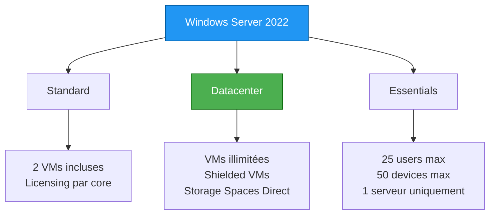

---
tags:
  - formation
  - windows-server
  - installation
  - debutant
---

# Module 01 : Découverte Windows Server

## Objectifs du Module

Ce module vous introduit à l'écosystème Windows Server 2022 :

- Comprendre les éditions et licences Windows Server
- Différencier Server Core et Desktop Experience
- Installer Windows Server en mode Server Core
- Configurer un serveur avec sconfig et PowerShell
- Comprendre l'architecture Windows Server

**Durée :** 6 heures

**Niveau :** Débutant

---

## 1. Introduction à Windows Server

### 1.1 Qu'est-ce que Windows Server ?

Windows Server est le système d'exploitation serveur de Microsoft, conçu pour :

- Héberger des services d'infrastructure (Active Directory, DNS, DHCP)
- Exécuter des applications métier
- Gérer des réseaux d'entreprise
- Fournir des services de fichiers et d'impression

```text
┌─────────────────────────────────────────────────────────────┐
│                  ÉCOSYSTÈME WINDOWS SERVER                   │
├─────────────────────────────────────────────────────────────┤
│                                                              │
│  ┌─────────────┐  ┌─────────────┐  ┌─────────────┐         │
│  │ Active      │  │ DNS/DHCP    │  │ File        │         │
│  │ Directory   │  │ Services    │  │ Services    │         │
│  └─────────────┘  └─────────────┘  └─────────────┘         │
│                                                              │
│  ┌─────────────┐  ┌─────────────┐  ┌─────────────┐         │
│  │ IIS Web     │  │ Hyper-V     │  │ Failover    │         │
│  │ Server      │  │             │  │ Clustering  │         │
│  └─────────────┘  └─────────────┘  └─────────────┘         │
│                                                              │
│           Tous sur Windows Server 2022                       │
└─────────────────────────────────────────────────────────────┘
```

### 1.2 Historique des Versions

| Version | Année | Fin de Support | Nouveautés Clés |
|---------|-------|----------------|-----------------|
| Server 2008 R2 | 2009 | 2020 | PowerShell v2, Hyper-V v2 |
| Server 2012 R2 | 2013 | 2023 | PowerShell v4, Storage Spaces |
| Server 2016 | 2016 | 2027 | Nano Server, Containers |
| Server 2019 | 2018 | 2029 | Kubernetes, Storage Migration |
| **Server 2022** | 2021 | **2031** | Secured-core, SMB over QUIC |

!!! tip "Formation 2025"
    Cette formation utilise **Windows Server 2022**, la version LTS actuelle.

---

## 2. Éditions et Licences

### 2.1 Éditions Principales



| Édition | Usage | VMs Incluses | Prix Indicatif |
|---------|-------|--------------|----------------|
| **Essentials** | PME < 25 users | 0 | ~500€ |
| **Standard** | Serveurs physiques | 2 OSE | ~1000€ (16 cores) |
| **Datacenter** | Virtualisation dense | Illimitées | ~6000€ (16 cores) |

### 2.2 Modèle de Licence

**Licensing par Core (Standard/Datacenter) :**

```text
Règles :
- Minimum 16 cores par serveur
- Minimum 8 cores par CPU
- Licences vendues par pack de 2 cores

Exemple : Serveur 2 CPU x 12 cores = 24 cores
→ Besoin de 12 licences 2-cores Standard
```

**CAL (Client Access License) :**

```text
En plus des licences serveur :
- CAL User : Par utilisateur (recommandé pour mobile)
- CAL Device : Par appareil (recommandé pour postes partagés)
```

!!! warning "Lab vs Production"
    Pour le lab, utilisez la version **Evaluation** (180 jours gratuits).
    En production, assurez-vous d'avoir les licences appropriées.

---

## 3. Server Core vs Desktop Experience

### 3.1 Comparaison

```text
┌─────────────────────────────────────────────────────────────┐
│              SERVER CORE vs DESKTOP EXPERIENCE               │
├─────────────────────────────────────────────────────────────┤
│                                                              │
│   SERVER CORE                    DESKTOP EXPERIENCE          │
│   ───────────                    ──────────────────          │
│                                                              │
│   ┌───────────────┐              ┌───────────────┐          │
│   │ C:\> _        │              │ [GUI Desktop] │          │
│   │               │              │ ┌───┐ ┌───┐   │          │
│   │ PowerShell    │              │ │App│ │App│   │          │
│   │ sconfig       │              │ └───┘ └───┘   │          │
│   │ Remote Admin  │              │ Server Manager │          │
│   └───────────────┘              └───────────────┘          │
│                                                              │
│   ✅ Surface d'attaque réduite   ❌ Plus de vulnérabilités  │
│   ✅ Moins de mises à jour       ❌ Plus de MAJ             │
│   ✅ RAM: 512 MB minimum         ❌ RAM: 2 GB minimum       │
│   ✅ Disque: 10 GB               ❌ Disque: 32 GB           │
│   ❌ Pas de GUI local            ✅ GUI local disponible    │
│                                                              │
└─────────────────────────────────────────────────────────────┘
```

### 3.2 Quand Utiliser Quoi ?

| Scénario | Recommandation | Justification |
|----------|----------------|---------------|
| Domain Controller | **Server Core** | Sécurité maximale |
| Serveur de fichiers | **Server Core** | Performance |
| Serveur IIS | Dépend | Core si PowerShell suffit |
| Serveur d'applications legacy | **Desktop** | Compatibilité |
| Serveur de développement | **Desktop** | Debug local |
| Lab d'apprentissage | **Desktop** puis Core | Progressivité |

### 3.3 Fonctionnalités Disponibles

| Composant | Server Core | Desktop Experience |
|-----------|-------------|-------------------|
| PowerShell | ✅ | ✅ |
| sconfig | ✅ | ✅ |
| MMC Snap-ins | ❌ Local | ✅ |
| Server Manager | ❌ Local | ✅ |
| Notepad/Regedit | ✅ | ✅ |
| Explorer.exe | ❌ | ✅ |
| Internet Explorer | ❌ | ✅ |
| .NET Framework GUI | ❌ | ✅ |

---

## 4. Installation de Windows Server

### 4.1 Prérequis Matériel

```yaml
Configuration minimale (Server Core):
  CPU: 1.4 GHz 64-bit
  RAM: 512 MB (2 GB recommandé)
  Disque: 32 GB (plus pour rôles)
  Réseau: Gigabit Ethernet

Configuration minimale (Desktop Experience):
  CPU: 1.4 GHz 64-bit
  RAM: 2 GB (4 GB recommandé)
  Disque: 32 GB (plus pour rôles)
  Réseau: Gigabit Ethernet

Configuration Lab recommandée:
  CPU: 2 vCPU
  RAM: 4 GB
  Disque: 60 GB
  Réseau: NAT ou Bridge
```

### 4.2 Création de la VM (Hyper-V)

```powershell
# Créer un switch virtuel
New-VMSwitch -Name "LabSwitch" -SwitchType Internal

# Créer la VM
New-VM -Name "WS2022-DC01" `
       -MemoryStartupBytes 4GB `
       -Generation 2 `
       -NewVHDPath "C:\VMs\WS2022-DC01.vhdx" `
       -NewVHDSizeBytes 60GB `
       -SwitchName "LabSwitch"

# Configurer la VM
Set-VMProcessor -VMName "WS2022-DC01" -Count 2
Set-VMMemory -VMName "WS2022-DC01" -DynamicMemoryEnabled $false
Add-VMDvdDrive -VMName "WS2022-DC01" -Path "C:\ISO\WindowsServer2022.iso"

# Démarrer la VM
Start-VM -Name "WS2022-DC01"
```

### 4.3 Installation Pas à Pas

1. **Boot sur l'ISO**
   - Démarrer la VM
   - Appuyer sur une touche pour booter sur le DVD

2. **Sélection de la langue**
   ```text
   Language: French (France)
   Time and currency: French (France)
   Keyboard: French
   ```

3. **Choix de l'édition**
   ```text
   ✓ Windows Server 2022 Standard (Desktop Experience)
     pour le premier lab

   Plus tard :
   ✓ Windows Server 2022 Standard (Server Core)
   ```

4. **Type d'installation**
   ```text
   ✓ Custom: Install Windows only (advanced)
   ```

5. **Partitionnement**
   ```text
   Sélectionner le disque → Next
   (L'installateur créera les partitions automatiquement)
   ```

6. **Configuration initiale**
   ```text
   Mot de passe Administrator: P@ssw0rd123!
   (Utilisez un mot de passe fort en production)
   ```

---

## 5. Configuration Post-Installation

### 5.1 Premier Login

Après l'installation :

```powershell
# Ouvrir PowerShell en tant qu'Administrateur
# Windows+X → Windows Terminal (Admin)

# Vérifier la version
Get-ComputerInfo | Select-Object WindowsProductName, OsVersion, OsBuildNumber
```

### 5.2 Configuration avec sconfig (Server Core)

`sconfig` est l'outil de configuration de base pour Server Core :

```sql
===============================================================================
                         Server Configuration
===============================================================================

1) Domain/Workgroup:                    Workgroup:  WORKGROUP
2) Computer Name:                       WIN-XXXXXXX
3) Add Local Administrator
4) Configure Remote Management          Enabled

5) Windows Update Settings:             Manual
6) Download and Install Updates
7) Remote Desktop:                      Disabled

8) Network Settings
9) Date and Time
10) Telemetry settings                  Required
11) Windows Activation

12) Log Off User
13) Restart Server
14) Shut Down Server
15) Exit to Command Line
```

**Configuration recommandée pour le lab :**

```yaml
# Dans sconfig :

# 2) Renommer le serveur
Enter number to select an option: 2
Enter new computer name: DC01
→ Restart: No (on redémarre après toutes les configs)

# 8) Configuration réseau
Enter number to select an option: 8
Index: 1
→ Select: 1) Set Network Adapter Address
→ S) Static IP
→ IP: 192.168.1.10
→ Subnet: 255.255.255.0
→ Gateway: 192.168.1.1
→ DNS: 127.0.0.1 (le serveur sera DNS)

# 7) Activer Remote Desktop
Enter number to select an option: 7
→ E) Enable
→ 1) Allow only NLA connections

# 13) Redémarrer
Enter number to select an option: 13
```

### 5.3 Configuration avec PowerShell

```powershell
# Renommer le serveur
Rename-Computer -NewName "DC01" -Restart

# Après redémarrage, configurer le réseau
New-NetIPAddress -InterfaceAlias "Ethernet" `
                 -IPAddress 192.168.1.10 `
                 -PrefixLength 24 `
                 -DefaultGateway 192.168.1.1

Set-DnsClientServerAddress -InterfaceAlias "Ethernet" `
                           -ServerAddresses 127.0.0.1, 8.8.8.8

# Activer Remote Desktop
Set-ItemProperty -Path 'HKLM:\System\CurrentControlSet\Control\Terminal Server' `
                 -Name "fDenyTSConnections" -Value 0

Enable-NetFirewallRule -DisplayGroup "Remote Desktop"

# Vérifier la configuration
Get-NetIPConfiguration
Test-NetConnection 8.8.8.8
```

### 5.4 Configuration du Pare-feu

```powershell
# Voir l'état du pare-feu
Get-NetFirewallProfile | Select-Object Name, Enabled

# Autoriser ICMP (ping)
New-NetFirewallRule -DisplayName "Allow ICMPv4-In" `
                    -Protocol ICMPv4 -IcmpType 8 `
                    -Direction Inbound -Action Allow

# Autoriser la gestion à distance (WinRM)
Enable-PSRemoting -Force

# Autoriser RSAT
Enable-NetFirewallRule -DisplayGroup "Windows Remote Management"
Enable-NetFirewallRule -DisplayGroup "Remote Event Log Management"
Enable-NetFirewallRule -DisplayGroup "Remote Service Management"
```

---

## 6. Architecture Windows Server

### 6.1 Structure du Système

```text
┌─────────────────────────────────────────────────────────────┐
│                    ARCHITECTURE WINDOWS                      │
├─────────────────────────────────────────────────────────────┤
│                                                              │
│  USER MODE                                                   │
│  ─────────                                                   │
│  ┌───────────┐ ┌───────────┐ ┌───────────┐ ┌───────────┐   │
│  │ Services  │ │ Processes │ │ PowerShell│ │   Apps    │   │
│  └─────┬─────┘ └─────┬─────┘ └─────┬─────┘ └─────┬─────┘   │
│        │             │             │             │          │
│  ┌─────┴─────────────┴─────────────┴─────────────┴─────┐   │
│  │                   Windows API (Win32/Win64)          │   │
│  └──────────────────────────┬──────────────────────────┘   │
│                              │                              │
│  ════════════════════════════════════════════════════════  │
│                                                              │
│  KERNEL MODE                                                 │
│  ───────────                                                 │
│  ┌──────────────────────────────────────────────────────┐  │
│  │              NT Kernel (ntoskrnl.exe)                 │  │
│  │   ┌──────────┐ ┌──────────┐ ┌──────────┐            │  │
│  │   │ Process  │ │ Memory   │ │  I/O     │            │  │
│  │   │ Manager  │ │ Manager  │ │ Manager  │            │  │
│  │   └──────────┘ └──────────┘ └──────────┘            │  │
│  └──────────────────────────────────────────────────────┘  │
│  ┌──────────────────────────────────────────────────────┐  │
│  │              Hardware Abstraction Layer (HAL)         │  │
│  └──────────────────────────────────────────────────────┘  │
│                                                              │
└─────────────────────────────────────────────────────────────┘
```

### 6.2 Répertoires Importants

```powershell
# Structure des dossiers Windows Server
C:\
├── Windows\               # Système d'exploitation
│   ├── System32\         # Binaires système 64-bit
│   ├── SysWOW64\         # Binaires système 32-bit
│   ├── Logs\             # Logs Windows
│   └── Temp\             # Fichiers temporaires système
├── Program Files\        # Applications 64-bit
├── Program Files (x86)\  # Applications 32-bit
├── Users\                # Profils utilisateurs
├── inetpub\              # Racine IIS (si installé)
└── ProgramData\          # Données applications (caché)
```

```powershell
# Variables d'environnement importantes
$env:SystemRoot           # C:\Windows
$env:ProgramFiles         # C:\Program Files
$env:ProgramData          # C:\ProgramData
$env:USERPROFILE          # C:\Users\Administrator
$env:TEMP                 # Dossier temporaire
$env:COMPUTERNAME         # Nom du serveur
```

### 6.3 Le Registre Windows

```powershell
# Ruches principales du registre
HKEY_LOCAL_MACHINE (HKLM)    # Configuration machine
├── HARDWARE                  # Matériel détecté
├── SAM                      # Security Account Manager
├── SECURITY                 # Politiques de sécurité
├── SOFTWARE                 # Logiciels installés
└── SYSTEM                   # Configuration système

HKEY_CURRENT_USER (HKCU)     # Configuration utilisateur courant
HKEY_USERS (HKU)             # Tous les profils chargés
HKEY_CLASSES_ROOT (HKCR)     # Associations de fichiers
HKEY_CURRENT_CONFIG (HKCC)   # Profil matériel courant
```

```powershell
# Accès au registre avec PowerShell
# Lire une valeur
Get-ItemProperty -Path "HKLM:\SOFTWARE\Microsoft\Windows NT\CurrentVersion" `
                 -Name ProductName

# Créer/modifier une valeur
Set-ItemProperty -Path "HKLM:\SOFTWARE\MyApp" -Name "Setting1" -Value "Value1"

# Créer une clé
New-Item -Path "HKLM:\SOFTWARE\MyApp"
```

---

## 7. Outils de Base

### 7.1 Commandes Essentielles

```powershell
# Information système
systeminfo                    # Infos détaillées
hostname                      # Nom du serveur
whoami                       # Utilisateur courant
whoami /groups               # Groupes de l'utilisateur

# Gestion des fichiers
dir                          # Liste (alias de Get-ChildItem)
cd                           # Changer de répertoire
copy, move, del              # Opérations fichiers
md, rd                       # Créer/supprimer répertoire

# Réseau
ipconfig /all                # Configuration réseau
ping                         # Test connectivité
nslookup                     # Requête DNS
netstat -an                  # Connexions actives

# Processus
tasklist                     # Liste des processus
taskkill /PID <pid>          # Tuer un processus

# Services
net start                    # Liste services démarrés
net start <service>          # Démarrer un service
net stop <service>           # Arrêter un service
sc query                     # État des services
```

### 7.2 MMC et Snap-ins (Desktop Experience)

```powershell
# Lancer les consoles d'administration
mmc                          # Console vide
compmgmt.msc                 # Gestion de l'ordinateur
devmgmt.msc                  # Gestionnaire de périphériques
diskmgmt.msc                 # Gestion des disques
services.msc                 # Services
eventvwr.msc                 # Observateur d'événements
lusrmgr.msc                  # Utilisateurs et groupes locaux
gpedit.msc                   # Éditeur de stratégie locale
```

### 7.3 Windows Admin Center (WAC)

Windows Admin Center est une interface web moderne pour administrer les serveurs :

```powershell
# Télécharger et installer WAC
# https://aka.ms/wacdownload

# Après installation, accéder via :
# https://localhost:6516  (ou https://<servername>:6516)
```

**Fonctionnalités WAC :**

- Dashboard centralisé
- Gestion des VMs Hyper-V
- Monitoring des performances
- Accès PowerShell distant
- Gestion des mises à jour
- Interface moderne (remplace RSAT pour beaucoup de tâches)

---

## 8. Exercices Pratiques

### Exercice 1 : Installation Server Core

**Objectif :** Installer Windows Server 2022 en mode Server Core.

**Étapes :**

1. Créer une VM avec 4 GB RAM, 60 GB disque
2. Monter l'ISO Windows Server 2022
3. Installer en mode **Server Core** (sans Desktop Experience)
4. Configurer le mot de passe Administrator

**Vérification :**

```powershell
# Après installation, vous devez voir uniquement cmd.exe
# Tapez "powershell" pour accéder à PowerShell
```

---

### Exercice 2 : Configuration Réseau

**Objectif :** Configurer le réseau avec sconfig et PowerShell.

**Configuration cible :**

```yaml
IP Address: 192.168.1.10
Subnet Mask: 255.255.255.0
Default Gateway: 192.168.1.1
DNS Server: 127.0.0.1, 8.8.8.8
Computer Name: DC01
```

**Solution avec sconfig :**

```text
# Lancer sconfig
sconfig

# Option 2 : Changer le nom
# Option 8 : Configurer le réseau
```

**Solution avec PowerShell :**

```powershell
# Configurer l'IP
$adapter = Get-NetAdapter | Where-Object Status -eq "Up"
New-NetIPAddress -InterfaceIndex $adapter.ifIndex `
                 -IPAddress 192.168.1.10 `
                 -PrefixLength 24 `
                 -DefaultGateway 192.168.1.1

Set-DnsClientServerAddress -InterfaceIndex $adapter.ifIndex `
                           -ServerAddresses 127.0.0.1, 8.8.8.8

# Renommer et redémarrer
Rename-Computer -NewName "DC01" -Restart
```

---

### Exercice 3 : Activer l'Administration Distante

**Objectif :** Configurer le serveur pour l'administration à distance.

**Tâches :**

1. Activer Remote Desktop
2. Activer WinRM (PowerShell Remoting)
3. Configurer le pare-feu

**Solution :**

```powershell
# 1. Activer Remote Desktop
Set-ItemProperty -Path 'HKLM:\System\CurrentControlSet\Control\Terminal Server' `
                 -Name "fDenyTSConnections" -Value 0
Enable-NetFirewallRule -DisplayGroup "Remote Desktop"

# 2. Activer WinRM
Enable-PSRemoting -Force
Set-Item WSMan:\localhost\Client\TrustedHosts -Value "*" -Force

# 3. Vérifier
Get-Service WinRM
Test-WSMan localhost
```

**Test depuis un client :**

```powershell
# Connexion PowerShell à distance
Enter-PSSession -ComputerName DC01 -Credential (Get-Credential)

# Ou exécuter une commande
Invoke-Command -ComputerName DC01 -ScriptBlock { Get-ComputerInfo }
```

---

## 9. Quiz de Validation

### Questions

1. **Quelle édition Windows Server est recommandée pour un serveur avec virtualisation dense ?**
   - [ ] A. Essentials
   - [ ] B. Standard
   - [ ] C. Datacenter

2. **Quel est l'avantage principal de Server Core ?**
   - [ ] A. Interface graphique complète
   - [ ] B. Surface d'attaque réduite
   - [ ] C. Compatibilité avec toutes les applications

3. **Quel outil permet de configurer Server Core facilement ?**
   - [ ] A. Server Manager
   - [ ] B. sconfig
   - [ ] C. MMC

4. **Quelle commande active PowerShell Remoting ?**
   - [ ] A. Enable-RemoteDesktop
   - [ ] B. Enable-PSRemoting
   - [ ] C. Set-RemoteAccess

5. **Quel port utilise WinRM par défaut ?**
   - [ ] A. 3389
   - [ ] B. 5985/5986
   - [ ] C. 445

### Réponses

1. **C** - Datacenter (VMs illimitées)
2. **B** - Surface d'attaque réduite
3. **B** - sconfig
4. **B** - Enable-PSRemoting
5. **B** - 5985 (HTTP) / 5986 (HTTPS)

---

## 10. Ressources

- [Documentation Windows Server 2022](https://docs.microsoft.com/windows-server/)
- [Windows Server Evaluation](https://www.microsoft.com/evalcenter/evaluate-windows-server-2022)
- [Windows Admin Center](https://docs.microsoft.com/windows-server/manage/windows-admin-center/)

---

**Suivant :** [Module 02 : PowerShell Basics](02-powershell-basics.md)

---

## Navigation

| | |
|:---|---:|
| [← Programme](index.md) | [Module 02 : PowerShell Basics →](02-powershell-basics.md) |

[Retour au Programme](index.md){ .md-button }
