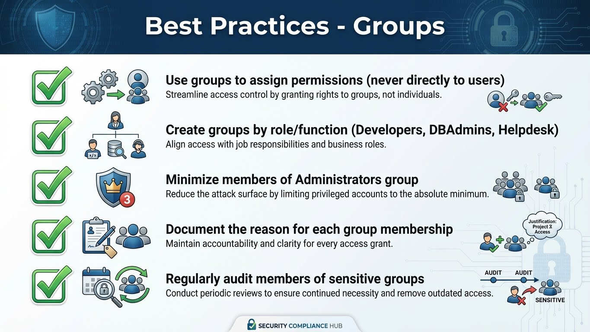
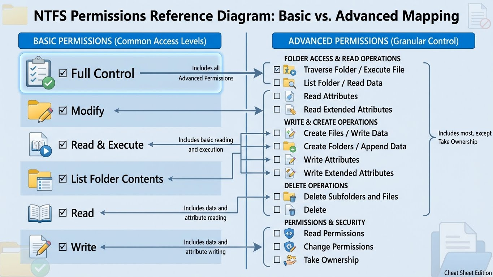

---
tags:
  - formation
  - windows-server
  - utilisateurs
  - ntfs
  - permissions
---

# Module 03 : Utilisateurs & NTFS

## Objectifs du Module

Ce module couvre la gestion des utilisateurs locaux et les permissions NTFS :

- Gérer les comptes utilisateurs locaux
- Comprendre les groupes locaux et leur utilité
- Maîtriser les permissions NTFS
- Configurer l'héritage et les permissions avancées
- Utiliser les ACL avec PowerShell

**Durée :** 6 heures

**Niveau :** Débutant

---

## 1. Comptes Utilisateurs Locaux

### 1.1 Types de Comptes


```
┌─────────────────────────────────────────────────────────────┐
│               TYPES DE COMPTES WINDOWS                       │
├─────────────────────────────────────────────────────────────┤
│                                                              │
│  COMPTES LOCAUX              COMPTES DE DOMAINE             │
│  ──────────────              ─────────────────              │
│                                                              │
│  Stockés dans SAM local      Stockés dans Active Directory  │
│  Format: COMPUTERNAME\User   Format: DOMAIN\User            │
│  Valides sur 1 machine       Valides sur tout le domaine    │
│                                                              │
│  Utilisations:               Utilisations:                  │
│  - Serveurs standalone       - Environnement d'entreprise   │
│  - Comptes de service        - Authentification centralisée │
│  - Accès d'urgence           - GPO et politiques           │
│                                                              │
└─────────────────────────────────────────────────────────────┘
```

### 1.2 Comptes Intégrés (Built-in)

| Compte | Description | SID |
|--------|-------------|-----|
| **Administrator** | Compte admin par défaut | S-1-5-21-...-500 |
| **Guest** | Accès invité (désactivé) | S-1-5-21-...-501 |
| **DefaultAccount** | Compte système | S-1-5-21-...-503 |
| **SYSTEM** | Compte système local | S-1-5-18 |
| **Network Service** | Services réseau | S-1-5-20 |
| **Local Service** | Services locaux | S-1-5-19 |

### 1.3 Gestion avec PowerShell

```powershell
# Lister les utilisateurs locaux
Get-LocalUser

# Détails d'un utilisateur
Get-LocalUser -Name Administrator | Format-List *

# Créer un utilisateur
$password = ConvertTo-SecureString "P@ssw0rd123!" -AsPlainText -Force
New-LocalUser -Name "LabUser" -Password $password -Description "Compte de test"

# Créer sans expiration de mot de passe
New-LocalUser -Name "ServiceUser" -Password $password -PasswordNeverExpires -UserMayNotChangePassword

# Modifier un utilisateur
Set-LocalUser -Name "LabUser" -Description "Nouvelle description"
Set-LocalUser -Name "LabUser" -PasswordNeverExpires $true

# Activer/Désactiver
Enable-LocalUser -Name "Guest"
Disable-LocalUser -Name "LabUser"

# Supprimer
Remove-LocalUser -Name "LabUser"

# Changer le mot de passe
Set-LocalUser -Name "LabUser" -Password (ConvertTo-SecureString "NewP@ss!" -AsPlainText -Force)

# Renommer
Rename-LocalUser -Name "LabUser" -NewName "TestUser"
```

### 1.4 Gestion avec GUI

```powershell
# Ouvrir la console des utilisateurs locaux
lusrmgr.msc

# Computer Management
compmgmt.msc
# → Local Users and Groups → Users
```

---

## 2. Groupes Locaux

### 2.1 Groupes Intégrés Importants

| Groupe | Description | Droits |
|--------|-------------|--------|
| **Administrators** | Contrôle total | Admin local |
| **Users** | Utilisateurs standards | Accès limité |
| **Remote Desktop Users** | Accès RDP | Connexion bureau à distance |
| **Power Users** | Legacy (peu utilisé) | Droits intermédiaires |
| **Backup Operators** | Sauvegarde | Bypass permissions pour backup |
| **Performance Monitor Users** | Monitoring | Accès compteurs perf |
| **Event Log Readers** | Logs | Lecture journaux |
| **Remote Management Users** | WinRM | Administration PowerShell distante |

### 2.2 Gestion avec PowerShell

```powershell
# Lister les groupes locaux
Get-LocalGroup

# Détails d'un groupe
Get-LocalGroup -Name "Administrators" | Format-List *

# Membres d'un groupe
Get-LocalGroupMember -Group "Administrators"

# Créer un groupe
New-LocalGroup -Name "AppAdmins" -Description "Administrateurs applicatifs"

# Ajouter un membre
Add-LocalGroupMember -Group "Remote Desktop Users" -Member "LabUser"
Add-LocalGroupMember -Group "AppAdmins" -Member "DOMAIN\GroupeName"

# Retirer un membre
Remove-LocalGroupMember -Group "Administrators" -Member "LabUser"

# Supprimer un groupe
Remove-LocalGroup -Name "AppAdmins"
```

### 2.3 Bonnes Pratiques



```
┌─────────────────────────────────────────────────────────────┐
│            BONNES PRATIQUES - GROUPES                        │
├─────────────────────────────────────────────────────────────┤
│                                                              │
│  ✓ Utiliser les groupes pour assigner des permissions       │
│    (jamais directement aux utilisateurs)                    │
│                                                              │
│  ✓ Créer des groupes par rôle/fonction                      │
│    Ex: Developers, DBAdmins, Helpdesk                       │
│                                                              │
│  ✓ Minimiser les membres du groupe Administrators           │
│                                                              │
│  ✓ Documenter la raison de chaque appartenance              │
│                                                              │
│  ✓ Auditer régulièrement les membres des groupes sensibles │
│                                                              │
└─────────────────────────────────────────────────────────────┘
```

---

## 3. Permissions NTFS

### 3.1 Comprendre les Permissions



```
┌─────────────────────────────────────────────────────────────┐
│                 PERMISSIONS NTFS                             │
├─────────────────────────────────────────────────────────────┤
│                                                              │
│  PERMISSIONS DE BASE          PERMISSIONS AVANCÉES          │
│  ──────────────────          ────────────────────           │
│                                                              │
│  Full Control                 Traverse Folder               │
│  Modify                       List Folder                   │
│  Read & Execute              Read Attributes                │
│  List Folder Contents        Read Extended Attributes       │
│  Read                        Create Files                   │
│  Write                       Create Folders                 │
│                              Write Attributes               │
│                              Write Extended Attributes      │
│                              Delete Subfolders and Files    │
│                              Delete                         │
│                              Read Permissions               │
│                              Change Permissions             │
│                              Take Ownership                 │
│                                                              │
└─────────────────────────────────────────────────────────────┘
```

### 3.2 Permissions de Base Détaillées

| Permission | Fichiers | Dossiers |
|------------|----------|----------|
| **Read (R)** | Voir le contenu, attributs, permissions | Voir le contenu, attributs |
| **Write (W)** | Modifier le contenu, attributs | Créer fichiers/sous-dossiers |
| **Read & Execute (RX)** | Read + exécuter | Read + parcourir |
| **List Folder Contents** | N/A | Lister le contenu |
| **Modify (M)** | RX + W + Delete | RX + W + Delete |
| **Full Control (F)** | Tout | Tout |

### 3.3 Voir les Permissions (GUI)

```powershell
# Clic droit sur fichier/dossier → Properties → Security tab
# Ou via l'explorateur

# Ouvrir l'explorateur
explorer.exe C:\

# Propriétés d'un élément
# Clic droit → Properties → Security → Advanced
```

### 3.4 Voir les Permissions (PowerShell)

```powershell
# Obtenir l'ACL d'un fichier/dossier
Get-Acl -Path C:\Temp | Format-List

# Voir les entrées d'accès
(Get-Acl -Path C:\Temp).Access

# Format lisible
Get-Acl -Path C:\Temp | Select-Object -ExpandProperty Access | Format-Table

# Avec icacls (outil ligne de commande)
icacls C:\Temp
icacls C:\Temp\*.* /T    # Récursif
```

### 3.5 Modifier les Permissions (PowerShell)

```powershell
# Obtenir l'ACL actuelle
$acl = Get-Acl -Path C:\Temp

# Créer une règle d'accès
$rule = New-Object System.Security.AccessControl.FileSystemAccessRule(
    "LabUser",                           # Identité
    "Modify",                            # Permission
    "ContainerInherit,ObjectInherit",    # Héritage
    "None",                              # Propagation
    "Allow"                              # Type
)

# Ajouter la règle
$acl.AddAccessRule($rule)

# Appliquer
Set-Acl -Path C:\Temp -AclObject $acl

# Vérifier
Get-Acl -Path C:\Temp | Select-Object -ExpandProperty Access
```

### 3.6 Modifier avec icacls

```powershell
# Syntaxe icacls
# icacls <path> /grant <user>:<permission>
# Permissions: F (Full), M (Modify), RX (Read/Execute), R (Read), W (Write)

# Accorder Modify à LabUser
icacls C:\Temp /grant "LabUser:(M)"

# Accorder avec héritage
icacls C:\Temp /grant "LabUser:(OI)(CI)M"
# OI = Object Inherit (fichiers)
# CI = Container Inherit (dossiers)

# Révoquer
icacls C:\Temp /remove "LabUser"

# Refuser (Deny)
icacls C:\Temp /deny "LabUser:(W)"

# Copier les permissions d'un autre objet
icacls C:\Dest /copy C:\Source

# Restaurer les permissions par défaut
icacls C:\Temp /reset /T

# Sauvegarder les ACL
icacls C:\Temp /save C:\acl_backup.txt /T

# Restaurer les ACL
icacls C:\ /restore C:\acl_backup.txt
```

---

## 4. Héritage des Permissions

### 4.1 Concept d'Héritage

```
┌─────────────────────────────────────────────────────────────┐
│                    HÉRITAGE NTFS                             │
├─────────────────────────────────────────────────────────────┤
│                                                              │
│  C:\Data\                     ← Permissions définies ici    │
│  ├── Project1\                ← Hérite de Data             │
│  │   ├── docs\                ← Hérite de Project1         │
│  │   │   └── file.txt         ← Hérite de docs             │
│  │   └── scripts\             ← Hérite de Project1         │
│  └── Project2\                ← Hérite de Data             │
│      └── [Héritage bloqué]    ← Permissions propres        │
│          └── sensitive.doc    ← Hérite de Project2 seulement│
│                                                              │
│  Permissions héritées = (I) dans l'affichage ACL            │
│  Permissions explicites = pas de (I)                        │
│                                                              │
└─────────────────────────────────────────────────────────────┘
```

### 4.2 Options d'Héritage

| Option | Description |
|--------|-------------|
| **ContainerInherit (CI)** | Les sous-dossiers héritent |
| **ObjectInherit (OI)** | Les fichiers héritent |
| **InheritOnly (IO)** | Appliqué seulement aux enfants |
| **NoPropagateInherit (NP)** | Un seul niveau d'héritage |
| **None** | Pas d'héritage |

### 4.3 Bloquer l'Héritage

```powershell
# Bloquer l'héritage (GUI)
# Propriétés → Security → Advanced → Disable inheritance

# Bloquer l'héritage (PowerShell)
$acl = Get-Acl -Path C:\Temp\Sensitive
$acl.SetAccessRuleProtection($true, $true)  # ($protectFromInheritance, $preserveInheritedRules)
Set-Acl -Path C:\Temp\Sensitive -AclObject $acl

# Bloquer et supprimer les règles héritées
$acl.SetAccessRuleProtection($true, $false)
Set-Acl -Path C:\Temp\Sensitive -AclObject $acl
```

### 4.4 Réactiver l'Héritage

```powershell
$acl = Get-Acl -Path C:\Temp\Sensitive
$acl.SetAccessRuleProtection($false, $false)
Set-Acl -Path C:\Temp\Sensitive -AclObject $acl
```

---

## 5. Permissions Effectives

### 5.1 Calcul des Permissions Effectives

```
┌─────────────────────────────────────────────────────────────┐
│          CALCUL DES PERMISSIONS EFFECTIVES                   │
├─────────────────────────────────────────────────────────────┤
│                                                              │
│  Règles :                                                    │
│                                                              │
│  1. DENY est prioritaire sur ALLOW                          │
│     User a "Modify" + "Deny Write" → pas de Write           │
│                                                              │
│  2. Les permissions sont CUMULATIVES                         │
│     User dans Group1 (Read) + Group2 (Write) → Read+Write   │
│                                                              │
│  3. Permissions explicites > héritées                        │
│     Explicite "Deny" bat hérité "Allow"                     │
│                                                              │
│  Ordre d'évaluation :                                        │
│  1. Deny explicite                                           │
│  2. Allow explicite                                          │
│  3. Deny hérité                                              │
│  4. Allow hérité                                             │
│                                                              │
└─────────────────────────────────────────────────────────────┘
```

### 5.2 Vérifier les Permissions Effectives

```powershell
# Via GUI
# Propriétés → Security → Advanced → Effective Access
# Sélectionner un utilisateur pour voir ses permissions effectives

# Via PowerShell - Simuler l'accès
$identity = [System.Security.Principal.NTAccount]"DOMAIN\User"
$acl = Get-Acl -Path C:\Temp
$acl.Access | Where-Object { $_.IdentityReference -eq $identity }

# Via icacls
icacls C:\Temp /findsid "LabUser"
```

---

## 6. Propriété (Ownership)

### 6.1 Concept de Propriétaire

```powershell
# Le propriétaire d'un objet peut TOUJOURS modifier ses permissions
# Même sans permissions explicites

# Voir le propriétaire
(Get-Acl -Path C:\Temp).Owner

# Changer le propriétaire
$acl = Get-Acl -Path C:\Temp
$newOwner = New-Object System.Security.Principal.NTAccount("BUILTIN\Administrators")
$acl.SetOwner($newOwner)
Set-Acl -Path C:\Temp -AclObject $acl

# Avec takeown (outil ligne de commande)
takeown /F C:\Temp /A                    # Prendre possession (Administrators)
takeown /F C:\Temp /R /A                 # Récursif
takeown /F C:\Temp /R /D Y /A            # Sans confirmation
```

### 6.2 Prendre Possession

```powershell
# Scénario : Fichier inaccessible, besoin de récupérer l'accès

# 1. Prendre possession
takeown /F C:\LockedFolder /R /A

# 2. Accorder les permissions à Administrators
icacls C:\LockedFolder /grant "Administrators:(OI)(CI)F" /T

# 3. Vérifier
Get-Acl C:\LockedFolder | Select-Object Owner, Access
```

---

## 7. Permissions de Partage vs NTFS

### 7.1 Différence

```
┌─────────────────────────────────────────────────────────────┐
│        PERMISSIONS PARTAGE vs NTFS                           │
├─────────────────────────────────────────────────────────────┤
│                                                              │
│  PARTAGE (Share)              NTFS                          │
│  ───────────────              ────                          │
│                                                              │
│  S'applique via réseau        S'applique en local ET réseau │
│  Niveaux: Read, Change, Full  Niveaux: Granulaires          │
│  Pas d'héritage               Héritage complet              │
│                                                              │
│  Accès via réseau:                                          │
│  Permission effective = MIN(Share, NTFS)                    │
│                                                              │
│  Exemple:                                                    │
│  Share: Change (RW)                                          │
│  NTFS: Read                                                  │
│  → Accès réseau = Read (le plus restrictif)                 │
│                                                              │
│  Accès local:                                                │
│  → NTFS uniquement (Share ignoré)                           │
│                                                              │
└─────────────────────────────────────────────────────────────┘
```

### 7.2 Recommandation

```powershell
# Bonne pratique : Share = Full Control pour Everyone
#                 NTFS = Permissions granulaires

# Créer un partage avec Full Control
New-SmbShare -Name "Data" -Path C:\Data -FullAccess "Everyone"

# Puis configurer NTFS finement
icacls C:\Data /grant "Finance:(OI)(CI)M"
icacls C:\Data /grant "IT:(OI)(CI)F"
```

---

## 8. Exercices Pratiques

### Exercice 1 : Gestion des Utilisateurs

**Objectif :** Créer et gérer des utilisateurs locaux.

**Tâches :**

1. Créer 3 utilisateurs : Alice, Bob, Charlie
2. Créer 2 groupes : Developers, Testers
3. Ajouter Alice et Bob à Developers
4. Ajouter Charlie à Testers
5. Ajouter le groupe Developers à Remote Desktop Users

**Solution :**

```powershell
# Mot de passe commun pour le lab
$password = ConvertTo-SecureString "Lab123!" -AsPlainText -Force

# Créer les utilisateurs
"Alice", "Bob", "Charlie" | ForEach-Object {
    New-LocalUser -Name $_ -Password $password -PasswordNeverExpires
}

# Créer les groupes
New-LocalGroup -Name "Developers" -Description "Équipe développement"
New-LocalGroup -Name "Testers" -Description "Équipe test"

# Ajouter aux groupes
Add-LocalGroupMember -Group "Developers" -Member "Alice", "Bob"
Add-LocalGroupMember -Group "Testers" -Member "Charlie"

# Developers → Remote Desktop Users
Add-LocalGroupMember -Group "Remote Desktop Users" -Member "Developers"

# Vérifier
Get-LocalGroupMember -Group "Developers"
Get-LocalGroupMember -Group "Remote Desktop Users"
```

---

### Exercice 2 : Permissions NTFS

**Objectif :** Configurer une structure de dossiers avec permissions.

**Structure :**

```
C:\Projects\
├── Shared\        (Everyone: Read, IT: Full Control)
├── Development\   (Developers: Modify, IT: Full Control)
└── Testing\       (Testers: Modify, IT: Full Control)
```

**Solution :**

```powershell
# Créer la structure
$basePath = "C:\Projects"
New-Item -Path $basePath -ItemType Directory
"Shared", "Development", "Testing" | ForEach-Object {
    New-Item -Path "$basePath\$_" -ItemType Directory
}

# Bloquer l'héritage sur Projects
$acl = Get-Acl -Path $basePath
$acl.SetAccessRuleProtection($true, $false)

# Ajouter IT avec Full Control
$rule = New-Object System.Security.AccessControl.FileSystemAccessRule(
    "Administrators", "FullControl", "ContainerInherit,ObjectInherit", "None", "Allow")
$acl.AddAccessRule($rule)
Set-Acl -Path $basePath -AclObject $acl

# Shared - Everyone Read
$acl = Get-Acl -Path "$basePath\Shared"
$rule = New-Object System.Security.AccessControl.FileSystemAccessRule(
    "Everyone", "Read", "ContainerInherit,ObjectInherit", "None", "Allow")
$acl.AddAccessRule($rule)
Set-Acl -Path "$basePath\Shared" -AclObject $acl

# Development - Developers Modify
$acl = Get-Acl -Path "$basePath\Development"
$rule = New-Object System.Security.AccessControl.FileSystemAccessRule(
    "Developers", "Modify", "ContainerInherit,ObjectInherit", "None", "Allow")
$acl.AddAccessRule($rule)
Set-Acl -Path "$basePath\Development" -AclObject $acl

# Testing - Testers Modify
$acl = Get-Acl -Path "$basePath\Testing"
$rule = New-Object System.Security.AccessControl.FileSystemAccessRule(
    "Testers", "Modify", "ContainerInherit,ObjectInherit", "None", "Allow")
$acl.AddAccessRule($rule)
Set-Acl -Path "$basePath\Testing" -AclObject $acl

# Vérifier
Get-ChildItem $basePath | ForEach-Object {
    Write-Host "`n=== $($_.Name) ===" -ForegroundColor Cyan
    (Get-Acl $_.FullName).Access | Format-Table IdentityReference, FileSystemRights
}
```

---

### Exercice 3 : Audit des Permissions

**Objectif :** Auditer les permissions d'un dossier.

**Tâches :**

1. Scanner C:\Projects récursivement
2. Trouver tous les dossiers où l'héritage est bloqué
3. Lister les utilisateurs avec Full Control
4. Exporter le rapport en CSV

**Solution :**

```powershell
# Fonction d'audit
function Get-PermissionReport {
    param([string]$Path)

    Get-ChildItem -Path $Path -Recurse -Directory | ForEach-Object {
        $acl = Get-Acl -Path $_.FullName

        $acl.Access | ForEach-Object {
            [PSCustomObject]@{
                Path = $acl.Path
                IdentityReference = $_.IdentityReference
                FileSystemRights = $_.FileSystemRights
                AccessControlType = $_.AccessControlType
                IsInherited = $_.IsInherited
                InheritanceBlocked = $acl.AreAccessRulesProtected
            }
        }
    }
}

# Générer le rapport
$report = Get-PermissionReport -Path "C:\Projects"

# Dossiers avec héritage bloqué
$report | Where-Object InheritanceBlocked -eq $true | Select-Object Path -Unique

# Utilisateurs avec Full Control
$report | Where-Object { $_.FileSystemRights -match "FullControl" } |
    Select-Object Path, IdentityReference

# Exporter
$report | Export-Csv C:\Temp\permission-report.csv -NoTypeInformation
```

---

## 9. Quiz de Validation

### Questions

1. **Quel groupe permet l'accès Remote Desktop ?**
   - [ ] A. Administrators
   - [ ] B. Remote Desktop Users
   - [ ] C. Power Users

2. **Quelle permission inclut Read, Write et Delete ?**
   - [ ] A. Read & Execute
   - [ ] B. Full Control
   - [ ] C. Modify

3. **Que signifie (OI)(CI) dans icacls ?**
   - [ ] A. Owner Inherit, Container Inherit
   - [ ] B. Object Inherit, Container Inherit
   - [ ] C. Only Inherit, Child Inherit

4. **Si un utilisateur a "Allow Read" et "Deny Write", que peut-il faire ?**
   - [ ] A. Lire et écrire
   - [ ] B. Lire seulement
   - [ ] C. Rien

5. **Quelle commande prend possession d'un fichier ?**
   - [ ] A. chown
   - [ ] B. takeown
   - [ ] C. icacls /owner

### Réponses

1. **B** - Remote Desktop Users
2. **C** - Modify
3. **B** - Object Inherit, Container Inherit
4. **B** - Lire seulement (Deny est prioritaire)
5. **B** - takeown

---

## 10. Ressources

- [NTFS Permissions Guide](https://docs.microsoft.com/windows-server/storage/file-server/ntfs-overview)
- [icacls Documentation](https://docs.microsoft.com/windows-server/administration/windows-commands/icacls)
- [Access Control Overview](https://docs.microsoft.com/windows/security/identity-protection/access-control/)

---

**Précédent :** [Module 02 : PowerShell Basics](02-powershell-basics.md)

**Suivant :** [Module 04 : Outils d'Administration](04-outils-administration.md)

---

## Navigation

| | |
|:---|---:|
| [← Module 02 : PowerShell Basics](02-powershell-basics.md) | [Module 04 : Outils d'Administration →](04-outils-administration.md) |

[Retour au Programme](index.md){ .md-button }
