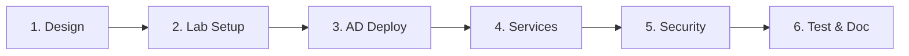

---
tags:
  - formation
  - windows-server
  - projet
  - capstone
  - expert
---

# Module 20 : Projet Final Expert

## Objectifs du Module

Ce projet final valide l'ensemble des compétences acquises durant la formation :

- Concevoir une architecture Windows Server complète
- Implémenter Active Directory sécurisé
- Déployer des services haute disponibilité
- Automatiser avec IaC
- Documenter et présenter le projet

**Durée :** 9 heures (projet autonome)

**Niveau :** Expert

---

## 1. Contexte du Projet

### Scénario

Vous êtes l'architecte infrastructure Windows pour une entreprise en croissance rapide. Votre mission est de concevoir et implémenter une infrastructure Windows Server complète pour 500 utilisateurs répartis sur 2 sites.

### Architecture Cible

```
INFRASTRUCTURE CORP.LOCAL
─────────────────────────

SITE PRINCIPAL (Paris)
├── DC01 (Domain Controller, DNS, DHCP)
├── DC02 (Domain Controller, DNS, DHCP failover)
├── CA01 (Enterprise CA)
├── FILE01 (File Server, DFS)
├── WEB01 (IIS, load balanced)
├── WEB02 (IIS, load balanced)
└── SQL01 (SQL Server Always On primary)

SITE SECONDAIRE (Lyon)
├── DC03 (RODC, DNS)
├── FILE02 (File Server, DFS replica)
└── SQL02 (SQL Server Always On secondary)

AZURE (Hybrid)
├── Azure AD Connect
├── Azure Backup
└── Azure Site Recovery
```

---

## 2. Exigences Techniques

### Infrastructure Active Directory

- [ ] Forêt corp.local avec 2 sites AD
- [ ] 4 Domain Controllers (2 par site)
- [ ] Structure d'OU selon le Tiering Model
- [ ] GPO de sécurité et configuration
- [ ] Réplication inter-sites optimisée

### Sécurité

- [ ] Tiering Model implémenté (Tier 0/1/2)
- [ ] LAPS déployé sur tous les postes
- [ ] Protected Users pour les comptes privilégiés
- [ ] Audit avancé configuré
- [ ] Hardening selon CIS Benchmark

### Haute Disponibilité

- [ ] DNS/DHCP redondants
- [ ] DFS-R pour les fichiers partagés
- [ ] NLB pour les serveurs web
- [ ] SQL Always On Availability Group

### Infrastructure as Code

- [ ] PowerShell DSC pour la configuration
- [ ] Scripts d'automatisation documentés
- [ ] Procédures de déploiement reproductibles

### Monitoring et Backup

- [ ] Monitoring centralisé
- [ ] Backup quotidien System State
- [ ] Plan de DR documenté
- [ ] Intégration Azure Backup/ASR

---

## 3. Livrables

### 3.1 Structure du Projet

```
projet-final/
├── README.md
├── docs/
│   ├── architecture.md
│   ├── runbook.md
│   └── disaster-recovery.md
├── scripts/
│   ├── 01-prereqs.ps1
│   ├── 02-deploy-dc.ps1
│   ├── 03-configure-ad.ps1
│   ├── 04-deploy-services.ps1
│   ├── 05-security-hardening.ps1
│   └── 06-monitoring.ps1
├── dsc/
│   ├── DomainController.ps1
│   ├── FileServer.ps1
│   └── WebServer.ps1
├── gpo/
│   ├── exports/
│   └── import-gpo.ps1
└── tests/
    ├── test-ad.ps1
    ├── test-services.ps1
    └── test-security.ps1
```

### 3.2 Documentation Technique

**Architecture (architecture.md)**

```markdown
# Architecture Corp.local

## Vue d'ensemble
[Diagramme réseau]

## Composants
- Domain Controllers
- Certificate Authority
- File Services
- Web Services
- SQL Server

## Flux de données
- Authentification
- Réplication AD
- DFS-R
- SQL Always On

## Décisions d'architecture
- Pourquoi 4 DC
- Choix du Tiering Model
- Stratégie de backup
```

**Runbook (runbook.md)**

```markdown
# Runbook Opérationnel

## Procédures Courantes

### Création d'utilisateur
1. Script: New-CorpUser.ps1
2. Paramètres: -Name, -Department, -Title
3. Actions automatiques: Groupe, Home folder, Exchange

### Reset mot de passe
1. Via LAPS pour admin local
2. Via AD pour utilisateur
3. Notification utilisateur

### Ajout d'un serveur
1. Prérequis réseau
2. Join domain
3. Appliquer DSC
4. Vérification

## Alertes et Réponses
- DC offline: procédure de failover
- Backup failed: vérification et relance
- Replication error: diagnostic dcdiag
```

### 3.3 Scripts de Déploiement

```powershell
# 01-prereqs.ps1
# Vérification des prérequis
$requirements = @{
    "RAM minimum (GB)" = { (Get-CimInstance Win32_ComputerSystem).TotalPhysicalMemory/1GB -ge 16 }
    "Windows Server 2022" = { (Get-CimInstance Win32_OperatingSystem).Caption -match "2022" }
    "Connectivité Internet" = { Test-NetConnection -ComputerName "microsoft.com" -Port 443 -InformationLevel Quiet }
}

foreach ($req in $requirements.GetEnumerator()) {
    $result = & $req.Value
    $status = if ($result) { "OK" } else { "FAILED" }
    Write-Host "[$status] $($req.Key)"
}

# 02-deploy-dc.ps1
# Déploiement du premier DC
param(
    [string]$DomainName = "corp.local",
    [string]$SafeModePassword
)

Install-WindowsFeature -Name AD-Domain-Services -IncludeManagementTools

$securePassword = ConvertTo-SecureString $SafeModePassword -AsPlainText -Force

Install-ADDSForest `
    -DomainName $DomainName `
    -SafeModeAdministratorPassword $securePassword `
    -InstallDns:$true `
    -Force:$true
```

---

## 4. Grille d'Évaluation

| Critère | Points | Description |
|---------|--------|-------------|
| **Architecture AD** | 20 | Structure OU, GPO, réplication |
| **Sécurité** | 20 | Tiering, LAPS, audit, hardening |
| **Haute Disponibilité** | 20 | Clustering, DFS-R, load balancing |
| **Automatisation** | 15 | Scripts, DSC, reproductibilité |
| **Documentation** | 15 | Architecture, runbook, DR |
| **Présentation** | 10 | Clarté, démo, Q&A |
| **Total** | **100** | |

### Niveaux

| Score | Niveau |
|-------|--------|
| 90-100 | Expert confirmé |
| 75-89 | Expert |
| 60-74 | Avancé |
| < 60 | À améliorer |

---

## 5. Étapes Recommandées



### Semaine 1 : Foundation

1. Design de l'architecture
2. Préparation du lab (VMs)
3. Déploiement DC principal
4. Configuration DNS/DHCP

### Semaine 2 : Services

1. DC supplémentaires et réplication
2. File Server et DFS
3. Web Server et NLB
4. SQL Server (optionnel)

### Semaine 3 : Sécurité

1. Structure Tiering
2. GPO de sécurité
3. LAPS
4. Audit

### Semaine 4 : Finalisation

1. Tests de validation
2. Documentation
3. Préparation présentation
4. Revue finale

---

## 6. Ressources

### Environnement de Lab

```powershell
# Option 1: Hyper-V local
# 32 GB RAM recommandé
# VMs suggérées:
# - DC01: 4 GB RAM, 60 GB disk
# - DC02: 4 GB RAM, 60 GB disk
# - FILE01: 4 GB RAM, 100 GB disk
# - WEB01: 4 GB RAM, 60 GB disk
# - CLIENT: 4 GB RAM, 60 GB disk

# Option 2: Azure Lab Services
# Utiliser les credits étudiants si disponibles

# Option 3: Evaluation Windows Server
# 180 jours gratuits depuis Microsoft
```

### Documentation Officielle

- [Windows Server Documentation](https://docs.microsoft.com/windows-server/)
- [Active Directory Best Practices](https://docs.microsoft.com/windows-server/identity/ad-ds/)
- [Security Baselines](https://docs.microsoft.com/windows/security/threat-protection/windows-security-baselines)

---

## 7. Conseils

### À Faire

- Documenter pendant le développement
- Tester chaque composant individuellement
- Utiliser des snapshots VM avant les changements majeurs
- Suivre les bonnes pratiques de nommage

### À Éviter

- Commencer par l'automatisation avant le design
- Ignorer les tests de validation
- Négliger la documentation
- Hardcoder les mots de passe

---

## Félicitations !

En complétant ce projet, vous avez démontré une maîtrise complète de :

- L'architecture Windows Server d'entreprise
- Active Directory et la sécurité
- La haute disponibilité et la résilience
- L'automatisation et l'IaC
- Les pratiques DevOps/SRE pour Windows

Vous êtes maintenant un **Expert Windows Server** !

### Prochaines Étapes

- Certifications : AZ-800, AZ-801, SC-300
- Spécialisation : Azure, Security, Hybrid Cloud
- Communauté : Microsoft Tech Community, Reddit r/sysadmin

---

**Retour au :** [Programme de la Formation](index.md)

---

## Navigation

| | |
|:---|---:|
| [← Module 19 : Infrastructure as Code](19-infrastructure-as-code.md) | [Programme →](index.md) |

[Retour au Programme](index.md){ .md-button }
