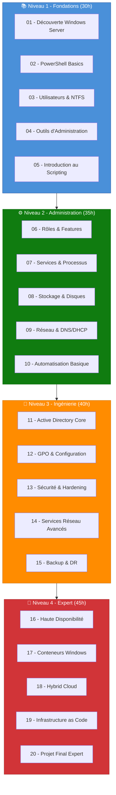

---
tags:
  - formation
  - windows-server
  - powershell
  - active-directory
  - expert
---

# Formation : Windows Server Mastery

**Devenez expert de l'écosystème Microsoft avec 150 heures de formation intensive.**

---

## Vue d'Ensemble

Cette formation complète vous transforme de débutant en **expert Windows Server** capable de concevoir, déployer et maintenir des infrastructures d'entreprise complexes. En 20 modules progressifs, vous maîtriserez PowerShell, Active Directory, la sécurité, le clustering, les conteneurs Windows et l'Infrastructure as Code.

```
┌────────────────────────────────────────────────────────────────┐
│                    WINDOWS SERVER MASTERY                       │
│                    150 heures • 20 modules                      │
├────────────────────────────────────────────────────────────────┤
│                                                                 │
│   Niveau 1          Niveau 2          Niveau 3      Niveau 4   │
│   FONDATIONS        ADMINISTRATION    INGÉNIERIE    EXPERT     │
│   ──────────        ──────────────    ──────────    ──────     │
│   30 heures         35 heures         40 heures     45 heures  │
│                                                                 │
│   [01] Découverte   [06] Rôles        [11] AD Core  [16] HA    │
│   [02] PowerShell   [07] Services     [12] GPO      [17] Cont. │
│   [03] Users/NTFS   [08] Stockage     [13] Sécurité [18] Hybr. │
│   [04] Outils       [09] Réseau       [14] Réseau   [19] IaC   │
│   [05] Scripting    [10] Automation   [15] Backup   [20] Projet│
│                                                                 │
│   + Ressources : Glossaire • Cheatsheet • Checklist Hardening  │
└────────────────────────────────────────────────────────────────┘
```

---

## Parcours de Formation



---

## Niveau 1 : Fondations (30 heures)

**Objectif :** Acquérir les bases essentielles de Windows Server et PowerShell.

| Module | Titre | Durée | Contenu Principal |
|--------|-------|-------|-------------------|
| [01](01-decouverte.md) | Découverte Windows Server | 6h | Éditions, Server Core vs GUI, sconfig, installation |
| [02](02-powershell-basics.md) | PowerShell Basics | 6h | Cmdlets, pipeline, objets, aide, navigation |
| [03](03-utilisateurs-ntfs.md) | Utilisateurs & NTFS | 6h | Comptes locaux, groupes, permissions NTFS, ACL |
| [04](04-outils-administration.md) | Outils d'Administration | 6h | WAC, MMC, RSAT, Event Viewer, Performance Monitor |
| [05](05-scripting-intro.md) | Introduction au Scripting | 6h | Variables, conditions, boucles, fonctions de base |

**Prérequis :** Aucun (niveau débutant accepté)

**Compétences acquises :**

- Installer et configurer Windows Server
- Naviguer efficacement avec PowerShell
- Gérer les utilisateurs et permissions de base
- Utiliser les outils d'administration graphiques et CLI

---

## Niveau 2 : Administration (35 heures)

**Objectif :** Maîtriser l'administration quotidienne d'un serveur Windows.

| Module | Titre | Durée | Contenu Principal |
|--------|-------|-------|-------------------|
| [06](06-roles-features.md) | Rôles & Features | 7h | Installation rôles, IIS, File Server, Print Services |
| [07](07-services-processus.md) | Services & Processus | 7h | Services Windows, planification, monitoring processus |
| [08](08-stockage-disques.md) | Stockage & Disques | 7h | Gestion disques, Storage Spaces, ReFS, iSCSI |
| [09](09-reseau-dns-dhcp.md) | Réseau & DNS/DHCP | 7h | Configuration IP, DNS Server, DHCP Server |
| [10](10-automatisation-basique.md) | Automatisation Basique | 7h | Scheduled Tasks, scripts de maintenance, WMI/CIM |

**Prérequis :** Niveau 1 validé

**Compétences acquises :**

- Déployer et configurer les rôles serveur courants
- Gérer les services et le stockage
- Configurer les services réseau (DNS/DHCP)
- Automatiser les tâches administratives courantes

---

## Niveau 3 : Ingénierie (40 heures)

**Objectif :** Implémenter des infrastructures Active Directory sécurisées.

| Module | Titre | Durée | Contenu Principal |
|--------|-------|-------|-------------------|
| [11](11-active-directory-core.md) | Active Directory Core | 8h | Domain, Forest, OU, Users, Groups, Réplication |
| [12](12-gpo-configuration.md) | GPO & Configuration | 8h | GPO design, preferences, WMI filters, Central Store |
| [13](13-securite-hardening.md) | Sécurité & Hardening | 8h | Tiering Model, LAPS, Protected Users, Audit |
| [14](14-services-reseau-avances.md) | Services Réseau Avancés | 8h | PKI/CA, NPS/RADIUS, DirectAccess, VPN |
| [15](15-backup-disaster-recovery.md) | Backup & Disaster Recovery | 8h | Windows Server Backup, Azure Backup, DFSR, AD Restore |

**Prérequis :** Niveau 2 validé

**Compétences acquises :**

- Concevoir et déployer Active Directory
- Implémenter des GPO complexes
- Sécuriser l'infrastructure selon le Tiering Model
- Mettre en place une stratégie de backup

---

## Niveau 4 : Expert (45 heures)

**Objectif :** Architecturer des solutions haute disponibilité et cloud-native.

| Module | Titre | Durée | Contenu Principal |
|--------|-------|-------|-------------------|
| [16](16-haute-disponibilite.md) | Haute Disponibilité | 9h | Failover Clustering, Network Load Balancing, SQL HA |
| [17](17-conteneurs-windows.md) | Conteneurs Windows | 9h | Docker, Windows Containers, Kubernetes, AKS |
| [18](18-hybrid-cloud.md) | Hybrid Cloud | 9h | Azure AD Connect, Azure Arc, Azure Site Recovery |
| [19](19-infrastructure-as-code.md) | Infrastructure as Code | 9h | PowerShell DSC, Ansible Windows, Terraform Azure |
| [20](20-projet-final.md) | Projet Final Expert | 9h | Infrastructure complète multi-tiers, présentation |

**Prérequis :** Niveau 3 validé

**Compétences acquises :**

- Implémenter le clustering et la haute disponibilité
- Déployer des applications conteneurisées
- Intégrer les services Azure hybrides
- Automatiser l'infrastructure avec IaC

---

## Ressources Complémentaires

| Ressource | Description |
|-----------|-------------|
| [Glossaire Windows](glossaire.md) | Définitions des termes techniques Windows Server |
| [Cheatsheet PowerShell](cheatsheet-powershell.md) | Référence rapide des cmdlets essentielles |
| [Cheatsheet AD](cheatsheet-active-directory.md) | Commandes Active Directory courantes |
| [Checklist Hardening](checklist-hardening.md) | Liste de contrôle sécurité Windows Server |

---

## Prérequis Techniques

### Environnement de Lab

=== "Lab Local (Recommandé)"
    ```yaml
    Configuration minimale:
      RAM: 16 GB (32 GB recommandé pour Niveau 4)
      CPU: 4 cores (8 recommandé)
      Disque: 200 GB SSD

    Hyperviseur:
      - Hyper-V (Windows 10/11 Pro)
      - VMware Workstation
      - VirtualBox

    VMs suggérées:
      DC01: Windows Server 2022 (4 GB, 60 GB)
      DC02: Windows Server 2022 (4 GB, 60 GB)
      SRV01: Windows Server 2022 (4 GB, 60 GB)
      CLIENT: Windows 11 (4 GB, 60 GB)
    ```

=== "Cloud (Azure/AWS)"
    ```yaml
    Azure Lab Services:
      - Windows Server 2022 Datacenter
      - Coût estimé: ~50-100€/mois
      - Arrêter les VMs après usage

    AWS:
      - t3.medium (2 vCPU, 4 GB)
      - AMI Windows Server 2022
      - Spot Instances pour réduire les coûts
    ```

=== "Evaluation Gratuite"
    ```powershell
    # Windows Server 2022 Evaluation (180 jours)
    # https://www.microsoft.com/evalcenter/evaluate-windows-server-2022

    # Windows 11 Enterprise Evaluation (90 jours)
    # https://www.microsoft.com/evalcenter/evaluate-windows-11-enterprise
    ```

### Logiciels Requis

| Outil | Version | Installation |
|-------|---------|--------------|
| Windows Server 2022 | 21H2+ | ISO Evaluation Center |
| PowerShell | 7.4+ | `winget install Microsoft.PowerShell` |
| Windows Terminal | Latest | `winget install Microsoft.WindowsTerminal` |
| VS Code | Latest | `winget install Microsoft.VisualStudioCode` |
| Git | Latest | `winget install Git.Git` |

---

## Méthodologie Pédagogique

### Approche Pratique

Chaque module suit cette progression :

```
┌─────────────────────────────────────────────────────────────┐
│                    STRUCTURE D'UN MODULE                     │
├─────────────────────────────────────────────────────────────┤
│                                                              │
│  1. OBJECTIFS          Compétences visées, prérequis        │
│     ───────────────────────────────────────────────         │
│                                                              │
│  2. CONCEPTS           Théorie essentielle, architecture    │
│     ───────────────────────────────────────────────         │
│                                                              │
│  3. PRATIQUE           Démonstrations pas à pas             │
│     ───────────────────────────────────────────────         │
│                                                              │
│  4. EXERCICES          Scénarios réels à résoudre           │
│     ───────────────────────────────────────────────         │
│                                                              │
│  5. SOLUTIONS          Corrections détaillées               │
│     ───────────────────────────────────────────────         │
│                                                              │
│  6. QUIZ               Validation des acquis                │
│     ───────────────────────────────────────────────         │
│                                                              │
└─────────────────────────────────────────────────────────────┘
```

### PowerShell First

!!! quote "Philosophie"
    **Ce que vous scriptez avec PowerShell, vous pouvez le reproduire 1000 fois.**
    **Ce que vous cliquez dans le GUI, vous devrez le recliquer 1000 fois.**

Nous privilégions PowerShell pour :

- La reproductibilité
- L'automatisation
- La documentation (le script EST la documentation)
- La préparation aux environnements Cloud (Azure CLI, AWS CLI)

---

## Certifications Couvertes

Cette formation prépare aux certifications Microsoft suivantes :

| Certification | Couverture | Modules Principaux |
|--------------|------------|-------------------|
| **AZ-800** : Administering Windows Server Hybrid Core Infrastructure | 80% | 1-10, 16, 18 |
| **AZ-801** : Configuring Windows Server Hybrid Advanced Services | 70% | 11-15, 16-18 |
| **AZ-104** : Microsoft Azure Administrator | 40% | 17, 18, 19 |
| **SC-300** : Microsoft Identity and Access Administrator | 50% | 11, 12, 13, 18 |

!!! warning "Avertissement"
    Cette formation n'est pas une préparation officielle aux certifications Microsoft.
    Elle fournit les compétences pratiques nécessaires, à compléter avec Microsoft Learn.

---

## Support & Communauté

- **Documentation Microsoft :** [Microsoft Learn](https://learn.microsoft.com/windows-server/)
- **PowerShell Docs :** [docs.microsoft.com/powershell](https://docs.microsoft.com/powershell/)
- **GitHub ShellBook :** [Issues & Discussions](https://github.com/VBlackJack/ShellBook)
- **Reddit :** [r/PowerShell](https://reddit.com/r/PowerShell), [r/sysadmin](https://reddit.com/r/sysadmin)

---

## Commencer la Formation

### Checklist Avant de Démarrer

- [ ] Hyperviseur installé (Hyper-V, VMware ou VirtualBox)
- [ ] ISO Windows Server 2022 téléchargé
- [ ] 16 GB RAM minimum disponible
- [ ] 200 GB espace disque disponible
- [ ] VS Code installé avec extensions PowerShell

### Ordre des Modules


**Commencez par le [Module 01 : Découverte Windows Server](01-decouverte.md)**

---

**Durée totale :** 150 heures
**Niveau :** Débutant à Expert
**Format :** Auto-formation progressive avec exercices pratiques
