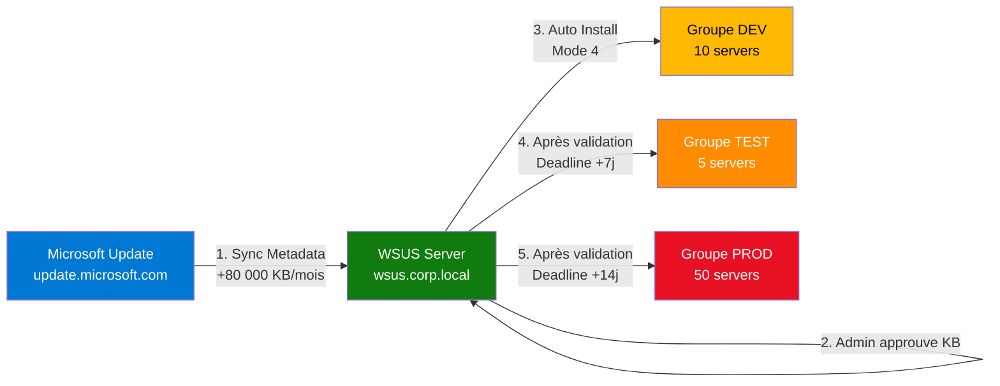
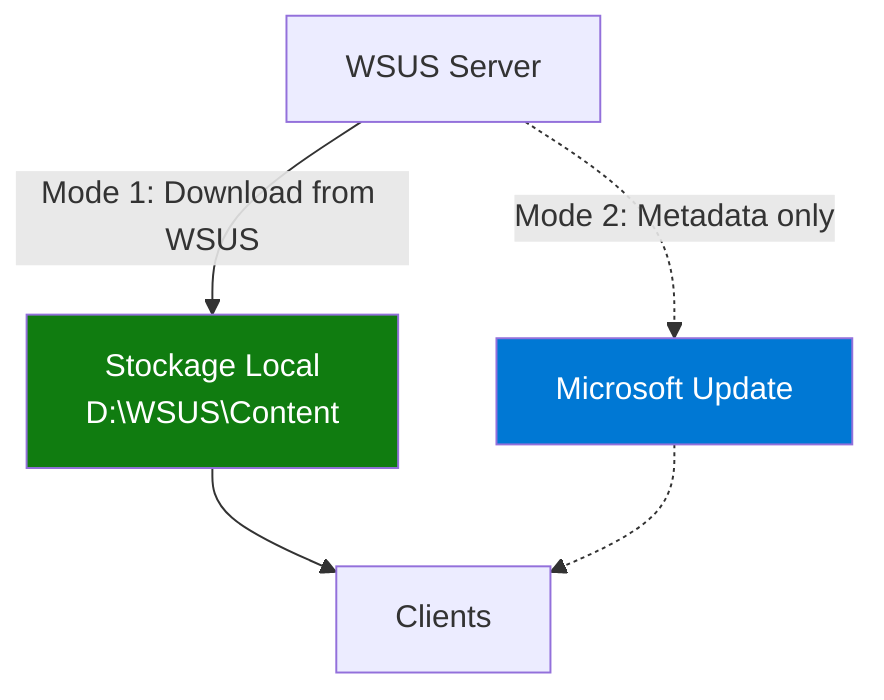

# Module 1 : Architecture & Installation WSUS

!!! info "Objectifs du module"
    - 🏗️ Comprendre l'architecture WSUS et les flux de synchronisation
    - 💾 Choisir entre WID et SQL Server pour la base de données
    - 📦 Maîtriser la stratégie de stockage (Content vs Metadata)
    - 💻 Installer WSUS via PowerShell
    - 🔄 Effectuer la première synchronisation

---

## 📘 Concept : Architecture WSUS

### 🌐 Le problème à résoudre

**Sans WSUS** : Chaque serveur/poste télécharge individuellement ses mises à jour depuis Microsoft Update.

❌ **Inconvénients** :
- Bande passante Internet saturée (100 serveurs × 500 MB de KB par mois = **50 GB**)
- Aucun contrôle sur les versions déployées
- Risque de régression en production (KB défectueux appliqué immédiatement)
- Pas de reporting centralisé

**Avec WSUS** : Un serveur central synchronise une fois, redistribue en interne.

✅ **Avantages** :
- Économie de bande passante (téléchargement unique)
- Contrôle des approbations (Ring Deployment : Dev → Test → Prod)
- Visibilité sur le taux de conformité
- Planification des maintenances (deadlines, installation forcée)

---

### 🏗️ Architecture de flux



**Workflow détaillé** :

1. **Synchronization** : WSUS contacte Microsoft Update (1×/jour par défaut)
   - Télécharge les **métadonnées** des KB disponibles (titre, description, prérequis)
   - Optionnel : Télécharge les **binaires** (.cab, .msu, .psf) si approuvé

2. **Approval** : L'administrateur valide les KB par groupe
   - KB5034441 → Approuvé pour **DEV** (installation immédiate)
   - Après 48h de tests → Approuvé pour **TEST** (deadline : +7 jours)
   - Après validation finale → Approuvé pour **PROD** (deadline : +14 jours)

3. **Client Detection** : Les clients contactent WSUS toutes les 22h (par défaut via GPO)
   - Envoient leur inventaire (OS version, KB installés)
   - Reçoivent la liste des KB approuvés pour leur groupe
   - Téléchargent et installent selon le mode configuré (Mode 4 = Auto)

4. **Reporting** : Les clients remontent leur statut à WSUS
   - Needed, Downloaded, Installed, Failed, Not Applicable

---

### 💾 Base de données : WID vs SQL Server

WSUS stocke ses métadonnées dans une base de données. Deux options :

#### Option 1 : WID (Windows Internal Database)

```powershell
# Installation avec WID (base de données intégrée)
Install-WindowsFeature UpdateServices -IncludeManagementTools
```

✅ **Avantages** :
- Gratuit (inclus dans Windows Server)
- Installation simplifiée (1 commande)
- Gestion automatique (pas de maintenance SQL)

❌ **Limites** :
- Capacité maximale : **~30 000 clients** (selon Microsoft)
- Pas d'accès direct SQL (impossible de faire des requêtes custom)
- Performances limitées pour les grands déploiements

**💡 Recommandation** : WID pour <10 000 clients

---

#### Option 2 : SQL Server

```powershell
# Installation avec SQL Server externe
Install-WindowsFeature UpdateServices -IncludeManagementTools
# Puis configuration wsusutil avec connexion SQL
```

✅ **Avantages** :
- Scalabilité : Supporte **>100 000 clients**
- Requêtes SQL custom (reporting avancé)
- Haute disponibilité (AlwaysOn, Clustering)
- Séparation des rôles (WSUS Server ≠ DB Server)

❌ **Inconvénients** :
- Coût licence SQL Server (Standard ou Enterprise)
- Complexité de gestion (DBA nécessaire)
- Maintenance SQL (backups, index, logs)

**💡 Recommandation** : SQL Server pour >10 000 clients ou besoins HA

---

### 📦 Stratégie de stockage

WSUS peut stocker deux types de données :

#### 1. Metadata (Obligatoire)

- Base de données WID/SQL (~10-50 GB selon historique)
- Titres, descriptions, prérequis, supersedence des KB
- Statut d'approbation par groupe
- Inventaire clients (OS version, KB installés)

#### 2. Content (Optionnel)

- Binaires des mises à jour (.cab, .msu, .psf)
- Taille : **~200-500 GB** pour Windows Server + Defender + SQL + Office
- Deux modes de stockage :



**Mode 1 : Store updates locally** (Recommandé)
```powershell
# Les binaires sont téléchargés et stockés sur WSUS
Set-WsusServerSynchronization -UpdateSource MicrosoftUpdate
# Avantages : Rapidité LAN (1 Gbps), pas de dépendance Internet
# Inconvénients : Consomme du stockage (~400 GB)
```

**Mode 2 : Metadata only**
```powershell
# WSUS ne stocke que les métadonnées
# Les clients téléchargent directement depuis Microsoft Update
# Avantages : Économie de stockage
# Inconvénients : Bande passante Internet × nb_clients
```

**💡 Recommandation** : Mode 1 (stockage local) pour optimiser la bande passante Internet.

---

## 💻 Pratique : Installation PowerShell

### Étape 1 : Installer le rôle UpdateServices

```powershell
# Vérifier que le serveur a au moins 200 GB libres
Get-Volume | Where-Object {$_.DriveLetter -eq 'D'} |
    Select-Object DriveLetter,
                  @{N='FreeSpace_GB';E={[math]::Round($_.SizeRemaining/1GB,2)}}

# Output attendu :
# DriveLetter FreeSpace_GB
# ----------- ------------
# D                  450.23
```

```powershell
# Installation du rôle (durée : ~5 min)
Install-WindowsFeature -Name UpdateServices -IncludeManagementTools

# Output :
# Success Restart Needed Exit Code      Feature Result
# ------- -------------- ---------      --------------
# True    No             Success        {Windows Server Update Services}
```

!!! warning "Redémarrage requis ?"
    L'installation du rôle ne nécessite **PAS** de redémarrage. Cependant, si des mises à jour Windows sont en attente, le serveur peut le demander.

---

### Étape 2 : Post-configuration avec wsusutil

```powershell
# Définir le chemin de stockage (IMPORTANT : utiliser un volume dédié)
$ContentPath = "D:\WSUS"

# Créer le répertoire
New-Item -Path $ContentPath -ItemType Directory -Force

# Lancer la post-installation
$WSUSUtil = "C:\Program Files\Update Services\Tools\wsusutil.exe"
& $WSUSUtil postinstall CONTENT_DIR=$ContentPath

# Output attendu :
# Post-install has successfully completed.
```

**Ce que fait `wsusutil postinstall`** :
1. Initialise la base WID (`SUSDB`)
2. Crée la structure de répertoires dans `D:\WSUS`
3. Configure IIS (crée le vPool `WsusPool`, site `WSUS Administration` sur port **8530**)
4. Génère le certificat auto-signé pour HTTPS (si activé)

!!! tip "Vérification"
    Après post-install, accédez à la console :
    ```powershell
    # Lancer WSUS Console
    UpdateServices.msc
    ```
    Ou via URL : `http://localhost:8530`

---

### Étape 3 : Configuration initiale

```powershell
# Récupérer l'objet serveur WSUS
$WSUSServer = Get-WsusServer

# Afficher la version
$WSUSServer.Version
# Output : 10.0.20348.1 (Windows Server 2022)

# Configurer la synchronization depuis Microsoft Update
Set-WsusServerSynchronization -SyncFromMU

# Vérifier la config
Get-WsusServerSynchronization | Select-Object SyncFromMU, LastSyncTime

# Output :
# SyncFromMU LastSyncTime
# ---------- ------------
# True       (null)  ← Normal, jamais synchronisé
```

---

### Étape 4 : Sélectionner les produits et classifications

**Par défaut, WSUS synchronise TOUS les produits Microsoft (Office, SQL, Exchange, etc.)**. Cela représente **+500 GB** de binaires !

Il faut **restreindre** aux produits utilisés dans votre infrastructure.

```powershell
# Lister tous les produits disponibles
Get-WsusProduct | Select-Object Product | Sort-Object

# Output (extrait) :
# Product
# -------
# Windows 10
# Windows 11
# Windows Server 2016
# Windows Server 2019
# Windows Server 2022
# SQL Server 2019
# Microsoft Defender Antivirus
# ...

# Désélectionner TOUS les produits
Get-WsusProduct | Set-WsusProduct -Disable

# Sélectionner UNIQUEMENT Windows Server 2022
Get-WsusProduct | Where-Object {
    $_.Product.Title -eq "Windows Server 2022"
} | Set-WsusProduct

# Vérifier
Get-WsusProduct | Where-Object {$_.Product.IsSelected -eq $true} |
    Select-Object -ExpandProperty Product | Select-Object Title

# Output :
# Title
# -----
# Windows Server 2022
```

```powershell
# Sélectionner les Classifications (types de mises à jour)
Get-WsusClassification | Select-Object Classification | Sort-Object

# Output :
# Classification
# --------------
# Critical Updates
# Security Updates
# Definition Updates (Defender)
# Service Packs
# Update Rollups
# Updates
# ...

# Désélectionner tout
Get-WsusClassification | Set-WsusClassification -Disable

# Sélectionner Critical + Security + Definition Updates
$Classifications = @(
    "Critical Updates",
    "Security Updates",
    "Definition Updates"
)

Get-WsusClassification | Where-Object {
    $Classifications -contains $_.Classification.Title
} | Set-WsusClassification

# Vérifier
Get-WsusClassification | Where-Object {$_.Classification.IsSelected -eq $true} |
    Select-Object -ExpandProperty Classification | Select-Object Title
```

---

### Étape 5 : Première synchronisation

```powershell
# Configurer la synchronisation automatique (1×/jour à 3h00)
$Subscription = $WSUSServer.GetSubscription()
$Subscription.SynchronizeAutomatically = $true
$Subscription.SynchronizeAutomaticallyTimeOfDay = (New-TimeSpan -Hours 3)
$Subscription.NumberOfSynchronizationsPerDay = 1
$Subscription.Save()

# Lancer la première sync MANUELLEMENT (durée : 15-60 min selon bande passante)
Write-Host "🔄 Lancement de la synchronisation..." -ForegroundColor Cyan
$Subscription.StartSynchronization()

# Surveiller la progression
while ($Subscription.GetSynchronizationStatus() -eq 'Running') {
    Write-Host "⏳ Synchronisation en cours... Patientez." -ForegroundColor Yellow
    Start-Sleep -Seconds 30
}

# Vérifier le résultat
$Subscription.GetLastSynchronizationInfo()

# Output attendu :
# Result       : Succeeded
# StartTime    : 22/11/2025 14:35:12
# EndTime      : 22/11/2025 14:52:47
# UpdatesDownloaded : 1247
```

!!! success "Sync réussie !"
    Si `Result = Succeeded`, votre WSUS a téléchargé les métadonnées de **~1200 KB** pour Windows Server 2022 (Critical + Security + Defender).

---

### Étape 6 : Vérifier le contenu téléchargé

```powershell
# Compter le nombre de KB disponibles
$AllUpdates = Get-WsusUpdate -Approval Unapproved -Status Any
Write-Host "📦 Nombre de KB disponibles : $($AllUpdates.Count)" -ForegroundColor Green

# Afficher les 10 dernières KB de sécurité
Get-WsusUpdate -Approval Unapproved -Classification Security |
    Select-Object -First 10 -Property Title, CreationDate |
    Format-Table -AutoSize

# Output (exemple) :
# Title                                                          CreationDate
# -----                                                          ------------
# 2025-01 Cumulative Update for Windows Server 2022 (KB5034441) 09/01/2025 00:00:00
# 2024-12 Security Update for .NET Framework 4.8 (KB5033909)    12/12/2024 00:00:00
# ...
```

```powershell
# Vérifier l'espace disque utilisé
Get-ChildItem -Path "D:\WSUS" -Recurse |
    Measure-Object -Property Length -Sum |
    Select-Object @{N='Size_GB';E={[math]::Round($_.Sum/1GB,2)}}

# Output attendu après 1ère sync :
# Size_GB
# -------
# 15.34  ← Metadata uniquement (aucun binaire approuvé)
```

!!! info "Pourquoi si peu de GB ?"
    Lors de la première synchronisation, WSUS télécharge uniquement les **métadonnées** (descriptions des KB). Les **binaires** (.cab, .msu) ne sont téléchargés qu'après **approbation** d'une mise à jour.

---

## 🎓 Exercice : "First Sync"

### 📋 Contexte

Votre entreprise **FinanceCorp** dispose de 30 serveurs Windows Server 2022 en production. Le RSSI exige un déploiement contrôlé des mises à jour de sécurité pour éviter les régressions.

Vous devez déployer un serveur WSUS de test pour valider le concept.

---

### 🎯 Objectifs

1. ✅ Installer WSUS sur **SRV-WSUS-01** (Windows Server 2022)
2. ✅ Configurer le stockage sur **D:\WSUS** (volume dédié de 300 GB)
3. ✅ Sélectionner **UNIQUEMENT** :
   - Produit : **Windows Server 2022**
   - Classifications : **Security Updates** (pas Critical, pas Definition Updates)
4. ✅ Effectuer la première synchronisation
5. ✅ Vérifier qu'au moins **800 KB de sécurité** sont disponibles

---

### 📝 Travail à réaliser

Créez un script `Deploy-WSUS.ps1` qui automatise les étapes suivantes :

```powershell
# Deploy-WSUS.ps1
# Auteur : Votre nom
# Date : 22/11/2025
# Description : Installation automatisée de WSUS pour FinanceCorp

#Requires -RunAsAdministrator

# TODO 1 : Installer le rôle UpdateServices avec outils de gestion

# TODO 2 : Créer le répertoire D:\WSUS

# TODO 3 : Exécuter wsusutil postinstall avec CONTENT_DIR=D:\WSUS

# TODO 4 : Configurer la synchronization depuis Microsoft Update

# TODO 5 : Désélectionner tous les produits

# TODO 6 : Sélectionner UNIQUEMENT "Windows Server 2022"

# TODO 7 : Désélectionner toutes les classifications

# TODO 8 : Sélectionner UNIQUEMENT "Security Updates"

# TODO 9 : Configurer sync auto à 2h00 du matin (1×/jour)

# TODO 10 : Lancer la première sync et attendre la fin

# TODO 11 : Afficher le nombre de KB de sécurité disponibles
```

---

### ✅ Critères de validation

| Critère | Vérification |
|---------|--------------|
| Rôle installé | `Get-WindowsFeature UpdateServices` → `Installed = True` |
| Répertoire créé | `Test-Path D:\WSUS` → `True` |
| Post-install OK | `Test-Path "C:\Program Files\Update Services\WebServices"` → `True` |
| 1 seul produit | `(Get-WsusProduct | Where IsSelected).Count` → `1` |
| 1 seule classification | `(Get-WsusClassification | Where IsSelected).Count` → `1` |
| Sync réussie | `$Sub.GetLastSynchronizationInfo().Result` → `Succeeded` |
| KB disponibles | `(Get-WsusUpdate -Classification Security).Count` → `>= 800` |

---

### 💡 Solution complète

??? quote "Cliquez pour révéler la solution"

    ```powershell
    # Deploy-WSUS.ps1
    # Installation automatisée de WSUS pour FinanceCorp
    # Auteur : ShellBook Training
    # Date : 22/11/2025

    #Requires -RunAsAdministrator

    # ============================================
    # CONFIGURATION
    # ============================================
    $ContentPath = "D:\WSUS"
    $ProductName = "Windows Server 2022"
    $ClassificationName = "Security Updates"
    $SyncTime = New-TimeSpan -Hours 2  # 02:00 AM

    # ============================================
    # ÉTAPE 1 : INSTALLATION DU RÔLE
    # ============================================
    Write-Host "`n[1/10] Installation du rôle UpdateServices..." -ForegroundColor Cyan

    $Feature = Get-WindowsFeature -Name UpdateServices
    if ($Feature.Installed -eq $false) {
        Install-WindowsFeature -Name UpdateServices -IncludeManagementTools | Out-Null
        Write-Host "✅ Rôle installé avec succès" -ForegroundColor Green
    } else {
        Write-Host "ℹ️  Rôle déjà installé" -ForegroundColor Yellow
    }

    # ============================================
    # ÉTAPE 2 : CRÉATION DU RÉPERTOIRE
    # ============================================
    Write-Host "`n[2/10] Création du répertoire de stockage..." -ForegroundColor Cyan

    if (-not (Test-Path $ContentPath)) {
        New-Item -Path $ContentPath -ItemType Directory -Force | Out-Null
        Write-Host "✅ Répertoire créé : $ContentPath" -ForegroundColor Green
    } else {
        Write-Host "ℹ️  Répertoire existant : $ContentPath" -ForegroundColor Yellow
    }

    # ============================================
    # ÉTAPE 3 : POST-CONFIGURATION WSUSUTIL
    # ============================================
    Write-Host "`n[3/10] Post-configuration WSUS..." -ForegroundColor Cyan

    $WSUSUtil = "C:\Program Files\Update Services\Tools\wsusutil.exe"
    if (Test-Path $WSUSUtil) {
        $PostInstallResult = & $WSUSUtil postinstall CONTENT_DIR=$ContentPath 2>&1

        if ($PostInstallResult -match "successfully completed") {
            Write-Host "✅ Post-install réussie" -ForegroundColor Green
        } else {
            Write-Host "⚠️  Post-install déjà effectuée ou erreur" -ForegroundColor Yellow
        }
    } else {
        Write-Host "❌ wsusutil.exe introuvable" -ForegroundColor Red
        exit 1
    }

    # Attendre que le service WSUS démarre
    Start-Sleep -Seconds 10

    # ============================================
    # ÉTAPE 4 : CONFIGURATION SYNCHRONIZATION
    # ============================================
    Write-Host "`n[4/10] Configuration de la synchronisation..." -ForegroundColor Cyan

    try {
        $WSUSServer = Get-WsusServer
        Set-WsusServerSynchronization -SyncFromMU
        Write-Host "✅ Synchronisation configurée depuis Microsoft Update" -ForegroundColor Green
    } catch {
        Write-Host "❌ Erreur : $_" -ForegroundColor Red
        exit 1
    }

    # ============================================
    # ÉTAPE 5 : DÉSÉLECTION DE TOUS LES PRODUITS
    # ============================================
    Write-Host "`n[5/10] Désélection de tous les produits..." -ForegroundColor Cyan

    Get-WsusProduct | Set-WsusProduct -Disable
    Write-Host "✅ Tous les produits désélectionnés" -ForegroundColor Green

    # ============================================
    # ÉTAPE 6 : SÉLECTION WINDOWS SERVER 2022
    # ============================================
    Write-Host "`n[6/10] Sélection du produit '$ProductName'..." -ForegroundColor Cyan

    $Product = Get-WsusProduct | Where-Object {
        $_.Product.Title -eq $ProductName
    }

    if ($Product) {
        $Product | Set-WsusProduct
        Write-Host "✅ Produit sélectionné : $ProductName" -ForegroundColor Green
    } else {
        Write-Host "❌ Produit '$ProductName' introuvable" -ForegroundColor Red
        exit 1
    }

    # ============================================
    # ÉTAPE 7 : DÉSÉLECTION TOUTES CLASSIFICATIONS
    # ============================================
    Write-Host "`n[7/10] Désélection de toutes les classifications..." -ForegroundColor Cyan

    Get-WsusClassification | Set-WsusClassification -Disable
    Write-Host "✅ Toutes les classifications désélectionnées" -ForegroundColor Green

    # ============================================
    # ÉTAPE 8 : SÉLECTION SECURITY UPDATES
    # ============================================
    Write-Host "`n[8/10] Sélection de la classification '$ClassificationName'..." -ForegroundColor Cyan

    $Classification = Get-WsusClassification | Where-Object {
        $_.Classification.Title -eq $ClassificationName
    }

    if ($Classification) {
        $Classification | Set-WsusClassification
        Write-Host "✅ Classification sélectionnée : $ClassificationName" -ForegroundColor Green
    } else {
        Write-Host "❌ Classification '$ClassificationName' introuvable" -ForegroundColor Red
        exit 1
    }

    # ============================================
    # ÉTAPE 9 : CONFIGURATION SYNC AUTOMATIQUE
    # ============================================
    Write-Host "`n[9/10] Configuration de la synchronisation automatique..." -ForegroundColor Cyan

    $Subscription = $WSUSServer.GetSubscription()
    $Subscription.SynchronizeAutomatically = $true
    $Subscription.SynchronizeAutomaticallyTimeOfDay = $SyncTime
    $Subscription.NumberOfSynchronizationsPerDay = 1
    $Subscription.Save()

    Write-Host "✅ Sync automatique : 1×/jour à $($SyncTime.Hours):00" -ForegroundColor Green

    # ============================================
    # ÉTAPE 10 : PREMIÈRE SYNCHRONISATION
    # ============================================
    Write-Host "`n[10/10] Lancement de la première synchronisation..." -ForegroundColor Cyan
    Write-Host "⏳ Cette opération peut prendre 15-60 minutes selon votre connexion Internet" -ForegroundColor Yellow

    $Subscription.StartSynchronization()

    # Barre de progression
    $i = 0
    while ($Subscription.GetSynchronizationStatus() -eq 'Running') {
        $i++
        Write-Host "." -NoNewline -ForegroundColor Cyan
        if ($i % 60 -eq 0) { Write-Host " [$i sec]" -ForegroundColor Yellow }
        Start-Sleep -Seconds 1
    }
    Write-Host ""

    # Résultat de la sync
    $SyncInfo = $Subscription.GetLastSynchronizationInfo()

    if ($SyncInfo.Result -eq 'Succeeded') {
        Write-Host "✅ Synchronisation réussie !" -ForegroundColor Green
        Write-Host "   Début  : $($SyncInfo.StartTime)" -ForegroundColor Gray
        Write-Host "   Fin    : $($SyncInfo.EndTime)" -ForegroundColor Gray
        Write-Host "   Durée  : $([math]::Round(($SyncInfo.EndTime - $SyncInfo.StartTime).TotalMinutes, 2)) min" -ForegroundColor Gray
    } else {
        Write-Host "❌ Échec de la synchronisation : $($SyncInfo.Result)" -ForegroundColor Red
        exit 1
    }

    # ============================================
    # VALIDATION FINALE
    # ============================================
    Write-Host "`n========================================" -ForegroundColor Cyan
    Write-Host "         RAPPORT DE VALIDATION          " -ForegroundColor Cyan
    Write-Host "========================================`n" -ForegroundColor Cyan

    # CHECK 1 : Produits sélectionnés
    $SelectedProducts = Get-WsusProduct | Where-Object {$_.Product.IsSelected -eq $true}
    $ProductCount = $SelectedProducts.Count

    if ($ProductCount -eq 1 -and $SelectedProducts.Product.Title -eq $ProductName) {
        Write-Host "✅ CHECK 1 : 1 seul produit sélectionné ($ProductName)" -ForegroundColor Green
    } else {
        Write-Host "❌ CHECK 1 : $ProductCount produits sélectionnés (attendu : 1)" -ForegroundColor Red
    }

    # CHECK 2 : Classifications sélectionnées
    $SelectedClassifications = Get-WsusClassification | Where-Object {$_.Classification.IsSelected -eq $true}
    $ClassificationCount = $SelectedClassifications.Count

    if ($ClassificationCount -eq 1 -and $SelectedClassifications.Classification.Title -eq $ClassificationName) {
        Write-Host "✅ CHECK 2 : 1 seule classification sélectionnée ($ClassificationName)" -ForegroundColor Green
    } else {
        Write-Host "❌ CHECK 2 : $ClassificationCount classifications sélectionnées (attendu : 1)" -ForegroundColor Red
    }

    # CHECK 3 : Dernière synchronisation
    $LastSync = $Subscription.GetLastSynchronizationInfo()
    if ($LastSync.Result -eq 'Succeeded') {
        Write-Host "✅ CHECK 3 : Dernière sync réussie ($($LastSync.EndTime))" -ForegroundColor Green
    } else {
        Write-Host "❌ CHECK 3 : Sync en échec ($($LastSync.Result))" -ForegroundColor Red
    }

    # CHECK 4 : Nombre de KB disponibles
    $SecurityUpdates = Get-WsusUpdate -Approval Unapproved -Classification Security
    $KBCount = $SecurityUpdates.Count

    if ($KBCount -ge 800) {
        Write-Host "✅ CHECK 4 : $KBCount KB de sécurité disponibles (>= 800)" -ForegroundColor Green
    } else {
        Write-Host "⚠️  CHECK 4 : $KBCount KB de sécurité disponibles (< 800)" -ForegroundColor Yellow
        Write-Host "   Note : Ceci peut être normal si Microsoft a nettoyé l'historique" -ForegroundColor Gray
    }

    # CHECK 5 : Espace disque utilisé
    $WSUSSize = (Get-ChildItem -Path $ContentPath -Recurse -ErrorAction SilentlyContinue |
                 Measure-Object -Property Length -Sum).Sum
    $WSUSSize_GB = [math]::Round($WSUSSize / 1GB, 2)

    if ($WSUSSize_GB -gt 0) {
        Write-Host "✅ CHECK 5 : Espace utilisé : $WSUSSize_GB GB" -ForegroundColor Green
    } else {
        Write-Host "⚠️  CHECK 5 : Espace utilisé : $WSUSSize_GB GB" -ForegroundColor Yellow
    }

    # ============================================
    # RÉSUMÉ FINAL
    # ============================================
    Write-Host "`n========================================" -ForegroundColor Cyan
    Write-Host "           DÉPLOIEMENT TERMINÉ          " -ForegroundColor Cyan
    Write-Host "========================================`n" -ForegroundColor Cyan

    Write-Host "📊 Statistiques :" -ForegroundColor White
    Write-Host "   • Produits sélectionnés    : $ProductCount" -ForegroundColor Gray
    Write-Host "   • Classifications sélect.  : $ClassificationCount" -ForegroundColor Gray
    Write-Host "   • KB de sécurité dispos.   : $KBCount" -ForegroundColor Gray
    Write-Host "   • Espace disque utilisé    : $WSUSSize_GB GB" -ForegroundColor Gray
    Write-Host "   • Dernière sync            : $($LastSync.EndTime)" -ForegroundColor Gray

    Write-Host "`n🎓 Prochaine étape : Ouvrez la console WSUS" -ForegroundColor Cyan
    Write-Host "   UpdateServices.msc" -ForegroundColor Yellow
    Write-Host "   ou http://localhost:8530`n" -ForegroundColor Yellow
    ```

    **Exécution** :
    ```powershell
    .\Deploy-WSUS.ps1
    ```

    **Output attendu** :
    ```
    [1/10] Installation du rôle UpdateServices...
    ✅ Rôle installé avec succès

    [2/10] Création du répertoire de stockage...
    ✅ Répertoire créé : D:\WSUS

    [3/10] Post-configuration WSUS...
    ✅ Post-install réussie

    [4/10] Configuration de la synchronisation...
    ✅ Synchronisation configurée depuis Microsoft Update

    [5/10] Désélection de tous les produits...
    ✅ Tous les produits désélectionnés

    [6/10] Sélection du produit 'Windows Server 2022'...
    ✅ Produit sélectionné : Windows Server 2022

    [7/10] Désélection de toutes les classifications...
    ✅ Toutes les classifications désélectionnées

    [8/10] Sélection de la classification 'Security Updates'...
    ✅ Classification sélectionnée : Security Updates

    [9/10] Configuration de la synchronisation automatique...
    ✅ Sync automatique : 1×/jour à 2:00

    [10/10] Lancement de la première synchronisation...
    ⏳ Cette opération peut prendre 15-60 minutes selon votre connexion Internet
    ............................. [60 sec]
    ............................. [120 sec]
    ...
    ✅ Synchronisation réussie !
       Début  : 22/11/2025 14:35:12
       Fin    : 22/11/2025 14:52:47
       Durée  : 17.58 min

    ========================================
             RAPPORT DE VALIDATION
    ========================================

    ✅ CHECK 1 : 1 seul produit sélectionné (Windows Server 2022)
    ✅ CHECK 2 : 1 seule classification sélectionnée (Security Updates)
    ✅ CHECK 3 : Dernière sync réussie (22/11/2025 14:52:47)
    ✅ CHECK 4 : 1247 KB de sécurité disponibles (>= 800)
    ✅ CHECK 5 : Espace utilisé : 15.34 GB

    ========================================
               DÉPLOIEMENT TERMINÉ
    ========================================

    📊 Statistiques :
       • Produits sélectionnés    : 1
       • Classifications sélect.  : 1
       • KB de sécurité dispos.   : 1247
       • Espace disque utilisé    : 15.34 GB
       • Dernière sync            : 22/11/2025 14:52:47

    🎓 Prochaine étape : Ouvrez la console WSUS
       UpdateServices.msc
       ou http://localhost:8530
    ```

---

## 🎯 Points clés à retenir

!!! success "Checklist Module 1"
    - ✅ WSUS centralise les mises à jour pour économiser la bande passante Internet
    - ✅ Architecture : Microsoft Update → WSUS → Groupes (Dev/Test/Prod)
    - ✅ Base de données : WID (<10K clients) vs SQL Server (>10K clients)
    - ✅ Stockage : Metadata (obligatoire) + Content (optionnel mais recommandé)
    - ✅ Installation : `Install-WindowsFeature UpdateServices` + `wsusutil postinstall`
    - ✅ Configuration : Sélectionner uniquement les produits/classifications nécessaires
    - ✅ Première sync : Télécharge les métadonnées (~15-60 min)
    - ✅ Binaires : Téléchargés uniquement après approbation d'une KB

---

## 🔗 Ressources complémentaires

- [Microsoft Learn : Deploy WSUS](https://learn.microsoft.com/en-us/windows-server/administration/windows-server-update-services/deploy/deploy-windows-server-update-services)
- [PowerShell Module : UpdateServices](https://learn.microsoft.com/en-us/powershell/module/updateservices/)
- [Guide ShellBook : Update Management](../../windows/update-management.md)

---

## ➡️ Prochaine étape

Rendez-vous au **[Module 2 : Gestion des Mises à Jour](#)** pour apprendre à :
- Créer des groupes de clients (Dev/Test/Prod)
- Approuver des KB par groupe
- Configurer des règles d'approbation automatique
- Mettre en place un Ring Deployment

---

!!! quote "Citation du formateur"
    *"La première synchronisation WSUS est comme un inventaire : elle ne télécharge que le catalogue (metadata). Les produits (binaires) ne quittent l'entrepôt qu'après validation du bon de commande (approbation)."* — ShellBook Training

---

**Retour au :** [Programme de la Formation](index.md) | [Catalogue des Formations](../index.md)
