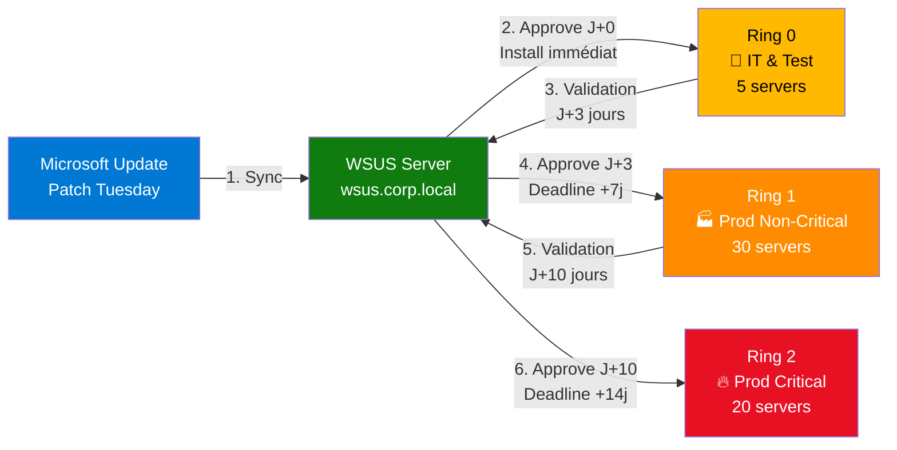

# Module 2 : Approbation & Ciblage - La Stratégie des Anneaux

!!! info "Objectifs du module"
    - 🎯 Comprendre la stratégie des **Deployment Rings** (anneaux de déploiement)
    - 👥 Créer et gérer des **Computer Target Groups** (groupes de machines)
    - 🔍 Rechercher et filtrer les mises à jour par critères
    - ✅ Approuver des KB pour des groupes spécifiques
    - 🧹 Nettoyer les mises à jour obsolètes (superseded)
    - 📅 Automatiser le workflow Patch Tuesday

---

## 📘 Concept : La Stratégie des Anneaux

### ⚠️ Don't Break Production

**Scénario catastrophe** (vécu en production) :

> **Patch Tuesday - 14 janvier 2025, 02:00**
>
> Un administrateur approuve la mise à jour KB5034441 pour **TOUS** les serveurs de production.
>
> **06:00** : 50 serveurs SQL Server redémarrent simultanément après installation.
>
> **06:15** : L'application métier critique plante au démarrage (régression introduite par la KB).
>
> **06:30** : 200 utilisateurs bloqués, le helpdesk explose.
>
> **08:00** : Rollback d'urgence, mais les données de la nuit sont perdues.
>
> **Coût estimé** : 500K€ de chiffre d'affaires + 2 semaines de restauration.

**La leçon** : **JAMAIS** déployer une mise à jour directement en production sans validation.

---

### 🎯 La solution : Deployment Rings (Anneaux de Déploiement)

**Principe** : Déployer progressivement les mises à jour par "anneaux" concentriques, du moins critique au plus critique.



**Détail du workflow** :

| Étape | Ring | Machines | Délai | Action |
|-------|------|----------|-------|--------|
| 1 | **Ring 0** (Canary) | Serveurs IT, VM de test | **J+0** | Approbation immédiate + installation auto |
| 2 | Validation | Équipe IT teste les applications | **J+0 → J+3** | Tests fonctionnels, monitoring logs |
| 3 | **Ring 1** (Prod Non-Critical) | Serveurs secondaires (fichiers, print) | **J+3** | Approbation avec deadline +7 jours |
| 4 | Validation | Monitoring production | **J+3 → J+10** | Vérifier absence de régressions |
| 5 | **Ring 2** (Prod Critical) | DC, SQL, Exchange, App métier | **J+10** | Approbation avec deadline +14 jours |
| 6 | Reporting | Tous | **J+24** | Vérifier 100% conformité |

**💡 Avantages** :

- ✅ **Détection précoce** : Les bugs sont identifiés en Ring 0 (5 serveurs), pas en Prod (50 serveurs)
- ✅ **Fenêtre de rollback** : 3-10 jours pour annuler si problème détecté
- ✅ **Conformité progressive** : Pas de "big bang" déstabilisant
- ✅ **SLA respectés** : Les serveurs critiques sont patchés en dernier, avec maximum de validation

---

### 👥 Targeting : Client-side vs Server-side

WSUS propose **deux méthodes** pour assigner les machines aux groupes :

#### Méthode 1 : Server-side Targeting (Console WSUS)

```powershell
# L'admin GLISSE-DÉPOSE les ordinateurs dans les groupes via la console GUI
# Ou via PowerShell :
$Computer = (Get-WsusServer).GetComputerTargetByName("SRV-WEB-01")
$Group = (Get-WsusServer).GetComputerTargetGroups() | Where-Object {$_.Name -eq "Ring-1-Prod"}
$Computer.ToComputerTarget($Group.Id)
```

❌ **Inconvénients** :
- Manipulation manuelle pour chaque serveur (non scalable)
- Aucune traçabilité Git (modifications dans la console GUI)
- Erreur humaine (oubli d'un serveur)

---

#### Méthode 2 : Client-side Targeting (GPO)

```powershell
# Les clients s'auto-assignent au groupe via GPO
# GPO : "Computer Configuration > Policies > Administrative Templates > Windows Components > Windows Update"
# Setting : "Enable client-side targeting"
# Value : "Ring-0-Test"
```

**Workflow** :

1. Créer une GPO `WSUS-Ring-0-Test`
2. Configurer `Enable client-side targeting` → Valeur : `Ring-0-Test`
3. Lier la GPO à l'OU `OU=Servers-Test,DC=corp,DC=local`
4. Les serveurs dans cette OU s'enregistrent automatiquement dans le groupe WSUS `Ring-0-Test`

✅ **Avantages** :
- **Infrastructure as Code** : Les GPO sont versionnées (export XML, Git)
- **Scalabilité** : Nouveau serveur dans OU → Auto-assignation au groupe
- **Audit** : Traçabilité AD (qui a modifié la GPO, quand)
- **Cohérence** : Impossible d'avoir un serveur dans la mauvaise Ring

**💡 Recommandation** : **TOUJOURS** utiliser Client-side Targeting en production.

---

## 💻 Pratique : PowerShell WSUS

### Étape 1 : Créer les Computer Target Groups

```powershell
# Récupérer l'objet serveur WSUS
$WSUSServer = Get-WsusServer

# Créer Ring 0 (Test)
$Ring0 = $WSUSServer.CreateComputerTargetGroup("Ring-0-Test")
Write-Host "✅ Groupe créé : Ring-0-Test" -ForegroundColor Green

# Créer Ring 1 (Prod Non-Critical)
$Ring1 = $WSUSServer.CreateComputerTargetGroup("Ring-1-Prod")
Write-Host "✅ Groupe créé : Ring-1-Prod" -ForegroundColor Green

# Créer Ring 2 (Prod Critical)
$Ring2 = $WSUSServer.CreateComputerTargetGroup("Ring-2-Critical")
Write-Host "✅ Groupe créé : Ring-2-Critical" -ForegroundColor Green

# Vérifier
$WSUSServer.GetComputerTargetGroups() |
    Where-Object {$_.Name -like "Ring-*"} |
    Select-Object Name, Id

# Output :
# Name            Id
# ----            --
# Ring-0-Test     a3c5e7f9-1234-5678-90ab-cdef12345678
# Ring-1-Prod     b4d6f8a0-2345-6789-01bc-def123456789
# Ring-2-Critical c5e7g9b1-3456-7890-12cd-ef1234567890
```

!!! tip "Idempotence"
    Si le groupe existe déjà, `CreateComputerTargetGroup()` lève une exception. Encapsulez dans un try/catch pour un script réutilisable :
    ```powershell
    try {
        $WSUSServer.CreateComputerTargetGroup("Ring-0-Test")
    } catch {
        Write-Host "ℹ️  Groupe Ring-0-Test existe déjà" -ForegroundColor Yellow
    }
    ```

---

### Étape 2 : Rechercher les mises à jour

```powershell
# Lister TOUTES les KB de sécurité NON approuvées
$SecurityUpdates = Get-WsusUpdate -Classification "Security Updates" -Approval Unapproved -Status Any

Write-Host "📦 $($SecurityUpdates.Count) mises à jour de sécurité disponibles" -ForegroundColor Cyan

# Afficher les 10 dernières
$SecurityUpdates |
    Select-Object -First 10 -Property Title, CreationDate, @{N='Size_MB';E={[math]::Round($_.TotalBytes/1MB,2)}} |
    Format-Table -AutoSize

# Output (exemple) :
# Title                                                          CreationDate        Size_MB
# -----                                                          ------------        -------
# 2025-01 Cumulative Update for Windows Server 2022 (KB5034441) 09/01/2025 00:00:00  523.45
# 2025-01 Security Update for .NET Framework 4.8 (KB5034120)    09/01/2025 00:00:00   87.12
# ...
```

**Filtres disponibles** :

```powershell
# Filtrer par date (KB publiées après le 1er janvier 2025)
$RecentUpdates = Get-WsusUpdate -Approval Unapproved | Where-Object {
    $_.CreationDate -gt (Get-Date "2025-01-01")
}

# Filtrer par taille (KB < 100 MB)
$SmallUpdates = Get-WsusUpdate -Approval Unapproved | Where-Object {
    $_.TotalBytes -lt 100MB
}

# Filtrer par titre (KB pour SQL Server uniquement)
$SQLUpdates = Get-WsusUpdate -Approval Unapproved | Where-Object {
    $_.Title -like "*SQL Server*"
}

# Filtrer par criticité (Critical Updates uniquement)
$CriticalUpdates = Get-WsusUpdate -Classification "Critical Updates" -Approval Unapproved
```

---

### Étape 3 : Approuver les mises à jour

```powershell
# Récupérer une KB spécifique
$KB5034441 = Get-WsusUpdate -Approval Unapproved | Where-Object {
    $_.Title -like "*KB5034441*"
}

if ($KB5034441) {
    # Approuver pour Ring-0-Test (installation immédiate)
    $KB5034441 | Approve-WsusUpdate -Action Install -TargetGroupName "Ring-0-Test"

    Write-Host "✅ KB5034441 approuvée pour Ring-0-Test" -ForegroundColor Green
} else {
    Write-Host "⚠️  KB5034441 introuvable (déjà approuvée ou non disponible)" -ForegroundColor Yellow
}
```

**Actions possibles** :

| Action | Description | Cas d'usage |
|--------|-------------|-------------|
| `Install` | Approuver l'installation | Déploiement normal |
| `NotApproved` | Annuler l'approbation | Rollback si problème détecté |
| `Declined` | Refuser définitivement | KB défectueuse (régression connue) |

**Exemple : Approuver en masse** :

```powershell
# Approuver TOUTES les Security Updates pour Ring-0-Test
$SecurityUpdates = Get-WsusUpdate -Classification "Security Updates" -Approval Unapproved

foreach ($Update in $SecurityUpdates) {
    $Update | Approve-WsusUpdate -Action Install -TargetGroupName "Ring-0-Test"
    Write-Host "✅ $($Update.Title) approuvée" -ForegroundColor Green
}

Write-Host "`n📊 Total : $($SecurityUpdates.Count) KB approuvées pour Ring-0-Test" -ForegroundColor Cyan
```

---

### Étape 4 : Gérer les deadlines

```powershell
# Approuver avec une deadline (installation forcée après 7 jours)
$Deadline = (Get-Date).AddDays(7)

$KB5034441 | Approve-WsusUpdate `
    -Action Install `
    -TargetGroupName "Ring-1-Prod" `
    -DeadlineDate $Deadline

Write-Host "✅ KB5034441 approuvée pour Ring-1-Prod avec deadline : $Deadline" -ForegroundColor Green
```

**💡 Comportement avec deadline** :

- **Avant deadline** : Le client télécharge la KB, mais attend la fenêtre de maintenance (GPO : `Scheduled install time`)
- **Après deadline** : Le client **force** l'installation immédiatement, même pendant les heures de bureau
- **Redémarrage** : Si la KB nécessite un reboot, le serveur redémarre **automatiquement** après la deadline

!!! danger "Attention aux deadlines en production"
    Une deadline trop courte peut provoquer des redémarrages imprévus. Recommandations :
    - Ring 0 (Test) : Pas de deadline (installation immédiate)
    - Ring 1 (Prod Non-Critical) : Deadline = J+7
    - Ring 2 (Prod Critical) : Deadline = J+14

    Toujours planifier les deadlines **HORS** des heures de production (ex: samedi 02:00).

---

### Étape 5 : Nettoyer les mises à jour obsolètes

```powershell
# Lister les KB superseded (remplacées par des KB plus récentes)
$SupersededUpdates = Get-WsusUpdate -Approval AnyExceptDeclined | Where-Object {
    $_.IsSuperseded -eq $true
}

Write-Host "🧹 $($SupersededUpdates.Count) KB obsolètes détectées" -ForegroundColor Yellow

# Refuser les KB obsolètes (libère de l'espace disque)
foreach ($Update in $SupersededUpdates) {
    $Update | Deny-WsusUpdate
    Write-Host "❌ $($Update.Title) refusée (superseded)" -ForegroundColor Gray
}

Write-Host "`n✅ Nettoyage terminé" -ForegroundColor Green
```

**💡 Qu'est-ce qu'une KB superseded ?**

Exemple :
- **KB5034120** (janvier 2025) : Correctif de sécurité pour une vulnérabilité
- **KB5035000** (février 2025) : **Cumulative Update** qui **inclut** KB5034120 + nouvelles corrections

→ KB5034120 devient **superseded** (remplacée par KB5035000).

**Pourquoi refuser les KB superseded ?**

- ✅ Économise de l'espace disque (les binaires des anciennes KB sont supprimés)
- ✅ Simplifie le catalogue WSUS (affiche uniquement les KB pertinentes)
- ✅ Accélère la synchronisation (moins de métadonnées à traiter)

!!! warning "Ne jamais refuser une KB approuvée"
    Avant de refuser une KB, vérifiez qu'elle n'est **PAS** approuvée pour un groupe. Sinon, les clients ne pourront plus la télécharger !
    ```powershell
    # Refuser UNIQUEMENT les KB non approuvées
    $SupersededUpdates | Where-Object {$_.IsApproved -eq $false} | Deny-WsusUpdate
    ```

---

## 🎓 Exercice : "Le Patch Tuesday Automatisé"

### 📋 Contexte

Nous sommes le **14 janvier 2025** (Patch Tuesday). Microsoft vient de publier **15 mises à jour de sécurité** pour Windows Server 2022.

Votre mission : Automatiser le workflow d'approbation pour respecter la stratégie des anneaux.

**Contraintes** :
- Votre infrastructure comporte **3 anneaux** :
  - `Ring-0-Test` : 5 serveurs IT (SRV-TEST-01 à 05)
  - `Ring-1-Prod` : 30 serveurs secondaires (SRV-FILE-*, SRV-PRINT-*)
  - `Ring-2-Critical` : 20 serveurs critiques (DC-*, SQL-*, EXCHANGE-*)
- Les groupes n'existent **pas encore** dans WSUS (première exécution)
- Vous devez approuver les KB de sécurité pour Ring-0-Test **immédiatement**
- Vous devez **lister** les KB qui seront approuvées pour Ring-1-Prod (mais ne pas les approuver maintenant, car on attend la validation Ring-0)

---

### 🎯 Objectifs

Créez un script `Approve-PatchTuesday.ps1` qui :

1. ✅ Crée les 3 groupes WSUS (Ring-0-Test, Ring-1-Prod, Ring-2-Critical)
2. ✅ Liste toutes les **Security Updates** non approuvées publiées en **janvier 2025**
3. ✅ Approuve ces KB pour `Ring-0-Test` (installation immédiate)
4. ✅ Génère un **rapport** listant les KB qui seront approuvées pour `Ring-1-Prod` après validation (J+3)
5. ✅ Affiche un résumé avec :
   - Nombre de KB approuvées pour Ring-0
   - Nombre de KB en attente pour Ring-1
   - Espace disque total requis (somme des tailles des KB)

---

### 📝 Travail à réaliser

```powershell
# Approve-PatchTuesday.ps1
# Auteur : Votre nom
# Date : 14/01/2025
# Description : Automatisation Patch Tuesday avec stratégie des anneaux

#Requires -RunAsAdministrator

# TODO 1 : Récupérer l'objet WSUS Server

# TODO 2 : Créer les 3 groupes (Ring-0-Test, Ring-1-Prod, Ring-2-Critical)
#          Gérer l'idempotence (try/catch si groupe existe)

# TODO 3 : Lister les Security Updates publiées après le 01/01/2025

# TODO 4 : Approuver toutes les KB pour Ring-0-Test

# TODO 5 : Générer un rapport CSV des KB pour Ring-1-Prod
#          Colonnes : Title, KB, CreationDate, Size_MB, Severity
#          Fichier : .\Ring-1-Prod-PendingApprovals.csv

# TODO 6 : Afficher le résumé (nombre de KB, espace disque total)
```

---

### ✅ Critères de validation

| Critère | Vérification |
|---------|--------------|
| 3 groupes créés | `(Get-WsusServer).GetComputerTargetGroups() | Where Name -like "Ring-*"` → 3 résultats |
| KB approuvées pour Ring-0 | `Get-WsusUpdate -Approval Approved` avec filtre groupe Ring-0-Test |
| Rapport CSV généré | `Test-Path .\Ring-1-Prod-PendingApprovals.csv` → `True` |
| Résumé affiché | Output console avec nombre de KB et taille totale |
| Idempotence | Exécuter 2× le script sans erreur |

---

### 💡 Solution complète

??? quote "Cliquez pour révéler la solution"

    ```powershell
    # Approve-PatchTuesday.ps1
    # Automatisation Patch Tuesday avec stratégie des anneaux
    # Auteur : ShellBook Training
    # Date : 14/01/2025

    #Requires -RunAsAdministrator

    # ============================================
    # CONFIGURATION
    # ============================================
    $RingNames = @("Ring-0-Test", "Ring-1-Prod", "Ring-2-Critical")
    $MinPublicationDate = Get-Date "2025-01-01"
    $ReportPath = ".\Ring-1-Prod-PendingApprovals.csv"

    Write-Host "`n========================================" -ForegroundColor Cyan
    Write-Host "  PATCH TUESDAY AUTOMATION - $(Get-Date -Format 'dd/MM/yyyy')" -ForegroundColor Cyan
    Write-Host "========================================`n" -ForegroundColor Cyan

    # ============================================
    # ÉTAPE 1 : CONNEXION AU SERVEUR WSUS
    # ============================================
    Write-Host "[1/6] Connexion au serveur WSUS..." -ForegroundColor Cyan

    try {
        $WSUSServer = Get-WsusServer
        Write-Host "✅ Connecté à : $($WSUSServer.Name):$($WSUSServer.PortNumber)" -ForegroundColor Green
    } catch {
        Write-Host "❌ Impossible de se connecter à WSUS : $_" -ForegroundColor Red
        exit 1
    }

    # ============================================
    # ÉTAPE 2 : CRÉATION DES GROUPES (IDEMPOTENT)
    # ============================================
    Write-Host "`n[2/6] Création des Computer Target Groups..." -ForegroundColor Cyan

    $CreatedGroups = 0
    $ExistingGroups = 0

    foreach ($RingName in $RingNames) {
        try {
            $Group = $WSUSServer.CreateComputerTargetGroup($RingName)
            Write-Host "✅ Groupe créé : $RingName (ID: $($Group.Id))" -ForegroundColor Green
            $CreatedGroups++
        } catch {
            if ($_.Exception.Message -like "*already exists*") {
                Write-Host "ℹ️  Groupe existant : $RingName" -ForegroundColor Yellow
                $ExistingGroups++
            } else {
                Write-Host "❌ Erreur création $RingName : $_" -ForegroundColor Red
            }
        }
    }

    Write-Host "`n📊 Résumé : $CreatedGroups créés, $ExistingGroups existants" -ForegroundColor Gray

    # ============================================
    # ÉTAPE 3 : RECHERCHE DES SECURITY UPDATES
    # ============================================
    Write-Host "`n[3/6] Recherche des mises à jour de sécurité..." -ForegroundColor Cyan

    $AllSecurityUpdates = Get-WsusUpdate -Classification "Security Updates" -Approval Unapproved -Status Any

    # Filtrer par date de publication (janvier 2025+)
    $RecentSecurityUpdates = $AllSecurityUpdates | Where-Object {
        $_.CreationDate -gt $MinPublicationDate
    }

    if ($RecentSecurityUpdates.Count -eq 0) {
        Write-Host "⚠️  Aucune mise à jour trouvée après le $($MinPublicationDate.ToString('dd/MM/yyyy'))" -ForegroundColor Yellow
        Write-Host "   Ceci peut être normal si aucune KB n'a été publiée ce mois-ci." -ForegroundColor Gray
        exit 0
    }

    Write-Host "✅ $($RecentSecurityUpdates.Count) Security Updates trouvées (publiées après $($MinPublicationDate.ToString('dd/MM/yyyy')))" -ForegroundColor Green

    # Afficher les 5 premières
    Write-Host "`n📦 Aperçu des mises à jour :" -ForegroundColor White
    $RecentSecurityUpdates | Select-Object -First 5 -Property Title, CreationDate | Format-Table -AutoSize

    # ============================================
    # ÉTAPE 4 : APPROBATION POUR RING-0-TEST
    # ============================================
    Write-Host "`n[4/6] Approbation pour Ring-0-Test (installation immédiate)..." -ForegroundColor Cyan

    $ApprovedCount = 0
    $FailedCount = 0

    foreach ($Update in $RecentSecurityUpdates) {
        try {
            $Update | Approve-WsusUpdate -Action Install -TargetGroupName "Ring-0-Test" | Out-Null
            Write-Host "✅ $($Update.Title)" -ForegroundColor Green
            $ApprovedCount++
        } catch {
            Write-Host "❌ Échec : $($Update.Title) - $_" -ForegroundColor Red
            $FailedCount++
        }
    }

    Write-Host "`n📊 Résumé : $ApprovedCount approuvées, $FailedCount échecs" -ForegroundColor Gray

    # ============================================
    # ÉTAPE 5 : GÉNÉRATION DU RAPPORT RING-1-PROD
    # ============================================
    Write-Host "`n[5/6] Génération du rapport pour Ring-1-Prod..." -ForegroundColor Cyan

    # Extraire les KB (pattern KBxxxxxxx)
    $ReportData = $RecentSecurityUpdates | ForEach-Object {
        # Extraire le numéro KB du titre
        if ($_.Title -match "KB(\d{7})") {
            $KB = "KB$($matches[1])"
        } else {
            $KB = "N/A"
        }

        [PSCustomObject]@{
            Title        = $_.Title
            KB           = $KB
            CreationDate = $_.CreationDate.ToString("dd/MM/yyyy")
            Size_MB      = [math]::Round($_.TotalBytes / 1MB, 2)
            Severity     = if ($_.Title -like "*Critical*") { "Critical" } else { "Important" }
            ApprovalDate = "J+3 ($(Get-Date).AddDays(3).ToString('dd/MM/yyyy'))"
        }
    }

    # Exporter en CSV
    $ReportData | Export-Csv -Path $ReportPath -NoTypeInformation -Encoding UTF8

    Write-Host "✅ Rapport généré : $ReportPath" -ForegroundColor Green
    Write-Host "   Ce fichier contient les KB qui seront approuvées pour Ring-1-Prod après validation." -ForegroundColor Gray

    # ============================================
    # ÉTAPE 6 : RÉSUMÉ FINAL
    # ============================================
    Write-Host "`n[6/6] Calcul des statistiques..." -ForegroundColor Cyan

    $TotalSize_GB = [math]::Round(($RecentSecurityUpdates | Measure-Object -Property TotalBytes -Sum).Sum / 1GB, 2)

    Write-Host "`n========================================" -ForegroundColor Cyan
    Write-Host "           RÉSUMÉ PATCH TUESDAY          " -ForegroundColor Cyan
    Write-Host "========================================`n" -ForegroundColor Cyan

    Write-Host "📅 Date d'exécution    : $(Get-Date -Format 'dd/MM/yyyy HH:mm')" -ForegroundColor White
    Write-Host "🔍 KB disponibles      : $($RecentSecurityUpdates.Count)" -ForegroundColor White
    Write-Host "✅ Ring-0-Test         : $ApprovedCount KB approuvées (installation immédiate)" -ForegroundColor Green
    Write-Host "⏳ Ring-1-Prod         : $($RecentSecurityUpdates.Count) KB en attente (J+3)" -ForegroundColor Yellow
    Write-Host "⏳ Ring-2-Critical     : $($RecentSecurityUpdates.Count) KB en attente (J+10)" -ForegroundColor Yellow
    Write-Host "💾 Espace disque total : $TotalSize_GB GB" -ForegroundColor White
    Write-Host "📄 Rapport CSV         : $ReportPath" -ForegroundColor White

    Write-Host "`n========================================" -ForegroundColor Cyan
    Write-Host "      PROCHAINES ÉTAPES (MANUEL)        " -ForegroundColor Cyan
    Write-Host "========================================`n" -ForegroundColor Cyan

    Write-Host "1️⃣  Surveiller Ring-0-Test pendant 72h" -ForegroundColor White
    Write-Host "   • Vérifier les Event Logs (System, Application)" -ForegroundColor Gray
    Write-Host "   • Tester les applications métier" -ForegroundColor Gray
    Write-Host "   • Consulter les rapports WSUS (Update Status)" -ForegroundColor Gray

    Write-Host "`n2️⃣  Si validation OK → Approuver pour Ring-1-Prod (J+3)" -ForegroundColor White
    Write-Host "   Commande :" -ForegroundColor Gray
    Write-Host "   `$Updates = Import-Csv $ReportPath" -ForegroundColor Yellow
    Write-Host "   foreach (`$U in `$Updates) {" -ForegroundColor Yellow
    Write-Host "       Get-WsusUpdate | Where Title -like `"*`$(`$U.KB)*`" |" -ForegroundColor Yellow
    Write-Host "           Approve-WsusUpdate -Action Install -TargetGroupName 'Ring-1-Prod' -DeadlineDate (Get-Date).AddDays(7)" -ForegroundColor Yellow
    Write-Host "   }" -ForegroundColor Yellow

    Write-Host "`n3️⃣  Si validation OK → Approuver pour Ring-2-Critical (J+10)" -ForegroundColor White
    Write-Host "   Idem avec TargetGroupName 'Ring-2-Critical' et DeadlineDate +14 jours" -ForegroundColor Gray

    Write-Host "`n========================================`n" -ForegroundColor Cyan

    # ============================================
    # EXPORT DES MÉTADONNÉES (OPTIONNEL)
    # ============================================
    # Créer un fichier de métadonnées pour traçabilité Git
    $MetadataPath = ".\PatchTuesday-$(Get-Date -Format 'yyyy-MM').json"

    $Metadata = @{
        ExecutionDate     = Get-Date -Format "o"
        WSUSServer        = $WSUSServer.Name
        UpdatesFound      = $RecentSecurityUpdates.Count
        Ring0Approved     = $ApprovedCount
        TotalSize_GB      = $TotalSize_GB
        ReportPath        = $ReportPath
        NextApprovalDate  = (Get-Date).AddDays(3).ToString("dd/MM/yyyy")
    }

    $Metadata | ConvertTo-Json | Out-File -FilePath $MetadataPath -Encoding UTF8

    Write-Host "💾 Métadonnées sauvegardées : $MetadataPath" -ForegroundColor Cyan
    Write-Host "   (Versionnez ce fichier dans Git pour traçabilité)`n" -ForegroundColor Gray
    ```

    **Exécution** :
    ```powershell
    .\Approve-PatchTuesday.ps1
    ```

    **Output attendu** :
    ```
    ========================================
      PATCH TUESDAY AUTOMATION - 14/01/2025
    ========================================

    [1/6] Connexion au serveur WSUS...
    ✅ Connecté à : WSUS.corp.local:8530

    [2/6] Création des Computer Target Groups...
    ✅ Groupe créé : Ring-0-Test (ID: a3c5e7f9-1234-5678-90ab-cdef12345678)
    ✅ Groupe créé : Ring-1-Prod (ID: b4d6f8a0-2345-6789-01bc-def123456789)
    ✅ Groupe créé : Ring-2-Critical (ID: c5e7g9b1-3456-7890-12cd-ef1234567890)

    📊 Résumé : 3 créés, 0 existants

    [3/6] Recherche des mises à jour de sécurité...
    ✅ 15 Security Updates trouvées (publiées après 01/01/2025)

    📦 Aperçu des mises à jour :
    Title                                                          CreationDate
    -----                                                          ------------
    2025-01 Cumulative Update for Windows Server 2022 (KB5034441) 09/01/2025 00:00:00
    2025-01 Security Update for .NET Framework 4.8 (KB5034120)    09/01/2025 00:00:00
    2025-01 Defender Antivirus Update (KB2267602)                 09/01/2025 00:00:00
    ...

    [4/6] Approbation pour Ring-0-Test (installation immédiate)...
    ✅ 2025-01 Cumulative Update for Windows Server 2022 (KB5034441)
    ✅ 2025-01 Security Update for .NET Framework 4.8 (KB5034120)
    ✅ 2025-01 Defender Antivirus Update (KB2267602)
    ...
    ✅ 15 approuvées, 0 échecs

    [5/6] Génération du rapport pour Ring-1-Prod...
    ✅ Rapport généré : .\Ring-1-Prod-PendingApprovals.csv
       Ce fichier contient les KB qui seront approuvées pour Ring-1-Prod après validation.

    [6/6] Calcul des statistiques...

    ========================================
               RÉSUMÉ PATCH TUESDAY
    ========================================

    📅 Date d'exécution    : 14/01/2025 10:30
    🔍 KB disponibles      : 15
    ✅ Ring-0-Test         : 15 KB approuvées (installation immédiate)
    ⏳ Ring-1-Prod         : 15 KB en attente (J+3)
    ⏳ Ring-2-Critical     : 15 KB en attente (J+10)
    💾 Espace disque total : 2.34 GB
    📄 Rapport CSV         : .\Ring-1-Prod-PendingApprovals.csv

    ========================================
          PROCHAINES ÉTAPES (MANUEL)
    ========================================

    1️⃣  Surveiller Ring-0-Test pendant 72h
       • Vérifier les Event Logs (System, Application)
       • Tester les applications métier
       • Consulter les rapports WSUS (Update Status)

    2️⃣  Si validation OK → Approuver pour Ring-1-Prod (J+3)
       Commande :
       $Updates = Import-Csv .\Ring-1-Prod-PendingApprovals.csv
       foreach ($U in $Updates) {
           Get-WsusUpdate | Where Title -like "*$($U.KB)*" |
               Approve-WsusUpdate -Action Install -TargetGroupName 'Ring-1-Prod' -DeadlineDate (Get-Date).AddDays(7)
       }

    3️⃣  Si validation OK → Approuver pour Ring-2-Critical (J+10)
       Idem avec TargetGroupName 'Ring-2-Critical' et DeadlineDate +14 jours

    ========================================

    💾 Métadonnées sauvegardées : .\PatchTuesday-2025-01.json
       (Versionnez ce fichier dans Git pour traçabilité)
    ```

    **Fichier CSV généré** (`Ring-1-Prod-PendingApprovals.csv`) :
    ```csv
    Title,KB,CreationDate,Size_MB,Severity,ApprovalDate
    "2025-01 Cumulative Update for Windows Server 2022 (KB5034441)","KB5034441","09/01/2025","523.45","Important","J+3 (17/01/2025)"
    "2025-01 Security Update for .NET Framework 4.8 (KB5034120)","KB5034120","09/01/2025","87.12","Important","J+3 (17/01/2025)"
    ...
    ```

---

## 🎯 Points clés à retenir

!!! success "Checklist Module 2"
    - ✅ **Jamais** déployer une KB directement en production sans tests
    - ✅ **Deployment Rings** : Test (J+0) → Prod Non-Critical (J+3) → Prod Critical (J+10)
    - ✅ **Client-side Targeting** (GPO) préféré à Server-side (console) pour scalabilité
    - ✅ Créer les groupes : `$WSUSServer.CreateComputerTargetGroup("Ring-0-Test")`
    - ✅ Rechercher les KB : `Get-WsusUpdate -Classification "Security Updates" -Approval Unapproved`
    - ✅ Approuver : `Approve-WsusUpdate -Action Install -TargetGroupName "Ring-0-Test"`
    - ✅ Deadlines : `DeadlineDate` pour forcer l'installation après X jours
    - ✅ Cleanup : `Deny-WsusUpdate` pour les KB superseded (libère de l'espace)
    - ✅ **Patch Tuesday** : Automatiser avec un script mensuel (Ring-0 immédiat, Ring-1 J+3, Ring-2 J+10)

---

## 🔗 Ressources complémentaires

- [Microsoft Learn : Approve WSUS Updates](https://learn.microsoft.com/en-us/windows-server/administration/windows-server-update-services/manage/updates-operations)
- [PowerShell : Approve-WsusUpdate](https://learn.microsoft.com/en-us/powershell/module/updateservices/approve-wsusupdate)
- [Deployment Rings Best Practices](https://learn.microsoft.com/en-us/windows/deployment/update/waas-deployment-rings-windows-10-updates)

---

## ➡️ Prochaine étape

Rendez-vous au **Module 3 : Configuration des Clients (GPO)** pour apprendre à :
- Configurer les GPO pour pointer les clients vers WSUS
- Gérer les fenêtres de maintenance (Scheduled install time)
- Désactiver Windows Update public (forcer l'utilisation de WSUS)
- Monitorer le reporting des clients

---

!!! quote "Citation du formateur"
    *"Patch Tuesday est le jour le plus dangereux du mois... si vous n'avez pas de stratégie de Deployment Rings. Avec des anneaux, c'est le jour le plus sûr."* — ShellBook Training
