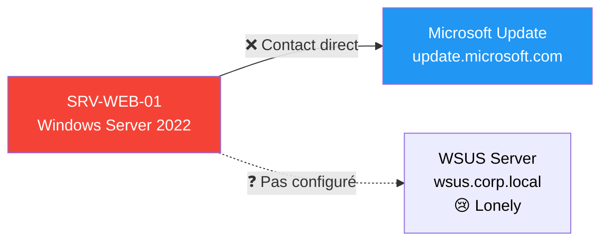
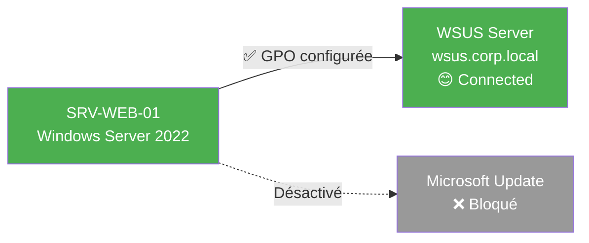
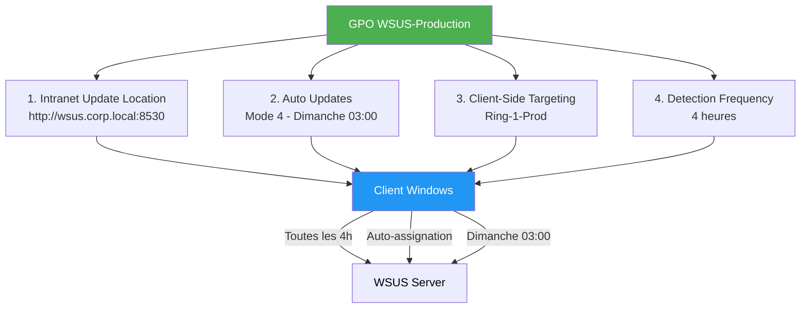

# Module 3 : Configuration Clients - GPO & Ciblage

!!! info "Objectifs du module"
    - 🎯 Comprendre le **Client-Side Targeting** via GPO
    - 📋 Maîtriser les **4 politiques critiques** pour WSUS
    - 💻 Créer des GPO via **PowerShell** (Infrastructure as Code)
    - 🔧 Configurer les clés de registre WSUS avec `Set-GPRegistryValue`
    - 📅 Planifier les installations (fenêtres de maintenance)
    - ✅ Tester et valider la configuration client

---

## 📘 Concept : Stratégie GPO

### 🤝 A WSUS server without clients is lonely

Vous avez déployé WSUS (Module 1), créé des groupes et approuvé des KB (Module 2). Mais...

**Problème** : Par défaut, les clients Windows contactent **Microsoft Update** directement, pas WSUS.



**Solution** : Configurer les clients via **Group Policy Objects (GPO)** pour :
1. Pointer vers WSUS au lieu de Microsoft Update
2. S'auto-assigner au groupe cible (Ring-0-Test, Ring-1-Prod, etc.)
3. Planifier les installations (fenêtre de maintenance)

Après configuration GPO :



---

### 🎯 Client-Side Targeting : L'auto-assignation

**Rappel Module 2** : Deux méthodes pour assigner les machines aux groupes WSUS :

| Méthode | Où ? | Scalable ? | IaC ? |
|---------|------|-----------|-------|
| **Server-Side** | Console WSUS (glisser-déposer) | ❌ Non | ❌ Non |
| **Client-Side** | GPO (Enable client-side targeting) | ✅ Oui | ✅ Oui |

**Workflow Client-Side Targeting** :

1. **L'admin crée une GPO** : `WSUS-Production`
   - Configure `Enable client-side targeting` → Valeur : `Ring-1-Prod`
   - Lie la GPO à l'OU `OU=Servers-Prod,DC=corp,DC=local`

2. **Le client applique la GPO** :
   - Exécute `gpupdate /force`
   - Lit la clé de registre `HKLM\Software\Policies\Microsoft\Windows\WindowsUpdate\TargetGroup`
   - Trouve la valeur : `Ring-1-Prod`

3. **Le client contacte WSUS** :
   - Envoie son inventaire + demande d'assignation au groupe `Ring-1-Prod`
   - WSUS crée automatiquement le groupe s'il n'existe pas
   - Le client apparaît dans la console WSUS sous le groupe `Ring-1-Prod`

**💡 Avantages** :
- ✅ **Zéro intervention** sur le serveur WSUS (pas de glisser-déposer manuel)
- ✅ **Scalable** : 1000 serveurs dans l'OU → 1000 serveurs auto-assignés
- ✅ **Traçabilité** : Les GPO sont auditées (Event Logs AD)
- ✅ **Réversible** : Déplacer un serveur vers une autre OU change son groupe WSUS automatiquement

---

### 📋 Les 4 Politiques Critiques

Voici les **4 paramètres GPO obligatoires** pour configurer WSUS :

#### 1️⃣ Specify intranet Microsoft update service location

**Objectif** : Pointer le client vers WSUS au lieu de Microsoft Update.

| Paramètre | Valeur |
|-----------|--------|
| **Chemin GPO** | `Computer Configuration > Policies > Administrative Templates > Windows Components > Windows Update` |
| **Nom** | `Specify intranet Microsoft update service location` |
| **Valeur** | `http://wsus.corp.local:8530` (URL du serveur WSUS) |
| **Remarque** | Si WSUS utilise HTTPS, utilisez `https://wsus.corp.local:8531` |

**Clé de registre** :
```registry
HKLM\Software\Policies\Microsoft\Windows\WindowsUpdate
    WUServer = "http://wsus.corp.local:8530"
    WUStatusServer = "http://wsus.corp.local:8530"
```

!!! warning "Port 8530 vs 8531"
    - **8530** : HTTP (par défaut)
    - **8531** : HTTPS (si certificat SSL configuré)

    Utilisez HTTPS en production pour sécuriser les communications.

---

#### 2️⃣ Configure Automatic Updates

**Objectif** : Définir le mode d'installation des mises à jour.

| Paramètre | Valeur |
|-----------|--------|
| **Chemin GPO** | `Computer Configuration > Policies > Administrative Templates > Windows Components > Windows Update` |
| **Nom** | `Configure Automatic Updates` |
| **Option** | **4 - Auto download and schedule the install** |
| **Schedule Day** | `0` (Tous les jours) ou `1` (Dimanche) à `7` (Samedi) |
| **Schedule Time** | `03:00` (3h du matin, par exemple) |

**Options disponibles** :

| Option | Description | Cas d'usage |
|--------|-------------|-------------|
| **2** | Notify for download and install | Postes utilisateurs (contrôle manuel) |
| **3** | Auto download and notify for install | Serveurs avec validation manuelle |
| **4** | Auto download and schedule the install | **Serveurs de production (recommandé)** |
| **5** | Allow local admin to choose setting | Environnements non gérés |

**Clé de registre** :
```registry
HKLM\Software\Policies\Microsoft\Windows\WindowsUpdate\AU
    AUOptions = 4 (DWORD)
    ScheduledInstallDay = 0 (0=Tous les jours, 1=Dimanche, etc.)
    ScheduledInstallTime = 3 (Heure : 03:00)
```

**💡 Recommandation** :
- **Ring-0-Test** : Option 4, tous les jours à 02:00
- **Ring-1-Prod** : Option 4, dimanche à 03:00
- **Ring-2-Critical** : Option 4, dimanche à 04:00 (après Ring-1)

---

#### 3️⃣ Enable client-side targeting

**Objectif** : Permettre au client de s'auto-assigner à un groupe WSUS.

| Paramètre | Valeur |
|-----------|--------|
| **Chemin GPO** | `Computer Configuration > Policies > Administrative Templates > Windows Components > Windows Update` |
| **Nom** | `Enable client-side targeting` |
| **Valeur** | Nom du groupe WSUS (ex: `Ring-1-Prod`) |

**Clé de registre** :
```registry
HKLM\Software\Policies\Microsoft\Windows\WindowsUpdate
    TargetGroup = "Ring-1-Prod"
    TargetGroupEnabled = 1 (DWORD)
```

!!! tip "Nommage des groupes"
    Utilisez un nommage cohérent :
    - `Ring-0-Test`
    - `Ring-1-Prod`
    - `Ring-2-Critical`

    Évitez les espaces et caractères spéciaux pour faciliter le scripting.

---

#### 4️⃣ Automatic Update detection frequency

**Objectif** : Définir la fréquence de contact avec WSUS.

| Paramètre | Valeur |
|-----------|--------|
| **Chemin GPO** | `Computer Configuration > Policies > Administrative Templates > Windows Components > Windows Update` |
| **Nom** | `Automatic Update detection frequency` |
| **Valeur** | `4` heures (par défaut : 22 heures) |

**Clé de registre** :
```registry
HKLM\Software\Policies\Microsoft\Windows\WindowsUpdate\AU
    DetectionFrequency = 4 (DWORD)
    DetectionFrequencyEnabled = 1 (DWORD)
```

**💡 Impact** :
- **4 heures** : Les clients contactent WSUS toutes les 4h (meilleur reporting, charge serveur +)
- **22 heures** : Contact 1×/jour (charge serveur -, reporting lent)

**Recommandation** : 4-8 heures en production pour équilibrer réactivité et charge.

---

### 📊 Récapitulatif des 4 Politiques



---

## 💻 Pratique : PowerShell GPO

### Prérequis : Module GroupPolicy

```powershell
# Vérifier que le module est disponible
Get-Module -ListAvailable GroupPolicy

# Output attendu :
# ModuleType Version    Name                                ExportedCommands
# ---------- -------    ----                                ----------------
# Manifest   1.0.0.0    GroupPolicy                         {Backup-GPO, Copy-GPO, Get-GPO...}

# Si absent, installer RSAT (Remote Server Administration Tools)
Install-WindowsFeature GPMC -IncludeManagementTools
```

---

### Étape 1 : Créer une GPO

```powershell
# Créer une nouvelle GPO
$GPOName = "WSUS-Production"

try {
    $GPO = New-GPO -Name $GPOName -Comment "Configuration WSUS pour serveurs de production"
    Write-Host "✅ GPO créée : $GPOName (GUID: $($GPO.Id))" -ForegroundColor Green
} catch {
    Write-Host "❌ Erreur création GPO : $_" -ForegroundColor Red
    exit 1
}
```

---

### Étape 2 : Configurer les clés de registre WSUS

**Méthode 1 : Set-GPRegistryValue (Recommandé)**

```powershell
# POLITIQUE 1 : Intranet Update Location
$WSUSServer = "http://wsus.corp.local:8530"

Set-GPRegistryValue -Name $GPOName -Key "HKLM\Software\Policies\Microsoft\Windows\WindowsUpdate" `
    -ValueName "WUServer" -Type String -Value $WSUSServer

Set-GPRegistryValue -Name $GPOName -Key "HKLM\Software\Policies\Microsoft\Windows\WindowsUpdate" `
    -ValueName "WUStatusServer" -Type String -Value $WSUSServer

Write-Host "✅ WSUS Server URL configurée : $WSUSServer" -ForegroundColor Green

# POLITIQUE 2 : Configure Automatic Updates (Mode 4, Dimanche 03:00)
Set-GPRegistryValue -Name $GPOName -Key "HKLM\Software\Policies\Microsoft\Windows\WindowsUpdate\AU" `
    -ValueName "AUOptions" -Type DWord -Value 4

Set-GPRegistryValue -Name $GPOName -Key "HKLM\Software\Policies\Microsoft\Windows\WindowsUpdate\AU" `
    -ValueName "ScheduledInstallDay" -Type DWord -Value 1  # 1 = Dimanche

Set-GPRegistryValue -Name $GPOName -Key "HKLM\Software\Policies\Microsoft\Windows\WindowsUpdate\AU" `
    -ValueName "ScheduledInstallTime" -Type DWord -Value 3  # 03:00

Write-Host "✅ Auto Updates configuré : Mode 4, Dimanche 03:00" -ForegroundColor Green

# POLITIQUE 3 : Client-Side Targeting
$TargetGroup = "Ring-1-Prod"

Set-GPRegistryValue -Name $GPOName -Key "HKLM\Software\Policies\Microsoft\Windows\WindowsUpdate" `
    -ValueName "TargetGroup" -Type String -Value $TargetGroup

Set-GPRegistryValue -Name $GPOName -Key "HKLM\Software\Policies\Microsoft\Windows\WindowsUpdate" `
    -ValueName "TargetGroupEnabled" -Type DWord -Value 1

Write-Host "✅ Client-Side Targeting configuré : $TargetGroup" -ForegroundColor Green

# POLITIQUE 4 : Detection Frequency (4 heures)
Set-GPRegistryValue -Name $GPOName -Key "HKLM\Software\Policies\Microsoft\Windows\WindowsUpdate\AU" `
    -ValueName "DetectionFrequency" -Type DWord -Value 4

Set-GPRegistryValue -Name $GPOName -Key "HKLM\Software\Policies\Microsoft\Windows\WindowsUpdate\AU" `
    -ValueName "DetectionFrequencyEnabled" -Type DWord -Value 1

Write-Host "✅ Detection Frequency configurée : 4 heures" -ForegroundColor Green
```

**Méthode 2 : Set-GPPrefRegistryValue (Alternative)**

```powershell
# Alternative avec GPP (Group Policy Preferences)
# Moins recommandé car ne force pas la valeur (l'utilisateur peut modifier)
Set-GPPrefRegistryValue -Name $GPOName -Context Computer -Action Update `
    -Key "HKLM\Software\Policies\Microsoft\Windows\WindowsUpdate" `
    -ValueName "WUServer" -Type String -Value $WSUSServer
```

!!! tip "Set-GPRegistryValue vs Set-GPPrefRegistryValue"
    - **Set-GPRegistryValue** : Politique **forcée** (l'utilisateur ne peut pas modifier)
    - **Set-GPPrefRegistryValue** : Préférence (l'utilisateur peut override)

    Pour WSUS, utilisez **toujours** `Set-GPRegistryValue` pour garantir la configuration.

---

### Étape 3 : Lier la GPO à une OU

```powershell
# Lier la GPO à l'OU des serveurs de production
$TargetOU = "OU=Servers-Prod,DC=corp,DC=local"

try {
    New-GPLink -Name $GPOName -Target $TargetOU -LinkEnabled Yes -Enforced No
    Write-Host "✅ GPO liée à : $TargetOU" -ForegroundColor Green
} catch {
    Write-Host "❌ Erreur liaison GPO : $_" -ForegroundColor Red
    exit 1
}
```

**Options de liaison** :

| Paramètre | Description |
|-----------|-------------|
| `-LinkEnabled Yes` | GPO active immédiatement |
| `-Enforced Yes` | Force l'application (ignore le "Block Inheritance") |
| `-Order 1` | Priorité (1 = appliquée en premier) |

---

### Étape 4 : Vérifier la GPO

```powershell
# Lister toutes les valeurs de registre configurées
Get-GPRegistryValue -Name $GPOName -Key "HKLM\Software\Policies\Microsoft\Windows\WindowsUpdate" |
    Select-Object FullKeyPath, ValueName, Value, Type |
    Format-Table -AutoSize

# Output attendu :
# FullKeyPath                                                  ValueName              Value                         Type
# -----------                                                  ---------              -----                         ----
# HKLM\Software\Policies\Microsoft\Windows\WindowsUpdate      WUServer               http://wsus.corp.local:8530   String
# HKLM\Software\Policies\Microsoft\Windows\WindowsUpdate      WUStatusServer         http://wsus.corp.local:8530   String
# HKLM\Software\Policies\Microsoft\Windows\WindowsUpdate      TargetGroup            Ring-1-Prod                   String
# HKLM\Software\Policies\Microsoft\Windows\WindowsUpdate      TargetGroupEnabled     1                             DWord
```

```powershell
# Vérifier les liaisons
Get-GPO -Name $GPOName | Select-Object DisplayName, GpoStatus, CreationTime, ModificationTime

# Vérifier l'OU liée
(Get-GPO -Name $GPOName).GetGPOLinks() | Select-Object Target, Enabled, Enforced
```

---

### Étape 5 : Forcer l'application sur un client

```powershell
# Sur le client (SRV-WEB-01)
# 1. Forcer l'application de la GPO
gpupdate /force

# Output :
# Updating policy...
# Computer Policy update has completed successfully.

# 2. Vérifier que les clés de registre sont présentes
Get-ItemProperty "HKLM:\Software\Policies\Microsoft\Windows\WindowsUpdate" |
    Select-Object WUServer, WUStatusServer, TargetGroup, TargetGroupEnabled

# Output attendu :
# WUServer             : http://wsus.corp.local:8530
# WUStatusServer       : http://wsus.corp.local:8530
# TargetGroup          : Ring-1-Prod
# TargetGroupEnabled   : 1

# 3. Forcer la détection WSUS
wuauclt /detectnow

# (Ou sur Windows Server 2016+)
UsoClient StartScan

# 4. Vérifier les Event Logs
Get-WinEvent -LogName System -MaxEvents 10 | Where-Object {$_.ProviderName -eq "Microsoft-Windows-WindowsUpdateClient"}
```

---

## 🎓 Exercice : "La GPO Parfaite"

### 📋 Contexte

Votre entreprise **FinanceCorp** doit configurer **50 serveurs de production** pour utiliser WSUS.

**Infrastructure Active Directory** :
- Domaine : `corp.local`
- OU des serveurs de production : `OU=Servers-Prod,DC=corp,DC=local`
- Serveur WSUS : `wsus.corp.local` (port 8530 HTTP)

**Contraintes métier** :
- Les mises à jour doivent s'installer **uniquement le dimanche à 03:00** (fenêtre de maintenance)
- Les serveurs doivent s'auto-assigner au groupe `Ring-1-Prod`
- Le contact avec WSUS doit avoir lieu toutes les **4 heures** pour un reporting rapide
- Aucune installation ne doit se faire pendant les heures de bureau (8h-18h)

---

### 🎯 Objectifs

Créez un script `New-WSUS-GPO.ps1` qui :

1. ✅ Crée une GPO nommée `WSUS-Production`
2. ✅ Configure l'URL WSUS : `http://wsus.corp.local:8530`
3. ✅ Configure l'installation automatique : **Dimanche à 03:00**
4. ✅ Active le Client-Side Targeting : groupe `Ring-1-Prod`
5. ✅ Configure la fréquence de détection : **4 heures**
6. ✅ Lie la GPO à l'OU `OU=Servers-Prod,DC=corp,DC=local`
7. ✅ Génère un rapport de validation (export XML de la GPO)

---

### 📝 Travail à réaliser

```powershell
# New-WSUS-GPO.ps1
# Auteur : Votre nom
# Date : 22/11/2025
# Description : Création GPO WSUS pour serveurs de production

#Requires -RunAsAdministrator
#Requires -Modules GroupPolicy

# TODO 1 : Définir les variables de configuration
#          $GPOName, $WSUSServer, $TargetGroup, $TargetOU

# TODO 2 : Créer la GPO (avec gestion idempotence)

# TODO 3 : Configurer les 4 politiques via Set-GPRegistryValue
#          - WUServer / WUStatusServer
#          - AUOptions, ScheduledInstallDay, ScheduledInstallTime
#          - TargetGroup, TargetGroupEnabled
#          - DetectionFrequency, DetectionFrequencyEnabled

# TODO 4 : Lier la GPO à l'OU Servers-Prod

# TODO 5 : Vérifier la configuration (Get-GPRegistryValue)

# TODO 6 : Exporter la GPO en XML pour documentation
#          Backup-GPO -Name $GPOName -Path .\GPO-Backup

# TODO 7 : Afficher un résumé avec instructions pour les clients
```

---

### ✅ Critères de validation

| Critère | Vérification |
|---------|--------------|
| GPO créée | `Get-GPO -Name "WSUS-Production"` → Succès |
| 9 clés registre | `Get-GPRegistryValue -Name "WSUS-Production" -Key "HKLM\...\WindowsUpdate"` → 9 valeurs |
| OU liée | `(Get-GPO -Name "WSUS-Production").GetGPOLinks()` → 1 lien |
| Backup XML | `Test-Path .\GPO-Backup\*\gpreport.xml` → `True` |
| Test client | Sur un serveur dans l'OU : `gpupdate /force` puis vérifier registre |

---

### 💡 Solution complète

??? quote "Cliquez pour révéler la solution"

    ```powershell
    # New-WSUS-GPO.ps1
    # Création GPO WSUS pour serveurs de production - FinanceCorp
    # Auteur : ShellBook Training
    # Date : 22/11/2025

    #Requires -RunAsAdministrator
    #Requires -Modules GroupPolicy

    # ============================================
    # CONFIGURATION
    # ============================================
    $GPOName = "WSUS-Production"
    $WSUSServer = "http://wsus.corp.local:8530"
    $TargetGroup = "Ring-1-Prod"
    $TargetOU = "OU=Servers-Prod,DC=corp,DC=local"
    $BackupPath = ".\GPO-Backup"

    # Planification : Dimanche à 03:00
    $ScheduleDay = 1   # 0=Tous les jours, 1=Dimanche, 2=Lundi, ..., 7=Samedi
    $ScheduleTime = 3  # 03:00 (format 24h)

    # Fréquence de détection : 4 heures
    $DetectionFrequency = 4

    Write-Host "`n========================================" -ForegroundColor Cyan
    Write-Host "   CRÉATION GPO WSUS - PRODUCTION       " -ForegroundColor Cyan
    Write-Host "========================================`n" -ForegroundColor Cyan

    # ============================================
    # ÉTAPE 1 : CRÉATION DE LA GPO (IDEMPOTENT)
    # ============================================
    Write-Host "[1/6] Création de la GPO..." -ForegroundColor Cyan

    $ExistingGPO = Get-GPO -Name $GPOName -ErrorAction SilentlyContinue

    if ($ExistingGPO) {
        Write-Host "⚠️  GPO existante détectée : $GPOName" -ForegroundColor Yellow
        $Confirm = Read-Host "Voulez-vous la supprimer et la recréer ? (O/N)"

        if ($Confirm -eq "O") {
            Remove-GPO -Name $GPOName -Confirm:$false
            Write-Host "🗑️  GPO supprimée" -ForegroundColor Gray
        } else {
            Write-Host "ℹ️  Utilisation de la GPO existante" -ForegroundColor Yellow
            $GPO = $ExistingGPO
        }
    }

    if (-not $ExistingGPO -or $Confirm -eq "O") {
        $GPO = New-GPO -Name $GPOName -Comment "Configuration WSUS pour serveurs de production - Dimanche 03:00"
        Write-Host "✅ GPO créée : $GPOName" -ForegroundColor Green
        Write-Host "   GUID : $($GPO.Id)" -ForegroundColor Gray
    }

    # ============================================
    # ÉTAPE 2 : POLITIQUE 1 - INTRANET UPDATE LOCATION
    # ============================================
    Write-Host "`n[2/6] Configuration de l'URL WSUS..." -ForegroundColor Cyan

    $RegPath = "HKLM\Software\Policies\Microsoft\Windows\WindowsUpdate"

    Set-GPRegistryValue -Name $GPOName -Key $RegPath `
        -ValueName "WUServer" -Type String -Value $WSUSServer

    Set-GPRegistryValue -Name $GPOName -Key $RegPath `
        -ValueName "WUStatusServer" -Type String -Value $WSUSServer

    Write-Host "✅ WSUS Server : $WSUSServer" -ForegroundColor Green

    # ============================================
    # ÉTAPE 3 : POLITIQUE 2 - CONFIGURE AUTOMATIC UPDATES
    # ============================================
    Write-Host "`n[3/6] Configuration des mises à jour automatiques..." -ForegroundColor Cyan

    $RegPathAU = "HKLM\Software\Policies\Microsoft\Windows\WindowsUpdate\AU"

    # Mode 4 : Auto download and schedule the install
    Set-GPRegistryValue -Name $GPOName -Key $RegPathAU `
        -ValueName "AUOptions" -Type DWord -Value 4

    # Jour : Dimanche (1)
    Set-GPRegistryValue -Name $GPOName -Key $RegPathAU `
        -ValueName "ScheduledInstallDay" -Type DWord -Value $ScheduleDay

    # Heure : 03:00
    Set-GPRegistryValue -Name $GPOName -Key $RegPathAU `
        -ValueName "ScheduledInstallTime" -Type DWord -Value $ScheduleTime

    # Désactiver le redémarrage automatique si utilisateur connecté
    Set-GPRegistryValue -Name $GPOName -Key $RegPathAU `
        -ValueName "NoAutoRebootWithLoggedOnUsers" -Type DWord -Value 1

    $DayName = switch ($ScheduleDay) {
        0 { "Tous les jours" }
        1 { "Dimanche" }
        2 { "Lundi" }
        3 { "Mardi" }
        4 { "Mercredi" }
        5 { "Jeudi" }
        6 { "Vendredi" }
        7 { "Samedi" }
    }

    Write-Host "✅ Mode : Auto download and schedule install" -ForegroundColor Green
    Write-Host "✅ Planification : $DayName à $($ScheduleTime):00" -ForegroundColor Green
    Write-Host "✅ No auto-reboot with logged on users : Activé" -ForegroundColor Green

    # ============================================
    # ÉTAPE 4 : POLITIQUE 3 - CLIENT-SIDE TARGETING
    # ============================================
    Write-Host "`n[4/6] Configuration du Client-Side Targeting..." -ForegroundColor Cyan

    Set-GPRegistryValue -Name $GPOName -Key $RegPath `
        -ValueName "TargetGroup" -Type String -Value $TargetGroup

    Set-GPRegistryValue -Name $GPOName -Key $RegPath `
        -ValueName "TargetGroupEnabled" -Type DWord -Value 1

    Write-Host "✅ Target Group : $TargetGroup" -ForegroundColor Green

    # ============================================
    # ÉTAPE 5 : POLITIQUE 4 - DETECTION FREQUENCY
    # ============================================
    Write-Host "`n[5/6] Configuration de la fréquence de détection..." -ForegroundColor Cyan

    Set-GPRegistryValue -Name $GPOName -Key $RegPathAU `
        -ValueName "DetectionFrequency" -Type DWord -Value $DetectionFrequency

    Set-GPRegistryValue -Name $GPOName -Key $RegPathAU `
        -ValueName "DetectionFrequencyEnabled" -Type DWord -Value 1

    Write-Host "✅ Detection Frequency : $DetectionFrequency heures" -ForegroundColor Green

    # ============================================
    # ÉTAPE 6 : LIAISON À L'OU
    # ============================================
    Write-Host "`n[6/6] Liaison de la GPO à l'OU..." -ForegroundColor Cyan

    # Vérifier si l'OU existe
    try {
        $OUExists = Get-ADOrganizationalUnit -Identity $TargetOU -ErrorAction Stop
    } catch {
        Write-Host "❌ OU introuvable : $TargetOU" -ForegroundColor Red
        Write-Host "   Vérifiez que l'OU existe dans Active Directory." -ForegroundColor Gray
        exit 1
    }

    # Vérifier si la liaison existe déjà
    $ExistingLink = Get-GPInheritance -Target $TargetOU |
        Select-Object -ExpandProperty GpoLinks |
        Where-Object {$_.DisplayName -eq $GPOName}

    if ($ExistingLink) {
        Write-Host "ℹ️  GPO déjà liée à : $TargetOU" -ForegroundColor Yellow
    } else {
        New-GPLink -Name $GPOName -Target $TargetOU -LinkEnabled Yes -Enforced No
        Write-Host "✅ GPO liée à : $TargetOU" -ForegroundColor Green
    }

    # ============================================
    # VÉRIFICATION DE LA CONFIGURATION
    # ============================================
    Write-Host "`n========================================" -ForegroundColor Cyan
    Write-Host "        VÉRIFICATION CONFIGURATION       " -ForegroundColor Cyan
    Write-Host "========================================`n" -ForegroundColor Cyan

    # Compter les valeurs de registre configurées
    $RegValues = Get-GPRegistryValue -Name $GPOName -Key $RegPath -ErrorAction SilentlyContinue
    $RegValuesAU = Get-GPRegistryValue -Name $GPOName -Key $RegPathAU -ErrorAction SilentlyContinue

    $TotalValues = ($RegValues.Count) + ($RegValuesAU.Count)

    Write-Host "📊 Clés de registre configurées : $TotalValues" -ForegroundColor White
    Write-Host "`nDétail :" -ForegroundColor White

    # Afficher les valeurs principales
    Write-Host "  • WUServer              : $WSUSServer" -ForegroundColor Gray
    Write-Host "  • WUStatusServer        : $WSUSServer" -ForegroundColor Gray
    Write-Host "  • TargetGroup           : $TargetGroup" -ForegroundColor Gray
    Write-Host "  • AUOptions             : 4 (Auto download and schedule)" -ForegroundColor Gray
    Write-Host "  • ScheduledInstallDay   : $ScheduleDay ($DayName)" -ForegroundColor Gray
    Write-Host "  • ScheduledInstallTime  : $ScheduleTime ($($ScheduleTime):00)" -ForegroundColor Gray
    Write-Host "  • DetectionFrequency    : $DetectionFrequency heures" -ForegroundColor Gray

    # ============================================
    # BACKUP DE LA GPO (DOCUMENTATION)
    # ============================================
    Write-Host "`n========================================" -ForegroundColor Cyan
    Write-Host "           BACKUP & EXPORT              " -ForegroundColor Cyan
    Write-Host "========================================`n" -ForegroundColor Cyan

    # Créer le répertoire de backup
    if (-not (Test-Path $BackupPath)) {
        New-Item -Path $BackupPath -ItemType Directory -Force | Out-Null
    }

    # Sauvegarder la GPO
    $Backup = Backup-GPO -Name $GPOName -Path $BackupPath -Comment "Backup automatique - $(Get-Date -Format 'dd/MM/yyyy HH:mm')"

    Write-Host "✅ GPO sauvegardée : $($Backup.BackupDirectory)" -ForegroundColor Green

    # Générer le rapport HTML
    $ReportPath = Join-Path $BackupPath "$GPOName-Report.html"
    Get-GPOReport -Name $GPOName -ReportType Html -Path $ReportPath

    Write-Host "✅ Rapport HTML généré : $ReportPath" -ForegroundColor Green

    # ============================================
    # INSTRUCTIONS POUR LES CLIENTS
    # ============================================
    Write-Host "`n========================================" -ForegroundColor Cyan
    Write-Host "      INSTRUCTIONS POUR LES CLIENTS     " -ForegroundColor Cyan
    Write-Host "========================================`n" -ForegroundColor Cyan

    Write-Host "Sur chaque serveur de production (dans l'OU $TargetOU) :" -ForegroundColor White
    Write-Host ""
    Write-Host "1️⃣  Appliquer la GPO immédiatement :" -ForegroundColor Cyan
    Write-Host "   gpupdate /force" -ForegroundColor Yellow
    Write-Host ""
    Write-Host "2️⃣  Vérifier la configuration WSUS :" -ForegroundColor Cyan
    Write-Host "   Get-ItemProperty 'HKLM:\Software\Policies\Microsoft\Windows\WindowsUpdate'" -ForegroundColor Yellow
    Write-Host ""
    Write-Host "3️⃣  Forcer la détection WSUS :" -ForegroundColor Cyan
    Write-Host "   wuauclt /detectnow" -ForegroundColor Yellow
    Write-Host "   (ou UsoClient StartScan sur Server 2016+)" -ForegroundColor Gray
    Write-Host ""
    Write-Host "4️⃣  Vérifier l'apparition dans WSUS Console :" -ForegroundColor Cyan
    Write-Host "   WSUS Console > Computers > Ring-1-Prod" -ForegroundColor Yellow
    Write-Host "   Le serveur doit apparaître dans les 4 heures." -ForegroundColor Gray
    Write-Host ""
    Write-Host "5️⃣  Consulter les Event Logs :" -ForegroundColor Cyan
    Write-Host "   Get-WinEvent -LogName System | Where ProviderName -eq 'Microsoft-Windows-WindowsUpdateClient'" -ForegroundColor Yellow

    Write-Host "`n========================================" -ForegroundColor Cyan
    Write-Host "           DÉPLOIEMENT TERMINÉ          " -ForegroundColor Cyan
    Write-Host "========================================`n" -ForegroundColor Cyan

    Write-Host "📄 Fichiers générés :" -ForegroundColor White
    Write-Host "   • Backup GPO : $($Backup.BackupDirectory)" -ForegroundColor Gray
    Write-Host "   • Rapport HTML : $ReportPath" -ForegroundColor Gray
    Write-Host ""
    Write-Host "💡 Prochaines étapes :" -ForegroundColor White
    Write-Host "   1. Tester sur 1-2 serveurs pilotes avant déploiement masse" -ForegroundColor Gray
    Write-Host "   2. Surveiller les Event Logs pendant 48h" -ForegroundColor Gray
    Write-Host "   3. Valider l'apparition dans WSUS Console" -ForegroundColor Gray
    Write-Host "   4. Documenter la GPO dans le Wiki IT`n" -ForegroundColor Gray
    ```

    **Exécution** :
    ```powershell
    .\New-WSUS-GPO.ps1
    ```

    **Output attendu** :
    ```powershell
    ========================================
       CRÉATION GPO WSUS - PRODUCTION
    ========================================

    [1/6] Création de la GPO...
    ✅ GPO créée : WSUS-Production
       GUID : 12345678-1234-1234-1234-123456789abc

    [2/6] Configuration de l'URL WSUS...
    ✅ WSUS Server : http://wsus.corp.local:8530

    [3/6] Configuration des mises à jour automatiques...
    ✅ Mode : Auto download and schedule install
    ✅ Planification : Dimanche à 3:00
    ✅ No auto-reboot with logged on users : Activé

    [4/6] Configuration du Client-Side Targeting...
    ✅ Target Group : Ring-1-Prod

    [5/6] Configuration de la fréquence de détection...
    ✅ Detection Frequency : 4 heures

    [6/6] Liaison de la GPO à l'OU...
    ✅ GPO liée à : OU=Servers-Prod,DC=corp,DC=local

    ========================================
            VÉRIFICATION CONFIGURATION
    ========================================

    📊 Clés de registre configurées : 9

    Détail :
      • WUServer              : http://wsus.corp.local:8530
      • WUStatusServer        : http://wsus.corp.local:8530
      • TargetGroup           : Ring-1-Prod
      • AUOptions             : 4 (Auto download and schedule)
      • ScheduledInstallDay   : 1 (Dimanche)
      • ScheduledInstallTime  : 3 (3:00)
      • DetectionFrequency    : 4 heures

    ========================================
               BACKUP & EXPORT
    ========================================

    ✅ GPO sauvegardée : .\GPO-Backup\{12345678-1234-1234-1234-123456789abc}
    ✅ Rapport HTML généré : .\GPO-Backup\WSUS-Production-Report.html

    ========================================
          INSTRUCTIONS POUR LES CLIENTS
    ========================================

    Sur chaque serveur de production (dans l'OU OU=Servers-Prod,DC=corp,DC=local) :

    1️⃣  Appliquer la GPO immédiatement :
       gpupdate /force

    2️⃣  Vérifier la configuration WSUS :
       Get-ItemProperty 'HKLM:\Software\Policies\Microsoft\Windows\WindowsUpdate'

    3️⃣  Forcer la détection WSUS :
       wuauclt /detectnow
       (ou UsoClient StartScan sur Server 2016+)

    4️⃣  Vérifier l'apparition dans WSUS Console :
       WSUS Console > Computers > Ring-1-Prod
       Le serveur doit apparaître dans les 4 heures.

    5️⃣  Consulter les Event Logs :
       Get-WinEvent -LogName System | Where ProviderName -eq 'Microsoft-Windows-WindowsUpdateClient'

    ========================================
               DÉPLOIEMENT TERMINÉ
    ========================================

    📄 Fichiers générés :
       • Backup GPO : .\GPO-Backup\{12345678-1234-1234-1234-123456789abc}
       • Rapport HTML : .\GPO-Backup\WSUS-Production-Report.html

    💡 Prochaines étapes :
       1. Tester sur 1-2 serveurs pilotes avant déploiement masse
       2. Surveiller les Event Logs pendant 48h
       3. Valider l'apparition dans WSUS Console
       4. Documenter la GPO dans le Wiki IT
    ```

---

## 🎯 Points clés à retenir

!!! success "Checklist Module 3"
    - ✅ **Client-Side Targeting** (GPO) préféré à Server-Side (console) pour scalabilité
    - ✅ **4 politiques critiques** : URL WSUS, Auto Updates, Targeting, Detection Frequency
    - ✅ `Set-GPRegistryValue` pour configurer les clés de registre WSUS
    - ✅ Mode 4 (Auto download and schedule) recommandé pour serveurs
    - ✅ Planifier les installations hors heures de production (Dimanche 03:00)
    - ✅ Detection Frequency = 4-8h pour équilibrer réactivité et charge serveur
    - ✅ Tester avec `gpupdate /force` + `wuauclt /detectnow`
    - ✅ Backup GPO avec `Backup-GPO` pour documentation et DR
    - ✅ Toujours désactiver "Auto-reboot with logged on users" en production

---

## 🔗 Ressources complémentaires

- [Microsoft Learn : Configure Automatic Updates with Group Policy](https://learn.microsoft.com/en-us/windows-server/administration/windows-server-update-services/deploy/4-configure-group-policy-settings-for-automatic-updates)
- [PowerShell : GroupPolicy Module](https://learn.microsoft.com/en-us/powershell/module/grouppolicy/)
- [Registry Keys for WSUS](https://learn.microsoft.com/en-us/windows/deployment/update/waas-wu-settings)

---

## ➡️ Prochaine étape

Rendez-vous au **Module 4 : Maintenance & Dépannage** pour apprendre à :
- Nettoyer la base WSUS (obsolete updates, computers)
- Re-indexer la base WID/SQL pour optimiser les performances
- Diagnostiquer les problèmes de synchronisation
- Analyser les logs clients (WindowsUpdate.log)
- Automatiser la maintenance mensuelle

---

!!! quote "Citation du formateur"
    *"Une GPO bien configurée transforme 50 serveurs en 0 minute de travail manuel. Une GPO mal configurée transforme 50 serveurs en 50 tickets d'incident."* — ShellBook Training

---

## Navigation

| | |
|:---|---:|
| [← Module 2 : Approbation & Ciblage - La...](02-module.md) | [Module 4 : Maintenance & Dépannage - ... →](04-module.md) |

[Retour au Programme](index.md){ .md-button }
