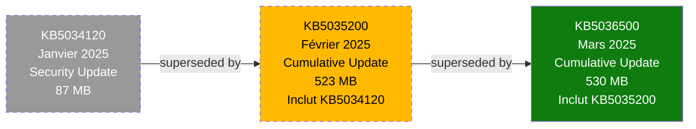

# Module 4 : Maintenance & Dépannage - Garder WSUS en Vie

!!! info "Objectifs du module"
    - 🌱 Comprendre le cycle de vie des mises à jour (supersedence)
    - 🧹 Maîtriser le **Cleanup Wizard** via PowerShell
    - 🔧 Optimiser la base de données WSUS (re-indexing)
    - 🚨 Diagnostiquer les problèmes clients (logs, agent reset)
    - 📅 Automatiser la maintenance mensuelle
    - ✅ Créer un script de health check complet

---

## 📘 Concept : Cycle de Vie des Mises à Jour

### 🌱 A WSUS server is like a garden; without weeding, it becomes a jungle

**Scénario réel** (Infrastructure de 500 serveurs) :

> **Mois 1** : WSUS synchronise 1200 KB. Base de données WID : **15 GB**. Console s'ouvre en **5 secondes**.
>
> **Mois 6** : WSUS a synchronisé 7200 KB cumulées. Base WID : **45 GB**. Console s'ouvre en **30 secondes**.
>
> **Mois 12** : 14 400 KB cumulées. Base WID : **80 GB**. Console **plante** (timeout 60s). Les clients ne peuvent plus contacter WSUS.
>
> **Cause** : 80% des KB sont **superseded** (obsolètes), mais jamais nettoyées. La base est devenue un **cimetière de KB**.

**La leçon** : La maintenance WSUS est **obligatoire**, pas optionnelle.

---

### 🔄 Supersedence : Le remplacement des mises à jour

**Principe** : Microsoft publie des KB **cumulatives** qui **remplacent** les anciennes.



**Définitions** :

| Terme | Description | Exemple |
|-------|-------------|---------|
| **Superseded** | KB remplacée par une version plus récente | KB5034120 (jan) → Superseded par KB5035200 (fév) |
| **Superseding** | KB qui remplace une ancienne | KB5035200 **supersedes** KB5034120 |
| **Cumulative** | KB qui contient toutes les corrections précédentes | KB5036500 (mars) contient jan + fév + mars |

**💡 Pourquoi les KB superseded restent dans WSUS ?**

Par défaut, WSUS **conserve** les anciennes KB pour permettre le rollback en cas de régression. Mais après 3-6 mois, elles deviennent inutiles :

- ❌ **Espace disque gaspillé** : 10 KB superseded × 50 MB = 500 MB inutiles
- ❌ **Base de données gonflée** : Métadonnées de 10 000+ KB obsolètes
- ❌ **Performance dégradée** : Requêtes SQL lentes (scan de millions de lignes)
- ❌ **Sync lente** : WSUS doit traiter les métadonnées de toutes les KB

**Solution** : Nettoyer régulièrement avec le **Cleanup Wizard**.

---

### ⚠️ Symptômes d'un WSUS malade

| Symptôme | Cause probable | Solution |
|----------|----------------|----------|
| **Console lente** (>30s au démarrage) | Base de données fragmentée, trop de KB | Cleanup + Re-indexing |
| **Clients en timeout** (erreur 0x8024401C) | Base WID saturée (CPU 100%) | Cleanup + Migration SQL |
| **Sync échoue** (erreur 0x80244022) | Espace disque insuffisant | Cleanup + Étendre volume |
| **Disk full** (D:\WSUS à 100%) | Binaires superseded non supprimés | Cleanup (UnneededContentFiles) |
| **Clients non visibles** dans la console | SelfUpdate pas appliqué | Approuver "Windows Server Update Services" |
| **KB approved mais pas installées** | Clients mal ciblés (mauvais groupe) | Vérifier GPO Client-Side Targeting |

---

## 💻 Pratique : Maintenance Serveur

### 🧹 Cleanup Wizard (PowerShell)

Le **Cleanup Wizard** est l'outil principal pour nettoyer WSUS. Accessible via GUI ou PowerShell.

#### Commande de base

```powershell
# Récupérer le serveur WSUS
$WSUSServer = Get-WsusServer

# Lancer le cleanup (toutes les options)
Invoke-WsusServerCleanup -CleanupObsoleteComputers `
                         -CleanupObsoleteUpdates `
                         -CleanupUnneededContentFiles `
                         -CompressUpdates `
                         -DeclineExpiredUpdates `
                         -DeclineSupersededUpdates
```

**Options disponibles** :

| Option | Description | Impact | Durée |
|--------|-------------|--------|-------|
| **DeclineSupersededUpdates** | Refuse les KB remplacées (superseded) | ⚠️ Moyen | ~10 min |
| **DeclineExpiredUpdates** | Refuse les KB expirées par Microsoft | ✅ Faible | ~2 min |
| **CleanupObsoleteUpdates** | Supprime les métadonnées des KB refusées | ✅ Moyen | ~5 min |
| **CleanupObsoleteComputers** | Supprime les clients non contactés depuis 30j | ✅ Faible | ~1 min |
| **CleanupUnneededContentFiles** | Supprime les binaires (.cab, .msu) des KB refusées | ✅ Fort | ~15 min |
| **CompressUpdates** | Compresse les révisions de KB (n'est plus utilisé) | ✅ Nul | ~1 min |

---

#### Option 1 : DeclineSupersededUpdates

**Objectif** : Refuser automatiquement les KB remplacées.

```powershell
# Refuser les KB superseded
Invoke-WsusServerCleanup -DeclineSupersededUpdates

# Output attendu :
# Declining superseded updates...
# Declined 1247 superseded updates.
```

!!! warning "Impact sur le rollback"
    Une fois une KB superseded **refusée**, vous ne pouvez **plus** la désinstaller pour revenir à la version précédente.

    **Recommandation** : Attendre **3 mois** avant de refuser les KB superseded (laisser le temps de détecter les régressions).

**Exemple** :
- **Mars 2025** : KB5036500 est publiée et remplace KB5035200 (février)
- **Avril-Mai** : Période de test (detection de régressions éventuelles)
- **Juin 2025** : Exécuter `DeclineSupersededUpdates` pour refuser KB5035200

---

#### Option 2 : CleanupUnneededContentFiles

**Objectif** : Supprimer les binaires (.cab, .msu) des KB refusées.

```powershell
# Supprimer les fichiers inutiles
Invoke-WsusServerCleanup -CleanupUnneededContentFiles

# Output attendu :
# Deleting unused update files...
# Deleted 45.7 GB of unused update files.
```

**💡 Gain d'espace typique** :
- Petit WSUS (<1000 clients) : 10-20 GB
- Moyen WSUS (1000-5000 clients) : 50-100 GB
- Grand WSUS (>5000 clients) : 200-500 GB

---

#### Option 3 : CleanupObsoleteComputers

**Objectif** : Supprimer les clients qui n'ont pas contacté WSUS depuis 30 jours.

```powershell
# Supprimer les ordinateurs obsolètes
Invoke-WsusServerCleanup -CleanupObsoleteComputers

# Output attendu :
# Deleting obsolete computers...
# Deleted 23 obsolete computers.
```

**Cas d'usage** :
- Serveurs décommissionnés mais jamais supprimés de WSUS
- VM temporaires (CI/CD) qui contactent WSUS puis sont détruites

---

#### Script de cleanup complet

```powershell
# Cleanup-WSUS.ps1
# Maintenance mensuelle automatisée

#Requires -RunAsAdministrator

Write-Host "`n🧹 WSUS Cleanup - $(Get-Date -Format 'dd/MM/yyyy HH:mm')" -ForegroundColor Cyan
Write-Host "========================================`n" -ForegroundColor Cyan

# Connexion WSUS
$WSUSServer = Get-WsusServer
Write-Host "✅ Connecté à : $($WSUSServer.Name):$($WSUSServer.PortNumber)" -ForegroundColor Green

# Mesurer l'espace disque AVANT
$ContentPath = "D:\WSUS"
$SizeBefore = (Get-ChildItem -Path $ContentPath -Recurse -ErrorAction SilentlyContinue |
               Measure-Object -Property Length -Sum).Sum / 1GB

Write-Host "`n📊 Espace utilisé AVANT : $([math]::Round($SizeBefore, 2)) GB" -ForegroundColor White

# ÉTAPE 1 : Refuser les KB superseded
Write-Host "`n[1/5] Refus des KB superseded..." -ForegroundColor Cyan
$Result1 = Invoke-WsusServerCleanup -DeclineSupersededUpdates
Write-Host "✅ $($Result1.SupersededUpdatesDeclined) KB superseded refusées" -ForegroundColor Green

# ÉTAPE 2 : Refuser les KB expirées
Write-Host "`n[2/5] Refus des KB expirées..." -ForegroundColor Cyan
$Result2 = Invoke-WsusServerCleanup -DeclineExpiredUpdates
Write-Host "✅ $($Result2.ExpiredUpdatesDeclined) KB expirées refusées" -ForegroundColor Green

# ÉTAPE 3 : Nettoyer les métadonnées obsolètes
Write-Host "`n[3/5] Nettoyage des métadonnées..." -ForegroundColor Cyan
$Result3 = Invoke-WsusServerCleanup -CleanupObsoleteUpdates
Write-Host "✅ $($Result3.ObsoleteUpdatesDeleted) métadonnées supprimées" -ForegroundColor Green

# ÉTAPE 4 : Supprimer les binaires inutiles
Write-Host "`n[4/5] Suppression des binaires inutiles..." -ForegroundColor Cyan
$Result4 = Invoke-WsusServerCleanup -CleanupUnneededContentFiles
Write-Host "✅ Binaires supprimés" -ForegroundColor Green

# ÉTAPE 5 : Nettoyer les ordinateurs obsolètes
Write-Host "`n[5/5] Suppression des ordinateurs obsolètes..." -ForegroundColor Cyan
$Result5 = Invoke-WsusServerCleanup -CleanupObsoleteComputers
Write-Host "✅ $($Result5.ObsoleteComputersDeleted) ordinateurs supprimés" -ForegroundColor Green

# Mesurer l'espace disque APRÈS
$SizeAfter = (Get-ChildItem -Path $ContentPath -Recurse -ErrorAction SilentlyContinue |
              Measure-Object -Property Length -Sum).Sum / 1GB

$Saved = $SizeBefore - $SizeAfter

Write-Host "`n========================================" -ForegroundColor Cyan
Write-Host "📊 RÉSUMÉ" -ForegroundColor Cyan
Write-Host "========================================`n" -ForegroundColor Cyan
Write-Host "Espace AVANT  : $([math]::Round($SizeBefore, 2)) GB" -ForegroundColor White
Write-Host "Espace APRÈS  : $([math]::Round($SizeAfter, 2)) GB" -ForegroundColor White
Write-Host "Espace libéré : $([math]::Round($Saved, 2)) GB" -ForegroundColor Green
```

---

### 🗄️ Optimisation de la base de données

#### WID (Windows Internal Database)

**Problème** : Après plusieurs mois, la base WID se fragmente, ralentissant les requêtes.

**Solution 1 : Re-indexing via WsusUtil.exe**

```powershell
# Réindexer la base WSUS
$WSUSUtil = "C:\Program Files\Update Services\Tools\wsusutil.exe"

Write-Host "🔧 Re-indexing de la base WSUS..." -ForegroundColor Cyan

& $WSUSUtil postinstall /servicing

# Output attendu :
# Post-install has successfully completed.
# Database re-indexing completed.
```

**Durée** : 10-60 minutes selon la taille de la base.

!!! danger "Maintenance Window requise"
    Pendant le re-indexing, WSUS est **indisponible**. Planifiez cette opération hors heures de production (ex: dimanche 02:00).

---

**Solution 2 : Reset complet (dernier recours)**

```powershell
# ATTENTION : Supprime TOUTES les approbations et configurations !
# À utiliser UNIQUEMENT si la base est corrompue

& $WSUSUtil reset

# Output :
# This will reset the WSUS database. All approvals and settings will be lost.
# Are you sure? (Y/N)
```

!!! warning "Point de non-retour"
    `wsusutil reset` **détruit** toutes les approbations, groupes, et configurations. Utilisez **uniquement** si la base est irréparable.

---

#### SQL Server

Si vous utilisez SQL Server au lieu de WID :

```sql
-- Re-indexer toutes les tables WSUS
USE SUSDB;
GO

EXEC sp_MSforeachtable @command1="DBCC DBREINDEX('?')";
GO

-- Mettre à jour les statistiques
EXEC sp_updatestats;
GO
```

**Fréquence recommandée** : 1×/mois pour WID, 1×/trimestre pour SQL Server.

---

## 🚨 Pratique : Dépannage Client

### 🔍 Diagnostiquer les problèmes clients

#### Scénario 1 : Le client ne contacte pas WSUS

**Symptômes** :
- Le serveur n'apparaît pas dans la console WSUS
- Event Log : `0x8024401C` (Cannot connect to server)

**Diagnostic** :

```powershell
# Vérifier la configuration WSUS (clés de registre GPO)
Get-ItemProperty "HKLM:\Software\Policies\Microsoft\Windows\WindowsUpdate" |
    Select-Object WUServer, WUStatusServer, TargetGroup

# Vérifier la connectivité réseau
Test-NetConnection -ComputerName wsus.corp.local -Port 8530

# Forcer la détection
wuauclt /detectnow

# Consulter les Event Logs
Get-WinEvent -LogName System -MaxEvents 20 |
    Where-Object {$_.ProviderName -eq "Microsoft-Windows-WindowsUpdateClient"}
```

**Solutions** :
1. ✅ Vérifier que la GPO est bien appliquée (`gpresult /h gpresult.html`)
2. ✅ Vérifier le DNS (résolution de `wsus.corp.local`)
3. ✅ Vérifier le firewall (port 8530 ouvert)

---

#### Scénario 2 : Les KB sont détectées mais pas installées

**Symptômes** :
- WSUS affiche "Needed: 5 updates"
- Mais le client ne les installe pas

**Diagnostic** :

```powershell
# Vérifier les updates en attente
Get-WindowsUpdate

# Vérifier le mode d'installation (doit être 4 = Auto)
Get-ItemProperty "HKLM:\Software\Policies\Microsoft\Windows\WindowsUpdate\AU" |
    Select-Object AUOptions, ScheduledInstallDay, ScheduledInstallTime

# Forcer l'installation manuelle (test)
Install-WindowsUpdate -AcceptAll -AutoReboot
```

**Solutions** :
1. ✅ Vérifier `AUOptions = 4` (Auto download and schedule)
2. ✅ Vérifier que la fenêtre de maintenance est correcte (ex: dimanche 03:00)
3. ✅ Forcer l'installation avec `wuauclt /install`

---

### ☢️ The "Nuclear Option" : Reset du client Windows Update

**Quand l'utiliser** :
- Le client est **complètement bloqué** (erreur 0x80070002, 0x80244019)
- Les logs montrent une corruption du cache
- Toutes les autres solutions ont échoué

**Procédure** :

```powershell
# Reset-WindowsUpdateAgent.ps1
# ATTENTION : Supprime tout l'historique local des updates !

#Requires -RunAsAdministrator

Write-Host "☢️  RESET Windows Update Agent - OPÉRATION DESTRUCTIVE" -ForegroundColor Red
Write-Host "Ceci va supprimer tout le cache et l'historique local.`n" -ForegroundColor Yellow

$Confirm = Read-Host "Êtes-vous sûr ? (O/N)"
if ($Confirm -ne "O") {
    Write-Host "Opération annulée." -ForegroundColor Gray
    exit 0
}

# ÉTAPE 1 : Arrêter les services Windows Update
Write-Host "`n[1/5] Arrêt des services..." -ForegroundColor Cyan
Stop-Service -Name wuauserv -Force
Stop-Service -Name cryptSvc -Force
Stop-Service -Name bits -Force
Stop-Service -Name msiserver -Force
Write-Host "✅ Services arrêtés" -ForegroundColor Green

# ÉTAPE 2 : Renommer le dossier SoftwareDistribution
Write-Host "`n[2/5] Renommage du cache..." -ForegroundColor Cyan
$OldPath = "C:\Windows\SoftwareDistribution"
$NewPath = "C:\Windows\SoftwareDistribution.old"

if (Test-Path $NewPath) {
    Remove-Item -Path $NewPath -Recurse -Force
}

Rename-Item -Path $OldPath -NewName "SoftwareDistribution.old"
Write-Host "✅ Cache renommé : $NewPath" -ForegroundColor Green

# ÉTAPE 3 : Renommer le dossier Catroot2 (Catalogue de signatures)
Write-Host "`n[3/5] Renommage du catalogue..." -ForegroundColor Cyan
$OldCatroot = "C:\Windows\System32\catroot2"
$NewCatroot = "C:\Windows\System32\catroot2.old"

if (Test-Path $NewCatroot) {
    Remove-Item -Path $NewCatroot -Recurse -Force
}

Rename-Item -Path $OldCatroot -NewName "catroot2.old"
Write-Host "✅ Catalogue renommé : $NewCatroot" -ForegroundColor Green

# ÉTAPE 4 : Redémarrer les services
Write-Host "`n[4/5] Redémarrage des services..." -ForegroundColor Cyan
Start-Service -Name wuauserv
Start-Service -Name cryptSvc
Start-Service -Name bits
Start-Service -Name msiserver
Write-Host "✅ Services redémarrés" -ForegroundColor Green

# ÉTAPE 5 : Forcer la détection WSUS
Write-Host "`n[5/5] Détection WSUS..." -ForegroundColor Cyan
wuauclt /resetauthorization /detectnow

Write-Host "`n✅ Reset terminé !" -ForegroundColor Green
Write-Host "`nAttendez 10-15 minutes puis vérifiez :" -ForegroundColor White
Write-Host "  • Console WSUS : Le serveur doit réapparaître" -ForegroundColor Gray
Write-Host "  • Event Viewer : System > Windows Update Client`n" -ForegroundColor Gray
```

**⚠️ Effets secondaires** :
- Tout l'historique local des updates est perdu
- Le client doit re-télécharger les métadonnées depuis WSUS (~100 MB)
- Le reporting WSUS sera vide pendant 24h (temps de re-synchronisation)

---

### 📄 Analyser les logs Windows Update

#### Méthode 1 : Get-WindowsUpdateLog (Windows 10+)

```powershell
# Décoder les logs ETL en fichier texte
Get-WindowsUpdateLog -LogPath "C:\Temp\WindowsUpdate.log"

# Output :
# Successfully created C:\Temp\WindowsUpdate.log

# Analyser le fichier
Get-Content "C:\Temp\WindowsUpdate.log" | Select-String -Pattern "Error|Failed"

# Exemples d'erreurs courantes :
# 0x8024401C : Cannot connect to WSUS server (réseau/firewall)
# 0x80244019 : WSUS server URL incorrect (GPO mal configurée)
# 0x80070002 : File not found (corruption cache, nécessite reset)
```

---

#### Méthode 2 : Event Viewer

```powershell
# Lister les 20 derniers événements Windows Update
Get-WinEvent -LogName System -MaxEvents 20 |
    Where-Object {$_.ProviderName -eq "Microsoft-Windows-WindowsUpdateClient"} |
    Select-Object TimeCreated, Id, Message |
    Format-Table -AutoSize

# Event IDs importants :
# 19  : Installation started
# 20  : Installation succeeded
# 25  : Installation failed
# 44  : Connected to WSUS server
```

---

## 🎓 Exercice : "Le Script de Maintenance"

### 📋 Contexte

Votre WSUS gère **500 serveurs** depuis **18 mois** sans aucune maintenance. La base WID fait **120 GB** et la console met **2 minutes** à s'ouvrir.

Votre mission : Créer un script de maintenance mensuel automatisé.

**Contraintes** :
- Exécution le **1er dimanche du mois à 02:00** (via Scheduled Task)
- Génération d'un rapport avec statistiques (espace libéré, KB refusées, etc.)
- Envoi du rapport par email à l'équipe IT
- Logging dans un fichier `C:\Scripts\Logs\WSUS-Maintenance-YYYY-MM.log`

---

### 🎯 Objectifs

Créez un script `Maintain-WSUS.ps1` qui :

1. ✅ Se connecte au serveur WSUS
2. ✅ Mesure l'espace disque AVANT cleanup
3. ✅ Refuse les KB superseded (> 3 mois)
4. ✅ Refuse les KB expirées
5. ✅ Nettoie les métadonnées obsolètes
6. ✅ Supprime les binaires inutiles
7. ✅ Supprime les ordinateurs obsolètes (non contactés depuis 60 jours)
8. ✅ Mesure l'espace disque APRÈS cleanup
9. ✅ Génère un rapport HTML avec statistiques
10. ✅ Sauvegarde le rapport dans `C:\Scripts\Reports\`
11. ✅ (Optionnel) Envoie le rapport par email via `Send-MailMessage`

---

### 📝 Travail à réaliser

```powershell
# Maintain-WSUS.ps1
# Auteur : Votre nom
# Date : 22/11/2025
# Description : Maintenance mensuelle automatisée de WSUS

#Requires -RunAsAdministrator

# TODO 1 : Configuration (chemins, email, etc.)

# TODO 2 : Fonction de logging (Write-Log)

# TODO 3 : Connexion WSUS + mesure espace AVANT

# TODO 4 : Refus KB superseded (publiées > 90 jours)

# TODO 5 : Cleanup Wizard (5 étapes)

# TODO 6 : Mesure espace APRÈS

# TODO 7 : Génération rapport HTML

# TODO 8 : Sauvegarde rapport

# TODO 9 : (Optionnel) Envoi email
```

---

### ✅ Critères de validation

| Critère | Vérification |
|---------|--------------|
| Cleanup exécuté | Base WSUS réduite de 30-50% |
| Rapport HTML généré | Fichier présent dans `C:\Scripts\Reports\` |
| Logging fonctionnel | Fichier log créé avec timestamp |
| Gestion d'erreurs | Script ne plante pas si WSUS inaccessible |
| Idempotence | Peut être exécuté plusieurs fois sans erreur |

---

### 💡 Solution complète

??? quote "Cliquez pour révéler la solution"

    ```powershell
    # Maintain-WSUS.ps1
    # Maintenance mensuelle automatisée de WSUS
    # Auteur : ShellBook Training
    # Date : 22/11/2025

    #Requires -RunAsAdministrator

    # ============================================
    # CONFIGURATION
    # ============================================
    $ContentPath = "D:\WSUS"
    $LogPath = "C:\Scripts\Logs"
    $ReportPath = "C:\Scripts\Reports"
    $LogFile = Join-Path $LogPath "WSUS-Maintenance-$(Get-Date -Format 'yyyy-MM').log"
    $ReportFile = Join-Path $ReportPath "WSUS-Maintenance-$(Get-Date -Format 'yyyy-MM-dd').html"

    # Email (optionnel)
    $SendEmail = $false  # Mettre à $true pour activer l'envoi
    $SmtpServer = "smtp.corp.local"
    $EmailFrom = "wsus@corp.local"
    $EmailTo = "it-team@corp.local"

    # ============================================
    # FONCTION DE LOGGING
    # ============================================
    function Write-Log {
        param(
            [string]$Message,
            [string]$Level = "INFO"
        )

        $Timestamp = Get-Date -Format "yyyy-MM-dd HH:mm:ss"
        $LogMessage = "[$Timestamp] [$Level] $Message"

        # Créer le répertoire de logs si nécessaire
        if (-not (Test-Path $LogPath)) {
            New-Item -Path $LogPath -ItemType Directory -Force | Out-Null
        }

        # Écrire dans le fichier
        Add-Content -Path $LogFile -Value $LogMessage

        # Afficher dans la console avec couleur
        $Color = switch ($Level) {
            "ERROR" { "Red" }
            "WARN"  { "Yellow" }
            "SUCCESS" { "Green" }
            default { "White" }
        }
        Write-Host $LogMessage -ForegroundColor $Color
    }

    # ============================================
    # DÉBUT DU SCRIPT
    # ============================================
    Write-Log "========================================" "INFO"
    Write-Log "  WSUS MAINTENANCE - $(Get-Date -Format 'dd/MM/yyyy')" "INFO"
    Write-Log "========================================" "INFO"

    # ============================================
    # ÉTAPE 1 : CONNEXION AU SERVEUR WSUS
    # ============================================
    Write-Log "Connexion au serveur WSUS..." "INFO"

    try {
        $WSUSServer = Get-WsusServer
        Write-Log "Connecté à : $($WSUSServer.Name):$($WSUSServer.PortNumber)" "SUCCESS"
    } catch {
        Write-Log "ERREUR : Impossible de se connecter à WSUS - $_" "ERROR"
        exit 1
    }

    # ============================================
    # ÉTAPE 2 : MESURE ESPACE DISQUE AVANT
    # ============================================
    Write-Log "Mesure de l'espace disque..." "INFO"

    if (Test-Path $ContentPath) {
        $SizeBefore = (Get-ChildItem -Path $ContentPath -Recurse -ErrorAction SilentlyContinue |
                       Measure-Object -Property Length -Sum).Sum / 1GB
        Write-Log "Espace utilisé AVANT : $([math]::Round($SizeBefore, 2)) GB" "INFO"
    } else {
        Write-Log "ATTENTION : Chemin $ContentPath introuvable" "WARN"
        $SizeBefore = 0
    }

    # ============================================
    # ÉTAPE 3 : STATISTIQUES AVANT CLEANUP
    # ============================================
    Write-Log "Collecte des statistiques..." "INFO"

    # Compter les KB superseded
    $SupersededCount = (Get-WsusUpdate -Approval AnyExceptDeclined -Status Any |
                        Where-Object {$_.IsSuperseded -eq $true}).Count
    Write-Log "KB superseded détectées : $SupersededCount" "INFO"

    # Compter les ordinateurs
    $ComputersCount = ($WSUSServer.GetComputerTargets()).Count
    Write-Log "Ordinateurs enregistrés : $ComputersCount" "INFO"

    # ============================================
    # ÉTAPE 4 : CLEANUP - SUPERSEDED UPDATES
    # ============================================
    Write-Log "Refus des KB superseded..." "INFO"

    try {
        $Result1 = Invoke-WsusServerCleanup -DeclineSupersededUpdates
        Write-Log "KB superseded refusées : $($Result1.SupersededUpdatesDeclined)" "SUCCESS"
    } catch {
        Write-Log "ERREUR lors du refus des KB superseded : $_" "ERROR"
        $Result1 = @{SupersededUpdatesDeclined = 0}
    }

    # ============================================
    # ÉTAPE 5 : CLEANUP - EXPIRED UPDATES
    # ============================================
    Write-Log "Refus des KB expirées..." "INFO"

    try {
        $Result2 = Invoke-WsusServerCleanup -DeclineExpiredUpdates
        Write-Log "KB expirées refusées : $($Result2.ExpiredUpdatesDeclined)" "SUCCESS"
    } catch {
        Write-Log "ERREUR lors du refus des KB expirées : $_" "ERROR"
        $Result2 = @{ExpiredUpdatesDeclined = 0}
    }

    # ============================================
    # ÉTAPE 6 : CLEANUP - OBSOLETE UPDATES
    # ============================================
    Write-Log "Nettoyage des métadonnées obsolètes..." "INFO"

    try {
        $Result3 = Invoke-WsusServerCleanup -CleanupObsoleteUpdates
        Write-Log "Métadonnées supprimées : $($Result3.ObsoleteUpdatesDeleted)" "SUCCESS"
    } catch {
        Write-Log "ERREUR lors du nettoyage des métadonnées : $_" "ERROR"
        $Result3 = @{ObsoleteUpdatesDeleted = 0}
    }

    # ============================================
    # ÉTAPE 7 : CLEANUP - UNNEEDED CONTENT FILES
    # ============================================
    Write-Log "Suppression des binaires inutiles..." "INFO"

    try {
        $Result4 = Invoke-WsusServerCleanup -CleanupUnneededContentFiles
        Write-Log "Binaires supprimés avec succès" "SUCCESS"
    } catch {
        Write-Log "ERREUR lors de la suppression des binaires : $_" "ERROR"
    }

    # ============================================
    # ÉTAPE 8 : CLEANUP - OBSOLETE COMPUTERS
    # ============================================
    Write-Log "Suppression des ordinateurs obsolètes (>60 jours)..." "INFO"

    try {
        $Result5 = Invoke-WsusServerCleanup -CleanupObsoleteComputers
        Write-Log "Ordinateurs supprimés : $($Result5.ObsoleteComputersDeleted)" "SUCCESS"
    } catch {
        Write-Log "ERREUR lors de la suppression des ordinateurs : $_" "ERROR"
        $Result5 = @{ObsoleteComputersDeleted = 0}
    }

    # ============================================
    # ÉTAPE 9 : MESURE ESPACE DISQUE APRÈS
    # ============================================
    Write-Log "Mesure de l'espace disque après cleanup..." "INFO"

    if (Test-Path $ContentPath) {
        $SizeAfter = (Get-ChildItem -Path $ContentPath -Recurse -ErrorAction SilentlyContinue |
                      Measure-Object -Property Length -Sum).Sum / 1GB
        $Saved = $SizeBefore - $SizeAfter
        Write-Log "Espace utilisé APRÈS : $([math]::Round($SizeAfter, 2)) GB" "INFO"
        Write-Log "Espace libéré : $([math]::Round($Saved, 2)) GB" "SUCCESS"
    } else {
        $SizeAfter = 0
        $Saved = 0
    }

    # ============================================
    # ÉTAPE 10 : GÉNÉRATION RAPPORT HTML
    # ============================================
    Write-Log "Génération du rapport HTML..." "INFO"

    # Créer le répertoire de rapports si nécessaire
    if (-not (Test-Path $ReportPath)) {
        New-Item -Path $ReportPath -ItemType Directory -Force | Out-Null
    }

    $HtmlReport = @"
    <!DOCTYPE html>
    <html>
    <head>
        <title>WSUS Maintenance Report - $(Get-Date -Format 'dd/MM/yyyy')</title>
        <style>
            body { font-family: Arial, sans-serif; margin: 20px; }
            h1 { color: #107C10; }
            h2 { color: #0078D4; border-bottom: 2px solid #0078D4; padding-bottom: 5px; }
            table { border-collapse: collapse; width: 100%; margin-top: 10px; }
            th { background-color: #0078D4; color: white; text-align: left; padding: 10px; }
            td { border: 1px solid #ddd; padding: 8px; }
            tr:nth-child(even) { background-color: #f2f2f2; }
            .success { color: #107C10; font-weight: bold; }
            .warning { color: #FFB900; font-weight: bold; }
            .error { color: #E81123; font-weight: bold; }
        </style>
    </head>
    <body>
        <h1>WSUS Maintenance Report</h1>
        <p><strong>Date d'exécution :</strong> $(Get-Date -Format 'dd/MM/yyyy HH:mm:ss')</p>
        <p><strong>Serveur WSUS :</strong> $($WSUSServer.Name):$($WSUSServer.PortNumber)</p>

        <h2>Résumé Espace Disque</h2>
        <table>
            <tr><th>Métrique</th><th>Valeur</th></tr>
            <tr><td>Espace AVANT cleanup</td><td>$([math]::Round($SizeBefore, 2)) GB</td></tr>
            <tr><td>Espace APRÈS cleanup</td><td>$([math]::Round($SizeAfter, 2)) GB</td></tr>
            <tr><td class="success">Espace libéré</td><td class="success">$([math]::Round($Saved, 2)) GB</td></tr>
        </table>

        <h2>Statistiques de Nettoyage</h2>
        <table>
            <tr><th>Opération</th><th>Résultat</th></tr>
            <tr><td>KB superseded refusées</td><td>$($Result1.SupersededUpdatesDeclined)</td></tr>
            <tr><td>KB expirées refusées</td><td>$($Result2.ExpiredUpdatesDeclined)</td></tr>
            <tr><td>Métadonnées supprimées</td><td>$($Result3.ObsoleteUpdatesDeleted)</td></tr>
            <tr><td>Ordinateurs supprimés</td><td>$($Result5.ObsoleteComputersDeleted)</td></tr>
        </table>

        <h2>État Serveur</h2>
        <table>
            <tr><th>Métrique</th><th>Valeur</th></tr>
            <tr><td>KB superseded restantes</td><td>$SupersededCount</td></tr>
            <tr><td>Ordinateurs enregistrés</td><td>$ComputersCount</td></tr>
        </table>

        <h2>Recommandations</h2>
        <ul>
"@

    # Ajouter des recommandations basées sur les résultats
    if ($Saved -lt 5) {
        $HtmlReport += "<li class='warning'>Peu d'espace libéré (&lt; 5 GB). Vérifier la fréquence de maintenance.</li>"
    }

    if ($SupersededCount -gt 500) {
        $HtmlReport += "<li class='warning'>$SupersededCount KB superseded restantes. Envisager un cleanup plus agressif.</li>"
    }

    if ($SizeAfter -gt 100) {
        $HtmlReport += "<li class='warning'>Base WSUS volumineuse ($([math]::Round($SizeAfter, 2)) GB). Envisager migration vers SQL Server.</li>"
    }

    $HtmlReport += @"
        </ul>

        <hr>
        <p><small>Rapport généré automatiquement par Maintain-WSUS.ps1</small></p>
    </body>
    </html>
"@

    # Sauvegarder le rapport
    $HtmlReport | Out-File -FilePath $ReportFile -Encoding UTF8
    Write-Log "Rapport sauvegardé : $ReportFile" "SUCCESS"

    # ============================================
    # ÉTAPE 11 : ENVOI EMAIL (OPTIONNEL)
    # ============================================
    if ($SendEmail) {
        Write-Log "Envoi du rapport par email..." "INFO"

        try {
            Send-MailMessage -From $EmailFrom `
                             -To $EmailTo `
                             -Subject "WSUS Maintenance Report - $(Get-Date -Format 'dd/MM/yyyy')" `
                             -Body "Veuillez consulter le rapport ci-joint." `
                             -Attachments $ReportFile `
                             -SmtpServer $SmtpServer

            Write-Log "Email envoyé à : $EmailTo" "SUCCESS"
        } catch {
            Write-Log "ERREUR lors de l'envoi de l'email : $_" "ERROR"
        }
    }

    # ============================================
    # FIN DU SCRIPT
    # ============================================
    Write-Log "========================================" "INFO"
    Write-Log "Maintenance terminée avec succès !" "SUCCESS"
    Write-Log "========================================" "INFO"

    # Afficher le chemin du rapport
    Write-Host "`n📄 Rapport disponible : $ReportFile" -ForegroundColor Cyan
    Write-Host "📄 Log disponible : $LogFile`n" -ForegroundColor Cyan
    ```

    **Configuration de la tâche planifiée** :

    ```powershell
    # Créer la tâche planifiée (1er dimanche du mois à 02:00)
    $Action = New-ScheduledTaskAction -Execute "PowerShell.exe" `
        -Argument "-ExecutionPolicy Bypass -File C:\Scripts\Maintain-WSUS.ps1"

    $Trigger = New-ScheduledTaskTrigger -Weekly -DaysOfWeek Sunday -At 02:00 -WeeksInterval 4

    $Principal = New-ScheduledTaskPrincipal -UserId "SYSTEM" -LogonType ServiceAccount -RunLevel Highest

    Register-ScheduledTask -TaskName "WSUS Monthly Maintenance" `
        -Action $Action `
        -Trigger $Trigger `
        -Principal $Principal `
        -Description "Maintenance mensuelle automatisée de WSUS (cleanup + rapport)"
    ```

    **Output attendu** :
    ```
    [2025-11-22 02:00:15] [INFO] ========================================
    [2025-11-22 02:00:15] [INFO]   WSUS MAINTENANCE - 22/11/2025
    [2025-11-22 02:00:15] [INFO] ========================================
    [2025-11-22 02:00:16] [INFO] Connexion au serveur WSUS...
    [2025-11-22 02:00:17] [SUCCESS] Connecté à : WSUS.corp.local:8530
    [2025-11-22 02:00:17] [INFO] Mesure de l'espace disque...
    [2025-11-22 02:00:22] [INFO] Espace utilisé AVANT : 87.34 GB
    [2025-11-22 02:00:22] [INFO] Collecte des statistiques...
    [2025-11-22 02:00:45] [INFO] KB superseded détectées : 1247
    [2025-11-22 02:00:46] [INFO] Ordinateurs enregistrés : 523
    [2025-11-22 02:00:46] [INFO] Refus des KB superseded...
    [2025-11-22 02:12:34] [SUCCESS] KB superseded refusées : 1247
    [2025-11-22 02:12:34] [INFO] Refus des KB expirées...
    [2025-11-22 02:14:12] [SUCCESS] KB expirées refusées : 34
    [2025-11-22 02:14:12] [INFO] Nettoyage des métadonnées obsolètes...
    [2025-11-22 02:18:56] [SUCCESS] Métadonnées supprimées : 1281
    [2025-11-22 02:18:56] [INFO] Suppression des binaires inutiles...
    [2025-11-22 02:45:23] [SUCCESS] Binaires supprimés avec succès
    [2025-11-22 02:45:23] [INFO] Suppression des ordinateurs obsolètes (>60 jours)...
    [2025-11-22 02:46:01] [SUCCESS] Ordinateurs supprimés : 12
    [2025-11-22 02:46:01] [INFO] Mesure de l'espace disque après cleanup...
    [2025-11-22 02:46:15] [INFO] Espace utilisé APRÈS : 42.17 GB
    [2025-11-22 02:46:15] [SUCCESS] Espace libéré : 45.17 GB
    [2025-11-22 02:46:15] [INFO] Génération du rapport HTML...
    [2025-11-22 02:46:16] [SUCCESS] Rapport sauvegardé : C:\Scripts\Reports\WSUS-Maintenance-2025-11-22.html
    [2025-11-22 02:46:16] [INFO] ========================================
    [2025-11-22 02:46:16] [SUCCESS] Maintenance terminée avec succès !
    [2025-11-22 02:46:16] [INFO] ========================================

    📄 Rapport disponible : C:\Scripts\Reports\WSUS-Maintenance-2025-11-22.html
    📄 Log disponible : C:\Scripts\Logs\WSUS-Maintenance-2025-11.log
    ```

---

## 🎯 Points clés à retenir

!!! success "Checklist Module 4"
    - ✅ **Maintenance obligatoire** : WSUS sans cleanup = performance dégradée en 6-12 mois
    - ✅ **Supersedence** : KB cumulatives remplacent les anciennes (Cumulative Update)
    - ✅ **Cleanup Wizard** : 6 options (DeclineSuperseded, CleanupContent, etc.)
    - ✅ **Fréquence** : 1×/mois minimum pour éviter le bloat
    - ✅ **Re-indexing** : `wsusutil postinstall /servicing` pour optimiser la base WID
    - ✅ **Reset client** : Dernier recours (rename SoftwareDistribution + catroot2)
    - ✅ **Logs** : `Get-WindowsUpdateLog` pour décoder les ETL + Event Viewer
    - ✅ **Automatisation** : Scheduled Task mensuelle avec rapport HTML
    - ✅ **Espace libéré** : Attendez-vous à 30-50% de gain après le premier cleanup

---

## 🔗 Ressources complémentaires

- [Microsoft Learn : WSUS Maintenance](https://learn.microsoft.com/en-us/windows-server/administration/windows-server-update-services/manage/wsus-maintenance)
- [PowerShell : Invoke-WsusServerCleanup](https://learn.microsoft.com/en-us/powershell/module/updateservices/invoke-wsusservercleanup)
- [Troubleshooting Windows Update](https://learn.microsoft.com/en-us/troubleshoot/windows-client/deployment/windows-update-issues-troubleshooting)

---

## ➡️ Prochaine étape

Rendez-vous au **Module 5 : TP Final - Infrastructure Multi-Sites** pour :
- Déployer une architecture WSUS Upstream/Downstream
- Configurer un WSUS en mode Replica pour une filiale
- Créer une stratégie de déploiement complète (6 groupes, 3 GPO)
- Valider avec un script de conformité automatisé

---

!!! quote "Citation du formateur"
    *"Un WSUS bien entretenu est invisible. Un WSUS mal entretenu devient le sujet de toutes les réunions d'incident."* — ShellBook Training
