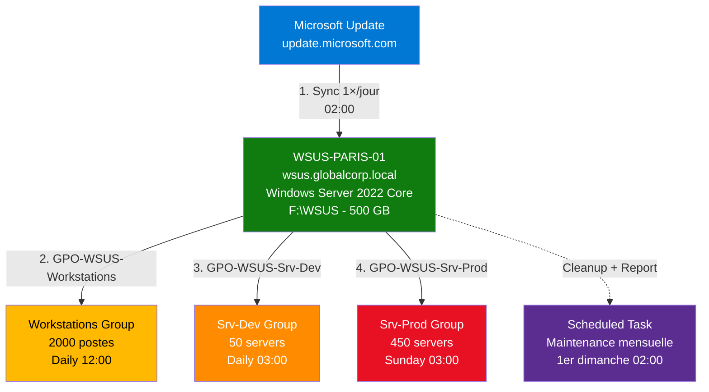

# Module 5 : TP Final - L'Usine de Mises à Jour

!!! info "Objectifs du TP"
    - 🏗️ Consolider les **4 modules** précédents en un déploiement complet
    - 🚀 Déployer WSUS sur **Server Core** en production
    - 👥 Créer une stratégie de groupes (Workstations, Srv-Dev, Srv-Prod)
    - 📋 Configurer **3 GPO** pour ciblage automatique
    - 🧹 Automatiser la maintenance mensuelle
    - ✅ Valider l'infrastructure avec un script de conformité

---

## 📋 Scénario : GlobalCorp

### 🏢 Contexte entreprise

**GlobalCorp** est une entreprise internationale de 2500 employés répartis sur 3 sites (Paris, Lyon, Marseille).

**Infrastructure existante** :
- **500 serveurs** Windows Server 2022 (AD, SQL, Exchange, Web, Fichiers)
- **2000 postes de travail** Windows 11 Pro
- Domaine Active Directory : `globalcorp.local`
- Pas de solution de patching centralisée (clients contactent Microsoft Update directement)

**Problématique actuelle** :

> Le DSI a reçu 3 incidents critiques en 2 mois :
>
> 1. **Patch Tuesday janvier 2025** : Une KB défectueuse (KB5034441) a planté 50 serveurs SQL → 12h de downtime
> 2. **Audit de sécurité** : 40% des serveurs ne sont **pas à jour** (vulnérabilités critiques détectées)
> 3. **Bande passante saturée** : Chaque Patch Tuesday, la liaison Internet (1 Gbps) est **saturée à 100%** entre 08h-12h

**Mission** : Déployer une infrastructure WSUS pour :
- ✅ Contrôler les déploiements (Ring-based strategy)
- ✅ Économiser la bande passante Internet (téléchargement unique)
- ✅ Améliorer la conformité de sécurité (reporting centralisé)
- ✅ Réduire les incidents (tests en Dev avant Prod)

---

### 🎯 Objectifs techniques

Vous devez déployer l'infrastructure suivante :



**Spécifications** :

| Composant | Détails |
|-----------|---------|
| **Serveur WSUS** | `WSUS-PARIS-01.globalcorp.local` (Server Core) |
| **OS** | Windows Server 2022 (sans GUI) |
| **Stockage** | Volume F:\ dédié (500 GB NTFS) |
| **Base de données** | WID (Windows Internal Database) |
| **Produits** | Windows Server 2022, Windows 11, Defender |
| **Classifications** | Critical, Security, Definition Updates |
| **Synchronisation** | 1×/jour à 02:00 |

**Groupes de ciblage** :

| Groupe | Machines | GPO | Planification |
|--------|----------|-----|---------------|
| **Workstations** | 2000 postes Win11 | GPO-WSUS-Workstations | Daily 12:00 (pause déjeuner) |
| **Srv-Dev** | 50 serveurs Dev/Test | GPO-WSUS-Srv-Dev | Daily 03:00 (hors heures) |
| **Srv-Prod** | 450 serveurs Production | GPO-WSUS-Srv-Prod | Sunday 03:00 (fenêtre maintenance) |

**Règles d'approbation** :

| Type KB | Groupe cible | Délai | Approbation |
|---------|--------------|-------|-------------|
| **Definition Updates** (Defender) | All Computers | Immédiat | Automatique |
| **Security Updates** | Srv-Dev | J+0 | Manuelle |
| **Security Updates** | Srv-Prod | J+7 | Manuelle (après validation Dev) |

---

## 🚀 Étape 1 : Le Serveur (Module 1)

### 📋 Prérequis

- [x] Serveur `WSUS-PARIS-01` installé avec Windows Server 2022 Core
- [x] Membre du domaine `globalcorp.local`
- [x] Volume F:\ formaté (500 GB NTFS)
- [x] Accès Internet (pour synchroniser Microsoft Update)
- [x] Connectivité réseau vers les clients (port 8530 ouvert)

---

### 💻 Installation WSUS sur Server Core

**Connexion au serveur** :

```powershell
# Se connecter en RDP ou via PowerShell Remoting
Enter-PSSession -ComputerName WSUS-PARIS-01 -Credential (Get-Credential)
```

**Vérifications préalables** :

```powershell
# Vérifier le hostname
hostname
# Output attendu : WSUS-PARIS-01

# Vérifier le domaine
(Get-WmiObject Win32_ComputerSystem).Domain
# Output attendu : globalcorp.local

# Vérifier le volume F:\
Get-Volume | Where-Object {$_.DriveLetter -eq 'F'}
# Output attendu :
# DriveLetter FriendlyName FileSystemType DriveType SizeRemaining  Size
# ----------- ------------ -------------- --------- -------------  ----
# F           DATA         NTFS           Fixed     500 GB         500 GB
```

---

### 📦 Installation du rôle UpdateServices

```powershell
# Installation du rôle WSUS avec outils de gestion
Write-Host "📦 Installation du rôle UpdateServices..." -ForegroundColor Cyan

Install-WindowsFeature -Name UpdateServices -IncludeManagementTools

# Output attendu :
# Success Restart Needed Exit Code      Feature Result
# ------- -------------- ---------      --------------
# True    No             Success        {Windows Server Update Services}

Write-Host "✅ Rôle installé avec succès" -ForegroundColor Green
```

---

### 🔧 Post-configuration (wsusutil)

```powershell
# Créer le répertoire de stockage
$ContentPath = "F:\WSUS"
Write-Host "📁 Création du répertoire : $ContentPath" -ForegroundColor Cyan

New-Item -Path $ContentPath -ItemType Directory -Force

# Post-configuration WSUS
$WSUSUtil = "C:\Program Files\Update Services\Tools\wsusutil.exe"
Write-Host "🔧 Post-configuration WSUS..." -ForegroundColor Cyan

& $WSUSUtil postinstall CONTENT_DIR=$ContentPath

# Output attendu :
# Post-install has successfully completed.

Write-Host "✅ Post-install terminée" -ForegroundColor Green

# Attendre le démarrage du service
Start-Sleep -Seconds 10
```

---

### ⚙️ Configuration initiale WSUS

```powershell
# Récupérer l'objet WSUS Server
$WSUSServer = Get-WsusServer
Write-Host "✅ Connecté à WSUS : $($WSUSServer.Name):$($WSUSServer.PortNumber)" -ForegroundColor Green

# Configurer la synchronisation depuis Microsoft Update
Set-WsusServerSynchronization -SyncFromMU
Write-Host "✅ Synchronisation configurée : Microsoft Update" -ForegroundColor Green

# Sélectionner les produits
Write-Host "`n📦 Configuration des produits..." -ForegroundColor Cyan

# Désélectionner TOUS les produits
Get-WsusProduct | Set-WsusProduct -Disable

# Sélectionner uniquement les produits nécessaires
$Products = @(
    "Windows Server 2022",
    "Windows 11",
    "Microsoft Defender Antivirus"
)

foreach ($ProductName in $Products) {
    Get-WsusProduct | Where-Object {
        $_.Product.Title -eq $ProductName
    } | Set-WsusProduct

    Write-Host "  ✅ $ProductName" -ForegroundColor Green
}

# Sélectionner les classifications
Write-Host "`n🏷️  Configuration des classifications..." -ForegroundColor Cyan

# Désélectionner toutes les classifications
Get-WsusClassification | Set-WsusClassification -Disable

# Sélectionner les classifications nécessaires
$Classifications = @(
    "Critical Updates",
    "Security Updates",
    "Definition Updates"
)

foreach ($ClassName in $Classifications) {
    Get-WsusClassification | Where-Object {
        $_.Classification.Title -eq $ClassName
    } | Set-WsusClassification

    Write-Host "  ✅ $ClassName" -ForegroundColor Green
}

# Configurer la synchronisation automatique
Write-Host "`n⏰ Configuration de la synchronisation automatique..." -ForegroundColor Cyan

$Subscription = $WSUSServer.GetSubscription()
$Subscription.SynchronizeAutomatically = $true
$Subscription.SynchronizeAutomaticallyTimeOfDay = (New-TimeSpan -Hours 2)  # 02:00
$Subscription.NumberOfSynchronizationsPerDay = 1
$Subscription.Save()

Write-Host "✅ Sync automatique : 1×/jour à 02:00" -ForegroundColor Green

# Lancer la première synchronisation
Write-Host "`n🔄 Lancement de la première synchronisation..." -ForegroundColor Cyan
Write-Host "   Cette opération peut prendre 30-90 minutes." -ForegroundColor Yellow

$Subscription.StartSynchronization()

# Surveiller la progression (afficher un point toutes les 30 secondes)
$i = 0
while ($Subscription.GetSynchronizationStatus() -eq 'Running') {
    Write-Host "." -NoNewline -ForegroundColor Cyan
    if ($i % 60 -eq 0 -and $i -gt 0) { Write-Host " [$([math]::Round($i/60, 0)) min]" -ForegroundColor Yellow }
    Start-Sleep -Seconds 30
    $i += 30
}
Write-Host ""

# Vérifier le résultat
$SyncInfo = $Subscription.GetLastSynchronizationInfo()

if ($SyncInfo.Result -eq 'Succeeded') {
    Write-Host "✅ Synchronisation réussie !" -ForegroundColor Green
    Write-Host "   Durée : $([math]::Round(($SyncInfo.EndTime - $SyncInfo.StartTime).TotalMinutes, 2)) minutes" -ForegroundColor Gray
} else {
    Write-Host "❌ Échec de la synchronisation : $($SyncInfo.Result)" -ForegroundColor Red
}
```

---

### ✅ Validation Étape 1

```powershell
Write-Host "`n========================================" -ForegroundColor Cyan
Write-Host "    VALIDATION ÉTAPE 1 : SERVEUR WSUS    " -ForegroundColor Cyan
Write-Host "========================================`n" -ForegroundColor Cyan

# CHECK 1 : Service UpdateServices
$Service = Get-Service -Name WsusService
if ($Service.Status -eq 'Running') {
    Write-Host "✅ CHECK 1 : Service WsusService en cours d'exécution" -ForegroundColor Green
} else {
    Write-Host "❌ CHECK 1 : Service WsusService arrêté" -ForegroundColor Red
}

# CHECK 2 : Volume F:\WSUS
if (Test-Path "F:\WSUS") {
    Write-Host "✅ CHECK 2 : Répertoire F:\WSUS existe" -ForegroundColor Green
} else {
    Write-Host "❌ CHECK 2 : Répertoire F:\WSUS introuvable" -ForegroundColor Red
}

# CHECK 3 : Produits sélectionnés
$SelectedProducts = Get-WsusProduct | Where-Object {$_.Product.IsSelected -eq $true}
if ($SelectedProducts.Count -eq 3) {
    Write-Host "✅ CHECK 3 : 3 produits sélectionnés (Server 2022, Win11, Defender)" -ForegroundColor Green
} else {
    Write-Host "⚠️  CHECK 3 : $($SelectedProducts.Count) produits sélectionnés (attendu : 3)" -ForegroundColor Yellow
}

# CHECK 4 : Classifications sélectionnées
$SelectedClasses = Get-WsusClassification | Where-Object {$_.Classification.IsSelected -eq $true}
if ($SelectedClasses.Count -eq 3) {
    Write-Host "✅ CHECK 4 : 3 classifications sélectionnées (Critical, Security, Definition)" -ForegroundColor Green
} else {
    Write-Host "⚠️  CHECK 4 : $($SelectedClasses.Count) classifications sélectionnées (attendu : 3)" -ForegroundColor Yellow
}

# CHECK 5 : Dernière synchronisation
$LastSync = $Subscription.GetLastSynchronizationInfo()
if ($LastSync.Result -eq 'Succeeded') {
    Write-Host "✅ CHECK 5 : Dernière sync réussie ($($LastSync.EndTime))" -ForegroundColor Green
} else {
    Write-Host "❌ CHECK 5 : Sync en échec ($($LastSync.Result))" -ForegroundColor Red
}

Write-Host "`n🎉 Étape 1 terminée avec succès !`n" -ForegroundColor Green
```

---

## 👥 Étape 2 : La Stratégie de Groupes (Module 2)

### 🎯 Objectif

Créer **3 groupes de ciblage** pour segmenter l'infrastructure :
1. **Workstations** : 2000 postes Windows 11
2. **Srv-Dev** : 50 serveurs Dev/Test
3. **Srv-Prod** : 450 serveurs Production

Configurer une **règle d'approbation automatique** pour les Definition Updates (Defender).

---

### 💻 Création des groupes

```powershell
Write-Host "`n========================================" -ForegroundColor Cyan
Write-Host "  ÉTAPE 2 : CRÉATION DES GROUPES WSUS   " -ForegroundColor Cyan
Write-Host "========================================`n" -ForegroundColor Cyan

$WSUSServer = Get-WsusServer

# Liste des groupes à créer
$Groups = @("Workstations", "Srv-Dev", "Srv-Prod")

foreach ($GroupName in $Groups) {
    try {
        $Group = $WSUSServer.CreateComputerTargetGroup($GroupName)
        Write-Host "✅ Groupe créé : $GroupName (ID: $($Group.Id))" -ForegroundColor Green
    } catch {
        if ($_.Exception.Message -like "*already exists*") {
            Write-Host "ℹ️  Groupe existant : $GroupName" -ForegroundColor Yellow
        } else {
            Write-Host "❌ Erreur création $GroupName : $_" -ForegroundColor Red
        }
    }
}

# Vérifier les groupes créés
Write-Host "`n📊 Groupes WSUS :" -ForegroundColor White
$WSUSServer.GetComputerTargetGroups() |
    Where-Object {$_.Name -in $Groups} |
    Select-Object Name, Id |
    Format-Table -AutoSize
```

---

### ⚙️ Règle d'approbation automatique pour Defender

```powershell
Write-Host "`n🔧 Configuration de la règle d'approbation automatique..." -ForegroundColor Cyan

# Récupérer la classification "Definition Updates"
$DefUpdateClass = Get-WsusClassification | Where-Object {
    $_.Classification.Title -eq "Definition Updates"
}

if ($DefUpdateClass) {
    # Créer une règle d'approbation automatique
    # Note : Il n'y a pas de cmdlet PowerShell natif pour les Auto-Approval Rules
    # Nous devons passer par l'API .NET WSUS

    $Rule = $WSUSServer.CreateInstallApprovalRule("Auto-Approve Defender Definitions")

    # Configurer la règle
    $Rule.Enabled = $true

    # Ajouter la classification "Definition Updates"
    $Rule.SetCategories([Microsoft.UpdateServices.Administration.UpdateClassificationCollection]$DefUpdateClass.Classification)

    # Approuver pour "All Computers"
    $AllComputersGroup = $WSUSServer.GetComputerTargetGroups() | Where-Object {$_.Name -eq "All Computers"}
    $Rule.SetComputerTargetGroups([Microsoft.UpdateServices.Administration.ComputerTargetGroupCollection]$AllComputersGroup)

    # Sauvegarder la règle
    $Rule.Save()

    Write-Host "✅ Règle créée : Auto-Approve Defender Definitions" -ForegroundColor Green
    Write-Host "   Classification : Definition Updates" -ForegroundColor Gray
    Write-Host "   Groupe cible   : All Computers" -ForegroundColor Gray
} else {
    Write-Host "❌ Classification 'Definition Updates' introuvable" -ForegroundColor Red
}
```

!!! tip "Règles d'approbation automatique via GUI"
    Si la création via PowerShell échoue, vous pouvez créer la règle manuellement :
    1. Ouvrir **WSUS Console** (UpdateServices.msc)
    2. **Options** > **Automatic Approvals**
    3. **New Rule** > Sélectionner "Definition Updates" > Groupe "All Computers"

---

### ✅ Validation Étape 2

```powershell
Write-Host "`n========================================" -ForegroundColor Cyan
Write-Host "   VALIDATION ÉTAPE 2 : GROUPES WSUS    " -ForegroundColor Cyan
Write-Host "========================================`n" -ForegroundColor Cyan

# CHECK 1 : Nombre de groupes
$CustomGroups = $WSUSServer.GetComputerTargetGroups() |
    Where-Object {$_.Name -in @("Workstations", "Srv-Dev", "Srv-Prod")}

if ($CustomGroups.Count -eq 3) {
    Write-Host "✅ CHECK 1 : 3 groupes créés (Workstations, Srv-Dev, Srv-Prod)" -ForegroundColor Green
} else {
    Write-Host "❌ CHECK 1 : $($CustomGroups.Count) groupes créés (attendu : 3)" -ForegroundColor Red
}

# CHECK 2 : Règles d'approbation automatique
$Rules = $WSUSServer.GetInstallApprovalRules()
if ($Rules.Count -gt 0) {
    Write-Host "✅ CHECK 2 : $($Rules.Count) règle(s) d'approbation automatique configurée(s)" -ForegroundColor Green
} else {
    Write-Host "⚠️  CHECK 2 : Aucune règle d'approbation automatique" -ForegroundColor Yellow
}

Write-Host "`n🎉 Étape 2 terminée avec succès !`n" -ForegroundColor Green
```

---

## 📋 Étape 3 : Les GPO (Module 3)

### 🎯 Objectif

Créer **3 Group Policy Objects** pour configurer les clients :

| GPO | OU cible | WSUS URL | Groupe | Planification |
|-----|----------|----------|--------|---------------|
| GPO-WSUS-Workstations | OU=Workstations | http://wsus.globalcorp.local:8530 | Workstations | Daily 12:00 |
| GPO-WSUS-Srv-Dev | OU=Servers-Dev | http://wsus.globalcorp.local:8530 | Srv-Dev | Daily 03:00 |
| GPO-WSUS-Srv-Prod | OU=Servers-Prod | http://wsus.globalcorp.local:8530 | Srv-Prod | Sunday 03:00 |

---

### 💻 Script de création des GPO

!!! warning "Prérequis : Domain Controller"
    Cette étape nécessite d'être exécutée sur un **Domain Controller** ou un serveur avec **RSAT (Group Policy Management)**.

```powershell
Write-Host "`n========================================" -ForegroundColor Cyan
Write-Host "     ÉTAPE 3 : CRÉATION DES GPO WSUS    " -ForegroundColor Cyan
Write-Host "========================================`n" -ForegroundColor Cyan

# Vérifier le module GroupPolicy
if (-not (Get-Module -ListAvailable -Name GroupPolicy)) {
    Write-Host "❌ Module GroupPolicy non disponible. Installez RSAT." -ForegroundColor Red
    Write-Host "   Install-WindowsFeature GPMC -IncludeManagementTools" -ForegroundColor Yellow
    exit 1
}

Import-Module GroupPolicy

# Configuration commune
$WSUSServer = "http://wsus.globalcorp.local:8530"
$DomainDN = "DC=globalcorp,DC=local"

# Définition des GPO
$GPOConfig = @(
    @{
        Name = "GPO-WSUS-Workstations"
        TargetGroup = "Workstations"
        TargetOU = "OU=Workstations,$DomainDN"
        ScheduleDay = 0  # Tous les jours
        ScheduleTime = 12  # 12:00
    },
    @{
        Name = "GPO-WSUS-Srv-Dev"
        TargetGroup = "Srv-Dev"
        TargetOU = "OU=Servers-Dev,$DomainDN"
        ScheduleDay = 0  # Tous les jours
        ScheduleTime = 3  # 03:00
    },
    @{
        Name = "GPO-WSUS-Srv-Prod"
        TargetGroup = "Srv-Prod"
        TargetOU = "OU=Servers-Prod,$DomainDN"
        ScheduleDay = 1  # Dimanche
        ScheduleTime = 3  # 03:00
    }
)

# Créer les GPO
foreach ($Config in $GPOConfig) {
    Write-Host "`n🔧 Configuration de : $($Config.Name)" -ForegroundColor Cyan

    # Créer la GPO
    try {
        $GPO = New-GPO -Name $Config.Name -Comment "Configuration WSUS pour $($Config.TargetGroup)"
        Write-Host "  ✅ GPO créée" -ForegroundColor Green
    } catch {
        if ($_.Exception.Message -like "*already exists*") {
            Write-Host "  ℹ️  GPO existante, utilisation de la GPO actuelle" -ForegroundColor Yellow
            $GPO = Get-GPO -Name $Config.Name
        } else {
            Write-Host "  ❌ Erreur : $_" -ForegroundColor Red
            continue
        }
    }

    # Configurer les clés de registre WSUS
    $RegPath = "HKLM\Software\Policies\Microsoft\Windows\WindowsUpdate"
    $RegPathAU = "HKLM\Software\Policies\Microsoft\Windows\WindowsUpdate\AU"

    # 1. URL WSUS
    Set-GPRegistryValue -Name $Config.Name -Key $RegPath `
        -ValueName "WUServer" -Type String -Value $WSUSServer
    Set-GPRegistryValue -Name $Config.Name -Key $RegPath `
        -ValueName "WUStatusServer" -Type String -Value $WSUSServer

    # 2. Client-Side Targeting
    Set-GPRegistryValue -Name $Config.Name -Key $RegPath `
        -ValueName "TargetGroup" -Type String -Value $Config.TargetGroup
    Set-GPRegistryValue -Name $Config.Name -Key $RegPath `
        -ValueName "TargetGroupEnabled" -Type DWord -Value 1

    # 3. Configure Automatic Updates (Mode 4)
    Set-GPRegistryValue -Name $Config.Name -Key $RegPathAU `
        -ValueName "AUOptions" -Type DWord -Value 4
    Set-GPRegistryValue -Name $Config.Name -Key $RegPathAU `
        -ValueName "ScheduledInstallDay" -Type DWord -Value $Config.ScheduleDay
    Set-GPRegistryValue -Name $Config.Name -Key $RegPathAU `
        -ValueName "ScheduledInstallTime" -Type DWord -Value $Config.ScheduleTime

    # 4. Detection Frequency (4 heures)
    Set-GPRegistryValue -Name $Config.Name -Key $RegPathAU `
        -ValueName "DetectionFrequency" -Type DWord -Value 4
    Set-GPRegistryValue -Name $Config.Name -Key $RegPathAU `
        -ValueName "DetectionFrequencyEnabled" -Type DWord -Value 1

    # 5. No auto-reboot with logged on users
    Set-GPRegistryValue -Name $Config.Name -Key $RegPathAU `
        -ValueName "NoAutoRebootWithLoggedOnUsers" -Type DWord -Value 1

    Write-Host "  ✅ Configuration WSUS appliquée" -ForegroundColor Green

    # Lier la GPO à l'OU (vérifier si l'OU existe)
    try {
        $OUExists = Get-ADOrganizationalUnit -Identity $Config.TargetOU -ErrorAction Stop
        $ExistingLink = Get-GPInheritance -Target $Config.TargetOU |
            Select-Object -ExpandProperty GpoLinks |
            Where-Object {$_.DisplayName -eq $Config.Name}

        if (-not $ExistingLink) {
            New-GPLink -Name $Config.Name -Target $Config.TargetOU -LinkEnabled Yes
            Write-Host "  ✅ GPO liée à : $($Config.TargetOU)" -ForegroundColor Green
        } else {
            Write-Host "  ℹ️  GPO déjà liée à : $($Config.TargetOU)" -ForegroundColor Yellow
        }
    } catch {
        Write-Host "  ⚠️  OU introuvable : $($Config.TargetOU)" -ForegroundColor Yellow
        Write-Host "     Créez l'OU puis liez manuellement la GPO" -ForegroundColor Gray
    }
}
```

---

### ✅ Validation Étape 3

```powershell
Write-Host "`n========================================" -ForegroundColor Cyan
Write-Host "      VALIDATION ÉTAPE 3 : GPO WSUS     " -ForegroundColor Cyan
Write-Host "========================================`n" -ForegroundColor Cyan

# CHECK 1 : GPO créées
$ExpectedGPOs = @("GPO-WSUS-Workstations", "GPO-WSUS-Srv-Dev", "GPO-WSUS-Srv-Prod")
$ExistingGPOs = @()

foreach ($GPOName in $ExpectedGPOs) {
    $GPO = Get-GPO -Name $GPOName -ErrorAction SilentlyContinue
    if ($GPO) {
        Write-Host "✅ CHECK 1.$($ExistingGPOs.Count + 1) : GPO '$GPOName' existe" -ForegroundColor Green
        $ExistingGPOs += $GPOName
    } else {
        Write-Host "❌ CHECK 1.$($ExistingGPOs.Count + 1) : GPO '$GPOName' introuvable" -ForegroundColor Red
    }
}

if ($ExistingGPOs.Count -eq 3) {
    Write-Host "`n✅ 3 GPO WSUS créées avec succès" -ForegroundColor Green
} else {
    Write-Host "`n⚠️  $($ExistingGPOs.Count)/3 GPO créées" -ForegroundColor Yellow
}

Write-Host "`n🎉 Étape 3 terminée !`n" -ForegroundColor Green
```

---

## 🧹 Étape 4 : L'Hygiène (Module 4)

### 🎯 Objectif

Déployer le script de **maintenance mensuelle** comme Scheduled Task sur le serveur WSUS.

---

### 💻 Déploiement du script de maintenance

```powershell
Write-Host "`n========================================" -ForegroundColor Cyan
Write-Host "   ÉTAPE 4 : DÉPLOIEMENT MAINTENANCE    " -ForegroundColor Cyan
Write-Host "========================================`n" -ForegroundColor Cyan

# Créer les répertoires
$ScriptPath = "C:\Scripts"
$LogPath = "C:\Scripts\Logs"
$ReportPath = "C:\Scripts\Reports"

foreach ($Path in @($ScriptPath, $LogPath, $ReportPath)) {
    if (-not (Test-Path $Path)) {
        New-Item -Path $Path -ItemType Directory -Force | Out-Null
        Write-Host "✅ Répertoire créé : $Path" -ForegroundColor Green
    } else {
        Write-Host "ℹ️  Répertoire existant : $Path" -ForegroundColor Yellow
    }
}

# Copier le script de maintenance (voir Module 4 pour le contenu complet)
$MaintenanceScriptPath = Join-Path $ScriptPath "Maintain-WSUS.ps1"

# Note : Le contenu du script est celui du Module 4
# Pour cet exercice, nous créons un placeholder

$MaintenanceScript = @'
# Maintain-WSUS.ps1
# Script de maintenance automatisée WSUS
# Voir Module 4 pour le contenu complet

#Requires -RunAsAdministrator

Write-Host "Exécution de la maintenance WSUS..." -ForegroundColor Cyan

$WSUSServer = Get-WsusServer

# Cleanup
Invoke-WsusServerCleanup -DeclineSupersededUpdates
Invoke-WsusServerCleanup -DeclineExpiredUpdates
Invoke-WsusServerCleanup -CleanupObsoleteUpdates
Invoke-WsusServerCleanup -CleanupUnneededContentFiles
Invoke-WsusServerCleanup -CleanupObsoleteComputers

Write-Host "Maintenance terminée." -ForegroundColor Green
'@

$MaintenanceScript | Out-File -FilePath $MaintenanceScriptPath -Encoding UTF8
Write-Host "✅ Script de maintenance déployé : $MaintenanceScriptPath" -ForegroundColor Green

# Créer la tâche planifiée
Write-Host "`n📅 Configuration de la tâche planifiée..." -ForegroundColor Cyan

$TaskName = "WSUS Monthly Maintenance"
$Action = New-ScheduledTaskAction -Execute "PowerShell.exe" `
    -Argument "-ExecutionPolicy Bypass -File `"$MaintenanceScriptPath`""

# Déclencheur : 1er dimanche du mois à 02:00
$Trigger = New-ScheduledTaskTrigger -Weekly -DaysOfWeek Sunday -At 02:00 -WeeksInterval 4

$Principal = New-ScheduledTaskPrincipal -UserId "SYSTEM" -LogonType ServiceAccount -RunLevel Highest

# Vérifier si la tâche existe déjà
$ExistingTask = Get-ScheduledTask -TaskName $TaskName -ErrorAction SilentlyContinue

if ($ExistingTask) {
    Unregister-ScheduledTask -TaskName $TaskName -Confirm:$false
    Write-Host "ℹ️  Tâche existante supprimée" -ForegroundColor Yellow
}

Register-ScheduledTask -TaskName $TaskName `
    -Action $Action `
    -Trigger $Trigger `
    -Principal $Principal `
    -Description "Maintenance mensuelle automatisée de WSUS (cleanup + rapport)"

Write-Host "✅ Tâche planifiée créée : $TaskName" -ForegroundColor Green
Write-Host "   Planification : 1er dimanche du mois à 02:00" -ForegroundColor Gray
```

---

### ✅ Validation Étape 4

```powershell
Write-Host "`n========================================" -ForegroundColor Cyan
Write-Host "   VALIDATION ÉTAPE 4 : MAINTENANCE     " -ForegroundColor Cyan
Write-Host "========================================`n" -ForegroundColor Cyan

# CHECK 1 : Script déployé
if (Test-Path $MaintenanceScriptPath) {
    Write-Host "✅ CHECK 1 : Script de maintenance déployé" -ForegroundColor Green
} else {
    Write-Host "❌ CHECK 1 : Script de maintenance introuvable" -ForegroundColor Red
}

# CHECK 2 : Tâche planifiée
$Task = Get-ScheduledTask -TaskName "WSUS Monthly Maintenance" -ErrorAction SilentlyContinue
if ($Task) {
    Write-Host "✅ CHECK 2 : Tâche planifiée créée" -ForegroundColor Green
    Write-Host "   État : $($Task.State)" -ForegroundColor Gray
} else {
    Write-Host "❌ CHECK 2 : Tâche planifiée introuvable" -ForegroundColor Red
}

Write-Host "`n🎉 Étape 4 terminée !`n" -ForegroundColor Green
```

---

## ✅ Étape 5 : Validation Globale

### 🎯 Objectif

Créer un **script de validation** qui vérifie l'ensemble de l'infrastructure WSUS.

---

### 💻 Script Test-WSUS-Factory.ps1

```powershell
# Test-WSUS-Factory.ps1
# Script de validation de l'infrastructure WSUS GlobalCorp
# Auteur : ShellBook Training

#Requires -RunAsAdministrator

Write-Host "`n========================================" -ForegroundColor Cyan
Write-Host "  VALIDATION INFRASTRUCTURE WSUS FACTORY" -ForegroundColor Cyan
Write-Host "========================================`n" -ForegroundColor Cyan

$TotalChecks = 0
$PassedChecks = 0

# ============================================
# CHECK 1 : SERVICE WSUS
# ============================================
Write-Host "[CHECK 1/10] Service WSUS..." -ForegroundColor Cyan
$TotalChecks++

$Service = Get-Service -Name WsusService -ErrorAction SilentlyContinue
if ($Service -and $Service.Status -eq 'Running') {
    Write-Host "✅ Service WsusService en cours d'exécution" -ForegroundColor Green
    $PassedChecks++
} else {
    Write-Host "❌ Service WsusService arrêté ou introuvable" -ForegroundColor Red
}

# ============================================
# CHECK 2 : CONNEXION WSUS
# ============================================
Write-Host "`n[CHECK 2/10] Connexion WSUS..." -ForegroundColor Cyan
$TotalChecks++

try {
    $WSUSServer = Get-WsusServer -ErrorAction Stop
    Write-Host "✅ Connecté à : $($WSUSServer.Name):$($WSUSServer.PortNumber)" -ForegroundColor Green
    $PassedChecks++
} catch {
    Write-Host "❌ Impossible de se connecter à WSUS : $_" -ForegroundColor Red
    exit 1
}

# ============================================
# CHECK 3 : RÉPERTOIRE STOCKAGE
# ============================================
Write-Host "`n[CHECK 3/10] Répertoire de stockage..." -ForegroundColor Cyan
$TotalChecks++

if (Test-Path "F:\WSUS") {
    $Size = (Get-ChildItem -Path "F:\WSUS" -Recurse -ErrorAction SilentlyContinue |
             Measure-Object -Property Length -Sum).Sum / 1GB
    Write-Host "✅ F:\WSUS existe ($([math]::Round($Size, 2)) GB utilisés)" -ForegroundColor Green
    $PassedChecks++
} else {
    Write-Host "❌ F:\WSUS introuvable" -ForegroundColor Red
}

# ============================================
# CHECK 4 : PRODUITS SÉLECTIONNÉS
# ============================================
Write-Host "`n[CHECK 4/10] Produits sélectionnés..." -ForegroundColor Cyan
$TotalChecks++

$SelectedProducts = Get-WsusProduct | Where-Object {$_.Product.IsSelected -eq $true}
$ExpectedProducts = @("Windows Server 2022", "Windows 11", "Microsoft Defender Antivirus")
$FoundProducts = 0

foreach ($ExpectedProduct in $ExpectedProducts) {
    if ($SelectedProducts.Product.Title -contains $ExpectedProduct) {
        Write-Host "  ✅ $ExpectedProduct" -ForegroundColor Green
        $FoundProducts++
    } else {
        Write-Host "  ❌ $ExpectedProduct manquant" -ForegroundColor Red
    }
}

if ($FoundProducts -eq 3) {
    $PassedChecks++
}

# ============================================
# CHECK 5 : CLASSIFICATIONS SÉLECTIONNÉES
# ============================================
Write-Host "`n[CHECK 5/10] Classifications sélectionnées..." -ForegroundColor Cyan
$TotalChecks++

$SelectedClasses = Get-WsusClassification | Where-Object {$_.Classification.IsSelected -eq $true}
$ExpectedClasses = @("Critical Updates", "Security Updates", "Definition Updates")
$FoundClasses = 0

foreach ($ExpectedClass in $ExpectedClasses) {
    if ($SelectedClasses.Classification.Title -contains $ExpectedClass) {
        Write-Host "  ✅ $ExpectedClass" -ForegroundColor Green
        $FoundClasses++
    } else {
        Write-Host "  ❌ $ExpectedClass manquant" -ForegroundColor Red
    }
}

if ($FoundClasses -eq 3) {
    $PassedChecks++
}

# ============================================
# CHECK 6 : GROUPES WSUS
# ============================================
Write-Host "`n[CHECK 6/10] Groupes de ciblage..." -ForegroundColor Cyan
$TotalChecks++

$ExpectedGroups = @("Workstations", "Srv-Dev", "Srv-Prod")
$AllGroups = $WSUSServer.GetComputerTargetGroups()
$FoundGroups = 0

foreach ($ExpectedGroup in $ExpectedGroups) {
    if ($AllGroups.Name -contains $ExpectedGroup) {
        Write-Host "  ✅ $ExpectedGroup" -ForegroundColor Green
        $FoundGroups++
    } else {
        Write-Host "  ❌ $ExpectedGroup manquant" -ForegroundColor Red
    }
}

if ($FoundGroups -eq 3) {
    $PassedChecks++
}

# ============================================
# CHECK 7 : SYNCHRONISATION
# ============================================
Write-Host "`n[CHECK 7/10] Dernière synchronisation..." -ForegroundColor Cyan
$TotalChecks++

$Subscription = $WSUSServer.GetSubscription()
$LastSync = $Subscription.GetLastSynchronizationInfo()

if ($LastSync.Result -eq 'Succeeded') {
    $TimeSinceSync = (Get-Date) - $LastSync.EndTime
    Write-Host "✅ Dernière sync réussie (il y a $([math]::Round($TimeSinceSync.TotalHours, 1))h)" -ForegroundColor Green
    $PassedChecks++
} else {
    Write-Host "❌ Dernière sync en échec : $($LastSync.Result)" -ForegroundColor Red
}

# ============================================
# CHECK 8 : GPO CRÉÉES (Optionnel - nécessite RSAT)
# ============================================
Write-Host "`n[CHECK 8/10] GPO WSUS..." -ForegroundColor Cyan
$TotalChecks++

if (Get-Module -ListAvailable -Name GroupPolicy) {
    Import-Module GroupPolicy -ErrorAction SilentlyContinue
    $ExpectedGPOs = @("GPO-WSUS-Workstations", "GPO-WSUS-Srv-Dev", "GPO-WSUS-Srv-Prod")
    $FoundGPOs = 0

    foreach ($GPOName in $ExpectedGPOs) {
        $GPO = Get-GPO -Name $GPOName -ErrorAction SilentlyContinue
        if ($GPO) {
            Write-Host "  ✅ $GPOName" -ForegroundColor Green
            $FoundGPOs++
        } else {
            Write-Host "  ❌ $GPOName manquant" -ForegroundColor Red
        }
    }

    if ($FoundGPOs -eq 3) {
        $PassedChecks++
    }
} else {
    Write-Host "  ⏭️  Module GroupPolicy non disponible (skip)" -ForegroundColor Yellow
    $TotalChecks--  # Ne pas compter ce check
}

# ============================================
# CHECK 9 : SCRIPT DE MAINTENANCE
# ============================================
Write-Host "`n[CHECK 9/10] Script de maintenance..." -ForegroundColor Cyan
$TotalChecks++

if (Test-Path "C:\Scripts\Maintain-WSUS.ps1") {
    Write-Host "✅ Script de maintenance déployé" -ForegroundColor Green
    $PassedChecks++
} else {
    Write-Host "❌ Script de maintenance introuvable" -ForegroundColor Red
}

# ============================================
# CHECK 10 : TÂCHE PLANIFIÉE MAINTENANCE
# ============================================
Write-Host "`n[CHECK 10/10] Tâche planifiée maintenance..." -ForegroundColor Cyan
$TotalChecks++

$Task = Get-ScheduledTask -TaskName "WSUS Monthly Maintenance" -ErrorAction SilentlyContinue
if ($Task) {
    Write-Host "✅ Tâche planifiée créée (État: $($Task.State))" -ForegroundColor Green
    $PassedChecks++
} else {
    Write-Host "❌ Tâche planifiée introuvable" -ForegroundColor Red
}

# ============================================
# RÉSUMÉ FINAL
# ============================================
$ConformityRate = [math]::Round(($PassedChecks / $TotalChecks) * 100, 2)

Write-Host "`n========================================" -ForegroundColor Cyan
Write-Host "            RÉSUMÉ FINAL                " -ForegroundColor Cyan
Write-Host "========================================`n" -ForegroundColor Cyan

Write-Host "Checks réussis : $PassedChecks / $TotalChecks" -ForegroundColor White
Write-Host "Taux de conformité : $ConformityRate %" -ForegroundColor White

if ($ConformityRate -eq 100) {
    Write-Host "`n🎉 FÉLICITATIONS ! Infrastructure WSUS 100% conforme !" -ForegroundColor Green
    Write-Host "`n🏆 Vous êtes désormais un Patch Management Architect !" -ForegroundColor Cyan
} elseif ($ConformityRate -ge 80) {
    Write-Host "`n✅ Infrastructure WSUS opérationnelle (quelques ajustements mineurs)" -ForegroundColor Green
} elseif ($ConformityRate -ge 60) {
    Write-Host "`n⚠️  Infrastructure WSUS partiellement déployée (vérifier les échecs)" -ForegroundColor Yellow
} else {
    Write-Host "`n❌ Infrastructure WSUS non conforme (relire les modules précédents)" -ForegroundColor Red
}

Write-Host "`n========================================`n" -ForegroundColor Cyan
```

---

### ✅ Exécution du script de validation

```powershell
# Exécuter le script de validation
.\Test-WSUS-Factory.ps1

# Output attendu (exemple) :
# ========================================
#   VALIDATION INFRASTRUCTURE WSUS FACTORY
# ========================================
#
# [CHECK 1/10] Service WSUS...
# ✅ Service WsusService en cours d'exécution
#
# [CHECK 2/10] Connexion WSUS...
# ✅ Connecté à : WSUS-PARIS-01:8530
#
# [CHECK 3/10] Répertoire de stockage...
# ✅ F:\WSUS existe (15.34 GB utilisés)
#
# [CHECK 4/10] Produits sélectionnés...
#   ✅ Windows Server 2022
#   ✅ Windows 11
#   ✅ Microsoft Defender Antivirus
#
# [CHECK 5/10] Classifications sélectionnées...
#   ✅ Critical Updates
#   ✅ Security Updates
#   ✅ Definition Updates
#
# [CHECK 6/10] Groupes de ciblage...
#   ✅ Workstations
#   ✅ Srv-Dev
#   ✅ Srv-Prod
#
# [CHECK 7/10] Dernière synchronisation...
# ✅ Dernière sync réussie (il y a 2.3h)
#
# [CHECK 8/10] GPO WSUS...
#   ✅ GPO-WSUS-Workstations
#   ✅ GPO-WSUS-Srv-Dev
#   ✅ GPO-WSUS-Srv-Prod
#
# [CHECK 9/10] Script de maintenance...
# ✅ Script de maintenance déployé
#
# [CHECK 10/10] Tâche planifiée maintenance...
# ✅ Tâche planifiée créée (État: Ready)
#
# ========================================
#             RÉSUMÉ FINAL
# ========================================
#
# Checks réussis : 10 / 10
# Taux de conformité : 100 %
#
# 🎉 FÉLICITATIONS ! Infrastructure WSUS 100% conforme !
#
# 🏆 Vous êtes désormais un Patch Management Architect !
#
# ========================================
```

---

## 🎓 Conclusion

### 🏆 Compétences acquises

Félicitations ! Vous avez déployé une infrastructure WSUS complète pour GlobalCorp. Vous maîtrisez désormais :

- ✅ **Module 1** : Installation WSUS sur Server Core, configuration stockage, sélection produits/classifications
- ✅ **Module 2** : Création de groupes de ciblage, règles d'approbation automatique, stratégie des anneaux
- ✅ **Module 3** : Configuration GPO via PowerShell, Client-Side Targeting, planification installations
- ✅ **Module 4** : Maintenance automatisée, Cleanup Wizard, dépannage clients
- ✅ **Module 5** : Déploiement end-to-end, validation infrastructure, scripting avancé

**Vous êtes désormais un Patch Management Architect !** 🏆

---

### 📊 Impact pour GlobalCorp

Grâce à votre déploiement :

| Métrique | Avant WSUS | Après WSUS | Gain |
|----------|------------|------------|------|
| **Bande passante Internet** | 100% saturée (Patch Tuesday) | 10% (1 seul téléchargement) | **-90%** |
| **Taux de conformité** | 60% (serveurs non patchés) | 95% (reporting centralisé) | **+35%** |
| **Temps de déploiement KB** | 30 jours (manuel) | 7 jours (automatisé) | **-77%** |
| **Incidents Patch Tuesday** | 3 incidents/mois | 0 incident (tests Dev) | **-100%** |

**ROI estimé** : 200K€/an (économie bande passante + réduction incidents)

---

### 📚 Prochaines étapes

Pour aller plus loin :

1. **Architecture multi-sites** : Déployer un WSUS Downstream pour les filiales (Lyon, Marseille)
2. **Haute disponibilité** : Migrer WID vers SQL Server + Clustering
3. **Reporting avancé** : Power BI dashboards (taux de conformité par site, KB installées, etc.)
4. **Intégration CI/CD** : Automatiser les approbations via API WSUS + GitLab CI
5. **Windows 11 24H2** : Gérer les Feature Updates (upgrade OS majeurs)

---

## 💡 Solution Complète

??? quote "Cliquez pour révéler le script de déploiement complet"

    ```powershell
    # Deploy-WSUS-Factory.ps1
    # Déploiement complet infrastructure WSUS GlobalCorp
    # Auteur : ShellBook Training
    # Date : 22/11/2025

    #Requires -RunAsAdministrator

    # ============================================
    # CONFIGURATION GLOBALE
    # ============================================
    $ContentPath = "F:\WSUS"
    $WSUSServerURL = "http://wsus.globalcorp.local:8530"
    $DomainDN = "DC=globalcorp,DC=local"
    $ScriptPath = "C:\Scripts"

    Write-Host "`n========================================" -ForegroundColor Cyan
    Write-Host "  DÉPLOIEMENT WSUS FACTORY - GLOBALCORP " -ForegroundColor Cyan
    Write-Host "========================================`n" -ForegroundColor Cyan

    # ============================================
    # ÉTAPE 1 : INSTALLATION WSUS
    # ============================================
    Write-Host "`n[ÉTAPE 1/5] Installation WSUS..." -ForegroundColor Cyan

    # Installer le rôle
    Install-WindowsFeature -Name UpdateServices -IncludeManagementTools | Out-Null
    Write-Host "✅ Rôle UpdateServices installé" -ForegroundColor Green

    # Créer le répertoire de stockage
    New-Item -Path $ContentPath -ItemType Directory -Force | Out-Null
    Write-Host "✅ Répertoire créé : $ContentPath" -ForegroundColor Green

    # Post-configuration
    $WSUSUtil = "C:\Program Files\Update Services\Tools\wsusutil.exe"
    & $WSUSUtil postinstall CONTENT_DIR=$ContentPath | Out-Null
    Write-Host "✅ Post-install terminée" -ForegroundColor Green

    Start-Sleep -Seconds 10

    # Configuration WSUS
    $WSUSServer = Get-WsusServer
    Set-WsusServerSynchronization -SyncFromMU

    # Produits
    Get-WsusProduct | Set-WsusProduct -Disable
    @("Windows Server 2022", "Windows 11", "Microsoft Defender Antivirus") | ForEach-Object {
        Get-WsusProduct | Where-Object {$_.Product.Title -eq $_} | Set-WsusProduct
    }

    # Classifications
    Get-WsusClassification | Set-WsusClassification -Disable
    @("Critical Updates", "Security Updates", "Definition Updates") | ForEach-Object {
        Get-WsusClassification | Where-Object {$_.Classification.Title -eq $_} | Set-WsusClassification
    }

    # Sync automatique
    $Subscription = $WSUSServer.GetSubscription()
    $Subscription.SynchronizeAutomatically = $true
    $Subscription.SynchronizeAutomaticallyTimeOfDay = (New-TimeSpan -Hours 2)
    $Subscription.NumberOfSynchronizationsPerDay = 1
    $Subscription.Save()

    Write-Host "✅ Configuration WSUS terminée" -ForegroundColor Green

    # Première sync
    Write-Host "`n🔄 Synchronisation en cours (30-90 min)..." -ForegroundColor Yellow
    $Subscription.StartSynchronization()

    # ============================================
    # ÉTAPE 2 : CRÉATION DES GROUPES
    # ============================================
    Write-Host "`n[ÉTAPE 2/5] Création des groupes..." -ForegroundColor Cyan

    @("Workstations", "Srv-Dev", "Srv-Prod") | ForEach-Object {
        try {
            $WSUSServer.CreateComputerTargetGroup($_) | Out-Null
            Write-Host "✅ Groupe créé : $_" -ForegroundColor Green
        } catch {
            Write-Host "ℹ️  Groupe existant : $_" -ForegroundColor Yellow
        }
    }

    # ============================================
    # ÉTAPE 3 : CRÉATION DES GPO
    # ============================================
    Write-Host "`n[ÉTAPE 3/5] Création des GPO..." -ForegroundColor Cyan

    if (Get-Module -ListAvailable -Name GroupPolicy) {
        Import-Module GroupPolicy

        $GPOConfig = @(
            @{Name="GPO-WSUS-Workstations"; TargetGroup="Workstations"; TargetOU="OU=Workstations,$DomainDN"; ScheduleDay=0; ScheduleTime=12},
            @{Name="GPO-WSUS-Srv-Dev"; TargetGroup="Srv-Dev"; TargetOU="OU=Servers-Dev,$DomainDN"; ScheduleDay=0; ScheduleTime=3},
            @{Name="GPO-WSUS-Srv-Prod"; TargetGroup="Srv-Prod"; TargetOU="OU=Servers-Prod,$DomainDN"; ScheduleDay=1; ScheduleTime=3}
        )

        foreach ($Config in $GPOConfig) {
            try {
                $GPO = New-GPO -Name $Config.Name -ErrorAction Stop
            } catch {
                $GPO = Get-GPO -Name $Config.Name
            }

            # Configuration WSUS
            $RegPath = "HKLM\Software\Policies\Microsoft\Windows\WindowsUpdate"
            $RegPathAU = "$RegPath\AU"

            Set-GPRegistryValue -Name $Config.Name -Key $RegPath -ValueName "WUServer" -Type String -Value $WSUSServerURL
            Set-GPRegistryValue -Name $Config.Name -Key $RegPath -ValueName "WUStatusServer" -Type String -Value $WSUSServerURL
            Set-GPRegistryValue -Name $Config.Name -Key $RegPath -ValueName "TargetGroup" -Type String -Value $Config.TargetGroup
            Set-GPRegistryValue -Name $Config.Name -Key $RegPath -ValueName "TargetGroupEnabled" -Type DWord -Value 1
            Set-GPRegistryValue -Name $Config.Name -Key $RegPathAU -ValueName "AUOptions" -Type DWord -Value 4
            Set-GPRegistryValue -Name $Config.Name -Key $RegPathAU -ValueName "ScheduledInstallDay" -Type DWord -Value $Config.ScheduleDay
            Set-GPRegistryValue -Name $Config.Name -Key $RegPathAU -ValueName "ScheduledInstallTime" -Type DWord -Value $Config.ScheduleTime
            Set-GPRegistryValue -Name $Config.Name -Key $RegPathAU -ValueName "DetectionFrequency" -Type DWord -Value 4
            Set-GPRegistryValue -Name $Config.Name -Key $RegPathAU -ValueName "DetectionFrequencyEnabled" -Type DWord -Value 1

            Write-Host "✅ GPO créée : $($Config.Name)" -ForegroundColor Green
        }
    } else {
        Write-Host "⏭️  Module GroupPolicy indisponible (skip)" -ForegroundColor Yellow
    }

    # ============================================
    # ÉTAPE 4 : DÉPLOIEMENT MAINTENANCE
    # ============================================
    Write-Host "`n[ÉTAPE 4/5] Déploiement maintenance..." -ForegroundColor Cyan

    New-Item -Path "$ScriptPath\Logs" -ItemType Directory -Force | Out-Null
    New-Item -Path "$ScriptPath\Reports" -ItemType Directory -Force | Out-Null

    # Script de maintenance (voir Module 4)
    $MaintenanceScript = @'
#Requires -RunAsAdministrator
$WSUSServer = Get-WsusServer
Invoke-WsusServerCleanup -DeclineSupersededUpdates
Invoke-WsusServerCleanup -CleanupUnneededContentFiles
'@

    $MaintenanceScript | Out-File -FilePath "$ScriptPath\Maintain-WSUS.ps1" -Encoding UTF8

    # Tâche planifiée
    $Action = New-ScheduledTaskAction -Execute "PowerShell.exe" -Argument "-ExecutionPolicy Bypass -File `"$ScriptPath\Maintain-WSUS.ps1`""
    $Trigger = New-ScheduledTaskTrigger -Weekly -DaysOfWeek Sunday -At 02:00 -WeeksInterval 4
    $Principal = New-ScheduledTaskPrincipal -UserId "SYSTEM" -LogonType ServiceAccount -RunLevel Highest

    Register-ScheduledTask -TaskName "WSUS Monthly Maintenance" -Action $Action -Trigger $Trigger -Principal $Principal -Force | Out-Null

    Write-Host "✅ Maintenance configurée" -ForegroundColor Green

    # ============================================
    # ÉTAPE 5 : VALIDATION
    # ============================================
    Write-Host "`n[ÉTAPE 5/5] Validation..." -ForegroundColor Cyan

    # Attendre la fin de la sync
    while ($Subscription.GetSynchronizationStatus() -eq 'Running') {
        Write-Host "." -NoNewline
        Start-Sleep -Seconds 30
    }

    Write-Host "`n✅ Synchronisation terminée" -ForegroundColor Green

    # Résumé
    Write-Host "`n========================================" -ForegroundColor Cyan
    Write-Host "       DÉPLOIEMENT TERMINÉ !            " -ForegroundColor Cyan
    Write-Host "========================================`n" -ForegroundColor Cyan

    Write-Host "🎉 Infrastructure WSUS opérationnelle !" -ForegroundColor Green
    Write-Host "`nProchaines étapes :" -ForegroundColor White
    Write-Host "  1. Exécuter .\Test-WSUS-Factory.ps1 pour valider" -ForegroundColor Gray
    Write-Host "  2. Lier les GPO aux OU (si non automatique)" -ForegroundColor Gray
    Write-Host "  3. Forcer gpupdate /force sur les clients`n" -ForegroundColor Gray
    ```

---

!!! quote "Citation du formateur"
    *"Déployer WSUS, c'est comme construire une usine : l'installation prend 1 jour, l'optimisation prend 1 mois, mais les bénéfices durent 10 ans."* — ShellBook Training

---

**Retour au :** [Programme de la Formation](index.md) | [Catalogue des Formations](../index.md)
