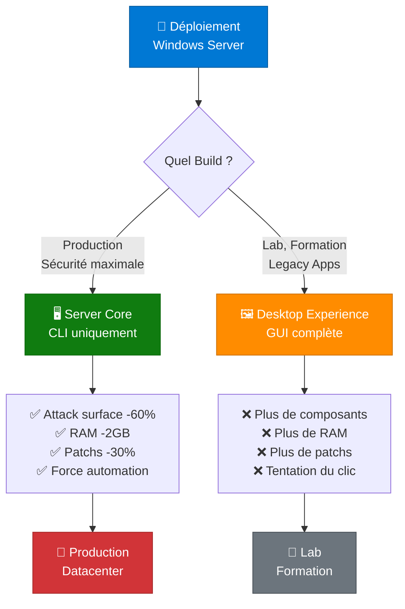
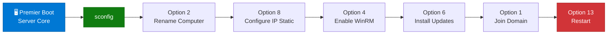
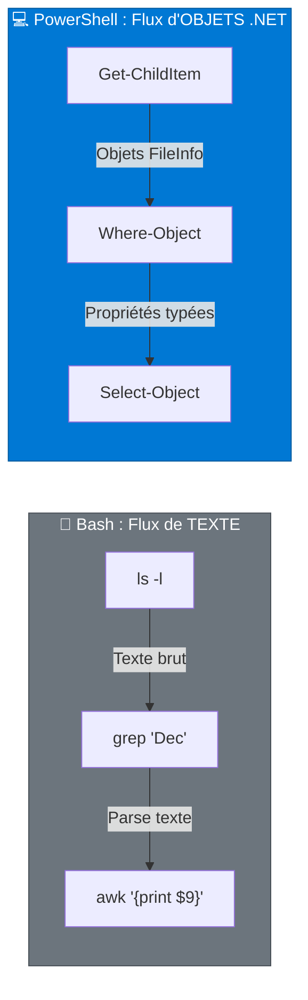

---
tags:
  - formation
  - windows-server
  - server-core
  - powershell
  - sconfig
  - wac
  - openssh
---

# Module 1 : Modern Admin - Le Serveur Moderne

**Objectif :** Maîtriser l'installation, la configuration et l'administration moderne de Windows Server.

---

## Introduction : Bienvenue dans l'Ère Moderne

### Le Changement de Paradigme

```
┌─────────────────────────────────────────────────────────────┐
│         ADMINISTRATION WINDOWS : HIER vs AUJOURD'HUI         │
├─────────────────────────────────────────────────────────────┤
│                                                              │
│  ❌ AVANT (2000-2015)                                       │
│     • Interface graphique omniprésente                       │
│     • Clic-clic dans les MMC consoles                       │
│     • Scripts batch limités                                 │
│     • RDP pour tout                                         │
│     • Installation manuelle des logiciels                   │
│                                                              │
│  ✅ MAINTENANT (2025)                                       │
│     • Server Core (CLI uniquement)                          │
│     • PowerShell pour TOUT                                  │
│     • Windows Admin Center (Web UI moderne)                 │
│     • OpenSSH natif (comme Linux)                           │
│     • Package managers (Winget, Chocolatey)                 │
│     • Infrastructure as Code                                │
│                                                              │
└─────────────────────────────────────────────────────────────┘
```

### Ce Que Vous Allez Apprendre

Dans ce module, vous allez :

- ✅ **Comprendre Server Core** et pourquoi c'est l'avenir de Windows Server
- ✅ **Utiliser sconfig** pour la configuration rapide
- ✅ **Maîtriser PowerShell** (transition Bash → PowerShell : objets vs texte)
- ✅ **Administrer via WAC** (Windows Admin Center : GUI web moderne)
- ✅ **Activer OpenSSH** pour administrer Windows comme Linux
- ✅ **Gérer les packages** avec Winget et Chocolatey

**Durée estimée :** 3-4 heures

---

## Section 1 : Server Core vs Desktop Experience

### Le Choix Stratégique

**Question fondamentale :** Installer Windows Server avec ou sans interface graphique ?



### Comparaison Détaillée

| Aspect | Server Core | Desktop Experience |
|--------|-------------|-------------------|
| **GUI** | ❌ Non (CLI/PowerShell) | ✅ Oui (Explorer, MMC) |
| **Taille disque** | ~6 GB | ~10+ GB |
| **RAM au démarrage** | ~800 MB | ~2.5 GB |
| **Surface d'attaque** | Réduite (~60% moins de composants) | Élevée |
| **Patchs mensuels** | ~30% moins de patchs | Plus de patchs (GUI, IE legacy, etc.) |
| **Administration** | PowerShell, WAC, RSAT à distance | GUI locale + PowerShell |
| **Performance** | Meilleure (pas de GUI overhead) | Inférieure |
| **Cas d'usage** | Production, DC, Hyperviseurs, Fichiers | Lab, Formation, Legacy Apps |
| **Versions supportées** | 2019, 2022, 2025 | 2019, 2022, 2025 |

### Recommandation Officielle

!!! success "Best Practice Microsoft"
    **Utilisez Server Core pour TOUS les serveurs de production.**

    - Domaine Controllers (AD DS)
    - File Servers
    - Hyper-V Hosts
    - Web Servers (IIS)
    - Kubernetes Nodes

    **Exception :** Applications legacy nécessitant impérativement une GUI.

### Vérifier la Version Installée

```powershell
# Vérifier si Server Core est installé
Get-ItemProperty -Path 'HKLM:\SOFTWARE\Microsoft\Windows NT\CurrentVersion' |
    Select-Object ProductName, EditionID, InstallationType

# Output exemple pour Server Core :
# ProductName         : Windows Server 2022 Datacenter
# EditionID           : ServerDatacenter
# InstallationType    : Server Core

# Output exemple pour Desktop Experience :
# InstallationType    : Server
```

---

## Section 2 : sconfig - Le Menu Magique

### Présentation

**sconfig = Server Configuration Tool**

Au démarrage de **Server Core**, vous êtes accueilli par une invite de commande. Tapez `sconfig` pour accéder à un menu de configuration interactif.

```
┌─────────────────────────────────────────────────────────────┐
│                 Server Configuration Tool                    │
│                      (sconfig.exe)                           │
├─────────────────────────────────────────────────────────────┤
│                                                              │
│  1) Domain/Workgroup                 9) Date and Time       │
│  2) Computer Name                   10) Telemetry Settings  │
│  3) Add Local Administrator         11) Windows Activation  │
│  4) Configure Remote Management     12) Log Off User        │
│  5) Windows Update Settings         13) Restart Server      │
│  6) Download and Install Updates    14) Shut Down Server    │
│  7) Remote Desktop                  15) Exit to Command Line│
│  8) Network Settings                                        │
│                                                              │
│  Enter number to select an option:                          │
└─────────────────────────────────────────────────────────────┘
```

### Workflow Typique de Configuration Initiale

**Scénario :** Nouveau serveur Server Core déployé, configuration avant jonction au domaine.



### Commandes Essentielles

**Lancer sconfig :**

```powershell
# Lancer sconfig
sconfig
```

**Étapes recommandées :**

1. **Option 2 : Computer Name**
   - Renommer le serveur (exemple : `SRV-DC01`, `SRV-WEB01`)
   - Redémarrage requis après modification

2. **Option 8 : Network Settings**
   - Sélectionner l'adaptateur réseau
   - Configurer IP statique, masque, passerelle, DNS
   - Désactiver IPv6 si non utilisé

3. **Option 4 : Configure Remote Management**
   - Activer WinRM (Windows Remote Management) pour PowerShell Remoting
   - Activer MMC Remote Management (pour RSAT)

4. **Option 6 : Download and Install Updates**
   - Rechercher et installer les mises à jour Windows
   - **Important :** Faites cela AVANT la jonction au domaine

5. **Option 1 : Domain/Workgroup**
   - Joindre le domaine Active Directory
   - Fournir les credentials d'un compte avec droits de jonction
   - Redémarrage automatique après jonction

!!! tip "sconfig sur Desktop Experience"
    `sconfig` fonctionne aussi sur Desktop Experience (avec GUI). C'est un outil universel pour la configuration rapide de Windows Server 2019, 2022 et 2025.

---

## Section 3 : PowerShell Fundamentals - Penser en Objets

### Le Choc Culturel : Objets vs Texte

Si vous venez du monde Linux, PowerShell va bouleverser votre façon de penser.



### Exemple Frappant

**Objectif :** Lister les fichiers modifiés en décembre.

=== "Bash (Parse de texte)"
    ```bash
    # Fragile : si le format de `ls -l` change, le script casse
    ls -l | grep "Dec"

    # Plus robuste mais verbeux
    find . -type f -newermt "2024-12-01" ! -newermt "2025-01-01"
    ```

=== "PowerShell (Manipulation d'objets)"
    ```powershell
    # Manipulation directe de propriétés (toujours fiable)
    Get-ChildItem | Where-Object { $_.LastWriteTime.Month -eq 12 }

    # Avec raccourcis
    gci | ? { $_.LastWriteTime.Month -eq 12 }
    ```

### Pourquoi C'est Puissant

```powershell
# L'objet FileInfo a des propriétés typées
$file = Get-Item "document.txt"

$file.Name              # String: "document.txt"
$file.Length            # Int64: 1024 (octets)
$file.LastWriteTime     # DateTime: 2024-01-15 10:30:00
$file.Extension         # String: ".txt"
$file.Directory         # DirectoryInfo: C:\Users\...

# On peut appeler des méthodes sur l'objet
$file.CopyTo("backup.txt")
$file.MoveTo("C:\Backup\document.txt")
$file.Delete()
```

**Avantages :**

- ✅ **Typé** : Pas de parsing, pas d'erreurs
- ✅ **Explorable** : `Get-Member` révèle toutes les propriétés/méthodes
- ✅ **Consistant** : La structure ne change jamais
- ✅ **Puissant** : Opérations complexes en une ligne

---

### La Grammaire : Verbe-Nom

**Toutes les cmdlets PowerShell suivent le pattern `Verbe-Nom`.**

| Verbe | Action | Exemples |
|-------|--------|----------|
| `Get-` | Récupérer | `Get-Process`, `Get-Service`, `Get-Content` |
| `Set-` | Modifier | `Set-Location`, `Set-Content`, `Set-Service` |
| `New-` | Créer | `New-Item`, `New-Service`, `New-ADUser` |
| `Remove-` | Supprimer | `Remove-Item`, `Remove-Service` |
| `Start-` | Démarrer | `Start-Process`, `Start-Service` |
| `Stop-` | Arrêter | `Stop-Process`, `Stop-Service` |
| `Restart-` | Redémarrer | `Restart-Service`, `Restart-Computer` |
| `Test-` | Tester | `Test-Path`, `Test-NetConnection` |
| `Invoke-` | Exécuter | `Invoke-Command`, `Invoke-WebRequest` |

```powershell
# Lister tous les verbes approuvés
Get-Verb

# Trouver les cmdlets pour les services
Get-Command -Noun Service
# Résultat : Get-Service, Set-Service, Start-Service, Stop-Service...

# Trouver toutes les cmdlets "Get-*"
Get-Command -Verb Get | Select-Object -First 20
```

---

### Les Alias : Le Piège !

!!! danger "Attention : Ces commandes ne sont PAS les binaires Linux"
    PowerShell définit des **alias** qui ressemblent aux commandes Unix mais ont un comportement différent.

| Alias PS | Cmdlet réelle | Binaire Linux |
|----------|---------------|---------------|
| `ls` | `Get-ChildItem` | `/bin/ls` |
| `dir` | `Get-ChildItem` | - |
| `cat` | `Get-Content` | `/bin/cat` |
| `cp` | `Copy-Item` | `/bin/cp` |
| `mv` | `Move-Item` | `/bin/mv` |
| `rm` | `Remove-Item` | `/bin/rm` |
| `pwd` | `Get-Location` | `/bin/pwd` |
| `cd` | `Set-Location` | builtin |
| `curl` | `Invoke-WebRequest` | `/usr/bin/curl` |
| `wget` | `Invoke-WebRequest` | `/usr/bin/wget` |

```powershell
# Voir la vraie commande derrière un alias
Get-Alias ls
# Résultat : Alias: ls -> Get-ChildItem

Get-Alias curl
# Résultat : Alias: curl -> Invoke-WebRequest

# Piège : les options Linux ne marchent pas !
ls -la          # ❌ ERREUR
ls -Force       # ✅ OK (option PowerShell)
Get-ChildItem -Force  # ✅ Explicite et clair
```

!!! tip "Bonne Pratique"
    **En scripts :** Utilisez les noms complets des cmdlets (lisibilité, portabilité).

    - ✅ Scripts : `Get-ChildItem`, `Get-Content`, `Where-Object`
    - ✅ Interactif : `ls`, `cat`, `gci`, `?` (pour taper vite)

---

### Le Pipeline & Filtrage

#### Get-Member : Le "man" Interactif

`Get-Member` (alias `gm`) révèle la structure d'un objet : propriétés et méthodes.

```powershell
# Voir les membres d'un objet Process
Get-Process | Get-Member

# Output:
#    TypeName: System.Diagnostics.Process
#
# Name                       MemberType     Definition
# ----                       ----------     ----------
# Kill                       Method         void Kill()
# Start                      Method         bool Start()
# CPU                        Property       double CPU {get;}
# Id                         Property       int Id {get;}
# ProcessName                Property       string ProcessName {get;}
# WorkingSet64               Property       long WorkingSet64 {get;}

# Voir les propriétés uniquement
Get-Process | gm -MemberType Property

# Voir les méthodes
Get-Process | gm -MemberType Method
```

#### Select-Object : Choisir des Colonnes

Équivalent de `awk '{print $1, $3}'` mais typé.

```powershell
# Sélectionner des propriétés
Get-Process | Select-Object Name, Id, CPU

# Alias court
Get-Process | select Name, Id, CPU

# Premiers/derniers éléments
Get-Process | Select-Object -First 5
Get-Process | Select-Object -Last 3

# Propriétés calculées
Get-Process | Select-Object Name, @{N='RAM_MB';E={[int]($_.WorkingSet64/1MB)}}
```

#### Where-Object : Filtrer

Équivalent de `grep` mais sur les propriétés des objets.

```powershell
# Filtrer par condition
Get-Process | Where-Object { $_.CPU -gt 100 }

# Alias courts
Get-Process | ? { $_.CPU -gt 100 }
Get-Process | where CPU -gt 100    # Syntaxe simplifiée

# Conditions multiples
Get-Service | Where-Object { $_.Status -eq "Running" -and $_.Name -like "Win*" }

# Opérateurs de comparaison
# -eq    : Égal
# -ne    : Différent
# -gt    : Plus grand
# -lt    : Plus petit
# -ge    : Plus grand ou égal
# -le    : Plus petit ou égal
# -like  : Pattern matching (* et ?)
# -match : Regex
```

#### Sort-Object : Trier

```powershell
# Trier par propriété
Get-Process | Sort-Object CPU

# Tri descendant
Get-Process | Sort-Object CPU -Descending

# Tri multiple
Get-Process | Sort-Object CPU, WorkingSet64 -Descending

# Top 10 processus par RAM
Get-Process | Sort-Object WorkingSet64 -Descending | Select-Object -First 10
```

---

### Script de Post-Installation

**Scénario :** Nouveau serveur déployé, configuration rapide avant jonction au domaine.

```powershell
# ============================================================
# Script de Post-Installation Windows Server
# Compatible : 2019, 2022, 2025 (Server Core & Desktop)
# ============================================================

# 1. Renommer le serveur
$NewName = "SRV-DC01"
Rename-Computer -NewName $NewName -Force

# 2. Configurer le fuseau horaire
Set-TimeZone -Id "Romance Standard Time"  # Paris (GMT+1)
# Autres exemples :
# "Eastern Standard Time"   # New York
# "Pacific Standard Time"   # Los Angeles

# 3. Configurer IP statique
$InterfaceAlias = "Ethernet"  # Adapter avec Get-NetAdapter
$IPAddress = "192.168.1.10"
$PrefixLength = 24
$Gateway = "192.168.1.1"
$DNS = @("192.168.1.1", "8.8.8.8")

New-NetIPAddress -InterfaceAlias $InterfaceAlias `
    -IPAddress $IPAddress `
    -PrefixLength $PrefixLength `
    -DefaultGateway $Gateway

Set-DnsClientServerAddress -InterfaceAlias $InterfaceAlias `
    -ServerAddresses $DNS

# 4. Désactiver IPv6 (si non utilisé)
Disable-NetAdapterBinding -Name $InterfaceAlias -ComponentID ms_tcpip6

# 5. Activer WinRM (pour administration à distance)
Enable-PSRemoting -Force
Set-Item WSMan:\localhost\Client\TrustedHosts -Value "*" -Force

# 6. Configurer le firewall (RDP + WinRM)
Enable-NetFirewallRule -DisplayGroup "Remote Desktop"
Enable-NetFirewallRule -DisplayGroup "Windows Remote Management"

# 7. Joindre le domaine (remplacer par vos valeurs)
$Domain = "corp.local"
$Credential = Get-Credential -Message "Compte avec droits de jonction au domaine"
Add-Computer -DomainName $Domain -Credential $Credential -Restart

# Le serveur redémarre automatiquement après jonction
```

**Usage :**

```powershell
# Sauvegarder le script dans C:\Temp\PostInstall.ps1
# Exécuter en administrateur
Set-ExecutionPolicy Bypass -Scope Process -Force
C:\Temp\PostInstall.ps1
```

---

## Section 4 : Windows Admin Center (WAC)

### Qu'est-ce que WAC ?

**Windows Admin Center = La Console Web pour Server Core**

```
┌─────────────────────────────────────────────────────────────┐
│                   ÉVOLUTION DE L'ADMIN                       │
├─────────────────────────────────────────────────────────────┤
│                                                              │
│  2000-2012 : MMC Consoles (RSAT)                            │
│  ────────────────────────────────                            │
│  ✗ GUI locale uniquement                                    │
│  ✗ Nécessite Windows sur le poste admin                     │
│  ✗ Pas de gestion centralisée                               │
│                                                              │
│  2012-2019 : PowerShell Remoting                            │
│  ──────────────────────────────                              │
│  ✓ Gestion à distance                                       │
│  ✗ CLI uniquement (pas user-friendly)                       │
│                                                              │
│  2019+ : Windows Admin Center (WAC)                         │
│  ─────────────────────────────────────                       │
│  ✓ Interface Web moderne (HTML5)                            │
│  ✓ Gestion multi-serveurs centralisée                       │
│  ✓ Extensions (Azure, Monitoring, etc.)                     │
│  ✓ Fonctionne sur Server Core                               │
│                                                              │
└─────────────────────────────────────────────────────────────┘
```

### Installation

**Deux modes de déploiement :**

#### Mode 1 : Gateway (Production)

**WAC installé sur un serveur dédié pour gérer tout le datacenter.**

```powershell
# Télécharger WAC (https://aka.ms/wacdownload)
# Installation en mode Gateway
msiexec /i WindowsAdminCenter.msi /qn /L*v log.txt `
  SME_PORT=443 `
  SSL_CERTIFICATE_OPTION=generate

# Ou via PowerShell
Start-Process msiexec.exe -ArgumentList @(
  "/i", "WindowsAdminCenter.msi",
  "/qn",
  "SME_PORT=443",
  "SSL_CERTIFICATE_OPTION=generate"
) -Wait
```

**Accès :** `https://wac-server.corp.local`

**Avantages :**

- ✅ Gestion centralisée de tous les serveurs
- ✅ Accès depuis n'importe quel navigateur
- ✅ Certificat SSL centralisé
- ✅ RBAC (délégation d'accès)

#### Mode 2 : Local (Poste Admin)

**WAC installé sur Windows 10/11 pour gérer quelques serveurs.**

```powershell
# Installation en mode Desktop
msiexec /i WindowsAdminCenter.msi /qn /L*v log.txt `
  SME_PORT=6516 `
  SME_THUMBPRINT=auto

# Accès local
start https://localhost:6516
```

**Cas d'usage :**

- Poste d'admin pour gérer 5-10 serveurs
- Environnement de lab/test
- Pas besoin de serveur dédié

### Configuration Post-Installation

```powershell
# Autoriser WinRM sur les serveurs cibles
Enable-PSRemoting -Force

# Activer CredSSP (si nécessaire pour certaines tâches)
Enable-WSManCredSSP -Role Server -Force

# Ajouter WAC aux hôtes de confiance (sur les serveurs cibles)
Set-Item WSMan:\localhost\Client\TrustedHosts -Value "wac-server.corp.local" -Force
```

### Fonctionnalités Clés

| Fonctionnalité | Description | Killer Feature |
|----------------|-------------|----------------|
| **Server Manager** | Vue d'ensemble CPU/RAM/Disque en temps réel | |
| **Certificate Management** | Gestion des certificats SSL (création, renouvellement, ACME) | ⭐ **OUI** |
| **Event Viewer** | Visualisation moderne des logs (filtres, recherche, export) | ⭐ **OUI** |
| **Firewall** | Configuration GUI du firewall | |
| **Files & File Sharing** | Explorateur de fichiers web, gestion des partages SMB | |
| **Local Users & Groups** | Gestion des comptes locaux | |
| **Roles & Features** | Installation/désinstallation de rôles (GUI) | |
| **Updates** | Windows Update centralisé | |
| **PowerShell** | Console PowerShell intégrée au navigateur | ⭐ **OUI** |
| **Remote Desktop** | RDP directement dans le navigateur (HTML5) | |

**Les 3 Killer Features de WAC :**

1. **Gestion des Certificats** : Créer, importer, renouveler des certificats SSL sans ligne de commande
2. **Event Viewer Moderne** : Filtrage intelligent, recherche full-text, export CSV/JSON
3. **PowerShell Web** : Console PowerShell dans le navigateur, idéal pour Server Core

---

## Section 5 : OpenSSH sur Windows (Feature 2025)

### Le Problème Historique

```
Admin Linux : "ssh user@serveur"  → Connecté en 1 seconde
Admin Windows: "Télécharger PuTTY, configurer, lancer..."
               "Ou activer WinRM/PSRemoting..."
```

### La Solution : OpenSSH Server Intégré

**OpenSSH est maintenant pré-installé sur Windows Server 2025 et facile à activer.**


### Installation & Configuration

```powershell
# Vérifier si OpenSSH Server est installé
Get-WindowsCapability -Online | Where-Object Name -like 'OpenSSH.Server*'

# Installer si nécessaire (déjà présent sur Server 2025)
Add-WindowsCapability -Online -Name OpenSSH.Server~~~~0.0.1.0

# Activer et démarrer le service
Start-Service sshd
Set-Service -Name sshd -StartupType Automatic

# Ouvrir le port firewall (automatique sur Server 2025)
New-NetFirewallRule -Name sshd -DisplayName 'OpenSSH Server (sshd)' `
  -Enabled True -Direction Inbound -Protocol TCP -Action Allow -LocalPort 22
```

### Connexion depuis Linux/macOS

```bash
# Connexion SSH classique
ssh administrator@windows-server.corp.local

# Avec clé SSH (recommandé)
ssh -i ~/.ssh/id_rsa administrator@windows-server.corp.local

# SCP pour transférer des fichiers
scp file.txt administrator@windows-server.corp.local:C:\\Temp\\

# SFTP interactif
sftp administrator@windows-server.corp.local
```

### Authentification par Clé SSH

```powershell
# Sur le serveur Windows (en admin)
# Créer le dossier .ssh
mkdir C:\Users\Administrator\.ssh

# Copier la clé publique (depuis Linux)
# Sur Linux : ssh-copy-id administrator@windows-server
# Ou manuellement :
echo "ssh-rsa AAAAB3Nza..." >> C:\Users\Administrator\.ssh\authorized_keys

# Permissions (importantes)
icacls C:\Users\Administrator\.ssh\authorized_keys /inheritance:r
icacls C:\Users\Administrator\.ssh\authorized_keys /grant "Administrator:F"
icacls C:\Users\Administrator\.ssh\authorized_keys /remove "NT AUTHORITY\Authenticated Users"
```

### Configuration Avancée

```powershell
# Fichier de config SSH
notepad C:\ProgramData\ssh\sshd_config

# Options importantes
# PasswordAuthentication yes      # Auth par mot de passe
# PubkeyAuthentication yes         # Auth par clé SSH (recommandé)
# PermitRootLogin no               # Interdire login direct admin

# Redémarrer après modification
Restart-Service sshd
```

!!! tip "Shell par Défaut PowerShell"
    Configurer PowerShell comme shell SSH par défaut :

    ```powershell
    New-ItemProperty -Path "HKLM:\SOFTWARE\OpenSSH" `
      -Name DefaultShell `
      -Value "C:\Windows\System32\WindowsPowerShell\v1.0\powershell.exe" `
      -PropertyType String -Force
    ```

**Avantages :**

- ✅ Standard universel (compatibilité totale avec Linux/macOS)
- ✅ Authentification par clé SSH (plus sûr que mot de passe)
- ✅ SCP/SFTP natif pour transfert de fichiers
- ✅ Pas besoin de PuTTY ou autre outil tiers

---

## Section 6 : Package Management Moderne

### Fini les .exe et "Suivant > Suivant"

```
┌─────────────────────────────────────────────────────────────┐
│                      AVANT (2010)                            │
│  1. Télécharger setup.exe                                   │
│  2. Suivant > Suivant > J'accepte > Suivant > Installer     │
│  3. Redémarrer                                              │
│  4. Répéter x50 serveurs                                    │
├─────────────────────────────────────────────────────────────┤
│                    MAINTENANT (2025)                         │
│  winget install Git.Git 7zip.7zip VSCode.VSCode -y          │
│  ou                                                          │
│  choco install git 7zip vscode -y                           │
└─────────────────────────────────────────────────────────────┘
```

### Winget (Natif Microsoft)

Winget est le gestionnaire de paquets officiel Microsoft (Windows 10/11, Server 2022+).

```powershell
# Rechercher un paquet
winget search git
winget search "visual studio"

# Installer
winget install Git.Git
winget install Microsoft.VisualStudioCode
winget install 7zip.7zip

# Installation silencieuse
winget install Git.Git --silent

# Installer plusieurs paquets
winget install Git.Git 7zip.7zip Notepad++.Notepad++ --silent

# Mettre à jour un paquet
winget upgrade Git.Git

# Mettre à jour tous les paquets
winget upgrade --all

# Lister les paquets installés
winget list

# Désinstaller
winget uninstall Git.Git

# Exporter la liste (pour répliquer)
winget export -o packages.json

# Importer sur une autre machine
winget import -i packages.json
```

### Chocolatey (Le Standard Historique)

Chocolatey est le gestionnaire communautaire, plus mature et avec plus de paquets.

```powershell
# Installation de Chocolatey (en admin)
Set-ExecutionPolicy Bypass -Scope Process -Force
[System.Net.ServicePointManager]::SecurityProtocol = `
    [System.Net.ServicePointManager]::SecurityProtocol -bor 3072
iex ((New-Object System.Net.WebClient).DownloadString(
    'https://community.chocolatey.org/install.ps1'))

# Rechercher un paquet
choco search firefox

# Installer
choco install firefox -y
choco install git 7zip vscode -y

# Mettre à jour
choco upgrade firefox -y
choco upgrade all -y

# Lister les paquets installés
choco list

# Désinstaller
choco uninstall firefox -y

# Installer une version spécifique
choco install nodejs --version=18.17.0 -y
```

### Comparatif

| Aspect | Winget | Chocolatey |
|--------|--------|------------|
| **Origine** | Microsoft | Communauté |
| **Paquets** | ~5,000 | ~10,000+ |
| **Intégration** | Natif Windows 11 | À installer |
| **Licence** | Gratuit | Gratuit + Pro |
| **Serveur interne** | Non | Oui (Pro) |

!!! tip "Automatisation (Ansible/Terraform)"
    Les deux supportent l'installation silencieuse, essentielle pour :

    - **Ansible** : Module `win_chocolatey` ou `win_package`
    - **Terraform** : Provisioner avec scripts PowerShell
    - **PowerShell DSC** : Configuration déclarative

    ```yaml
    # Ansible avec Chocolatey
    - name: Install packages
      win_chocolatey:
        name:
          - git
          - 7zip
          - vscode
        state: present
    ```

---

## Exercice Pratique : Déployer un Server Core Moderne

### Contexte

Vous êtes admin système dans une entreprise. Votre chef vous demande de déployer un nouveau **Windows Server 2022 Core** qui servira de **Domain Controller**.

**Exigences :**

1. ✅ Server Core (pas de GUI)
2. ✅ Nom : `SRV-DC01`
3. ✅ IP statique : `192.168.100.10/24`, Gateway `192.168.100.1`, DNS `8.8.8.8`
4. ✅ Fuseau horaire : Romance Standard Time (Paris)
5. ✅ WinRM activé pour administration à distance
6. ✅ OpenSSH Server installé et activé
7. ✅ PowerShell 7 installé (via Winget ou Chocolatey)
8. ✅ Mises à jour Windows installées
9. ✅ Prêt pour jonction au domaine (mais ne pas joindre encore)

### Instructions

Vous disposez d'un serveur fraîchement installé avec Server Core. Vous avez accès à la console physique (ou KVM).

**Tâches à réaliser :**

1. Utiliser `sconfig` pour la configuration initiale (nom, IP, WinRM)
2. Activer OpenSSH Server
3. Installer PowerShell 7 avec Winget OU Chocolatey
4. Créer un script PowerShell de validation qui affiche :
   - Nom du serveur
   - Configuration IP
   - Services actifs (sshd, WinRM)
   - Version PowerShell

**Livrables :**

- Script PowerShell de post-installation `Deploy-ServerCore.ps1`
- Script de validation `Validate-ServerCore.ps1`

---

??? quote "Solution Complète"

    ### Script 1 : Deploy-ServerCore.ps1

    ```powershell
    # ============================================================
    # Deploy-ServerCore.ps1
    # Déploiement automatisé d'un Windows Server Core
    # ============================================================

    Write-Host "=== Déploiement Server Core ===" -ForegroundColor Cyan

    # 1. Renommer le serveur
    Write-Host "[1/8] Renommage du serveur..." -ForegroundColor Yellow
    $NewName = "SRV-DC01"
    Rename-Computer -NewName $NewName -Force
    Write-Host "✓ Serveur renommé : $NewName" -ForegroundColor Green

    # 2. Configurer le fuseau horaire
    Write-Host "[2/8] Configuration fuseau horaire..." -ForegroundColor Yellow
    Set-TimeZone -Id "Romance Standard Time"
    $tz = Get-TimeZone
    Write-Host "✓ Fuseau horaire : $($tz.DisplayName)" -ForegroundColor Green

    # 3. Configurer IP statique
    Write-Host "[3/8] Configuration IP statique..." -ForegroundColor Yellow
    $InterfaceAlias = (Get-NetAdapter | Where-Object Status -eq "Up").Name
    $IPAddress = "192.168.100.10"
    $PrefixLength = 24
    $Gateway = "192.168.100.1"
    $DNS = @("8.8.8.8", "8.8.4.4")

    # Supprimer l'IP DHCP existante si présente
    Remove-NetIPAddress -InterfaceAlias $InterfaceAlias -Confirm:$false -ErrorAction SilentlyContinue
    Remove-NetRoute -InterfaceAlias $InterfaceAlias -Confirm:$false -ErrorAction SilentlyContinue

    # Configurer la nouvelle IP
    New-NetIPAddress -InterfaceAlias $InterfaceAlias `
        -IPAddress $IPAddress `
        -PrefixLength $PrefixLength `
        -DefaultGateway $Gateway

    Set-DnsClientServerAddress -InterfaceAlias $InterfaceAlias `
        -ServerAddresses $DNS

    Write-Host "✓ IP configurée : $IPAddress/$PrefixLength" -ForegroundColor Green

    # 4. Désactiver IPv6
    Write-Host "[4/8] Désactivation IPv6..." -ForegroundColor Yellow
    Disable-NetAdapterBinding -Name $InterfaceAlias -ComponentID ms_tcpip6
    Write-Host "✓ IPv6 désactivé" -ForegroundColor Green

    # 5. Activer WinRM
    Write-Host "[5/8] Activation WinRM..." -ForegroundColor Yellow
    Enable-PSRemoting -Force
    Set-Item WSMan:\localhost\Client\TrustedHosts -Value "*" -Force
    Enable-NetFirewallRule -DisplayGroup "Windows Remote Management"
    Write-Host "✓ WinRM activé" -ForegroundColor Green

    # 6. Installer et activer OpenSSH Server
    Write-Host "[6/8] Installation OpenSSH Server..." -ForegroundColor Yellow
    Add-WindowsCapability -Online -Name OpenSSH.Server~~~~0.0.1.0

    Start-Service sshd
    Set-Service -Name sshd -StartupType Automatic

    # Firewall OpenSSH
    New-NetFirewallRule -Name sshd -DisplayName 'OpenSSH Server (sshd)' `
      -Enabled True -Direction Inbound -Protocol TCP -Action Allow -LocalPort 22

    # Configurer PowerShell comme shell par défaut
    New-ItemProperty -Path "HKLM:\SOFTWARE\OpenSSH" `
      -Name DefaultShell `
      -Value "C:\Windows\System32\WindowsPowerShell\v1.0\powershell.exe" `
      -PropertyType String -Force

    Write-Host "✓ OpenSSH Server activé (port 22)" -ForegroundColor Green

    # 7. Installer PowerShell 7 (via Winget)
    Write-Host "[7/8] Installation PowerShell 7..." -ForegroundColor Yellow
    try {
        winget install --id Microsoft.Powershell --silent --accept-source-agreements --accept-package-agreements
        Write-Host "✓ PowerShell 7 installé" -ForegroundColor Green
    } catch {
        Write-Host "⚠ Winget non disponible, PowerShell 7 non installé" -ForegroundColor Yellow
    }

    # 8. Installer les mises à jour Windows
    Write-Host "[8/8] Recherche de mises à jour..." -ForegroundColor Yellow
    Install-Module -Name PSWindowsUpdate -Force -SkipPublisherCheck
    Import-Module PSWindowsUpdate
    Get-WindowsUpdate -Install -AcceptAll -IgnoreReboot
    Write-Host "✓ Mises à jour installées" -ForegroundColor Green

    Write-Host "`n=== Déploiement Terminé ===" -ForegroundColor Cyan
    Write-Host "ATTENTION : Redémarrage requis pour appliquer le nouveau nom." -ForegroundColor Red
    Write-Host "Commande : Restart-Computer -Force" -ForegroundColor Yellow
    ```

    ---

    ### Script 2 : Validate-ServerCore.ps1

    ```powershell
    # ============================================================
    # Validate-ServerCore.ps1
    # Validation de la configuration Server Core
    # ============================================================

    Write-Host "`n=== Validation Configuration Server Core ===" -ForegroundColor Cyan

    # 1. Informations Serveur
    Write-Host "`n[1] INFORMATIONS SERVEUR" -ForegroundColor Yellow
    Write-Host "─────────────────────────────────────────" -ForegroundColor Gray
    $ComputerInfo = Get-ComputerInfo
    Write-Host "Nom du serveur     : $($ComputerInfo.CsName)" -ForegroundColor White
    Write-Host "Système d'exploitation : $($ComputerInfo.OsName)" -ForegroundColor White
    Write-Host "Version            : $($ComputerInfo.OsVersion)" -ForegroundColor White
    Write-Host "Type installation  : $($ComputerInfo.WindowsInstallationType)" -ForegroundColor White

    # 2. Configuration Réseau
    Write-Host "`n[2] CONFIGURATION RÉSEAU" -ForegroundColor Yellow
    Write-Host "─────────────────────────────────────────" -ForegroundColor Gray
    $NetAdapter = Get-NetAdapter | Where-Object Status -eq "Up"
    $IPConfig = Get-NetIPAddress -InterfaceIndex $NetAdapter.InterfaceIndex -AddressFamily IPv4

    Write-Host "Interface          : $($NetAdapter.Name)" -ForegroundColor White
    Write-Host "Adresse IP         : $($IPConfig.IPAddress)" -ForegroundColor White
    Write-Host "Masque (Prefix)    : /$($IPConfig.PrefixLength)" -ForegroundColor White

    $Gateway = Get-NetRoute -InterfaceIndex $NetAdapter.InterfaceIndex -DestinationPrefix "0.0.0.0/0"
    Write-Host "Passerelle         : $($Gateway.NextHop)" -ForegroundColor White

    $DNS = (Get-DnsClientServerAddress -InterfaceIndex $NetAdapter.InterfaceIndex -AddressFamily IPv4).ServerAddresses
    Write-Host "Serveurs DNS       : $($DNS -join ', ')" -ForegroundColor White

    # 3. Fuseau Horaire
    Write-Host "`n[3] FUSEAU HORAIRE" -ForegroundColor Yellow
    Write-Host "─────────────────────────────────────────" -ForegroundColor Gray
    $TimeZone = Get-TimeZone
    Write-Host "Fuseau horaire     : $($TimeZone.Id)" -ForegroundColor White
    Write-Host "Nom affiché        : $($TimeZone.DisplayName)" -ForegroundColor White
    Write-Host "Heure actuelle     : $(Get-Date -Format 'yyyy-MM-dd HH:mm:ss')" -ForegroundColor White

    # 4. Services Critiques
    Write-Host "`n[4] SERVICES CRITIQUES" -ForegroundColor Yellow
    Write-Host "─────────────────────────────────────────" -ForegroundColor Gray

    $Services = @(
        @{Name="sshd"; DisplayName="OpenSSH Server"},
        @{Name="WinRM"; DisplayName="Windows Remote Management"}
    )

    foreach ($Svc in $Services) {
        $Service = Get-Service -Name $Svc.Name -ErrorAction SilentlyContinue
        if ($Service) {
            $Status = if ($Service.Status -eq "Running") { "✓ Running" } else { "✗ Stopped" }
            $Color = if ($Service.Status -eq "Running") { "Green" } else { "Red" }
            Write-Host "$($Svc.DisplayName.PadRight(30)) : $Status" -ForegroundColor $Color
        } else {
            Write-Host "$($Svc.DisplayName.PadRight(30)) : ✗ Non installé" -ForegroundColor Red
        }
    }

    # 5. Versions PowerShell
    Write-Host "`n[5] VERSIONS POWERSHELL" -ForegroundColor Yellow
    Write-Host "─────────────────────────────────────────" -ForegroundColor Gray
    Write-Host "PowerShell (actuel) : $($PSVersionTable.PSVersion)" -ForegroundColor White
    Write-Host "Édition            : $($PSVersionTable.PSEdition)" -ForegroundColor White

    # Vérifier PowerShell 7
    $PS7Path = "C:\Program Files\PowerShell\7\pwsh.exe"
    if (Test-Path $PS7Path) {
        Write-Host "PowerShell 7       : ✓ Installé" -ForegroundColor Green
    } else {
        Write-Host "PowerShell 7       : ✗ Non installé" -ForegroundColor Yellow
    }

    # 6. Firewall Rules
    Write-Host "`n[6] RÈGLES FIREWALL ACTIVES" -ForegroundColor Yellow
    Write-Host "─────────────────────────────────────────" -ForegroundColor Gray
    $FirewallRules = @("OpenSSH Server (sshd)", "Windows Remote Management")
    foreach ($RuleName in $FirewallRules) {
        $Rule = Get-NetFirewallRule -DisplayName "*$RuleName*" -ErrorAction SilentlyContinue |
                Where-Object Enabled -eq $true | Select-Object -First 1

        if ($Rule) {
            Write-Host "$($RuleName.PadRight(30)) : ✓ Activée" -ForegroundColor Green
        } else {
            Write-Host "$($RuleName.PadRight(30)) : ✗ Désactivée" -ForegroundColor Red
        }
    }

    # 7. Test de Connectivité
    Write-Host "`n[7] TESTS DE CONNECTIVITÉ" -ForegroundColor Yellow
    Write-Host "─────────────────────────────────────────" -ForegroundColor Gray
    $TestHosts = @("8.8.8.8", "google.com")
    foreach ($Host in $TestHosts) {
        $Ping = Test-NetConnection -ComputerName $Host -InformationLevel Quiet
        $Status = if ($Ping) { "✓ OK" } else { "✗ ÉCHEC" }
        $Color = if ($Ping) { "Green" } else { "Red" }
        Write-Host "Ping $($Host.PadRight(20)) : $Status" -ForegroundColor $Color
    }

    Write-Host "`n=== Validation Terminée ===" -ForegroundColor Cyan
    Write-Host "`nPour se connecter en SSH depuis Linux/macOS :" -ForegroundColor Yellow
    Write-Host "  ssh administrator@$($IPConfig.IPAddress)" -ForegroundColor White
    ```

    ---

    ### Exécution

    **Étape 1 : Configuration Initiale avec sconfig**

    ```powershell
    # Au premier boot, lancer sconfig
    sconfig

    # Option 2 : Renommer le serveur en "SRV-DC01" (manuel)
    # Option 8 : Configurer IP statique (manuel)
    # Option 4 : Activer Remote Management (WinRM)
    # Option 15 : Exit to Command Line
    ```

    **Étape 2 : Exécution du Script de Déploiement**

    ```powershell
    # Télécharger le script (ou le copier via USB/partage réseau)
    # Exécuter en administrateur
    Set-ExecutionPolicy Bypass -Scope Process -Force
    C:\Scripts\Deploy-ServerCore.ps1

    # Redémarrer après le script
    Restart-Computer -Force
    ```

    **Étape 3 : Validation**

    ```powershell
    # Après redémarrage, exécuter le script de validation
    C:\Scripts\Validate-ServerCore.ps1
    ```

    **Résultat attendu :**

    ```
    === Validation Configuration Server Core ===

    [1] INFORMATIONS SERVEUR
    ─────────────────────────────────────────
    Nom du serveur     : SRV-DC01
    Système d'exploitation : Microsoft Windows Server 2022 Datacenter
    Version            : 10.0.20348
    Type installation  : Server Core

    [2] CONFIGURATION RÉSEAU
    ─────────────────────────────────────────
    Interface          : Ethernet
    Adresse IP         : 192.168.100.10
    Masque (Prefix)    : /24
    Passerelle         : 192.168.100.1
    Serveurs DNS       : 8.8.8.8, 8.8.4.4

    [3] FUSEAU HORAIRE
    ─────────────────────────────────────────
    Fuseau horaire     : Romance Standard Time
    Nom affiché        : (UTC+01:00) Brussels, Copenhagen, Madrid, Paris
    Heure actuelle     : 2025-01-22 14:30:00

    [4] SERVICES CRITIQUES
    ─────────────────────────────────────────
    OpenSSH Server                 : ✓ Running
    Windows Remote Management      : ✓ Running

    [5] VERSIONS POWERSHELL
    ─────────────────────────────────────────
    PowerShell (actuel) : 5.1.20348.2227
    Édition            : Desktop
    PowerShell 7       : ✓ Installé

    [6] RÈGLES FIREWALL ACTIVES
    ─────────────────────────────────────────
    OpenSSH Server (sshd)          : ✓ Activée
    Windows Remote Management      : ✓ Activée

    [7] TESTS DE CONNECTIVITÉ
    ─────────────────────────────────────────
    Ping 8.8.8.8                   : ✓ OK
    Ping google.com                : ✓ OK

    === Validation Terminée ===

    Pour se connecter en SSH depuis Linux/macOS :
      ssh administrator@192.168.100.10
    ```

    **Test SSH depuis Linux :**

    ```bash
    # Connexion SSH
    ssh administrator@192.168.100.10

    # Une fois connecté, vérifier PowerShell
    $PSVersionTable

    # Tester une commande
    Get-Service | Where-Object Status -eq "Running" | Select-Object -First 5
    ```

---

## Conclusion du Module 1

### Ce Que Vous Avez Appris

Dans ce module, vous avez découvert :

- ✅ **Server Core vs Desktop Experience** : Pourquoi Server Core est l'avenir (sécurité, performance, conformité)
- ✅ **sconfig** : Configuration rapide et efficace sans GUI
- ✅ **PowerShell Fundamentals** : Le paradigme objets (vs texte Bash), Verb-Noun, pipeline
- ✅ **Windows Admin Center** : GUI web moderne pour gérer Server Core à distance
- ✅ **OpenSSH sur Windows** : Administration Linux-style (ssh, scp, clé publique)
- ✅ **Package Management** : Automatisation avec Winget et Chocolatey

### Points Clés à Retenir

!!! success "Les 5 Commandements de l'Admin Windows Moderne"
    1. **Server Core pour la production** (sauf contrainte legacy)
    2. **PowerShell pour TOUT** (scripts reproductibles)
    3. **WAC pour l'administration centralisée** (GUI web moderne)
    4. **OpenSSH pour l'accès distant** (standard universel)
    5. **Package managers pour l'automatisation** (Winget/Chocolatey)

### Prochaine Étape

Vous êtes maintenant prêt à passer au **Module 2 : Active Directory** où vous apprendrez à :

- Déployer un Domain Controller
- Concevoir une structure d'OU optimale
- Créer des GPO pour gérer les configurations
- Comprendre les FSMO Roles et la réplication

---

!!! tip "Ressources Complémentaires"
    - [Microsoft Learn : Windows Server](https://learn.microsoft.com/windows-server/)
    - [PowerShell Documentation](https://learn.microsoft.com/powershell/)
    - [Windows Admin Center Documentation](https://learn.microsoft.com/windows-server/manage/windows-admin-center/overview)
    - [OpenSSH for Windows](https://learn.microsoft.com/windows-server/administration/openssh/openssh_install_firstuse)
    - [Reddit r/PowerShell](https://reddit.com/r/PowerShell)
    - [Reddit r/sysadmin](https://reddit.com/r/sysadmin)

---

**[← Retour à l'Introduction](index.md)** | **[Continuer vers Module 2 : Active Directory →](02-module.md)**

---

## Navigation

| | |
|:---|---:|
| [← Programme](index.md) | [Module 2 : Active Directory & GPO - L... →](02-module.md) |

[Retour au Programme](index.md){ .md-button }
