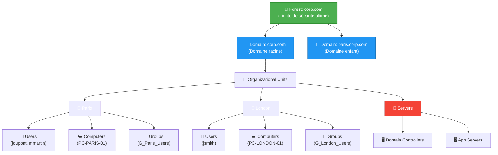
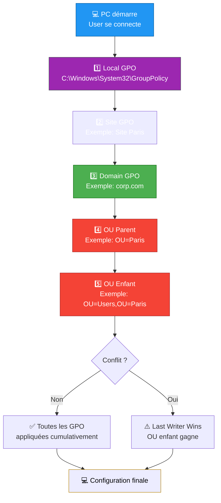

---
tags:
  - formation
  - windows-server
  - active-directory
  - gpo
  - powershell
  - automation
---

# Module 2 : Active Directory & GPO - L'Identité au Cœur

**Objectif :** Maîtriser Active Directory et les Group Policy Objects pour automatiser la gestion des identités et des configurations en entreprise.

---

## Introduction : Arrêtez de Cliquer "New User"

### Le Problème

```text
┌─────────────────────────────────────────────────────────────┐
│         GESTION IDENTITÉS : LE CERCLE VICIEUX                │
├─────────────────────────────────────────────────────────────┤
│                                                              │
│  Lundi 9h : 5 nouveaux employés arrivent                    │
│  ────────────────────────────────────                        │
│  1. Ouvrir "Active Directory Users and Computers"           │
│  2. Right-click → New → User                                │
│  3. Remplir 12 champs manuellement                          │
│  4. Cliquer sur 5 onglets                                   │
│  5. Ajouter aux groupes un par un                           │
│  6. Répéter x5                                              │
│  7. Temps total : 45 minutes                                │
│  8. Risque d'erreurs : 80%                                  │
│                                                              │
│  Résultat : Frustration, erreurs, incohérence               │
│                                                              │
└─────────────────────────────────────────────────────────────┘
```

### La Solution : Automatisation PowerShell

**Avec PowerShell :**

```powershell
# 5 nouveaux employés en 30 secondes
Import-Csv new_hires.csv | ForEach-Object {
    New-ADUser -Name "$($_.Prenom) $($_.Nom)" `
        -SamAccountName $_.Login `
        -Path "OU=Users,OU=$($_.Site),DC=corp,DC=local" `
        -AccountPassword (ConvertTo-SecureString "TempPass123!" -AsPlainText -Force) `
        -Enabled $true -ChangePasswordAtLogon $true

    Add-ADGroupMember -Identity "G_$($_.Site)_Users" -Members $_.Login
}
```

**Résultat :**
- ✅ **30 secondes** au lieu de 45 minutes
- ✅ **0% d'erreurs** (script validé une fois)
- ✅ **100% consistant** (même OU, mêmes groupes, mêmes conventions)
- ✅ **Auditable** (le script est versionné dans Git)

### Ce Que Vous Allez Apprendre

Dans ce module, vous allez :

- ✅ **Comprendre l'architecture AD** : Forest, Domain, OU, Sites
- ✅ **Maîtriser le traitement des GPO** : LSDOU (Local, Site, Domain, OU)
- ✅ **Automatiser avec PowerShell** : CRUD utilisateurs, groupes, GPO
- ✅ **Créer un script d'onboarding** : CSV → AD en une commande

**Durée estimée :** 4-5 heures

---

## Section 1 : Architecture Active Directory

### Vue d'Ensemble : Forest, Domain, OU

**Active Directory organise les objets en hiérarchie logique.**



### Les Composants Expliqués

| Composant | Description | Analogie |
|-----------|-------------|----------|
| **Forest** 🌲 | Limite de sécurité ultime. Ensemble de domaines partageant le même schéma AD. | Entreprise multi-nationales (Renault France + Renault UK = même forest) |
| **Domain** 🏢 | Unité d'administration. Contient users, computers, groups. Chaque domaine a ses propres DC. | Filiale d'une entreprise (corp.com, paris.corp.com) |
| **Organizational Unit (OU)** 📁 | Conteneur logique pour organiser les objets. **Cible des GPO**. | Dossiers dans un filesystem |
| **Site** 🌍 | Groupement physique basé sur la topologie réseau (réplication AD optimisée). | Bureau physique (Paris, London, New York) |
| **Domain Controller (DC)** 🖥️ | Serveur hébergeant la base AD. Authentifie via Kerberos. | Serveur d'identité |

### Design d'OU : Géographie vs Fonction

**Question :** Comment organiser vos OU ?

**Option 1 : Par Géographie (Recommandé pour multi-sites)**

```text
corp.com
├── Paris
│   ├── Users
│   ├── Computers
│   └── Groups
├── London
│   ├── Users
│   ├── Computers
│   └── Groups
└── Servers
    ├── Domain Controllers
    └── App Servers
```

**Avantages :**
- ✅ GPO par site (exemple : proxy Paris vs London)
- ✅ Délégation par pays/région
- ✅ Alignement avec la structure de l'entreprise

**Option 2 : Par Fonction (Recommandé pour mono-site)**

```text
corp.com
├── IT
│   ├── Admins
│   └── Helpdesk
├── Finance
│   └── Users
├── HR
│   └── Users
└── Computers
    ├── Workstations
    └── Servers
```

**Avantages :**
- ✅ GPO par département (exemple : Finance = verrouillage USB)
- ✅ Délégation par métier
- ✅ Simplicité pour une seule localisation

!!! tip "Best Practice Microsoft"
    **Ne créez pas plus de 5 niveaux d'OU.**

    ```text
    ❌ MAUVAIS : corp.com → Europe → France → Paris → IT → Admins → Senior
    ✅ BON     : corp.com → Paris → IT → Admins
    ```

---

## Section 2 : GPO Processing - L'Ordre LSDOU

### Qu'est-ce qu'une GPO ?

**Group Policy Object (GPO) = Configuration as Code natif Windows.**

```text
Une GPO peut :
├── Configurer le fond d'écran corporate
├── Désactiver les ports USB
├── Mapper des lecteurs réseau (Z: → \\fileserver\share)
├── Installer des logiciels silencieusement
├── Configurer le proxy IE/Edge
├── Forcer le verrouillage écran après 5 min
├── Déployer des scripts au login/logoff
└── Appliquer des politiques de mot de passe
```

### L'Ordre de Traitement : LSDOU

**Les GPO sont appliquées dans un ordre précis : Local → Site → Domain → OU.**



### Règles de Priorité & Héritage

| Ordre | Niveau | Priorité | Exemple |
|-------|--------|----------|---------|
| 1 | **Local** | Plus faible | GPO locale sur le PC (rarement utilisée) |
| 2 | **Site** | Faible | GPO pour "Site Paris" (proxy spécifique) |
| 3 | **Domain** | Moyenne | GPO pour "corp.com" (config générale) |
| 4 | **OU Parent** | Forte | GPO pour "OU=Paris" |
| 5 | **OU Enfant** | **Plus forte** | GPO pour "OU=Users,OU=Paris" ← **GAGNE** |

### Cas Pratique : Conflit de GPO

**Scénario :**

- **GPO Domain** : Fond d'écran = Logo Entreprise
- **GPO OU=Paris** : Fond d'écran = Skyline Paris

**Question :** Quel fond d'écran aura un utilisateur dans `OU=Users,OU=Paris` ?

**Réponse :** **Skyline Paris** (OU Parent gagne sur Domain).

### Options Avancées

**1. Enforced (Appliqué) :**

```text
GPO Domain = "No USB" [Enforced]
GPO OU=IT = "Allow USB"

Résultat : USB bloqué (Enforced ignore LSDOU)
```

**2. Block Inheritance :**

```text
OU=IT [Block Inheritance = Yes]

Résultat : Ignore toutes les GPO parentes (Domain, Site)
```

!!! warning "Attention : Enforced vs Block Inheritance"
    - **Enforced** : Force une GPO à s'appliquer (ignore Block Inheritance)
    - **Block Inheritance** : Bloque toutes les GPO parentes (sauf Enforced)

    **Enforced gagne TOUJOURS.**

---

## Section 3 : Pratique PowerShell Active Directory

### Prérequis : Module ActiveDirectory

```powershell
# Installer RSAT (si Windows 10/11)
Add-WindowsCapability -Online -Name Rsat.ActiveDirectory.DS-LDS.Tools~~~~0.0.1.0

# Importer le module
Import-Module ActiveDirectory

# Vérifier la connexion au domaine
Get-ADDomain

# Output attendu :
# DistinguishedName : DC=corp,DC=local
# DNSRoot           : corp.local
# Name              : corp
```

---

### CRUD Utilisateurs

#### Créer un Utilisateur (Create)

```powershell
# Création basique
New-ADUser -Name "Jean Dupont" -SamAccountName "jdupont" -Enabled $true

# Création complète et sécurisée
$password = ConvertTo-SecureString "TempPass123!" -AsPlainText -Force
New-ADUser `
    -Name "Jean Dupont" `
    -GivenName "Jean" `
    -Surname "Dupont" `
    -SamAccountName "jdupont" `
    -UserPrincipalName "jdupont@corp.local" `
    -Path "OU=Users,OU=Paris,DC=corp,DC=local" `
    -AccountPassword $password `
    -Enabled $true `
    -ChangePasswordAtLogon $true `
    -Department "IT" `
    -Title "SysAdmin" `
    -EmailAddress "jdupont@corp.local"

# Vérifier la création
Get-ADUser -Identity jdupont -Properties Department, Title, EmailAddress |
    Select-Object Name, Department, Title, EmailAddress
```

#### Modifier un Utilisateur (Update)

```powershell
# Modifier des attributs
Set-ADUser -Identity jdupont -Department "Security" -Title "Security Engineer"

# Modifier plusieurs attributs
Set-ADUser -Identity jdupont -Replace @{
    telephoneNumber = "+33 1 23 45 67 89"
    physicalDeliveryOfficeName = "Paris - Floor 3"
    mobile = "+33 6 12 34 56 78"
}

# Désactiver un compte
Disable-ADAccount -Identity jdupont

# Activer un compte
Enable-ADAccount -Identity jdupont

# Réinitialiser le mot de passe
$newPassword = ConvertTo-SecureString "NewPass456!" -AsPlainText -Force
Set-ADAccountPassword -Identity jdupont -Reset -NewPassword $newPassword

# Forcer le changement de mot de passe à la prochaine connexion
Set-ADUser -Identity jdupont -ChangePasswordAtLogon $true
```

#### Rechercher des Utilisateurs (Read)

```powershell
# ATTENTION : Performance critique !
# ❌ MAUVAIS (charge TOUS les users puis filtre)
Get-ADUser -Filter * | Where-Object { $_.Department -eq "IT" }

# ✅ BON (filtre côté serveur AD)
Get-ADUser -Filter 'Department -eq "IT"'

# Exemples de filtres
Get-ADUser -Filter 'Name -like "Jean*"'
Get-ADUser -Filter 'Enabled -eq $false'
Get-ADUser -Filter 'Department -eq "IT" -and Enabled -eq $true'

# Avec propriétés supplémentaires (par défaut, seules les propriétés de base sont retournées)
Get-ADUser -Identity jdupont -Properties *
Get-ADUser -Filter * -Properties Department, Title, LastLogonDate |
    Select-Object Name, Department, Title, LastLogonDate

# Recherche dans une OU spécifique
Get-ADUser -Filter * -SearchBase "OU=Users,OU=Paris,DC=corp,DC=local"

# Utilisateurs créés cette semaine
$date = (Get-Date).AddDays(-7)
Get-ADUser -Filter * -Properties Created |
    Where-Object { $_.Created -gt $date } |
    Select-Object Name, SamAccountName, Created
```

!!! tip "Performance : Filtrer Côté Serveur"
    ```powershell
    # Temps : 30 secondes (10,000 users chargés)
    ❌ Get-ADUser -Filter * | Where-Object { $_.Department -eq "IT" }

    # Temps : 0.5 secondes (filtre LDAP côté DC)
    ✅ Get-ADUser -Filter 'Department -eq "IT"'
    ```

#### Supprimer un Utilisateur (Delete)

```powershell
# Supprimer un utilisateur (avec confirmation)
Remove-ADUser -Identity jdupont

# Supprimer sans confirmation
Remove-ADUser -Identity jdupont -Confirm:$false

# Supprimer avec vérification préalable
Get-ADUser -Identity jdupont
Remove-ADUser -Identity jdupont -Confirm:$false
```

---

### Gestion des Groupes

#### Créer et Gérer des Groupes

```powershell
# Créer un groupe de sécurité Global
New-ADGroup -Name "G_Paris_Users" `
    -GroupScope Global `
    -GroupCategory Security `
    -Path "OU=Groups,OU=Paris,DC=corp,DC=local" `
    -Description "Tous les utilisateurs du site Paris"

# Types de groupes
# -GroupScope : DomainLocal, Global, Universal
# -GroupCategory : Security (droits d'accès), Distribution (email uniquement)
```

| GroupScope | Portée | Usage |
|------------|--------|-------|
| **DomainLocal** | Domaine local uniquement | Droits sur des ressources locales (partages, imprimantes) |
| **Global** | Tout le forest | Organiser des utilisateurs par fonction/site |
| **Universal** | Tout le forest | Groupes cross-domain (coûteux en réplication) |

#### Ajouter / Retirer des Membres

```powershell
# Ajouter un membre
Add-ADGroupMember -Identity "G_Paris_Users" -Members jdupont

# Ajouter plusieurs membres
Add-ADGroupMember -Identity "G_Paris_Users" -Members jdupont, mmartin, pdurand

# Retirer un membre
Remove-ADGroupMember -Identity "G_Paris_Users" -Members jdupont -Confirm:$false

# Ajouter tous les users d'une OU au groupe
Get-ADUser -Filter * -SearchBase "OU=Users,OU=Paris,DC=corp,DC=local" |
    ForEach-Object {
        Add-ADGroupMember -Identity "G_Paris_Users" -Members $_.SamAccountName
    }
```

#### Lister les Membres

```powershell
# Membres directs
Get-ADGroupMember -Identity "G_Paris_Users" |
    Select-Object Name, SamAccountName, objectClass

# Membres récursifs (inclut les groupes imbriqués)
Get-ADGroupMember -Identity "G_Paris_Users" -Recursive |
    Select-Object Name, SamAccountName, objectClass

# Compter les membres
$count = (Get-ADGroupMember -Identity "G_Paris_Users" -Recursive).Count
Write-Host "G_Paris_Users contient $count membres"
```

#### Groupes d'un Utilisateur

```powershell
# Groupes directs d'un utilisateur
Get-ADPrincipalGroupMembership -Identity jdupont |
    Select-Object Name, GroupScope, GroupCategory

# Avec le DN complet (utile pour scripts)
Get-ADUser -Identity jdupont -Properties MemberOf |
    Select-Object -ExpandProperty MemberOf
```

---

### Gestion des GPO avec PowerShell

#### Module GroupPolicy

```powershell
# Installer RSAT GPO Management (si Windows 10/11)
Add-WindowsCapability -Online -Name Rsat.GroupPolicy.Management.Tools~~~~0.0.1.0

# Importer le module
Import-Module GroupPolicy

# Lister toutes les GPO
Get-GPO -All | Select-Object DisplayName, CreationTime, ModificationTime
```

#### Créer une GPO

```powershell
# Créer une GPO
New-GPO -Name "GPO_Paris_Wallpaper" -Comment "Déploie le fond d'écran Paris"

# Créer et lier à une OU en une commande
New-GPO -Name "GPO_Paris_Proxy" | New-GPLink -Target "OU=Paris,DC=corp,DC=local"

# Vérifier la création
Get-GPO -Name "GPO_Paris_Proxy"
```

#### Lier une GPO à une OU

```powershell
# Lier une GPO existante
New-GPLink -Name "GPO_Paris_Wallpaper" -Target "OU=Users,OU=Paris,DC=corp,DC=local"

# Lier avec ordre de priorité (LinkOrder 1 = plus haute priorité)
New-GPLink -Name "GPO_Paris_Wallpaper" `
    -Target "OU=Users,OU=Paris,DC=corp,DC=local" `
    -LinkEnabled Yes `
    -Order 1

# Lier avec Enforced
New-GPLink -Name "GPO_Security_NoUSB" `
    -Target "OU=Users,DC=corp,DC=local" `
    -Enforced Yes
```

#### Lister les GPO Liées à une OU

```powershell
# GPO liées à une OU
Get-GPInheritance -Target "OU=Users,OU=Paris,DC=corp,DC=local"

# Output détaillé
(Get-GPInheritance -Target "OU=Users,OU=Paris,DC=corp,DC=local").GpoLinks |
    Select-Object DisplayName, Enabled, Enforced, Order
```

#### Générer un Rapport GPO

```powershell
# Rapport HTML d'une GPO
Get-GPOReport -Name "GPO_Paris_Proxy" -ReportType Html -Path "C:\Reports\GPO_Paris_Proxy.html"

# Rapport XML (parsable)
Get-GPOReport -Name "GPO_Paris_Proxy" -ReportType Xml -Path "C:\Reports\GPO_Paris_Proxy.xml"

# Rapport de toutes les GPO
Get-GPOReport -All -ReportType Html -Path "C:\Reports\All_GPO_Report.html"
```

#### Supprimer une GPO

```powershell
# Supprimer une GPO (avec confirmation)
Remove-GPO -Name "GPO_Old_Policy"

# Supprimer sans confirmation
Remove-GPO -Name "GPO_Old_Policy" -Confirm:$false
```

---

## Exercice Pratique : L'Onboarding Automatisé

### Contexte

Vous êtes admin système chez **TechCorp**. Le département RH vous envoie un fichier CSV avec **5 nouveaux employés** qui démarrent lundi.

**Exigences :**

1. ✅ Créer les utilisateurs dans l'OU appropriée (`OU=Users,OU=<Site>`)
2. ✅ Ajouter chaque user au groupe `G_<Site>_Users`
3. ✅ Mot de passe temporaire : `Welcome2024!`
4. ✅ Forcer le changement de mot de passe à la première connexion
5. ✅ Activer le compte immédiatement
6. ✅ Définir les attributs : Department, Title, EmailAddress

### Fichier CSV Fourni : `new_hires.csv`

```csv
Prenom,Nom,Login,Site,Department,Title
Jean,Dupont,jdupont,Paris,IT,SysAdmin
Marie,Martin,mmartin,Paris,Finance,Analyst
Pierre,Durand,pdurand,London,IT,Network Engineer
Sophie,Bernard,sbernard,London,HR,HR Manager
Lucas,Petit,lpetit,Paris,Marketing,Marketing Manager
```

### Mission

**Écrire un script PowerShell `Onboard-NewHires.ps1` qui :**

1. Lit le fichier `new_hires.csv`
2. Pour chaque ligne :
   - Crée l'utilisateur dans `OU=Users,OU=<Site>,DC=corp,DC=local`
   - Définit le mot de passe temporaire
   - Configure les attributs (Department, Title, EmailAddress)
   - Active le compte
   - Force le changement de mot de passe
   - Ajoute l'utilisateur au groupe `G_<Site>_Users`
3. Affiche un rapport de confirmation

**Contraintes :**

- Le script doit être **idempotent** (peut être exécuté plusieurs fois sans erreur)
- Le script doit gérer les erreurs (si user existe déjà, skip)
- Le script doit afficher un résumé final

---

??? quote "Solution Complète"

    ### Fichier CSV : `new_hires.csv`

    Créez ce fichier dans `C:\Scripts\new_hires.csv` :

    ```csv
    Prenom,Nom,Login,Site,Department,Title
    Jean,Dupont,jdupont,Paris,IT,SysAdmin
    Marie,Martin,mmartin,Paris,Finance,Analyst
    Pierre,Durand,pdurand,London,IT,Network Engineer
    Sophie,Bernard,sbernard,London,HR,HR Manager
    Lucas,Petit,lpetit,Paris,Marketing,Marketing Manager
    ```

    ---

    ### Script PowerShell : `Onboard-NewHires.ps1`

    ```powershell
    # ============================================================
    # Onboard-NewHires.ps1
    # Automatisation de l'onboarding des nouveaux employés
    # ============================================================

    # Prérequis
    Import-Module ActiveDirectory

    # Configuration
    $CSVPath = "C:\Scripts\new_hires.csv"
    $DomainDN = "DC=corp,DC=local"
    $TempPassword = "Welcome2024!"
    $SecurePassword = ConvertTo-SecureString $TempPassword -AsPlainText -Force

    # Compteurs pour le rapport
    $successCount = 0
    $skipCount = 0
    $errorCount = 0
    $errors = @()

    Write-Host "`n=== Onboarding Nouveaux Employés ===" -ForegroundColor Cyan
    Write-Host "Fichier CSV : $CSVPath" -ForegroundColor Gray
    Write-Host "Domaine     : $DomainDN`n" -ForegroundColor Gray

    # Lecture du CSV
    try {
        $newHires = Import-Csv -Path $CSVPath -Encoding UTF8
    } catch {
        Write-Host "❌ ERREUR : Impossible de lire le fichier CSV" -ForegroundColor Red
        Write-Host $_.Exception.Message -ForegroundColor Red
        exit 1
    }

    # Traitement de chaque employé
    foreach ($hire in $newHires) {
        $displayName = "$($hire.Prenom) $($hire.Nom)"
        $samAccountName = $hire.Login
        $site = $hire.Site
        $ouPath = "OU=Users,OU=$site,$DomainDN"
        $groupName = "G_$($site)_Users"
        $upn = "$samAccountName@corp.local"
        $email = "$samAccountName@corp.local"

        Write-Host "Traitement : $displayName ($samAccountName)..." -ForegroundColor Yellow

        # Vérifier si l'utilisateur existe déjà
        $existingUser = Get-ADUser -Filter "SamAccountName -eq '$samAccountName'" -ErrorAction SilentlyContinue

        if ($existingUser) {
            Write-Host "  ⚠ User existe déjà, skip." -ForegroundColor DarkYellow
            $skipCount++
            continue
        }

        # Créer l'utilisateur
        try {
            New-ADUser `
                -Name $displayName `
                -GivenName $hire.Prenom `
                -Surname $hire.Nom `
                -SamAccountName $samAccountName `
                -UserPrincipalName $upn `
                -Path $ouPath `
                -AccountPassword $SecurePassword `
                -Enabled $true `
                -ChangePasswordAtLogon $true `
                -Department $hire.Department `
                -Title $hire.Title `
                -EmailAddress $email `
                -ErrorAction Stop

            Write-Host "  ✓ User créé dans $ouPath" -ForegroundColor Green

            # Ajouter au groupe
            try {
                Add-ADGroupMember -Identity $groupName -Members $samAccountName -ErrorAction Stop
                Write-Host "  ✓ Ajouté au groupe $groupName" -ForegroundColor Green
            } catch {
                Write-Host "  ⚠ Groupe $groupName introuvable, skip." -ForegroundColor DarkYellow
            }

            $successCount++

        } catch {
            Write-Host "  ❌ ERREUR lors de la création" -ForegroundColor Red
            Write-Host "  $($_.Exception.Message)" -ForegroundColor Red
            $errorCount++
            $errors += @{User=$displayName; Error=$_.Exception.Message}
        }
    }

    # Rapport final
    Write-Host "`n=== Rapport Final ===" -ForegroundColor Cyan
    Write-Host "✓ Créés avec succès : $successCount" -ForegroundColor Green
    Write-Host "⚠ Skippés (existants) : $skipCount" -ForegroundColor Yellow
    Write-Host "❌ Erreurs            : $errorCount" -ForegroundColor Red

    if ($errorCount -gt 0) {
        Write-Host "`nDétail des erreurs :" -ForegroundColor Red
        foreach ($err in $errors) {
            Write-Host "  - $($err.User) : $($err.Error)" -ForegroundColor Red
        }
    }

    Write-Host "`n=== Onboarding Terminé ===" -ForegroundColor Cyan
    ```

    ---

    ### Prérequis : Créer les OU et Groupes

    **Avant d'exécuter le script, créez la structure AD :**

    ```powershell
    # Créer les OU
    New-ADOrganizationalUnit -Name "Paris" -Path "DC=corp,DC=local"
    New-ADOrganizationalUnit -Name "London" -Path "DC=corp,DC=local"

    New-ADOrganizationalUnit -Name "Users" -Path "OU=Paris,DC=corp,DC=local"
    New-ADOrganizationalUnit -Name "Users" -Path "OU=London,DC=corp,DC=local"
    New-ADOrganizationalUnit -Name "Groups" -Path "OU=Paris,DC=corp,DC=local"
    New-ADOrganizationalUnit -Name "Groups" -Path "OU=London,DC=corp,DC=local"

    # Créer les groupes
    New-ADGroup -Name "G_Paris_Users" `
        -GroupScope Global `
        -GroupCategory Security `
        -Path "OU=Groups,OU=Paris,DC=corp,DC=local"

    New-ADGroup -Name "G_London_Users" `
        -GroupScope Global `
        -GroupCategory Security `
        -Path "OU=Groups,OU=London,DC=corp,DC=local"
    ```

    ---

    ### Exécution du Script

    ```powershell
    # Exécuter le script
    Set-ExecutionPolicy Bypass -Scope Process -Force
    C:\Scripts\Onboard-NewHires.ps1
    ```

    **Output attendu :**

    ```text
    === Onboarding Nouveaux Employés ===
    Fichier CSV : C:\Scripts\new_hires.csv
    Domaine     : DC=corp,DC=local

    Traitement : Jean Dupont (jdupont)...
      ✓ User créé dans OU=Users,OU=Paris,DC=corp,DC=local
      ✓ Ajouté au groupe G_Paris_Users
    Traitement : Marie Martin (mmartin)...
      ✓ User créé dans OU=Users,OU=Paris,DC=corp,DC=local
      ✓ Ajouté au groupe G_Paris_Users
    Traitement : Pierre Durand (pdurand)...
      ✓ User créé dans OU=Users,OU=London,DC=corp,DC=local
      ✓ Ajouté au groupe G_London_Users
    Traitement : Sophie Bernard (sbernard)...
      ✓ User créé dans OU=Users,OU=London,DC=corp,DC=local
      ✓ Ajouté au groupe G_London_Users
    Traitement : Lucas Petit (lpetit)...
      ✓ User créé dans OU=Users,OU=Paris,DC=corp,DC=local
      ✓ Ajouté au groupe G_Paris_Users

    === Rapport Final ===
    ✓ Créés avec succès : 5
    ⚠ Skippés (existants) : 0
    ❌ Erreurs            : 0

    === Onboarding Terminé ===
    ```

    ---

    ### Validation

    ```powershell
    # Vérifier les utilisateurs créés
    Get-ADUser -Filter * -SearchBase "OU=Users,OU=Paris,DC=corp,DC=local" |
        Select-Object Name, SamAccountName, Enabled, ChangePasswordAtLogon

    # Vérifier les membres du groupe
    Get-ADGroupMember -Identity "G_Paris_Users" |
        Select-Object Name, SamAccountName

    # Vérifier les propriétés d'un user
    Get-ADUser -Identity jdupont -Properties * |
        Select-Object Name, Department, Title, EmailAddress, ChangePasswordAtLogon
    ```

    **Résultat attendu :**

    ```text
    Name         : Jean Dupont
    Department   : IT
    Title        : SysAdmin
    EmailAddress : jdupont@corp.local
    ChangePasswordAtLogon : True
    ```

    ---

    ### Améliorations Possibles

    **1. Logging dans un fichier :**

    ```powershell
    $logFile = "C:\Scripts\Onboarding_$(Get-Date -Format 'yyyyMMdd_HHmmss').log"
    Start-Transcript -Path $logFile
    # ... script ...
    Stop-Transcript
    ```

    **2. Notification Email :**

    ```powershell
    Send-MailMessage -From "admin@corp.local" `
        -To "rh@corp.local" `
        -Subject "Onboarding : $successCount users créés" `
        -Body "Détails : voir pièce jointe" `
        -Attachments $logFile `
        -SmtpServer "smtp.corp.local"
    ```

    **3. Intégration CI/CD (GitLab CI) :**

    ```yaml
    onboard_users:
      stage: deploy
      script:
        - Import-Module ActiveDirectory
        - ./Onboard-NewHires.ps1
      only:
        - main
      when: manual
    ```

---

## Conclusion du Module 2

### Ce Que Vous Avez Appris

Dans ce module, vous avez maîtrisé :

- ✅ **Architecture AD** : Forest, Domain, OU, Sites, design organisationnel
- ✅ **GPO Processing** : LSDOU (Local, Site, Domain, OU), Enforced, Block Inheritance
- ✅ **PowerShell AD** : CRUD utilisateurs, gestion des groupes, création de GPO
- ✅ **Automatisation** : Script d'onboarding CSV → AD en 30 secondes

### Points Clés à Retenir

!!! success "Les 5 Commandements de l'Admin AD"
    1. **Ne jamais créer un user manuellement** (PowerShell + CSV = reproductible)
    2. **Organiser les OU par Géographie OU Fonction** (pas plus de 5 niveaux)
    3. **Comprendre LSDOU** (OU enfant gagne, sauf Enforced)
    4. **Filtrer côté serveur** (`Get-ADUser -Filter 'Dept -eq "IT"'` pas `Where-Object`)
    5. **Versionner vos scripts** (Git pour les scripts AD et GPO)

### Prochaine Étape

Vous êtes maintenant prêt à passer au **Module 3 : Sécurité & Hardening AD** où vous apprendrez à :

- Sécuriser AD contre Pass-the-Hash, Kerberoasting, DCSync
- Implémenter le Tiering Model (Tier 0/1/2)
- Déployer LAPS (Local Administrator Password Solution)
- Auditer AD avec des événements 4624, 4625, 4720, 4728
- Tester la sécurité avec BloodHound

---

!!! tip "Ressources Complémentaires"
    - [Microsoft Learn : Active Directory](https://learn.microsoft.com/windows-server/identity/ad-ds/get-started/virtual-dc/active-directory-domain-services-overview)
    - [PowerShell AD Module](https://learn.microsoft.com/powershell/module/activedirectory/)
    - [Group Policy Planning and Deployment Guide](https://learn.microsoft.com/previous-versions/windows/it-pro/windows-server-2008-r2-and-2008/cc754948(v=ws.10))
    - [Reddit r/activedirectory](https://reddit.com/r/activedirectory)
    - [Reddit r/sysadmin](https://reddit.com/r/sysadmin)

---

**[← Retour au Module 1](01-module.md)** | **[Continuer vers Module 3 : Sécurité & Hardening →](03-module.md)**

---

## Navigation

| | |
|:---|---:|
| [← Module 1 : Modern Admin - Le Serveur ...](01-module.md) | [Module 3 : Sécurité & Hardening - Déf... →](03-module.md) |

[Retour au Programme](index.md){ .md-button }
