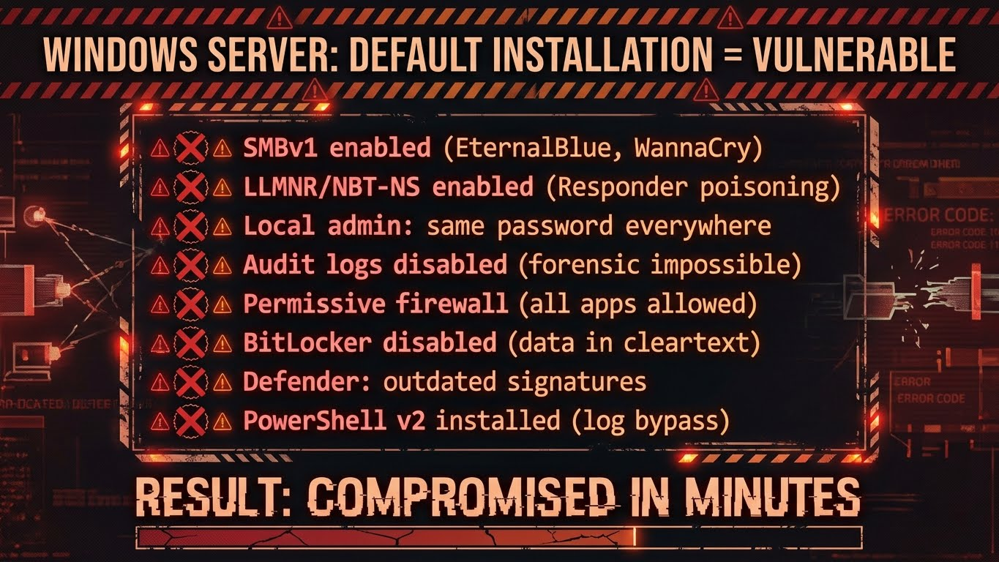
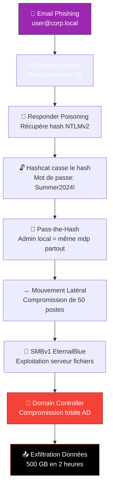
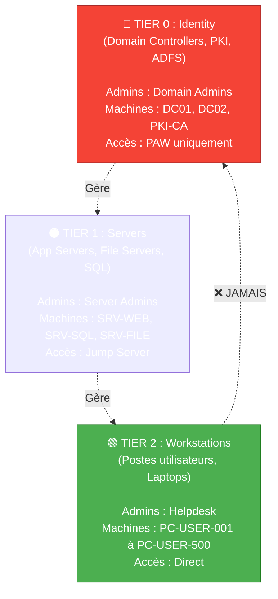
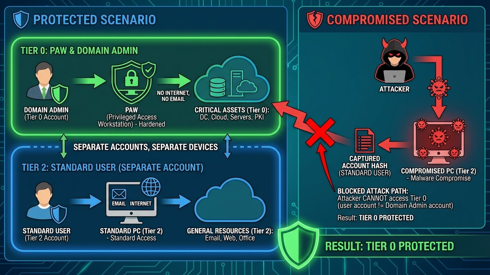
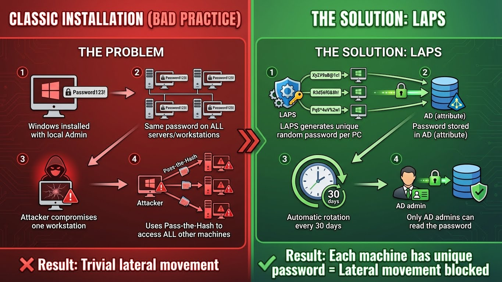
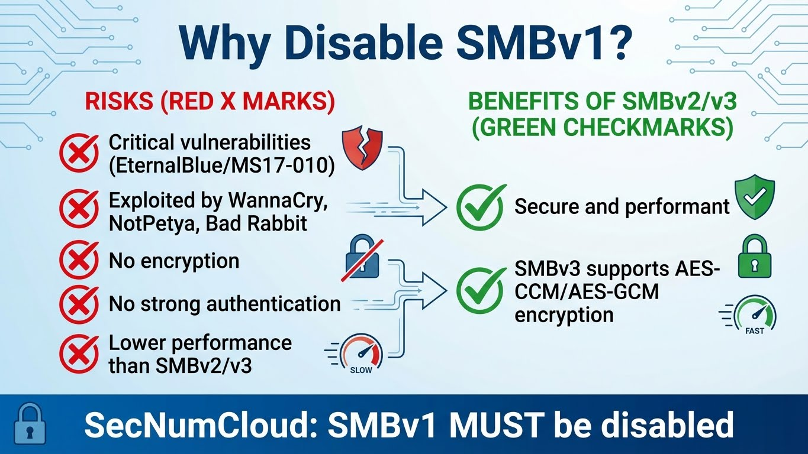

---
tags:
  - formation
  - windows-server
  - security
  - hardening
  - laps
  - bitlocker
  - defender
  - tiering-model
---

# Module 3 : Sécurité & Hardening - Défendre l'Empire

**Objectif :** Sécuriser Windows Server contre les attaques modernes et implémenter les best practices de hardening.

---

## Introduction : Windows par Défaut Est Vulnérable

### Le Constat



```text
┌─────────────────────────────────────────────────────────────┐
│         WINDOWS SERVER : INSTALLATION PAR DÉFAUT             │
├─────────────────────────────────────────────────────────────┤
│                                                              │
│  ❌ SMBv1 activé (EternalBlue, WannaCry)                    │
│  ❌ LLMNR/NBT-NS activés (Responder poisoning)              │
│  ❌ Admin local : même mot de passe partout                 │
│  ❌ Audit logs désactivés (forensic impossible)             │
│  ❌ Firewall permissif (toutes les apps autorisées)         │
│  ❌ BitLocker désactivé (données en clair)                  │
│  ❌ Defender : signatures obsolètes                         │
│  ❌ PowerShell v2 installé (bypass des logs)                │
│                                                              │
│  Résultat : Compromission en quelques minutes               │
│                                                              │
└─────────────────────────────────────────────────────────────┘
```

### Le Scénario Catastrophe

**Vendredi 17h00 :** Un utilisateur ouvre une pièce jointe malveillante.



**Lundi 9h00 :** Rançongiciel déployé sur toute l'infrastructure. Demande de rançon : 5 millions €.

### La Solution : Defense in Depth

!!! success "Principe de Défense en Profondeur"
    **Aucune mesure unique ne suffit. Il faut des couches de sécurité successives.**

    1. **Tiering Model** : Séparation Tier 0 (DC) / Tier 1 (Servers) / Tier 2 (Workstations)
    2. **LAPS** : Rotation automatique des mots de passe admin locaux
    3. **Hardening** : Désactiver SMBv1, LLMNR, NBT-NS
    4. **Chiffrement** : BitLocker sur tous les disques
    5. **Antivirus** : Defender à jour + RealTime Protection
    6. **Audit** : Logs 4688 (Process Creation) activés
    7. **Firewall** : Default Deny + règles explicites

### Ce Que Vous Allez Apprendre

Dans ce module, vous allez :

- ✅ **Comprendre le Tiering Model** : Pourquoi un admin T0 ne doit JAMAIS se connecter sur un T2
- ✅ **Déployer LAPS** : Rotation automatique des mots de passe admin locaux
- ✅ **Configurer BitLocker** : Chiffrement des disques avec TPM
- ✅ **Gérer Defender** : Antivirus via PowerShell (scans, signatures, exclusions)
- ✅ **Hardening Windows** : Désactiver SMBv1, LLMNR, NBT-NS
- ✅ **Activer les Audit Logs** : Event 4688 avec ligne de commande
- ✅ **Créer un script d'audit** : Vérifier la conformité d'un serveur

**Durée estimée :** 4-5 heures

---

## Section 1 : Tiering Model - La Pyramide de Sécurité

### Le Concept

**Le Tiering Model sépare l'infrastructure en 3 niveaux de privilèges.**



### Les 3 Tiers Expliqués

| Tier | Description | Exemples | Admins | Risque |
|------|-------------|----------|--------|--------|
| **Tier 0** 🔴 | **Identité** : Contrôle total du domaine AD | Domain Controllers, PKI, ADFS, Azure AD Connect | Domain Admins, Enterprise Admins | **CRITIQUE** : Compromission = Game Over |
| **Tier 1** 🟠 | **Serveurs** : Applications métier, bases de données | SQL Server, Exchange, File Servers, Web Apps | Server Admins (groupe dédié) | **ÉLEVÉ** : Compromission = données exfiltrées |
| **Tier 2** 🟢 | **Workstations** : Postes utilisateurs | PC Windows 10/11, Laptops | Helpdesk, Users (admin local) | **MODÉRÉ** : Point d'entrée des attaques |

### La Règle d'Or : Flux Unidirectionnel

!!! danger "Règle Absolue du Tiering Model"
    **Un admin de Tier N peut gérer Tier N et Tier N+1, mais JAMAIS Tier N-1.**

    ```text
    ✅ Admin T0 peut gérer T0 et T1
    ✅ Admin T1 peut gérer T1 et T2
    ❌ Admin T0 ne doit JAMAIS se connecter sur T2
    ❌ Admin T1 ne doit JAMAIS se connecter sur T0
    ```

### Pourquoi ? Pass-the-Hash Attack

**Scénario de compromission sans Tiering Model :**


```text
┌─────────────────────────────────────────────────────────────┐
│              ATTAQUE SANS TIERING MODEL                      │
├─────────────────────────────────────────────────────────────┤
│                                                              │
│  1. Domain Admin se connecte sur son PC (Tier 2)           │
│     pour lire ses emails                                    │
│                                                              │
│  2. Malware sur le PC récupère le hash NTLM                 │
│     du Domain Admin en mémoire (mimikatz)                   │
│                                                              │
│  3. Attaquant utilise Pass-the-Hash pour                    │
│     se connecter au Domain Controller (Tier 0)              │
│                                                              │
│  4. Attaquant a maintenant le contrôle total de AD          │
│                                                              │
│  Temps écoulé : 5 minutes                                   │
│                                                              │
└─────────────────────────────────────────────────────────────┘
```

**Avec Tiering Model :**



```text
┌─────────────────────────────────────────────────────────────┐
│              DÉFENSE AVEC TIERING MODEL                      │
├─────────────────────────────────────────────────────────────┤
│                                                              │
│  1. Domain Admin utilise uniquement une PAW                 │
│     (Privileged Access Workstation) pour gérer T0           │
│                                                              │
│  2. PAW = Machine durcie, pas d'internet, pas d'email       │
│                                                              │
│  3. Domain Admin utilise un COMPTE SÉPARÉ                   │
│     pour ses emails sur un PC standard (Tier 2)             │
│                                                              │
│  4. Malware compromet le PC → récupère hash du compte user  │
│                                                              │
│  5. Attaquant ne peut PAS accéder à T0                      │
│     (compte user ≠ compte Domain Admin)                     │
│                                                              │
│  Résultat : Tier 0 protégé                                  │
│                                                              │
└─────────────────────────────────────────────────────────────┘
```

### Implémentation du Tiering Model

#### Étape 1 : Créer les Comptes Séparés

```powershell
# Pour chaque admin, créer 2 comptes :
# - Compte T0 : admin-t0-jdupont (gérer DC uniquement)
# - Compte T2 : jdupont (usage quotidien)

# Créer le compte T0
New-ADUser `
    -Name "admin-t0-jdupont" `
    -SamAccountName "admin-t0-jdupont" `
    -UserPrincipalName "admin-t0-jdupont@corp.local" `
    -Path "OU=Tier0-Admins,OU=Admin,DC=corp,DC=local" `
    -AccountPassword (Read-Host -AsSecureString "Password") `
    -Enabled $true

# Ajouter au groupe Domain Admins
Add-ADGroupMember -Identity "Domain Admins" -Members "admin-t0-jdupont"

# Créer le compte utilisateur standard
New-ADUser `
    -Name "Jean Dupont" `
    -SamAccountName "jdupont" `
    -UserPrincipalName "jdupont@corp.local" `
    -Path "OU=Users,DC=corp,DC=local" `
    -AccountPassword (Read-Host -AsSecureString "Password") `
    -Enabled $true
```

#### Étape 2 : Restrictions de Connexion (GPO)

```text
GPO : "Tier0 - Deny Logon to Non-PAW"
Cible : OU=Tier0-Admins

GPO Path: Computer Configuration → Policies → Windows Settings
          → Security Settings → Local Policies → User Rights Assignment

Paramètres :
├── Deny log on locally
│   └── Add: Domain Users, Authenticated Users
├── Deny log on through Remote Desktop Services
│   └── Add: Domain Users, Authenticated Users
└── Allow log on locally
    └── Add: Tier0-Admins (groupe)
```

**Résultat :** Les admins T0 ne peuvent se connecter QUE sur les PAW.

#### Étape 3 : Audit des Violations

```powershell
# Détecter les admins T0 qui se connectent sur des machines T2
Get-WinEvent -FilterHashtable @{
    LogName = 'Security'
    Id = 4624  # Successful Logon
} | Where-Object {
    $_.Properties[5].Value -like "*admin-t0-*" -and
    $_.Properties[11].Value -notlike "*PAW*"
} | Select-Object TimeCreated,
    @{N='User';E={$_.Properties[5].Value}},
    @{N='Workstation';E={$_.Properties[11].Value}},
    @{N='SourceIP';E={$_.Properties[18].Value}}
```

---

## Section 2 : Les Outils de Défense

### LAPS : Local Administrator Password Solution

#### Qu'est-ce que LAPS ?

**LAPS = Rotation automatique du mot de passe Administrateur local stocké dans Active Directory.**



```text
┌─────────────────────────────────────────────────────────────┐
│                     LE PROBLÈME                              │
├─────────────────────────────────────────────────────────────┤
│                                                              │
│  Installation classique (BAD PRACTICE) :                    │
│  ────────────────────────────────────                        │
│  1. Windows installé avec Admin local "Password123!"        │
│  2. Même mot de passe sur TOUS les serveurs/postes          │
│  3. Un attaquant compromet un poste                         │
│  4. Il utilise Pass-the-Hash pour accéder à TOUS            │
│     les autres postes avec le même Admin local              │
│                                                              │
│  Résultat : Mouvement latéral trivial                       │
│                                                              │
├─────────────────────────────────────────────────────────────┤
│                     LA SOLUTION : LAPS                       │
├─────────────────────────────────────────────────────────────┤
│                                                              │
│  1. LAPS génère un mot de passe aléatoire unique par PC     │
│  2. Le mot de passe est stocké dans AD (attribut)           │
│  3. Rotation automatique tous les 30 jours                  │
│  4. Seuls les admins AD peuvent lire le mot de passe        │
│                                                              │
│  Résultat : Chaque machine a un mot de passe unique         │
│             → Mouvement latéral bloqué                      │
│                                                              │
└─────────────────────────────────────────────────────────────┘
```

#### Installation LAPS (Legacy pour Server 2019/2022)

```powershell
# Sur le Domain Controller (en tant que Schema Admin)

# Télécharger LAPS depuis Microsoft
# https://www.microsoft.com/en-us/download/details.aspx?id=46899

# Installer les outils d'administration LAPS
msiexec /i LAPS.x64.msi /quiet

# Importer le module PowerShell
Import-Module AdmPwd.PS

# Étendre le schéma AD (ajoute les attributs ms-Mcs-AdmPwd)
Update-AdmPwdADSchema

# Accorder les permissions au domaine pour écrire les mots de passe
Set-AdmPwdComputerSelfPermission -Identity "Computers"

# Accorder les permissions de lecture aux admins
Set-AdmPwdReadPasswordPermission -Identity "Computers" -AllowedPrincipals "Domain Admins"
```

#### Configuration via GPO

```text
GPO : "LAPS - Enable Password Management"
Cible : OU=Computers

GPO Path: Computer Configuration → Policies → Administrative Templates
          → LAPS (après installation du ADMX)

Paramètres à configurer :
├── Enable local admin password management    → Enabled
├── Password Settings
│   ├── Password Complexity                   → 4 (Large+Small+Numbers+Specials)
│   ├── Password Length                       → 16 caractères minimum
│   └── Password Age (Days)                   → 30 jours
└── Name of administrator account to manage   → Administrator
```

#### Récupérer un Mot de Passe LAPS

```powershell
# Via PowerShell
Import-Module AdmPwd.PS
Get-AdmPwdPassword -ComputerName "SRV-WEB01"

# Output:
# ComputerName        Password              ExpirationTimestamp
# ------------        --------              -------------------
# SRV-WEB01           Kp8#mX2@qL9!vZ3$Wt6   2024-02-15 14:32:11

# Forcer la rotation immédiate
Reset-AdmPwdPassword -ComputerName "SRV-WEB01"

# Lister tous les mots de passe (audit)
Get-ADComputer -Filter * -Properties ms-Mcs-AdmPwd, ms-Mcs-AdmPwdExpirationTime |
    Select-Object Name, ms-Mcs-AdmPwd, ms-Mcs-AdmPwdExpirationTime
```

!!! tip "LAPS Natif sur Server 2025"
    Windows Server 2025 intègre **LAPS natif** (Windows LAPS) avec :
    - ✅ Chiffrement AES-256 dans AD
    - ✅ Support Azure AD
    - ✅ Historique des rotations
    - ✅ Cmdlets natives : `Get-LapsADPassword`, `Reset-LapsADPassword`

---

### BitLocker : Chiffrement des Disques

#### Pourquoi BitLocker ?

**Scénario :** Un serveur est volé au datacenter (ou un disque est retiré).

```text
Sans BitLocker :
  1. Attaquant retire le disque
  2. Monte le disque sur son PC Linux
  3. Lit TOUTES les données en clair (AD database, secrets, fichiers)
  4. Game Over

Avec BitLocker :
  1. Attaquant retire le disque
  2. Monte le disque → Chiffré (AES-256)
  3. Sans la clé de récupération = données illisibles
  4. Données protégées
```

#### Activer BitLocker avec TPM

```powershell
# Vérifier le TPM (Trusted Platform Module)
Get-Tpm

# Output attendu :
# TpmPresent : True
# TpmReady   : True

# Activer BitLocker sur le disque système (C:)
Enable-BitLocker -MountPoint "C:" `
    -EncryptionMethod XtsAes256 `
    -TpmProtector `
    -RecoveryPasswordProtector

# Vérifier l'état
Get-BitLockerVolume -MountPoint "C:"

# Output:
# VolumeType      : OperatingSystem
# MountPoint      : C:
# VolumeStatus    : FullyEncrypted
# EncryptionPercentage : 100
# KeyProtector    : {Tpm, RecoveryPassword}
```

#### Sauvegarder la Clé de Récupération

```powershell
# Récupérer l'ID du protecteur RecoveryPassword
$RecoveryProtector = (Get-BitLockerVolume -MountPoint "C:").KeyProtector |
    Where-Object KeyProtectorType -eq "RecoveryPassword"

# Sauvegarder dans Active Directory
Backup-BitLockerKeyProtector -MountPoint "C:" `
    -KeyProtectorId $RecoveryProtector.KeyProtectorId

# Exporter vers un fichier
$RecoveryProtector | Select-Object KeyProtectorId, RecoveryPassword |
    Export-Csv "C:\BitLocker_Recovery_Key.csv" -NoTypeInformation

Write-Host "Clé de récupération : $($RecoveryProtector.RecoveryPassword)"
```

!!! danger "Clés de Récupération : CRITIQUE"
    - **Toujours** sauvegarder les clés AVANT de chiffrer
    - Stocker dans AD ou coffre-fort sécurisé (Keeper, 1Password, Vault)
    - **Sans la clé = données perdues définitivement**

#### Gestion BitLocker

```powershell
# Suspendre temporairement (pour BIOS update)
Suspend-BitLocker -MountPoint "C:" -RebootCount 1

# Reprendre
Resume-BitLocker -MountPoint "C:"

# Vérifier l'état de tous les volumes
Get-BitLockerVolume | Select-Object MountPoint, VolumeStatus, EncryptionPercentage
```

---

### Windows Defender : Antivirus Native

#### État et Mise à Jour

```powershell
# État complet de Defender
Get-MpComputerStatus

# Propriétés critiques
Get-MpComputerStatus | Select-Object `
    AntivirusEnabled,
    RealTimeProtectionEnabled,
    AntivirusSignatureLastUpdated,
    QuickScanAge,
    FullScanAge

# Mettre à jour les signatures
Update-MpSignature

# Vérifier la version des signatures
(Get-MpComputerStatus).AntivirusSignatureLastUpdated
```

#### Scans

```powershell
# Scan rapide
Start-MpScan -ScanType QuickScan

# Scan complet
Start-MpScan -ScanType FullScan

# Scan d'un dossier spécifique
Start-MpScan -ScanPath "C:\Users\Public\Downloads"

# Scan en arrière-plan (non-bloquant)
Start-MpScan -ScanType QuickScan -AsJob
```

#### Gestion des Exclusions

!!! warning "Exclusions : Utiliser avec Parcimonie"
    Chaque exclusion est une brèche potentielle. Documenter et justifier chaque exclusion.

```powershell
# Voir les exclusions actuelles
Get-MpPreference | Select-Object -ExpandProperty ExclusionPath
Get-MpPreference | Select-Object -ExpandProperty ExclusionProcess

# Ajouter une exclusion de chemin (ex: Visual Studio build folder)
Add-MpPreference -ExclusionPath "C:\Projects\MyApp\bin"

# Ajouter une exclusion de processus (ex: SQL Server)
Add-MpPreference -ExclusionProcess "sqlservr.exe"

# Supprimer une exclusion
Remove-MpPreference -ExclusionPath "C:\Projects\MyApp\bin"
```

#### Menaces Détectées

```powershell
# Historique des menaces
Get-MpThreatDetection | Select-Object ThreatName, InitialDetectionTime, ActionSuccess

# Détails des menaces actives
Get-MpThreat

# Supprimer les menaces en quarantaine
Remove-MpThreat

# Restaurer un fichier mis en quarantaine (faux positif)
Restore-MpPreference -ThreatID <ThreatID>
```

---

## Section 3 : Hardening Windows Server

### Désactiver SMBv1 (WannaCry Vector)

**Pourquoi ?**



```text
┌─────────────────────────────────────────────────────────────┐
│              POURQUOI DÉSACTIVER SMBv1 ?                     │
├─────────────────────────────────────────────────────────────┤
│                                                              │
│  ✗ Vulnérabilités critiques (EternalBlue/MS17-010)          │
│  ✗ Exploité par WannaCry, NotPetya, Bad Rabbit              │
│  ✗ Pas de chiffrement                                       │
│  ✗ Pas d'authentification forte                             │
│  ✗ Performance inférieure à SMBv2/v3                        │
│                                                              │
│  ✓ SMBv2/v3 sont sécurisés et performants                   │
│  ✓ SMBv3 supporte le chiffrement AES-CCM/AES-GCM            │
│                                                              │
│  SecNumCloud : SMBv1 DOIT être désactivé                    │
│                                                              │
└─────────────────────────────────────────────────────────────┘
```

**Désactivation via PowerShell :**

```powershell
# Vérifier l'état SMBv1
Get-WindowsOptionalFeature -Online -FeatureName SMB1Protocol

# Output:
# FeatureName : SMB1Protocol
# State       : Enabled  ← MAUVAIS

# Désactiver SMBv1 (Client + Serveur)
Disable-WindowsOptionalFeature -Online -FeatureName SMB1Protocol -NoRestart

# Vérifier la configuration SMB
Get-SmbServerConfiguration | Select-Object EnableSMB1Protocol

# Output attendu:
# EnableSMB1Protocol
# ------------------
# False  ← BON

# Redémarrer le serveur
Restart-Computer
```

**Via GPO (déploiement massif) :**

```text
GPO : "Security - Disable SMBv1"
Cible : OU=Servers

GPO Path: Computer Configuration → Preferences → Windows Settings
          → Registry

Créer une nouvelle clé :
└── Action: Update
    Hive: HKEY_LOCAL_MACHINE
    Key Path: SYSTEM\CurrentControlSet\Services\LanmanServer\Parameters
    Value Name: SMB1
    Value Type: REG_DWORD
    Value Data: 0
```

---

### Désactiver LLMNR et NBT-NS (Responder Poisoning)

**L'Attaque Responder :**


```text
┌─────────────────────────────────────────────────────────────┐
│                  ATTAQUE RESPONDER                           │
├─────────────────────────────────────────────────────────────┤
│                                                              │
│  1. Victime cherche \\fileserver (typo, serveur down)       │
│  2. Broadcast LLMNR/NBT-NS sur le réseau                    │
│  3. Attaquant répond "C'est moi fileserver !"               │
│  4. Victime envoie son hash NTLMv2 à l'attaquant            │
│  5. Attaquant casse le hash offline (Hashcat)               │
│  6. Attaquant récupère le mot de passe en clair             │
│                                                              │
│  Solution : Désactiver LLMNR/NBT-NS via GPO                 │
│                                                              │
└─────────────────────────────────────────────────────────────┘
```

**Désactivation via PowerShell :**

```powershell
# Désactiver LLMNR
New-Item -Path "HKLM:\SOFTWARE\Policies\Microsoft\Windows NT\DNSClient" -Force
Set-ItemProperty -Path "HKLM:\SOFTWARE\Policies\Microsoft\Windows NT\DNSClient" `
    -Name "EnableMulticast" -Value 0 -Type DWord

# Désactiver NBT-NS sur toutes les interfaces
$Adapters = Get-WmiObject Win32_NetworkAdapterConfiguration |
    Where-Object { $_.TcpipNetbiosOptions -ne $null }

foreach ($Adapter in $Adapters) {
    $Adapter.SetTcpipNetbios(2)  # 2 = Disable NetBIOS over TCP/IP
}

# Vérifier
Get-ItemProperty -Path "HKLM:\SOFTWARE\Policies\Microsoft\Windows NT\DNSClient" `
    -Name "EnableMulticast"

Get-WmiObject Win32_NetworkAdapterConfiguration |
    Select-Object Description, TcpipNetbiosOptions
# Output attendu : TcpipNetbiosOptions = 2 (Disabled)
```

**Via GPO :**

```text
GPO : "Security - Disable LLMNR"
Cible : OU=Computers

GPO Path: Computer Configuration → Policies → Administrative Templates
          → Network → DNS Client

Paramètre :
└── Turn off multicast name resolution → Enabled
```

```text
GPO : "Security - Disable NBT-NS"
Cible : OU=Computers

GPO Path: Computer Configuration → Preferences → Windows Settings
          → Registry

Créer une nouvelle clé :
└── Action: Update
    Hive: HKEY_LOCAL_MACHINE
    Key Path: SYSTEM\CurrentControlSet\Services\NetBT\Parameters
    Value Name: NodeType
    Value Type: REG_DWORD
    Value Data: 2
```

---

### Activer les Audit Logs (Process Creation 4688)

**Pourquoi ?**

Par défaut, Windows ne log pas :
- La ligne de commande des processus lancés
- Les scripts PowerShell exécutés
- Les outils d'attaque (mimikatz, PsExec, etc.)

**Résultat :** Forensic impossible après une attaque.

**Activation via PowerShell :**

```powershell
# Activer l'audit des créations de processus
auditpol /set /subcategory:"Process Creation" /success:enable

# Activer la ligne de commande dans les logs 4688
New-Item -Path "HKLM:\SOFTWARE\Microsoft\Windows\CurrentVersion\Policies\System\Audit" -Force
Set-ItemProperty -Path "HKLM:\SOFTWARE\Microsoft\Windows\CurrentVersion\Policies\System\Audit" `
    -Name "ProcessCreationIncludeCmdLine_Enabled" -Value 1 -Type DWord

# Vérifier
auditpol /get /subcategory:"Process Creation"
```

**Via GPO :**

```text
GPO : "Security - Enable Process Audit"
Cible : OU=Servers

GPO Path 1: Computer Configuration → Policies → Windows Settings
            → Security Settings → Advanced Audit Policy Configuration
            → System Audit Policies → Detailed Tracking

Paramètre :
└── Audit Process Creation → Success

GPO Path 2: Computer Configuration → Policies → Administrative Templates
            → System → Audit Process Creation

Paramètre :
└── Include command line in process creation events → Enabled
```

**Lire les Logs d'Audit :**

```powershell
# Lire les logs de création de processus (Event 4688)
Get-WinEvent -FilterHashtable @{
    LogName = 'Security'
    Id = 4688
} -MaxEvents 20 | ForEach-Object {
    [PSCustomObject]@{
        Time = $_.TimeCreated
        User = $_.Properties[1].Value
        Process = $_.Properties[5].Value
        CommandLine = $_.Properties[8].Value
    }
}

# Détecter l'exécution de mimikatz
Get-WinEvent -FilterHashtable @{
    LogName = 'Security'
    Id = 4688
} | Where-Object {
    $_.Properties[8].Value -like "*mimikatz*"
} | Select-Object TimeCreated, @{N='CommandLine';E={$_.Properties[8].Value}}
```

!!! warning "Volumétrie des Logs"
    L'audit 4688 génère **beaucoup de logs** (plusieurs GB/jour sur serveurs actifs).

    **Actions requises :**
    - Augmenter la taille du log Security à 1 GB minimum : `wevtutil sl Security /ms:1073741824`
    - Configurer le forwarding vers SIEM (Splunk, ELK, Wazuh)

---

## Exercice Pratique : Audit de Sécurité

### Contexte

Vous êtes admin système chez **SecureCorp**. Votre manager vous demande d'auditer un **serveur legacy** qui vient d'être ajouté au domaine. Ce serveur a été installé il y a 3 ans et n'a jamais été hardenné.

**Question :** Est-il conforme aux standards de sécurité ?

### Mission

**Écrire un script PowerShell `Audit-Server.ps1` qui vérifie :**

1. ✅ **SMBv1** : Est-il désactivé ?
2. ✅ **Defender** : RealTimeProtection activée ?
3. ✅ **Firewall** : Actif sur les 3 profils (Domain, Private, Public) ?
4. ✅ **Admin Locaux** : Y a-t-il des comptes admin locaux autres que "Administrator" ?
5. ✅ **BitLocker** : Le disque C: est-il chiffré ?
6. ✅ **Audit 4688** : L'audit Process Creation est-il activé ?

**Livrables :**

- Script `Audit-Server.ps1` qui affiche un rapport de conformité
- Pour chaque check : ✅ OK ou ❌ NON CONFORME
- Si non conforme : commande de remediation

---

??? quote "Solution Complète"

    ### Script : `Audit-Server.ps1`

    ```powershell
    # ============================================================
    # Audit-Server.ps1
    # Audit de sécurité d'un serveur Windows
    # ============================================================

    Write-Host "`n=== Audit de Sécurité Windows Server ===" -ForegroundColor Cyan
    Write-Host "Serveur : $env:COMPUTERNAME" -ForegroundColor Gray
    Write-Host "Date    : $(Get-Date -Format 'yyyy-MM-dd HH:mm:ss')`n" -ForegroundColor Gray

    # Compteur de conformité
    $totalChecks = 0
    $passedChecks = 0
    $failedChecks = 0

    # ============================================================
    # CHECK 1 : SMBv1 désactivé
    # ============================================================
    Write-Host "[1/6] SMBv1 Status" -ForegroundColor Yellow
    $totalChecks++

    try {
        $smb1Status = Get-WindowsOptionalFeature -Online -FeatureName SMB1Protocol -ErrorAction Stop

        if ($smb1Status.State -eq "Disabled") {
            Write-Host "  ✅ SMBv1 est désactivé (CONFORME)" -ForegroundColor Green
            $passedChecks++
        } else {
            Write-Host "  ❌ SMBv1 est activé (NON CONFORME)" -ForegroundColor Red
            Write-Host "  Remediation : Disable-WindowsOptionalFeature -Online -FeatureName SMB1Protocol -NoRestart" -ForegroundColor Yellow
            $failedChecks++
        }
    } catch {
        Write-Host "  ⚠ Impossible de vérifier SMBv1" -ForegroundColor DarkYellow
        Write-Host "  Erreur : $($_.Exception.Message)" -ForegroundColor Red
        $failedChecks++
    }

    # ============================================================
    # CHECK 2 : Defender RealTime Protection
    # ============================================================
    Write-Host "`n[2/6] Windows Defender RealTime Protection" -ForegroundColor Yellow
    $totalChecks++

    try {
        $defenderStatus = Get-MpComputerStatus -ErrorAction Stop

        if ($defenderStatus.RealTimeProtectionEnabled -eq $true) {
            Write-Host "  ✅ RealTime Protection est activée (CONFORME)" -ForegroundColor Green
            $passedChecks++
        } else {
            Write-Host "  ❌ RealTime Protection est désactivée (NON CONFORME)" -ForegroundColor Red
            Write-Host "  Remediation : Set-MpPreference -DisableRealtimeMonitoring `$false" -ForegroundColor Yellow
            $failedChecks++
        }
    } catch {
        Write-Host "  ⚠ Impossible de vérifier Defender" -ForegroundColor DarkYellow
        Write-Host "  Erreur : $($_.Exception.Message)" -ForegroundColor Red
        $failedChecks++
    }

    # ============================================================
    # CHECK 3 : Firewall actif sur tous les profils
    # ============================================================
    Write-Host "`n[3/6] Windows Firewall Status" -ForegroundColor Yellow
    $totalChecks++

    try {
        $firewallProfiles = Get-NetFirewallProfile -ErrorAction Stop
        $allEnabled = $true

        foreach ($profile in $firewallProfiles) {
            if ($profile.Enabled -eq $false) {
                $allEnabled = $false
                Write-Host "  ❌ Firewall désactivé sur profil : $($profile.Name)" -ForegroundColor Red
            }
        }

        if ($allEnabled) {
            Write-Host "  ✅ Firewall activé sur tous les profils (CONFORME)" -ForegroundColor Green
            $passedChecks++
        } else {
            Write-Host "  Remediation : Set-NetFirewallProfile -Profile Domain,Private,Public -Enabled True" -ForegroundColor Yellow
            $failedChecks++
        }
    } catch {
        Write-Host "  ⚠ Impossible de vérifier le Firewall" -ForegroundColor DarkYellow
        Write-Host "  Erreur : $($_.Exception.Message)" -ForegroundColor Red
        $failedChecks++
    }

    # ============================================================
    # CHECK 4 : Comptes admin locaux non autorisés
    # ============================================================
    Write-Host "`n[4/6] Local Administrators" -ForegroundColor Yellow
    $totalChecks++

    try {
        $adminMembers = Get-LocalGroupMember -Group "Administrators" -ErrorAction Stop
        $unauthorizedAdmins = $adminMembers | Where-Object {
            $_.Name -notlike "*\Administrator" -and
            $_.Name -notlike "*\Domain Admins" -and
            $_.Name -notlike "*\Enterprise Admins"
        }

        if ($unauthorizedAdmins.Count -eq 0) {
            Write-Host "  ✅ Aucun compte admin local non autorisé (CONFORME)" -ForegroundColor Green
            $passedChecks++
        } else {
            Write-Host "  ❌ Comptes admin locaux non autorisés détectés (NON CONFORME)" -ForegroundColor Red
            foreach ($admin in $unauthorizedAdmins) {
                Write-Host "    - $($admin.Name)" -ForegroundColor Red
            }
            Write-Host "  Remediation : Remove-LocalGroupMember -Group 'Administrators' -Member '<USERNAME>'" -ForegroundColor Yellow
            $failedChecks++
        }
    } catch {
        Write-Host "  ⚠ Impossible de vérifier les admins locaux" -ForegroundColor DarkYellow
        Write-Host "  Erreur : $($_.Exception.Message)" -ForegroundColor Red
        $failedChecks++
    }

    # ============================================================
    # CHECK 5 : BitLocker activé sur C:
    # ============================================================
    Write-Host "`n[5/6] BitLocker Encryption (C:)" -ForegroundColor Yellow
    $totalChecks++

    try {
        $bitlockerVolume = Get-BitLockerVolume -MountPoint "C:" -ErrorAction Stop

        if ($bitlockerVolume.VolumeStatus -eq "FullyEncrypted") {
            Write-Host "  ✅ Disque C: est chiffré (CONFORME)" -ForegroundColor Green
            $passedChecks++
        } else {
            Write-Host "  ❌ Disque C: n'est pas chiffré (NON CONFORME)" -ForegroundColor Red
            Write-Host "  Status actuel : $($bitlockerVolume.VolumeStatus)" -ForegroundColor Red
            Write-Host "  Remediation : Enable-BitLocker -MountPoint 'C:' -EncryptionMethod XtsAes256 -TpmProtector -RecoveryPasswordProtector" -ForegroundColor Yellow
            $failedChecks++
        }
    } catch {
        Write-Host "  ⚠ Impossible de vérifier BitLocker (TPM manquant ou module non disponible)" -ForegroundColor DarkYellow
        Write-Host "  Erreur : $($_.Exception.Message)" -ForegroundColor Red
        $failedChecks++
    }

    # ============================================================
    # CHECK 6 : Audit Process Creation (4688)
    # ============================================================
    Write-Host "`n[6/6] Audit Policy - Process Creation" -ForegroundColor Yellow
    $totalChecks++

    try {
        $auditPolicy = auditpol /get /subcategory:"Process Creation"

        if ($auditPolicy -match "Success") {
            Write-Host "  ✅ Audit Process Creation est activé (CONFORME)" -ForegroundColor Green
            $passedChecks++
        } else {
            Write-Host "  ❌ Audit Process Creation est désactivé (NON CONFORME)" -ForegroundColor Red
            Write-Host "  Remediation : auditpol /set /subcategory:`"Process Creation`" /success:enable" -ForegroundColor Yellow
            $failedChecks++
        }
    } catch {
        Write-Host "  ⚠ Impossible de vérifier l'audit policy" -ForegroundColor DarkYellow
        Write-Host "  Erreur : $($_.Exception.Message)" -ForegroundColor Red
        $failedChecks++
    }

    # ============================================================
    # RÉSUMÉ FINAL
    # ============================================================
    Write-Host "`n=== Résumé de l'Audit ===" -ForegroundColor Cyan
    Write-Host "Total checks  : $totalChecks" -ForegroundColor White
    Write-Host "✅ Conformes  : $passedChecks" -ForegroundColor Green
    Write-Host "❌ Non conformes : $failedChecks" -ForegroundColor Red

    $conformityRate = [math]::Round(($passedChecks / $totalChecks) * 100, 2)
    Write-Host "`nTaux de conformité : $conformityRate%" -ForegroundColor $(
        if ($conformityRate -ge 80) { "Green" }
        elseif ($conformityRate -ge 50) { "Yellow" }
        else { "Red" }
    )

    if ($failedChecks -eq 0) {
        Write-Host "`n🎉 Serveur CONFORME aux standards de sécurité !" -ForegroundColor Green
    } else {
        Write-Host "`n⚠️  Serveur NON CONFORME : $failedChecks problème(s) détecté(s)" -ForegroundColor Red
        Write-Host "Appliquer les commandes de remediation ci-dessus." -ForegroundColor Yellow
    }

    Write-Host "`n=== Audit Terminé ===" -ForegroundColor Cyan
    ```

    ---

    ### Exécution du Script

    ```powershell
    # Exécuter le script
    Set-ExecutionPolicy Bypass -Scope Process -Force
    C:\Scripts\Audit-Server.ps1
    ```

    **Output attendu (serveur NON conforme) :**

    ```powershell
    === Audit de Sécurité Windows Server ===
    Serveur : SRV-LEGACY-01
    Date    : 2024-01-22 15:30:00

    [1/6] SMBv1 Status
      ❌ SMBv1 est activé (NON CONFORME)
      Remediation : Disable-WindowsOptionalFeature -Online -FeatureName SMB1Protocol -NoRestart

    [2/6] Windows Defender RealTime Protection
      ✅ RealTime Protection est activée (CONFORME)

    [3/6] Windows Firewall Status
      ❌ Firewall désactivé sur profil : Public
      Remediation : Set-NetFirewallProfile -Profile Domain,Private,Public -Enabled True

    [4/6] Local Administrators
      ❌ Comptes admin locaux non autorisés détectés (NON CONFORME)
        - SRV-LEGACY-01\oldadmin
        - SRV-LEGACY-01\tempuser
      Remediation : Remove-LocalGroupMember -Group 'Administrators' -Member '<USERNAME>'

    [5/6] BitLocker Encryption (C:)
      ❌ Disque C: n'est pas chiffré (NON CONFORME)
      Status actuel : FullyDecrypted
      Remediation : Enable-BitLocker -MountPoint 'C:' -EncryptionMethod XtsAes256 -TpmProtector -RecoveryPasswordProtector

    [6/6] Audit Policy - Process Creation
      ❌ Audit Process Creation est désactivé (NON CONFORME)
      Remediation : auditpol /set /subcategory:"Process Creation" /success:enable

    === Résumé de l'Audit ===
    Total checks  : 6
    ✅ Conformes  : 1
    ❌ Non conformes : 5

    Taux de conformité : 16.67%

    ⚠️  Serveur NON CONFORME : 5 problème(s) détecté(s)
    Appliquer les commandes de remediation ci-dessus.

    === Audit Terminé ===
    ```

    ---

    ### Script de Remediation Automatique

    Pour corriger automatiquement les problèmes détectés :

    ```powershell
    # ============================================================
    # Remediate-Server.ps1
    # Correction automatique des problèmes de sécurité
    # ============================================================

    Write-Host "`n=== Remediation Automatique ===" -ForegroundColor Cyan

    # 1. Désactiver SMBv1
    Write-Host "`n[1/5] Désactivation SMBv1..." -ForegroundColor Yellow
    Disable-WindowsOptionalFeature -Online -FeatureName SMB1Protocol -NoRestart
    Write-Host "  ✅ SMBv1 désactivé" -ForegroundColor Green

    # 2. Activer Defender RealTime Protection
    Write-Host "`n[2/5] Activation Defender RealTime Protection..." -ForegroundColor Yellow
    Set-MpPreference -DisableRealtimeMonitoring $false
    Write-Host "  ✅ RealTime Protection activée" -ForegroundColor Green

    # 3. Activer Firewall sur tous les profils
    Write-Host "`n[3/5] Activation Firewall..." -ForegroundColor Yellow
    Set-NetFirewallProfile -Profile Domain,Private,Public -Enabled True
    Write-Host "  ✅ Firewall activé sur tous les profils" -ForegroundColor Green

    # 4. Activer Audit Process Creation
    Write-Host "`n[4/5] Activation Audit Process Creation..." -ForegroundColor Yellow
    auditpol /set /subcategory:"Process Creation" /success:enable
    Set-ItemProperty -Path "HKLM:\SOFTWARE\Microsoft\Windows\CurrentVersion\Policies\System\Audit" `
        -Name "ProcessCreationIncludeCmdLine_Enabled" -Value 1 -Type DWord -Force
    Write-Host "  ✅ Audit activé" -ForegroundColor Green

    # 5. BitLocker (manuel car nécessite reboot et clé de récupération)
    Write-Host "`n[5/5] BitLocker..." -ForegroundColor Yellow
    Write-Host "  ⚠ BitLocker nécessite une activation manuelle avec sauvegarde de la clé" -ForegroundColor Yellow
    Write-Host "  Commande : Enable-BitLocker -MountPoint 'C:' -EncryptionMethod XtsAes256 -TpmProtector -RecoveryPasswordProtector" -ForegroundColor Yellow

    Write-Host "`n=== Remediation Terminée ===" -ForegroundColor Cyan
    Write-Host "⚠ Redémarrage requis pour appliquer toutes les modifications" -ForegroundColor Yellow
    Write-Host "Commande : Restart-Computer -Force" -ForegroundColor Yellow
    ```

---

## Conclusion du Module 3

### Ce Que Vous Avez Appris

Dans ce module, vous avez maîtrisé :

- ✅ **Tiering Model** : Séparation Tier 0/1/2, pourquoi un admin T0 ne se connecte JAMAIS sur T2
- ✅ **LAPS** : Rotation automatique des mots de passe admin locaux (blocage mouvement latéral)
- ✅ **BitLocker** : Chiffrement AES-256 des disques avec TPM
- ✅ **Defender** : Gestion antivirus via PowerShell (scans, signatures, exclusions)
- ✅ **Hardening** : Désactivation SMBv1, LLMNR, NBT-NS
- ✅ **Audit Logs** : Event 4688 avec ligne de commande pour forensic
- ✅ **Audit Script** : Vérification automatique de la conformité d'un serveur

### Points Clés à Retenir

!!! success "Les 7 Commandements du Hardening Windows"
    1. **Tiering Model** : Admin T0 sur PAW uniquement (jamais sur T2)
    2. **LAPS** : Rotation 30 jours, 16 caractères minimum
    3. **SMBv1** : Désactivé sur TOUS les serveurs (WannaCry)
    4. **LLMNR/NBT-NS** : Désactivés (Responder poisoning)
    5. **BitLocker** : Tous les disques chiffrés (clés dans AD)
    6. **Defender** : RealTime Protection + signatures à jour
    7. **Audit 4688** : Logs process creation avec ligne de commande

### Prochaine Étape

Vous êtes maintenant prêt à passer au **Module 4 : Automatisation** où vous apprendrez à :

- Automatiser le hardening avec PowerShell DSC
- Gérer Windows avec Ansible (modules `win_*`)
- Créer des pipelines CI/CD pour Windows (Packer, Terraform)
- Déployer des configurations de sécurité à l'échelle

---

!!! tip "Ressources Complémentaires"
    - [Microsoft Security Baseline](https://learn.microsoft.com/windows/security/threat-protection/windows-security-configuration-framework/windows-security-baselines)
    - [CIS Benchmarks for Windows Server](https://www.cisecurity.org/benchmark/microsoft_windows_server)
    - [LAPS Documentation](https://learn.microsoft.com/windows-server/identity/laps/laps-overview)
    - [BitLocker Deployment Guide](https://learn.microsoft.com/windows/security/information-protection/bitlocker/bitlocker-overview)
    - [MITRE ATT&CK Framework](https://attack.mitre.org/)
    - [Reddit r/netsec](https://reddit.com/r/netsec)

---

**[← Retour au Module 2](02-module.md)** | **[Continuer vers le TP Final →](04-tp-final.md)**

---

## Navigation

| | |
|:---|---:|
| [← Module 2 : Active Directory & GPO - L...](02-module.md) | [Module 4 : TP Final - Déploiement DC ... →](04-tp-final.md) |

[Retour au Programme](index.md){ .md-button }
