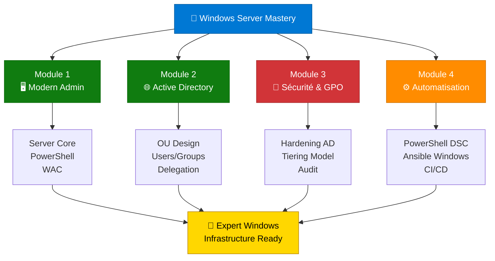

---
tags:
  - formation
  - windows-server
  - powershell
  - active-directory
  - microsoft
---

# Formation : Windows Server Mastery

**Maîtrisez l'administration moderne des serveurs Windows en environnement d'entreprise.**

---

## Vue d'Ensemble

Cette formation vous transforme en **expert de l'écosystème Microsoft** capable d'administrer, sécuriser et automatiser des infrastructures Windows Server en production. Vous apprendrez à gérer des environnements complexes avec **PowerShell**, **Active Directory**, et les outils modernes de l'ère 2025.

### Pour Qui ?

=== "Admins Linux → Windows"
    **Vous maîtrisez Linux et devez gérer Windows ?**

    - Transition Bash → PowerShell (penser en objets)
    - Concepts familiers : Users, Groups, ACLs, Services
    - Différences majeures : Domaine AD vs LDAP, GPO vs scripts

    **Ce que vous apprécierez :**

    - PowerShell = Shell + Python combinés
    - Server Core = Linux-like experience (CLI only)
    - Automatisation tout aussi puissante qu'Ansible

=== "Admins Windows Junior"
    **Vous connaissez Windows Desktop et souhaitez passer au serveur ?**

    - Comprendre Server Core vs Desktop Experience
    - Passer du GUI au CLI (PowerShell + WAC)
    - Apprendre Active Directory de zéro

    **Ce que vous gagnerez :**

    - Compétences valorisées en entreprise
    - Certification MCSA-like knowledge
    - Capacité à gérer des infrastructures de 500+ users

=== "DevOps Engineers"
    **Vous automatisez Linux et Kubernetes ?**

    - Intégrer Windows dans vos pipelines CI/CD
    - Gérer Windows avec Ansible/Terraform
    - Comprendre les contraintes AD pour vos apps

    **Ce que vous débloquerez :**

    - Infrastructure hybride Linux + Windows
    - PowerShell DSC = Ansible pour Windows
    - Conteneurs Windows (Docker + Kubernetes)

---

## Pourquoi Cette Formation ?

### Le Problème

```
┌─────────────────────────────────────────────────────────────┐
│         L'Administration Windows en 2025                     │
├─────────────────────────────────────────────────────────────┤
│                                                              │
│  ❌ "Je clique dans le GUI depuis 10 ans..."                │
│     → Non scriptable, non reproductible                      │
│                                                              │
│  ❌ "Active Directory, c'est de la magie noire..."          │
│     → Méconnaissance des concepts (OU, GPO, Trusts)         │
│                                                              │
│  ❌ "PowerShell ? Trop compliqué, je reste sur GUI..."      │
│     → Impossible d'automatiser 500 serveurs                  │
│                                                              │
│  ❌ "Sécurité AD ? On verra plus tard..."                   │
│     → Backdoors, Pass-the-Hash, Golden Tickets              │
│                                                              │
└─────────────────────────────────────────────────────────────┘
```

### La Solution : Modernité + Sécurité + Automatisation



---

## Programme de la Formation

### Module 1 : Modern Admin - Le Serveur Moderne

**Objectif :** Maîtriser l'installation, la configuration et l'administration moderne de Windows Server.

**Contenu :**

- **Server Core vs Desktop Experience** : Choisir le bon build
- **sconfig** : Configuration rapide sans GUI
- **PowerShell Fundamentals** : Penser en objets (vs Bash texte)
- **Windows Admin Center (WAC)** : GUI moderne basé web
- **Package Managers** : Winget, Chocolatey, Scoop
- **OpenSSH sur Windows** : Administration à distance Linux-style

**Exercice Pratique :** Déployer un Server Core, le configurer en PowerShell, installer OpenSSH.

**Durée estimée :** 3-4 heures

---

### Module 2 : Active Directory - Le Cœur de l'Entreprise

**Objectif :** Comprendre et implémenter Active Directory Domain Services.

**Contenu :**

- **Architecture AD** : Domain, Forest, Site, DC
- **Design d'OU** : Organisation logique (Géographie vs Fonction)
- **Users & Groups** : Création, Nested Groups, Service Accounts
- **Group Policy Objects (GPO)** : Automatiser les configurations
- **FSMO Roles** : Schema Master, RID Master, PDC Emulator
- **Replication** : Sites, Subnets, Bridgehead Servers

**Exercice Pratique :** Créer un domaine `corp.example.com`, structure d'OU, 50 users, 10 groupes, 3 GPO.

**Durée estimée :** 4-5 heures

---

### Module 3 : Sécurité & Hardening - La Forteresse AD

**Objectif :** Sécuriser Active Directory contre les attaques modernes.

**Contenu :**

- **Attack Vectors** : Pass-the-Hash, Kerberoasting, DCSync
- **Tiering Model** : Tier 0 (DC), Tier 1 (Servers), Tier 2 (Workstations)
- **Protected Users Group** : Blocage NTLM, Kerberos AES
- **LAPS** : Rotation automatique des mots de passe admin locaux
- **Audit AD** : Advanced Audit Policy, 4624/4625/4720/4728
- **Hardening Checklist** : Disable SMBv1, LDAP Signing, etc.

**Exercice Pratique :** Implémenter le Tiering Model, LAPS, audit avancé, tester avec BloodHound.

**Durée estimée :** 4-5 heures

---

### Module 4 : Automatisation - PowerShell & IaC

**Objectif :** Automatiser l'administration Windows avec PowerShell, DSC et Ansible.

**Contenu :**

- **PowerShell Scripting Avancé** : Functions, Modules, Error Handling
- **Active Directory Module** : `Get-ADUser`, `New-ADGroup`, Bulk Operations
- **PowerShell DSC** : Desired State Configuration (Infrastructure as Code)
- **Ansible pour Windows** : WinRM, modules `win_*`, playbooks
- **CI/CD Windows** : Packer, Terraform, GitHub Actions

**Exercice Pratique :** Script PowerShell pour provisionner 100 users depuis CSV, playbook Ansible pour hardening.

**Durée estimée :** 4-5 heures

---

## Prérequis

### Connaissances Techniques

- **Niveau Système :** Compréhension des concepts réseau (IP, DNS, DHCP)
- **Administration Serveur :** Expérience Linux OU Windows Desktop (niveau utilisateur avancé)
- **Ligne de commande :** Familiarité avec Bash OU CMD (PowerShell sera enseigné from scratch)

### Matériel Requis

**Option 1 : Lab Local (VirtualBox/VMware/Hyper-V)**

```yaml
Configuration minimale:
  RAM: 16 GB (8 GB pour Windows Server, 8 GB pour votre OS)
  CPU: 4 cores
  Disque: 80 GB disponibles

Lab typique:
  - 1 VM Windows Server 2022 (4 GB RAM, 2 vCPU, 60 GB disque)
  - 1 VM Windows 10/11 Client (4 GB RAM, 2 vCPU, 40 GB disque)
```

**Option 2 : Cloud (Azure/AWS/GCP)**

```yaml
Azure:
  Type: Standard_B2s (2 vCPU, 4 GB RAM)
  Coût: ~30€/mois (arrêter les VMs quand inutilisées)
  Image: Windows Server 2022 Datacenter

AWS:
  Type: t3.medium (2 vCPU, 4 GB RAM)
  Coût: ~35€/mois
  AMI: Windows_Server-2022-English-Full-Base
```

**Option 3 : Evaluation Gratuite**

```powershell
# Windows Server 2022 Evaluation (180 jours gratuits)
# https://www.microsoft.com/en-us/evalcenter/evaluate-windows-server-2022

# Télécharger ISO
Invoke-WebRequest -Uri "https://..." -OutFile "WS2022.iso"
```

---

## Méthodologie Pédagogique

### 1. Concept → Pratique → Exercice

Chaque module suit cette progression :


### 2. PowerShell First

**Nous privilégions PowerShell sur le GUI** pour une raison simple :

!!! quote "Le Principe"
    **Ce que vous scriptez avec PowerShell, vous pouvez le reproduire 1000 fois.**
    **Ce que vous cliquez dans le GUI, vous devrez le recliquer 1000 fois.**

### 3. Scénarios Réels

Tous les exercices sont basés sur des cas d'entreprise réels :

- **Module 1** : Déploiement d'un nouveau serveur en production
- **Module 2** : Création d'une infrastructure AD pour 500 employés
- **Module 3** : Réponse à un audit de sécurité (ISO 27001)
- **Module 4** : Automatisation du provisioning users (RH → AD)

---

## Outils Utilisés

### Logiciels Requis

| Outil | Usage | Installation |
|-------|-------|-------------|
| **Windows Server 2022** | OS principal | Evaluation Center |
| **PowerShell 7+** | Shell moderne | `winget install Microsoft.PowerShell` |
| **Windows Admin Center** | GUI web moderne | `https://aka.ms/wacdownload` |
| **Visual Studio Code** | Éditeur scripts | `winget install Microsoft.VisualStudioCode` |
| **RSAT Tools** | Admin AD à distance | `Add-WindowsCapability -Online -Name Rsat.ActiveDirectory*` |
| **Git** | Versionning scripts | `winget install Git.Git` |

### Outils Optionnels (Module 3 & 4)

| Outil | Usage | Commande |
|-------|-------|----------|
| **BloodHound** | Audit AD graphique | `https://github.com/BloodHoundAD/BloodHound` |
| **PingCastle** | Health check AD | `https://www.pingcastle.com/download/` |
| **Ansible** | Automatisation Windows | `pip install ansible pywinrm` |
| **Terraform** | IaC Azure/AWS | `winget install Hashicorp.Terraform` |

---

## Certification & Validation

### Compétences Acquises

À la fin de cette formation, vous serez capable de :

- ✅ **Installer et configurer** Windows Server Core en production
- ✅ **Déployer Active Directory** avec design d'OU optimal
- ✅ **Créer et gérer** des GPO pour 500+ postes
- ✅ **Sécuriser AD** contre Pass-the-Hash, Kerberoasting, DCSync
- ✅ **Automatiser** avec PowerShell DSC et Ansible
- ✅ **Auditer** les événements de sécurité (4624, 4625, 4720, etc.)
- ✅ **Dépanner** la réplication AD et les problèmes de domaine

### Équivalences Certifications

Cette formation couvre les concepts des certifications Microsoft suivantes :

| Certification | Couverture | Modules |
|--------------|------------|---------|
| **AZ-800** : Administering Windows Server Hybrid Core Infrastructure | 70% | Modules 1, 2, 4 |
| **AZ-801** : Configuring Windows Server Hybrid Advanced Services | 50% | Modules 2, 3, 4 |
| **SC-900** : Microsoft Security Fundamentals | 30% (partie AD) | Module 3 |

!!! warning "Note Importante"
    Cette formation n'est **pas une préparation officielle aux certifications Microsoft**. Elle vous donne les **compétences pratiques** nécessaires, mais vous devrez compléter avec les ressources Microsoft Learn pour passer les examens.

---

## Commencer la Formation

### Ordre Recommandé

1. **Module 1 : Modern Admin** ← Commencez ici
2. **Module 2 : Active Directory**
3. **Module 3 : Sécurité & Hardening**
4. **Module 4 : Automatisation**

### Avant de Démarrer

**Checklist :**

- [ ] VM Windows Server 2022 créée (ou Azure/AWS provisionné)
- [ ] PowerShell 7+ installé
- [ ] Visual Studio Code configuré
- [ ] Connexion Internet (pour téléchargements)
- [ ] Snapshot/Backup VM configuré (pour tests destructifs)

---

## Support & Communauté

- **Documentation officielle :** [Microsoft Learn](https://learn.microsoft.com/windows-server/)
- **GitHub ShellBook :** [Issues & Discussions](https://github.com/VBlackJack/ShellBook/issues)
- **PowerShell Community :** [Reddit r/PowerShell](https://reddit.com/r/PowerShell)

---

!!! success "Prêt à Devenir un Expert Windows Server ?"
    **Lancez-vous avec le [Module 1 : Modern Admin](01-module.md) !**

    **Temps total estimé :** 16-20 heures
    **Niveau :** Intermédiaire à Avancé
    **Format :** Auto-formation avec exercices pratiques
