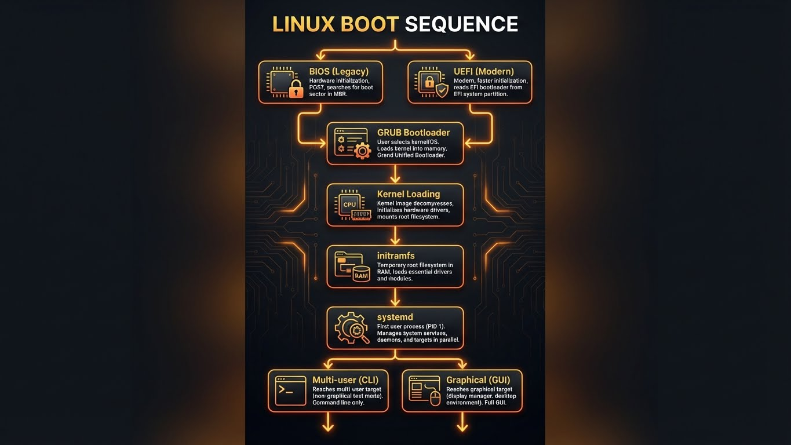
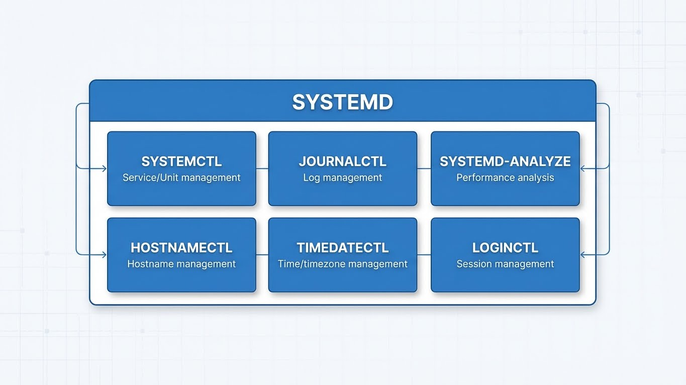
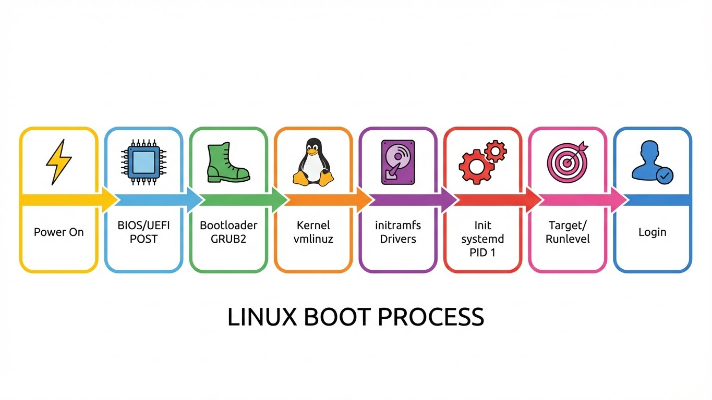

---
tags:
  - boot
  - systemd
  - grub
  - troubleshooting
  - systemd-analyze
---

# Processus de Boot & Systemd

Référence complète pour la séquence de boot Linux et la gestion des services.



---

## Le Processus de Boot (Vue d'ensemble)

```mermaid
flowchart LR
    A[🔌 Mise sous Tension] --> B[⚡ BIOS/UEFI<br/>POST]
    B --> C[📦 Bootloader<br/>GRUB2]
    C --> D[🐧 Kernel<br/>vmlinuz]
    D --> E[💾 initramfs<br/>Drivers]
    E --> F[⚙️ Init<br/>Systemd (PID 1)]
    F --> G[🎯 Runlevel<br/>Target]
    G --> H[🖥️ Login]
```

### Étape 1 : BIOS/UEFI

**Power-On Self-Test (POST)**

- Initialise le matériel (CPU, RAM, stockage)
- Cherche un périphérique bootable
- Charge le bootloader depuis le MBR (BIOS) ou l'ESP (UEFI)

```bash
# Vérifier le mode de boot
[ -d /sys/firmware/efi ] && echo "UEFI" || echo "BIOS"

# Lister les entrées de boot UEFI
efibootmgr -v
```

| BIOS (Legacy) | UEFI |
|---------------|------|
| Partitionnement MBR | Partitionnement GPT |
| Limite 2 To | Limite 9 Zo |
| Pas de Secure Boot | Secure Boot supporté |
| Premier secteur du disque | Partition ESP (/boot/efi) |

---

### Étape 2 : GRUB2 (Bootloader)

Charge le kernel et l'initramfs en mémoire.

```bash
# Menu GRUB visible au boot
# Appuyer sur ESC ou SHIFT pour l'afficher
```

---

### Étape 3 : Kernel + initramfs

Le kernel se décompresse et initialise le matériel.

**initramfs** (Initial RAM Filesystem) :

- Système de fichiers temporaire en RAM
- Contient les drivers nécessaires pour monter le vrai `/`
- Une fois `/` monté, initramfs est libéré

```bash
# Voir les messages du kernel au boot
dmesg | head -100

# Messages d'erreur uniquement
dmesg --level=err,warn

# Avec timestamps lisibles
dmesg -T

# Suivre en temps réel
dmesg -w
```

!!! tip "dmesg pour le troubleshooting hardware"
    `dmesg` est votre premier réflexe pour :

    - Erreurs disque (I/O errors, bad sectors)
    - Problèmes USB
    - Erreurs mémoire (ECC)
    - Drivers manquants
    - Erreurs réseau (link up/down)

    ```bash
    # Chercher des erreurs
    dmesg | grep -iE "(error|fail|warn)"

    # Problèmes disque
    dmesg | grep -i "sda\|nvme\|ata"
    ```

---

### Étape 4 : Systemd (PID 1)

Le premier processus. Orchestre le démarrage de tous les services.

```bash
# Vérifier que systemd est PID 1
ps -p 1 -o comm=
# Output: systemd

# Temps de boot total
systemd-analyze
```

---

## Configuration GRUB2

### Fichiers de Configuration

| Fichier | Usage |
|---------|-------|
| `/boot/grub/grub.cfg` | Config générée (NE PAS ÉDITER) |
| `/etc/default/grub` | Options par défaut (ÉDITER ICI) |
| `/etc/grub.d/` | Scripts de génération |

### Configuration Principale

```bash
# /etc/default/grub

GRUB_DEFAULT=0                          # Entrée par défaut (0 = première)
GRUB_TIMEOUT=5                          # Délai avant boot auto
GRUB_TIMEOUT_STYLE=menu                 # menu, countdown, hidden
GRUB_DISTRIBUTOR="Debian"
GRUB_CMDLINE_LINUX_DEFAULT="quiet"      # Options kernel (mode normal)
GRUB_CMDLINE_LINUX=""                   # Options kernel (tous modes)
GRUB_DISABLE_RECOVERY="false"           # Afficher mode recovery
```

### Paramètres Kernel Utiles

```bash
# Exemples de GRUB_CMDLINE_LINUX

# Mode silencieux + splash
"quiet splash"

# Debug complet (voir tout)
""

# Ancien nommage réseau (eth0 au lieu de enp0s3)
"net.ifnames=0 biosdevname=0"

# Désactiver C-States (performance)
"intel_idle.max_cstate=0 processor.max_cstate=0"

# Forcer mode texte (pas de GUI)
"systemd.unit=multi-user.target"

# Mode rescue
"single" ou "systemd.unit=rescue.target"
```

### Appliquer les Changements

```bash
# Après modification de /etc/default/grub
sudo update-grub                    # Debian/Ubuntu

sudo grub2-mkconfig -o /boot/grub2/grub.cfg   # RHEL/CentOS
```

!!! danger "SecNumCloud : Protéger GRUB par mot de passe"
    **Sans protection**, n'importe qui avec accès physique peut :

    - Éditer les paramètres de boot (touche `e`)
    - Ajouter `init=/bin/bash` pour obtenir un shell root
    - Bypasser complètement l'authentification

    **Activer la protection :**

    ```bash
    # Générer le hash du mot de passe
    grub-mkpasswd-pbkdf2

    # Ajouter dans /etc/grub.d/40_custom
    set superusers="admin"
    password_pbkdf2 admin grub.pbkdf2.sha512.10000.HASH...

    # Régénérer
    sudo update-grub
    ```

    **Résultat :** Modification des entrées GRUB requiert authentification.

---

## Systemd : Le Cœur du Système

### Architecture





---

### Gestion des Services

#### Tableau des États

| Commande | Action | Effet |
|----------|--------|-------|
| `start` | Démarrer maintenant | Actif jusqu'à arrêt/reboot |
| `stop` | Arrêter maintenant | Inactif jusqu'à redémarrage |
| `restart` | Redémarrer | Stop + Start |
| `reload` | Recharger config | Sans interruption (si supporté) |
| `enable` | Activer au boot | Créé symlink dans target |
| `disable` | Désactiver au boot | Supprime symlink |
| `enable --now` | Enable + Start | Les deux en une commande |
| `mask` | Bloquer complètement | Impossible à démarrer |
| `unmask` | Débloquer | Annule mask |

```bash
# Workflow typique
sudo systemctl enable nginx      # Active au boot
sudo systemctl start nginx       # Démarre maintenant
sudo systemctl status nginx      # Vérifie l'état

# Raccourci
sudo systemctl enable --now nginx

# Masquer un service (empêcher tout démarrage)
sudo systemctl mask bluetooth
# Résultat: ln -s /dev/null /etc/systemd/system/bluetooth.service

# Démasquer
sudo systemctl unmask bluetooth
```

#### États d'un Service

```bash
systemctl status nginx

# Output:
● nginx.service - A high performance web server
     Loaded: loaded (/lib/systemd/system/nginx.service; enabled; ...)
     Active: active (running) since Mon 2024-01-15 10:00:00 UTC; 2h ago
   Main PID: 1234 (nginx)
      Tasks: 5 (limit: 4915)
     Memory: 12.5M
        CPU: 1.234s
     CGroup: /system.slice/nginx.service
             ├─1234 nginx: master process
             └─1235 nginx: worker process
```

| État | Signification |
|------|---------------|
| `loaded` | Unit file trouvé et parsé |
| `enabled` | Démarre au boot |
| `disabled` | Ne démarre pas au boot |
| `masked` | Complètement bloqué |
| `active (running)` | En cours d'exécution |
| `active (exited)` | Oneshot terminé avec succès |
| `inactive (dead)` | Arrêté |
| `failed` | Échec au démarrage |

---

### Targets (Runlevels Systemd)

Les targets regroupent des services pour définir un état système.

| Target | Ancien Runlevel | Description |
|--------|-----------------|-------------|
| `poweroff.target` | 0 | Arrêt |
| `rescue.target` | 1 | Single-user, maintenance |
| `multi-user.target` | 3 | Multi-user, réseau, **sans GUI** |
| `graphical.target` | 5 | Multi-user **avec GUI** |
| `reboot.target` | 6 | Redémarrage |
| `emergency.target` | - | Shell root minimal |

```bash
# Voir la target actuelle
systemctl get-default

# Changer la target par défaut
sudo systemctl set-default multi-user.target    # Serveur (sans GUI)
sudo systemctl set-default graphical.target     # Desktop (avec GUI)

# Changer de target immédiatement
sudo systemctl isolate multi-user.target        # Passer en mode texte
sudo systemctl isolate rescue.target            # Mode maintenance

# Voir les dépendances d'une target
systemctl list-dependencies graphical.target
```

!!! tip "Serveurs : Toujours multi-user.target"
    Sur un serveur, `graphical.target` gaspille des ressources.

    ```bash
    sudo systemctl set-default multi-user.target
    ```

---

### Analyse de Performance Boot

#### systemd-analyze

```bash
# Temps total de boot
systemd-analyze
# Startup finished in 3.456s (kernel) + 12.345s (userspace) = 15.801s

# Graphique détaillé (SVG)
systemd-analyze plot > boot.svg
```

#### systemd-analyze blame

**Liste les services par temps de démarrage** (les plus lents en premier).

```bash
systemd-analyze blame

# Output:
# 8.123s NetworkManager-wait-online.service
# 3.456s snapd.service
# 2.345s apt-daily-upgrade.service
# 1.234s dev-sda1.device
# ...
```

!!! warning "Suspects habituels"
    - `NetworkManager-wait-online.service` - Attend la connexion réseau
    - `snapd.service` - Gestionnaire Snap
    - `plymouth-*.service` - Animation de boot
    - `apt-daily*.service` - Mises à jour automatiques

    **Optimisation :**
    ```bash
    # Désactiver l'attente réseau (si non critique)
    sudo systemctl disable NetworkManager-wait-online.service

    # Désactiver snapd (si non utilisé)
    sudo systemctl disable snapd.service
    ```

#### systemd-analyze critical-chain

**Montre le chemin critique** (ce qui bloque quoi).

```bash
systemd-analyze critical-chain

# Output:
graphical.target @15.801s
└─multi-user.target @15.800s
  └─nginx.service @15.500s +300ms
    └─network-online.target @15.400s
      └─NetworkManager-wait-online.service @7.100s +8.300s
        └─NetworkManager.service @6.900s +200ms
          └─dbus.service @6.800s +100ms
            └─basic.target @6.700s
```

**Lecture :** Le temps après `@` indique quand l'unité a démarré. Le temps après `+` indique la durée.

---

## Journald : Kit de Survie

### Syntaxe de Base

```bash
journalctl [OPTIONS] [MATCHES]
```

### Filtrer par Service (-u)

```bash
# Logs d'un service
journalctl -u nginx
journalctl -u ssh

# Plusieurs services
journalctl -u nginx -u php-fpm

# Avec le nom complet
journalctl -u nginx.service
```

### Filtrer par Boot (-b)

```bash
# Boot actuel
journalctl -b

# Boot précédent
journalctl -b -1

# Avant-dernier boot
journalctl -b -2

# Lister les boots enregistrés
journalctl --list-boots
```

### Suivre en Direct (-f)

```bash
# Comme tail -f
journalctl -f

# Service spécifique
journalctl -u nginx -f

# Depuis maintenant
journalctl -f -n 0
```

### Filtrer par Priorité (-p)

| Niveau | Code | Description |
|--------|------|-------------|
| emerg | 0 | Système inutilisable |
| alert | 1 | Action immédiate requise |
| crit | 2 | Conditions critiques |
| err | 3 | Erreurs |
| warning | 4 | Avertissements |
| notice | 5 | Normal mais significatif |
| info | 6 | Informationnel |
| debug | 7 | Debug |

```bash
# Erreurs seulement
journalctl -p err

# Erreurs et plus grave
journalctl -p err..emerg

# Warnings et erreurs
journalctl -p warning

# Erreurs depuis ce boot
journalctl -b -p err
```

### Filtrer par Temps

```bash
# Depuis une date
journalctl --since "2024-01-15"
journalctl --since "2024-01-15 10:00:00"

# Relatif
journalctl --since "1 hour ago"
journalctl --since "30 min ago"
journalctl --since yesterday

# Plage de temps
journalctl --since "2024-01-15" --until "2024-01-16"

# Dernières 24h
journalctl --since "24 hours ago"
```

### Autres Options Utiles

```bash
# Dernières N lignes
journalctl -n 50

# Sans pagination (pour scripts)
journalctl --no-pager

# Format JSON
journalctl -o json-pretty

# Messages kernel uniquement
journalctl -k

# Output inversé (récent en premier)
journalctl -r

# Taille du journal
journalctl --disk-usage

# Nettoyer les vieux logs
sudo journalctl --vacuum-time=7d      # Garder 7 jours
sudo journalctl --vacuum-size=500M    # Limiter à 500MB
```

### Combinaisons Courantes

```bash
# Debug: service qui crash
journalctl -u nginx -b -p err -f

# Tout voir depuis le dernier reboot
journalctl -b

# Erreurs kernel
journalctl -k -p err

# Authentification (SSH, sudo)
journalctl -u ssh --since "1 hour ago"

# Recherche texte
journalctl -u nginx | grep "error"

# Export pour analyse
journalctl -u nginx --since today > /tmp/nginx_logs.txt
```

---

## Référence Rapide

```bash
# Analyse de boot
systemd-analyze                    # Temps total
systemd-analyze blame              # Services lents
systemd-analyze critical-chain     # Chemin critique

# Gestion des services
systemctl status nginx             # État
systemctl enable --now nginx       # Enable + Start
systemctl mask service             # Bloquer complètement

# Targets
systemctl get-default              # Target actuelle
systemctl set-default multi-user.target

# Logs
journalctl -u nginx -f             # Suivre service
journalctl -b -p err               # Erreurs ce boot
journalctl --since "1 hour ago"    # Dernière heure

# GRUB
sudo update-grub                   # Régénérer config
dmesg -T                           # Messages kernel
```

---

## Voir aussi

- [Systemd Avancé](systemd-advanced.md)
- [Débogage Système & Logs](debugging.md)
