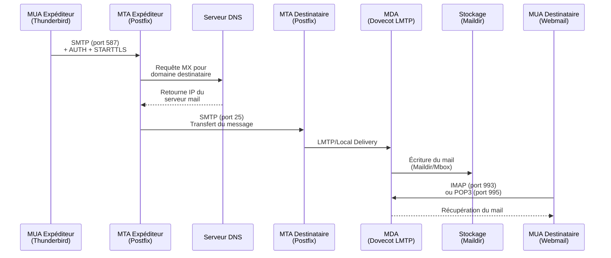

---
tags:
  - linux
  - email
  - smtp
  - postfix
  - imap
---

# Architecture & Services Email

Comprendre le fonctionnement de la messagerie électronique, de l'envoi à la réception.

## Composants d'un Système de Messagerie

Le trajet d'un email implique plusieurs acteurs spécialisés.

| Acronyme | Nom Complet | Rôle | Analogie "Poste" | Exemple |
|----------|-------------|------|------------------|---------|
| **MUA** | Mail User Agent | Client de messagerie utilisé par l'utilisateur pour lire/écrire. | La boîte aux lettres personnelle | Outlook, Thunderbird, Webmail (Gmail) |
| **MTA** | Mail Transfer Agent | Serveur qui route les emails d'un serveur à un autre via SMTP. | Le centre de tri postal | **Postfix**, Exim, Sendmail, Exchange |
| **MDA** | Mail Delivery Agent | Programme qui stocke le message dans la boîte locale de l'utilisateur. | Le facteur qui dépose le courrier | Dovecot, Procmail |

### Flux d'un Email

1.  **Envoi** : Le MUA (Thunderbird) envoie le mail au MTA local via **SMTP** (port 587).
2.  **Routage** : Le MTA interroge le DNS (enregistrement **MX**) pour trouver le serveur destinataire.
3.  **Transfert** : Le MTA expéditeur transmet le mail au MTA destinataire via **SMTP** (port 25).
4.  **Stockage** : Le MTA destinataire passe le mail au MDA qui l'écrit sur le disque (format *Maildir* ou *Mbox*).
5.  **Relève** : Le MUA destinataire récupère le mail via **IMAP** ou **POP**.

### Diagramme du Flux Email Complet



---

## Protocoles Standards

### SMTP (Simple Message Transfer Protocol)
Utilisé pour l'**envoi** et le **transfert** entre serveurs.
*   **Port 25** : Transfert serveur à serveur (MTA-to-MTA). Souvent bloqué par les FAI résidentiels.
*   **Port 587 (Submission)** : Envoi client à serveur (MUA-to-MTA) avec authentification (STARTTLS). Recommandé.
*   **Port 465** : Ancienne norme pour SMTP sur SSL (SMTPS), encore supportée.

### IMAP (Internet Message Access Protocol)
*   **Port 143** (non chiffré) / **993** (IMAPS).
*   **Fonctionnement** : Les mails restent sur le serveur. Synchronisation bidirectionnelle (lecture, dossiers, états).
*   **Usage** : Idéal pour accès multi-appareils (Smartphone + PC).

### POP3 (Post Office Protocol version 3)
*   **Port 110** (non chiffré) / **995** (POP3S).
*   **Fonctionnement** : Télécharge les mails et (souvent) les supprime du serveur.
*   **Usage** : Obsolète, sauf pour archivage local ou contrainte d'espace serveur.

---

## Configuration Postfix (MTA)

### Installation
```bash
sudo apt install postfix mailutils  # Debian/Ubuntu
sudo dnf install postfix mailx       # RHEL/Rocky
sudo systemctl enable --now postfix
```

### Configuration de Base (`/etc/postfix/main.cf`)

#### Serveur Relay Simple
```ini
# Identité du serveur
myhostname = mail.example.com
mydomain = example.com
myorigin = $mydomain

# Interfaces réseau
inet_interfaces = all
inet_protocols = ipv4

# Destinations locales
mydestination = $myhostname, localhost.$mydomain, localhost, $mydomain
mynetworks = 127.0.0.0/8, 192.168.1.0/24

# Relayage autorisé uniquement pour les réseaux approuvés
relay_domains =
smtpd_relay_restrictions = permit_mynetworks, permit_sasl_authenticated, reject_unauth_destination

# Limites anti-spam
message_size_limit = 20971520  # 20MB
mailbox_size_limit = 0

# TLS pour connexions sortantes
smtp_tls_security_level = may
smtp_tls_loglevel = 1

# TLS pour connexions entrantes (submission)
smtpd_tls_cert_file = /etc/ssl/certs/mail.example.com.crt
smtpd_tls_key_file = /etc/ssl/private/mail.example.com.key
smtpd_tls_security_level = may
smtpd_tls_auth_only = yes

# SASL Authentication (pour submission port 587)
smtpd_sasl_type = dovecot
smtpd_sasl_path = private/auth
smtpd_sasl_auth_enable = yes
smtpd_sasl_security_options = noanonymous

# Format de stockage
home_mailbox = Maildir/
```

### Configuration du Port Submission (`/etc/postfix/master.cf`)
```ini
submission inet n       -       y       -       -       smtpd
  -o syslog_name=postfix/submission
  -o smtpd_tls_security_level=encrypt
  -o smtpd_sasl_auth_enable=yes
  -o smtpd_relay_restrictions=permit_sasl_authenticated,reject
  -o milter_macro_daemon_name=ORIGINATING
```

### Commandes Postfix Essentielles
```bash
# Recharger la configuration
sudo postfix reload

# Voir la file d'attente
mailq
postqueue -p

# Forcer l'envoi de la queue
postqueue -f

# Supprimer un message
postsuper -d MESSAGE_ID

# Vider toute la queue
postsuper -d ALL

# Tester la configuration
postfix check

# Logs en temps réel
sudo tail -f /var/log/mail.log
```

---

## Configuration Dovecot (MDA/IMAP)

### Installation
```bash
sudo apt install dovecot-core dovecot-imapd dovecot-pop3d
sudo systemctl enable --now dovecot
```

### Configuration Principale (`/etc/dovecot/dovecot.conf`)
```ini
# Protocoles activés
protocols = imap pop3 lmtp

# Écouter sur toutes les interfaces
listen = *, ::
```

### Configuration Mail (`/etc/dovecot/conf.d/10-mail.conf`)
```ini
# Format de stockage (doit correspondre à Postfix)
mail_location = maildir:~/Maildir

# Utilisateur système pour les mails
mail_privileged_group = mail
```

### Configuration Authentification (`/etc/dovecot/conf.d/10-auth.conf`)
```ini
# Désactiver l'authentification en clair sur connexions non chiffrées
disable_plaintext_auth = yes

# Mécanismes d'authentification
auth_mechanisms = plain login

# Fichier de mots de passe (pour tests, utiliser LDAP en prod)
passdb {
  driver = pam
}

userdb {
  driver = passwd
}
```

### Configuration SSL (`/etc/dovecot/conf.d/10-ssl.conf`)
```ini
# Exiger SSL
ssl = required

# Certificats
ssl_cert = </etc/ssl/certs/mail.example.com.crt
ssl_key = </etc/ssl/private/mail.example.com.key

# Protocoles modernes uniquement
ssl_min_protocol = TLSv1.2
ssl_cipher_list = EECDH+AESGCM:EDH+AESGCM
ssl_prefer_server_ciphers = yes
```

### Configuration LMTP pour Postfix (`/etc/dovecot/conf.d/10-master.conf`)
```ini
service lmtp {
  unix_listener /var/spool/postfix/private/dovecot-lmtp {
    mode = 0600
    user = postfix
    group = postfix
  }
}

service auth {
  unix_listener /var/spool/postfix/private/auth {
    mode = 0660
    user = postfix
    group = postfix
  }
}
```

---

## Configuration DNS pour l'Email

### Enregistrements MX
Les enregistrements MX indiquent quel serveur reçoit les emails pour un domaine.

```dns
; Priorité 10 (plus bas = plus prioritaire)
example.com.         IN  MX  10  mail.example.com.
example.com.         IN  MX  20  mail-backup.example.com.

; L'hôte mail doit avoir un enregistrement A
mail.example.com.    IN  A   203.0.113.10
```

### Enregistrement SPF
Définit les serveurs autorisés à envoyer des emails pour votre domaine.

```dns
example.com.  IN  TXT  "v=spf1 ip4:203.0.113.10 ip4:203.0.113.11 include:_spf.google.com ~all"
```

**Syntaxe SPF** :
- `v=spf1` : Version du protocole
- `ip4:` / `ip6:` : Autoriser une IP spécifique
- `include:` : Inclure la politique SPF d'un autre domaine
- `a` / `mx` : Autoriser les serveurs listés dans les enregistrements A/MX
- `~all` : Soft fail (rejeter probablement les autres)
- `-all` : Hard fail (rejeter définitivement les autres)

### Configuration DKIM

#### 1. Générer les clés DKIM
```bash
sudo apt install opendkim opendkim-tools
sudo mkdir -p /etc/opendkim/keys/example.com
cd /etc/opendkim/keys/example.com

# Générer une paire de clés (2048 bits)
sudo opendkim-genkey -b 2048 -d example.com -s default
sudo chown opendkim:opendkim default.private
```

#### 2. Publier la clé publique dans le DNS
Le fichier `default.txt` contient l'enregistrement DNS :
```dns
default._domainkey.example.com. IN TXT "v=DKIM1; k=rsa; p=MIGfMA0GCSqGSIb3DQEBAQUAA4GNADCBiQKBgQC..."
```

#### 3. Configuration OpenDKIM (`/etc/opendkim.conf`)
```ini
Domain                  example.com
KeyFile                 /etc/opendkim/keys/example.com/default.private
Selector                default
Socket                  inet:8891@localhost
```

#### 4. Intégration avec Postfix (`/etc/postfix/main.cf`)
```ini
# Milter DKIM
milter_default_action = accept
milter_protocol = 6
smtpd_milters = inet:localhost:8891
non_smtpd_milters = inet:localhost:8891
```

### Enregistrement DMARC
Définit la politique de traitement des emails qui échouent SPF/DKIM.

```dns
_dmarc.example.com.  IN  TXT  "v=DMARC1; p=quarantine; rua=mailto:dmarc@example.com; ruf=mailto:forensic@example.com; fo=1; adkim=s; aspf=s; pct=100"
```

**Paramètres DMARC** :
- `p=` : Politique (none/quarantine/reject)
- `rua=` : Adresse pour rapports agrégés
- `ruf=` : Adresse pour rapports forensiques
- `fo=` : Options de reporting (0=all fail, 1=any fail)
- `adkim=` : Alignement DKIM (r=relaxed, s=strict)
- `aspf=` : Alignement SPF (r=relaxed, s=strict)
- `pct=` : Pourcentage de messages soumis à la politique

---

## Délivrabilité & Sécurité

Pour éviter d'être classé comme SPAM, trois mécanismes DNS sont indispensables.

### 1. SPF (Sender Policy Framework)
Un enregistrement DNS `TXT` qui liste les IP autorisées à envoyer des emails pour votre domaine.
*   *Exemple* : `v=spf1 ip4:192.0.2.10 include:_spf.google.com ~all`
*   *Effet* : Empêche un tiers d'utiliser votre domaine pour envoyer des mails depuis une autre IP.

### 2. DKIM (DomainKeys Identified Mail)
Signature cryptographique ajoutée dans l'en-tête du mail.
*   Le serveur émetteur signe le mail avec sa **clé privée**.
*   Le serveur récepteur vérifie la signature avec la **clé publique** publiée dans le DNS.
*   *Effet* : Garantit que le mail n'a pas été altéré en transit.

### 3. DMARC (Domain-based Message Authentication, Reporting, and Conformance)
Une politique qui dit au récepteur quoi faire si SPF ou DKIM échouent.
*   *Exemple* : `v=DMARC1; p=reject; rua=mailto:admin@example.com`
*   *Effet* : Bloque les emails non authentifiés et envoie un rapport à l'admin.

---

## Tests et Validation

### Test SMTP Manuel avec Telnet
```bash
telnet mail.example.com 25
# Une fois connecté :
EHLO client.example.com
MAIL FROM:<sender@example.com>
RCPT TO:<recipient@example.com>
DATA
Subject: Test email
From: sender@example.com
To: recipient@example.com

Ceci est un email de test.
.
QUIT
```

### Test SMTP avec SWAKS
```bash
# Installation
sudo apt install swaks

# Test simple
swaks --to recipient@example.com --from sender@example.com --server mail.example.com

# Test avec authentification et TLS
swaks --to recipient@example.com \
      --from sender@example.com \
      --server mail.example.com:587 \
      --auth LOGIN \
      --auth-user sender@example.com \
      --auth-password 'password' \
      --tls

# Test avec fichier de message
swaks --to recipient@example.com \
      --from sender@example.com \
      --server mail.example.com \
      --body message.txt \
      --attach /path/to/attachment.pdf
```

### Test avec la Commande Mail
```bash
# Envoi simple
echo "Corps du message" | mail -s "Sujet du test" recipient@example.com

# Avec fichier
mail -s "Rapport" -a /path/to/report.pdf recipient@example.com < message.txt

# Variables d'environnement pour SMTP externe
export MAILRC=/dev/null
export NAIL_EXTRA_RC=/dev/null
echo "Test" | mail -v -s "Test" \
  -S smtp=smtp://smtp.gmail.com:587 \
  -S smtp-use-starttls \
  -S smtp-auth=login \
  -S smtp-auth-user=user@gmail.com \
  -S smtp-auth-password='password' \
  -S from="user@gmail.com" \
  recipient@example.com
```

### Vérification DNS
```bash
# Enregistrements MX
dig +short MX example.com
host -t MX example.com

# Enregistrement SPF
dig +short TXT example.com | grep spf
host -t TXT example.com

# Enregistrement DKIM
dig +short TXT default._domainkey.example.com

# Enregistrement DMARC
dig +short TXT _dmarc.example.com

# Résolution inverse (PTR) - Important pour délivrabilité
dig +short -x 203.0.113.10
host 203.0.113.10
```

### Outils en Ligne
- **MXToolbox** : https://mxtoolbox.com/ (Test MX, SPF, DKIM, DMARC, Blacklist)
- **Mail-tester** : https://www.mail-tester.com/ (Score spam global)
- **DMARC Analyzer** : https://www.dmarcanalyzer.com/

---

## Dépannage et Problèmes Courants

### Emplacements des Logs

```bash
# Debian/Ubuntu
/var/log/mail.log
/var/log/mail.err

# RHEL/Rocky/CentOS
/var/log/maillog

# Logs Postfix en temps réel
sudo tail -f /var/log/mail.log

# Logs Dovecot
sudo tail -f /var/log/dovecot.log

# Filtrer les erreurs
sudo grep -i error /var/log/mail.log
sudo grep -i warning /var/log/mail.log
```

### Erreurs Courantes

#### 1. "Relay access denied"
**Cause** : Le serveur refuse de relayer le mail car l'expéditeur n'est pas autorisé.

**Solution** :
```bash
# Vérifier mynetworks dans /etc/postfix/main.cf
postconf mynetworks
# Ajouter le réseau autorisé
mynetworks = 127.0.0.0/8, 192.168.1.0/24
sudo postfix reload
```

#### 2. "Connection timed out"
**Cause** : Pare-feu bloquant les ports ou service non démarré.

**Solution** :
```bash
# Vérifier que le service écoute
sudo ss -tlnp | grep :25
sudo ss -tlnp | grep :587

# Ouvrir les ports (firewalld)
sudo firewall-cmd --permanent --add-service=smtp
sudo firewall-cmd --permanent --add-service=smtp-submission
sudo firewall-cmd --reload

# Ouvrir les ports (ufw)
sudo ufw allow 25/tcp
sudo ufw allow 587/tcp
```

#### 3. "Certificate verification failed"
**Cause** : Certificat SSL invalide, expiré ou auto-signé non reconnu.

**Solution** :
```bash
# Vérifier le certificat
openssl s_client -connect mail.example.com:587 -starttls smtp

# Vérifier l'expiration
openssl x509 -in /etc/ssl/certs/mail.example.com.crt -noout -enddate

# Renouveler avec Let's Encrypt
sudo certbot certonly --standalone -d mail.example.com
sudo ln -sf /etc/letsencrypt/live/mail.example.com/fullchain.pem /etc/ssl/certs/mail.example.com.crt
sudo ln -sf /etc/letsencrypt/live/mail.example.com/privkey.pem /etc/ssl/private/mail.example.com.key
sudo postfix reload
sudo systemctl restart dovecot
```

#### 4. "Mail marked as spam"
**Cause** : SPF/DKIM/DMARC mal configurés, IP blacklistée, pas de PTR.

**Solution** :
```bash
# Vérifier SPF/DKIM/DMARC avec mail-tester.com
# Vérifier les blacklists
host -t A mail.example.com | awk '{print $4}' | xargs -I {} mxtoolbox.com/SuperTool.aspx?action=blacklist:{}

# Configurer le PTR (chez votre hébergeur)
# Le PTR doit correspondre au hostname
dig +short -x YOUR_IP  # Doit retourner mail.example.com
```

#### 5. "Authentication failed"
**Cause** : Mauvais identifiants ou mécanisme SASL mal configuré.

**Solution** :
```bash
# Vérifier que Dovecot SASL fonctionne
sudo doveadm auth test user@example.com password

# Logs d'authentification
sudo grep -i sasl /var/log/mail.log

# Tester manuellement
testsaslauthd -u user@example.com -p password -s smtp
```

---

## Considérations de Sécurité

### 1. Prévention des Relais Ouverts (Open Relay)

Un relay ouvert permet à n'importe qui d'envoyer des emails via votre serveur, ce qui mène au blacklistage.

**Vérification** :
```bash
# Tester depuis l'extérieur avec swaks
swaks --to external@gmail.com --from spammer@evil.com --server YOUR_SERVER_IP
# Doit être rejeté avec "Relay access denied"
```

**Protection dans Postfix** :
```ini
smtpd_relay_restrictions =
    permit_mynetworks,
    permit_sasl_authenticated,
    reject_unauth_destination

smtpd_recipient_restrictions =
    permit_mynetworks,
    permit_sasl_authenticated,
    reject_unauth_destination,
    reject_invalid_hostname,
    reject_non_fqdn_sender,
    reject_non_fqdn_recipient,
    reject_unknown_sender_domain,
    reject_unknown_recipient_domain
```

### 2. Chiffrement TLS Obligatoire

**Pour le submission (port 587)** :
```ini
# Dans /etc/postfix/master.cf
submission inet n       -       y       -       -       smtpd
  -o smtpd_tls_security_level=encrypt  # Force TLS
  -o smtpd_sasl_auth_enable=yes
```

**Pour Dovecot** :
```ini
# /etc/dovecot/conf.d/10-ssl.conf
ssl = required
ssl_min_protocol = TLSv1.2
```

### 3. Limitation du Débit (Rate Limiting)

**Postfix** :
```ini
# Limite de 10 messages par minute par client
smtpd_client_message_rate_limit = 10
smtpd_client_connection_rate_limit = 10

# Limite de destinataires
smtpd_recipient_limit = 50
```

**Dovecot** :
```ini
# Limite de connexions IMAP
mail_max_userip_connections = 10
```

### 4. Fail2Ban pour Protection Brute-Force

```bash
sudo apt install fail2ban

# /etc/fail2ban/jail.local
[postfix-sasl]
enabled = true
port    = smtp,submission
filter  = postfix[mode=auth]
logpath = /var/log/mail.log
maxretry = 3
bantime = 3600

[dovecot]
enabled = true
port    = pop3,pop3s,imap,imaps
filter  = dovecot
logpath = /var/log/mail.log
maxretry = 3
bantime = 3600

sudo systemctl restart fail2ban
```

### 5. Antivirus et Anti-Spam

```bash
# ClamAV + SpamAssassin
sudo apt install clamav clamav-daemon spamassassin spamc

# Intégration dans Postfix
sudo apt install amavisd-new
# Configuration dans /etc/amavis/conf.d/15-content_filter_mode
```

---

## Alternatives Modernes Clé-en-Main

Pour simplifier la gestion d'un serveur mail complet, plusieurs solutions packagées existent.

### 1. Mailcow

**Description** : Stack Docker complète (Postfix, Dovecot, Rspamd, SOGo webmail).

**Installation** :
```bash
cd /opt
git clone https://github.com/mailcow/mailcow-dockerized
cd mailcow-dockerized
./generate_config.sh
docker-compose up -d
```

**Avantages** :
- Interface web d'administration complète
- Anti-spam (Rspamd) et antivirus intégrés
- Gestion DKIM/DMARC automatique
- Support de plusieurs domaines

**URL** : https://mailcow.email

### 2. Mail-in-a-Box

**Description** : Script d'installation automatique sur Ubuntu.

**Installation** :
```bash
curl -s https://mailinabox.email/setup.sh | sudo bash
```

**Avantages** :
- Installation en une commande
- Configuration DNS automatique
- Webmail Roundcube inclus
- Gestion Let's Encrypt automatique

**URL** : https://mailinabox.email

### 3. iRedMail

**Description** : Script d'installation pour RHEL/Debian avec interface web.

**Avantages** :
- Support multi-OS
- Edition gratuite et pro
- Interface d'administration intuitive

**URL** : https://www.iredmail.org

### 4. Mailu

**Description** : Solution Docker minimaliste.

**Installation** :
```bash
docker run -p 80:80 -p 443:443 -p 25:25 -p 587:587 \
  -v /mailu:/data mailu/admin:latest
```

**Avantages** :
- Léger et modulaire
- Configuration via variables d'environnement
- Idéal pour petits serveurs

**URL** : https://mailu.io

### Comparaison Rapide

| Solution | Complexité | Stack | Interface Web | Communauté |
|----------|------------|-------|---------------|------------|
| **Mailcow** | Moyenne | Docker | Excellente | Active |
| **Mail-in-a-Box** | Faible | Natif Ubuntu | Bonne | Active |
| **iRedMail** | Moyenne | Natif | Bonne | Active |
| **Mailu** | Faible | Docker | Basique | Active |
| **Postfix/Dovecot manuel** | Élevée | Natif | Aucune | Excellente |

---

## On-Premise vs SaaS (Cloud)

| Critère | Auto-hébergement (Postfix/Dovecot) | SaaS (Google Workspace, O365) |
|---------|------------------------------------|-------------------------------|
| **Confidentialité** | Totale (si bien géré) | Données chez un tiers (US Cloud Act) |
| **Coût** | Faible (VPS Linux) mais temps humain élevé | Abonnement mensuel par utilisateur |
| **Maintenance** | Critique (Mises à jour, Blacklists, Sécurité) | Gérée par le fournisseur |
| **Délivrabilité** | Difficile (IP reputation à construire) | Excellente par défaut |

### Quand s'auto-héberger ?
*   Pour apprendre (Projets pédagogiques).
*   Pour une confidentialité absolue (Journalistes, Avocats).
*   Pour des besoins d'envoi transactionnel massif spécifiques.
*   *Sinon, pour une entreprise standard, le SaaS est souvent plus pragmatique.*
