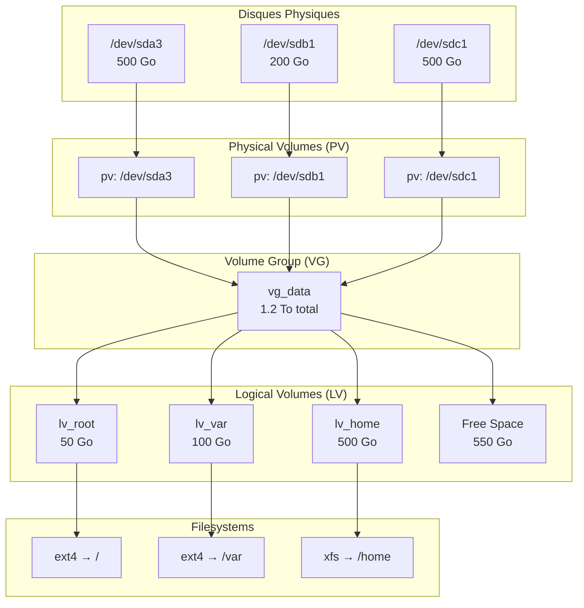

# Storage & Filesystem Hierarchy

`#fhs` `#lvm` `#disk` `#partitioning` `#inodes`

Organisation des fichiers et gestion avancée du stockage.

---

## Filesystem Hierarchy Standard (FHS)

### Répertoires Critiques pour l'Ops

| Répertoire | Contenu | Criticité |
|------------|---------|-----------|
| `/etc` | Configuration système | Haute - Backuper régulièrement |
| `/var` | Données variables (logs, BDD, mail) | Haute - Peut grossir rapidement |
| `/var/log` | Logs système et applicatifs | Haute - Surveillance espace |
| `/var/lib` | Données persistantes (Docker, MySQL) | Haute - Ne pas supprimer |
| `/tmp` | Fichiers temporaires (disque) | Moyenne - Nettoyé au reboot |
| `/run` | Runtime (RAM, tmpfs) | Basse - Volatile |
| `/usr` | Binaires et libs (read-only) | Moyenne - Stable |
| `/home` | Données utilisateurs | Variable - Quotas recommandés |
| `/opt` | Applications tierces | Basse - Installations manuelles |
| `/srv` | Données de services (web, ftp) | Variable - Dépend de l'usage |

!!! danger "SecNumCloud : Cloisonnement des Partitions"
    **Recommandation ANSSI** : Séparer les partitions critiques pour :

    1. **Éviter la saturation de `/`** - Un `/var/log` plein ne doit pas bloquer le système
    2. **Sécuriser `/tmp`** - Empêcher l'exécution de binaires malveillants
    3. **Isoler `/home`** - Protéger les données utilisateur

    **Schéma de partitionnement recommandé :**

    | Partition | Taille | Options de montage |
    |-----------|--------|-------------------|
    | `/` | 20-50 Go | defaults |
    | `/boot` | 1 Go | defaults |
    | `/tmp` | 5-10 Go | `noexec,nosuid,nodev` |
    | `/var` | 20+ Go | defaults |
    | `/var/log` | 10+ Go | defaults |
    | `/var/tmp` | 5 Go | `noexec,nosuid,nodev` |
    | `/home` | Reste | `noexec,nosuid,nodev` (optionnel) |
    | swap | 2-8 Go | - |

    **Exemple fstab sécurisé :**

    ```bash
    # /etc/fstab
    /dev/mapper/vg0-tmp    /tmp      ext4  defaults,noexec,nosuid,nodev  0 2
    /dev/mapper/vg0-var    /var      ext4  defaults                       0 2
    /dev/mapper/vg0-home   /home     ext4  defaults,nosuid,nodev          0 2
    ```

    **Options de sécurité :**

    - `noexec` : Interdit l'exécution de binaires
    - `nosuid` : Ignore les bits SUID/SGID
    - `nodev` : Ignore les fichiers de périphériques

---

## Gestion des Disques Physiques

### Commandes Essentielles

#### lsblk (Vision Arborescente)

```bash
lsblk

# Output:
NAME                  MAJ:MIN RM   SIZE RO TYPE MOUNTPOINT
sda                     8:0    0   500G  0 disk
├─sda1                  8:1    0   512M  0 part /boot/efi
├─sda2                  8:2    0     1G  0 part /boot
└─sda3                  8:3    0 498.5G  0 part
  ├─vg0-root          253:0    0    50G  0 lvm  /
  ├─vg0-swap          253:1    0     8G  0 lvm  [SWAP]
  ├─vg0-var           253:2    0    50G  0 lvm  /var
  └─vg0-home          253:3    0   390G  0 lvm  /home
sdb                     8:16   0   200G  0 disk
└─sdb1                  8:17   0   200G  0 part
  └─vg0-home          253:3    0   390G  0 lvm  /home

# Avec infos filesystem
lsblk -f
```

#### blkid (UUID pour fstab)

```bash
blkid

# Output:
/dev/sda1: UUID="ABCD-1234" TYPE="vfat" PARTLABEL="EFI"
/dev/sda2: UUID="12345678-abcd-..." TYPE="ext4" PARTLABEL="boot"
/dev/mapper/vg0-root: UUID="87654321-..." TYPE="ext4"

# UUID d'un device spécifique
blkid /dev/sda1

# Utilisation dans fstab (plus fiable que /dev/sdX)
UUID=12345678-abcd-... /boot ext4 defaults 0 2
```

#### df (Espace Disque)

```bash
# Espace avec type de filesystem
df -hT

# Output:
Filesystem           Type   Size  Used Avail Use% Mounted on
/dev/mapper/vg0-root ext4    50G   15G   32G  32% /
/dev/mapper/vg0-var  ext4    50G   20G   28G  42% /var
/dev/mapper/vg0-home ext4   390G  150G  220G  41% /home
tmpfs                tmpfs  7.8G     0  7.8G   0% /dev/shm

# Trier par utilisation
df -hT | sort -k6 -h
```

### Focus : Les Inodes

!!! warning "Disque \"plein\" avec de l'espace libre ?"
    Un filesystem a deux ressources limitées :

    1. **Espace disque** (octets)
    2. **Inodes** (métadonnées des fichiers)

    Un inode est créé pour chaque fichier/répertoire. **Même avec de l'espace libre, zéro inode = impossible de créer des fichiers.**

```bash
# Vérifier les inodes
df -i

# Output:
Filesystem            Inodes   IUsed   IFree IUse% Mounted on
/dev/mapper/vg0-root 3276800  125000 3151800    4% /
/dev/mapper/vg0-var  3276800 3276800       0  100% /var  ← PROBLÈME!
```

**Causes Typiques :**

- **Millions de fichiers de session PHP** (`/var/lib/php/sessions/`)
- **Cache applicatif non nettoyé**
- **Logs rotationnés en milliers de fichiers**
- **Maildir avec des millions de mails**

**Diagnostic :**

```bash
# Trouver le répertoire avec le plus de fichiers
find /var -xdev -type f | cut -d "/" -f 2-3 | sort | uniq -c | sort -rn | head

# Compter les fichiers dans un répertoire
find /var/lib/php/sessions -type f | wc -l

# Fichiers créés ces dernières 24h
find /var -type f -mtime -1 | wc -l
```

**Solutions :**

```bash
# Nettoyer les sessions PHP
find /var/lib/php/sessions -type f -mtime +1 -delete

# Recreer le filesystem avec plus d'inodes (dernier recours)
mkfs.ext4 -N 10000000 /dev/sdb1   # 10M inodes
```

---

## LVM (Logical Volume Manager)

### Architecture LVM



### Avantages de LVM

| Avantage | Description |
|----------|-------------|
| **Redimensionnement** | Agrandir/réduire les partitions à chaud |
| **Agrégation** | Combiner plusieurs disques en un seul volume |
| **Snapshots** | Sauvegardes instantanées |
| **Migration** | Déplacer des données entre disques |
| **Thin Provisioning** | Sur-allocation de l'espace |

---

### Cheatsheet LVM

#### Physical Volumes (PV)

```bash
# Lister les PV
pvs
pvdisplay

# Créer un PV
pvcreate /dev/sdb1

# Supprimer un PV (doit être vide)
pvremove /dev/sdb1

# Voir les détails
pvdisplay /dev/sdb1
```

#### Volume Groups (VG)

```bash
# Lister les VG
vgs
vgdisplay

# Créer un VG
vgcreate vg_data /dev/sdb1

# Ajouter un disque au VG (EXTENSION)
vgextend vg_data /dev/sdc1

# Retirer un disque du VG
vgreduce vg_data /dev/sdc1

# Voir les détails
vgdisplay vg_data
```

#### Logical Volumes (LV)

```bash
# Lister les LV
lvs
lvdisplay

# Créer un LV (taille fixe)
lvcreate -L 50G -n lv_data vg_data

# Créer un LV (% de l'espace libre)
lvcreate -l 100%FREE -n lv_data vg_data

# Agrandir un LV (ajouter 10 Go)
lvextend -L +10G /dev/vg_data/lv_data

# Agrandir un LV (utiliser tout l'espace libre)
lvextend -l +100%FREE /dev/vg_data/lv_data

# Réduire un LV (DANGER - voir procédure)
lvreduce -L 30G /dev/vg_data/lv_data

# Supprimer un LV
lvremove /dev/vg_data/lv_data

# Voir les détails
lvdisplay /dev/vg_data/lv_data
```

---

### Procédure : Agrandir un Disque à Chaud

**Scénario :** `/var` est plein, on veut ajouter 20 Go.

#### Étape 1 : Vérifier l'Espace Disponible

```bash
# Espace libre dans le VG
vgs

# Output:
VG       #PV #LV #SN Attr   VSize    VFree
vg_data    2   4   0 wz--n- 700.00g  150.00g  ← 150 Go libres
```

#### Étape 2 : Agrandir le LV

```bash
# Ajouter 20 Go au LV
sudo lvextend -L +20G /dev/vg_data/lv_var

# Ou utiliser tout l'espace libre
sudo lvextend -l +100%FREE /dev/vg_data/lv_var
```

#### Étape 3 : Agrandir le Filesystem

**CRITIQUE :** Le LV est agrandi, mais le filesystem ne le sait pas encore !

```bash
# Pour ext4 (à chaud, sans unmount)
sudo resize2fs /dev/vg_data/lv_var

# Pour XFS (à chaud, monté)
sudo xfs_growfs /var

# Vérifier
df -h /var
```

!!! tip "Raccourci : lvextend + resize en une commande"
    ```bash
    # L'option -r (resize) fait les deux étapes
    sudo lvextend -L +20G -r /dev/vg_data/lv_var
    ```

#### Si Pas d'Espace dans le VG

```bash
# 1. Ajouter un nouveau disque physique
sudo pvcreate /dev/sdd1

# 2. L'ajouter au VG
sudo vgextend vg_data /dev/sdd1

# 3. Maintenant, agrandir le LV
sudo lvextend -L +20G -r /dev/vg_data/lv_var
```

---

### Procédure : Réduire un LV (DANGER)

!!! danger "Réduire = Risque de Perte de Données"
    - **XFS ne peut pas être réduit** (seulement agrandi)
    - **ext4 doit être démonté** pour réduction
    - **Toujours faire un backup avant**

```bash
# 1. Démonter
sudo umount /var

# 2. Vérifier le filesystem
sudo e2fsck -f /dev/vg_data/lv_var

# 3. Réduire le filesystem D'ABORD
sudo resize2fs /dev/vg_data/lv_var 30G

# 4. Réduire le LV
sudo lvreduce -L 30G /dev/vg_data/lv_var

# 5. Remonter
sudo mount /var
```

---

## Swap

### Rappel

La swap est une extension de la RAM sur disque.

**Utilisations :**

- Éviter les crashs OOM (Out of Memory)
- Hibernation (suspend-to-disk)
- Décharger les pages mémoire inactives

### Fichier Swap vs Partition

| Aspect | Fichier Swap | Partition Swap |
|--------|--------------|----------------|
| Flexibilité | Facile à redimensionner | Nécessite repartitionnement |
| Performance | Légèrement inférieure | Optimale |
| Création | Simple (fallocate) | Nécessite fdisk/parted |
| Recommandation | **Préféré pour flexibilité** | Installations initiales |

### Créer un Fichier Swap

```bash
# 1. Créer le fichier (4 Go)
sudo fallocate -l 4G /swapfile

# Alternative si fallocate échoue (btrfs)
sudo dd if=/dev/zero of=/swapfile bs=1M count=4096

# 2. Sécuriser les permissions
sudo chmod 600 /swapfile

# 3. Formater en swap
sudo mkswap /swapfile

# 4. Activer
sudo swapon /swapfile

# 5. Vérifier
swapon --show
free -h

# 6. Rendre permanent (ajouter à fstab)
echo '/swapfile none swap sw 0 0' | sudo tee -a /etc/fstab
```

### Modifier la Swap Existante

```bash
# Désactiver
sudo swapoff /swapfile

# Redimensionner (ex: 8 Go)
sudo fallocate -l 8G /swapfile
sudo mkswap /swapfile

# Réactiver
sudo swapon /swapfile
```

### Swappiness

Contrôle l'agressivité du swap (0-100).

| Valeur | Comportement |
|--------|--------------|
| 0 | Swap uniquement pour éviter OOM |
| 10 | Swap minimal (serveurs avec beaucoup de RAM) |
| 60 | Défaut Ubuntu |
| 100 | Swap agressif |

```bash
# Voir la valeur actuelle
cat /proc/sys/vm/swappiness

# Modifier temporairement
sudo sysctl vm.swappiness=10

# Modifier définitivement
echo 'vm.swappiness=10' | sudo tee -a /etc/sysctl.conf
```

---

## Référence Rapide

```bash
# Disques
lsblk                              # Vue arborescente
lsblk -f                           # Avec filesystems
df -hT                             # Espace + type
df -i                              # Inodes
blkid                              # UUID

# LVM
pvs / vgs / lvs                    # Lister
pvcreate /dev/sdX                  # Créer PV
vgextend vg_name /dev/sdX          # Ajouter disque
lvextend -L +10G -r /dev/vg/lv     # Agrandir LV + FS

# Filesystem resize
resize2fs /dev/vg/lv               # ext4
xfs_growfs /mount/point            # xfs

# Swap
fallocate -l 4G /swapfile          # Créer fichier
mkswap /swapfile                   # Formater
swapon /swapfile                   # Activer
swapon --show                      # Vérifier
```
