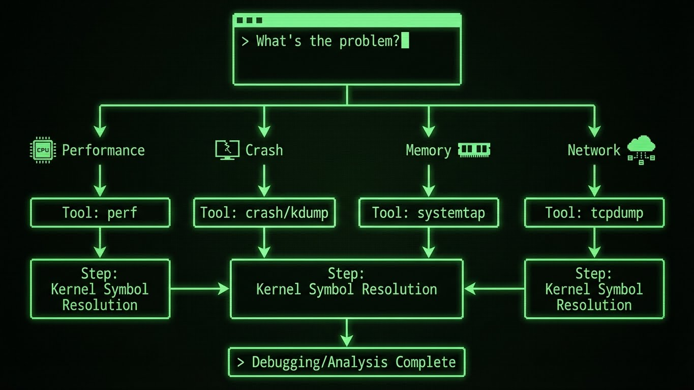

---
tags:
  - kernel
  - debugging
  - crash
  - performance
  - ebpf
---

# Kernel Debugging & Troubleshooting

Quand `top` et `htop` ne suffisent plus. Comment analyser un système qui freeze, qui panic, ou qui ralentit sans raison visible.



## 1. Magic SysRq Keys : Le Kit de Survie

Si le serveur est freezé (plus de SSH, plus de clavier), le noyau écoute peut-être encore. Les **Magic SysRq** permettent d'envoyer des commandes directement au kernel.

**Activation :**
```bash
# Vérifier si activé (1 = tout activé)
cat /proc/sys/kernel/sysrq

# Activer temporairement
echo 1 > /proc/sys/kernel/sysrq
```

**Utilisation :**
Appuyer sur `ALT` + `ImpÉcran` (SysRq) + `Lettre`.

| Lettre | Action | Mnémonique |
|--------|--------|------------|
| **R** | **R**aw | Reprendre le contrôle du clavier (si Xorg planté). |
| **E** | t**E**rminate | Envoie SIGTERM à tous les processus (sauf init). |
| **I** | k**I**ll | Envoie SIGKILL à tous les processus (brutal). |
| **S** | **S**ync | Écrit les données en cache sur le disque (Sauve les meubles !). |
| **U** | **U**nmount | Remonte les disques en lecture seule. |
| **B** | re**B**oot | Redémarre la machine immédiatement. |

> **Séquence REISUB** : La méthode propre pour redémarrer un serveur planté sans corrompre le disque ("Reboot Even If System Utterly Broken").

## 2. Kdump & Crash : Analyser un Kernel Panic

Pourquoi mon serveur a-t-il redémarré cette nuit ? Sans **kdump**, vous ne le saurez jamais.

### Principe
Kdump réserve un petit bout de RAM au démarrage. En cas de crash, un mini-kernel se lance dans cette RAM réservée pour copier la mémoire vive (le dump `vmcore`) sur le disque.

### Installation (RHEL/CentOS)
```bash
dnf install kexec-tools crash
systemctl enable --now kdump
```

### Configuration Kdump

Fichier `/etc/kdump.conf` :
```bash
# Destination du dump (local ou remote)
path /var/crash
core_collector makedumpfile -l --message-level 1 -d 31

# Compression pour gagner de l'espace
compress zstd

# Action après le dump
default reboot

# SSH remote dump (optionnel)
# ssh user@server
# sshkey /root/.ssh/kdump_id_rsa
# path /remote/crash

# Filtrer les pages mémoire à capturer (-d 31 = exclure zero pages, cache, etc.)
# Niveaux de dump :
# 1 : Tout (énorme)
# 31 : Optimal (exclut les données non essentielles)
```

Réserver de la RAM pour kdump :
```bash
# Éditer GRUB
vim /etc/default/grub
# Ajouter crashkernel=auto (ou crashkernel=256M pour 256 Mo)
GRUB_CMDLINE_LINUX="... crashkernel=auto"

# Régénérer GRUB
grub2-mkconfig -o /boot/grub2/grub.cfg
reboot
```

Vérifier la réservation :
```bash
dmesg | grep -i crash
# Sortie attendue : "Reserving 256MB of memory at 3584MB for crashkernel"
```

### Analyse Post-Mortem avec Crash

Une fois le fichier `vmcore` généré dans `/var/crash/`, on l'analyse avec l'outil `crash`.

```bash
crash /usr/lib/debug/lib/modules/$(uname -r)/vmlinux /var/crash/127.0.0.1-2024.../vmcore
```

**Commandes essentielles dans crash :**

| Commande | Description |
|----------|-------------|
| `log` | Affiche dmesg (logs kernel avant le crash) |
| `bt` | Backtrace de la tâche en cours |
| `ps` | Liste tous les processus |
| `files` | Fichiers ouverts par un processus |
| `vm` | Informations mémoire d'un processus |
| `kmem -i` | Statistiques mémoire kernel |
| `mod` | Modules kernel chargés |
| `dis <fonction>` | Désassemble une fonction |
| `struct task_struct <addr>` | Examine une structure kernel |

**Walkthrough d'analyse de crash :**

```bash
crash> log
[  123.456789] BUG: unable to handle kernel NULL pointer dereference at 0000000000000008
[  123.456790] IP: [<ffffffffa1234567>] my_driver_function+0x42/0x80 [my_module]
[  123.456791] PGD 0
[  123.456792] Oops: 0002 [#1] SMP
[  123.456793] Modules linked in: my_module(POE) ...

crash> bt
PID: 1234   TASK: ffff88003a5c0000  CPU: 2   COMMAND: "worker_thread"
 #0 [ffff88003f4c7c00] machine_kexec at ffffffff81059c4b
 #1 [ffff88003f4c7c60] __crash_kexec at ffffffff81105182
 #2 [ffff88003f4c7d30] panic at ffffffff8167d5e3
 #3 [ffff88003f4c7db0] oops_end at ffffffff81038c8a
 #4 [ffff88003f4c7dd8] no_context at ffffffff8106e4b6
 #5 [ffff88003f4c7e28] __bad_area_nosemaphore at ffffffff8106e5a3
 #6 [ffff88003f4c7e70] bad_area_nosemaphore at ffffffff8106e6f4
 #7 [ffff88003f4c7e80] __do_page_fault at ffffffff8106ea9e
 #8 [ffff88003f4c7f00] do_page_fault at ffffffff81684a9e
 #9 [ffff88003f4c7f30] page_fault at ffffffff81680d08
    [exception RIP: my_driver_function+66]
    RIP: ffffffffa1234567  RSP: ffff88003f4c7fe8  RFLAGS: 00010246
    RAX: 0000000000000000  RBX: ffff88003b2c1800  RCX: 0000000000000001
    ...

crash> ps | grep worker
   1234      2   2  ffff88003a5c0000  IN   0.0       0      0  [worker_thread]

crash> files 1234
PID: 1234   TASK: ffff88003a5c0000  CPU: 2   COMMAND: "worker_thread"
ROOT: /    CWD: /
 FD       FILE            DENTRY           INODE       TYPE PATH
  0 ffff880037a1c600 ffff880039d9e180 ffff88003c4b7e40 CHR  /dev/null
  3 ffff880038b2d400 ffff88003a5c8900 ffff88003b1c3f80 REG  /var/log/app.log

crash> mod | grep my_module
ffffffffa1230000  my_module  20480  (not loaded)  [CONFIG_MODVERSIONS]
```

**Diagnostic :** Le module `my_module` a tenté d'accéder à un pointeur NULL (`0x0000000000000008`), causant un kernel panic.

## 3. Taint Kernel : "C'est pas ma faute"

Si vous voyez "Tainted: G" dans vos logs, le kernel vous dit qu'il n'est plus dans un état supporté.

*   `P` : Module propriétaire chargé (Nvidia, VMWare).
*   `F` : Module forcé (version incompatible).
*   `O` : Module out-of-tree (compilé à la main).
*   `E` : Un module non signé a été chargé.

```bash
# Vérifier l'état
cat /proc/sys/kernel/tainted
# 0 = Clean
```

## 4. eBPF : Le Futur du Tracing

Oubliez `strace` (qui ralentit l'application). **eBPF** (Extended Berkeley Packet Filter) permet d'exécuter du code sandboxé directement dans le kernel pour observer sans impacter.

**Outils BCC (BPF Compiler Collection) :**
Des scripts prêts à l'emploi pour tout analyser.

```bash
sudo apt install bpfcc-tools

# Qui ouvre quels fichiers ? (Top des I/O disque)
sudo opensnoop-bpfcc

# Quelle commande Bash est exécutée ? (Espionnage)
sudo execsnoop-bpfcc

# Latence des disques (Histogramme)
sudo biolatency-bpfcc

# Qui écoute sur le réseau ?
sudo solisten-bpfcc
```

> **Note** : Ces outils voient TOUT, même les conteneurs Docker et les processus éphémères.

### BPFtrace : One-Liners Puissants

BPFtrace offre un langage de scripting pour créer des tracers custom.

```bash
# Installer bpftrace
sudo apt install bpftrace

# Tracer tous les appels système open()
sudo bpftrace -e 'tracepoint:syscalls:sys_enter_open { printf("%s %s\n", comm, str(args->filename)); }'

# Latence des appels read() par processus
sudo bpftrace -e 'tracepoint:syscalls:sys_enter_read { @start[tid] = nsecs; }
                   tracepoint:syscalls:sys_exit_read /@start[tid]/ {
                       @latency_us[comm] = hist((nsecs - @start[tid]) / 1000);
                       delete(@start[tid]);
                   }'

# Compter les appels système par type
sudo bpftrace -e 'tracepoint:raw_syscalls:sys_enter { @[args->id] = count(); }'

# Tracer les allocations mémoire > 1MB
sudo bpftrace -e 'tracepoint:kmem:kmalloc /args->bytes > 1048576/ {
                     printf("%s allocated %d bytes\n", comm, args->bytes);
                   }'

# Profiler les fonctions kernel (flamegraph)
sudo bpftrace -e 'profile:hz:99 { @[kstack] = count(); }'
```

**Sortie exemple (latence read) :**
```text
@latency_us[nginx]:
[0]                  123 |                                                    |
[1]                  456 |@@                                                  |
[2, 4)              2341 |@@@@@@@@@@@@@@@@@                                   |
[4, 8)              3892 |@@@@@@@@@@@@@@@@@@@@@@@@@@@@@@                      |
[8, 16)             5123 |@@@@@@@@@@@@@@@@@@@@@@@@@@@@@@@@@@@@@@@@            |
[16, 32)            6789 |@@@@@@@@@@@@@@@@@@@@@@@@@@@@@@@@@@@@@@@@@@@@@@@@@@@@|
```

## 5. Ftrace : Tracing Kernel Natif

Ftrace est intégré au kernel Linux et ne nécessite aucune installation.

```bash
# Monter debugfs si nécessaire
mount -t debugfs none /sys/kernel/debug

cd /sys/kernel/debug/tracing

# Lister les tracers disponibles
cat available_tracers
# Sortie : function function_graph blk wakeup irqsoff...

# Tracer toutes les fonctions kernel (verbeux !)
echo function > current_tracer
echo 1 > tracing_on
sleep 2
echo 0 > tracing_on
cat trace | head -20

# Tracer uniquement les fonctions d'un module
echo 'ext4_*' > set_ftrace_filter
echo function > current_tracer
echo 1 > tracing_on

# Function graph (affiche les appels imbriqués)
echo function_graph > current_tracer
echo do_sys_open > set_graph_function
echo 1 > tracing_on
# Effectuer une action...
echo 0 > tracing_on
cat trace
```

**Sortie exemple (function_graph) :**
```text
 2)               |  do_sys_open() {
 2)               |    getname() {
 2)   0.123 us    |      kmem_cache_alloc();
 2)   0.234 us    |      strncpy_from_user();
 2)   1.234 us    |    }
 2)               |    path_openat() {
 2)               |      ext4_file_open() {
 2)   0.456 us    |        ext4_inode_attach_jinode();
 2)   1.234 us    |      }
 2)   2.345 us    |    }
 2)   4.567 us    |  }
```

## 6. Perf : Le Profiler Kernel

**Perf** analyse les performances CPU, cache, branches, etc.

```bash
# Installer perf
sudo apt install linux-tools-$(uname -r)

# Profiler tout le système pendant 10 secondes
sudo perf record -a -g sleep 10
sudo perf report

# Profiler un processus spécifique
sudo perf record -p <PID> -g sleep 10

# Statistiques globales (cache miss, branches, etc.)
sudo perf stat -a sleep 5

# Tracer les appels système
sudo perf trace -p <PID>

# Flamegraph (nécessite scripts)
sudo perf record -F 99 -a -g -- sleep 30
sudo perf script > out.perf
# Utiliser flamegraph.pl pour visualiser
```

**Sortie exemple (perf report) :**
```text
# Overhead  Command   Shared Object      Symbol
# ........  ........  .................  ............................
    45.23%  postgres  libc-2.31.so       [.] __memcpy_avx_unaligned
    12.45%  postgres  postgres           [.] hash_search_with_hash_value
     8.67%  postgres  postgres           [.] AllocSetAlloc
     5.34%  postgres  [kernel.kallsyms]  [k] copy_user_enhanced_fast_string
     3.21%  postgres  [kernel.kallsyms]  [k] _raw_spin_lock
```

**Sortie exemple (perf stat) :**
```bash
 Performance counter stats for 'system wide':

      8,234.56 msec cpu-clock                 #    7.998 CPUs utilized
         1,234      context-switches          #    0.150 K/sec
           123      cpu-migrations            #    0.015 K/sec
        12,345      page-faults               #    0.001 M/sec
   24,567,890,123  cycles                     #    2.983 GHz
   15,678,901,234  instructions               #    0.64  insn per cycle
    3,456,789,012  branches                   #  419.876 M/sec
       12,345,678  branch-misses              #    0.36% of all branches

       1.029834567 seconds time elapsed
```

## 7. Live Debugging : /proc et /sys

Le kernel expose en temps réel des données via `/proc` et `/sys`.

```bash
# Informations CPU
cat /proc/cpuinfo

# Statistiques mémoire détaillées
cat /proc/meminfo

# Interruptions par CPU
cat /proc/interrupts

# Statistiques I/O disque
cat /proc/diskstats

# Modules kernel chargés
cat /proc/modules

# Info sur un processus
cat /proc/<PID>/status    # État, mémoire, threads
cat /proc/<PID>/cmdline   # Ligne de commande
cat /proc/<PID>/environ   # Variables d'environnement
cat /proc/<PID>/fd/       # Descripteurs de fichiers ouverts
cat /proc/<PID>/maps      # Carte mémoire
cat /proc/<PID>/stack     # Stack kernel du processus

# Paramètres kernel modifiables (sysctl)
cat /proc/sys/kernel/hostname
cat /proc/sys/vm/swappiness
cat /proc/sys/net/ipv4/ip_forward

# Afficher la configuration réseau kernel
ls /sys/class/net/
cat /sys/class/net/eth0/speed
cat /sys/class/net/eth0/carrier

# Thermal zones (température CPU)
cat /sys/class/thermal/thermal_zone*/temp
```

## 8. Analyse des Logs Kernel

### Dmesg : Le Journal du Kernel

```bash
# Logs bruts
dmesg

# Logs horodatés
dmesg -T

# Suivre en temps réel
dmesg -w

# Filtrer par niveau (err, warn, info)
dmesg -l err,warn

# Chercher des patterns
dmesg | grep -i 'error\|fail\|panic\|oom'
dmesg | grep -i 'segfault'
```

**Patterns courants :**
```bash
# OOM Killer (mémoire épuisée)
dmesg | grep 'Out of memory'
# Sortie : Out of memory: Kill process 1234 (java) score 890 or sacrifice child

# Segmentation fault
dmesg | grep 'segfault'
# Sortie : myapp[1234]: segfault at 7f8a9c0 ip 00007f8a9c0 sp 00007ffc error 4 in libc.so.6

# Erreurs I/O disque
dmesg | grep -i 'I/O error'
# Sortie : [sda] I/O error, dev sda, sector 123456

# Watchdog timeout (freeze CPU)
dmesg | grep 'soft lockup'
# Sortie : BUG: soft lockup - CPU#2 stuck for 22s! [swapper:0]
```

### Journalctl : Logs Kernel avec Systemd

```bash
# Logs kernel uniquement
journalctl -k

# Depuis le dernier boot
journalctl -k -b

# Boot précédent (après un crash)
journalctl -k -b -1

# Logs kernel en temps réel
journalctl -k -f

# Priorité error ou plus grave
journalctl -k -p err

# Entre deux dates
journalctl -k --since "2025-01-01 08:00:00" --until "2025-01-01 10:00:00"

# Exporter en JSON
journalctl -k -o json-pretty
```

## 9. Diagramme : Flux Kdump

```mermaid
graph TD
    A[Système en Production] -->|Kernel Panic| B[Capture SysRq]
    B --> C{Kdump Activé ?}
    C -->|Non| D[Reboot Direct<br/>Perte d'Info]
    C -->|Oui| E[Kexec - Mini Kernel]
    E --> F[Réserve RAM<br/>crashkernel=256M]
    F --> G[Copie Mémoire<br/>makedumpfile]
    G --> H[Compression vmcore]
    H --> I{Destination}
    I -->|Local| J[/var/crash/vmcore]
    I -->|SSH| K[Serveur Remote]
    J --> L[Reboot Automatique]
    K --> L
    L --> M[Analyse Post-Mortem]
    M --> N[crash vmlinux vmcore]
    N --> O[Commandes]
    O --> P[bt - Backtrace]
    O --> Q[log - Dmesg]
    O --> R[ps - Processus]
    O --> S[files - FD ouverts]
    P --> T[Root Cause Analysis]
    Q --> T
    R --> T
    S --> T
    T --> U[Correctif Code/Driver]

    style C fill:#FF9800800999
    style E fill:#99ff99
    style T fill:#9999ff
    style U fill:#ffff99
```

## Résumé des Outils

| Outil | Usage | Quand l'utiliser |
|-------|-------|------------------|
| **Magic SysRq** | Commandes kernel d'urgence | Système freezé, plus de SSH |
| **kdump/crash** | Analyse post-mortem | Après un kernel panic |
| **eBPF/BCC** | Tracing sans overhead | Debug production, monitoring temps réel |
| **bpftrace** | One-liners custom | Hypothèses rapides à valider |
| **ftrace** | Tracing kernel natif | Analyser le chemin d'exécution kernel |
| **perf** | Profiling performance | Identifier les hotspots CPU |
| **/proc /sys** | Lecture d'état live | Debug en cours, infos temps réel |
| **dmesg/journalctl** | Logs kernel | Recherche d'erreurs historiques |

## Exercices Pratiques

1. **Kdump** : Configurez kdump avec `crashkernel=256M`, déclenchez un panic avec `echo c > /proc/sysrq-trigger`, puis analysez le vmcore.
2. **eBPF** : Utilisez `opensnoop-bpfcc` pour identifier quel processus ouvre `/etc/passwd` en boucle.
3. **Ftrace** : Tracez la fonction `do_sys_open` et identifiez les fichiers ouverts par un processus donné.
4. **Perf** : Profilez un serveur web avec `perf record -a -g` et identifiez la fonction qui consomme le plus de CPU.
5. **Log Analysis** : Recherchez dans `dmesg` les 3 derniers OOM kills et identifiez les processus tués.
